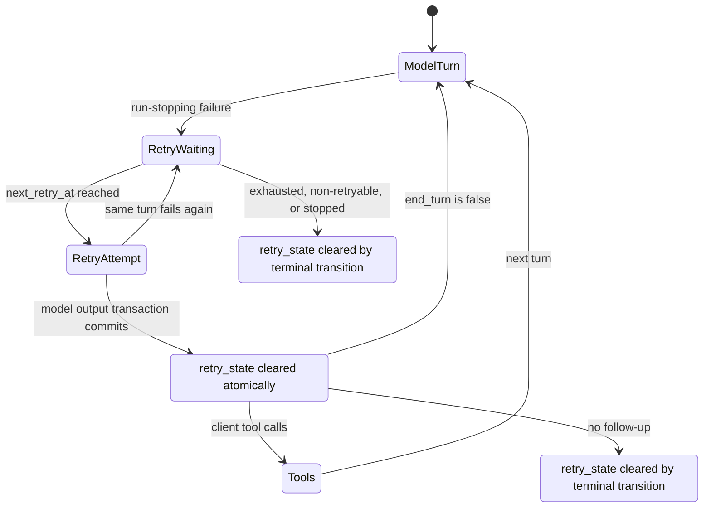

# Turn-scoped Failed-run Retry

## Problem

Failed-run retry state currently survives successful model turns inside one `AgentRun`. A later failure therefore continues the previous turn's failed-attempt count, attempt history, and exponential backoff instead of starting a fresh retry cycle.

The worker hides retry state only in its process-local WebSocket projection when backoff ends. It retains `agent_runs.retry_state` for takeover recovery and never clears that durable state when the retried model turn succeeds. `GET /live` always projects the durable value, so a REST resync can restore an obsolete retry card after the run has advanced through later turns or changed inference profiles.

The product policy is that a retry budget belongs to one model turn. Worker handover must preserve a retry cycle only until that same model turn produces committed output.

## Goals

- Scope failed-attempt count, history, and backoff to one model turn.
- Preserve the current turn's retry cycle across backoff, in-flight retry, worker shutdown, and ownership takeover.
- Clear durable retry state atomically with successful model output admission.
- Keep WebSocket and REST live retry projections consistent.
- Prevent a stale retry cycle from being attributed to a later turn or a newly selected inference profile.
- Correct the Living Specs and supersede the run-scoped portion of ADR-0084 without rewriting implemented history.

## Non-goals

- Change the maximum retry count or exponential backoff formula.
- Add provider-specific retry classification or provider fallback.
- Change terminal failed-run finalization or manual retry semantics.
- Add a new database column or public API field.
- Preserve compatibility with the incorrect run-scoped budget behavior.

## Research Findings

### BUG-1: Retry budget leaks into later model turns

`RunExecutor` initializes `attempt_number` and `current_retry_state` once around an `engine.run()` attempt. `AgentRunExecution.run()` can execute multiple model/tool turns before returning. After a failed model call recovers, neither value is reset when the successful model output is committed. A later model failure therefore uses `previous_retry_state` and increments the prior turn's count.

### BUG-2: Durable retry state outlives successful recovery

The current `clear_live_retry_state()` helper clears only the process-local `live_retry_state` variable and publishes a WebSocket snapshot. It does not call the repository or lifecycle service. The durable `agent_runs.retry_state` remains until a terminal run transition or a later failure overwrites it. REST `/live` reads that durable value directly and can resurrect the card.

### BUG-3: Takeover cannot distinguish an active retry from a completed one

A recovering worker treats every non-null `retry_state` on a running run as active. It restores the previous count, honors the stored `next_retry_at`, and executes another attempt. With stale state from a completed turn, takeover can replay work under the old budget or make a later failure exhaust that budget prematurely. The state itself has no completed/stale discriminator.

### BUG-4: Expired retry timestamps create indefinite current-error UI

`RunRetryCard` clamps an expired `next_retry_at` countdown to zero and renders `retryingNow`. `/live` does not validate retry state against turn completion or current phase. Because the live run's inference profile comes from the current Session snapshot while the retry error comes from the stale run JSON, a resync can visually associate an old provider error with a later profile.

### BUG-5: Decision and Living Spec drift

ADR-0084 requires durable retry progress to survive recovery for a running run, but does not delimit that progress to one model turn. `run-resume.md` likewise describes the running run as the retry scope. Meanwhile `agent-execution-loop.md` and `conversation.md` say retry state is cleared when the next attempt begins, which conflicts with both the implementation and the recovery requirement for an in-flight retry. The implemented retry recovery UX design expects the retry card to remain visible while a retry model call is waiting or streaming.

## Decision Points

### Retry cycle boundary

**Options**

- Clear when backoff expires: removes the card early but loses durable takeover progress during the in-flight retry unless another state model is introduced.
- Clear when a model call enters a later turn: preserves takeover progress but leaves a crash window after successful output is committed.
- Clear in the transaction that commits successful model output: preserves active retry recovery and makes output admission the durable end of the cycle.

**Decision**: Clear in the successful model-output admission transaction. This is the first durable proof that the failed model turn recovered and gives the required atomicity.

### Executor-local reset signal

**Options**

- Treat a `turn_marker` as the signal: unavailable when the provider omits usage.
- Add a new public engine/WebSocket event: expands the protocol for an internal lifecycle transition.
- Use existing post-commit signals: the `executing_tools` phase for client-tool output and the first durable model-output emit for every successful turn.

**Decision**: The execution core clears durable retry state for every committed model output. The worker resets its executor-local retry cycle when it observes either existing post-commit signal. Durable model-output delivery covers tool-less `end_turn = false` continuation and output without a usage marker; `executing_tools` can reset earlier for client-tool output.

### Live card during an in-flight retry

**Options**

- Hide the card after backoff and keep only model dots: conflicts with REST recovery because durable state must remain for takeover.
- Keep the card until the model turn succeeds: REST and WebSocket show the same active retry cycle, and model dots can appear beneath it.

**Decision**: Keep the retry card while backoff or the retry model call is active. Clear it only when the successful output commit ends the cycle or the run becomes terminal.

## Proposed Design

### Durable lifecycle

1. A run-stopping failure creates or advances `FailedRunRetryState` for the current model turn.
2. The state remains on the running `agent_runs` row during backoff and during the following in-flight attempt.
3. If ownership changes before successful output admission, the new worker restores the same count/history and retries without bypassing backoff.
4. When normalized model output is durably appended, the same database transaction sets `agent_runs.retry_state = null`.
5. The first durable model-output emit resets `RunExecutor`'s process-local `current_retry_state`, `live_retry_state`, and next failed-attempt number. For client tool calls, the committed `executing_tools` phase may perform the same idempotent reset first.
6. Tool execution and every later model turn, including tool-less `end_turn = false` continuation, therefore start without the previous model turn's retry budget.
7. Terminal transitions continue to clear retry state defensively.

### Recovery safety

The durable distinction is not a new status field. It is the presence of retry state before output commit and its absence after output commit. The output events and retry-state clear share one transaction, so takeover observes one of two valid states:

- output not committed plus retry state present: resume the active model-turn retry;
- output committed plus retry state absent: continue from transcript with a fresh budget.

A crash after the provider responds but before the transaction commits remains an at-least-once retry, matching existing recovery semantics. A crash after the transaction commits cannot revive the old retry state.

### Live projection

`run.retry` continues to be a direct projection of durable `agent_runs.retry_state`. The worker no longer publishes a process-local retry clear merely because the countdown elapsed. This removes the WebSocket/REST split. The card remains valid during `waiting_for_model` and `streaming_model`; on committed success, the durable clear and the following phase, durable-output, or terminal projection remove it.

No public schema or frontend component change is required.

## API and Data Model Changes

- No database migration.
- No public REST or WebSocket schema change.
- `FailedRunRetryState` retains its existing JSON schema.
- Only its lifecycle invariant changes from run-scoped persistence to current-model-turn persistence.

## Error Handling

- A failure before successful output commit advances the same retry cycle.
- A failure after successful output commit starts a new cycle at failed attempt 1, including unexpected tool/engine failures.
- Non-retryable classification and retry exhaustion remain terminal for that current cycle.
- Terminal helpers remain a defensive final clear.

## Security and Permissions

The change does not add inputs, permissions, or sensitive fields. User-safe retry summaries remain the only retry data projected to clients. Internal messages, provider payloads, stack traces, and credentials remain excluded.

## Migration and Rollout

No schema migration is needed because retry state is nullable JSON. New successful output commits repair active rows naturally by clearing retry state. Terminal transitions continue to clear it. The implementation does not add a legacy fallback for the incorrect run-scoped behavior.

Deployment ordering is unconstrained because backend APIs are unchanged.

## Test Strategy

### E2E primary verification matrix

Use the deterministic AIMock fixture and public chat APIs.

| Scenario | Expected evidence |
| --- | --- |
| Current turn fails, retries, then succeeds with a tool call | `/live.run.retry` shows attempt 1 before recovery; durable history has no terminal failed-run error. |
| Tool-call output is committed and the run continues | A fresh `/live` snapshot no longer contains the previous retry state. |
| Following model turn fails | The new live retry state has `failed_attempt_count = 1` and contains only the new turn's attempt history. |
| Following retry succeeds | Final assistant output is durable and the terminal history has no failed-run error. |

The fixture uses only deterministic local AIMock behavior and the built-in runtime exec tool; no external credential or prerequisite snapshot is required. CI runs it in the normal non-`live_external` E2E suite. Missing required fixture matches are failures, not skips.

### Backend tests

- `AgentRunExecution` clears retry state in the same session scope that appends successful output, including output with no usage marker.
- `RunExecutor` resets count/history at committed multi-turn continuation and keeps count/history for repeated failures before success.
- Retry live state remains present during the in-flight retry and disappears after committed success.
- Recovered active retry continues from persisted count/backoff.
- Repository terminal transitions continue to clear retry state.

### Evidence format

PR evidence records the exact pytest targets and their pass counts. CI is authoritative for the deterministic E2E suite. No live/external verification is required.

## Alternatives Considered

### Add a retry turn identifier to `FailedRunRetryState`

Rejected for this correction. A turn identifier would require defining and persisting turn start identity before provider invocation, plus migration/compatibility handling for existing JSON. Atomic output admission already provides an unambiguous lifecycle boundary.

### Clear retry state when backoff ends

Rejected. A worker crash during the in-flight model call would reset the budget and bypass the intended backoff sequence.

### Filter expired retry timestamps only in `/live`

Rejected. It would hide some stale UI but leave incorrect retry counts and takeover behavior, and an expired timestamp is valid during an active in-flight retry.

## Required Documentation Updates

- Add ADR-0145 to supersede ADR-0084 only for retry-budget scope and success lifecycle.
- Update `agent-execution-loop.md` with the turn-scoped invariant and atomic output commit.
- Update `run-resume.md` so takeover preserves only the current model turn's retry cycle.
- Update `conversation.md` and `chat-session-resync.md` so `run.retry` is present exactly while that cycle is active.

## Open Risks and Assumptions

- The design assumes `executing_tools` and durable model-output delivery occur only after the output/retry-state transaction commits; the execution code and tests must preserve that ordering.
- Provider output without usage must still clear retry state; the clear cannot depend on a `turn_marker`.
- If output publication fails after the database transaction commits, recovery must trust the transcript and cleared retry state rather than reconstructing the old cycle.
