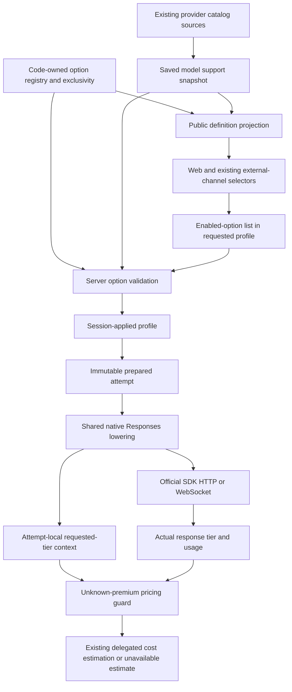

# Ultrafast Model Execution Design

- Snapshot: `ultrafast-260930`.
- Document reference: `ultrafast-260930/DESIGN`.
- Design revision: `1`.
- Product authority: requester-confirmed
  [Requirements](../requirements/ultrafast-260930-ultrafast-execution.md).
- Decision authority: accepted
  [ADR-D1](../adr/ultrafast-260930-ultrafast-execution.md#adr-d1-representation-of-exclusive-speed-selection).
- Mode: Collaborative; unresolved material decisions and complete Design approval
  belong to the requester.
- Scope: design only. This document neither records implementation nor authorizes
  implementation without a separate requester instruction.

## Current Behavior and Requirement Gaps

Current sources are the [model catalog Spec](../spec/domain/model-catalog.md),
[Agent inference-profile Spec](../spec/domain/agent.md),
[ChatGPT OAuth Spec](../spec/flow/chatgpt-oauth.md), and
[execution-loop Spec](../spec/flow/agent-execution-loop.md).
Existing channel controls retain the
[External Channel domain](../spec/domain/external-channel.md) and
[model-setting authorization](../spec/flow/external-channel-authorization.md)
boundaries.

Fast is the only implemented execution option. A saved model selection owns its
supported IDs; requested, Session-applied, and prepared profiles own enabled IDs.
Code-owned definitions supply public labels and provider-specific qualitative
cost hints. The composer treats individual IDs as independent toggles. API-facing
web validation and live Session profile readers recognize only `fast`.

The current registry validator combines supported-list and enabled-list
validation. Definition enumeration validates all supported IDs as if all were
enabled. That is valid with one option but cannot represent a model supporting
multiple mutually exclusive options. Discord and Slack model-setting drafts also
present options as multi-select controls. The token-usage profile detail shows a
Fast on/off row rather than the exclusive preference.

OpenAI API-key support uses reviewed exact model identifiers. ChatGPT OAuth
support uses the connected account's `service_tiers`; currently only `priority`
and `fast` advertise Fast. Saved selection snapshots do not automatically change
when a catalog is synchronized. Runtime does not rediscover support.

Native Responses lowering currently maps enabled Fast to `priority`. All-off is
`default` for a support-aware OpenAI API model and omitted for ChatGPT OAuth.
Existing official SDK HTTP and WebSocket sampling paths already carry the field.
The installed OpenAI SDK is 2.54.0 and LiteLLM is 1.91.3. Offline tests demonstrate
Ultrafast serialization and completion parsing with this SDK, despite its narrower
static service-tier literal. The installed calculator maps Ultrafast to Standard
price keys; the existing guard covers missing Priority prices only.

## Requirement Traceability

References in this table are qualified by `ultrafast-260930`.

| Requirement | Accepted decision and retained authority | Mechanisms | Primary verification |
| --- | --- | --- | --- |
| REQ-1: supported-model availability | ADR-D1; model-catalog support projection and saved-selection authority | M1, M2, M3 | Catalog fixture, saved selection refresh, unsupported and unrelated provider rejection |
| REQ-2: explicit exclusive choice | ADR-D1; existing composer/profile save behavior | M1, M3, M4 | Browser Normal/Fast/Ultrafast flow, keyboard/mobile, failed save, model switch |
| REQ-3: preserve execution choices and visible rejection | ADR-D1; native Responses and existing failure boundaries | M3, M5, M6 | Provider journal, validation failures, deterministic provider rejection, HTTP/WS adapter fixtures |
| REQ-4: existing profile lifecycle | ADR-D1; Agent and OAuth lifecycle Specs | M3, M5, M6 | Reload, queued/prepared work, retry/recovery, inheritance, auxiliary-call assertions |
| REQ-5: cost and usage honesty | Existing actual-tier/delegated-pricing contract; REQ-6 fixed dependencies | M4, M7 | Premium explanation, served-tier matrix, unavailable cost and successful output |
| REQ-6: bounded adoption | ADR-D1; unchanged dependencies, authorization, model selection and authentication | M2, M3, M5, M6, M8, M9 | Ordinary/Fast regressions, old snapshots, permissions, generated contracts, no dependency diff |

## Architecture and Ownership

The registry owns the option relationship, not provider discovery. The catalog and
saved model selection own support, not user preference. Enabled-option lists own
preference; no separate persisted speed field is introduced. Prepared state owns
one attempt. The response owns the actual served tier; neither the picker nor the
requested tier can assert which tier the provider served. LiteLLM remains the sole
delegated calculator. No billing multiplier or local pricing authority is added.

## Option Contract and Validation

### Public definitions and canonical state — M1

Extend `core/model_execution_options.py` with `ULTRAFAST = "ultrafast"`. Give Fast
and Ultrafast the same code-owned exclusivity group. A concrete local field shape
is nullable `exclusive_group` on `ModelExecutionOptionDefinition`, with
`processing_speed` as this group's ID. Preserve per-option boolean semantics and
the existing `control` contract; relationship metadata tells consumers to present
the group as an exclusive choice.

The accepted representations are:

| Visible preference | Enabled premium-speed IDs |
| --- | --- |
| Normal | `[]` |
| Fast | `["fast"]` |
| Ultrafast | `["ultrafast"]` |

Normal is the empty speed-group selection, not another implemented option ID.
Control-local off values in provider UI payloads are decoded to that empty
selection before profile validation. They never become persisted IDs. Display
text and group/helper names are local details; group membership is registry-owned.
Supported IDs may contain both members; enabled IDs may not.

### Shared validation — M3

Separate three responsibilities:

1. **Support validation:** implemented IDs, uniqueness, provider compatibility,
   canonical ordering. Multiple supported group members are valid.
2. **Preference-shape validation:** implemented IDs, uniqueness, and at most one
   enabled ID per registry-defined group. This needs no model lookup and applies
   to requested/applied/prepared profile decoding.
3. **Selected-model validation:** validated enabled IDs must be contained in the
   selected saved model's validated support; provider compatibility is rechecked.

Definition enumeration uses support validation only. It must not call a combined
validator with `enabled=supported`. The selected-model validator remains the
reusable integration point for existing service call sites, with preference-shape
checks delegated to the same registry helpers. Enum decoding remains typed; no
arbitrary string or provider parameter is admitted as an execution option.

Audit all existing boundary callers during implementation:

- inference-profile model parsing and `validate_requested_profile`;
- message admission and complete Session model-profile replacement;
- Session reconciliation, preparation, and persisted retry/recovery resolution;
- explicit subagent overrides and inherited changed-target filtering;
- candidate selection and model-availability checks;
- external-channel draft selections and final application;
- native Responses lowering immediately before producing SDK options.

Use existing typed errors and HTTP/tool error mappings. A conflict is explicit
invalid input, not a request to keep one option according to list order. Unknown,
duplicate, unsupported, or conflicting explicit selections fail before provider
invocation and do not commit a partial preference. A malformed persisted profile
fails through the existing resolution boundary; it is not silently rewritten.
A valid older ordinary/Fast profile keeps its meaning. Existing historical decoding
for profiles predating execution options is retained, not broadened.

## Provider Support Projection — M2

In `services/model_listing/providers.py`:

- Keep API-key support in the reviewed exact-model registry. Initially review
  `gpt-6-astra` and `gpt-5.6-sol` against the official Ultrafast guide; Sol is
  preview-access support, not an entitlement promise. Preserve existing catalog
  visibility and selectable-model rules. Do not use model-name prefixes, pricing
  records, UI logic, or request-time probes as support authority.
- Keep ChatGPT OAuth support account-scoped. Add Ultrafast only for exact tier ID
  `ultrafast` in the existing accepted `service_tiers` shapes (string entries or
  entries with a string `id`). Continue to map `priority`/`fast` to Fast. Evaluate
  both independently: Ultrafast-only metadata must not imply Fast, and both IDs
  must survive support projection without triggering enabled-option exclusivity.
- Missing, empty, malformed, and unrecognized declarations do not advertise the
  new option. Do not use `default_service_tier`, deprecated speed fields, plan
  names, or global subscription claims as entitlement evidence.
- Unrelated providers continue to project no new support. Image-generation
  catalogs and built-in tool settings remain unchanged.

Definitions are filtered by the selected saved support and include provider-specific
hints. An API-key hint describes additional OpenAI API cost; an OAuth hint describes
additional ChatGPT usage or credits. Neither specifies a multiplier, plan eligibility,
latency guarantee, regional guarantee, or fixed quota.

Catalog sync and model reselection/re-save remain the existing refresh path.
Existing selections with no Ultrafast support do not gain it just because code or
catalog data changes. No runtime catalog query, automatic saved-selection rewrite,
or new refresh control is added. A fixture containing both tiers verifies that
listing definitions is distinct from enabling preferences.

## Web, API, Events, and Existing Channel Consumers — M4

### Composer flow

Within the existing model picker, derive one processing-speed choice from the
returned definition group. Offer Normal plus the selected model's supported group
members. Choosing a member removes any previously enabled member of that group;
choosing Normal removes all group members. Preserve other profile fields and any
unrelated option group. The registry supplies the relationship, not a provider-
specific Fast/Ultrafast rule maintained independently in the frontend.

Before the first message this edits the composer draft. In an existing Session it
uses the current complete model-profile replacement operation without fabricating
a message. Preserve current save synchronization, idempotency, and pending/error
behavior; distinguish an unsaved draft from the accepted Session projection. A
failed save must leave the persisted preference accurately represented and offer
the existing retry path. Authoritative rejection is not shown as a successful save.

Use current accessible picker primitives. The group has a clear label and one
selected state; keyboard navigation and selection work with focus retained or
returned according to the picker contract. Narrow layouts do not hide the selected
value or premium explanation. Reuse the same grouped behavior in desktop and
mobile picker paths. Hide the optional group when the model has no supported
members, retaining ordinary behavior. No new Agent settings detour is introduced.

Changing models intersects enabled IDs with the new saved support under existing
composer rules; it does not select a different premium member automatically. This
user-controlled draft normalization is not server permission to silently filter
explicit requests. Refresh or live events restore Ultrafast rather than dropping it.

### Consumer and schema coverage

Update the following coordinated surfaces in the implementation:

- option enum/definition schemas and public/admin OpenAPI surfaces where referenced;
- Python and TypeScript generated clients through the repository generator workflow;
- `trpc/routers/chat.ts` profile input and Session replacement schemas;
- `features/chat/executionOptions.ts` normalization/group selection helpers;
- `useChatInputContainer.ts` and `ChatInput.tsx` selection and presentation;
- `useChatSessionContainer.ts` requested/applied/prepared live-event decoders, which
  currently retain only `fast`;
- `TokenUsageIndicator.tsx` and localized copy, replacing the Fast-only profile row
  with the selected processing-speed preference.

The usage-profile row describes prepared inference intent, not a verified served
premium tier. Unknown profile provenance remains unknown; it is not shown as Normal.
No new public served-tier state or subscription-credit conversion is required.
Existing usage/cost readers must preserve unavailable values, not coerce them to zero.

### Discord and Slack existing model selectors

Their existing model-setting definitions consume the same group metadata. Replace
multi-select behavior for this group with a zero-or-one selection or a single
selection including a control-local Normal/off entry, using existing provider UI
primitives. Preserve model/effort draft editing, authorization, owner/expiry checks,
apply/cancel lifecycle, and hints. Decode the selection into the canonical enabled
list. Shared server validation also rejects forged conflicting payloads.

This is contract alignment of existing consumers, not a new channel capability,
new profile command, or independent provider policy. For Slack, replace the current
checkbox group; for Discord, replace the unrestricted execution-option multi-select.
Round-trip the ordinary empty choice and both premium choices through native-view
fixtures and existing channel-flow tests where available.

## Session and Attempt Lifecycle — M5

No new relational state, JSON speed field, preference source, or inference-profile
format is introduced. Existing enabled-option lists gain one enum member.

- Admission records explicit requested intent, including an explicit empty list.
- Accepted Session profile replacement records next-turn intent through the
  existing transaction/idempotency boundary; it does not mutate an active attempt.
- FIFO work retains the current requested/applied semantics. Prepared sampling
  records the full validated selection and enabled IDs atomically with existing
  input effects. Assertions must distinguish queued intent from prepared state.
- A prepared attempt remains immutable. A later composer change cannot alter its
  SDK request or cost-normalizer requested-tier context.
- New retry attempts after backoff and persisted recovery freshly resolve the
  current Session-applied profile and candidate mapping using existing rules.
  Ultrafast does not gain an additional retry, entitlement probe, or downgrade policy.
- Same-target inheritance and full-history forks preserve the prepared choice.
  Existing explicit changed-target inheritance intersects implicit choices with
  target support; it never substitutes Fast for Ultrafast. Explicit unsupported
  choices still fail. Existing candidate rules may select only candidates
  compatible with the enabled preference, not remove the preference to proceed.
- Title and compaction keep their independent all-off operation state. Do not copy
  premium sampling IDs or requested-tier cost context into these operations.
- Reload, Session detail/list/sidebar projections, and live updates reuse the
  existing profile fields. Saved catalog changes do not rewrite prepared snapshots.

Resolution errors retain the current terminal/non-retry handling, previously
committed snapshot protection, and user-safe error. Provider failures retain
current classification, retry limits, and recovery controls.

## Native Provider Lowering and Transports — M6

Replace `_openai_service_tier`'s Fast-only logic with shared validated option
lowering. Do not add a second service-tier entry point or allow user `kwargs` to
override the derived field. Current rejection of arbitrary `service_tier` kwargs
remains.

| Provider | Enabled group member | Lowered service tier |
| --- | --- | --- |
| OpenAI API key | Ultrafast | `ultrafast` |
| ChatGPT OAuth | Ultrafast | `ultrafast` |
| Either existing identity | Fast | `priority` |
| OpenAI API key, saved model supports a speed member | None | `default` |
| ChatGPT OAuth | None | Omitted |
| OpenAI API key, no supported speed member | None | Omitted |

The Ultrafast-only API-support case is still support-aware: explicitly turning off
premium processing lowers to `default`. This is derived from explicit-off REQ-2/3
and the existing API standard behavior, not an OAuth default-policy change.

Preserve model identifiers, reasoning effort, tool configuration, limits, request
instructions, headers, cache/continuation rules, and authentication identity. Both
providers retain their official Responses SDK paths. HTTP streaming, WebSocket
`response.create`, connection reuse/reconnect, and existing transport fallback
must carry the same validated tier. Transport recovery is not speed recovery and
must not remove Ultrafast. No new endpoint, SDK upgrade, raw custom inference
client, or Ultrafast-specific transport mode is introduced.

The current SDK's runtime acceptance is demonstrated, but its static service-tier
literal is narrower. Keep the existing Azents string-valued lowering boundary and
confine any required typing adaptation to the official SDK call boundary. It must
not widen user input to arbitrary provider options, change the dependency graph,
or depend on strict `Response.model_validate` accepting the new literal. Verify
SDK-native event parsing, which preserves the string.

Provider denial, quota exhaustion, or unsupported-tier rejection remains visible
through existing model-call failure handling. There is no proactive account-plan
inference, hidden speed downgrade, or new model fallback.

## Actual-Tier Cost and Usage Handling — M7

Retain `_estimate_openai_cost` as the delegated estimation boundary. Apply the
unknown-premium guard before calling LiteLLM, because the installed tier-to-price
key mapping does not understand Ultrafast. Merely refreshing the price map is
insufficient. No price table, ratio, manually computed premium price, or new billing
service is added.

Carry the validated requested service tier as immutable attempt-local normalization
context, derived from the same lowering authority used for the SDK request. It is
not another persisted preference or served-tier authority. Bind it to each prepared
attempt, including refreshed retry/recovery attempts; keep bounded title/compaction
contexts independent. Thread this information through the native output normalizer
and `_normalize_openai_usage` only as needed to distinguish a missing actual tier
on an Ultrafast request.

| Response evidence | Estimation behavior |
| --- | --- |
| Actual `ultrafast`, regardless of requested preference | `cost_usd = None`; never invoke the Standard fallback calculator for this tier |
| Actual `default` | Existing Standard estimate, even if Ultrafast was requested |
| Actual `priority` or `fast` | Existing Priority estimate; normalize the Fast alias and require existing premium price keys |
| Actual tier missing/empty, Ultrafast requested | `cost_usd = None`; do not infer that Standard was served |
| Unknown/unmapped premium tier | Unavailable, not a Standard-price substitution |
| Non-Ultrafast request with existing ordinary tier behavior | Preserve the existing estimation path and its numeric/missing-price safeguards |

Only known supported actual-tier paths enter the calculator. A missing response
tier is uncertainty, not an application downgrade. A provider explicitly returning
a different supported tier is provider evidence, not permission for Azents to drop
the requested preference in a later request. Keep existing rejection of nonnumeric,
nonfinite, negative, and missing pricing results.

Token counts and successful output remain valid when `cost_usd` is unavailable.
Existing event usage already permits nullable cost; no event schema or DB migration
is required solely for this uncertainty. Verify downstream projections preserve
null and do not claim an unavailable charge was zero. If there is no cost display
on a current surface, do not introduce a new financial UI solely for this feature.
Provider-specific explanation and preference provenance are the required UI changes.

Any existing displayed API estimate remains an API estimate. ChatGPT usage-window
reporting, subscription credits, refresh behavior, and billing meanings are unchanged.
This design does not calculate subscription charges.

## Security, Permissions, and Observability — M9

Use existing Workspace membership, Agent visibility, Session write, integration
ownership, and saved-selection checks. Support metadata does not grant integration
access or provider entitlement. Do not expose account model metadata across
integration scopes. UI controls do not replace server authorization or validation.

Reuse existing profile provenance, normalized usage, model-call error, and retry
observations. Test artifacts record requested options, prepared profile, actual mock
tier, and nullable cost with synthetic identifiers. Do not add raw prompts, provider
responses, OAuth tokens, headers, or private entitlement data to public logs. No
new dashboard, alerting dependency, operational flag, or metric authority is needed.

## Migration, Rollout, Rollback, and Operations — M8

- No schema migration or profile/history conversion is required: existing enum-valued
  JSON lists remain canonical. Existing ordinary/Fast states are valid unchanged.
- Ship backend registry/validation/lowering/cost guard, generated clients, web
  consumers, and existing channel consumers as one coherent feature release. The
  cost guard must be present before Ultrafast can be invoked.
- Follow current catalog synchronization and reselection/re-save operations to
  expose support. Do not automatically enable or rewrite preferences.
- Do not add a feature flag, dual fields, compatibility fallback, or alternate
  runtime mode. A mixed-version reader that only recognizes Fast is not a supported
  new rollout mode. Deploy all consuming surfaces coherently under the existing
  release process and verify them before declaring adoption complete.
- Older application versions cannot be assumed to read newly saved Ultrafast IDs.
  If rollback is needed after adoption, authorized users/operators must use existing
  profile controls to return current preferences to ordinary/Fast and assess
  retained prepared/history records before reverting readers. Do not promise
  transparent downgrade, delete history, or mutate an active prepared attempt.
  A rollback requiring old readers to understand new historical IDs is a separate
  compatibility objective and is not authorized here.
- No live infrastructure mutation or cost-bearing provider request is part of this
  design task. No dependency or lockfile update is part of the feature.

## Removal and Replacement

| Existing unit or behavior | Removal authority | Replacement or remaining authority | Removal boundary | Absence verification |
| --- | --- | --- | --- | --- |
| Definition enumeration treats all support IDs as enabled | ADR-D1; REQ-1/2 | Support-only validation plus preference exclusivity | Registry enumeration/validator helpers | Both supported IDs enumerate; enabling both fails |
| Fast-only registered option and provider support projection | REQ-1/6; ADR-D1 | Two implemented IDs and exact reviewed/account metadata projection | Enum, definitions, provider projection and fixtures | Ultrafast-only/both/absent support fixtures; unrelated providers unchanged |
| Independent toggles/multi-select for the speed group | REQ-2/3/6; ADR-D1 | One group-aware choice in existing web/Discord/Slack controls | Group rendering, selection handlers, native payload decoding | User cannot commit both; forged payload rejected |
| Fast-only web request schemas and live profile allowlists | REQ-2/4/6; ADR-D1 | Typed recognition of both implemented IDs | tRPC and live profile decoders, generated clients | Round-trip Ultrafast; search for obsolete single-ID accept/filter predicates |
| Fast-only lowering and profile-detail row | REQ-3/4/5 | Validated group lowering and preference provenance | Shared lowerer and usage-profile presentation | HTTP/WS journal; ordinary/Fast/Ultrafast detail assertions |
| Standard price fallback for actually served Ultrafast or missing actual tier on an Ultrafast request | REQ-5/6; existing actual-tier pricing contract | Nullable estimate before unsupported calculator invocation | Native normalizer/cost helper | Calculator not called for unsafe cases; output still completes |
| Fast-only expectations that assume every option is independently enableable | REQ-1/2/6; ADR-D1 | General support tests plus exclusive preference and regression fixtures | Focused unit, native-view and E2E expectations | Both support declarations remain; ordinary/Fast assertions preserved |
| Generated enum/definition contracts lacking Ultrafast and group metadata | REQ-1/2/6; ADR-D1 | Regenerated clients/schema artifacts | Repository API generation workflow | Schema/client diff and consumer type checks |
| Living Spec statements that Fast is the only option or independent control | Implemented REQ-1 through REQ-6, after verification | Current implemented support/exclusivity/cost descriptions | Implementation PR's related Spec updates only | Spec review against code and acceptance tests |

No relational table, historical profile, saved support source, provider authentication,
price calculator, dependency, transport mode, subscription-usage service, or unrelated
setting is removed. There is no new authoritative state to backfill. These are
repository-grounded absence findings, not authorization for unlisted removals.

## Test Strategy

### E2E-first primary verification matrix

Extend existing browser `test_model_execution_options.py` and required public
`test_per_prompt_inference_profile.py` / `test_session_model_profile_api.py` rather
than creating an isolated substitute for the user workflow.

| Scenario | Setup and oracle | Expected result |
| --- | --- | --- |
| Before-first-message exclusive selection | Browser, fixture catalog, provider journal | Explicit Ultrafast request; Normal/Fast switching removes the previous group member; other inference settings unchanged |
| Existing Session change without a message | Public profile API plus browser UI and history | Idempotent saved profile, no synthetic message/provider call, reload/live event restores Ultrafast |
| Desktop keyboard and narrow viewport | Existing browser picker workflow | Reachable single choice, visible hint and selected state, no unsupported retained choice after model switch |
| Failed save and concurrent/prepared work | Deterministic rejected save and provider response barrier | Persisted state remains accurate; prepared attempt unchanged; later accepted next-turn intent used according to existing queue rules |
| Explicit invalid inputs | Public message/profile endpoints and journal count | Unknown, duplicate, unsupported and both premium IDs rejected; no provider invocation or partial save |
| Catalog support and refresh | Public/admin existing catalog/selection flows | Both supported IDs allowed; unsupported metadata absent; old saved support unchanged until re-save |
| Provider rejection | Mock denial/quota/error scenario with existing retry controls | Visible failure; no silent tier/model substitution; refreshed retry uses current applied intent |
| Retry and recovery | Existing profile lifecycle fixtures and deterministic barriers | Active/failed attempt provenance remains stable; new attempt uses current applied intent |
| Inheritance and candidate compatibility | Existing parent/child and changed-target scenarios | Same-target preservation, changed-target support intersection, no invented speed substitution |
| Auxiliary calls | Provider journal tagged by bounded operation | Title/compaction keep existing independent all-off behavior |
| Served-tier/cost matrix | Mock completion tier and public usage/history | Actual Ultrafast or missing tier on Ultrafast has null cost; actual supported Standard/Priority uses existing calculation; successful output preserved |
| Regression and authorization | Existing ordinary/Fast, visibility, Session-write tests | Ordinary/Fast meanings, integration access and unrelated providers unchanged |

The end-to-end oracle combines public saved/applied profile, prepared provenance,
provider request journal, response history, and UI state. A UI label alone is not
proof of provider intent; a provider request alone is not proof of persisted UI
state. Use explicit barriers or authoritative polling, not fixed sleeps. Create and
modify Agents, integrations, Sessions, and saved selections through public/admin
user-facing APIs and OAuth flows; no direct DB writes.

### Deterministic fixture support and limits

Reuse the existing OpenAI proxy, `_requests` journal, catalog fixture mode, profile
setup helpers, and OAuth connection helpers. Extend scenario data with both/only-
Ultrafast support, actual response tiers, missing actual tier, rejected premium
requests, and synchronization barriers. Use synthetic credentials only. Capture
fixture/configuration revision, dependency versions, model IDs, catalog state, and
selected support in the prerequisite snapshot.

The current E2E container config redirects API-key sampling to the proxy and
ChatGPT OAuth connection/usage endpoints to their fixtures. It does not redirect
ChatGPT OAuth model discovery/sampling: the native backend root is a fixed constant
used by credential mapping and model listing. Do not assume OAuth connection E2E
proves OAuth inference, add a production endpoint-override mode, or send fake
credentials to a real provider.

Therefore the shared product workflow has primary deployed/browser/API E2E
coverage via OpenAI API fixtures. Supplement OAuth-specific support, authenticated
client configuration, exact-tier HTTP/WS serialization, and response parsing with
existing in-process model-listing mocks and official SDK MockTransport/fake-socket
adapter tests. These directly verify the provider/auth separation and the native
boundary but are not reported as full deployed OAuth inference E2E. Full OAuth
provider E2E is optional/live and requires separately authorized eligible
credentials. This is an explicit verification limitation, not an extra product
mode or an implementation blocker.

WebSocket wire-format and reconnect behavior receive native adapter tests because
the ordinary deployed E2E fixture endpoint is not an official WebSocket target.
Assert unchanged validated tier on initial request, continuation/reconnect, and
existing HTTP transport fallback. Existing fixtures in `openai_responses_test.py`
and `engine_adapter_test.py` are extension points; do not force production endpoint
eligibility solely to make a test use WebSockets.

Discord/Slack use native-view and payload round-trip tests for each speed state,
forged conflicts, authorization, draft expiry, apply/cancel, and cost hints. Run
existing deterministic channel-flow E2E where its harness covers model controls.
When native-platform UI is unavailable, label structural/payload verification
accurately and retain a separately authorized manual/live confirmation as optional.

### Focused tests and static verification

- Registry: supported/enabled separation, duplicates, unknown IDs, provider checks,
  and group exclusivity at profile parsing and lowering boundaries.
- Model listing: exact API registry, both/only/absent/malformed OAuth tiers,
  definitions/hints, saved snapshot refresh behavior.
- Native provider: HTTP and WebSocket request/response fixtures under pinned SDK
  2.54.0, provider identities and all-off semantics, invalid kwargs, actual-tier
  cost guard and missing-tier context, no failed output due to absent price.
- Frontend: group helper, explicit clear, switching supported models, live profile
  decoding, failed-save state, preference provenance, localized explanation.
- Schema/client generation: both IDs and nullable group metadata; no arbitrary
  provider parameter, second speed field, or stale single-ID reader.
- Required Python/TypeScript quality checks, relevant E2E lanes, documentation
  validators, and implementation-time Spec review.

### Evidence, CI, and optional/live policy

Archive test names/results, application SHA, generated contract revision, dependency
versions, catalog fixture revision, redacted requested/prepared profiles, mock
request tiers and actual completion tiers, nullable cost, and desktop/mobile
screenshots when implementing. Keep billing and latency claims out of deterministic
reports. This Design records feasibility probes, not a claim that new behavior's
acceptance tests have already passed.

Required deterministic E2E and focused contract/native tests run in the existing CI
lanes. Missing required fixture prerequisites, schema failures, dropped intent,
conflicting accepted preferences, silent downgrades, or guessed/Standard premium
cost fail the run. No required product assertion is hidden behind an optional live
skip. Optional live API/OAuth tests are skipped with an explicit reason if eligible
credentials or cost approval are absent. Once authorized and enabled, failures are
reported rather than converted to a pass or ordinary-speed fallback. An authorized
successful provider run proves that account's observed request, not a universal
entitlement or speed guarantee.

## Authority and Feasibility Validation

### Bidirectional authority audit

Checked for revision `1` against the confirmed Requirements, accepted ADR-D1, current
Specs, and repository constraints on 2026-09-30 KST:

- Every requirement has mechanisms and observable checks in the traceability table.
- Every material mechanism below has allowed authority. No assumption, UI convention,
  feasibility result, or approval is used as its authority.
- Group metadata and collections are ADR-D1; server enforcement and removal of
  independent speed toggles are necessary consequences, not new choices.
- Exact support projection, saved support snapshots, lifecycle, permissions,
  official transports, and calculator ownership retain current authority.
- Missing actual-tier cost protection is derived from REQ-5/6 and the current
  actual-tier contract; it is not requested-tier pricing or a new pricing service.
- Each removal has a narrow replacement and an absence oracle. No unapproved state,
  compatibility layer, fallback policy, or production test mode is introduced.
- Local enum/helper/group names, layout primitives, copy and fixture composition
  remain reversible details within the approved boundaries.

Result: **pass**. No new material technical decision or blocking product question
was identified. Complete revision-bound requester approval is still pending.

### Repository-grounded feasibility evidence

Baseline inspected: `54d42dc4a5a0176b1ac151ff3d4787a27b9551d3`.
Checks below were performed without paid requests or product-code changes.

| Requirement / mechanisms | Classification | Evidence and remaining verification |
| --- | --- | --- |
| REQ-1; M1/M2/M3 | Feasible | `model_execution_options.py` is code-owned; model listing already projects exact API IDs and OAuth tiers. Definition enumeration's supported-as-enabled call was identified for replacement. Saved support is already persisted. Projection and refresh acceptance tests remain implementation work. |
| REQ-2; M1/M3/M4 | Feasible | Existing composer draft and complete Session profile replacement, API idempotency tests, and web E2E provide the needed flow. tRPC and live parsers were inspected; existing channel views are the concrete multi-select replacements. Keyboard/mobile behavior must be rendered and tested after implementation. |
| REQ-3; M3/M5/M6 | Feasible | Shared lowerer and official SDK paths exist. Re-run offline SDK 2.54.0 HTTP MockTransport and public WebSocket connection tests serialized `ultrafast` and parsed it from responses/completion events. Existing adapter fixtures cover transport continuation/retry. This proves serialization/parsing, not entitlement. |
| REQ-4; M3/M5/M6 | Feasible | `inference_profile.py`, candidate/availability validators and Agent Spec already own enabled lists, immutable preparation and fresh retry/recovery. Existing public lifecycle tests are extension points. No new state format is necessary. |
| REQ-5; M4/M7 | Feasible | Installed LiteLLM 1.91.3's actual tier-key function returned Standard keys for Ultrafast input/cache/output. Native cost helper currently guards Priority only. `TokenUsagePayload.cost_usd` is already nullable. Output normalizer needs attempt-local missing-tier context; acceptance tests must prove successful output with null cost. |
| REQ-6; M2/M3/M5/M6/M8/M9 | Feasible | Same JSON lists, shared authorization/profile boundaries, official SDK and unchanged dependency versions. Ordinary/Fast regression and generated-surface checks are specified; no DB migration or production endpoint configuration is needed. |
| Full live account entitlement and measured latency | Conditional, non-blocking | Requires an eligible account and separately approved cost-bearing test. Not claimed by fixture/SDK probes and not a required latency or entitlement guarantee. |
| Full deployed OAuth sampling E2E and native-platform visual proof | Conditional, non-blocking | Current test harness lacks redirected OAuth sampling; deterministic provider/native-view tests cover distinct boundaries. Optional live proof requires authorized prerequisites. No production override is added to close this test limitation. |

The official API Ultrafast guide was rechecked during design: it documents the
exact Astra model ID, Sol preview availability, and both HTTP/WebSocket request
forms. Provider documentation is feasibility evidence, not product authority or a
replacement for current Azents support/snapshot rules. Public guide:
`https://developers.openai.com/api/docs/guides/ultrafast-mode`.

The complete Requirements/ADR/Design trio passed document and local-link validation,
and full repository documentation snapshot/frontmatter validation reported zero
errors. The documentation index validator suite passed all 14 tests. A focused
existing-behavior baseline run passed 21 registry/native lowering/pricing tests
(62 deselected), with two existing testcontainers import deprecation warnings.
The baseline run used the local LiteLLM cost map; an earlier tool-level timeout
returned no test verdict and was not counted as a pass. Offline SDK HTTP/WS probes
and the installed calculator-key probe passed separately. These checks validate
the reused boundaries, not the unimplemented feature's acceptance criteria.
Implementation E2E, generated-client builds, and rendered UX verification remain
planned.

## Implementation Packaging and Living Spec Work

After explicit Design approval and a separate instruction to implement, one focused
feature PR can contain the coherent contract/backend/client/UI/channel changes,
fixtures, tests, and Spec updates. Do not expose support in an earlier independently
deployed phase lacking exclusivity, native lowering, or cost guards. If delivery
requires phases, create a plan from approved M1-M9 without creating new authority.

Update model-catalog, Agent, ChatGPT OAuth, and execution-loop Specs only with the
verified implementation, then set matching Requirements/Design implementation
dates after completion. Accepted ADR remains immutable. Pre-commit owns generated
documentation indexes. No Living Spec behavior is changed by this design task.

## Alternatives, Assumptions, and Non-Blocking Risks

ADR-D1 rejects a new single-value persisted speed contract; no dual representation
is retained. API support remains a reviewed list rather than a guessed metadata
path. OAuth discovery remains account metadata rather than a global allowlist.
No dependency update or custom price calculator is an alternative within this
snapshot's confirmed constraints.

Provider catalog declarations, regional rules and account entitlement may change;
provider rejection remains possible. Existing saved selections require refresh
through the established workflow. SDK static types lag runtime serialization, so
the native call boundary needs focused type checks. Cost remains unavailable for
Ultrafast with the current calculator. Old readers do not gain a new compatibility
policy. Deterministic OAuth/native-view checks are narrower than a live account/UI
run. None of these risks authorizes silently selecting another speed or expanding
implementation scope.

## Design Authority

- Design revision: `1`.
- Exact material authority ID set: `M1, M2, M3, M4, M5, M6, M7, M8, M9`.

All REQ references below are to `ultrafast-260930/REQ`; ADR-D1 is
`ultrafast-260930/ADR-D1`. Spec authorities are the linked current Specs above.

| ID | Material design mechanism | Authority | Classification |
| --- | --- | --- | --- |
| M1 | Canonical supported/enabled collections, Ultrafast ID, public registry-owned speed exclusivity; Normal is no enabled speed ID | Accepted ADR-D1; REQ-1/2/4/6 | decided |
| M2 | Reviewed exact API support and exact account OAuth tiers, persisted saved support and existing refresh; no entitlement inference | REQ-1/6; unchanged model-catalog and ChatGPT OAuth Specs; ADR-D1 support/preference separation | derived |
| M3 | Separate support/preference validation and shared enforcement across parsing, explicit inputs, resolution, inheritance, candidates and native lowering | ADR-D1; REQ-1/2/3/4/6; existing Agent/model-catalog validation boundaries | derived |
| M4 | Group-derived choice in existing composer/channel consumers, expanded schemas/live readers/generated clients, truthful hints and preference provenance | ADR-D1; REQ-2/4/5/6; unchanged Agent and External Channel domain/model-setting authorization Specs | derived |
| M5 | Existing requested/applied/prepared state, immutable active attempt, fresh retry/recovery, existing candidate/inheritance semantics and independent auxiliary calls | REQ-3/4/6; unchanged Agent and ChatGPT OAuth lifecycle Specs; ADR-D1 retained collections | existing |
| M6 | Native validated Ultrafast lowering on both existing identities and HTTP/WS paths; provider-specific all-off and no application speed downgrade | REQ-2/3/4/6; ADR-D1; unchanged native Responses/ChatGPT OAuth rules | derived |
| M7 | Actual-tier delegated estimation; unavailable actual Ultrafast/unmapped premium price and missing actual tier on Ultrafast; immutable request context only for uncertainty | REQ-3/4/5/6; ADR-D1 retained profile authority; unchanged Agent attempt lifecycle and execution-loop/ChatGPT OAuth cost contracts | derived |
| M8 | Coordinated release without state conversion, dependency updates, compatibility fields or new runtime/configuration mode; existing support-refresh workflow | ADR-D1; REQ-1/4/6; unchanged model-catalog snapshot and project dependency/client constraints | derived |
| M9 | Retained authorization/integration boundaries and content-free provenance/error/usage observations without new billing or operational authority | REQ-1/3/5/6; unchanged Agent/model-catalog/ChatGPT OAuth and External Channel authorization/usage Specs | existing |

## Design Approval

- Mode: `Collaborative`.
- Decision owner: the requester.
- Approved on: `2026-09-30` (KST).
- Approved Design revision: `1`.
- Approved authority IDs: `M1, M2, M3, M4, M5, M6, M7, M8, M9`.
- Approved scope: canonical option collections with registry-owned exclusivity;
  existing provider support/snapshot authority; complete consumer validation and
  group-aware controls; unchanged profile lifecycle and official native transports;
  actual-tier cost uncertainty without fabricated prices; no dependency/state
  migration, second preference authority, or silent downgrade.

Record explicit requester approval only after full authority and feasibility
validation. Approval must identify this revision and exact authority set. Any
material revision requires renewed checks and approval. Design approval alone
does not change the design-only implementation boundary.
