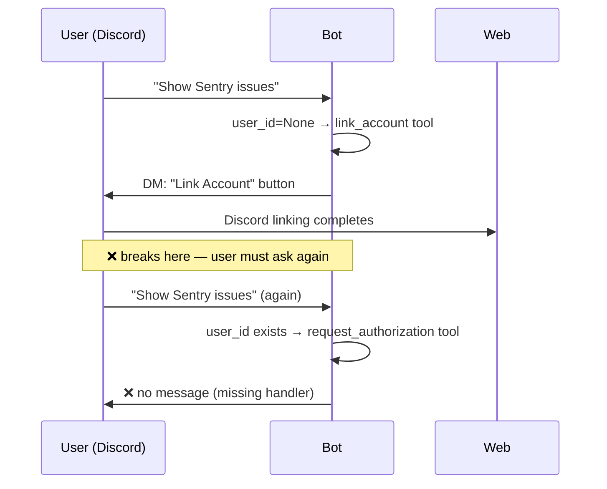
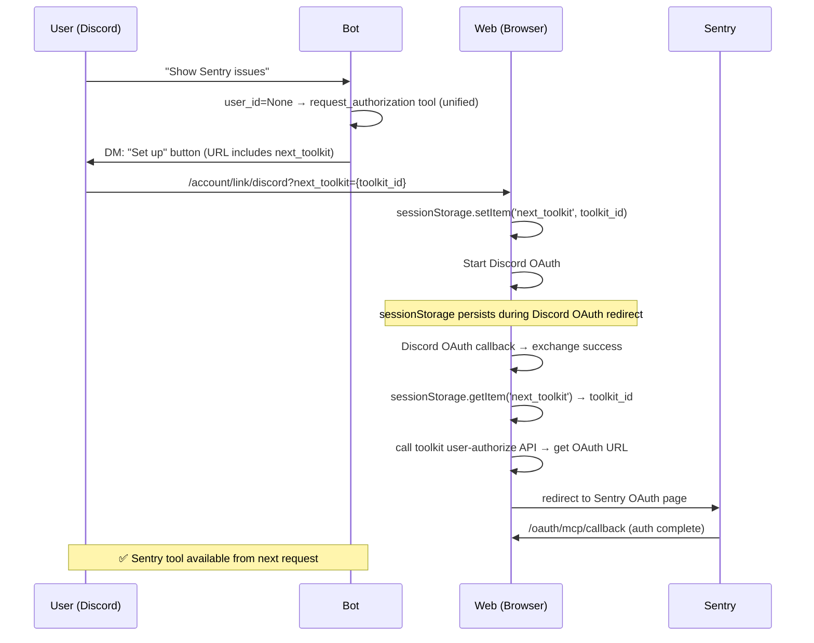

# Unified OAuth Authentication Flow Design

## Overview

When using per-user OAuth2 toolkits (Sentry, Notion, etc.) from Discord/Slack, unify the flow so platform account linking → toolkit OAuth authentication is connected **without interruption**.

**Problems solved:**

1. Discord adapter has no `AuthorizationRequestEvent` handler, so when `request_authorization` is called, no message reaches user.
2. Platform linking (Discord) and toolkit OAuth (Sentry) are separated as different tools, so after linking completes, user must ask the bot again.
3. Even after linking completes, clicking the DM link again shows already-completed linking page again.

**Usage scenario:**
- Discord user who is not linked asks for Sentry → DM has "Set up" button → Discord linking → **automatically redirects to Sentry OAuth page** → Sentry auth completes → Sentry tools are available from next request.

## Discussion Points and Decisions

### 1. How to unify `link_account` / `request_authorization`

| Option | Description | Pros | Cons |
|--------|------|------|------|
| **A) Single tool + `next_toolkit` URL** | Include next-step info in DM link | seamless UX, simpler agent logic | frontend change needed |
| B) Keep separate tools + guidance message | After linking, say "try asking again" | minimal change | UX interruption remains |

**Decision: A** — Agent provides only one tool without needing to distinguish whether `user_id` exists. Frontend manages the flow.

### 2. Value to put in `next_toolkit`

| Option | Example | Pros | Cons |
|--------|------|------|------|
| **A) `toolkit_config_id` (DB ID)** | `019c8da3...` | can distinguish multiple toolkits of same type, API can query directly | long ID |
| B) `toolkit_type` | `sentry` | short and readable | cannot distinguish multiple same-type toolkits |

**Decision: A** — Workspace can have multiple toolkits of same type.

### 3. How to pass `next_toolkit` (frontend)

| Option | Description | Pros | Cons |
|--------|------|------|------|
| A) Include in Discord/Slack authorize JWT state | Send `next_toolkit` to Backend authorize endpoint and include in JWT state to extract in callback | extractable server-side | requires Backend authorize API change, includes unnecessary data in JWT |
| **B) sessionStorage** | Store in sessionStorage in frontend before OAuth redirect, read from callback client component | no backend change, clean separation of concerns | lost if opened in another tab/browser |

**Decision: B** — toolkit OAuth issues its own JWT, so there is no reason to put `next_toolkit` in Discord/Slack JWT. sessionStorage persists through OAuth redirect in same tab and can be implemented with frontend-only change. Other-tab case is practically not an issue because DM link click → OAuth proceeds in same tab.

### 4. Frontend auto-redirect method

| Option | Description | Pros | Cons |
|--------|------|------|------|
| **A) API call from callback page → redirect** | Immediately call toolkit authorize API after linking succeeds | seamless UX | new API needed |
| B) Redirect from linking page | if already linked, immediately continue | also works when revisiting link page | link page logic becomes complex |

**Decision: A** — In OAuth callback page client component (`OAuthCallback`), after exchange succeeds, read `next_toolkit` from sessionStorage → call toolkit user-authorize API → redirect to OAuth URL.

## Architecture

### Current Flow (separated)



### New Flow (unified)



## Implementation Details

### Phase 1: Backend

#### 1-1. `engine/events.py`

Add `toolkit_id` to `AccountLinkNudgeEvent`:

```python
@dataclasses.dataclass(frozen=True)
class AccountLinkNudgeEvent:
    toolkit_name: str
    toolkit_type: str
    toolkit_id: str  # toolkit config ID to authorize after linking
```

#### 1-2. `broker/serialization.py`

Add `toolkit_id` to serialization/deserialization. For backward compatibility, use `data.get("toolkit_id", "")` on deserialization.

#### 1-3. `engine/tools/mcp_base.py`

Unify `create_tools` branch:

```python
# Before
if config.auth_type == "oauth2_per_user" and self._secret is None:
    if context.user_id is None and self._per_user_auth is not None:
        return [self._make_link_account_tool(context)]      # ← remove
    if self._per_user_auth is not None:
        return [self._make_request_authorization_tool(context)]
    return []

# After
if config.auth_type == "oauth2_per_user" and self._secret is None:
    if self._per_user_auth is not None:
        return [self._make_request_authorization_tool(context)]
    return []
```

Add `user_id is None` branch to `_make_request_authorization_tool` handler:

```python
async def handler(arguments_json: str) -> str:
    if context.user_id is None:
        # platform not linked → publish AccountLinkNudgeEvent(with toolkit_id)
        if not nudge_sent:
            await context.publish_event(AccountLinkNudgeEvent(
                toolkit_name=auth.toolkit_name,
                toolkit_type=auth.toolkit_type,
                toolkit_id=auth.toolkit_id,
            ))
            nudge_sent = True
        return "Account linking is required. The user has been notified."

    # user_id exists → existing OAuth URL generation logic (unchanged)
    ...
```

Delete `_make_link_account_tool` method.

#### 1-4. Adapters

**Discord** (`worker/adapters/discord.py`):
- `AccountLinkNudgeEvent` handler: add `?next_toolkit={toolkit_id}` to URL.
- Add `AuthorizationRequestEvent` handler: send OAuth setup button by DM.

**Slack** (`worker/adapters/slack.py`):
- `AccountLinkNudgeEvent` handler: add `?next_toolkit={toolkit_id}` to URL.

#### 1-5. `api/public/toolkit/v1/oauth.py` — `user-authorize` endpoint

Extract OAuth URL generation logic from existing `authorize` endpoint (admin-oriented, requires `TOOLKITS_WRITE`) into helper, and add general user endpoint:

```
POST /toolkit/v1/workspaces/{handle}/toolkit-configs/{toolkit_config_id}/oauth/user-authorize
```

- Requires only `WorkspaceMember` auth (`TOOLKITS_WRITE` unnecessary).
- Exclude form data save logic.
- Discovery → DCR → PKCE → URL generation → return `OAuthAuthorizeResponse`.

### Phase 2: Frontend

#### 2-1. Link page — read `next_toolkit` searchParam

Read `next_toolkit` searchParam from Discord/Slack link page (server component) and pass as prop to `AccountLinkPage`:

```tsx
// page.tsx (server)
const nextToolkit = typeof searchParams.next_toolkit === "string"
  ? searchParams.next_toolkit : undefined;
<AccountLinkPage handle={handle} provider="discord"
  {...(nextToolkit != null && { nextToolkit })} />
```

#### 2-2. `useAccountLinkContainer` — store in sessionStorage

Receive `nextToolkit?: string` prop and store it in sessionStorage before OAuth redirect. **Do not pass it to backend authorize mutation.**

```typescript
const onConnect = useCallback(() => {
  if (nextToolkit) {
    sessionStorage.setItem('nointern_next_toolkit', nextToolkit);
  }
  setState({ type: "LOADING" });
  mutation.mutate({ handle }, { onSuccess: ... });
}, [...]);
```

#### 2-3. `OAuthCallback` — read from sessionStorage and auto-redirect

`OAuthCallback` is a `"use client"` component, so sessionStorage is available. Check on mount:

```typescript
useEffect(() => {
  const nextToolkit = sessionStorage.getItem('nointern_next_toolkit');
  if (state.type === 'SUCCESS' && isAccountLink && nextToolkit) {
    sessionStorage.removeItem('nointern_next_toolkit');
    userAuthorizeMutation.mutate(
      { handle: state.workspace, toolkitConfigId: nextToolkit },
      { onSuccess: (data) => { window.location.href = data.authorization_url; } }
    );
  }
}, []);
```

- No server component (callback page) change.
- No `OAuthCallbackState` type change.
- No tRPC discord/slack-user-link authorize input change.

#### 2-4. tRPC toolkit router — `userAuthorize` mutation

```typescript
userAuthorize: publicProcedure
  .input(z.object({
    handle: z.string().min(1),
    toolkitConfigId: z.string().min(1),
  }))
  .mutation(async ({ ctx, input }) => {
    // POST /toolkit/v1/workspaces/{handle}/toolkit-configs/{id}/oauth/user-authorize
    return data; // { authorization_url: "..." }
  })
```

#### 2-5. i18n

Add `redirectingToSetup`, `toolkitRedirectError` keys (en/ko/fr/ja).

### Initial nudge in handlers.py

Do **not** change initial nudge URL at `handlers.py:131`. At this point, required toolkit is unknown, so generic linking guidance is sent without `next_toolkit`.

## File List

### Backend

| File | Change |
|------|------|
| `engine/events.py` | add `AccountLinkNudgeEvent.toolkit_id` |
| `broker/serialization.py` | update serialization/deserialization |
| `engine/tools/mcp_base.py` | unify tools, delete `_make_link_account_tool` |
| `worker/adapters/discord.py` | `next_toolkit` URL + `AuthorizationRequestEvent` handler |
| `worker/adapters/slack.py` | add `next_toolkit` URL |
| `api/public/toolkit/v1/oauth.py` | `user-authorize` endpoint + helper extraction |
| `engine/tools/sentry_test.py` | `link_account` → `request_authorization` |
| `engine/tools/notion_test.py` | same |

### Frontend

| File | Change |
|------|------|
| `app/(app)/w/[handle]/account/link/discord/page.tsx` | pass `next_toolkit` searchParam |
| `app/(app)/w/[handle]/account/link/slack/page.tsx` | same |
| `features/account-link/containers/useAccountLinkContainer.ts` | `nextToolkit` → sessionStorage save |
| `features/oauth-callback/components/OAuthCallback.tsx` | read sessionStorage + auto-redirect |
| `trpc/routers/toolkit.ts` | `userAuthorize` mutation |
| `messages/*.json` | add i18n keys |

## Backward Compatibility

- `AccountLinkNudgeEvent` serialization: use default `""` for `toolkit_id` on deserialization. Safe even if broker still has old-format messages.
- Remove `link_account` tool: internal agent tool, so no external compatibility impact.

## Alternatives Considered

### A. Include `next_toolkit` in Discord/Slack authorize JWT state

Add `next_toolkit` body field to Backend authorize endpoint and include in JWT state to extract from callback server component. **Rejected**: toolkit OAuth issues its own JWT, so there is no reason to put it in Discord JWT. Backend API change scope becomes unnecessarily broad (discord/slack authorize endpoint + data model + OpenAPI spec + tRPC router all need changes).

### B. Guide "Try asking again" after linking

Minimal change, but UX interruption remains. **Rejected**: user may not understand flow and drop off.

### C. Unify types through Config inheritance

`SentryToolkitConfig(McpToolkitConfig)` — `server_url`/`auth_type` fields become exposed to user. **Rejected**: MCP internal settings are unnecessarily exposed in user UI.

## Implementation Plan

| Phase | Scope | Description |
|-------|------|------|
| 1 | Backend | event + tool unification + adapter + user-authorize API |
| 2 | Frontend | sessionStorage + OAuthCallback auto-redirect + tRPC |
