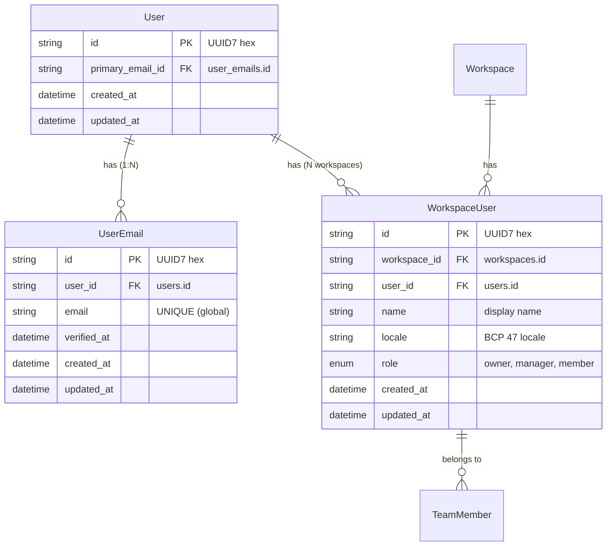
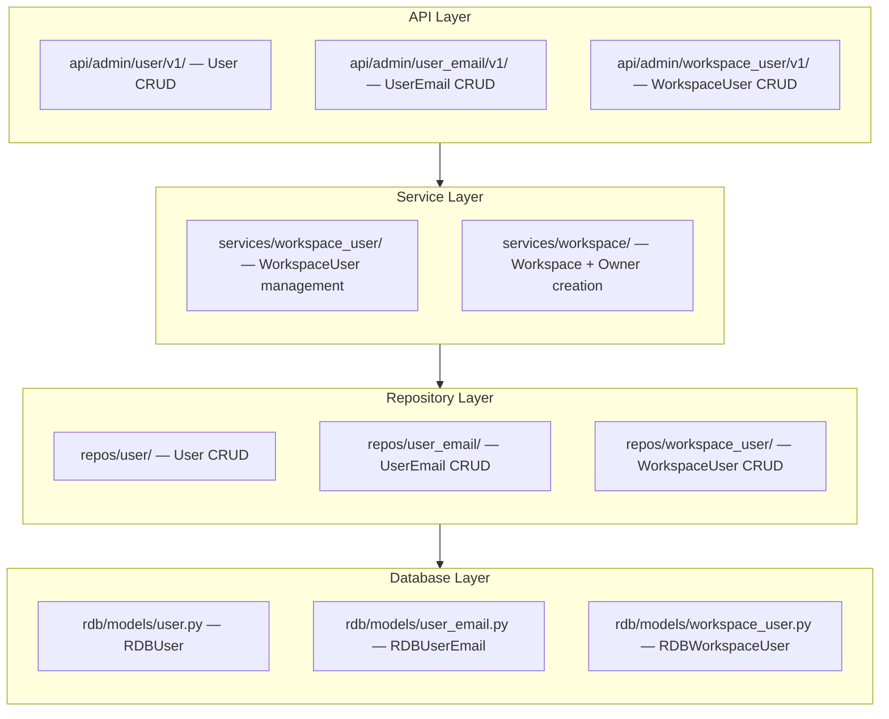

# User & WorkspaceUser CRUD Design Document

## Overview

nointern user management consists of two layers:
- **User (global)**: unique user across the whole system (email-based)
- **WorkspaceUser (membership)**: User's profile inside workspace

One User can participate in multiple workspaces and have independent name/role in each workspace.

## Domain Model

### ER Diagram



## Design Decisions

| Item | Decision | Rationale |
|------|------|------|
| User creation method | Automatically created during email verification | No explicit signup flow needed |
| Email unique scope | Global UNIQUE | Prevent multiple accounts with same email |
| User-Workspace relationship | N:M through WorkspaceUser | One person can participate in multiple organizations |
| WorkspaceUser unique | (workspace_id, user_id) | Prevent duplicate participation in same workspace |
| locale default | `ko-KR` | First target market is Korea |

## Architecture

### Layer Structure



## Admin API Endpoints

### User (global)

| Method | Path | Description | Response codes |
|--------|------|------|-----------|
| GET | `/user/v1/users` | List Users | 200 |
| GET | `/user/v1/users/{user_id}` | Get single User | 200, 404 |
| DELETE | `/user/v1/users/{user_id}` | Delete User | 204 |

> User can be created only through email verification flow (Public API).

### UserEmail

| Method | Path | Description | Response codes |
|--------|------|------|-----------|
| GET | `/user-email/v1/emails` | List all emails | 200 |
| GET | `/user-email/v1/users/{user_id}/emails` | List emails for User | 200 |
| POST | `/user-email/v1/users/{user_id}/emails` | Add email | 201, 404, 409 |
| DELETE | `/user-email/v1/emails/{email_id}` | Delete email | 204 |

### WorkspaceUser (membership)

| Method | Path | Description | Response codes |
|--------|------|------|-----------|
| POST | `/workspace-user/v1/workspace-users` | Create WorkspaceUser | 201, 404 |
| GET | `/workspace-user/v1/workspaces/{workspace_id}/workspace-users` | List by Workspace | 200 |
| GET | `/workspace-user/v1/workspace-users/{workspace_user_id}` | Get single | 200, 404 |
| PATCH | `/workspace-user/v1/workspace-users/{workspace_user_id}` | Update | 200, 404 |
| DELETE | `/workspace-user/v1/workspace-users/{workspace_user_id}` | Delete | 204 |

`user_id` field is required when creating WorkspaceUser (connects to global User).

### Error Response Mapping

| Domain error | HTTP code | Description |
|-------------|-----------|------|
| `UserNotFound` | 404 | User not found |
| `WorkspaceNotFound` | 404 | Workspace not found |
| `DuplicateEmail` | 409 | Email already registered |
| `NotFound` | 404 | WorkspaceUser not found |

## DB Schema

### users table (global)

```sql
CREATE TABLE users (
    id               VARCHAR(32) PRIMARY KEY,
    primary_email_id VARCHAR(32) NOT NULL,
    created_at       TIMESTAMP WITH TIME ZONE NOT NULL DEFAULT now(),
    updated_at       TIMESTAMP WITH TIME ZONE NOT NULL DEFAULT now(),
    FOREIGN KEY (primary_email_id) REFERENCES user_emails(id) DEFERRABLE INITIALLY DEFERRED
);
```

### user_emails table

```sql
CREATE TABLE user_emails (
    id          VARCHAR(32) PRIMARY KEY,
    user_id     VARCHAR(32) NOT NULL REFERENCES users(id) ON DELETE CASCADE,
    email       VARCHAR(255) NOT NULL UNIQUE,
    verified_at TIMESTAMP WITH TIME ZONE,
    created_at  TIMESTAMP WITH TIME ZONE NOT NULL DEFAULT now(),
    updated_at  TIMESTAMP WITH TIME ZONE NOT NULL DEFAULT now()
);
```

### workspace_users table

```sql
CREATE TABLE workspace_users (
    id           VARCHAR(32) PRIMARY KEY,
    workspace_id VARCHAR(32) NOT NULL REFERENCES workspaces(id) ON DELETE CASCADE,
    user_id      VARCHAR(32) NOT NULL REFERENCES users(id),
    name         VARCHAR(255) NOT NULL,
    locale       VARCHAR(35) NOT NULL DEFAULT 'ko-KR',
    role         workspace_user_role NOT NULL DEFAULT 'member',
    created_at   TIMESTAMP WITH TIME ZONE NOT NULL DEFAULT now(),
    updated_at   TIMESTAMP WITH TIME ZONE NOT NULL DEFAULT now(),
    UNIQUE (workspace_id, user_id)
);
```

## File Structure

```
python/apps/nointern/src/nointern/
├── rdb/models/
│   ├── user.py                      # RDBUser model
│   ├── user_email.py                # RDBUserEmail model
│   └── workspace_user.py            # RDBWorkspaceUser model (includes user_id FK)
├── repos/
│   ├── user/
│   │   ├── __init__.py              # UserRepository
│   │   └── data.py                  # User, UserCreate, UserList
│   ├── user_email/
│   │   ├── __init__.py              # UserEmailRepository
│   │   └── data.py                  # UserEmail, UserEmailCreate, UserEmailList
│   └── workspace_user/
│       ├── __init__.py              # WorkspaceUserRepository
│       └── data.py                  # WorkspaceUser, WorkspaceUserCreate
├── services/workspace_user/
│   ├── __init__.py                  # WorkspaceUserService
│   └── data.py                      # Input/Output models
└── api/admin/
    ├── user/v1/                     # User CRUD endpoints
    ├── user_email/v1/               # UserEmail CRUD endpoints
    └── workspace_user/v1/           # WorkspaceUser CRUD endpoints
```
