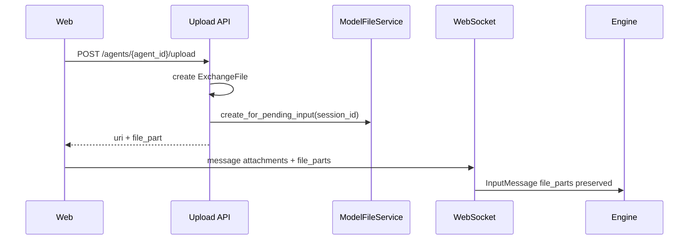
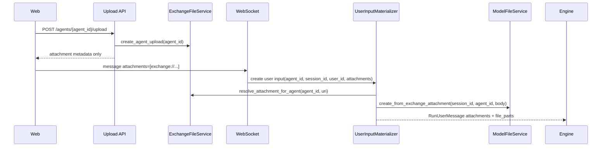

# User Input Boundary FilePart Materialization Design

## Overview

This design separates chat upload, Exchange attachment, and ModelFile/FilePart boundaries again. Goal is not temporarily blocking bug, but fundamentally correcting file identity and model input lifecycle.

Core decisions follow [ADR-0049](../adr/0049-user-input-bound-filepart-materialization.md).

- upload is not session-bound and creates only agent-bound Exchange attachment.
- FilePart is not independent entity but user input model content part.
- Converting Exchange URI attachment to FilePart happens only when creating user input.
- General attachment resolve/download/import/delete/preview does not convert attachment to FilePart.
- Exchange attachment and ModelFile are interpreted only inside current agent namespace.
- cross-agent reference is excluded at namespace resolution stage before permission check.

## Problem Definition

Current implementation has following flow.



Problems with this flow:

1. upload depends on session lifecycle again.
2. FilePart, which is user input part, is created at upload time.
3. client stores model input part and sends it back to server.
4. server comes to trust client-provided `model_file_id`.
5. Exchange URI and ModelFile lookup do not enforce current agent namespace.

## Goals

- Remove `file_part` from Upload API response.
- Remove `file_parts` from WebSocket request contract.
- Remove `filePart` from frontend `UploadedFile` state.
- Materialize attachment URI to FilePart only at user input creation boundary.
- Make current agent namespace a lookup condition of Exchange URI resolution.
- Make current agent namespace a lookup condition of ModelFile download/materialization.
- Remove FilePart-less ModelFile creation path from upload path.
- Guarantee general attachment metadata/preview/download/import/delete paths do not create ModelFile.

## Non-goals

- Do not migrate existing production event/session data.
- Do not change Exchange URI string format itself in this PR. URI path remains file-location object key, but lookup becomes agent-scoped.
- Full Artifact lifecycle redesign is not in scope.
- Full REST history endpoint redesign remains separate large requirement.

## Target Architecture



### Responsibility Separation

| Layer | Responsibility | Does not do |
|---|---|---|
| Upload API | create agent-bound Exchange attachment, return attachment metadata | require session, create FilePart/ModelFile |
| Frontend upload hook | upload file, store attachment URI | store/send FilePart |
| WebSocket API | receive attachment URI in message/edit request | trust client-provided FilePart |
| User input materializer | create attachment snapshot and FilePart snapshot by current agent/session/user | generalize attachment resolve into global FilePart conversion |
| ExchangeFileService | agent-scoped URI lookup, metadata/download/delete | lookup object outside current agent |
| ModelFileService | create FilePart backing ModelFile / agent-scoped download | create independent ModelFile during upload |

## API Contract Changes

### Upload response

Before:

```json
{
  "attachment_id": "...",
  "uri": "exchange://exchange/{workspace}/files/{id}/original",
  "media_type": "image/png",
  "size": 123,
  "name": "image.png",
  "file_part": { "type": "file", "model_file_id": "..." }
}
```

After:

```json
{
  "attachment_id": "...",
  "uri": "exchange://exchange/{workspace}/files/{id}/original",
  "media_type": "image/png",
  "size": 123,
  "name": "image.png"
}
```

### WebSocket message/edit request

`file_parts` is removed from public request contract.

```json
{
  "agent_id": "...",
  "message": "Describe this image",
  "attachments": ["exchange://exchange/{workspace}/files/{id}/original"]
}
```

## Data/State Changes

DB migration is unnecessary. Current schema already has `exchange_files.agent_id` and `model_files.agent_id`. This PR changes service/repository boundary to use namespace column already present in schema as lookup condition.

ModelFile row is created only as result of user input FilePart materialization. It is not created in upload path.

## Permission and Namespace

Exchange attachment resolve operates in this order.

1. Parse object key from URI.
2. repository queries by `(object_key, agent_id)` condition.
3. If not found, treat as `FileNotFound`.
4. Check workspace membership of found file.
5. Reflect expiration state.

Important point: cross-agent URI in same workspace does not reach `FileAccessDenied` by workspace membership. It is excluded by current agent namespace lookup, so it is treated like not found/unavailable attachment.

ModelFile download/materialization also receives current `agent_id`. It finds by `(model_file_id, agent_id)` condition, then checks workspace membership.

## User Input Materialization

Add `materialize_user_input_file_attachments` helper.

Input:

- `agent_id`
- `session_id`
- `user_id`
- `attachment_uris`
- `ExchangeFileService`
- `ModelFileService`

Output:

- `attachments: list[RuntimeAttachment]`
- `file_parts: list[FileOutputPart]`

Behavior:

1. Resolve each URI agent-scoped with `resolve_attachment_metadata_for_agent`.
2. Always create attachment snapshot within possible range.
3. If file is available, read bytes with `resolve_attachment_for_agent` and create ModelFile with `ModelFileService.create(...)`.
4. On successful creation, create FilePart snapshot with `file_output_part_from_model_file`.
5. expired/unavailable/oversized/invalid image leaves only attachment metadata or text preview and does not create FilePart.
6. Failure is recorded per attachment and does not stop entire message send.

This helper is called only at user input creation boundary.

- direct WS send path
- edit_user_message path
- buffered input promotion path
- external message conversion in runtime resolve path

It is not called in general attachment metadata rendering, download/delete/import paths.

## Frontend Changes

- Remove `UploadedFile.filePart`.
- Remove `UploadResponse.file_part`.
- `uploadAll(agentId)` does not require session ID.
- Chat input submit sends only `uri` from upload result as attachments.
- Remove `file_parts` from WebSocket payload.
- input buffer preview and attachment card render only existing attachment metadata.

## Rollout / Failure Mode

- New backend does not receive `file_parts`. Even if stale frontend sends `file_parts`, production path does not use it under Pydantic default extra handling.
- ModelFile creation may fail after upload success and right before send. In this case attachment remains in user input and only FilePart is omitted. User can continue to see attachment that can be downloaded/imported.
- cross-agent URI is treated as not found in current agent namespace and is not included in user input attachment/file part.
- expired exchange file has attachment snapshot availability as expired, and FilePart is not created.

## Acceptance Criteria

- [ ] Upload response has no `file_part`.
- [ ] frontend does not store `filePart` or send `file_parts` over WS.
- [ ] backend public chat request schema does not receive `file_parts`.
- [ ] upload API does not call `ModelFileService.create_for_pending_input`.
- [ ] Exchange attachment is materialized to FilePart only at user input creation boundary.
- [ ] General attachment metadata resolve does not create FilePart.
- [ ] Exchange URI lookup uses current agent namespace condition.
- [ ] ModelFile download/materialization uses current agent namespace condition.
- [ ] same-workspace cross-agent Exchange URI is excluded from user input.
- [ ] same-workspace cross-agent ModelFile ID is excluded from model request materialization.

## Test Strategy

Product behavior verification is E2E primary. However, current agent runtime may not have Docker socket, so if E2E cannot run, record BLOCKED evidence instead of substituting PASS. Unit/static/typecheck are supporting quality checks.

### E2E Primary Verification Matrix

| Behavior | Primary path | Expected result |
|---|---|---|
| upload contract | testenv public API upload | response has only attachment metadata and no `file_part` |
| image attachment message | testenv WS send + mock model request journal | WS payload has only attachments; model request has server-generated FilePart rich input or capability placeholder |
| non-image attachment message | testenv WS send + history reload | attachment is preserved and FilePart is handled by size/capability policy |
| cross-agent exchange URI | same workspace agent A upload → agent B send | A file is excluded from agent B user input at namespace lookup |
| stale client file_parts | WS send with legacy `file_parts` | server does not reflect client-provided FilePart into user input |
| ModelFile cross-agent ID | inject agent A ModelFile ID into agent B materialization | model request materializer treats it as not found/unavailable |

### Supporting Deterministic Verification

- `ExchangeFileService` unit: object key + agent_id lookup, cross-agent not found
- `ModelFileService`/materializer unit: agent-scoped download
- `process_user_input_exchange_file_attachments` unit: separate metadata resolve and FilePart materialization
- frontend typecheck: WS payload type stability after removing `UploadedFile.filePart`

### Fixture / Prerequisite

- testenv E2E needs user/workspace/agent A/agent B/session fixture, upload endpoint, WS ticket, mock model request journal.
- If Docker/testcontainers is absent, leave E2E as BLOCKED and do not substitute unit/static as PASS evidence.

### Evidence

- absence of `file_part` in API response JSON
- absence of `file_parts` in WS sent payload trace
- attachment and server-generated file part in canonical user_message payload
- absence of foreign attachment/file part in canonical payload for cross-agent case
- command, cwd, fixture prerequisite, PASS/BLOCKED verdict

### CI Policy

- Python: targeted pytest, `uv run pyright`, `uv run ruff check`, `uv run ruff format --check`
- TypeScript: azents-web typecheck/lint or targeted workspace quality
- OpenAPI/client: review client generation needed by public API schema change. This PR's upload proxy uses local route, so do not edit generated client directly.

## QA Checklist

### QA-1. Upload does not create/return FilePart

#### What to check
Confirm Upload API response returns only attachment metadata and backend upload handler does not create ModelFile.

#### Why it matters
Separating upload and user input lifecycle removes mismatch between pre-session upload and FilePart lifecycle.

#### How to check
Call `/chat/v1/agents/{agent_id}/upload` from testenv public API and inspect response JSON and DB/model_file side effect.

#### Expected result
response has no `file_part`, and ModelFile row is not created immediately after upload.

#### Execution result
TBD — record in verification phase.

#### Fixes applied
TBD — record in verification phase.

### QA-2. WS user input receives only attachment URI

#### What to check
Verify frontend and backend WebSocket request use only `attachments` and do not send/accept `file_parts`.

#### Why it matters
Trusting client-provided model input part enables cross-agent ModelFile leakage.

#### How to check
Check azents-web typecheck and testenv WS trace for send payload. Also verify regression where stale client sends `file_parts`.

#### Expected result
frontend payload has no `file_parts`; backend user input payload has only server-generated FilePart.

#### Execution result
TBD — record in verification phase.

#### Fixes applied
TBD — record in verification phase.

### QA-3. FilePart materialization runs only at user input creation boundary

#### What to check
message send/edit/buffer promotion materializes attachment URI into FilePart, but metadata resolve/download/import/delete does not create ModelFile.

#### Why it matters
If attachment is generally converted to FilePart, delivery envelope and model input part become mixed again.

#### How to check
Observe ModelFile creation only at user input creation time through unit/integration test and testenv message send path.

#### Expected result
FilePart is created after user input creation; general attachment API calls alone do not have ModelFile side effect.

#### Execution result
TBD — record in verification phase.

#### Fixes applied
TBD — record in verification phase.

### QA-4. Exchange URI resolves in agent namespace

#### What to check
When agent B user input references upload URI from agent A in same workspace, verify it is excluded by B namespace lookup.

#### Why it matters
cross-agent leakage must be blocked at namespace resolution, not permission check.

#### How to check
With agent A/B fixture, upload then run B WS send and inspect canonical user_message payload and model request journal.

#### Expected result
agent A attachment/FilePart is not included in agent B user input. Error is handled as unavailable/not found attachment, not permission denied.

#### Execution result
TBD — record in verification phase.

#### Fixes applied
TBD — record in verification phase.

### QA-5. ModelFile materialization resolves in agent namespace

#### What to check
Verify agent A ModelFile ID is not lowered as rich input in agent B model request materialization.

#### Why it matters
ModelFile is FilePart backing storage, so even if FilePart snapshot leaks, blob outside current agent must not be read.

#### How to check
Run agent-scoped ModelFile download/materializer unit test and deterministic model request test.

#### Expected result
cross-agent ModelFile ID is treated as not found/unavailable and native file payload is not created.

#### Execution result
TBD — record in verification phase.

#### Fixes applied
TBD — record in verification phase.
