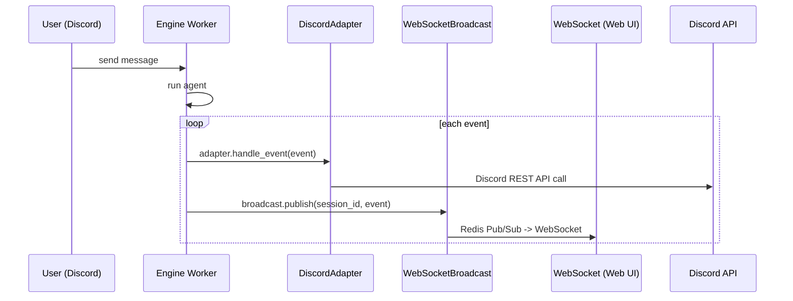

# Session Web Viewer Design

## Overview

Feature that enables agent sessions running in Discord/Slack to be viewed in real time from Web UI as well.

**Problem solved**: Due to UI limitations, Discord/Slack cannot display tool call details, subagent state, reasoning, etc. Web UI already has rich chat interface showing this information, but events from Discord/Slack sessions are not delivered over WebSocket, so it cannot be used.

**User scenario**:
1. User asks agent in Discord for complex task.
2. "View in Web" button appears in Discord status embed.
3. Clicking button opens Web UI and shows tool calls, subagents, reasoning in real time.
4. Even after task completes, history can be reviewed again from Web UI session list.

## Discussion Points and Decisions

> Detailed discussion process: `docs/nointern/adr/web-260416-web-viewer.md`

| Point | Decision | Core rationale |
|--------|------|----------|
| D1. dual publish location | centrally in `dispatch_event()` | single change point, keep adapter responsibility separation |
| D2. access permission | own sessions only | preserve existing model, protect privacy |
| D3. Read-only vs bidirectional | Read-only | issue scope, avoid complexity |
| D4. viewer link exposure | running button + when scheduled task starts | solve core pain point + minimize noise |
| D5. session type exposure | type field only | sufficient information, minimal change |
| D6. broadcast failure | Best-effort | add-on feature, fire-and-forget |

## Architecture

### Event Flow After Change



### dispatch_event Change

```python
# worker/engine.py — EngineWorker.dispatch_event()
async def dispatch_event(
    self,
    session_id: str,
    event: EngineEvent | DurableEvent,
    adapter: InterfaceAdapter | None,
) -> None:
    if adapter is not None:
        await adapter.handle_event(event)
        await self.broker.renew_session_ttl(session_id)
        # Deliver Discord/Slack session events to Web UI too (best-effort)
        if not isinstance(adapter, WebAdapter) and self.broadcast is not None:
            try:
                serialized = serialize_event(event)
                await self.broadcast.publish(session_id, serialized)
            except Exception:
                logger.debug(
                    "Failed to broadcast event to WebSocket",
                    extra={"session_id": session_id},
                )
    else:
        await self.broker.publish_event(session_id, event)
```

Core:
- Exclude WebAdapter with `isinstance(adapter, WebAdapter)` check (already has own broadcast).
- Skip when broadcast not configured with `self.broadcast is not None` check.
- Failure to broadcast does not affect platform delivery due to try/except.

## Data Model

### ConversationSessionResponse Change

```python
# api/public/chat/v1/data.py
class ConversationSessionResponse(BaseModel):
    """Conversation session response."""
    id: str = Field(description="Session ID")
    agent_id: str = Field(description="Agent ID")
    title: str | None = Field(default=None, description="Session title")
    type: ConversationSessionType = Field(description="Session type")  # added
    created_at: datetime.datetime = Field(description="Created at")
    updated_at: datetime.datetime = Field(description="Updated at")
```

API response change:
```json
{
  "id": "abc123",
  "agent_id": "def456",
  "title": "Code review request",
  "type": "discord",
  "created_at": "2026-04-16T01:00:00Z",
  "updated_at": "2026-04-16T01:30:00Z"
}
```

DB schema change: none (use existing `conversation_sessions.type` column)

## API

### Reuse Existing APIs

All APIs reuse existing ones. No new endpoint.

| API | Purpose | Change |
|-----|------|------|
| `GET /workspaces/{handle}/sessions` | session list (including Discord/Slack) | add `type` field to response |
| `GET /sessions/{session_id}/messages` | query message history | no change |
| `WS /chat/v1/sessions/{session_id}` | receive real-time events | no change |
| `POST /chat/v1/ticket` | WebSocket auth ticket | no change |

Access control: keep existing `conv.user_id == current_user.user_id` check. Owner of Discord/Slack session is user who started session, so only that user can query from Web.

## Frontend (UI/UX)

### Session List Change

Show platform icon depending on session type in `SessionSidebar`:

```
┌─────────────────────────┐
│  Sessions               │
├─────────────────────────┤
│  🌐 Code review request  │  ← Web session (type=user)
│  💬 Discord conversation │  ← Discord icon (type=discord)
│  💬 Slack conversation   │  ← Slack icon (type=slack)
│  🌐 Data analysis        │
└─────────────────────────┘
```

- `type === "discord"`: Discord icon (IconBrandDiscord)
- `type === "slack"`: Slack icon (IconBrandSlack)
- otherwise: default icon

### Read-only Viewer Mode

When selecting Discord/Slack session:
- Disable `ChatInput` (readOnly mode)
- Show guidance message instead of input area: "This session is running on {Discord/Slack}."
- Reuse `ChatView`, `ToolCallCard`, `SubagentBlock`, etc. unchanged

```
┌──────────────────────────────────────┐
│  ChatView (reuse existing code)       │
│                                      │
│  [User] Please review code           │
│                                      │
│  [Assistant] Analyzing...             │
│  ┌──────────────────────┐            │
│  │ 🔧 read_file          │            │  ← ToolCallCard
│  │ args: {"path": "..."}│            │
│  │ ✅ result: ...       │            │
│  └──────────────────────┘            │
│                                      │
│  ┌──────────────────────┐            │
│  │ 🤖 Subagent: reviewer │            │  ← SubagentBlock
│  │ ▶ Running...         │            │
│  └──────────────────────┘            │
│                                      │
├──────────────────────────────────────┤
│  🔒 This session is running on       │  ← Read-only guidance
│     Discord.                         │
└──────────────────────────────────────┘
```

### Changed Files (Frontend)

| File | Change |
|------|------|
| `features/chat/components/SessionSidebar.tsx` | add icon badge by session type |
| `features/chat/components/ChatInput.tsx` | add `readOnly` prop, guidance message |
| `features/chat/components/ChatPageContent.tsx` | pass session type to ChatInput |
| `features/chat/containers/useChatPageContainer.ts` | manage session type state |

## Discord/Slack Viewer Link

### Discord — Add "View in Web" Button to Status Embed

```python
# worker/adapters/discord.py — _send_status_embed()
async def _send_status_embed(self, status_text: str) -> str | None:
    embed = {
        "description": f"<@{self._discord_user_id}> {status_text}",
        "color": 0x5865F2,
    }
    button_components: list[dict[str, Any]] = [
        {
            "type": 2,  # BUTTON
            "style": 4,  # DANGER
            "label": "Stop",
            "custom_id": f"stop_run:{self._session_id}",
        },
    ]
    # Add View in Web button (only when workspace_handle exists)
    if self._workspace_handle and self._web_url:
        viewer_url = (
            f"{self._web_url}/w/{self._workspace_handle}"
            f"/chat?session={self._session_id}"
        )
        button_components.append({
            "type": 2,  # BUTTON
            "style": 5,  # LINK
            "label": "View in Web",
            "url": viewer_url,
        })
    components = [{"type": 1, "components": button_components}]
    # ... call send_embed
```

### Slack — Add "View in Web" Button to Control Message

```python
# worker/adapters/slack.py — _post_control_message()
elements: list[dict[str, object]] = [
    # existing Stop, Stop & Clear buttons ...
]
# Add View in Web button
if self._workspace_handle and self._web_url:
    viewer_url = (
        f"{self._web_url}/w/{self._workspace_handle}"
        f"/chat?session={self._session_id}"
    )
    elements.append({
        "type": "button",
        "text": {"type": "plain_text", "text": "View in Web"},
        "url": viewer_url,
        "action_id": "view_in_web",
    })
```

### Scheduled Task Thread Start Message

Include "View in Web" button in first message of Discord scheduled task thread:

```python
# worker/engine.py — create_adapter() Discord scheduled task section
# After thread creation, add View in Web link to first message
if self.web_url and message.workspace_handle:
    viewer_url = (
        f"{self.web_url}/w/{message.workspace_handle}"
        f"/chat?session={message.session_id}"
    )
    # send with embed + button
```

Apply same pattern to Slack scheduled task.

## Infrastructure

No change. Reuse existing Redis Pub/Sub and WebSocket infrastructure.

## Feasibility Verification

| Item | Verification method | Result |
|------|----------|------|
| dual publish in dispatch_event | code analysis — `self.broadcast` attribute (L238), WebAdapter import (L107) | confirmed. Need add `serialize_event` import (1 line) |
| dispatch_event call site compatibility | analyze 11 direct calls + 3 Protocol indirect calls | all compatible. no signature change |
| WebSocket connection to existing session | verified `/sessions/{id}` endpoint supports all session types | confirmed. only checks user_id match |
| session type DB field exists | confirmed `conversation_sessions.type` column | confirmed. query excludes only SUBAGENT, includes Discord/Slack |
| session type API exposure | confirmed `ConversationSessionResponse` has no type field | needs addition (1 field) |
| Discord LINK button support | style: 5 (LINK) — same pattern already used in account link | confirmed |
| Slack URL button support | button with `url` field — supported by Slack Block Kit | confirmed |
| Frontend icons | usage of `IconBrandDiscord`, `IconBrandSlack` | already used in project |
| ChatInput readOnly | checked existing prop | absent. need add `readOnly` prop |
| OpenAPI client regeneration | use `openapi-client-gen` skill | confirmed |
| Discord/Slack session user_id | analyzed `_resolve_user_id_internal()` | only linked account has non-null user_id. If unlinked, user_id=None → hidden from session list (normal) |

### Risks

| Risk | Impact | Mitigation |
|--------|------|------|
| broadcast delay slows platform delivery | medium | process broadcast fire-and-forget, possibly task without await |
| Discord/Slack session owner not linked to nointern web account | low | if unlinked, user_id=None → hidden from session list (intended). account link nudge encourages linking |
| Redis Pub/Sub load from high event volume | low | current Web sessions use same path, load pattern identical |

## testenv QA Scenarios

### Scenario 1: Verify dual event publish

1. `seed.auth.create_user()` -> `seed.workspace.create()` -> `seed.agent.create()`
2. Simulate Discord session: send `SessionMessage(interface=DiscordInterfaceContext(...))`
3. Subscribe to corresponding session_id with WebSocket
4. Verify agent response events also arrive through WebSocket
5. Expected: receive events such as `content_delta`, `text_item`, `function_call_item`, `run_complete`

### Scenario 2: Verify Discord/Slack session in session list

1. Create `type=discord` ConversationSession with seed
2. Call `GET /workspaces/{handle}/sessions`
3. Expected: response includes `type: "discord"`

### Scenario 3: Web UI viewer mode

1. Open Web UI with Discord session `session_id` (`/w/{handle}/chat?session={id}`)
2. Verify message history displayed (REST)
3. If running, verify real-time streaming (WebSocket)
4. Verify input field disabled

### Scenario 4: Verify View in Web button

1. Run agent in Discord/Slack
2. Verify "View in Web" button appears in status embed/control message
3. Verify button URL links to correct session

## testenv Impact

- New seed block: unnecessary (use existing `seed.chat`, `seed.auth`, `seed.workspace`)
- Existing scenario breakage: none (backward-compatible change to existing API — field addition only)
- docker-compose change: none
- .env.example change: none

## Implementation Plan

### Phase 1: Dual Event Publish + Session Type Exposure (Backend)

**Changed files**:
- `python/apps/nointern/src/nointern/worker/engine.py` — modify `dispatch_event()`
- `python/apps/nointern/src/nointern/worker/engine_test.py` — add dual publish test
- `python/apps/nointern/src/nointern/api/public/chat/v1/data.py` — add `type` to `ConversationSessionResponse`
- `python/apps/nointern/src/nointern/api/public/chat/v1/__init__.py` — include `type` in list_sessions response

### Phase 2: Discord/Slack "View in Web" Button (Backend)

**Changed files**:
- `python/apps/nointern/src/nointern/worker/adapters/discord.py` — View in Web button in status embed
- `python/apps/nointern/src/nointern/worker/adapters/slack.py` — View in Web button in control message
- `python/apps/nointern/src/nointern/worker/engine.py` — View in Web in scheduled task thread start message

### Phase 3: Web UI Viewer Mode (Frontend)

**Changed files**:
- `typescript/packages/nointern-public-client/` — regenerate OpenAPI client (reflect type field)
- `typescript/apps/nointern-web/src/features/chat/components/SessionSidebar.tsx` — platform icons
- `typescript/apps/nointern-web/src/features/chat/components/ChatInput.tsx` — readOnly mode
- `typescript/apps/nointern-web/src/features/chat/components/ChatPageContent.tsx` — pass session type
- `typescript/apps/nointern-web/src/features/chat/containers/useChatPageContainer.ts` — session type state

## Alternatives Considered

### Alternative 1: broadcast inside each adapter

Directly call `WebSocketBroadcast.publish()` inside `handle_event()` of DiscordAdapter and SlackAdapter.

**Rejection reason**: adapter responsibility expands (platform delivery + WebSocket broadcast). Handling in one place, `dispatch_event()`, is cleaner.

### Alternative 2: BroadcastingAdapter wrapper

```python
class BroadcastingAdapter(InterfaceAdapter):
    def __init__(self, inner: InterfaceAdapter, broadcast: WebSocketBroadcast):
        ...
    async def handle_event(self, event):
        await self.inner.handle_event(event)
        await self.broadcast.publish(...)
```

**Rejection reason**: excessive abstraction. Only three adapters and pattern is simple. One-line addition in `dispatch_event()` is enough.

### Alternative 3: Bidirectional communication (send messages to Discord/Slack session from Web)

**Rejection reason**: out of issue scope. High complexity (message source confusion, interface conflict). Separate issue if needed.

### Alternative 4: Expose session to all workspace members

**Rejection reason**: privacy concern. Increased permission model complexity. Own-session-only is sufficient now.
