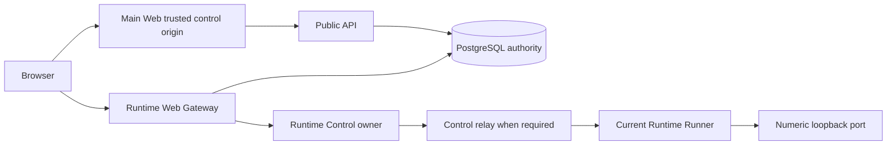

# Runtime Web Services Design

- Snapshot: `web-260912`
- Document reference: `web-260912/DESIGN`
- Requirements: [web-260912/REQ](../requirements/web-260912-runtime-web-services.md)
- Decisions: [web-260912/ADR](../adr/web-260912-runtime-web-services.md)

## Current Behavior and Gaps

Azents has no authenticated HTTP exposure for applications listening inside an
Agent Runtime. Runtime Control already provides authenticated, generation-fenced
Runner control, dedicated Terminal and File Transfer data RPCs, Redis-or-memory
coordination contracts, and a multi-replica Control deployment. None of those
contracts relay arbitrary live HTTP without storing bytes or couple a Gateway
request and Runner stream across different Control replicas.

Public Chat authorization resolves subagent access through its root Session, allows
Workspace members for Team Sessions, and allows only the associated owner for User
Sessions. Runtime Terminal adds Runtime availability/generation authority and is
therefore not the authority for Runtime-independent endpoint preparation or
approval. Main Web stores primary access/refresh credentials in host-only cookies,
but its public origin and a shared Gateway cookie scope are not currently modeled.
The Chat UI has no generic durable shared approval item; its existing authorization
bubble is per-user OAuth authentication. WorkspacePanel already supplies the common
desktop/mobile Runtime panel shell.

## Requirement and ADR Traceability

| Requirements | Decisions | Primary mechanisms |
| --- | --- | --- |
| REQ-1 | D4, D8 | Durable endpoint identity and idempotent prepare API |
| REQ-2, REQ-3 | D1, D4 | Trusted-origin approval and one durable request projection |
| REQ-4 | D4 | Shared operation service used by user API and Runtime-independent Agent tools |
| REQ-5, REQ-6 | D4, D6, D9 | Durable pending request, fixed cycle deadline, rerequest transaction |
| REQ-7 | D5, D6 | Runtime-independent authority plus generation-fenced live tunnels |
| REQ-8 | D3, D7 | Generic HTTP/CORS contract and typed Runner relay |
| REQ-9, REQ-10 | D1, D2, D8, D10 | Two identity establishment modes, trusted control origin, auth epoch and enforced browser profile |
| REQ-11 | D5, D6, D7, D9 | Owner relay, backpressure, deadlines, shared lease quotas |
| REQ-12 | D1, D3, D4 | Orthogonal request/cycle/reachability projection across UI surfaces |
| REQ-13 | D4-D9 | Content-free history/metrics and real Runtime/browser E2E matrix |

## Architecture

Main Web owns human confirmation and control mutations. Public API and a shared
domain service layer own durable endpoint/request/cycle state. Gateway owns browser
authentication, Host routing, authority resolution, passive status, HTTP security
normalization, CORS and live proxy admission. Runtime Control owns transport
rendezvous and generation fencing. Runner owns local HTTP/WebSocket connection and
never starts or stops the application for this feature.

Gateway is a separate process/Deployment built from `python/apps/azents`, not a
route embedded in the ordinary Public API deployment. HTTP ingress and trusted
broker virtual hosts terminate at one Gateway implementation. Existing API, Worker,
Runtime Control and Runner remain independently available when Gateway is disabled.

## Domain Identity and Access

A concrete Agent Session remains endpoint identity. Access resolution extracts a
shared `SessionResourceAuthority` from the current Chat authorization semantics:

1. load the concrete Session;
2. resolve SUBAGENT to its root only for permission;
3. require Workspace membership;
4. allow Team members or the associated User Session owner;
5. preserve not-found-safe User Session denial;
6. verify the concrete Session belongs to the route Agent and Workspace.

The extraction becomes a public domain service consumed by Chat, Runtime Web
services and Gateway. It does not include Runtime/profile/capability availability.
The exact concrete Session ID remains in URLs, endpoint rows, tools and projections;
root resolution never merges subagent endpoint identity.

## Persistence and Data Model

Add PostgreSQL ENUMs for request state and cycle end reason and additive tables
under `python/apps/azents/src/azents/rdb/models/`:

### `runtime_web_endpoints`

- `id`: opaque 32-character ID.
- `workspace_id`, `agent_id`, `agent_session_id`, `port`.
- `hostname_key`: random 128-bit-or-stronger lowercase base32 label, unique and
  permanently assigned until Session cascade.
- `label`: bounded nullable user-facing text.
- `authority_revision`, `close_barrier`.
- nullable `current_pending_request_id`, `current_cycle_id`.
- created/updated timestamps.
- unique `(agent_session_id, port)`; indexes for Host key, Session listing, and
  Agent active-quota lookup.

### `runtime_web_requests`

- immutable ID and endpoint FK;
- requester kind/user/Agent/execution/call correlation and operation key;
- immutable label snapshot;
- state, revision, created/decided timestamps and decision actor;
- no time expiration;
- partial unique pending row per endpoint.

### `runtime_web_cycles`

- immutable ID, endpoint and originating request;
- approver user, approved/expires timestamps and captured duration;
- nullable ended timestamp/reason and endpoint close-barrier snapshot;
- partial unique current row per endpoint.

### `runtime_web_operation_receipts`

Unique actor/execution operation key, operation kind, endpoint/request/cycle result
IDs and bounded serialized result metadata. Receipt retention matches the supported
Agent/client retry window and cannot be shorter than durable tool-result retry.

### Authentication and transport support

- `runtime_web_gateway_identities`: hash of opaque cookie secret, user/auth Session,
  mode, epoch, issued/expires/revoked timestamps.
- `runtime_web_auth_bindings` and `runtime_web_auth_tickets`: broker nonce binding,
  single-use ticket hash, exact origin/destination/epoch, 30-second expiration and
  consume evidence.
- `runtime_web_auth_configuration`: singleton highest version, canonical fingerprint,
  active epoch and mode.
- `runtime_web_tunnel_routes`: short owner boot/address/nonce/Runtime generation,
  registration deadline and renewable lease; no bodies or approval authority.
- `runtime_web_admission_leases` and quota buckets: bounded shared connection and
  reserved-byte leases for PostgreSQL baseline coordination.

Every model has named constraints/indexes. Session-owned endpoint/request/cycle rows
cascade with the concrete Session; Runtime removal does not. Identity/ticket and
transport rows expire independently. Generate one Alembic revision through
`alembic revision --autogenerate`, update `db-schemas/rdb/revision`, and never edit
an executed migration.

## Transactional Operations

Create `repos/runtime_web/` with typed data and an operation repository. Only the
repository performs SQL and owns transactions. External API/Redis/gRPC/filesystem
work happens after commit.

Endpoint row locking serializes endpoint mutation:

- **Prepare:** authorize concrete Session, acquire logical Agent then concrete
  Session quota locks in deterministic order, enforce stable-endpoint quota, get
  or create the endpoint and return the same URL. It creates no
  request/cycle/Runtime.
- **Request:** resolve idempotency receipt; return current pending or insert one;
  retain active cycle unchanged.
- **Direct create:** one transaction inserts/reuses request, records explicit user
  approval, replaces current cycle and records the receipt.
- **Approve:** acquire Agent and Session quota locks, then endpoint/pending locks;
  reauthorize current user and request revision; validate the submitted duration
  configuration revision and value against the confirmation the user saw; enforce
  active aggregate quota; close the prior current cycle with `replaced`; create
  the confirmed-duration cycle at database time; clear pending and advance
  endpoint revision. Replacing one current cycle consumes its existing active slot
  rather than a second slot.
- **Reject/cancel:** target only exact pending request/revision.
- **Close:** target only exact current cycle/revision, advance close barrier and
  leave any pending request intact.
- **Projection:** calculate activity from closure and database time; expired rows do
  not count before housekeeping materializes an end reason.

Logical aggregate scopes have dedicated lock rows created transactionally on first
use. Every operation locks owning Agent before concrete Session before endpoint.
Concurrent first endpoint creation and approvals on different ports therefore
serialize their count/check/insert boundary. Deadlock and serialization failures
use bounded database retry with the same operation key.

Pending requests do not capture a duration that may become stale indefinitely.
Projection returns the current configured duration and its monotonic duration
configuration revision. Trusted confirmation renders both. Approval submits both
and conflicts if either differs at commit, requiring an updated confirmation. A
cycle stores the confirmed value permanently; later operator changes do not alter
existing deadlines.

After commit, publish best-effort invalidation through a `RuntimeWebInvalidation`
interface with Redis and process-memory implementations. Polling and deadlines
remain correctness authority. Exact retry reads the receipt; a conflicting stale
operation returns a typed conflict.

## Public API

Mount `runtime_web` under `api/public/runtime_web/v1/` and generate clients from
OpenAPI. Routes use Workspace/Agent/concrete Session resources and the shared
Session authority:

- `PUT .../services/{port}/endpoint` — idempotently prepare/return endpoint.
- `GET .../services` — paged endpoint/request/cycle/reachability projections.
- `GET .../services/{port}` — one current projection.
- `POST .../services/{port}/requests` — create/reuse pending request.
- `POST .../services/{port}/direct-create` — explicit user create+approve.
- `POST .../requests/{request_id}/approve|reject|cancel` — exact revision mutation.
- `POST .../cycles/{cycle_id}/close` — exact current-cycle closure.
- `POST /runtime-web/v1/auth/shared-identity` — trusted Main Web establishes or
  refreshes shared-mode Gateway identity.
- separate-mode initiation/ticket APIs are callable only by trusted Main Web or
  broker service authentication, not browser Runtime origins.

No extend, visibility, arbitrary target host, duration-selection, or process-control
route exists. Mutation requests include an operation key and expected revision.
Responses return bounded typed error codes from ADR-D3.

## Runtime-Independent Agent Tools

Add a separate auto-bound `RuntimeWebToolkit`, patterned after Goal/Todo rather than
`RuntimeToolkit`. Resolve it with Agent and concrete Session context even when no
Runtime exists. Tools use Pydantic top-level object schemas and never accept an
arbitrary Session ID:

- `prepare_web_service(port, label)`;
- `request_web_service(port, label)`;
- `list_web_services()`;
- `cancel_web_service_request(request_id, revision)`;
- `close_web_service(cycle_id, revision)`.

The execution/call ID supplies idempotency. Request returns immediately with URL,
request ID/revision and `pending_approval`. No tool approves a request, chooses an
authentication mode, returns Gateway credentials, extends duration, or manages a
process. Expected domain denials become bounded tool errors; unexpected failures
propagate.

The first-party tool result metadata contains a strict kind, endpoint/request IDs,
revision, URL and port. It remains immutable; Chat uses those IDs to fetch current
state rather than treating historical text as authority.

## Chat and Services UI

Add a strict known-tool adapter and `RuntimeWebServiceRequestCardContainer` under
the Chat feature. Do not reuse the OAuth AuthorizationRequestEvent/Bubble or add a
new EventKind in the first implementation. The container queries the same current
service projection as Services and invokes generated-client-backed tRPC mutations.
Stale cards become read-only current-state cards.

Add `services` to `WorkspacePanelTab`, a focused pure `RuntimeServicesPanel`, and a
container used by the existing desktop panel and mobile Drawer. The tab remains
available when Runtime is absent. It renders independent request, active cycle and
reachability states, including active+pending. Actions are approve/reject/cancel,
direct create, copy URL, request again and close exposure. There is no visibility
or extend control and no implication that close stops the app.

Add aligned locale namespaces for all supported locales and Storybook stories for
empty, pending, active, active+pending, expired, disconnected-but-approved,
permission error, quota and unconfigured states. Status changes use accessible
labels/live feedback, keyboard focus returns from dialogs, and mobile retains the
same actions.

## Trusted Approval and Authentication UI

All final confirmation and mutation occurs at an exact configured Main Web origin.
Endpoint pending navigation carries only validated endpoint/request identifiers and
returns to a server-constructed deterministic URL. Main Web applies exact Origin
checks to all unsafe cookie-authenticated tRPC/upload/download/control routes.
Runtime service origins receive no credentialed control CORS.

Gateway-owned endpoint status may navigate to Main Web but contains no approval
credential. Gateway rejects Service Worker script registration/update requests
before cache/redirect/proxy handling and overrides all service responses with
`Cache-Control: no-store`. Tests include warmed cache and an already seeded worker;
trusted control remains safe even when browser content cannot be erased.

Production Main Web primary access/refresh/expiry cookies move to `__Host-` names
with Secure and no Domain. This intentionally requires reauthentication at rollout;
no dual-name legacy fallback is added. Development uses explicit local cookie names
because insecure HTTP cannot satisfy `__Host-`. Main Web never authenticates control
from the Gateway parent-domain cookie.

### Shared-cookie mode

Trusted login/refresh asks Public API to mint an opaque Gateway identity and sets a
separate parent-domain `__Http-` HttpOnly cookie. Primary and refresh credentials
remain host-only. Logout clears the shared cookie when domain access permits and
always revokes its server record. Gateway validates identity/auth Session/epoch and
strips all platform cookies upstream.

Before issuance, a trusted page uses unpredictable host-only probe state to verify
that ordinary JavaScript cookies work, JavaScript creation of `__Http-` fails, and a
server-set Secure+HttpOnly `__Http-` succeeds. The result is bound to the exchange.
There is no `__Secure-` fallback.

### Separate-domain mode

Use broker hosts under the service parent with this explicit state machine:

1. An unauthenticated service endpoint sends safe top-level navigation to a Main
   Web initiation page containing only validated endpoint identity.
2. Main Web validates its host-only authentication Session, creates a short-lived
   initiation record and `__Host-` Main binding cookie, and renders a strict
   no-store form whose only target is broker `POST /bind`.
3. Broker `/bind` accepts only exact Main Web Origin, HTTPS POST and the initiation
   identifier. It creates a random binding secret, stores only its hash with the
   initiation/auth Session/epoch/destination, sets a short-lived Secure HttpOnly
   host-only broker binding cookie, and returns a no-store form to Main Web
   `POST /runtime-web/auth/bound`. No Runtime origin is accepted.
4. Main Web `/auth/bound` is the sole narrow exception to its ordinary exact-origin
   mutation guard. It accepts only exact broker Origin, expected content type,
   initiation identifier and current Main binding cookie, revalidates the same
   authentication Session, and atomically marks the initiation broker-bound.
5. Main Web calls the trusted Public API to issue one 30-second ticket bound to the
   broker binding, user/auth Session, epoch and destination. Its trusted page sends
   the ticket only in a top-level form POST body to broker `POST /redeem`.
6. Broker `/redeem` accepts only exact Main Web Origin and HTTPS POST, requires the
   matching broker binding cookie, atomically consumes the ticket, revalidates the
   authentication Session/epoch/destination and sets the parent-domain Gateway
   identity cookie.
7. Broker deletes the binding cookie and renders a strict no-store completion
   document that initiates same-site navigation to the server-constructed endpoint.
   It does not rely on a cross-site POST-to-303 chain for a Strict cookie.

Initiation and binding records expire after two minutes; tickets after thirty
seconds. Transient cookies use Secure, HttpOnly, host-only and Path-scoped settings
with the narrowest SameSite value proven by browser E2E. `SameSite=None` is
permitted only where the broker round trip requires it and always requires Secure.
Every successful or terminal failure deletes transient cookies where its serving
origin can do so. An interrupted pre-ticket binding restarts with a new initiation.
An interrupted post-consume exchange cannot reuse its ticket and restarts from
authenticated Main Web. No secret enters path/query/fragment/referrer or
Runtime-visible content.

## Gateway HTTP Processing

Implement the Gateway with `aiohttp.web` in `python/apps/azents` to retain raw
ordered headers and streaming/WebSocket control. Host parsing accepts exactly one
lowercase endpoint label plus configured suffix or the exact broker host. Public
HTTP/2 terminates at ingress and reaches Gateway using the declared trusted proxy
contract.

Processing order:

1. reject Service Worker registration/update requests and malformed Host/framing;
2. resolve configuration epoch and endpoint Host;
3. recognize genuine CORS preflight and answer it locally after structural
   source/target root-boundary, method and header validation, without requiring
   identity or approval and without contacting Runtime;
4. require a code-owned admitted browser profile with consistent Fetch Metadata
   and a tested browser-controlled version-bearing UA Client Hint; User-Agent alone
   is never accepted as prefix-enforcement evidence;
5. authenticate the common Gateway identity or enter trusted auth navigation;
6. evaluate D3 Origin/Fetch Metadata for the actual request;
7. resolve current Session access, request/cycle/close barrier and database time;
8. serve passive status/approval navigation or enforce admission quota;
9. normalize headers and open the trusted Control stream;
10. stream typed frames with backpressure until completion, deadline or revocation.

Ordinary OPTIONS without both Origin and Access-Control-Request-Method follows the
actual authenticated application path.

The initial admitted browser profile is the exact Chromium version range proven by
cookie-prefix, Client Hint and Fetch Metadata conformance tests. Unknown, missing,
inconsistent and unsupported profiles fail with `426` or a passive upgrade page
before application content, even with a valid identity. Firefox, WebKit and
cookie-authenticated custom clients remain outside the initial data-plane envelope
until equivalent protected version evidence and prefix behavior are proven.

Request/response/redirect/cookie/security behavior follows ADR-D7. Gateway strips
all platform credentials and reserved cookie changes, never follows redirects,
rewrites same-port numeric loopback redirects only, preserves external public
redirects without fetching them, and does not rewrite bodies. Security pages use a
strict CSP. App responses use no-store, no-referrer, frame denial, COOP and the
configured restrictive Permissions-Policy.

## Runtime Control and Runner Protocol

Add protobufs and generated `azents-runtime-control` surfaces for:

- trusted `RuntimeWebProxy.Proxy(stream GatewayWebMessage) returns (stream
  GatewayWebMessage)`;
- authenticated `RuntimeRunnerWeb.ConnectWeb(stream RunnerWebMessage) returns
  (stream RunnerWebControlMessage)`;
- mTLS-only `RuntimeWebRelay.RelayWeb(stream RelayWebMessage) returns (stream
  RelayWebMessage)`.

Gateway and inter-Control RPCs listen on a new trusted-service mTLS port and
Service, separate from the current Runner/Provider TLS-plus-bearer listener. The
existing listener and Runner endpoint contract remain unchanged. Gateway clients
present a Gateway service role; relay clients present a Control service role; the
server verifies CA, SAN and allowed role for each method. A method name on the
existing listener is not accepted as transport isolation.

The owner advertises only its deployment-configured headless address and
trusted-service port together with its random boot identity. NetworkPolicy permits
Gateway-to-trusted-Control and Control-to-Control traffic on that port and does not
expose it to Runtime pods. Local composition uses a separate explicit insecure
trusted-service port only under the development configuration.

Frames are discriminated registration/accepted, request/response head, body chunk,
end, WebSocket frame/control, heartbeat, cancel and bounded error. Headers are
ordered repeated pairs. Identity includes tunnel, endpoint, approval/close revision,
current Runtime/desired/Runner generation, port, join nonce and all deadlines.
Frame size is at most 64 KiB. State machines reject duplicate heads/ends, sequence
gaps, invalid WebSocket text, unexpected frames and late data.

The accepting Control creates the local owner and PostgreSQL route lease, dispatches
metadata-only `runtime.web.open.v1`, and never puts body data in ordinary operation
streams. Runner's new manager handles open intents, creates one aiohttp HTTP or
WebSocket connection to exact numeric loopback, and connects to the usual Control
service. The receiving replica joins locally or relays once to the advertised mTLS
owner. Owner loss, relay loss, generation replacement, Gateway disconnect, lease
loss or ambiguity closes transport without replay. Approval authority remains in
PostgreSQL.

Add aiohttp as an exact Runner application dependency using the dependency workflow.
Runner advertises `runtime-web-http.v1`. Old Runner combinations report unsupported
reachability without changing approval.

## Quota and Deadline Enforcement

Use ADR-D9 defaults and validated Helm ranges. PostgreSQL admission leases own
shared connection counts. For bandwidth, a replica reserves bounded one-second byte
leases from a shared bucket and consumes them locally; reservation size and process
budget bound overshoot. Redis may implement the same interface later but is not
required for correctness.

Gateway, owner Control and Runner each enforce frame/queue/deadline constraints at
their boundary. Admission is charged once per tunnel. Known cycle deadline has a
direct timer at Gateway and owner. Five-second authority polling and invalidation
close committed revocation within ten seconds. Replacement approval closes old
SSE/WebSocket streams and lets already-admitted finite HTTP complete only under its
old cycle/transport deadline. Explicit close barrier overrides completion.

## Failure, Retry, and Recovery

- Invalid/missing Gateway config: Gateway readiness and feature projection report
  unconfigured; no unsafe fallback.
- Identity missing/expired: page navigation enters trusted auth; programmatic
  request returns `401`.
- Pending approval: navigation enters trusted confirmation; programmatic request
  returns `409` without upstream traffic.
- Expired/closed: `410`, unless a pending replacement yields `409`.
- Runtime unavailable: `503`; approved app port unreachable: `502`; approval and
  deadline remain.
- Capacity/size: `429`, `413`, `431` or stream close without changing authority.
- Database/epoch authority unavailable: fail new admission and bound-close active
  connections rather than trust cached authority indefinitely.
- Broker interruption: start a fresh authenticated exchange; consumed ticket stays
  consumed.
- Owner/relay/Runner loss: terminate only transport. A client reconnect is a fresh
  HTTP request. Never replay unsafe application methods.
- Mode change: advance epoch, revoke identities/tickets and close old transports;
  preserve requests/cycles and require browser reauthentication, not reapproval.

## Configuration, Migration, Rollout, and Rollback

Add validated settings and Helm schema/templates for Gateway enablement, mode,
auth-config version, exact origins/domains, wildcard TLS secret, Control/relay mTLS,
active duration, quotas, buffers/timeouts, resources/HPA/drain, and explicit local
insecure mode. Add no secret defaults.

Rollout order:

1. additive DB migration and server code with feature disabled;
2. Runtime Control relay and generated protocol support;
3. new Runner image/capability;
4. Gateway Deployment/Ingress/TLS with config epoch;
5. Main Web auth-cookie hardening and UI behind the server capability;
6. enable one mode and run the required E2E matrix.

Old Runner returns unavailable. Old Gateway/config epoch cannot issue identity or
serve. Rollback keeps additive schema and a nondecreasing epoch. If a binary cannot
understand the current schema/security configuration, Gateway remains disabled.
There is no legacy auth/protocol fallback.

## Observability

Structured audit uses request/cycle history. Runtime diagnostics include opaque
endpoint/request/cycle/tunnel IDs, bounded subject IDs, revisions/generations,
action/outcome/reason, status class, duration and byte counts. Metrics cover pending
and active counts, approval outcomes, identity exchange/revocation, connection
states, admission/bytes/backpressure, deadlines, owner relay, stale-generation and
cleanup.

Never record bodies, cookies, Authorization, full headers, query, full application
path, ticket/grant, raw upstream error or app label as a metric label. Redact access
logs at ingress. Sentry receives logger-integrated content-free failures only.

## Test Strategy

### E2E primary verification matrix

Run real Docker Runtime and browser/API flows for both shared-cookie and
separate-domain modes:

- stable URL before request and after close/Runtime replacement;
- nonblocking Agent request and current Chat/Services/endpoint status;
- trusted human approval, Session member access and unauthorized/private denial;
- active+rerequest, replacement approval, expiry during HTTP/SSE/WebSocket traffic,
  close/cancel distinction and Runtime-independent recovery;
- same-root subagent cross-service credentialed HTTP and cross-root denial;
- login refresh/logout, ticket theft/replay/nonce/epoch/cookie injection, no secrets;
- admitted Chromium prefix/client-hint behavior and unsupported or
  User-Agent-spoofed browser denial before application content;
- Service Worker classic/module/arbitrary scope/update/warmed cache/stale-worker;
- HTTP framing/header/cookie/redirect/CORS/Origin/Fetch Metadata attacks;
- >64 MiB streamed response, request overflow, slow peers, quota/lease recovery;
- Gateway owner Control A and Runner Control B relay, failures/drain and no POST
  replay.

### E2E plan and fixtures

Extend `testenv/azents/e2e` using existing public-client user/Workspace/Agent/Team
Session creation, real Docker Runtime Profile/Runner, TLS gateway and Selenium
browser fixtures. Add a bounded Runtime fixture app supporting HTML/assets, API,
POST mutation counter, redirect, cookie/header cases, large stream, SSE, WebSocket,
Service Worker attempts and deliberate slow consumers. Add two-Control routing and
broker-domain test topology. Tests create state through API/UI rather than direct DB
writes.

`testenv` is prerequisite/fixture and diagnostic support; product evidence remains
E2E-first. Unit/integration tests cover repositories and concurrency, auth/origin
policies, frame state machines, route/codec generation, Gateway parser/security,
Runner client and UI pure states.

### Credential and evidence policy

Use generated test users and local certificates. No personal tokens or production
credentials. Evidence records commit, config epoch/mode, Runner image, browser,
request/cycle IDs, sanitized logs, screenshots and exact outcomes. Required local
and CI suites fail rather than skip when Docker/TLS/browser prerequisites are part
of the lane. Optional external browser/provider probes declare skip criteria.

### CI execution

Split deterministic backend/protocol/frontend unit suites from required credential-
free Runtime E2E and browser/TLS E2E. Do not use fixed sleeps for ordering; use
authoritative state, barriers and controlled clocks except when real elapsed expiry
is the contract. Time-budget large-stream/cross-replica scenarios separately so a
resource regression is attributable.

## Feasibility Assessment

| Requirement group | Assessment | Repository evidence / condition |
| --- | --- | --- |
| REQ-1–REQ-7 | Feasible | Existing durable Session identity, authorization and repository transaction patterns; additive schema required |
| REQ-8 | Conditional | Typed Terminal/Transfer precedents exist; new live owner relay and Runner aiohttp client require implementation and cross-replica proof |
| REQ-9 | Conditional | Existing access/auth Session validation is reusable; the explicit broker state machine and admitted Chromium TLS behavior require E2E proof |
| REQ-10 | Conditional | Trusted Main origin and the Chromium `__Http-`/UA-CH probe are feasible; stale-worker and unsupported-client negative probes remain mandatory |
| REQ-11 | Conditional | Backpressure patterns exist; PostgreSQL lease/bandwidth reservation must meet load bounds |
| REQ-12 | Feasible | Existing Chat tool adapters, WorkspacePanel and mobile Drawer are insertion points |
| REQ-13 | Feasible with new fixtures | Existing real Runtime/browser substrate exists; multi-Control and service-site fixtures are new |

No confirmed Requirement is blocked. The conditional items have credible
implementation paths and explicit experiments; failure of a browser or cross-replica
probe returns to the relevant ADR mechanism rather than changing product scope
silently.

## Design Authority

- Design revision: `2`

| ID | Material design mechanism | Authority | Classification |
| --- | --- | --- | --- |
| M1 | Shared Session resource authority preserving concrete endpoint identity | REQ-3, current Chat authorization | `derived` |
| M2 | Dedicated endpoint/request/cycle/receipt PostgreSQL authority | ADR-D4 | `decided` |
| M3 | Gateway identity, broker ticket and monotonic auth epoch records | ADR-D2, ADR-D8, ADR-D10 | `decided` |
| M4 | Runtime-independent auto-bound Agent toolkit | REQ-1, REQ-2, REQ-4, current toolkit architecture | `derived` |
| M5 | Generated Public API and shared Chat/Services projection | REQ-2–REQ-4, REQ-12, ADR-D4 | `derived` |
| M6 | Trusted-origin confirmation plus Service Worker/no-store enforcement | ADR-D1 | `decided` |
| M7 | Shared-cookie and browser-bound separate-domain establishment with enforced browser profile | ADR-D2, ADR-D10 | `decided` |
| M8 | Same-root generic CORS and bounded Gateway errors | ADR-D3 | `decided` |
| M9 | Separate aiohttp Gateway process and semantic HTTP policy | ADR-D7, ADR-D8 | `decided` |
| M10 | Owner-routed Control relay and typed Runner Web stream | ADR-D5 | `decided` |
| M11 | Deadline/revocation/cycle-transition stream policy | ADR-D6 | `decided` |
| M12 | PostgreSQL admission leases and bounded defaults | ADR-D5, ADR-D9 | `decided` |
| M13 | Additive schema/config-epoch rollout without legacy fallback | ADR-D8, project constraints | `decided` |
| M14 | Content-free observability and E2E-first verification | REQ-13, project constraints | `required` |

## Removal and Replacement

| Existing unit or behavior | Removal authority | Replacement or remaining authority | Removal boundary | Absence verification |
| --- | --- | --- | --- | --- |
| Production Main Web cookies named `az-token`, `az-refresh`, `az-token-expires-at` | ADR-D2 hostile-sibling boundary | Production `__Host-` primary cookies; explicit local-development names | Cookie helpers, login/refresh/logout, tests and documented cookie names | Search generated/app/test code; browser proves old names do not authenticate production control |
| OAuth AuthorizationRequestBubble as a possible approval reuse | REQ-2/REQ-3 and current OAuth contract | New strict Runtime Web request card; OAuth remains unchanged | No change to OAuth events/bubble | Chat adapters contain no Runtime Web mapping to OAuth event |
| ChatService-private Session authorization as the only reusable authority | REQ-3 and M1 | Shared Session resource authority; Chat retains the same behavior through it | Extract helper without changing denial semantics | Chat and Runtime Web unit tests cover Team/User/subagent parity |
| Visibility and extend fields/actions from the pre-design proposal | REQ-3, REQ-6 | Session permission and rerequest | API schemas, UI, tools and docs | OpenAPI/tool schemas/UI searches show neither field/action |
| Runtime-generation invalidation of service approval from the pre-design proposal | REQ-7 | Generation closes transport only | Domain operations and lifecycle observers | Restart E2E retains request/cycle IDs and deadline |
| Cumulative 64 MiB response limit from the pre-design proposal | ADR-D7 | Stream/backpressure/deadline bounds | Gateway/Control/Runner size policies | >64 MiB E2E completes with bounded memory |
| Query-string launch ticket from the pre-design proposal | REQ-10, ADR-D2 | Browser-bound HTTPS POST-body broker exchange | Broker/Main Web routes and logs | Browser/network/log evidence contains no ticket URL |
| Existing Runtime/Terminal/File Transfer behavior | None | Remains authoritative for its domains | No replacement | Regression suites remain green |

## Design Approval

- Mode: `Autonomous`
- Decision owner: `technical-decision-owner` dedicated interviewee
- Approved on: `2026-09-12`
- Approved Design revision: `2`
- Approved authority IDs: `M1, M2, M3, M4, M5, M6, M7, M8, M9, M10, M11, M12, M13, M14`
- Approved scope: Concrete Session-and-port identity; PostgreSQL request/cycle and configuration authority; Runtime-independent Agent tools; coherent Chat/Services projections; trusted approval and browser protections; both authentication modes within the admitted-browser envelope; generic HTTP/CORS; owner-routed multi-replica relay; exact deadlines and bounded resources; additive rollout, content-free observability, and E2E-first verification.
