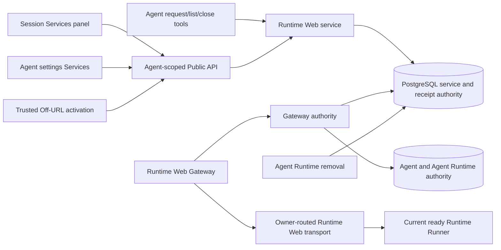

# Runtime Web Service Management Design

- Snapshot: `webservice-260915`
- Document reference: `webservice-260915/DESIGN`
- Requirements:
  [webservice-260915/REQ](../requirements/webservice-260915-runtime-service-management.md)
- Decisions:
  [webservice-260915/ADR](../adr/webservice-260915-runtime-service-management.md)

## Scope

This Design replaces the Session-scoped Runtime Web endpoint, approval request, and
exposure-cycle management model with one directly managed service for each Agent and
numeric local port. The service is visible from every Session of the Agent and from
Agent settings, while exposure remains finite, authenticated, authorized, isolated,
and bounded by the existing Runtime Web Gateway and Runtime transport protections.

The replacement includes persistence, Public API and generated clients, Agent tools,
Gateway authority, trusted activation, Runtime transport authority, Runtime-removal
cleanup, Session and Agent-settings UI, migration, tests, fixtures, and Living Specs.
It intentionally removes legacy service data and contracts at a maintenance cutover.

The snapshot does not start, stop, inspect, or supervise the application bound to the
local port. It does not add indefinite exposure, Agent deletion authority, service
creation provenance, service history, legacy URL aliases, compatibility reads, or a
fallback transport protocol.

## Current Behavior and Requirement Gaps

The current `RDBRuntimeWebEndpoint` is unique by `agent_session_id + port` and carries
pointers and barriers for separate `RDBRuntimeWebRequest` and `RDBRuntimeWebCycle`
rows. Public API paths include the Agent Session, generated clients expose
prepare/request/approve/reject/cancel/close-cycle operations, and the auto-bound Agent
toolkit is available even when the Agent has no managed Runtime capability.

Gateway admission resolves a hostname to a Session endpoint, reauthorizes the current
user against that Session, requires a current approval cycle, and carries endpoint,
cycle, close-barrier, and Agent Session fields through the Runtime Web stream protocol.
Cross-service authorization compares root Sessions. The trusted Main Web confirmation
surface presents approve, reject, cancel, and close actions.

The Session Workspace panel has a Runtime Services component and Session-keyed TRPC
queries. Agent settings has a reusable Runtime settings route and settings hub but no
service-management route. The two surfaces therefore cannot share one Agent-owned
projection. Permanent Agent Runtime removal cleans Runtime-owned Session context and
Runtime projections but does not currently delete Runtime Web endpoints.

These structures conflict with `webservice-260915/REQ` because they can create
multiple product identities for one concrete Agent Runtime port, preserve an approval
workflow that is no longer product state, and keep service capability reachable after
its required Runtime boundary is absent.

## Requirements and ADR Traceability

| Requirement | Design mechanisms | ADR authority |
| --- | --- | --- |
| `webservice-260915/REQ-1` | M1, M3, M4, M5, M9, M10 | D1, D3, D4 |
| `webservice-260915/REQ-2` | M1, M2, M10, M11 | D2, D4 |
| `webservice-260915/REQ-3` | M4, M9 | D1, D3 |
| `webservice-260915/REQ-4` | M1, M4, M9 | D1, D3, D4 |
| `webservice-260915/REQ-5` | M1, M4, M6, M7, M9 | D1, D4 |
| `webservice-260915/REQ-6` | M1, M4, M6, M7, M9 | D1, D3 |
| `webservice-260915/REQ-7` | M4, M6, M7 | D1, D3, D4 |
| `webservice-260915/REQ-8` | M3, M5 | D1, D3, D4 |
| `webservice-260915/REQ-9` | M3, M6, M7, M8, M10, M11, M12 | D1, D2, D4 |

## Architecture and Authority Flow



PostgreSQL is the only current service and exposure source of truth. The Agent is the
service ownership boundary, the Agent Runtime capability is the management
availability boundary, and the current ready Agent Runtime generation is the traffic
admission boundary. A Session is a presentation and execution context only; it does
not own, duplicate, or version a service.

Human management, trusted activation, Agent tools, and Gateway admission all call one
Runtime Web service boundary. Route handlers, TRPC, UI containers, toolkit adapters,
and Gateway code do not independently reconstruct effective On state or Runtime
capability.

## M1. Agent-Port Service Persistence and State Machine

Replace the endpoint/request/cycle authority with one `runtime_web_services` row:

- opaque 32-character service ID;
- Workspace ID for tenant isolation;
- Agent ID for ownership;
- numeric local port;
- exactly 12-character lowercase hostname key;
- nullable user label;
- selected duration in seconds;
- nullable exposure deadline;
- monotonic revision; and
- creation and update timestamps.

Database constraints enforce unique `(agent_id, port)`, globally unique
`hostname_key`, port range `1..65535`, selected duration in
`(3600, 21600, 86400)`, and nonnegative revision. The Agent foreign key cascades only
as a terminal orphan-prevention boundary; ordinary permanent Runtime removal uses the
explicit cleanup in M10 because the logical Agent row remains.

At database time `now`, the projected state is:

```text
On  = exposure_deadline_at IS NOT NULL AND exposure_deadline_at > now
Off = otherwise
```

The projection contains `id`, `port`, `label`, `url`, `on`,
`selected_duration_seconds`, effective `expires_at`, `revision`, `created_at`, and
`updated_at`. `expires_at` is returned only while the deadline is future. A stored
elapsed deadline is projected as Off without waiting for a sweeper.

The repository owns these row-locked transitions:

| Operation | Input coordinate | State transition |
| --- | --- | --- |
| User create | Agent + port | Insert label and selected duration; set deadline to DB `now + duration` only when `turn_on=true` |
| Agent request | Agent + port | Insert an Off service with 1 hour selected, or return an existing row unchanged |
| Update metadata | service ID + expected revision | Replace label and/or selected duration; leave deadline unchanged |
| Turn On | service ID + expected revision | Require effective Off, then set deadline to DB `now + selected duration` |
| Turn Off | service ID + expected revision | Clear a future deadline or succeed unchanged when effectively Off |
| Reset expiration | service ID + expected revision | Require effective On, then set deadline to DB `now + selected duration` |
| User delete | authorized Agent + service ID + expected revision | Delete the exact row and dependent bootstrap/receipt state |
| Agent close | service ID | Lock the exact row; clear a future deadline or succeed unchanged when effectively Off |

Every successful state change increments the service revision exactly once. A human
mutation whose displayed revision is stale returns a bounded conflict and no partial
change. Agent close does not require a displayed revision; exact row identity plus a
row lock makes repeated close idempotent. A deleted service ID never resolves a new
row on the same port.

State-changing operations retain a technical idempotency receipt keyed by authorized
actor kind, actor ID, execution ID, operation kind, and operation key. The receipt
stores the normalized input fingerprint and the exact service ID/result needed to
return an identical retry. Reusing a key with different normalized input fails. New
receipt rows contain no requester/approver product provenance and are cascade-deleted
with the service. User delete remains idempotent by returning success for a missing
service only after the authorized Agent route has been established; no service
tombstone is retained.

## M2. Short Random Hostname Identity

Service creation requests 60 bits from the platform cryptographic random source and
encodes them as exactly 12 lowercase unpadded RFC 4648 Base32 characters. URL assembly
continues to use the configured Runtime Web service suffix and HTTPS origin rules; the
hostname key itself remains opaque and non-secret.

The repository attempts insert with the generated key. A unique-hostname conflict
caused by another service discards the candidate and generates a new one within a
small fixed bound owned by the repository. A conflict on `(agent_id, port)` is not a
hostname collision: user create returns a conflict, while Agent request rereads and
returns the existing service unchanged. Exhausting hostname retries returns a typed
creation conflict and leaves no partial service or receipt.

The random source is injected at the generation boundary for deterministic tests.
Labels, duration changes, On/Off, reset, Runtime restart, and Runtime generation
replacement never rewrite the hostname. Delete and Runtime removal delete the row;
recreation always runs generation again.

## M3. Agent Authorization and Runtime Capability Boundary

The service layer resolves the path Workspace and Agent using the existing canonical
Agent-access rules used by Agent Runtime settings. It verifies that the Agent belongs
to the Workspace and that the authenticated user may access and manage that Agent.
Cross-Workspace, inaccessible-Agent, wrong-service, and guessed-ID cases use the
existing private not-found boundary where disclosure would otherwise occur.

Management collection reads and every service mutation require the Agent's current
`runtime_capability` to be `managed`. `none` and `removing` deny the operation. The
frontend also omits the Session Services tab and Agent settings Services row unless
the current Agent projection reports `managed`; this is presentation gating, not the
security boundary.

Agent tools are projected only when the captured Runtime capability grants the
required Runtime capability. Each mutating tool call rechecks the current capability
version through `RuntimeCapabilityResolver` before repository side effects. When
Runtime removal has advanced the Agent to `removing`, new tools disappear on the next
resolution and already-resolved tools fail closed on the current capability check.

Gateway traffic requires all management-independent access checks plus a currently
managed capability and a current ready Agent Runtime generation. A stopped,
provisioning, replaced, failed, absent, or removing Runtime can leave the service row
and selected exposure deadline intact, but cannot proxy application traffic.

## M4. Agent-Scoped Public API and Generated Contracts

Replace Session/request/cycle routes with one Agent-scoped route family:

```text
GET    /runtime-web/v1/workspaces/{handle}/agents/{agent_id}/services
POST   /runtime-web/v1/workspaces/{handle}/agents/{agent_id}/services
GET    /runtime-web/v1/workspaces/{handle}/agents/{agent_id}/services/{service_id}
PATCH  /runtime-web/v1/workspaces/{handle}/agents/{agent_id}/services/{service_id}
DELETE /runtime-web/v1/workspaces/{handle}/agents/{agent_id}/services/{service_id}
POST   /runtime-web/v1/workspaces/{handle}/agents/{agent_id}/services/{service_id}/on
POST   /runtime-web/v1/workspaces/{handle}/agents/{agent_id}/services/{service_id}/off
POST   /runtime-web/v1/workspaces/{handle}/agents/{agent_id}/services/{service_id}/reset
GET    /runtime-web/v1/services/{service_id}
POST   /runtime-web/v1/services/{service_id}/on
```

The Agent-nested collection and item family supports Session and Agent-settings
management. User create accepts port, nullable label, one supported duration, a
`turn_on` boolean, and operation key. Metadata PATCH uses omission for no change and
explicit `null` to clear the label; selected duration cannot be null. Existing-row
mutations carry expected revision and operation key. Delete is idempotent only after
the authorized Agent route has been established, so it does not disclose whether a
foreign opaque ID exists.

The non-nested service-ID routes are the trusted Main Web activation boundary used
after Runtime Web hostname authentication navigation. They re-resolve the service,
Workspace, Agent, current user authorization, and managed Runtime capability. GET
returns the same redacted service projection. POST `on` accepts the displayed
revision, selected duration, and operation key, atomically stores the chosen duration
and starts the deadline, then returns the current projection. It does not accept a
request or cycle ID.

Public response models remove endpoint, current-request, current-cycle, requester,
approver, close-barrier, and cycle-end fields. Error models retain bounded
not-found/access-denied/conflict/quota/configuration/runtime-unavailable categories and
never disclose hostname keys or foreign ownership.

Regenerate OpenAPI, Python and TypeScript public clients, operation names, fixtures,
and import sites in the same contract change. The TRPC router becomes a thin adapter
over the generated Agent-scoped operations. A browser mutation generates one
operation key before dispatch and reuses it for transport retry; TRPC does not mint a
new idempotency key while retrying the same user action.

## M5. Agent Tool Contract

The Runtime Web toolkit exposes exactly:

```text
request_web_service(port, label?)
list_web_services()
close_web_service(service_id)
```

`request_web_service` creates a missing Off service with 1 hour selected or returns
the existing service unchanged. Its output includes service ID, port, label, URL,
effective On/Off state, selected duration, expiration when On, and revision. The
human-readable result explicitly tells the Agent to give the URL to the user and ask
the user to turn it On. It does not claim that the application is reachable merely
because a service exists.

`list_web_services` returns the same user-relevant Agent-scoped projections in a
bounded page and contains no Session, request, cycle, or provenance fields.
`close_web_service` accepts the opaque service ID returned by request or list, turns
that exact row Off when On, and succeeds unchanged when already Off. A missing stale
ID returns private not-found and never falls back to port.

The toolkit removes `prepare_web_service` and `cancel_web_service_request`. It exposes
no On, reset, duration, label-edit, or delete operation. Tool metadata uses
`runtime_web_service`, service ID, port, URL, revision, and expiration only; Chat event
metadata does not become an alternative service projection.

Root Agents and subagents of the same Agent receive the same service view because the
toolkit is Agent-bound rather than Session-bound. Normal Agent and user authorization
still prevents a different Agent from reading or closing the service.

## M6. Gateway Admission and Deadline Enforcement

Gateway hostname resolution loads the exact service by hostname key. After validating
the existing opaque Gateway identity and current authenticated user session, authority
checks:

1. the user has current access to the owning Workspace and Agent;
2. the service row still exists and belongs to that Agent;
3. the Agent Runtime capability is `managed`;
4. `exposure_deadline_at > database_now`;
5. the current Agent Runtime row is ready under the existing desired/provider/Runner
   generation checks; and
6. the requested protocol and all existing security, quota, framing, and admission
   policies permit the request.

The authority projection contains service ID and revision, identity and auth-session
IDs, Agent ID, Runtime ID and generations, local port, absolute exposure deadline,
and the existing bounded transport/open deadlines. It contains no request ID, cycle
ID, close barrier, approver, or Agent Session ID.

A null or elapsed exposure deadline denies application admission. A known service that
is Off follows M7 only after trusted authentication and Agent authorization; an
unauthorized caller receives the same private failure used for an absent service.
A Runtime-unavailable service fails with the existing bounded maintenance/unavailable
presentation and never connects to an old generation.

Long-lived HTTP, SSE, and WebSocket streams retain the absolute service exposure
boundary. When the carried deadline arrives, the Gateway revalidates the exact service
before terminating the stream. If an authorized human reset the same still-On service
to a later deadline, the bridge replaces its timer and continues under the new window.
Otherwise it closes no later than the authoritative deadline. Changing only label or
selected duration never changes the carried deadline. Periodic or event-driven
authority revalidation terminates streams after service Off/delete, Agent Runtime
capability removal, user/session revocation, Runtime generation replacement, or other
existing authority loss. A revision change alone is not transport revocation; the
revalidated state and deadline determine the result.

## M7. Trusted Off-URL Activation

The service hostname remains an application origin and receives no management
credential or mutation capability. Existing shared-cookie or separate-domain identity
establishment continues to move unauthenticated users through trusted Main Web
surfaces without exposing Main Web access or refresh tokens to service content.
Endpoint-bound authentication binding and ticket fields are renamed to service-bound
identity and contain the opaque service ID.

After authentication, the Gateway distinguishes three private outcomes:

- missing, deleted, foreign, or unauthorized: private not-found;
- authorized service Off: navigate to the trusted Main Web service activation page;
- authorized service On with ready Runtime: proxy the application.

The activation page loads `GET /runtime-web/v1/services/{service_id}` and presents the
same label, port, URL, On/Off state, supported duration choices, and current expiration
as the management surfaces. For Off state, the primary action submits the selected
duration and displayed revision to the service-ID `on` route. Success navigates to the
same public HTTPS URL. Conflict refreshes the projection and asks the user to repeat
the action against current state.

The page contains no approve, reject, cancel, pending, resume, renewal, requester, or
approver state. If the service becomes On elsewhere while the page is open, refresh or
a conflict reveals the current On state and offers the application link. If it is
deleted or Runtime removal begins, activation fails closed and no replacement service
is located by port.

## M8. Agent-Wide Origin and Runtime Transport Authority

Cross-service origin authorization changes its ownership comparison from same root
Session to same Agent. The Gateway still resolves the exact source hostname and target
service, requires both rows to exist, requires current user authorization, validates
source and target effective On state, and applies the existing Origin, CORS, Fetch
Metadata, credential, redirect, and method protections. Merely presenting an Agent ID
or guessed hostname does not establish same-Agent authority.

The Runtime Web stream protocol replaces `endpoint_id`, `cycle_id`,
`endpoint_authority_revision`, `close_barrier`, `agent_session_id`, and
`approval_deadline_at` with `service_id`, `service_revision`, `agent_id`, and
`exposure_deadline_at`. Local port, identity, authenticated session, Runtime ID,
generations, and transport/open deadlines remain. Approval-specific close reasons are
replaced by service-expired or service-authority-revoked semantics; the remaining
transport, deadline, generation, drain, owner-loss, protocol, resource, and application
failure reasons remain.

The exact Runtime Web protocol fingerprint changes with the schema. Gateway, Control,
relay, and Runner reject a peer that does not advertise the new fingerprint. There is
no field compatibility reader or old-message fallback. Runtime Web session-route
leases remain Runtime-generation authority rather than service state, but maintenance
cutover drains and expires old routes before new peers establish them.

Agent aggregate admission, stream, buffer, and bandwidth bounds remain. The obsolete
Session quota scope and Session-keyed accounting branch are removed; service traffic
cannot depend on a Session that no longer participates in authority. Existing
PostgreSQL lease and in-process scheduling correctness remains independent of optional
Redis.

## M9. Shared Session and Agent-Settings UI

Create one reusable service-management container/component boundary backed by
Agent-scoped TRPC keys. Both the Session Workspace Services panel and Agent settings
Services page use the same projection mapper, mutation actions, optimistic revision
handling, duration values, expiration formatting, empty/error/loading states, delete
confirmation, and invalidation helpers.

The Session panel removes Session ID from service query and mutation inputs. Agent
settings adds a `services` settings section and settings-hub row while
`runtime_capability=managed`; the route is directly reachable under the existing Agent
settings layout. When the capability is `none` or `removing`, both entry points are
omitted instead of presenting an empty controllable list.

The shared management surface provides:

- explanatory copy that a service gives an application on a local port a public URL;
- add-service input for port, optional label, duration, and initial On choice;
- cards with label fallback, port, copyable/openable URL, On/Off text status, selected
  duration, and expiration only when On;
- label and duration editing;
- On, Off, reset-expiration, and human-only delete actions; and
- conflict refresh that preserves safe unsaved form input but does not replay a stale
  state-changing action.

Changing duration while On updates the selected value shown on both surfaces and leaves
the displayed current expiration unchanged. Reset uses the newly selected duration.
Delete confirmation explains that the public address is retired and recreation gets a
new address. UI copy never exposes hostname generation, Agent/Runtime ownership
internals, or creation provenance.

Both surfaces invalidate the same Agent collection and service item keys after a
mutation. A short bounded refetch interval or focus refetch keeps separately open
Session and settings views convergent; correctness does not depend on optimistic local
state. The Off-URL activation page uses the same service presentation primitives but a
separate trusted container because its navigation and authentication lifecycle differ.

Colocated Storybook stories cover loading, empty, Off, On with expiration, edited
duration with unchanged expiration, mutation conflict, delete confirmation, Runtime
capability absence, Agent settings, Session side panel, and narrow layouts. The
existing approved concept story is converted to real generated projection types or
removed after equivalent real-component stories exist.

## M10. Permanent Agent Runtime Removal

Runtime removal shuts off service capability in two stages:

1. confirmation changes the Agent Runtime capability to `removing`; M3 and M6
   immediately deny new management and traffic, and revalidation closes active
   traffic;
2. the checkpointed `CLEANING_PRODUCT_STATE` stage deletes every Runtime Web service
   for the Agent before physical Runtime deletion can finalize.

`AgentRuntimeRemovalScopeRepository.cleanup_batch()` adds an explicit Agent-service
cleanup operation at its terminal product-state cleanup boundary. One set-based delete
removes service rows; foreign-key cascades remove new operation receipts and
service-bound auth bindings/tickets. Global Gateway identities and Runtime Web auth
configuration remain because they are user/deployment state, not service state.
Runtime session routes and admission leases remain governed by Runtime removal and
lease expiry, but final absence validation rejects completion while an active route or
service for the removed Runtime authority remains.

`require_cleanup_complete()` checks that no service row exists for the Agent in
addition to its existing Runtime-owned product-state checks. Retry after a crash is
safe because the delete is idempotent and the removal operation already checkpoints
its stage. Runtime recreation moves the Agent back to managed with an empty service
list; the first later create/request generates a new service ID and hostname.

Agent decommission also cannot orphan services: the Agent foreign key terminally
cascades them after the explicit decommission cleanup boundary. No logical service is
owned by a replaceable `AgentRuntime` row, so ordinary Runtime generation replacement,
restart, or stop does not delete services.

## M11. Destructive Migration, Cutover, and Rollback

Use one forward-only Runtime Web service-authority migration under the existing
Alembic chain. Before destructive changes, the deployment enters Runtime Web
maintenance, drains Gateway/Control/Runner Runtime Web streams, and stops components
that can create legacy endpoint/request/cycle state. The migration takes exclusive
locks on the affected authority tables and fails preflight if current Runtime Web
session routes or admission leases still represent active legacy traffic.

The migration then:

1. deletes all endpoint-bound authentication bindings and tickets;
2. deletes all legacy operation receipts, cycles, requests, and Session endpoints;
3. creates the Agent-port service table and replacement receipt schema, or rebuilds
   the emptied tables to the exact new model without a compatibility column set;
4. removes request/cycle/current-pointer/close-barrier/Agent-Session columns,
   constraints, indexes, foreign keys, enum values, and ORM models;
5. removes the Session Runtime Web quota scope and its rows;
6. retains global auth configuration and Gateway identities;
7. updates service-bound authentication foreign keys and indexes; and
8. retains Runtime session-route tables only with no active old lease and with the new
   exact protocol fingerprint required at reconnection.

The replacement service table begins empty. The migration does not translate labels,
select a Session winner, carry an active cycle into On, create aliases, redirect old
hostnames, or retain tombstones. Old hostnames therefore fail closed immediately after
cutover.

After migration, deploy only Public API, Web, Gateway, Control, and Runner components
built for the new generated contracts and protocol fingerprint. Enable normal traffic
after schema validation, route/client smoke tests, a new service create/activate/proxy
journey, and an old-hostname negative check pass.

Application-only rollback across this boundary is unsupported. Rollback requires
restoring the pre-cutover database snapshot and the complete old component set
including its protocol and generated clients. The Alembic downgrade raises a clear
forward-only error. A failed preflight leaves the old schema and state unchanged so the
operator can continue draining and retry.

## M12. Security, Failure, Observability, and Operations

The revised management model preserves the existing Runtime Web security mechanisms:
opaque Gateway identities, current auth-session validation, separate-domain binding
and one-use tickets where configured, exact trusted origins, credential isolation,
SSRF and loopback targeting policy, redirect rewriting, CORS and Fetch Metadata
checks, framing rules, Service Worker containment, semantic HTTP parsing, bounded
headers and bodies, SSE/WebSocket handling, admission leases, backpressure, deadlines,
and Runtime generation fencing.

A 12-character hostname is routing identity only. Access still requires identity,
user authorization, service On authority, managed Runtime capability, ready Runtime
generation, and transport admission. Logs and metrics never contain application
bodies, cookies, Authorization, ticket secrets, identity secrets, query strings, full
application paths, or raw upstream errors.

Structured service-management logs use bounded Workspace, Agent, service, operation,
actor-kind, revision, state-transition, result, and reason fields. They may record the
local port and opaque IDs but not the public hostname as a metric label. Metrics cover
service counts, effective On counts, create/collision retry, mutation conflict,
activation outcome, expired admission, authority revocation, Runtime unavailable,
active streams, close reason, removal cleanup, and cutover preflight. Sentry receives
content-free failures through logger integration only.

Expected failures are typed and bounded:

- duplicate user create, stale revision, or idempotency input mismatch: conflict;
- inaccessible or wrong service ID: private not-found/access-denied boundary;
- unsupported port or duration: request validation failure;
- absent/removing Runtime capability: capability unavailable;
- stopped or unready Runtime during traffic: Runtime unavailable;
- hostname collision exhaustion: creation conflict with no partial state; and
- configuration-disabled Gateway: configuration unavailable.

No failure path turns a service On, extends a deadline, finds a replacement by port,
or authorizes from an idempotency receipt. Redis loss, process restart, delayed cleanup,
and elapsed deadlines do not change effective state correctness.

## Implementation Slices

The approved mechanisms can be delivered as a stacked implementation while keeping
normal product traffic disabled across the destructive boundary:

1. **Authority and migration:** M1, M2, M10, M11; replacement ORM/data/repository,
   removal cleanup, migration preflight, and repository/migration tests.
2. **Service, API, and generated clients:** M3, M4; typed service operations, Public
   API replacement, OpenAPI and Python/TypeScript regeneration.
3. **Agent tools:** M3, M5; capability-gated request/list/close toolkit and Chat
   metadata replacement.
4. **Gateway and transport:** M6, M7, M8, M12; service authority, activation bridge,
   cross-Agent-origin rules, protocol schema/fingerprint, Control/Runner updates, and
   security/transport tests.
5. **Frontend surfaces:** M7, M9; shared service management, Session and Agent settings,
   trusted activation, localization, Storybook, and browser coverage.
6. **Integration, Specs, and cutover evidence:** full E2E matrix, destructive migration
   rehearsal, Living Spec replacement, absence audit, and operational cutover record.

Each phase plan must cite the approved mechanism IDs and record `Design delta: None`.
A material change returns to Requirements or ADR/Design before implementation
continues. The complete stack is created before CI monitoring, and no PR is merged
without explicit requester approval.

## Test Strategy

### E2E primary verification matrix

Extend the existing real Docker Runtime, Runtime Web Gateway, Control relay, Runner,
Public API, Main Web, TLS edge, and Selenium journey in
`testenv/azents/e2e/src/tests/web/public/test_runtime_web_gateway.py` and the relevant
Agent Runtime capability journeys. Required E2E scenarios cover:

- user create Off and create On with 1/6/24-hour choices;
- Agent request creating an Off 1-hour service and returning an existing service
  unchanged;
- the same Agent and port observed from two Sessions and Agent settings;
- different ports producing independent service IDs and hostnames;
- stable URL through On/Off/reset/duration edits and Runtime restart/replacement;
- duration edit while On preserving the current deadline until reset or later On;
- Off URL authentication, trusted activation, and same-URL application navigation;
- Agent list and idempotent close, with no prepare/cancel/delete/extend/reset tool;
- stale revision and delayed stale-ID mutation unable to affect a recreated port;
- user delete and permanent Runtime removal retiring the URL and deleting every
  surface;
- Runtime capability `none`/`removing` hiding management and denying API/tool/traffic;
- expired deadline denying new HTTP and closing bounded HTTP/SSE/WebSocket traffic
  without a sweeper;
- stopped/unready/replaced Runtime denial and current-generation recovery;
- same-Agent cross-service authenticated behavior and different-Agent denial;
- unauthenticated, unauthorized, guessed-hostname, binding/ticket replay, logout, and
  revoked-user negative journeys;
- retained redirect, Origin/CORS/Fetch Metadata, framing, Service Worker, header/body,
  slow-peer, large-stream, quota, relay, and no-unsafe-replay protections; and
- old 32-character/legacy hostnames failing after destructive cutover while a new
  service receives an unrelated 12-character hostname.

### E2E plan and fixtures

Reuse the existing `_RuntimeWebWorkspace`, real Runtime application commands, TLS edge,
Gateway topology, two-Control owner relay, Selenium browser, capacity backend, and
bounded application fixture. Replace Session endpoint/request/approval seeding and API
calls with product-created Agent service calls. Add a second root Session for the same
Agent, a second Agent for cross-Agent denial, injected service duration/clock controls
where wall time is not the contract, and deterministic hostname generation only in
repository/migration tests.

Product evidence creates users, Workspace, Agent, Runtime profile, Runtime, Sessions,
and services through supported APIs/UI. Direct database writes are limited to
migration fixtures and deliberate corruption/constraint tests. Testenv remains the
required integration substrate rather than an alternative product implementation.

### Deterministic lower-level coverage

Repository and service tests cover unique Agent-port creation, hostname collision
retry/exhaustion, exact durations, database-time boundary, row-lock races, stale
revisions, idempotency fingerprints, reset versus duration update, close versus delete,
and Runtime-removal cleanup/absence. API and generated-client tests cover every new
route and prove legacy operation IDs are absent. Toolkit tests verify the exact three
tools and capability-version recheck.

Gateway, auth, protocol, Control, relay, and Runner tests cover the replacement
authority fields, exact fingerprint rejection, service expiry/revocation, same-Agent
origin checks, and retained transport bounds. Frontend unit and Storybook interaction
tests cover shared mapping, operation-key reuse, invalidation, duration semantics,
conflict refresh, capability gating, keyboard access, and narrow layouts.

Use authoritative state, database clocks, barriers, and fixture signals instead of
fixed sleeps. Real elapsed waiting is reserved for the explicit expiry contract and is
bounded by a short test-only duration that exercises the same absolute-deadline path.

### Migration, credential, and evidence policy

Migration tests seed multiple legacy Sessions with the same Agent and port, different
labels, pending requests, active cycles, receipts, bindings, tickets, and old
hostnames. Upgrade proves all service-dependent legacy state is absent, global Gateway
identity/configuration policy is preserved as designed, and no new service row is
synthesized. Active-route preflight must fail without partial schema change; a drained
fixture must upgrade successfully. Downgrade must fail with the documented forward-only
message.

Use generated test users, local TLS certificates, and fixture-only provider keys. No
personal or production credential is used or logged. Evidence records commit SHA,
component images, protocol fingerprint, migration revision, browser, auth mode,
service/Runtime opaque IDs, exact state/deadline observations, sanitized logs,
screenshots for human surfaces, and pass/fail outcome. Application content and secrets
are excluded.

### CI execution and skip policy

Run deterministic backend repository/service/API/protocol tests, Python client
generation checks, TypeScript format/lint/typecheck/build, and frontend unit/Storybook
tests before the Runtime E2E lanes. Required Runtime Web API, Docker Runtime,
Gateway/Control/Runner, browser/TLS, removal, and migration-cutover journeys fail rather
than skip when their declared lane provides the prerequisites. Optional external
browser/provider probes may skip only for an explicitly absent credential or
unsupported external environment and must report the reason. No required product
acceptance criterion depends solely on an optional or live external probe.

## Feasibility Assessment

| Requirement | Assessment | Repository evidence and implementation condition |
| --- | --- | --- |
| `REQ-1` | Feasible | Agent Runtime is already Agent-owned and shared across Sessions; the repository has Agent access and checkpointed Runtime-removal cleanup boundaries. |
| `REQ-2` | Feasible | Existing stored random hostname identity and uniqueness constraint can be narrowed to injected 60-bit lowercase Base32 generation with bounded retry. |
| `REQ-3` | Feasible | The Session panel already has a service surface, Agent settings has extensible hub/section routing, and both can use one Agent-keyed TRPC contract. |
| `REQ-4` | Feasible | Existing transactional direct-create/delete patterns and generated Public API pipeline support atomic create and exact-row deletion. |
| `REQ-5` | Feasible | A nullable deadline on one row fully represents effective On/Off and removes approval entities without a second authority. |
| `REQ-6` | Feasible | Database-time mutations, a three-value constraint, and current absolute stream deadlines support the required duration semantics. |
| `REQ-7` | Feasible | Existing trusted Main Web Runtime Web authentication/confirmation navigation can replace approval with service-ID activation. |
| `REQ-8` | Feasible | The current auto-bound toolkit and capability resolver are reusable; its five legacy tools can be replaced with the exact three Agent-scoped tools. |
| `REQ-9` | Feasible with mandatory regression evidence | Existing Gateway, browser identity, semantic transport, cross-replica relay, and real Runtime E2E substrate can retain the security envelope; authority and protocol fields require coordinated replacement. |

No confirmed Requirement or accepted ADR is blocked. The principal implementation
risk is coordination across the destructive schema/API/protocol cutover, not mechanism
feasibility. That risk is bounded by maintenance preflight, exact fingerprint
rejection, full-component deployment, database snapshot rollback, and the existing real
Runtime/browser E2E topology.

## Assumptions and Non-Blocking Risks

- Existing canonical Agent access rules are the intended authorization rules referenced
  by `webservice-260915/REQ-9`; this snapshot does not introduce a new user role.
- Gateway configuration and domain modes remain deployment authority. The service
  duration is per row and no longer comes from the legacy global active-duration
  default.
- Existing service-count and transport bounds remain operational policy. Session-bound
  quota accounting is removed, while equivalent Agent aggregate protection remains.
- Browser and settings surfaces may use polling/focus refetch rather than a new realtime
  event channel because the server projection remains authoritative and no latency
  requirement mandates another mode.
- The destructive cutover requires an operator database snapshot and coordinated
  component rollout. Rehearsal evidence is mandatory because application-only rollback
  is intentionally unavailable.
- A later product need for exposure history, stable address after deletion, or Agent On
  authority requires a new Requirements snapshot; no extension point is added now.

## Design Authority

- Design revision: `1`

| ID | Material design mechanism | Authority | Classification |
| --- | --- | --- | --- |
| M1 | One Agent-port service row, nullable deadline state machine, revision fencing, and technical retry receipts | REQ-1, REQ-4–REQ-6, REQ-8; ADR-D1, ADR-D3 | `decided` |
| M2 | 12-character random row-lifetime hostname with bounded uniqueness retry | REQ-2; ADR-D2 | `decided` |
| M3 | Canonical Agent authorization plus managed Runtime capability for management/tool projection and current-ready Runtime for traffic | REQ-1, REQ-8, REQ-9; current Runtime capability authority | `derived` |
| M4 | Agent-scoped create/list/get/update/action/delete Public API and service-ID trusted activation contract | REQ-1, REQ-3–REQ-7; ADR-D3, ADR-D4 | `derived` |
| M5 | Capability-gated Agent request/list/close toolkit addressed by port then service ID | REQ-8; ADR-D3, ADR-D4 | `required` |
| M6 | Gateway admission from current service deadline, user access, capability, and Runtime generation | REQ-5–REQ-7, REQ-9; ADR-D1; retained Gateway authority | `derived` |
| M7 | Existing trusted authentication flow terminating in direct Off-to-On service activation | REQ-7, REQ-9; ADR-D1, ADR-D3, ADR-D4 | `derived` |
| M8 | Same-Agent cross-service origin boundary and service-based exact-fingerprint Runtime Web stream authority | REQ-1, REQ-9; ADR-D1, ADR-D4; retained transport security | `derived` |
| M9 | Shared Agent-keyed frontend state and real-component management surfaces in Session and Agent settings | REQ-3–REQ-6; current UI integration boundaries | `required` |
| M10 | Immediate capability denial and checkpointed permanent Runtime-removal service deletion with absence verification | REQ-1, REQ-2, REQ-9; ADR-D2, ADR-D4 | `derived` |
| M11 | Destructive maintenance cutover deleting legacy state and contracts with database-restore-only rollback | REQ-1–REQ-5, REQ-8; ADR-D4 | `decided` |
| M12 | Retained authentication, isolation, framing, transport bounds, content-free observability, and E2E-first security regression | REQ-9; unchanged Runtime Web Specs and project constraints | `existing` |

## Removal and Replacement

| Existing unit or behavior | Removal authority | Replacement or remaining authority | Removal boundary | Absence verification |
| --- | --- | --- | --- | --- |
| Session-owned `runtime_web_endpoints` identity and `agent_session_id + port` uniqueness | REQ-1; ADR-D1, ADR-D4 | M1 Agent-port service row | Destructive migration and ORM/repository replacement | Schema inspection, migration fixture, no Session field in projections or queries |
| `runtime_web_requests`, pending/approve/reject/cancel state, requester/approver provenance | REQ-4, REQ-5, REQ-7, REQ-8; ADR-D1, ADR-D4 | M1 direct state transitions and M7 activation | Destructive migration plus service/API/UI/tool removal | Tables/enums/models/routes/client operations/copy absent; generated-contract grep |
| `runtime_web_cycles`, close barrier, end reason, current request/cycle pointers | REQ-5, REQ-6; ADR-D1, ADR-D4 | M1 nullable deadline and M6 absolute stream deadline | Destructive migration plus protocol replacement | Tables/columns/models/protobuf fields and cycle tests absent |
| Legacy operation receipts containing request/cycle results | ADR-D3, ADR-D4 | M1 service-ID/input-fingerprint technical receipts | Delete all rows and rebuild exact schema at migration | Seeded rows absent; no request/cycle columns or result fields |
| Legacy hostname rows and public URLs | REQ-2; ADR-D2, ADR-D4 | M2 new service-lifetime hostname | Endpoint deletion at cutover | Old-host negative E2E and empty replacement service table |
| Endpoint-bound auth bindings and tickets | ADR-D2, ADR-D4 | M7 service-bound bindings/tickets; global identities retained | Delete dependent rows and change foreign keys/contracts | Migration assertions and auth replay/activation E2E |
| Session-nested Public API routes and endpoint/request/cycle service-control routes | REQ-1, REQ-4, REQ-5, REQ-8; ADR-D3, ADR-D4 | M4 Agent-scoped service routes | Coordinated API/client cutover | OpenAPI operation snapshot and route 404/absence tests |
| Generated Python/TypeScript endpoint/request/cycle models and operations | ADR-D4 | M4 service projection and mutations | OpenAPI regeneration in API phase | Clean generated diff and no legacy symbol imports |
| TRPC prepare/request/approve/reject/cancel/close-cycle adapters | REQ-4, REQ-5, REQ-8; ADR-D4 | M4 Agent service adapters | Frontend contract phase | Router key/action tests and source absence audit |
| Agent `prepare_web_service` and `cancel_web_service_request`; cycle-addressed close | REQ-8; ADR-D3, ADR-D4 | M5 request/list/service-ID close | Toolkit phase | Exact tool-set unit/resolution tests and prompt/tool-schema snapshot |
| Auto-binding Runtime Web tools without managed Runtime capability | REQ-1, REQ-8; M3 authority | M3 capability-gated projection/recheck | Tool resolver phase | none/removing capability tests expose no tools and reject stale calls |
| Gateway pending-approval/gone distinction and Session/cycle admission lookup | REQ-5, REQ-7, REQ-9; ADR-D1, ADR-D4 | M6 Off activation/private failure and service deadline authority | Gateway phase | Gateway unit and browser E2E; no pending-approval code |
| Root-Session cross-service origin comparison | REQ-1, REQ-9; ADR-D4 | M8 exact same-Agent comparison | Gateway authority phase | same-Agent and cross-Agent security tests |
| Runtime Web stream `endpoint_id`, `cycle_id`, close barrier, Agent Session, approval deadline fields and approval close reason | ADR-D1, ADR-D4 | M8 service/revision/Agent/exposure deadline authority | Protocol regeneration and full-component cutover | Descriptor/fingerprint tests and legacy-field source audit |
| Session Runtime Web quota scope/accounting | REQ-1; ADR-D4 | M8 Agent aggregate protections | Schema and admission phase | Enum/row/query absence and quota regression tests |
| Approval-oriented confirmation container/component and messages | REQ-5, REQ-7 | M7 trusted activation | Frontend phase | UI source/message absence and browser journey |
| Independent Session-only Runtime Services state and handlers | REQ-1, REQ-3 | M9 shared Agent-keyed container/component | Frontend phase | two-Sessions/settings convergence E2E |
| Missing Agent settings Services route and hub entry | REQ-3 | M9 conditional route/row | Frontend phase | settings navigation and capability-gating E2E |
| Runtime removal without Runtime Web service cleanup | REQ-1, REQ-2; ADR-D4 | M10 checkpointed deletion and absence check | Runtime removal repository/service phase | crash/retry and finalization-blocking tests |
| Legacy Session service, request, cycle, receipt, bootstrap data | Requester direction; ADR-D4 | None; replacement table starts empty | Maintenance migration | Multi-Session seeded migration test proves zero survivors |
| Legacy compatibility reader, dual write, route alias, URL redirect, protocol fallback | ADR-D4 | None | Whole replacement | Source/generated-route/protocol absence audit and old-host failure |
| Existing Runtime Web authentication, credential isolation, SSRF, redirect, framing, Service Worker, HTTP/SSE/WebSocket, lease, backpressure, and generation safeguards | REQ-9 | M12 retained authority | Not removed; adapted only to service inputs | Existing security/transport suite remains required and extended |
| Existing global Runtime Web auth configuration and Gateway identities | ADR-D4 | M7 and M12 retained deployment/user authority | Not removed | Migration preservation assertions and login/logout tests |
| Concept-only Runtime Services Storybook story | REQ-3–REQ-6; M9 | Real shared component stories | Frontend completion | Concept file removed or imports only production components with equivalent stories |
| Current Runtime Web Living Spec text describing Session approvals | REQ-1, REQ-4, REQ-5, REQ-8; ADR-D4 | Current behavior documented after implementation | Final spec-review phase | Updated `code_paths`, `last_verified_at`, version history, and spec-review result |

## Design Approval

- Mode: `Collaborative`
- Decision owner: `Requester`
- Approved on: `2026-09-15`
- Approved Design revision: `1`
- Approved authority IDs: `M1`, `M2`, `M3`, `M4`, `M5`, `M6`, `M7`, `M8`, `M9`, `M10`, `M11`, `M12`
- Approved scope: Agent-port Runtime Web service authority, direct finite On/Off
  management, Agent request/list/close tools, trusted URL activation, Gateway and
  transport authority replacement, Runtime-removal cleanup, shared human surfaces,
  and destructive legacy cutover.

The requester approved this revision and asked implementation to begin on 2026-09-15.
Approval remains valid only while revision `1` and the exact authority set above remain
unchanged.
