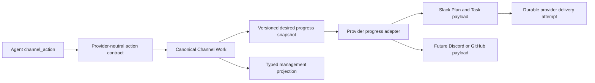

# Provider-Native Channel Work Progress Design

- Snapshot: `work-260723`
- Requirements: [`work-260723/REQ`](../requirements/work-260723-provider-native-progress.md)
- ADR: [`work-260723/ADR`](../adr/work-260723-provider-native-progress.md)

## Scope and Traceability

| Requirement | Decisions | Mechanism |
| --- | --- | --- |
| `REQ-1` | `ADR-D3`, `ADR-D4` | Persisted nullable Channel Work title; explicit `channel_action` title guidance and update validation |
| `REQ-2` | `ADR-D1`, `ADR-D2`, `ADR-D5` | Provider adapter renders one complete native progress snapshot; Slack renders one Plan block |
| `REQ-3` | `ADR-D1`, `ADR-D3`, `ADR-D4`, `ADR-D6` | Typed canonical task details, output, sources, failed state, and typed management projection |
| `REQ-4` | `ADR-D2`, `ADR-D4`, `ADR-D5` | Existing checking create transitions to the first titled task-bearing snapshot on the retained message |
| `REQ-5` | `ADR-D2`, `ADR-D3`, `ADR-D5`, `ADR-D6` | Canonical desired snapshot remains recovery authority; provider requests are revision-specific projections |
| `REQ-6` | `ADR-D2`, `ADR-D5` | Provider-bound validation, literal Slack rich text, URL source validation, and accessible fallback text |
| `REQ-7` | `ADR-D1` through `ADR-D6` | Provider-neutral domain models and management API separated from provider-specific lowering |

## Current State

Channel Work persists an ordered JSON task list with `id`, `title`, and `status`. The work row has no work-level title. The durable desired progress payload contains `state` and the same basic task list. The pure activity renderer is Slack-specific and supplies the hardcoded Plan title `Agent is working`.

The `channel_action` tool accepts an optional reply and optional `todo_update`. Task updates replace the complete ordered task list. The work repository commits canonical state and rendered Slack request payloads in one transaction, then the service attempts each provider mutation once after commit. Recovery renders the desired progress payload and recreates a missing active Tracker.

Session Channels receives work tasks as untyped dictionaries and independently parses only title plus pending, in-progress, and completed status.

## Target Architecture



Canonical work never stores provider block objects or provider-only identity. Provider adapters are pure lowering boundaries: they receive one complete canonical desired snapshot plus work identity and revision, and return the provider request presentation for one create or update attempt.

## Canonical Domain Model

Replace the unused task `TypedDict` in `azents/core/external_channel.py` with frozen, validated provider-neutral value models shared by the tool, repository, renderer input, and management projection.

```text
ExternalChannelWorkSource
- url: validated HTTP or HTTPS URL
- label: non-empty human-readable label

ExternalChannelWorkTask
- id: stable non-empty task identity
- title: literal task title
- status: pending | in_progress | completed | failed
- details: optional plain text
- output: optional plain text
- sources: ordered list of ExternalChannelWorkSource

ExternalChannelDesiredProgress
- schema_version: 2
- state: checking | working
- title: nullable current-work title
- tasks: ordered list of ExternalChannelWorkTask
```

`checking` requires a null title and an empty task list. `working` requires a non-empty title and at least one task. The desired model owns these invariants so live rendering, persisted recovery, replacement, and tests share one decoder.

The canonical status enum adds `failed`. Provider adapters map it to their native error state; warning or critical prose remains details or output rather than becoming a new status.

## Agent-Facing Action Contract

`ContinueChannelActionInput` adds an optional `title` field. Its description tells the Agent to:

- describe the concrete activity currently in progress;
- follow the participant's language when clear;
- use progressive wording;
- end with `…`; and
- avoid generic text such as `Agent is working`.

The schema examples include `Investigating error logs…` and `마케팅 자료 조사하는중…`.

Each task input adds optional `details`, optional `output`, and ordered `sources` containing provider-neutral URL plus label. The existing complete-list replacement and stable task-ID rules remain.

Validation rules are:

1. `continue` requires at least one of message, title, or task update.
2. A task update requires a non-empty title in the same action.
3. A task update must leave at least one task unfinished, where `completed` and `failed` are terminal task states.
4. Task IDs remain unique within the complete replacement list.
5. A title-only update is accepted only when active work already has at least one task.
6. A message-only update retains title and tasks without creating a progress revision.
7. `finish` retains the last work title and tasks for management history while following the existing final reply and Tracker completion lifecycle.

The dynamic Channel Work prompt includes the current title and renders task details, output, and sources in bounded form. It repeats the title-writing rule so the guidance remains visible after Tool Search projection and compaction.

The durable action request payload records title and the complete semantic task update. Idempotent reuse of a tool call with any differing title or task field remains a conflict.

## Persistence and Migration

Add nullable `title` text to `external_channel_works`. New checking work starts with:

```text
title = null
schema_version = 2
tasks = []
desired_progress_payload = {schema_version: 2, state: checking, title: null, tasks: []}
```

The first task-bearing action sets `title`, writes the complete version-2 task JSON, advances the state and desired progress revisions, and writes the complete working desired snapshot. Later task or title updates replace the corresponding canonical values atomically.

Generate a new Alembic revision; do not edit an executed migration. The upgrade performs a forward data conversion:

1. add nullable `external_channel_works.title`;
2. for an existing row with tasks, derive a bounded transitional title from the first task title plus `…`;
3. convert existing desired progress JSON to version 2 with the row title and existing task fields;
4. set `schema_version = 2`; and
5. change the server default to `2`.

Checking rows keep a null title. Existing optional task fields are absent and decode as null or an empty source list. The runtime supports only the migrated version-2 desired schema; it does not keep a version-1 fallback. Downgrade removes the added title after returning the schema version and desired payload to the previous shape.

Update all repository DTOs and constructors explicitly with the new required nullable title field. Work creation in both the general External Channel repository and Channel Work repository uses schema version 2.

## Provider Progress Adapter Boundary

Introduce a provider-neutral progress presentation API in core code and a pure Slack adapter in a Slack-specific module. The adapter input includes:

- provider-neutral desired progress snapshot;
- canonical work ID; and
- desired progress revision.

The adapter output contains accessible fallback text and the provider-native block list. Network delivery remains in `SlackConversationClient`; the adapter performs no I/O.

The Channel Work repository renders a provider request only after it has locked and updated canonical work. The delivery attempt persists the rendered request for that exact revision. `desired_progress_payload` remains provider-neutral and is never replaced by the rendered Slack blocks.

Provider selection is exhaustive on `ExternalChannelProvider`. Adding Discord or GitHub requires a new adapter implementation but does not change canonical models or `channel_action`.

## Slack Presentation

### Checking state

The initial pre-execution Tracker remains one standalone task card:

```json
{
  "type": "task_card",
  "block_id": "work_<work-id>_<revision>",
  "task_id": "activity-status",
  "title": "Agent is checking your message",
  "status": "in_progress"
}
```

The exact provider-only block ID is deterministically derived from work ID and desired revision and remains below Slack's limit. It changes for every message iteration.

### Working state

Task-bearing work renders one Plan block:

```json
{
  "type": "plan",
  "block_id": "work_<work-id>_<revision>",
  "title": "Investigating error logs…",
  "tasks": [
    {
      "task_id": "inspect-logs",
      "title": "Inspect application errors",
      "status": "in_progress",
      "details": {
        "type": "rich_text",
        "elements": [
          {
            "type": "rich_text_section",
            "elements": [{"type": "text", "text": "Comparing recent failures"}]
          }
        ]
      },
      "sources": [
        {
          "type": "url",
          "url": "https://example.com/logs",
          "text": "Error log dashboard"
        }
      ]
    }
  ]
}
```

The adapter sends no `plan_id`. Nested tasks omit the standalone block `type`. Status mapping is:

| Canonical | Slack |
| --- | --- |
| `pending` | `pending` |
| `in_progress` | `in_progress` |
| `completed` | `complete` |
| `failed` | `error` |

Details and output become literal rich-text sections. Plain text is placed in Slack text elements rather than parsed as mrkdwn, preventing task content from creating mentions or formatting. Sources contain only validated HTTP or HTTPS URLs and literal labels. Empty optional values are omitted.

Fallback text begins with the current title and contains one bounded status line per task. Details, output, and source labels may be summarized within the provider text limit, but the fallback never contains credentials or raw provider payload metadata.

The existing maximum of 49 tasks remains a conservative bounded Channel Work limit. The Slack message contains one Plan block, not one top-level block per task.

## Commit, Delivery, and Recovery Lifecycle

The lifecycle remains complete-snapshot based:

1. Inbound invocation commits checking work and a checking desired snapshot before Session wake-up.
2. The initial progress create attempt persists one Slack checking presentation.
3. A `continue` action locks the binding and active work, validates title and task semantics, updates canonical state, and advances revisions.
4. The repository renders the complete current provider presentation and commits one create or update intent in the same transaction.
5. The service commits, then attempts the provider mutation once.
6. A delivered create retains the provider message key. A delivered update confirms only the attempt outcome; canonical state already remains authoritative.
7. Confirmed external deletion or `message_not_found` clears the retained identity and creates at most one replacement from the latest version-2 desired snapshot while work remains active.
8. If a replacement create delivers an older desired revision, the existing follow-up update path renders and applies the latest canonical revision.
9. Ambiguous outcomes are not replayed automatically.
10. Finish follows the existing final-reply and Tracker-completion policy and preserves title/tasks in the finished work row for management history.

Every rendering path receives work ID and desired revision, so live action, initial create, replacement, and catch-up produce the same payload for the same canonical revision.

## Management API and UI

Add provider-neutral management models:

```text
ManagedWorkSource
- url
- label

ManagedWorkTask
- id
- title
- status
- details
- output
- sources

ManagedWork
- existing fields
- title: nullable string
- tasks: typed ManagedWorkTask list
```

`ExternalChannelManagementRepository._work` validates persisted task JSON through the canonical task model before returning the public projection. Regenerate the public OpenAPI specification and both Python and TypeScript public clients.

Session Channels displays the work title above the task count. It recognizes failed tasks with an error treatment and may show bounded details, output, and source links beneath each task. Delivery projection state remains separate: a failed provider update does not change the canonical task status shown in management UI.

Update the colocated Storybook stories with titled work, rich task metadata, failed state, long localized title, and mobile-width rendering.

## Security and Validation

- Tool inputs use bounded strings and bounded list counts.
- Source URLs accept only HTTP and HTTPS.
- Provider adapters validate provider field and surface constraints before a mutation request is attempted.
- Slack details and output are literal rich text, not mrkdwn.
- Slack source labels are literal text and cannot create mentions.
- Provider credentials remain outside canonical work, desired snapshots, prompts, management responses, rendered content, and delivery logs.
- Existing binding ownership, active Session/Agent/connection checks, idempotency identity, commit-before-call, and at-most-once delivery fences remain unchanged.

## Code Impact

Primary backend paths:

- `python/apps/azents/src/azents/core/enums.py`
- `python/apps/azents/src/azents/core/external_channel.py`
- `python/apps/azents/src/azents/core/external_channel_progress.py` (new)
- `python/apps/azents/src/azents/core/slack_external_channel_progress.py` (new)
- `python/apps/azents/src/azents/engine/tools/external_channel.py`
- `python/apps/azents/src/azents/rdb/models/external_channel.py`
- `python/apps/azents/src/azents/repos/external_channel/data.py`
- `python/apps/azents/src/azents/repos/external_channel/repository.py`
- `python/apps/azents/src/azents/repos/external_channel/work_data.py`
- `python/apps/azents/src/azents/repos/external_channel/work.py`
- `python/apps/azents/src/azents/repos/external_channel/management_data.py`
- `python/apps/azents/src/azents/repos/external_channel/management.py`
- `python/apps/azents/src/azents/services/external_channel/channel_action.py`
- `python/apps/azents/src/azents/services/external_channel/event_processor.py`

Schema and generated contracts:

- `python/apps/azents/db-schemas/rdb/migrations/versions/`
- `python/apps/azents/db-schemas/rdb/revision`
- `python/apps/azents/specs/public/openapi.json`
- `python/libs/azents-public-client/`
- `typescript/packages/azents-public-client/`

Frontend and E2E paths:

- `typescript/apps/azents-web/src/features/session-channels/components/SessionChannels.tsx`
- `typescript/apps/azents-web/src/features/session-channels/components/SessionChannels.stories.tsx`
- locale messages for Session Channels
- `testenv/azents/e2e/src/tests/azents/public/test_external_channels.py`
- deterministic Slack provider fake request capture and assertions

Living specs updated after implementation:

- `docs/azents/spec/domain/external-channel.md`
- `docs/azents/spec/flow/external-channel-delivery.md`
- `docs/azents/spec/domain/toolkit.md`

## Test Strategy

### E2E primary verification matrix

| Behavior | Primary evidence |
| --- | --- |
| Inbound invocation creates checking Tracker before execution | Deterministic External Channel E2E plus Slack fake request capture |
| Agent action supplies localized progressive title and rich tasks | Deterministic scripted model/tool-call E2E |
| Same Tracker receives complete Plan update | Slack fake create/update history and stable message identity assertion |
| Slack payload omits `plan_id` and nested task `type` | Exact captured provider request assertion |
| Details, output, sources, and failed status render natively | Exact captured Plan task assertion |
| Management API returns typed canonical title/tasks | Generated public client E2E assertion |
| Session Channels shows canonical title and rich tasks | Web Surface E2E on desktop and mobile widths |
| Recovery recreates the latest canonical Plan | Backend integration test with confirmed deletion and replacement delivery |
| Ambiguous delivery leaves canonical state unchanged | Backend integration test and management projection assertion |

### E2E plan

Extend the existing credential-free deterministic External Channel journey rather than adding direct database writes. The test configures the Slack fake, creates and validates a Slack connection through the public API, admits and approves an invocation through the real callback and approval flow, and uses a deterministic model response that calls `channel_action` with:

- a localized progressive title;
- pending, in-progress, completed, and failed tasks;
- details and output; and
- one validated URL source.

The Slack fake records the complete `chat.postMessage` and `chat.update` bodies. The test waits for the retained Tracker update and asserts exact provider-native shape, stable provider message identity, accessible fallback text, and no provider secrets. It then reads Session Channels through the regenerated public client and asserts the provider-neutral title and typed task fields.

A Web Surface E2E opens Session Channels through the real browser and asserts title, failed-state presentation, details, output, source link, and mobile containment. Existing fixture infrastructure is sufficient; no live credential prerequisite is required.

### Focused backend verification

- canonical model validation and versioned desired snapshot decoding;
- tool schema descriptions, examples, cross-field validation, and prompt rendering;
- action idempotency includes title and rich task fields;
- work persistence, message-only retention, title-only update, task replacement, finish retention, and migration upgrade/downgrade;
- exact Slack checking and Plan payloads, status mapping, literal rich text, source validation, block ID revision changes, fallback text, and provider limits;
- create/update/replacement/catch-up all render the same canonical revision;
- management projection and OpenAPI serialization; and
- approval and existing Activity Tracker lifecycle regression suites.

### Frontend and generated-client verification

Run formatting, lint, typecheck, and build sequentially rather than concurrently. Storybook interaction assertions cover title, task states, rich metadata, source links, and mobile overflow. Generated clients are changed only through OpenAPI regeneration.

### CI policy and evidence

Required evidence is deterministic: captured Slack fake requests, public API projections, browser assertions, migration tests, and focused unit/integration tests. Required PR CI includes pre-commit, Python quality and tests, deterministic E2E, Web Surface E2E, TypeScript checks, Docker builds, and Helm checks selected by repository CI.

Live Slack verification is optional and runs only through the repository's live-external policy. When requested, the report includes a clickable Slack conversation link and screenshots or captured payload evidence. Missing live credentials may skip optional verification but never skip deterministic required coverage.
