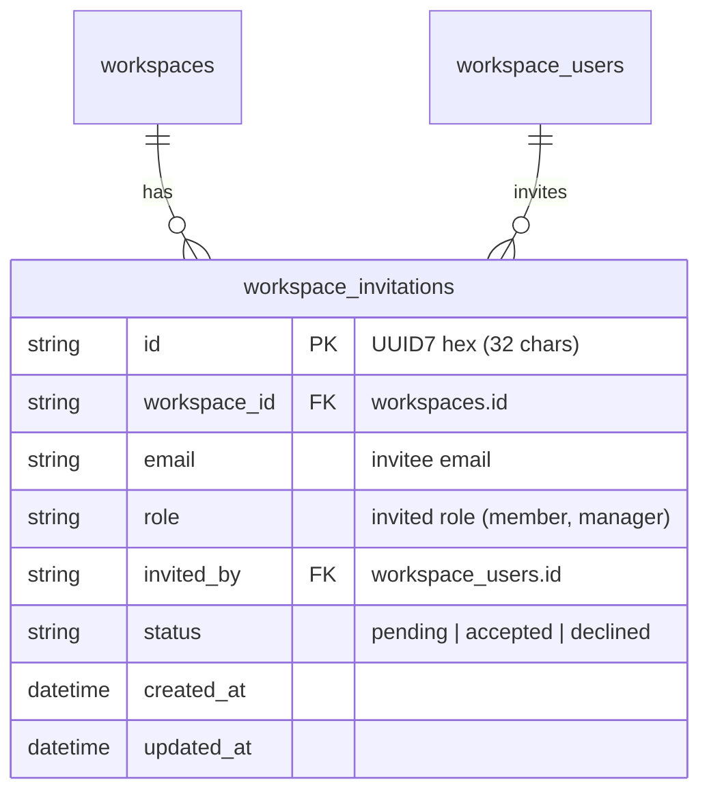
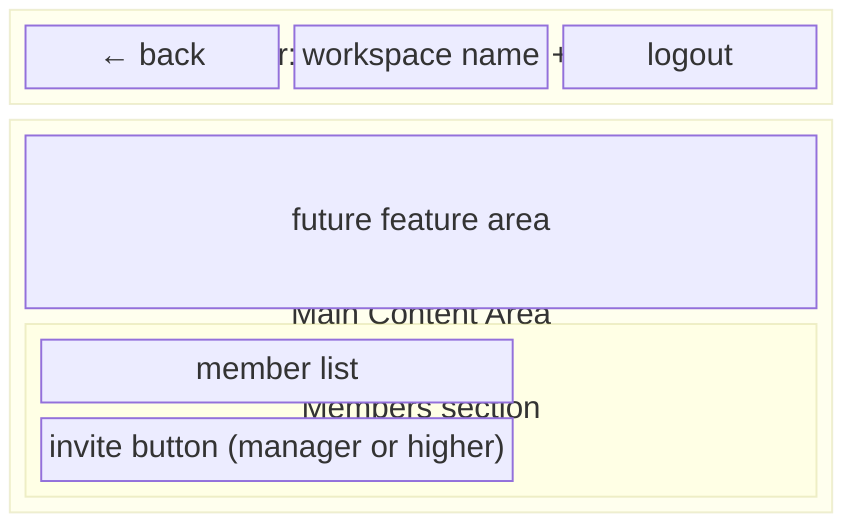
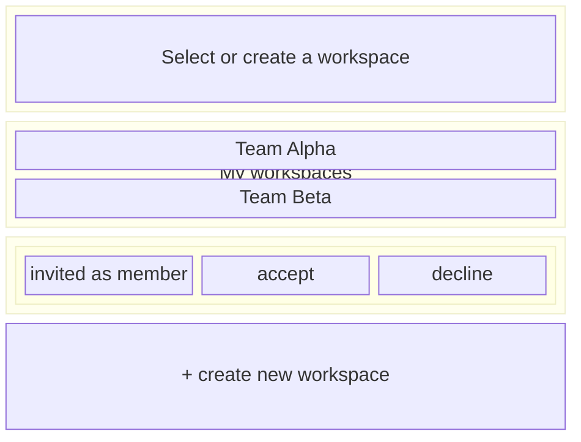
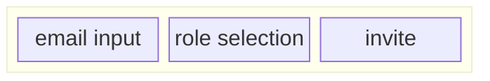
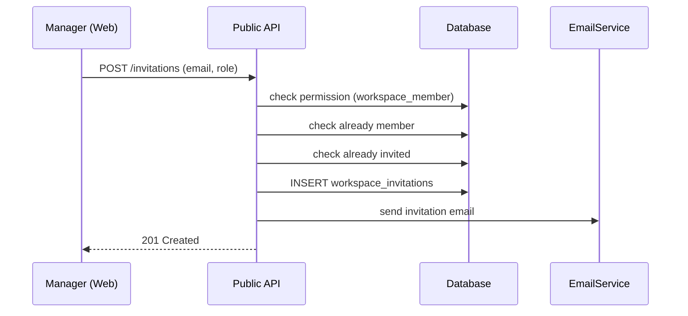
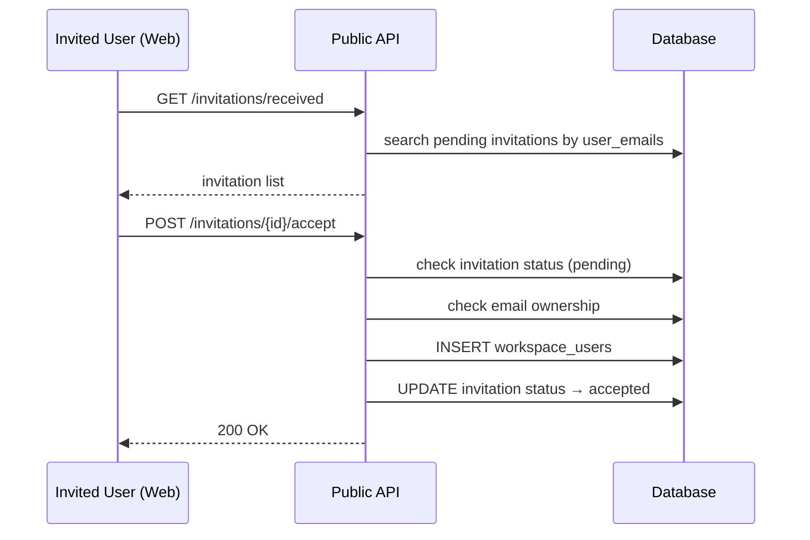

# Workspace User Invitation Feature

## Overview

Feature allowing workspace members (manager or higher) to invite other users to workspace by email address. Invited users can check invitation list on `/workspaces` page and accept/decline.

### Core Requirements

- Email-based invitation: can invite regardless of signup status.
- Invitation token unnecessary: after login, show invitation list by email matching.
- Send invitation email: button with login link.
- Permission: only manager or higher can invite (`WORKSPACE_USERS:WRITE`).
- Automatically create WorkspaceUser on invitation accept.

## Data Model

### workspace_invitations Table



**Column details:**

| Column | Type | Constraints | Description |
|---|---|---|---|
| `id` | `String(32)` | PK | UUID7 hex |
| `workspace_id` | `String(32)` | FK → workspaces.id, NOT NULL | target workspace |
| `email` | `String(255)` | NOT NULL | invitee email (lowercase normalized) |
| `role` | `ENUM(workspace_user_role)` | NOT NULL | role to grant on accept |
| `invited_by` | `String(32)` | FK → workspace_users.id, NOT NULL | workspace user who invited |
| `status` | `ENUM(invitation_status)` | NOT NULL, DEFAULT 'pending' | invitation status |
| `created_at` | `TimeZoneDateTime` | server_default=now() | created time |
| `updated_at` | `TimeZoneDateTime` | server_default=now(), onupdate=now() | updated time |

**Constraints:**
- `UNIQUE(workspace_id, email)` — duplicate invite to same email in same workspace is not allowed (regardless of status)

**Enum:**
- `InvitationStatus`: `pending`, `accepted`, `declined`

## API Design

### Public API (for authenticated users)

#### 1. POST `/invitation/v1/workspaces/{handle}/invitations` — create invitation

Create invitation and send email.

**Permission:** `WORKSPACE_USERS:WRITE` (manager or higher)

**Request Body:**
```json
{
  "email": "invited@example.com",
  "role": "member"
}
```

**Response (201):**
```json
{
  "id": "...",
  "workspace_id": "...",
  "email": "invited@example.com",
  "role": "member",
  "invited_by": "...",
  "status": "pending",
  "created_at": "...",
  "updated_at": "..."
}
```

**Errors:**
- `403`: no permission (member role)
- `404`: workspace not found
- `409`: already invited or already member

**Business logic:**
1. Check requester's workspace permission (manager or higher).
2. Check whether target email is already workspace member.
3. Check whether target email already has pending invitation.
4. Create `workspace_invitations` row.
5. Send invitation email (includes login link).

#### 2. GET `/invitation/v1/invitations/received` — list my invitations

Query pending invitations sent to current logged-in user's email.

**Permission:** authenticated user

**Response (200):**
```json
{
  "items": [
    {
      "id": "...",
      "workspace_id": "...",
      "workspace_name": "...",
      "workspace_handle": "...",
      "email": "me@example.com",
      "role": "member",
      "status": "pending",
      "created_at": "..."
    }
  ]
}
```

**Business logic:**
1. Query current user's email list (user_emails table).
2. Search pending invitations for those emails.
3. Return with workspace information.

#### 3. POST `/invitation/v1/invitations/{invitation_id}/accept` — accept invitation

Accept invitation and create WorkspaceUser.

**Permission:** owner of invited email

**Response (200):**
```json
{
  "id": "...",
  "status": "accepted"
}
```

**Errors:**
- `403`: not user's invitation
- `404`: invitation not found
- `409`: already processed (accepted/declined)

**Business logic:**
1. Check invitation exists and is pending.
2. Check current user's email matches invitation email.
3. Create WorkspaceUser (with invitation role).
4. Change invitation status → accepted.

#### 4. POST `/invitation/v1/invitations/{invitation_id}/decline` — decline invitation

**Permission:** owner of invited email

**Response (200):**
```json
{
  "id": "...",
  "status": "declined"
}
```

**Business logic:**
1. Check invitation exists and is pending.
2. Check current user's email matches invitation email.
3. Change invitation status → declined.

### Admin API

#### 1. GET `/invitation/v1/workspaces/{handle}/invitations` — list workspace invitations

Query all invitations in the workspace (regardless of status).

#### 2. DELETE `/invitation/v1/invitations/{invitation_id}` — delete/cancel invitation

Delete pending invitation.

## Email Sending

### Invitation Email Template

**Subject:**
- ko: `[NoIntern] You have been invited to the {workspace_name} workspace`
- en: `[NoIntern] You've been invited to {workspace_name}`

**Body:**
- Show workspace name.
- Login link button (URL: `{base_url}/login?next=/workspaces`).
- Invitation is email-based without token, so simply go to login page.

## Frontend

### Workspace Dashboard Layout

Build actual layout for current placeholder `WorkspaceDashboard`:



### Extend `/workspaces` Page

Add **Invited workspaces** section below existing workspace list:



### Workspace Dashboard — Invitation Feature

Member management section in `/w/{handle}` dashboard:



- Show invitation UI only to manager or higher.
- Role selection: member (default), manager.

### tRPC Router Extension

Add `invitationRouter`:

```typescript
invitationRouter = {
  create: mutation      // create invitation
  listReceived: query   // list received invitations
  accept: mutation      // accept invitation
  decline: mutation     // decline invitation
}
```

### i18n Message Keys

```json
{
  "invitation": {
    "sectionTitle": "Invited workspaces",
    "empty": "No invitations received",
    "invitedAs": "Invited as {role}",
    "accept": "Accept",
    "decline": "Decline",
    "accepting": "Accepting...",
    "declining": "Declining..."
  },
  "workspace": {
    "dashboard": {
      "inviteSection": "Invite members",
      "inviteEmailPlaceholder": "Email address",
      "inviteRoleLabel": "Role",
      "inviteSubmit": "Invite",
      "inviteSuccess": "Invitation sent",
      "inviteAlreadyMember": "Already a workspace member",
      "inviteAlreadyInvited": "Email already invited",
      "members": "Members",
      "pendingInvitations": "Pending invitations"
    }
  }
}
```

## Implementation Order

### Phase 1: Backend

1. **Add enum**: `InvitationStatus` enum
2. **DB model**: `RDBWorkspaceInvitation`
3. **Alembic migration**: create `workspace_invitations` table
4. **Add permission**: `Resource.WORKSPACE_INVITATIONS` resource
5. **Repository**: `WorkspaceInvitationRepository` CRUD
6. **Service**: `WorkspaceInvitationService` (business logic for create, accept, decline)
7. **Public API**: endpoints for create invitation, list received invitations, accept, decline
8. **Admin API**: endpoints for list invitations, delete
9. **Email template**: invitation email (ko/en)
10. **OpenAPI spec update**

### Phase 2: Frontend

1. **tRPC router**: add `invitationRouter`
2. **Workspace list page**: add invitation list section (accept/decline UI)
3. **Workspace dashboard layout**: placeholder → actual layout (header, sidebar composition)
4. **Member invitation UI**: invitation form inside dashboard
5. **i18n messages**: add 4 locales

## Sequence Diagrams

### Invitation Creation Flow



### Invitation Accept Flow


