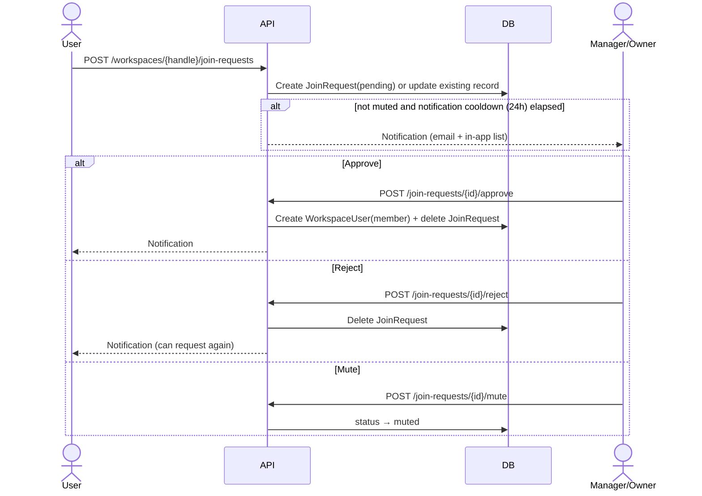

# Workspace Join Request

## Background

Currently, joining a workspace requires an administrator invitation by email. Join request is the opposite direction — user requests to join a workspace, and manager/owner approves or rejects it.

**Entry paths**: directly entering workspace URL, account-linking nudge from Slack/Discord

## Flow



## Data Model

### JoinRequestStatus

```python
class JoinRequestStatus(StrEnum):
    PENDING = "pending"
    MUTED = "muted"
```

Delete record on approve/reject. Status has only pending and muted.

### RDBWorkspaceJoinRequest

| Column | Type | Description |
|------|------|------|
| id | str (PK) | UUID7 hex |
| workspace_id | FK → workspaces.id (CASCADE) | |
| user_id | FK → users.id (CASCADE) | |
| message | str \| None | join reason (optional) |
| status | JoinRequestStatus | pending / muted |
| last_notified_at | datetime \| None | notification cooldown basis |
| created_at | datetime | |
| updated_at | datetime | |

**Constraints**:
- `UQ(workspace_id, user_id)` — one record per user per workspace

## API

### Public API

| Method | Path | Permission | Description |
|--------|------|------|------|
| `POST` | `/workspaces/{handle}/join-requests` | logged-in user | create/retry join request |
| `GET` | `/workspaces/{handle}/join-requests` | manager+ | list requests |
| `POST` | `/join-requests/{id}/approve` | manager+ | approve → join as member + delete record |
| `POST` | `/join-requests/{id}/reject` | manager+ | reject → delete record |
| `POST` | `/join-requests/{id}/mute` | manager+ | status → muted |
| `DELETE` | `/workspaces/{handle}/join-requests/{id}` | manager+ | delete request (including unmute use case) |
| `GET` | `/workspaces/{handle}/join-requests/me` | logged-in user | get my join request status |
| `GET` | `/workspaces/{handle}/invitations/me` | logged-in user | get my invitation for this workspace |

### Permission

- `WORKSPACE_JOIN_REQUESTS_READ` — owner, manager
- `WORKSPACE_JOIN_REQUESTS_WRITE` — owner, manager
- member cannot see join request list

## Business Rules

### Request creation/retry

- Already workspace member → request not allowed
- Pending invitation exists → do not expose request flow (frontend decides with `GET /workspaces/{handle}/invitations/me`)
- Pending join request exists → duplicate request not allowed
- No existing record → create new record (status=pending)
- Existing record is muted → update status to pending + update message, do not send notification

### Notification

- Notify manager/owner on new request/retry: email + in-app list
- muted state → permanently block notification
- Even when not muted, do not send notification within 24 hours based on `last_notified_at`
- Notification logic checks `last_notified_at` and calls `EmailService` directly in service layer

### Approve

- role is always `member`
- Create `WorkspaceUser` + delete join request record

### Reject

- Delete record → user can request again

### Mute

- Change status to muted → no notification on retry
- Unmute: manager deletes request, record disappears; later retry creates new record and notification is sent normally

### Invitation integration

- **If invitation is sent to user with pending join request** → automatically approve join request (create WorkspaceUser + delete join request). `InvitationService` depends on `JoinRequestRepository`.
- **User with pending invitation** → do not expose join request flow. Frontend checks invitation existence with `GET /workspaces/{handle}/invitations/me` and branches to accept button or join request button.

## Frontend UI

### Non-member workspace page

When non-member accesses `/w/{handle}`, redirect to non-member-only page instead of existing workspace page. Currently non-member access causes API calls to fail, so fix this.

**Displayed information**: workspace name, handle (only DB data)

**UI branches by state** (based on `GET /workspaces/{handle}/invitations/me` + `GET /workspaces/{handle}/join-requests/me` results):

| State | UI |
|------|-----|
| pending invitation exists | "Accept invitation" / "Decline" buttons |
| pending join request exists | show "Join request pending" state |
| neither exists | "Request to join" button + message input (optional) |

### Admin — join request management

Add join request section to member management page.

**List item**: requester info, message, request time

**Action buttons**:
- approve
- reject
- mute (block future retry notifications)
- delete (unmute use case)

## Implementation Reference

### Pattern Reference Files

| Item | Reference |
|------|------|
| Model | `rdb/models/workspace_invitation.py` |
| Repository | `repos/workspace_invitation/__init__.py` |
| Service | `services/workspace_invitation/__init__.py` |
| API | `api/public/invitation/v1/__init__.py` |
| Permission addition | `core/auth/permissions.py`, `core/auth/roles.py` |
| Email sending | `core/email/service.py` |

### Implementation Order

1. Add enum (`JoinRequestStatus`)
2. RDB model (`RDBWorkspaceJoinRequest`)
3. Alembic migration
4. Repository + data
5. Service + data
6. Add permissions (`WORKSPACE_JOIN_REQUESTS_READ/WRITE`)
7. Public API endpoints
8. `GET /workspaces/{handle}/invitations/me` endpoint
9. Modify InvitationService (automatic approval integration)
10. Email templates (join request notification, approve/reject notification)

## Follow-ups

- [ ] Slack/Discord DM notification — no DM sending infrastructure currently; needs separate build
- [ ] Workspace-level option to disable join requests (`join_policy` setting)
