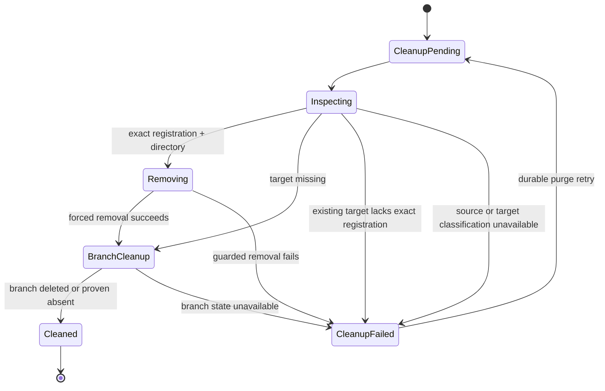

# worktree-260722/DESIGN: Session Worktree Archive and Purge Integrity

## Inputs

- Requirements:
  [worktree-260722/REQ](../requirements/worktree-260722-archive-purge-integrity.md)
- Decisions:
  [worktree-260722/ADR](../adr/worktree-260722-archive-purge-integrity.md)
- Current lifecycle boundary:
  [session-260721/DESIGN](./session-260721-lifecycle-extensibility.md)
- Existing worktree ownership policy:
  [azents-260703/ADR](../adr/azents-260703-azents-git-worktree-ownership-and-cleanup.md)

## Current Behavior and Gaps

Archive locks the complete root SessionAgent tree, rejects active Sessions and
AgentRuns, snapshots retention, archives every linked AgentSession, and schedules
the durable purge job. It preserves all worktree allocations but does not validate
their current Git registration or physical target.

Retention purge runs the required `session.git-worktrees` participant before
context and Session finalization. The participant validates allocation ownership,
then calls `remove_git_worktree(force=false)` and `delete_git_branch`. The Runner
maps any nonzero Git result to `git_command_failed`. Consequently:

- modified or untracked worktrees cannot cross the intended permanent purge
  boundary;
- a previously removed target or branch remains an undifferentiated retry;
- an existing path is not explicitly fenced by current Git registration before
  removal; and
- archive can preserve an allocation that is already missing or inconsistent,
  making the promised restore boundary invalid.

The durable purge job and participant framework already provides lease fencing,
per-phase checkpoints, retry scheduling, root-tree re-locking, active-AgentRun
protection, cleanup-before-delete ordering, and per-job isolation. This design
changes only worktree validation and cleanup semantics inside those boundaries.

## Proposed Architecture

### Typed Runner inspection

Add `inspect_git_worktree` to the runtime-control request/result oneofs and all
existing mapping layers:

- protobuf request and success payloads;
- generated runtime-control Python modules;
- shared gRPC Runner client mapping;
- backend Runner operation client and result dataclass;
- Control gRPC server request mapping;
- Runtime Runner dispatch and implementation.

Request fields:

| Field | Purpose |
| --- | --- |
| `source_project_path` | Recorded source repository |
| `worktree_path` | Exact recorded target |
| `branch_name` | Exact recorded Azents branch |

Success fields:

| Field | Purpose |
| --- | --- |
| `worktree_path` | Canonical inspected target |
| `registered` | Exact path is present in `git worktree list --porcelain` |
| `registered_branch_name` | Branch recorded by Git for the target, when present |
| `target_kind` | `directory`, `missing`, or `other` |
| `dirty` | Nullable; set only for an exact registered directory |

The Runner resolves both paths inside its mounted Agent Workspace, validates the
source as a Git repository, parses `git worktree list --porcelain -z`, and matches
the canonical target path exactly. For an exact registered directory it runs a
porcelain status command in the target and reports only whether modifications or
untracked files exist. It never returns file names, diffs, or raw status output.

Registration with a different branch is represented explicitly rather than
collapsed into unregistered state. Source-repository errors remain typed Runner
failures.

### Archive preflight

`ChatSessionService.archive_agent_session()` keeps its existing authorization,
root-tree lock, status, and AgentRun checks. Before retention mutation it:

1. locks and lists every allocation in the root context;
2. verifies each allocation creator belongs to the locked subtree;
3. applies database ownership checks for management-root path and Azents branch
   ownership;
4. obtains the current ready Agent Runtime and Runner operation client;
5. inspects each non-cleaned allocation with the typed operation; and
6. rejects the complete archive when any result is not an exact registered
   directory with the recorded branch.

`dirty=true` remains successful. `CLEANED` allocations have no retained external
worktree and do not require inspection.

The service returns `ArchiveWorktreeIntegrityBlocked` with:

- `allocation_id`;
- stable `reason_code`;
- `stage = "archive_preflight"`; and
- a bounded summary selected by server code.

The API returns 409 with these content-free fields. No archive, retention
snapshot, purge job, or worktree status mutation commits after a failure.

### Purge cleanup state machine

The existing allocation statuses remain unchanged. `cleanup_summary` records a
stable terminal or failure classification.

For purge, `_run_cleanup_for_allocation()` receives an explicit cleanup mode.
Retention purge uses `force=true`; manual cleanup retains `force=false`.

The Runner removal operation performs its own final inspection:

- exact registered directory: execute `git worktree remove`, adding `--force`
  only when requested;
- missing target: remove a stale exact Git registration when present, then return
  `already_absent`;
- existing unregistered, branch-mismatched, or non-directory target: return a
  stable `worktree_ownership_ambiguous` failure without mutation.

Removal success reports `removed` or `already_absent`. Branch deletion checks
`refs/heads/<branch>` first and reports `deleted` or `already_absent`.

After both external resources are terminal, the existing database transaction:

1. removes the Agent Project catalog entry;
2. marks the allocation `cleaned` with `removed_force` or `confirmed_absent`;
3. deletes the linked Session context Project when present; and
4. commits.

The optional empty session-worktree parent cleanup remains best-effort and is not
ownership authority.

### Durable retry convergence

`run_cleanup_for_root_tree()` continues to:

- validate the root is in the supplied subtree;
- validate every allocation creator belongs to the subtree;
- mark every non-cleaned allocation cleanup-pending;
- run only non-cleaned allocations; and
- require every allocation to be `cleaned` before returning.

The lifecycle participant remains `policy_version=1`. A retrying job whose
worktree participant is below `cleanup_completed` re-enters this method. Completed
participants are skipped by the orchestrator. Allocation summaries and successful
external side effects remain authoritative across interruption.

No scheduler, repository, or production data repair path is added.

## Failure Handling

| Condition | Archive | Purge |
| --- | --- | --- |
| Registered clean directory | Allow | Remove normally |
| Registered modified/untracked directory | Allow | Force-remove |
| Registered but physically missing | Block as non-restorable | Confirm absent, clear stale registration, clean branch |
| Unregistered and missing | Block as non-restorable | Confirm absent, clean branch |
| Unregistered but existing | Block as ambiguous | Do not delete; persist retryable safety failure |
| Registered branch differs from allocation | Block as ownership mismatch | Do not delete; persist retryable safety failure |
| Source repository invalid/unavailable | Block with bounded conflict | Persist retryable failure |
| Runtime/Runner unavailable | Block with bounded conflict | Persist retryable failure |
| Branch already absent | Not independently relevant | Terminal idempotent success |

Runner semantic failures are converted to bounded service-owned reason codes.
Raw Runner messages are not returned by the archive API or copied into purge
operator summaries.

`asyncio.CancelledError` continues to propagate. Transport and generation failures
remain retryable and do not become absence.

## Concurrency and Ownership

- Archive retains the root-tree lock and locks allocation rows before inspection.
- Allocation creator Session IDs are checked against the exact locked subtree.
- The management-root path check and Azents-created branch marker remain required.
- Runtime generation fencing protects every inspection and cleanup operation.
- Runner removal re-inspects immediately before mutation, so a prior service
  result cannot authorize deletion after state drift.
- Retention finalization re-locks and revalidates the complete root tree after
  worktree cleanup through the existing lifecycle orchestrator.
- One failed worktree participant raises through the existing per-job isolation;
  later eligible purge jobs remain claimable.

## API and Persistence Impact

Public API shape changes only for the archive 409 variant. Success remains 204.
No public permanent-delete route or immediate-purge action is introduced.

No database migration is required. Existing fields provide:

- allocation identity and trusted ownership evidence;
- cleanup status and terminal timestamp;
- bounded per-allocation cleanup classification; and
- durable purge participant phase, error attribution, and retry state.

The OpenAPI archive operation does not currently model error bodies, so generated
clients require no schema regeneration unless implementation adds a typed response
model. The implementation should prefer the established FastAPI conflict detail
shape and update route tests.

## Observability

Structured logs use allocation ID, root Session ID, operation stage, reason code,
registration state, target kind, terminal classification, and force mode. They do
not include Git output, repository content, or target paths in user-facing or
operator-safe summaries.

Durable evidence consists of:

- allocation `status`, `cleanup_summary`, and `cleaned_at`;
- purge participant phase and bounded failure attribution;
- unchanged successful participant checkpoints; and
- purge job retry/completion state.

## Rollout and Rollback

Ship the runtime protocol, Runner implementation, backend client, archive
preflight, purge cleanup correction, and tests in one focused PR so no server
version dispatches an operation unsupported by the deployed Runner artifact.

The deployment order follows the existing combined image and GitOps release
process. Retry jobs need no data migration and converge when a compatible server
and Runner are active.

Rollback before purge execution restores the old retry behavior without database
changes. After force cleanup succeeds, the external deletion is intentionally
irreversible; rollback cannot restore expired worktree contents. A forward fix is
required for any post-deployment cleanup defect.

## Test Strategy

### Primary E2E verification matrix

| Scenario | Expected result |
| --- | --- |
| Archive registered dirty worktree | Archive succeeds; worktree and local changes remain |
| Archive missing target | 409 with allocation ID and bounded reason; complete tree remains active |
| Archive existing unregistered target | 409; no filesystem mutation |
| Retention purge registered dirty worktree | Worktree force-removed, branch terminal, Session tree deleted |
| Retention purge missing target | Allocation becomes cleaned and purge completes |
| Retention purge existing unregistered target | Path remains; job retains retryable worktree participant failure |
| Retry after prior cleanup classification failure | Completed checkpoints remain; incomplete worktree participant converges |
| One ambiguous root and one valid root | Valid root completes despite the other job retrying |

Extend the credential-free archived-session retention E2E for archive atomicity,
retry, final deletion, and cross-job progress. Physical Git registration and dirty
cleanup use the local Runtime Provider E2E lane with a temporary repository under
the Agent Workspace.

### Deterministic backend and Runner coverage

- Runner inspection: registered clean, registered dirty, registered missing,
  unregistered missing, unregistered existing, branch mismatch, non-directory,
  and invalid source repository.
- Guarded removal: normal clean removal, forced dirty removal, stale registered
  missing cleanup, unregistered missing, and ambiguous existing rejection.
- Branch deletion: existing and already-absent outcomes; invalid source remains an
  error.
- Runtime-control protobuf and mapping round trips for all new request/result
  fields.
- Archive service/API: dirty accepted; every unsafe state maps to typed 409;
  no partial archive or allocation mutation.
- Purge service: `force=true` only for retention, terminal summaries, retry
  convergence, cleanup-before-delete, root-tree membership, and incomplete
  allocation rejection.
- Lifecycle orchestrator: existing participant checkpoints remain skipped and one
  failed job does not block later jobs.

### Fixture and prerequisite policy

No live credential is required. Reuse the existing PostgreSQL fixtures, local
Runner operation harness, archived-retention scheduler helper, and temporary Git
repository fixtures. Add helpers for dirty contents, physical target removal,
stale Git registration, and unrelated replacement directories.

Evidence records Git version, Runner mode, state classification, participant
phases, and final allocation/session state. It excludes paths when exposed through
public responses and excludes file contents everywhere.

Required CI lanes fail when Git, PostgreSQL, or the local Runtime Provider
prerequisite is unavailable. Optional provider-specific live lanes may skip only
under their existing explicit prerequisite policy.

## Traceability

| Requirement | ADR decisions | Design mechanisms |
| --- | --- | --- |
| worktree-260722/REQ-1 | ADR-D1, ADR-D3 | Dirty-aware non-mutating archive inspection; purge-only force mode |
| worktree-260722/REQ-2 | ADR-D1, ADR-D6 | Locked allocation preflight; typed bounded 409; archive mutation after validation |
| worktree-260722/REQ-3 | ADR-D2, ADR-D3, ADR-D4 | Guarded force removal, absent terminal outcome, idempotent branch cleanup |
| worktree-260722/REQ-4 | ADR-D1, ADR-D2, ADR-D4, ADR-D6 | Exact registration fencing, ambiguous existing-path rejection, bounded reasons |
| worktree-260722/REQ-5 | ADR-D5 | Unchanged participant version/checkpoints and ordinary durable retry |
| worktree-260722/REQ-6 | ADR-D1 through ADR-D6 | Runner matrix, archive atomicity tests, durable summaries, participant evidence |

## Feasibility

| Scope | Result | Evidence |
| --- | --- | --- |
| Archive integrity preflight | Feasible | Archive already locks the complete root tree and owns the atomic transition |
| Non-mutating Runner inspection | Feasible | Typed Git operations and protobuf generation pipeline already exist |
| Dirty purge cleanup | Feasible | Existing removal payload already carries explicit `force` |
| Missing-target convergence | Feasible | `git worktree remove --force` clears a stale registration whose directory is gone |
| Ambiguous-path safety | Feasible | Runner can combine exact porcelain registration with physical target kind |
| Branch idempotency | Feasible | Existing branch probe helper can prove exact branch absence before deletion |
| Legacy retry convergence | Feasible | Orchestrator retries incomplete phases and skips durable completed checkpoints |
| Persistence | Feasible without migration | Allocation cleanup summary and participant failure/progress rows already exist |

No design or requirement blocker remains. One focused PR is sufficient because the
change extends an existing typed Runner path and existing lifecycle participant
without changing persistence or public success contracts.

## Living Spec Updates

After verification, update:

- `docs/azents/spec/domain/conversation.md` for archive preflight and purge
  classification;
- `docs/azents/spec/flow/agent-runtime-control.md` for inspection and guarded Git
  operation semantics.
