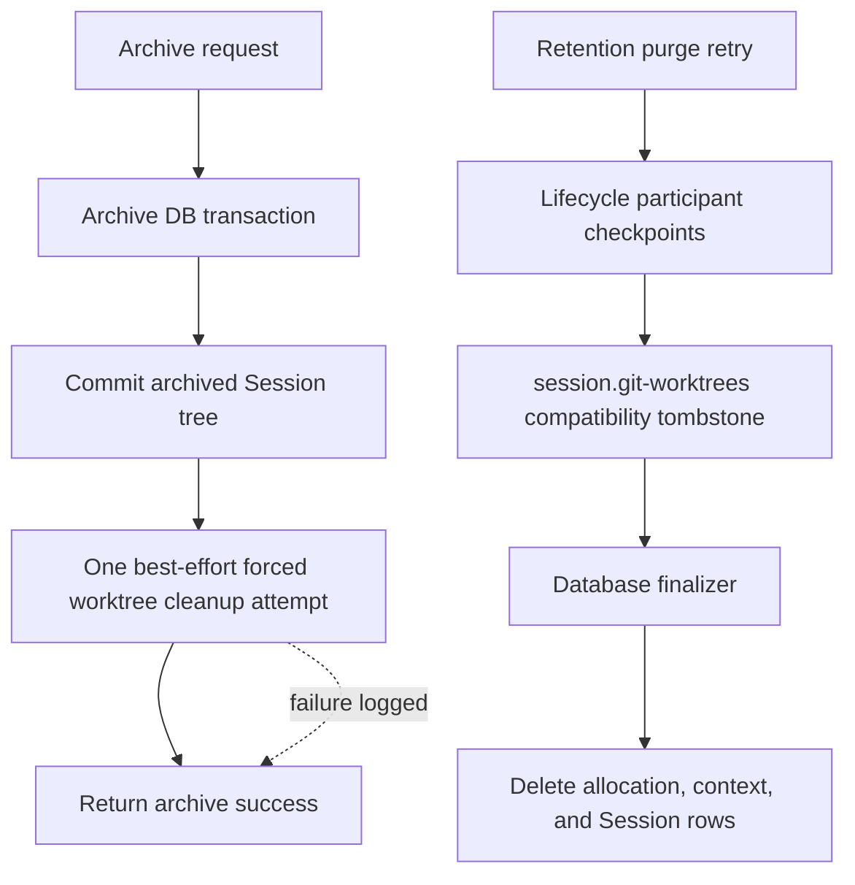

# Archive-Owned Session Worktree Cleanup Design

- Requirements:
  [worktree-260723/REQ](../requirements/worktree-260723-archive-owned-cleanup.md)
- ADR: [worktree-260723/ADR](../adr/worktree-260723-archive-owned-cleanup.md)
- Document reference: `worktree-260723/DESIGN`

## Current Behavior and Gap

`ChatSessionService.archive_agent_session()` currently locks worktree allocations
and asks the Runtime Runner to validate Git registration and physical target
integrity before archive. A validation failure returns a typed conflict and leaves
the Session active.

`ArchivedSessionPurgeService` dispatches `session.git-worktrees` to
`SessionGitWorktreeService.run_cleanup_for_root_tree()`. That operation requires a
ready Runtime Runner, force-removes worktrees, deletes owned branches, verifies
allocation cleanup state, and blocks final database deletion on any failure.

This is the inverse of worktree-260723/REQ: archive must own a disposable cleanup
attempt, while purge must ignore Runtime and Git state.

## Proposed Ownership Boundary

Runtime/Git operations exist only on the archive cleanup branch. The purge branch
has no `SessionGitWorktreeService` dependency.

## Archive Flow

The existing archive transaction keeps authorization, root-tree locking,
active-run checks, retention snapshotting, participant archive operations, root
transition, and purge scheduling.

The preflight worktree allocation lock and
`validate_archive_integrity()` call are removed. After `session.commit()`:

1. invoke `run_archive_cleanup_for_root_tree()` with the Agent ID, root Session ID,
   and locked subtree Session IDs;
2. use `force=true` for every non-cleaned owned allocation;
3. record and log expected Runner or ownership failures with bounded identifiers;
4. catch and log unexpected failures per allocation so later allocations still
   receive their attempt;
5. retain the outer best-effort exception boundary for setup failures;
6. consume the existing external-channel archive cleanup;
7. return the already-successful archive result.

No durable work item is created for this cleanup. A crash between commit and the
call is an accepted skipped attempt.

## Worktree Service Behavior

The root-tree archive cleanup method reuses the existing allocation ownership,
Runner lookup, typed removal, owned-branch deletion, empty parent cleanup, project
catalog cleanup, and allocation state updates.

Unlike the former purge method, it:

- describes the root as an archive subtree;
- treats Runtime absence as a recorded cleanup failure and returns;
- does not raise merely because allocations remain non-cleaned;
- makes one pass over the current allocation set;
- isolates unexpected allocation failures and continues with later targets;
- returns the number of allocations observed for bounded logging and tests.

Manual cleanup remains separate and does not become a retention prerequisite.

## Purge Compatibility Tombstone

The registry retains the stable participant key and policy version
`session.git-worktrees@1`. This preserves lookup and dependency closure for
already-materialized snapshots.

Its current ownership metadata becomes:

- `session_agent_context_git_worktrees`: pure database child;
- no physical `session-git-worktrees` external resource;
- archive policy: preserve, because the post-commit attempt is owned by the archive
  service boundary rather than the archive transaction orchestrator;
- restore policy: preserve;
- purge policy: declared cascade;
- dependency: `session.exchange-files`;
- downstream dependency: `session.context`.

During prepare, cleanup, and verify, the purge operation returns either no summary
or a bounded tombstone summary and performs no worktree service call. Ordinary
checkpoint persistence clears prior failure and blocked metadata.

## Database Finalization

No migration is required. The installed schema defines the
`session_agent_context_git_worktrees.session_agent_context_id` foreign key with
restrictive deletion behavior. `SessionLifecycleFinalizerRepository` already
deletes allocation rows for the root context IDs before deleting context and
Session rows.

The finalizer continues to use that explicit order without reading
`SessionGitWorktreeStatus`. Physical worktree and branch state is outside the
purge transaction.

## Failure Handling and Observability

- Expected Runner, Runtime, and ownership failures remain bounded in allocation
  cleanup state and structured warning logs.
- Unexpected archive cleanup failures are isolated and logged with Agent ID, root
  Session ID, creator Session ID, and opaque allocation ID.
- Archive returns success after its transaction commits regardless of cleanup
  outcome.
- Purge failure attribution remains unchanged for other required participants.
- The tombstone participant advances like any other durable participant and is
  visible in existing progress records.

## Rollout and Recovery

Deployment requires no migration or production data repair. On the next scheduler
attempt, a job blocked at the worktree cleanup phase resolves the existing
participant key, checkpoints the no-op phase, and continues.

Rollback to the former implementation would restore Runtime-dependent purge and
can re-block jobs, so rollback is not an operational recovery strategy. Forward
fixes must preserve the database-only purge boundary.

## Traceability

| Requirement | ADR decision | Design mechanism |
| --- | --- | --- |
| worktree-260723/REQ-1 | ADR-D1 | Post-commit forced best-effort archive cleanup |
| worktree-260723/REQ-2 | ADR-D2, ADR-D3 | Purge tombstone and explicit DB finalizer |
| worktree-260723/REQ-3 | ADR-D2, ADR-D4 | Stable key/version and ordinary checkpoint retry |
| worktree-260723/REQ-4 | ADR-D1, ADR-D2 | Structured logging, manifest reclassification, tests |

## Test Strategy

### Primary verification matrix

| Scenario | Level | Expected evidence |
| --- | --- | --- |
| Archive cleanup succeeds | Service integration | Archive row commits before one forced root-tree call |
| Runtime unavailable or cleanup raises | Service integration | Archive still returns success and row remains archived |
| Fresh purge | Service unit/integration | Tombstone checkpoints and Session tree deletes with no Runtime collaborator |
| Existing worktree-failed job | Durable workflow unit | Next retry advances cleanup and downstream context checkpoints |
| Ownership manifest | Registry unit | Allocation table is a pure database child and external worktree resource is absent |
| Restrictive FK deletion | PostgreSQL integration | Finalizer deletes allocation rows before context and Session rows |

### E2E plan

This change has no distinct browser interaction beyond the existing archive
action. Deterministic backend service and PostgreSQL integration tests are primary
because the acceptance boundary is post-commit failure handling and the absence of
a Runtime call during an asynchronous scheduler retry. Existing archive E2E
coverage remains sufficient for the user-visible success path; no new testenv
fixture or live Runtime credential is required.

### CI and evidence policy

- Run targeted chat archive, purge, retention, lifecycle registry, and worktree
  service tests.
- Run the complete backend pytest suite, Ruff, and Pyright.
- Run documentation snapshot and index validation.
- PostgreSQL-backed tests must fail when their standard database prerequisite is
  available. Tests that require unavailable local container infrastructure may
  skip under the repository's existing policy and must run in CI.
- Review evidence consists of passing test output and assertions that no purge
  service dependency or event invokes worktree cleanup.
