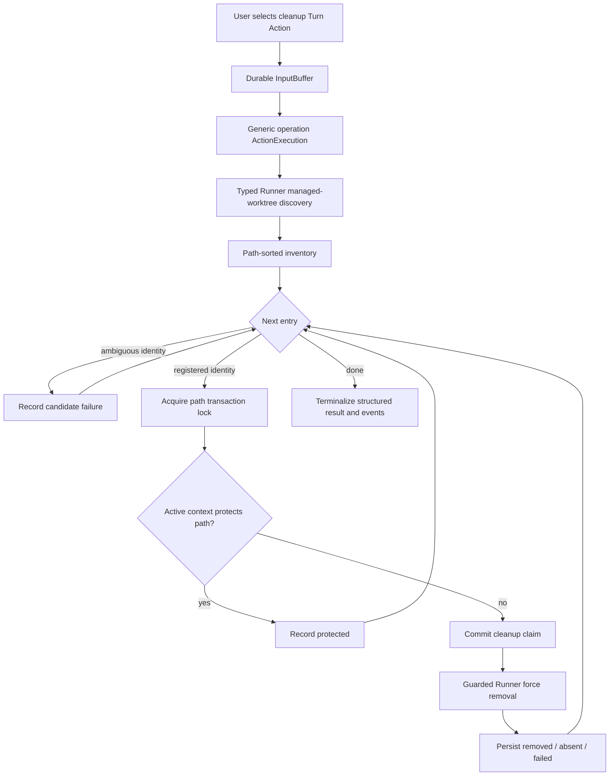

# worktree-260726/DESIGN: Manual Orphan Worktree Cleanup

## Inputs

- Requirements:
  [worktree-260726/REQ](../requirements/worktree-260726-manual-orphan-cleanup.md)
- Decisions:
  [worktree-260726/ADR](../adr/worktree-260726-manual-orphan-cleanup.md)
- Current execution flow:
  [Agent execution loop](../spec/flow/agent-execution-loop.md)
- Current Runner boundary:
  [Agent Runtime control](../spec/flow/agent-runtime-control.md)

## Current Behavior and Requirement Gaps

`create_git_worktree` is the only operation Turn Action. Input-buffer preparation
creates a durable `ActionExecution` keyed by the source buffer, and
`RunExecutor` admits the operation through owner-generation and shutdown fences.
`SessionGitWorktreeService` publishes ordered events and terminalizes the live
projection into one durable `action_execution_result`.

This provides most of the execution lifecycle required by
worktree-260726/REQ-1 and REQ-6, but the path is named and typed specifically for
worktree creation. `ActionExecution` also lacks structured action result data, and
the web timeline card infers creation results from command argv and output.

`SessionAgentContext` is the shared root-tree resource boundary and records its
`agent_runtime_id`. Its Project rows contain every path connected to that root
tree, and its worktree allocation rows contain pending and established
Azents-owned targets. These tables can produce an authoritative active protection
set. No repository currently produces that set across every active context on
one Runtime.

The Runner can inspect or remove one allocation-backed worktree when the source
path, target path, and branch are already known. It cannot enumerate managed-root
worktrees after their allocation rows have been purged. Generic file listing and
deletion cannot safely substitute for Git identity discovery.

Project registration and worktree target selection also do not coordinate with a
manual cleanup claim. A final protection query without a shared write-side fence
would leave a race between database observation and destructive Runner I/O.

## Proposed Architecture



The cleanup service is an action handler coordinated by the generic operation
pipeline. It owns orchestration and semantic reason mapping. Repositories own
protection and claim transactions. The Runner owns filesystem confinement, Git
identity, final revalidation, and mutation.

## Action Contract and Dispatch

Add the action model:

```text
type = "cleanup_orphan_git_worktrees"
```

It has no configurable force or branch-delete fields. Those semantics are fixed
by worktree-260726/REQ-4 and cannot be weakened or strengthened by the client.

Replace `WorktreeActionInput` with a closed `OperationActionInput` carrying an
operation-action union and optional durable execution. Input-buffer preparation
recognizes every operation variant, creates or loads the action execution in the
same transaction, and leaves model turn eligibility neutral.

`RunExecutor` delegates through an exhaustive action-discriminator dispatch:

- `create_git_worktree` → existing Session worktree creation handler;
- `cleanup_orphan_git_worktrees` → orphan cleanup handler.

Both handlers return a common process result containing
`context_invalidated`. Cleanup returns `false` because it cannot mutate the
requesting active context's protected Projects. The executor continues FIFO
processing after cleanup terminalization under the existing rules.

## Runtime and Active Protection Projection

### Canonical Runtime

At operation admission, load the requesting Session's canonical execution
snapshot and root context. Require:

- the Session and root Session are active;
- the context's `agent_runtime_id` is non-null;
- the Runtime belongs to the same Agent and Workspace;
- the Runtime Runner is ready; and
- the current Runner generation equals the generation used by every operation.

The cleanup action never enumerates or starts another Runtime.

### Protected path query

Add a repository query keyed by `agent_runtime_id`. It joins:

- `session_agent_contexts`;
- the root `session_agents` row;
- the root `agent_sessions` row;
- `session_agent_context_projects`; and
- `session_agent_context_git_worktrees`.

A context participates only when its root Session is the canonical root node,
belongs to the same Agent and Workspace, and has active/non-archived status.

The result is a normalized set of:

- every context Project path; and
- every allocation path except allocations already marked `cleaned`.

For each discovered worktree root, protection uses normalized POSIX path
components rather than string prefixes. A path protects the candidate when it is
equal to the candidate, is an ancestor containing the candidate, or is a
descendant inside the candidate. This preserves safety for arbitrary existing
Project registration paths, including a repository subdirectory or a broader
Project root that contains managed worktrees.

This covers manually registered worktrees, ready allocated worktrees, and a
creation operation that has already reserved a target but has not yet registered
the Project. An operation that has not created an allocation has no physical
target to protect.

## Persistence and Path Coordination

### Worktree path claims

Add `git_worktree_path_claims` with:

| Field | Purpose |
| --- | --- |
| `id` | opaque claim identity |
| `agent_runtime_id` | exact Runtime scope |
| `worktree_path` | canonical managed-root target |
| `owner_kind` | `manual_action` or `archive_cleanup` |
| `action_execution_id` | nullable requesting durable operation |
| `root_session_id` | nullable archive-cleanup owner |
| `owner_generation` | nullable stale-owner attribution |
| `discovery_fingerprint` | immutable Runner identity snapshot |
| `state` | `claimed`, `removing`, `removed`, `already_absent`, `failed`, or `unresolved` |
| `reason_code` / `summary` | bounded candidate result |
| `lease_until` | bounded external-operation ownership |
| timestamps | claim and terminal ordering |

Use a unique constraint on `(agent_runtime_id, worktree_path)`. Settled claims
are deleted before ordinary action terminalization. A cancellation deletes only
non-`removing` claims: an in-flight `removing` claim survives action
terminalization with its action foreign key set to null and retains its bounded
lease, preventing path reuse until the still-settling Runner removal is no
longer authoritative. Only leased `claimed` and `removing` rows block a new
connection.
Under the coordination locks, a non-blocking terminal row or a reclaimable
expired row can be reset and reassigned to a new owner rather than conflicting
with the unique constraint.
Terminalization deletes or releases the action's claims in the same transaction
that snapshots the durable result. Archive cleanup releases its claim after each
best-effort attempt. An expired claim is reclaimable only under the same path
transaction lock after the previous owner or action state is checked.

### Runtime and exact-path transaction locks

Create repository helpers that derive stable signed advisory-lock keys and invoke
`pg_advisory_xact_lock`:

- one key from the Runtime ID for managed-worktree topology coordination; and
- one key from the Runtime ID and canonical candidate path for exact destructive
  ownership.

When both are needed, always acquire the Runtime coordination lock before the
exact path lock. Use the Runtime lock in:

- cleanup candidate claim;
- existing-folder Project registration and removal when the Project path equals,
  contains, or is below the managed worktree root;
- initial/root Session Project registration;
- input-buffer and automatic Project attachment under or across that root;
- worktree allocation target selection and collision retry; and
- create-worktree Project linking.

Use both locks for manual cleanup claim insertion and archive-owned worktree
cleanup before its existing best-effort Runner call.

Within the Runtime lock, Project attachment queries blocking claims by normalized
path overlap and returns a typed conflict when a claimed worktree equals,
contains, or is contained by the Project path. Worktree creation treats an exact
claimed target like a path collision and chooses the next bounded suffix. Manual
cleanup acquires the exact path lock, refreshes active Project and allocation
overlap in the same transaction, and inserts or reassigns the claim only when
unprotected. Archive cleanup skips its disposable attempt when another leased
claim owns the path; when it obtains the claim, manual cleanup observes
`cleanup_in_progress` and continues with later candidates.

No transaction or advisory lock remains open during discovery, inspection,
removal, projection broadcasting, or Skill refresh.

## Runner Discovery and Removal

### `discover_managed_git_worktrees`

The operation accepts no client-selected root. The Runner uses its configured
Agent Workspace and fixed managed worktree root. It performs a bounded scan of
the expected managed-root layout, canonicalizes every entry without following an
escaping symlink, and establishes Git identity through Git plumbing rather than
directory names.

Each ordered entry returns:

| Field | Meaning |
| --- | --- |
| `worktree_path` | canonical target under the managed root |
| `registered` | exact Git registration established |
| `repository_anchor_path` | safe linked repository path under Agent Workspace |
| `branch_name` | registered local branch, when established |
| `head_commit` | observed target commit |
| `fingerprint` | hash of canonical repository identity, path, branch, and observed registration metadata |
| `failure_code` | bounded classification when identity is ambiguous |

The result contains no repository file names, status paths, diffs, or file
contents. Discovery fails before deletion if the inventory exceeds the operation
limit, so the service never treats a truncated list as complete.

### `remove_discovered_git_worktree`

The operation receives the exact discovered fields, `force=true`, and the current
Runner generation. It:

1. canonicalizes the target and repository anchor again;
2. verifies workspace and managed-root confinement;
3. reruns exact Git worktree registration discovery;
4. compares the fingerprint, target, and branch;
5. removes the worktree with forced Git semantics when identity still matches;
6. reconciles a missing target and stale registration as `already_absent`; and
7. returns `identity_changed` or `worktree_ownership_ambiguous` without deletion
   for every mismatch.

It does not call `delete_git_branch`, prune unrelated registrations, or perform
generic recursive deletion. The existing allocation-backed
`remove_git_worktree` remains unchanged for its lifecycle callers.

## Execution State and Result Model

Add nullable `result` JSONB to `action_executions` and the corresponding domain,
repository, transport, OpenAPI, and generated-client projections.

Cleanup validates a versioned result:

```text
schema_version
phase
examined_count
protected_count
removed_count
already_absent_count
failed_count
unresolved_count
candidates[]
```

Each candidate contains `path`, `outcome`, `reason_code`, and bounded `summary`.
The service stores the complete initial inventory as unresolved, then updates the
result transactionally after each classification. This ensures the cancellation
finalizer does not depend on process memory.

Ordered live events use these step keys:

- `discover_orphan_git_worktrees`;
- `protect_active_worktree`;
- `remove_orphan_git_worktree`;
- `orphan_git_worktree_removed`; and
- `orphan_git_worktree_failed`.

Events are semantic messages and do not expose command argv or raw stdout/stderr.
The result object is the machine-readable source for aggregate and
candidate-level rendering.

## Candidate Algorithm

For one freshly discovered, path-sorted inventory:

1. persist every entry as an examined unresolved candidate;
2. for an ambiguous entry, record `failed` and continue;
3. acquire the Runtime coordination lock and then the exact path transaction
   lock;
4. refresh active path-overlap protection for that candidate;
5. when protected, record `protected`, release the transaction, and continue;
6. when another cleanup owns the blocking claim, record
   `failed/cleanup_in_progress` and continue;
7. insert this action's claim and commit;
8. mark the claim `removing`;
9. invoke guarded Runner removal;
10. persist `removed`, `already_absent`, or a bounded `failed` result and release
    the blocking state; and
11. continue until every inventory entry has an outcome.

If `failed_count` is zero, mark the action completed. Otherwise mark it failed
after the final candidate, with a summary that points the user to the candidate
results. A zero-entry inventory completes with all counts zero.

## Cancellation, Ownership Loss, and Retry

`asyncio.CancelledError` remains separate from ordinary failures. The handler:

1. requests cancellation of an in-flight Runner operation through the existing
   foreground operation channel;
2. preserves the in-flight candidate as `unresolved` because the local
   cancellation terminalizer does not wait for a second Runner reply fold;
3. preserves all earlier candidate outcomes;
4. leaves undispatched candidates `unresolved`;
5. releases every non-removing claim while retaining an in-flight `removing`
   claim through its bounded lease; and
6. calls the existing action cancellation terminalizer.

At the next Session processing boundary, stale live operation terminalization
uses the same result reconstruction and claim-retention path. It never replays
the old removal request. A later explicit invocation discovers current Git state
again after the retained lease expires.

A later user invocation creates a new action execution and performs discovery
again. Removed targets disappear or reconcile as absent; failed and unresolved
targets are reconsidered from current product and Git state.

## API, Authorization, and Web Behavior

### Public action definition

Extend the public input-action union and `list_input_actions` result with:

- discriminator: `cleanup_orphan_git_worktrees`;
- localized title;
- destructive explanatory description;
- no input fields.

The existing accessible-Session and Workspace-member authorization applies to
listing and submission. Submission retains `sender_user_id`, Session ID,
input-buffer ID, and client request identity. Runtime readiness is evaluated by
execution rather than used to silently hide an otherwise valid action.

### Web rendering

Split `ActionExecutionTimelineCard` into an action-type dispatcher with:

- the existing create-worktree renderer;
- a cleanup renderer; and
- a generic fallback.

The cleanup renderer shows:

- pending/running/completed/failed/cancelled status;
- current phase;
- aggregate counts;
- ordered candidate rows with path and semantic outcome;
- bounded failure or unresolved reason; and
- no shell command, stdout, stderr, status file, or diff content.

Add colocated Storybook stories for zero-candidate success, mixed success and
failure, active protection, live removal, and cancelled partial completion.

## Security and Safety

- The action payload cannot select a different Runtime, root path, force policy,
  or branch deletion policy.
- Only paths canonicalized below the fixed managed root are candidates.
- Exact Git identity, not a directory name or Project catalog row, authorizes
  mutation.
- Active Session product state is checked under the same short path lock used by
  connection writers.
- Runner generation fencing rejects stale Runtime operations.
- Local branches are never passed to a deletion operation.
- User-visible results contain paths because worktree-260726/REQ-6 requires
  candidate identification, but omit repository contents and raw Git output.
- Reason strings use server-selected codes and bounded summaries.

## Migration, Rollout, and Rollback

Generate one Alembic revision that:

- creates `git_worktree_path_claims` and its Runtime/path unique constraint plus
  owner/action indexes; and
- adds nullable `result` JSONB to `action_executions`.

No backfill is required. Existing action rows decode a null result.

Deliver the feature in one focused PR. Within that PR, implement and review the
change in dependency order:

1. migration, repositories, protection queries, path coordination, and typed
   Runner protocol and implementations;
2. operation dispatch, cleanup service, structured result, public schema, and
   generated clients; and
3. web rendering, Storybook, E2E coverage, and living-spec updates.

The PR must not expose the action unless its backend and Runner operations are
present and verified in the same release unit. Rollback before action use only
leaves nullable schema. After removals, rollback cannot restore worktree
contents; disable action advertisement and ship a forward fix. Do not add a
shell or generic-file fallback.

## Observability

Structured logs and metrics include:

- action execution ID and Runtime ID;
- discovery count and duration;
- candidate outcome and stable reason code;
- claim contention;
- protected, removed, absent, failed, and unresolved totals;
- Runner generation failures; and
- cancellation lease-retention outcome.

Logs may include the canonical worktree path under the same policy as the
user-visible candidate result, but never include repository content, Git status
paths, diffs, or raw command output.

## Test Strategy

### Primary E2E verification matrix

| Scenario | Expected product evidence |
| --- | --- |
| No managed worktrees | Action completes with all counts zero |
| One orphan clean worktree | Worktree directory and registration disappear; local branch remains |
| One orphan dirty/untracked worktree | Forced removal succeeds; local branch remains |
| Worktree connected to requesting root | Candidate is protected and remains |
| Worktree connected to another active root on the same Runtime | Candidate is protected and remains |
| Active Project is an ancestor or descendant of the worktree root | Candidate is protected by normalized path overlap and remains |
| Worktree connected only to an archived root | Candidate is removed |
| Allocation row was purged but Git registration remains | Discovery identifies and removes the orphan |
| Managed-root directory has no provable Git identity | Directory remains; candidate fails with bounded reason |
| One removal fails between successful candidates | Later candidate is attempted; action ends failed with mixed outcomes |
| Exact, ancestor, or descendant Project connection races with cleanup | Exactly one wins Runtime coordination: the candidate is protected or registration receives a typed conflict; active work is never removed |
| User stops after one removal | Completed removal remains recorded; remaining candidates are unresolved; branches remain |
| Action is invoked again after partial failure | New discovery processes only current remaining state |
| Another Runtime is unavailable | Current-Runtime action result is unaffected |

Use the browser to submit the real action, observe live WebSocket projections,
reload the Session, and verify the same durable terminal result. Assertions on
physical worktree registration and branch survival run through the local Runtime
Provider fixture, not through a mocked browser response.

### Deterministic backend and Runner coverage

- Runner discovery: clean, dirty, missing, stale registration, damaged `.git`,
  symlink escape, non-directory, branch identity, deterministic order, and
  inventory overflow.
- Guarded removal: force removal, already absent, identity drift, branch drift,
  repository-anchor drift, target replacement, and branch preservation.
- Protection repository: active versus archived roots, same versus different
  Runtime, exact/ancestor/descendant Project overlap, component-boundary
  non-overlap, allocation-only reservation, and cleaned allocation exclusion.
- Coordination: cleanup-before-registration, registration-before-cleanup,
  ancestor and descendant Project races, fixed Runtime-then-path lock ordering,
  concurrent manual cleanup claims, concurrent archive cleanup, expired-lease
  reclamation, terminal-claim reassignment, worktree target suffixing,
  transaction rollback, and no lock retained during Runner I/O.
- Action service: zero candidates, mixed outcomes, continue-after-failure,
  structured result updates, terminal failure rule, generation loss, Runner
  cancellation, and stale-operation terminalization.
- Input-buffer/executor: exhaustive operation dispatch, FIFO behavior, neutral
  model-turn effect, shutdown barrier, and existing create-worktree regression.
- API/client/web: action listing and submission, generated union decoding,
  fallback rendering, candidate result rendering, localization, and reload from
  durable history.

### Fixture and prerequisite support

Extend the existing local Runtime Provider and temporary Git repository fixtures
with helpers that can:

- create several branch-backed worktrees under the managed root;
- add modified and untracked content without exposing it to assertions;
- delete allocation rows while retaining Git registration;
- create ambiguous replacement directories;
- hold a registration transaction at the path-lock boundary; and
- inspect local branch existence after removal.

The primary E2E lane is credential-free. It requires PostgreSQL, Git, the Azents
backend and worker, web, broker, and a local Runtime Runner supporting the new
protocol. Record the backend/Runner build revision, Git version, Runtime ID,
action execution ID, live projection sequence, durable result, final worktree
registration, and branch existence. Do not record file contents.

Required CI lanes fail when PostgreSQL, Git, broker, browser, or the local Runtime
Provider prerequisite is unavailable. Provider-specific live infrastructure
lanes may skip only under their existing explicit optional-prerequisite policy;
they are diagnostic and do not replace the credential-free primary E2E.

## Traceability

| Requirement | ADR decisions | Design mechanisms |
| --- | --- | --- |
| worktree-260726/REQ-1 | ADR-D1, ADR-D7 | Parameterless operation Turn Action, existing provenance, public action definition |
| worktree-260726/REQ-2 | ADR-D2, ADR-D3 | Canonical context Runtime, fixed-root Runner discovery, no cross-Runtime query |
| worktree-260726/REQ-3 | ADR-D2, ADR-D4, ADR-D6 | Active-context protected query, path lock, committed claim, per-candidate refresh |
| worktree-260726/REQ-4 | ADR-D3, ADR-D6 | Guarded force removal, identity failure, no branch deletion |
| worktree-260726/REQ-5 | ADR-D4, ADR-D5, ADR-D6 | Independent claims/outcomes, sequential continuation, fresh rerun |
| worktree-260726/REQ-6 | ADR-D1, ADR-D5, ADR-D6, ADR-D7 | Durable structured result, semantic events, reconciliation, dedicated UI |

## Feasibility

| Scope | Result | Repository evidence and required change |
| --- | --- | --- |
| REQ-1 operation action | Feasible | Existing InputBuffer and ActionExecution lifecycle is reusable; executor and preparation types require generalization |
| REQ-2 Runtime scope | Feasible | `SessionAgentContext.agent_runtime_id` and canonical Session execution checks identify the exact Runtime |
| REQ-3 active protection | Feasible with migration | Shared root contexts already own Project and allocation paths; add cross-context overlap query, claims, and Runtime-plus-path coordination |
| REQ-4 safe force removal | Feasible with Runner extension | Existing typed inspect/remove operations prove the pattern; inventory and allocation-less guarded removal are new |
| REQ-5 partial failure | Feasible | Existing ordered durable action events and terminal states support continuation; structured result and candidate claims preserve detail |
| REQ-6 live and durable outcome | Feasible with migration/client update | Existing live projection and durable handover are reusable; add generic result JSON and cleanup renderer |
| Connection race | Feasible | Runtime-scoped and exact-path PostgreSQL transaction advisory locks plus overlap-aware committed claims serialize attachment without holding locks over Runner I/O |
| Branch preservation | Feasible | Manual removal operation omits the existing separate `delete_git_branch` call |
| Deterministic verification | Feasible | Existing backend PostgreSQL fixtures, Runner operation harness, local Runtime Provider, chat E2E, and Storybook patterns can be extended |

No requirement or design blocker remains.

## Remaining Non-Blocking Risks

- The implementation must inventory every current Project-attachment and removal
  entrypoint and route paths that overlap the managed root through the Runtime
  coordination helper.
- Inventory overflow is an explicit discovery failure; the initial bound should
  be operationally generous and observable.
- Cancellation can remain unresolved at the exact side-effect boundary; the
  bounded `removing` claim lease prevents immediate path reuse, the durable
  result states the uncertainty, and a later explicit invocation performs fresh
  discovery.

## Living Spec Updates

After implementation and verification, update:

- `docs/azents/spec/flow/agent-execution-loop.md` for generic operation dispatch,
  cleanup action lifecycle, result projection, and cancellation semantics;
- `docs/azents/spec/flow/agent-runtime-control.md` for managed worktree discovery
  and guarded manual removal;
- the Session/workspace domain spec that owns active context Project and
  allocation protection; and
- the public chat action/UI behavior spec, if separate from the execution-loop
  spec at implementation time.
