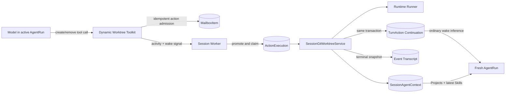

# worktree-260812/DESIGN: Agent-Managed Dynamic Worktrees

## Overview

This Design implements the confirmed [worktree-260812/REQ](../requirements/worktree-260812-agent-managed-dynamic-worktrees.md) through the accepted [worktree-260812/ADR](../adr/worktree-260812-agent-managed-dynamic-worktrees.md). It adds two Agent-facing tools that durably request creation or removal of current-Session-managed Git worktrees. The tools reuse operation TurnAction ownership, progress, terminal history, Runtime fencing, Project registration, and Skill projection infrastructure. Their terminal outcomes continue the initiating task through a hidden system-originated mailbox input, a predecessor-Run consumption fence, and a fresh AgentRun.

The feature does not create worktrees during External Channel Session admission, does not let tools mutate Git directly, and does not broaden removal authority beyond exact current-Session worktree allocations.

## Current Behavior and Gaps

### Existing reusable behavior

- Root and descendant Sessions share one `SessionAgentContext`, including its `SessionWorkspaceProject` registry and `SessionGitWorktree` allocations.
- Existing `create_git_worktree` operation TurnActions execute before model dispatch, own durable live progress through `ActionExecution`, create an Azents-owned branch-backed worktree through typed Runner operations, register the resulting Project, update the Agent Project Catalog, synchronize filesystem Skills into the session `latest` projection, append one terminal `action_execution_result`, and invalidate prepared context.
- Operation execution is fenced by Session owner generation and foreground admission. Leftover active operations are cancelled rather than replayed after takeover.
- `SkillToolkit.on_run_start` adopts the session `latest` filesystem Skill projection as `active` for each fresh Run identity.
- Runtime Workspace prompt and file tools already present exact registered Project paths to the model.
- Runner supports typed worktree creation, inspection, non-force or force removal, dirty/untracked detection, and branch deletion.
- Worktree path claims serialize destructive operations for one Runtime path.
- External Channel publication is bound to durable Session Binding and Channel Work rather than one Run identity, so a fresh Run can continue the same provider conversation.

### Gaps

- No Agent-facing tool can request managed worktree creation or branch-preserving removal.
- Existing creation actions require a source path and explicit starting ref and do not pin a current Session Project identity selected by an Agent tool.
- Existing cleanup paths delete Azents-created branches; Agent-requested removal must preserve the branch.
- A function tool cannot directly reuse TurnAction scheduling without a dedicated bridge contract.
- Existing Project-mutating action invalidation rebuilds the same AgentRun. That path preserves Toolkit instances and does not make `SkillToolkit` re-adopt `latest` for the same Run identity.
- `action_execution_result` is durable operation history but is neither an inference trigger nor directly lowered to model input.
- A bridge tool may enqueue its action during a model turn that does not request another provider follow-up, so durable wake-up must not depend on another same-Run boundary occurring.

## Requirement and Decision Traceability

| Requirement | Design mechanisms | ADR authority |
| --- | --- | --- |
| `worktree-260812/REQ-1` | M1, M2, M4, M5, M10, M11 | ADR-D1, ADR-D2 |
| `worktree-260812/REQ-2` | M1, M2, M6, M9 | ADR-D3 |
| `worktree-260812/REQ-3` | M1, M2, M6 | ADR-D3 |
| `worktree-260812/REQ-4` | M4, M5, M6, M8, M11 | ADR-D1, ADR-D2, ADR-D3 |
| `worktree-260812/REQ-5` | M1, M2, M7, M8, M9 | ADR-D1, ADR-D3 |
| `worktree-260812/REQ-6` | M1, M7, M8 | ADR-D2, ADR-D3 |
| `worktree-260812/REQ-7` | M2, M3, M4, M7, M10, M11 | ADR-D1, ADR-D2, ADR-D3 |

## Architecture and Ownership



Ownership boundaries:

- The Toolkit owns only argument validation sufficient for admission, exact current-context identity resolution, idempotent mailbox enqueue, and acceptance output.
- The mailbox row is the durable accepted request before execution claim creation.
- `ActionExecution` owns one active operation and its progress until atomic terminal handoff.
- `SessionGitWorktree` remains the durable allocation and destructive-cleanup authority.
- `SessionWorkspaceProject` remains the model-visible Project boundary.
- Runner owns typed Git inspection and mutation inside the exact current Runtime authority.
- The event transcript owns the terminal operation history.
- The hidden continuation mailbox row owns exactly one subsequent inference request; it is not operation history authority.

## Agent-Facing Tools

### Toolkit eligibility

An always-resolved Dynamic Worktree Toolkit exposes tools only when all of the following are true for the current turn:

- the Session is active;
- the Agent has managed Runtime capability;
- the shared Session context has current bindable or bound Runtime Workspace authority;
- the execution is a root or subagent Session using that shared context; and
- no Agent-wide removal fence denies Runtime work.

The Toolkit is not restricted to External Channel Sessions. It contains no user credential or Workspace-member authority because model execution already runs under canonical Session authority; public requester authorization remains at Session/input admission boundaries.

### `create_git_worktree`

Input:

```text
source_project_path: string
starting_ref?: string
branch_name?: string
```

Admission behavior:

1. Normalize `source_project_path` against the current Runner-reported Agent Workspace.
2. Resolve an exact `SessionWorkspaceProject` in the current shared `SessionAgentContext`.
3. Reject an unregistered path before enqueue.
4. Pin `source_project_id`, normalized path, current Session context ID, originating AgentSession ID, originating Run ID, and client tool call ID into the durable action request.
5. Do not perform Git discovery or mutation in the handler. Git-backed validation, linked-worktree repository resolution, ref resolution, and branch availability are authoritative in TurnAction execution through Runner operations.

Defaults are resolved by the action executor:

- missing `starting_ref` means the selected Project worktree's current `HEAD`;
- missing `branch_name` means an Azents-generated collision-free Session-related branch;
- a supplied branch name must be valid and absent.

Immediate tool output is a bounded acceptance object containing the request/mailbox identity and stating that the authoritative result will arrive through continuation. It does not claim that creation succeeded.

### `remove_git_worktree`

Input:

```text
worktree_path: string
force: boolean = false
```

Admission behavior:

1. Normalize `worktree_path` against the current Runner-reported Agent Workspace.
2. Resolve an exact current-context `SessionWorkspaceProject` at that path.
3. Resolve a non-cleaned `SessionGitWorktree` linked to that Project and shared Session context.
4. Pin the Project ID, worktree allocation ID, normalized path, context ID, originating AgentSession ID, originating Run ID, client tool call ID, and explicit force value.
5. Reject ordinary Projects, unmanaged linked worktrees, primary worktrees, already-cleaned allocations, and allocations outside the current shared context before enqueue.

Immediate output reports only durable acceptance.

## Durable Bridge Admission

The Toolkit handler reads the existing `ClientToolExecutionContext` to obtain the authoritative call ID. It builds a stable bridge identity from Session ID, Run ID, tool name, and client tool call ID. The identity is stored as the action mailbox idempotency key; duplicate execution of the same admitted client tool call returns the existing mailbox request.

The bridge action types are separate from current UI/setup actions:

- `agent_create_git_worktree`
- `agent_remove_git_worktree`

Separate action types allow only these registered bridges to receive fresh-Run terminal continuation semantics. Existing `create_git_worktree`, cleanup, working-folder, Goal, Skill, and ordinary tool behavior remains unchanged.

Each Engine Run creates a Run-scoped `TurnActionBridgeBoundary`. `RunExecutor` injects the same object directly into the registered Dynamic Worktree Toolkit and into the Engine execution request; it is not exposed through generic Toolkit context. After the bridge mailbox transaction commits, the Toolkit marks the authoritative client tool call identity on that boundary. The Engine checks the boundary after the complete foreground tool batch and performs one input-boundary poll before applying the provider's normal `needs_follow_up` decision. The poll is therefore guaranteed for an admitted bridge even when provider output says no follow-up is required. The boundary is an internal observation latch; it cannot be set through function-tool arguments, result metadata, hooks, or an ordinary Toolkit.

After the mailbox transaction commits, the handler also:

1. publishes the normal pending-input live projection if applicable;
2. notifies the current Session owner of mailbox activity; and
3. sends a durable `SessionWakeUp` routing signal.

Mailbox state in PostgreSQL is authoritative. Activity notification permits an active owner to observe the new action promptly, while `SessionWakeUp` also covers provider output with `needs_follow_up=false`, owner loss, and an idle Session. Existing broker recovery and pending-mailbox scans provide convergence after a missed transient notification.

## TurnAction Promotion and Execution

Promotion uses the existing closed operation-action processor registry. Before deleting the action mailbox row, one `ActionExecution` is created or found under that source mailbox identity and current owner generation. The action execution payload includes all pinned admission identities and normalized arguments.

Execution revalidates:

- Session owner generation and foreground admission barrier;
- originating AgentSession membership in the pinned shared context;
- current Agent and Runtime capability version;
- exact current Runner-reported Workspace and Session working-folder authority;
- pinned Project or allocation identity and unchanged normalized path;
- source Project registration for creation;
- current non-cleaned allocation ownership for removal; and
- worktree path claim availability for destructive removal.

A failed revalidation produces a terminal failed action and continuation without performing Git mutation.

## Creation Lifecycle

Creation extends the current allocation implementation rather than adding a second Git orchestrator.

1. Lock or re-read the pinned Project in the current shared context.
2. Resolve current Runtime operation authority and Session working-folder authority.
3. Inspect the selected Git Project through Runner. For a linked worktree, use its underlying repository anchor; when `starting_ref` is absent, retain the selected worktree's current `HEAD` commit as the starting point.
4. Validate an explicit ref or use the resolved `HEAD` commit.
5. Validate an explicit new branch, or generate path and branch candidates through the existing bounded collision process.
6. Create one `SessionGitWorktree` allocation linked to the action execution and creator AgentSession.
7. Call typed Runner `create_git_worktree` with exact source anchor, target path, branch, and starting ref/commit.
8. On confirmed Git success, store `base_commit`, mark the allocation ready, register a new `SessionWorkspaceProject`, link it to the allocation, and update the Agent Project Catalog.
9. Synchronize filesystem Skill projection `latest` from the new Project set.
10. Terminalize the action with the complete source path, selected Project ID, generated Project ID/path, requested or default ref, resolved base commit, and branch.

No Project row is created before confirmed Git success. Failure retains the allocation evidence according to the existing worktree lifecycle, creates no generated Project, and returns a bounded reason such as unregistered source drift, non-Git source, invalid ref, branch conflict, target conflict, Runtime unavailability, or Runner operation failure.

The source Project and its registry row are never changed.

## Branch-Preserving Removal Lifecycle

Agent-requested removal is a dedicated TurnAction path that reuses cleanup authority and path-claim mechanisms but does not call branch deletion.

1. Lock and revalidate the pinned `SessionGitWorktree` and linked Project.
2. Resolve exact Runtime and Session working-folder authority.
3. Classify the recorded worktree path against canonical or retained legacy managed roots.
4. Acquire a path claim with owner kind `agent_action`, action execution ID, current owner generation, Runtime ID, and exact worktree path.
5. Inspect the exact worktree registration and dirty/untracked status through Runner.
6. For `force=false`, fail without mutation when dirty or untracked content is present. The allocation remains ready, the Project remains registered, and the continuation explicitly permits a later `force=true` request.
7. Call typed Runner `remove_git_worktree` with the pinned source anchor, path, branch, and explicit force value.
8. Do not call `delete_git_branch`.
9. After Runner confirms `removed` or `already_absent`, delete the linked Project row and Agent Project Catalog entry, invalidate that Project from filesystem Skill `latest`, and mark the allocation `cleaned` with an agent-removal cleanup summary.
10. Release the path claim and terminalize the action with removed path, preserved branch, force usage, dirty-discard warning when applicable, and separate branch-cleanup guidance.

`SessionGitWorktreeStatus.CLEANED` continues to mean that the managed checkout and active Project boundary no longer require cleanup. The retained allocation still records the preserved branch and source metadata. Archive cleanup skips cleaned allocations and therefore never deletes a branch preserved by Agent removal. Durable purge retains its existing authority to remove allocation database rows without physical cleanup.

If Runner reports an ambiguous outcome, the service must not delete the Project row or mark the allocation cleaned. It records bounded failure evidence and leaves the ownership state available for later inspection or explicit retry.

## Atomic Terminal Result and Continuation Handoff

Bridge terminalization extends the existing atomic live-to-durable handoff only for the two registered bridge action types.

Within one PostgreSQL transaction it:

1. locks the active `ActionExecution`;
2. reads its ordered progress events and authoritative allocation state;
3. builds the completed, failed, or cancelled terminal projection;
4. appends the deterministic `action_execution_result:{execution_id}` history event;
5. enqueues one hidden `turn_action_continuation` mailbox row with idempotency key `turn_action_continuation:{execution_id}` and `predecessor_run_id` equal to the Run that is terminalizing the bridge action;
6. deletes the live execution row and progress events; and
7. commits the durable history, continuation request, and live-state removal together.

The continuation payload contains only bounded model-facing facts derived from the terminal projection:

- bridge action type and execution ID;
- originating Run ID and predecessor Run ID;
- terminal status and bounded reason code;
- creation source path, generated path, requested/default starting point, resolved commit, and branch; or
- removal path, preserved branch, force usage, dirty-discard warning, and retry guidance.

It does not duplicate raw command output, credentials, internal exceptions, or the full live progress log.

`turn_action_continuation` is a new internal mailbox kind with `WAKE_SESSION` scheduling. It is omitted from user-authored pending-message presentation. When its predecessor Run is terminal, promotion deletes the mailbox row and appends one invisible `SYSTEM_REMINDER` event with a deterministic external identity in the same transaction. The promoted turn has `TurnEffect.ELIGIBLE`, causing ordinary inference. The existing lowerers render that event through the system-reminder formatting path. The durable `ACTION_EXECUTION_RESULT` remains visible through the operation-history card and is not itself lowered to the model.

If terminalization is replayed after an ambiguous commit, deterministic history external identity and mailbox idempotency return the same durable outcome and create no second continuation. If continuation promotion is replayed after an ambiguous commit, its atomic deterministic event append and mailbox deletion expose either the pending row or the one promoted event, never both and never a duplicate event.

## AgentRun Handoff

A bridge action terminal result extends `OperationActionProcessResult` with `complete_run=true`, distinct from ordinary `context_invalidated`. `poll_run_inputs` propagates that outcome to `RunInputPollResult` and stops its promotion loop immediately, before it can inspect the continuation now at the next FIFO position or call an additional queued-input poller.

- After any admitted bridge tool batch, `TurnActionBridgeBoundary` forces one input poll before the Engine honors provider `needs_follow_up`. That poll processes the action, commits terminal history and continuation, stops FIFO promotion at that action, and terminalizes the current Run without another model call.
- If worker loss or an ambiguous tool-boundary failure prevents that immediate poll, the queued `SessionWakeUp` starts or resumes a processing boundary that claims and executes the action. The Run that actually terminalizes the action becomes the continuation predecessor and terminalizes after continuation commit.
- Input preparation must not promote a continuation while its `predecessor_run_id` identifies a nonterminal Run. If recovery observes the continuation after terminal commit but before Run completion, it leaves the continuation pending and returns the existing `complete_run` outcome for the predecessor. Only a later processing boundary may promote it.
- The pending `WAKE_SESSION` continuation prevents the existing idle-continuation service from generating Goal or External Channel idle continuations for the just-completed boundary.
- The continuation wake starts a fresh AgentRun through ordinary input preparation.
- Toolkit bindings are reconciled, prompts and Runtime Project context are rebuilt, `on_run_start` runs under the new Run ID, and `SkillToolkit` adopts `latest` as `active` before the first model call.

This is a narrow result contract owned by registered TurnAction bridges. Ordinary context invalidation continues to rebuild the same active Run, and ordinary client tools cannot request Run completion through metadata or a generic handler flag.

External Channel continuity requires no provider-specific handoff. The fresh Run resolves the active Session Binding and durable Channel Work again, and the Agent can publish through the ordinary `channel_action` tool. The originating user request remains in transcript history.

The predecessor terminal status follows the existing `complete_run` lifecycle: an already-running Run becomes completed, while an action-only pending Run that never reached model execution may be cancelled. Continuation eligibility requires any terminal predecessor status, not specifically completed status.

## State and Data Model Changes

### Action payloads

Add frozen persisted action schemas for `agent_create_git_worktree` and `agent_remove_git_worktree`. Both carry:

- originating Run ID and client tool call ID;
- shared Session context ID;
- originating AgentSession ID;
- pinned Project/allocation IDs and normalized path values;
- creation ref/branch optionals or removal force value.

They participate in persisted `TurnAction` validation but are not accepted from public chat action APIs.

### Mailbox

Add `MailboxItemKind.TURN_ACTION_CONTINUATION = "turn_action_continuation"` and a closed `TurnActionContinuationMailboxPayload` containing the stable bridge identity, originating Run ID, predecessor Run ID, and bounded terminal rendering fields. A generated PostgreSQL enum migration adds the value. The processor fences on predecessor terminal state, then promotes it to one `SYSTEM_REMINDER` event and marks the turn eligible.

No new event kind is required.

### Path claims

Add `GitWorktreePathClaimOwnerKind.AGENT_ACTION = "agent_action"` through a generated PostgreSQL enum migration. Agent removal claims reference the `ActionExecution`; archive cleanup and existing manual cleanup retain their current owner kinds.

### Worktree allocation

No new allocation status is required. Existing `READY`, `CLEANUP_FAILED`, and `CLEANED` states cover active, failed removal, and confirmed checkout removal. Cleanup summary and terminal action payload distinguish archive deletion from branch-preserving Agent removal.

### Public API and generated clients

The Agent-facing tools are model Toolkit declarations, not new public REST mutation endpoints. Public read/live schemas need updates only if new internal pending-envelope or action projection types cross existing API unions. Any OpenAPI shape change requires normal client regeneration; generated files are never edited directly.

## Security and Permissions

- Tool availability is derived from canonical Session and Runtime capability, not from model-supplied authority fields.
- Paths are normalized only against current Runner-reported Runtime Workspace evidence.
- Creation requires an exact current-context Project row; removal requires an exact current-context allocation linked to its Project row.
- Pinned database identities are revalidated immediately before side effects.
- Runner receives only typed Git operation fields and continues to use argv execution.
- Worktree path claim uniqueness prevents concurrent Agent, manual, and archive removal of one path.
- `force=true` expands only dirty-content removal for the already-authorized allocation; it does not expand target authority.
- Agent removal never calls branch deletion.
- Terminal continuation text is bounded, English, and derived from safe semantic result fields.

## Failure, Retry, Recovery, and Concurrency

### Admission failures

Invalid path, unavailable Runtime authority, missing registered Project/allocation, already-cleaned allocation, or malformed optional arguments fail the client tool call without enqueueing a TurnAction.

### Execution failures

After admission, authority drift, non-Git source, invalid ref, branch/path collision exhaustion, dirty non-force target, Runner unavailability, cancellation, or ambiguous removal produces terminal action history and exactly one continuation. The Agent decides whether to retry with changed arguments; TurnActions themselves have no retry mutation API.

### Recovery

- Duplicate tool admission converges on one mailbox request through its bridge idempotency key.
- Duplicate promotion converges on one `ActionExecution` keyed by mailbox identity.
- Worker takeover cancels leftover live execution and uses bridge terminalization to produce one cancellation continuation; it does not replay Git.
- A crash after atomic terminal handoff but before predecessor Run completion leaves the continuation pending. Recovery completes the matching predecessor without promoting the continuation, and a later fresh Run consumes it.
- Terminal history creation, continuation creation, and live-state deletion are one transaction; continuation event creation and continuation mailbox deletion are a second atomic transaction. Replay cannot create duplicate history, continuation rows, or model-visible continuation events.
- If a process dies after Git side effect but before terminal state is safely observed, recovery reports cancelled/unknown rather than inventing success. The allocation and Runner inspection paths remain available for later safe handling.
- Redis or WebSocket loss cannot lose the accepted operation because mailbox, execution, allocation, history, and continuation are PostgreSQL state. Existing stuck-work recovery and later Session wake/input can rediscover durable pending work.

### Concurrency

- Multiple create requests may coexist; existing Runtime path coordination locks, worktree claims, allocation uniqueness, and bounded suffix generation resolve path/branch collisions.
- Creation source Project deletion or context drift between admission and execution fails closed.
- Concurrent removal requests for one allocation converge at pinned allocation state and unique path claim; only one may mutate the checkout.
- A removal racing archive cleanup is serialized by the same Runtime path claim and allocation state. The winner's confirmed terminal state determines whether the other path skips or fails safely.

## Observability

- Live operation progress continues through `action_execution_updated`; terminal UI handoff continues through durable `action_execution_result` plus live removal.
- Structured logs include bridge action type, execution ID, mailbox ID, originating Run ID, current Run ID, Session/context IDs, pinned Project/allocation ID, Runtime generation, path-claim owner kind, terminal status, and bounded reason code.
- Logs never include credentials or unbounded Git output.
- Metrics distinguish create/remove admission, boundary-latch observation, completed/failed/cancelled outcomes, dirty non-force refusal, force removal, continuation creation/deduplication, predecessor-fence deferral, and fresh-Run continuation consumption.
- A terminal bridge action without a matching continuation is an invariant violation and must fail terminal handoff rather than silently end the initiating task.

## Migration, Rollout, and Rollback

1. Add action schemas and internal Toolkit without exposing it until mailbox and worker support exists.
2. Apply PostgreSQL enum migrations for `turn_action_continuation` and `agent_action`.
3. Add mailbox promotion/lowering/presentation support, predecessor fencing, and bridge terminalization.
4. Add the Run-scoped bridge boundary latch and fresh-Run completion outcome to Engine/worker processing and tests.
5. Extend creation execution for pinned Project identity and optional ref/branch defaults.
6. Add branch-preserving Agent removal using shared claims and Runner operations.
7. Enable the Toolkit for eligible Sessions.
8. Update Living Specs and E2E coverage in the same delivery.

Rollout is one compatible backend/worker release after migrations. Existing UI `create_git_worktree`, manual cleanup, archive cleanup, and already persisted action payloads remain valid and keep their current behavior.

Rollback disables Toolkit projection first, drains or terminalizes active bridge actions, and retains terminal history and cleaned allocation state. A rollback must not remove already-enqueued continuation rows until their corresponding terminal result has either been consumed or explicitly converted into a safe terminal system error. PostgreSQL enum values may remain during rollback; no destructive enum downgrade is required.

## Removal and Replacement

| Existing unit or behavior | Removal authority | Replacement or remaining authority | Removal boundary | Absence verification |
| --- | --- | --- | --- | --- |
| Living-spec statements that Project-mutating TurnActions rebuild the same active Run | ADR-D2 | Registered Agent worktree bridges complete the boundary and continue through a fresh Run; ordinary invalidation remains same-Run | Update `agent-execution-loop.md`, `run-resume.md`, and `workspace.md` with implementation | Search those Specs for unqualified same-Run worktree claims and verify both contracts are explicit |
| Tests that assume all `context_invalidated` operation results continue the same Run | ADR-D2 | Split coverage for ordinary invalidation and bridge `complete_run` handoff | Worker/engine test replacement | Test search shows explicit cases for both outcomes |
| Reusing archive/manual cleanup as Agent removal including branch deletion | REQ-5, REQ-6; ADR-D3 | Dedicated branch-preserving removal path reusing only authority, claim, and Runner removal primitives | Service implementation | Agent removal tests assert no `delete_git_branch` call; archive tests still assert deletion |
| Arbitrary path-only authority at execution time | ADR-D3 | Admission-pinned Project/allocation identity plus execution revalidation | Bridge action schema and service | Tests mutate path/context after admission and assert failure without side effect |
| Direct same-Run Skill reactivation proposal | ADR-D2 | Existing fresh-Run `on_run_start` adoption | No production unit exists; exclude from implementation | No new Skill reactivation flag/hook exists outside current lifecycle |
| Generic client-tool ability to request Run termination/continuation | ADR-D1, ADR-D2 | Closed registered bridge Toolkit plus Run-scoped boundary latch and bridge action outcome only | Engine/worker contract | Type and handler searches show no generic FunctionTool result flag or metadata authority for handoff |

No existing public REST endpoint, Project registry model, allocation table, live-operation contract, archive authority, or External Channel binding contract is removed.

## Test Strategy

Product verification is E2E-first. Lower-level tests prove ownership, idempotency, and failure races that are difficult to observe solely through browser behavior.

### E2E primary verification matrix

| Scenario | Required observable result |
| --- | --- |
| External Channel on-demand creation | Session begins with automatic Project; Agent requests isolation later; live progress appears; fresh Run continues and can publish final provider response from the generated path |
| Web Session creation tool | Agent creates a worktree from an exact registered Git Project; source remains; generated Project appears after completion |
| New worktree Skill availability | Source fixture has no target-only Skill; generated worktree contains the Skill; the continuation Run's prompt includes it and `load_skill` succeeds |
| Default `HEAD` and generated branch | Omit ref and branch; result reports selected worktree `HEAD`, resolved commit, generated branch, and exact path |
| Explicit ref and branch | Valid explicit values are used; existing branch is rejected without Project registration |
| Unregistered or non-Git source | Tool/action fails safely and no allocation-ready Project appears |
| Multiple Projects/worktrees | Agent creates worktrees from two registered sources and addresses both exact paths |
| Non-force dirty removal | Removal fails, Project remains registered, branch remains, continuation recommends `force=true` |
| Force dirty removal | Checkout and Project are removed, dirty content may be discarded, branch remains and is reported |
| Ineligible removal | Ordinary Project, unmanaged worktree, another context allocation, and primary worktree cannot be removed |
| Duplicate tool replay | Same client tool call produces one action, one terminal history card, one continuation, and one physical side effect |
| Worker loss during operation | New owner cancels rather than replays; one terminal continuation explains uncertain/cancelled outcome |
| Worker loss after terminal handoff | Nonterminal predecessor consumes no continuation; predecessor completes; exactly one later fresh Run receives the result |
| Reconnect during progress/handoff | REST history plus live state converges to one operation card and the continuation Run still occurs once |
| Archive after Agent removal | Archive skips the cleaned allocation and does not delete the preserved branch |

### E2E plan

- Use a deterministic local Runtime fixture with two registered Git repositories, linked-worktree coverage, multiple refs, one target-only Skill package, and controllable dirty/untracked files.
- Drive tool calls through deterministic model fixtures or the existing provider fixture layer; do not insert mailbox, execution, allocation, or transcript rows directly.
- Exercise both model outputs with `needs_follow_up=true` and `needs_follow_up=false` to prove wake convergence.
- Capture browser/chat timeline, live operation projection, REST history, Project list, branch/worktree filesystem state, and model-call prompt/tool declarations for the fresh Run.
- External Channel coverage uses the deterministic provider test fixture and verifies one final publication on the original binding.

### Fixture and prerequisite support

Testenv needs:

- a ready managed Runtime Runner;
- disposable Git repositories with stable commits and refs;
- a linked-worktree source fixture;
- a Skill present only in the created checkout/ref;
- operation delay/failure controls for handover and reconnect tests; and
- deterministic model outputs that invoke create/remove and then inspect the continuation result.

No production credentials are required. Optional live-provider variants may skip for missing credentials, but deterministic local Runtime and model-fixture scenarios are mandatory and fail on skip.

### Lower-level coverage

- Toolkit tests: eligibility, exact path resolution, pinned identity, call-context idempotency, acceptance output, activity notification, and wake dispatch.
- Mailbox/repository tests: new enum/payload validation, hidden presentation, predecessor-active deferral, terminal-predecessor promotion to `SYSTEM_REMINDER`, atomic consume, eligible turn effect, and unique continuation identity.
- Action tests: dedicated action validation and public API rejection of internal action types.
- Worktree service tests: default `HEAD`, explicit ref/branch, linked source, no Project on creation failure, branch-preserving clean/dirty/force removal, catalog/Project/Skill updates, and ambiguous outcome preservation.
- Engine/worker tests: ordinary context invalidation preserves the existing Toolkit instances and `agent_prompt`; a registered bridge latch forces polling for both `needs_follow_up=true` and `needs_follow_up=false`; bridge completion yields a fresh Run ID; and no idle continuation is duplicated.
- Skill lifecycle tests: same-Run invalidation does not implicitly adopt `latest`; a fresh Run adopts `latest`; and the continuation model call declares and can load a Skill present only in the new worktree.
- Recovery tests: duplicate admission, terminalization replay, continuation-promotion replay, predecessor-active fencing, crash after terminal handoff, owner-generation mismatch, takeover cancellation, exactly-once terminal history/continuation/event, and path-claim races.
- External Channel tests: fresh Run retains binding and Channel Work publication authority.
- Migration tests: enum values are available and existing persisted action/mailbox rows remain readable.

### Evidence and CI policy

Required evidence includes exact Session/Run/action identities, originating and predecessor Run IDs, a terminal predecessor before continuation consumption, one terminal action card, one continuation event, a distinct continuation Run ID, updated Project list, Skill prompt and `load_skill` evidence, Runtime Git state, and preserved branch state. Backend unit/integration tests and deterministic E2E run in normal CI. Runtime-dependent deterministic E2E belongs in the existing required Runtime lane. Optional external-provider tests may skip only for explicitly missing live credentials.

## Assumptions and Non-Blocking Risks

- The model can reliably select an exact path already shown in Runtime Workspace context. Admission rejects stale or mistyped paths.
- A fresh Run may add small latency and an additional Run record; this is intentional lifecycle evidence rather than an optimization target.
- A crash after an external Git side effect but before safe result observation can leave an uncertain allocation. Existing no-replay policy favors safety over automatic convergence; later inspection or cleanup handles the residue.
- `CLEANED` does not encode whether the branch was deleted. Terminal summary and action history retain that distinction. If future product surfaces need a first-class preserved-branch lifecycle, that requires a new Requirements snapshot.

## Design Authority

- Design revision: `2`

| ID | Material design mechanism | Authority | Classification |
| --- | --- | --- | --- |
| M1 | Two eligible path-facing Agent tools with exact Session-context resolution and pinned DB identities | REQ-1, REQ-2, REQ-3, REQ-5; ADR-D3 | `decided` |
| M2 | Dedicated internal create/remove TurnAction types admitted idempotently from client tool call identity | REQ-1, REQ-7; ADR-D1, ADR-D3 | `decided` |
| M3 | Existing ActionExecution ownership, progress, fencing, no-replay recovery, and atomic terminal history remain authoritative | REQ-1, REQ-7; ADR-D1; current conversation, workspace, execution-loop, and run-resume Specs | `existing` |
| M4 | Registered bridge terminalization atomically appends terminal history and exactly one hidden inference continuation | REQ-1, REQ-6, REQ-7; ADR-D1, ADR-D2 | `decided` |
| M5 | Bridge action terminalization ends the processing Run and continuation starts a fresh AgentRun using ordinary Run-start context lifecycle | REQ-4, REQ-7; ADR-D2 | `decided` |
| M6 | Creation extends the existing allocation/Runner/Project/catalog/Skill lifecycle with optional ref and branch defaults | REQ-2, REQ-3, REQ-4, REQ-7; ADR-D1, ADR-D3 | `derived` |
| M7 | Agent removal reuses exact allocation authority and path claims but preserves the branch and provides non-force/force recovery outcomes | REQ-5, REQ-6, REQ-7; ADR-D3 | `required` |
| M8 | Successful Project mutation updates registry/catalog and filesystem Skill `latest` before continuation inference | REQ-4, REQ-5; ADR-D2; current Workspace and Toolkit Specs | `derived` |
| M9 | Runtime and destructive authority are revalidated against current Runner Workspace, Session binding, context identity, allocation identity, and unique path claim | REQ-2, REQ-5, REQ-6, REQ-7; ADR-D3; current Runtime-control and Workspace Specs | `derived` |
| M10 | A closed Run-scoped bridge boundary latch, owner activity notification, and durable wake make bridge execution independent of provider `needs_follow_up` without granting generic tools handoff authority | REQ-1, REQ-7; ADR-D1, ADR-D2; current tool-context, Engine, broker, and run-resume constraints | `derived` |
| M11 | Continuations record the Run that terminalized the bridge action and cannot be promoted until that predecessor is terminal, preserving fresh-Run semantics across crashes and replay | REQ-1, REQ-4, REQ-7; ADR-D2; current Run terminalization and mailbox transaction constraints | `derived` |

## Feasibility Validation

| Requirement / mechanism | Result | Repository evidence and conditions |
| --- | --- | --- |
| REQ-1 / M1-M5, M10, M11 | `feasible` | Auto-bound Toolkit resolution, client tool execution context, `TurnContext` injection, Engine tool-batch control, mailbox admission, broker activity/wake, operation processing, and Run completion primitives already exist. Requires a new Toolkit, closed Run-scoped boundary latch, and bridge result path. |
| REQ-2 / M1, M2, M6, M9 | `feasible` | Session Project repository provides stable IDs and shared-context lookup; Runtime target and binding services provide current Workspace authority; Runner inspection can distinguish Git worktrees and repository anchors. |
| REQ-3 / M1, M6 | `feasible` | Runner inspection exposes current commit/branch and creation accepts a ref and branch. Existing collision helpers can be extended to respect explicit branch input. |
| REQ-4 / M4-M6, M8, M11 | `feasible` | Current create TurnAction already creates allocation, Project, catalog entry, and latest Skill projection. Fresh Run adoption is implemented by `SkillToolkit.on_run_start`; predecessor fencing prevents an unfinished processing Run from consuming that projection continuation. |
| REQ-5 / M1, M2, M7-M9 | `feasible` | Allocation records link exact Project IDs and context ownership; typed Runner remove exists; path claims and cleanup safety classification are reusable. Requires a branch-preserving service path. |
| REQ-6 / M1, M7, M8 | `feasible` | Runner inspect reports dirty state including untracked files; remove accepts force; terminal payload can carry retry guidance. |
| REQ-7 / M2-M4, M7, M10, M11 | `feasible` | Deterministic action terminal identity and atomic live-row deletion exist. The same transaction can enqueue an idempotent mailbox continuation; mailbox promotion already owns transactional event append and source consumption. Existing WebSocket/REST projections provide progress and terminal history. |
| M4 mailbox/event shape | `feasible` | Mailbox kinds are closed PostgreSQL enums and payload unions; migrations and processor/lowering additions are routine. Existing `SYSTEM_REMINDER` is invisible in chat and model-visible. |
| M5 fresh-Run boundary | `feasible` | `complete_run` already terminalizes a Run at input polling; a running predecessor completes and an action-only pending predecessor may cancel before model execution. Pending wake input fences idle continuations and starts a new Run. Requires adding `complete_run` to the operation result and breaking input promotion immediately. |
| M10 provider-independent boundary | `feasible` | `RunExecutor` already constructs Run-scoped Toolkit instances such as `WaitToolkit` with direct observer injection, `AgentRunExecutionRequest` carries Run-scoped execution controls, and the Engine owns the post-tool `needs_follow_up` branch. The same boundary object can be injected only into the registered Toolkit and Engine request. Broker activity plus queued `SessionWakeUp` provides live and recovery routing without correctness dependence on Redis persistence. |
| M11 predecessor fence | `feasible` | AgentRun terminal state is durable, continuation payloads are closed persisted data, input polling already returns `complete_run`, and mailbox promotion owns transactional event append plus source deletion. The processor can defer a matching nonterminal predecessor without consuming the row and promote it only on a later boundary. |

No feasibility blocker or unauthorized material mechanism was found. Implementation must update the living Specs that currently describe same-Run Project-mutating worktree continuation.

## Design Approval

- Mode: `Collaborative`
- Decision owner: `Requester`
- Approved on: `2026-08-12`
- Approved Design revision: `2`
- Approved authority IDs: `M1-M11`
- Approved scope: Agent-facing dynamic worktree creation and branch-preserving removal through dedicated durable TurnAction bridges, exact current-Session Project/allocation authority, Run-scoped provider-independent bridge polling, atomic terminal history and hidden continuation handoff, predecessor-Run fencing, fresh AgentRun context and Skill adoption, recovery and exactly-once guarantees, and the defined migration, rollback, removal, observability, and E2E verification obligations.
