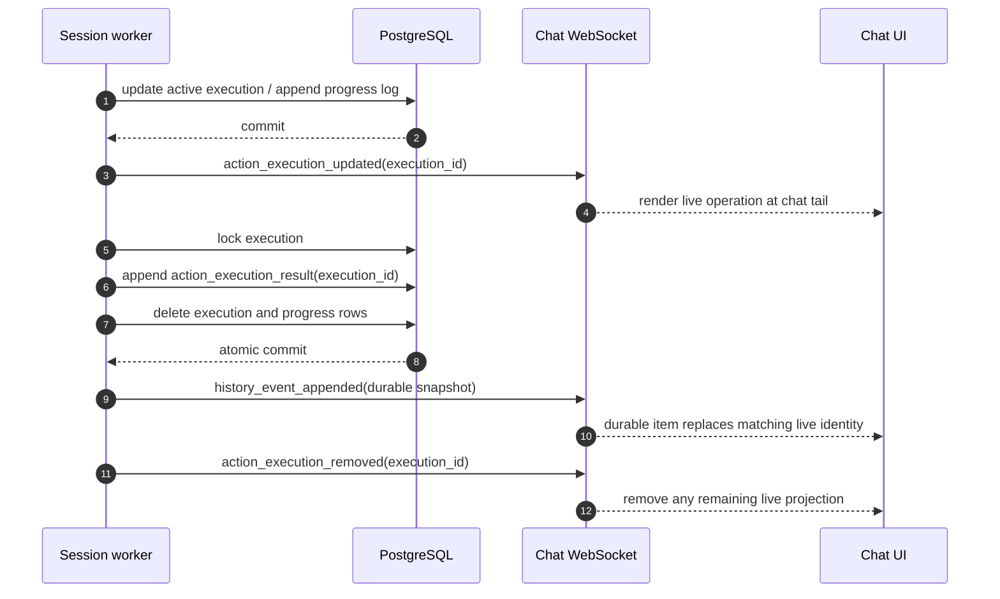

# Worktree Operation Live-to-Durable Handover Design

## Overview

Worktree operations use PostgreSQL execution rows as live state only while the operation is active.
Progress logs remain attached to that live execution. When the operation reaches a terminal outcome,
the worker atomically appends one complete execution snapshot to durable chat history and deletes the
live execution row. The frontend renders active operations at the live tail of the chat and hands them
over to the matching durable history item without duplication.

The Session worker that owns the Session also owns its active operation. Operation shutdown,
handover recovery, and user-stop behavior follows the foreground tool-call lifecycle: admitted work
belongs to the current owner, graceful shutdown has a bounded completion window, stale work is never
re-executed by a new owner, and user stop is preemptive.

This design initially applies to `create_git_worktree`, but the lifecycle contract belongs to generic
operation TurnActions rather than Git-specific orchestration.

## Problem

The current worktree action implementation mixes live and durable responsibilities:

- `action_executions` and `action_execution_events` retain terminal executions instead of containing
  only active operation state.
- The worker may resume a `running` execution instead of treating a remaining row as stale ownership
  after handover.
- Terminal history append and live-row lifetime are separate rather than one transactional handover.
- The frontend anchors operation cards to consumed input-buffer or transcript identities and renders
  unanchored cards after pending input buffers, rather than using the live tail immediately above the
  input-buffer area.
- The current worker shutdown completion window is five seconds, and operation terminalization is not
  explicitly supervised as foreground owned work with the required 30-second operation wait.

These behaviors can leave terminal rows in `/live`, make an operation appear in both live and durable
surfaces, or allow a new worker to continue work whose side effect may already have happened.

## Goals

- Keep each active operation and all of its progress logs in PostgreSQL execution tables.
- Derive `/live.action_executions` only from active execution rows.
- Render live operations at the chat tail after durable/partial history and immediately before pending
  input-buffer bubbles and the composer.
- Convert every completed, failed, or cancelled operation into exactly one durable
  `action_execution_result` snapshot.
- Delete the live execution row in the same database transaction that appends its durable snapshot.
- Preserve one stable execution identity across live and durable projections so the frontend can
  suppress a live projection as soon as the matching durable item is observed.
- Make the current Session worker the only active operation owner.
- Wait up to 30 seconds for an active operation during graceful worker shutdown, then durably cancel
  it if it still has not completed.
- Cancel and snapshot every leftover live operation before a new Session owner executes new work.
- Apply user stop immediately and durably record the active operation as cancelled.
- Never automatically re-execute a stale operation after ownership loss.

## Non-Goals

- Redesign Git worktree allocation, naming, Project registration, catalog refresh, or cleanup policy.
- Make arbitrary worktree side effects transactionally reversible.
- Add backward-compatible fallback behavior for old live or terminal operation projections.
- Move operation logs into Redis or make WebSocket delivery authoritative.
- Expose operation progress to model input.
- Redesign background Runtime process ownership.

## Current Behavior

`InputBufferService` creates an `action_executions` row before deleting the source action input
buffer. `RunExecutor` then executes `create_git_worktree` synchronously before model dispatch.
`SessionGitWorktreeService` appends rows to `action_execution_events`, marks the execution terminal,
and separately appends an `action_execution_result` transcript event. Terminal execution rows remain
in the execution table.

The live endpoint loads action execution projections and filters terminal states at the chat service
boundary. WebSocket sends `action_execution_updated` for status and log changes but has no explicit
removal action. The frontend merges live and durable projections by execution ID, gives durable data
precedence, and attempts to position cards through the source input-buffer ID.

The Session runner supervises the whole `RunExecutor` task. User stop cancels it immediately, while
worker shutdown currently gives the task a five-second graceful window before cancellation. A
`running` worktree action encountered again is treated as resumable state in parts of the service.

## Proposed Design

### 1. Live execution storage

`action_executions` is the authoritative set of currently active operation executions.
`action_execution_events` is the ordered log for those active rows.

Each execution records:

- stable `id`, used as the identity of both live and durable forms;
- `session_id` and source `input_buffer_id`;
- typed action payload and action type;
- `owner_generation`, copied from the Session ownership generation that admitted the operation;
- active status (`pending` or `running`);
- start and update timestamps.

The projection schema also supports terminal snapshot fields for `completed`, `failed`, and
`cancelled`, including `completed_at`, `failed_at`, `cancelled_at`, `failure_summary`, and
`cancellation_summary`. Terminal values exist only while constructing the final snapshot inside the
terminalization transaction; committed execution-table rows are nonterminal.

Progress events remain normalized, ordered by execution-local sequence, and are deleted through the
execution-row cascade after their contents have been copied into the durable snapshot.

### 2. Admission and worker ownership

An operation is admitted only after the worker has claimed the Session owner generation. Creation of
the execution claim, promotion of the durable action message, and deletion of the source input buffer
remain one transaction. The execution claim stores the current owner generation before any Runtime
side effect starts.

The worker starts the handler only for an execution admitted by its current generation. Operation
work stays inside the Session runner's supervised foreground task; it is not detached or transferred
as a background task.

At the start of processing a Session wake-up, before promoting or executing new input, the current
owner reconciles existing live executions. Any existing execution row is leftover work from an
incomplete prior processing boundary. The new processing boundary terminalizes it as `cancelled` and
deletes it before admitting new operations. In particular, a new owner never resumes or replays a
stale `pending` or `running` operation.

This follows [postgresql-260712/ADR](../adr/postgresql-260712-postgresql-authoritative-for-call-ownership.md)'s no-reexecution rule: an external side effect may have completed before the old
worker lost the chance to record it, so cancellation is safer than duplicating the side effect.

### 3. Progress publication

After each committed state or log update, the worker publishes `action_execution_updated` as a
best-effort invalidation/projection action. PostgreSQL remains authoritative. A missed WebSocket
message converges through the next `/live` resync.

`GET /live` queries only committed nonterminal execution rows for the Session. It does not load
terminal executions and does not reconstruct active operation state from durable history.

### 4. Atomic terminal handover

Completion, failure, cancellation, graceful-shutdown timeout, and stale-owner reconciliation use one
terminalization primitive.

Within one PostgreSQL transaction, the primitive:

1. locks the execution row;
2. reads its ordered progress events;
3. builds the final projection with the same execution ID and terminal fields;
4. appends one `action_execution_result` transcript event using deterministic external identity
   `action_execution_result:{execution_id}`;
5. deletes the execution row, cascading deletion of its progress rows; and
6. commits both the durable append and live deletion atomically.

The deterministic external identity makes terminalization idempotent if recovery repeats after an
ambiguous database response. It is independent of terminal status so one execution can produce only
one terminal history item.

`session_git_worktrees.action_execution_id` already uses a nullable `ON DELETE SET NULL` relationship,
so the durable allocation record survives deletion of the live execution row.

After commit, the worker publishes the durable `history_event_appended` action, then an
`action_execution_removed` action containing the Session and execution IDs. Publication order favors
continuous rendering: durable observation suppresses the live card before the explicit removal is
processed. Either action may be missed without corrupting state because REST history and `/live`
reconstruct the committed transaction.

### 5. Frontend handover and placement

The frontend keeps live operation projections and durable action-execution results as separate input
sets. It derives a set of durable execution IDs from loaded history and filters live projections whose
execution ID is already durable. Upserts cannot replace durable data with a later or out-of-order live
observation.

In `LATEST_FOLLOWING`, active operation cards render:

1. after the durable and partial-history timeline output, including streaming assistant and running
   tool-call content;
2. before pending input-buffer bubbles; and
3. directly above the composer area as the final live execution surface.

Operation placement does not depend on the consumed input buffer still being present and does not
anchor the card beside the durable `action_message`. In `DETACHED_HISTORY_BROWSING`, live operations
remain hidden. Durable terminal snapshots render at their actual transcript position.

The frontend handles both terminal publication orders:

- durable first: immediately suppress the matching live execution, then accept removal as idempotent;
- removal first: remove live state, then render the durable snapshot when observed.

The atomic database transaction ensures a fresh REST resync never sees both forms in their respective
sources, although a client may temporarily hold an older live observation while receiving new durable
history. Stable-ID deduplication handles that client-side overlap.

### 6. Shutdown, handover, and stop lifecycle

#### Normal completion or failure

The operation handler records its final log and calls the terminalization primitive. Success produces
`completed`; an operation error produces `failed`. Both result in one durable snapshot and no live row.

#### Graceful worker shutdown

TERM closes operation admission together with foreground tool admission. Already-admitted operation
work may continue for up to 30 seconds. If it finishes, normal terminalization wins. If the timeout
expires, the supervisor cancels the handler with the shutdown/handover reason and terminalizes the
execution as `cancelled` before releasing Session ownership.

The 30-second interval is the operation/tool graceful wait boundary requested for this lifecycle; the
existing five-second Session task timeout must not truncate it.

#### Abnormal worker loss or Session handover

A process crash may leave `pending` or `running` rows because it cannot run cancellation cleanup. The
next worker to claim the Session first converts every leftover row into a cancelled durable snapshot
and removes it. Only after reconciliation may it promote new input or dispatch model work.

Recovery does not invoke the previous operation handler and does not infer success from external
filesystem state.

#### User stop

User stop preemptively cancels the supervised operation task and requests best-effort Runtime
operation cancellation without waiting for Runtime cleanup. The worker promptly terminalizes the
live execution as `cancelled` with a user-stop reason and removes it. The surrounding Run follows the
existing [preemptive-260607/ADR](../adr/preemptive-260607-preemptive-stop.md) user-stop semantics.

A late handler completion cannot append a second result because deterministic terminal identity and
row locking make terminalization single-winner and idempotent.

#### Cancellation failure window

If the worker dies after an external side effect but before durable terminalization, the new owner
records `cancelled`. This is intentionally conservative: the durable result means the operation's
completion was not safely observed, not that every external effect was rolled back. Automatic replay
is prohibited.

## API and Event Contract Changes

- Add `cancelled` to `ActionExecutionStatus`.
- Add `cancelled_at` and `cancellation_summary` to action execution projections.
- Add `owner_generation` to active execution records and projections.
- Keep `/live.action_executions`, but define it as nonterminal execution-table state only.
- Keep `action_execution_updated` for active upserts only.
- Add `action_execution_removed` with `session_id` and `action_execution_id`.
- Keep durable history kind `action_execution_result`; require one complete terminal projection with
  the stable execution ID.
- Regenerate public OpenAPI clients after schema changes; generated files are never edited manually.

## Data Migration and Rollout

A new generated Alembic revision adds the execution ownership and cancellation fields and extends the
PostgreSQL status enum. It also removes retained terminal execution rows only after confirming that
their deterministic durable result already exists; any exceptional terminal row without a durable
result is converted to a result before deletion by an explicit migration or startup reconciliation
path selected during implementation validation.

Existing nonterminal rows are not resumed. The first new worker owner reconciles them to cancelled
history. API server, worker, and frontend should deploy as one release because compatibility fallback
for old terminal live projections is out of scope.

Rollback must stop new workers before reverting the schema. Durable `action_execution_result` events
remain valid transcript history even if the feature is rolled back; deleted live rows are not restored.

## Error Handling and Observability

- Terminalization failures propagate as worker errors; they are not reported as successful operation
  outcomes.
- WebSocket publication failures are logged with Session and execution IDs but do not roll back the
  committed database handover.
- Duplicate terminalization returns the existing deterministic durable event and ensures the live row
  is absent.
- Metrics/logs distinguish `completed`, `failed`, `cancelled_by_user`,
  `cancelled_by_shutdown_timeout`, and `cancelled_by_handover_recovery`.
- Recovery logs include old and current owner generations without exposing operation log contents.
- User-visible summaries remain safe English text; raw internal exceptions stay in operator logs.

## Security and Permissions

The public read/write authorization boundary does not change. `/live` and history continue to require
Session workspace access. Operation actions continue to enter through authorized chat input writes.
Worker ownership generation is internal and is never accepted from a client. Durable snapshots may
contain command arguments and logs already exposed by the operation card, so existing output
redaction and size limits continue to apply before persistence and publication.

## Test Strategy

### E2E primary verification matrix

| Scenario | Required observable result |
| --- | --- |
| Running worktree creation | One live card appears at the chat tail above pending input/composer; progress logs update in place. |
| Successful completion | The live card hands over to one durable completed card with the same execution ID and no duplicate or flicker-visible second card. |
| Operation failure | One durable failed card contains the final log/summary; `/live` no longer returns the execution. |
| User stop | The operation disappears from live state promptly and one durable cancelled card remains. |
| Graceful shutdown within 30 seconds | The original worker completes the operation and durable history contains its natural terminal result. |
| Graceful shutdown timeout | After 30 seconds the result is cancelled, the live row is absent, and the replacement worker does not rerun it. |
| Abnormal owner handover | A leftover active execution becomes one cancelled durable item before new Session work starts. |
| Reconnect during terminal handover | Fresh history plus `/live` shows exactly one representation of the execution. |
| Out-of-order WS delivery | Durable observation suppresses a later stale live update with the same execution ID. |
| Detached history browsing | No live operation card is rendered. |

### E2E plan

Product E2E drives worktree creation and stop through public UI/API behavior only. Tests must not write
directly to application tables. Controlled worker termination and restart use testenv process/fixture
controls to exercise shutdown and ownership recovery while all application state changes still occur
through product code.

The E2E fixture needs a disposable Git repository, a ready Runtime Runner, a Session with permission to
register a worktree Project, and a controllable operation delay/failpoint exposed only through the
existing fixture/runtime prerequisite layer. The fixture snapshot records source ref, Runtime
readiness, worker identity, and expected timeout mode; it contains no production credentials.

Evidence includes browser assertions, captured REST `/history` and `/live` responses, WebSocket action
order where relevant, worker logs identifying cancellation reason, and a filesystem assertion that a
stale operation was not re-executed. Mandatory deterministic scenarios run in CI and fail on any skip.
Tests requiring unavailable external providers are not part of this matrix; if an optional live
Runtime-provider variant is added, missing credentials may skip only that optional variant while the
local deterministic test remains required.

### Lower-level coverage

- Repository tests verify nonterminal queries, row locking, deterministic terminal append, cascade
  deletion, and idempotent duplicate terminalization.
- Service tests cover completed, failed, cancelled, and late-completion races.
- Worker tests cover admission fencing, 30-second graceful wait, immediate user stop, and stale-row
  reconciliation before new work.
- API/transport tests cover live filtering and `action_execution_removed` serialization.
- Frontend unit tests cover stable-ID deduplication, out-of-order delivery, and tail placement.
- Storybook stories cover running, failed, completed, and cancelled operation-card visuals.

## Implementation Phases and Commit Boundaries

1. Document and validate this lifecycle against current code, specs, [preemptive-260607/ADR](../adr/preemptive-260607-preemptive-stop.md), and [postgresql-260712/ADR](../adr/postgresql-260712-postgresql-authoritative-for-call-ownership.md).
2. Make one explicit commit that removes the incorrect retained-terminal/resume/anchored operation
   handling. The tree may be temporarily without worktree operation execution between commits.
3. Make a separate reimplementation commit that adds live ownership, atomic durable handover,
   cancellation/recovery behavior, frontend placement/deduplication, generated contracts, tests, and
   living-spec updates.
4. Run backend, frontend, generated-client, migration, E2E, and spec validation before opening the new
   pull request.

The two code commits must remain distinct so review can verify that the incorrect lifecycle was
actually removed rather than incrementally preserved.

## Alternatives Considered

### Keep terminal rows and filter them from `/live`

Rejected. The execution tables would remain a second durable history store and terminal append/delete
could drift. The required model treats the table as active state only.

### Append every progress update to chat history

Rejected. Progress is live operation state. Incremental durable chat events would pollute history and
prevent one natural live-to-terminal handover.

### Resume stale operations on the next worker

Rejected. Worktree creation and registration are not universally idempotent. Re-execution may
duplicate filesystem or registry side effects.

### Delete live state before appending history in separate transactions

Rejected. It creates a disappearance window and can permanently lose the terminal result.

### Rely only on WebSocket ordering for deduplication

Rejected. WebSocket delivery is best effort, reconnect can reorder observations, and REST resync must
be sufficient. Stable execution identity is the authority.

### Keep input-buffer anchoring for operation cards

Rejected. The source buffer is consumed before execution and is not the operation's display
location. Active operations belong at the live chat tail.

## Validation Findings

- [postgresql-260712/ADR](../adr/postgresql-260712-postgresql-authoritative-for-call-ownership.md) already establishes PostgreSQL ownership, deterministic terminal identity, no stale
  re-execution, and admission fencing for foreground tools; this design applies the same reliability
  model to operation TurnActions.
- [preemptive-260607/ADR](../adr/preemptive-260607-preemptive-stop.md) requires immediate user-stop cancellation and distinguishes user stop from
  shutdown/handover. The operation snapshot records the distinct cancellation cause while both
  terminal outcomes use status `cancelled`.
- `session_git_worktrees.action_execution_id` is nullable with `ON DELETE SET NULL`, so deleting live
  execution state does not delete durable worktree allocation metadata.
- Existing specs already describe `/live.action_executions` as nonterminal and durable terminal
  results, but their placement and lifecycle details must be corrected during implementation.
- The existing five-second Session shutdown window conflicts with the required 30-second operation
  wait and must be reconciled in the supervisor rather than hidden inside Git orchestration.

## Open Questions

None. The product lifecycle and commit boundaries are explicitly decided. Implementation validation
may change internal symbol placement, but not the live ownership, terminal transaction, rendering, or
cancellation semantics defined here.

## ADR Assessment

No new ADR is required for this implementation. The hard-to-reverse ownership and stop policies are
already established by [postgresql-260712/ADR](../adr/postgresql-260712-postgresql-authoritative-for-call-ownership.md) and [preemptive-260607/ADR](../adr/preemptive-260607-preemptive-stop.md). This design records their application to operation
TurnActions; the final implemented behavior will be promoted into the relevant living specs.
