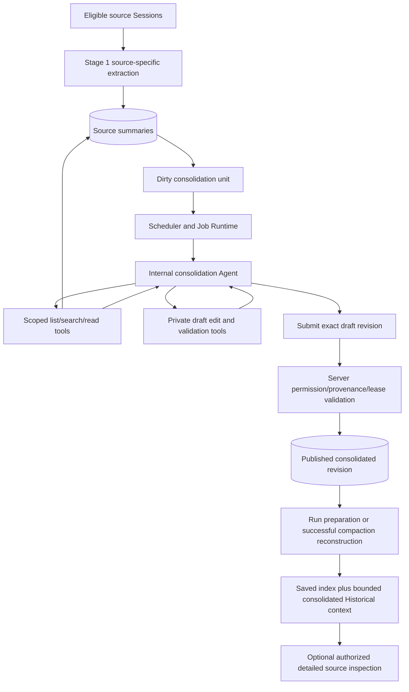

# Agentic Historical Memory — Complete Redesign Proposal

> Historical exploration: the current complete contract is [primary Design revision 2](../design/memory-261002-consolidated-history.md), with confirmed outcomes in Requirements and effective decisions in the ADR. The older alternatives below are retained as research history, not implementation authority. In particular, explicit submission, Main-chain routing, ranked-entry injection and a shared 10,000-byte total are not selected. The final review was performed directly by the primary Agent; no subagent approval substitutes for requester Design approval.

## 0. Revision, scope and approval status

- Proposal revision: **4**. This complete proposal includes requester-directed generalization of the existing Run loop. Earlier fixed-input generation and independent memory-loop proposals are withdrawn.
- Transition to formal design: the requester accepted this basis at 2026-10-02 19:52:59 KST. Confirmed outcomes are in `memory-261002/REQ`; decision status now belongs to the [new ADR](../adr/memory-261002-consolidated-history.md). Unselected recommendations below remain proposals, not accepted Design authority.
- Companion outcomes: [memory-261002 Requirements](../requirements/memory-261002-consolidated-history.md).
- Original proposal baseline: `5d92e66ee64cca8c37418be00272106db3686fe7`. Formal-design baseline: `f42dc1f262239bf04fdc741125cc37968f5101e6`, including execution-transaction ownership refactor `e5b6ed552`.
- Codex implementation reference: `14a477ea89712071944244022e8a10142845456e`, concentrating on the V2 extraction/consolidation/read pipeline. V1 remains a distinct implementation; do not mix its mandatory `MEMORY.md` artifact into the V2 contract.
- The requester explicitly requires second-stage **agentic** consolidation and a complete redesign before implementation.
- The requester explicitly included existing Run-loop generalization on 2026-10-02 at 19:47:11 KST and accepted the ephemeral-execution basis at 19:52:59 KST. See ADR-D1/D2 for the accepted scope; exact domain-work retention remains a separate pending decision.
- Except for directions explicitly recorded as accepted in the new ADR, architecture choices and numerical defaults below remain one coherent recommended proposal. Requirements confirmation does not imply blanket acceptance of those choices or final primary Design approval.
- No product code, implemented historical Requirements/ADR/Design, or current Living Spec is changed by this proposal.

The design is complete at proposal level: execution, tools, scope, source processing, persistence, model policy, permission changes, retry, injection, VFS, cutover and verification are described together. Feasibility limitations and alternative trade-offs are collected at the end rather than leaving mechanisms unspecified throughout.

## 1. Desired behavior and preservation boundary

A user continuing work with the same Agent should receive useful cross-Session context, not only the two or three complete Session summaries that happen to fit a prompt budget. The automatic context contains compact historical knowledge and semantic routes to detailed summaries. The original source summaries remain independently retrievable.

Preserve:

- independently saved Agent/User Saved Memory;
- the existing one Memory capability switch;
- Team versus associated-User, Agent and Workspace isolation;
- source inactivity/admission rules and retained best-effort historical summaries;
- root Run preparation and successful same-Run compaction as independent context-refresh opportunities;
- source access/lifecycle checks on every new model use or explicit lookup;
- normal conversation when historical processing is missing, pending or failed.

Replace:

- deterministic whole-Session-summary packing as the automatic Historical context;
- the first draft's fixed-input, single text/JSON model call for second-stage integration.
- the independent internal model/tool coordinator proposed in revision 3; extract one shared core from the existing Run loop instead.

Agentic means that the model chooses which allowed evidence to inspect, executes reads/searches, changes a draft, observes feedback and decides its next action. Having a background job or making several predetermined model calls is not sufficient.

## 2. Complete architecture

There are three separate processing clocks:

1. Stage 1 prepares individual source summaries after source inactivity.
2. Stage 2 runs asynchronously when source summaries or their eligibility change.
3. Foreground boundaries select the latest published permitted Stage 2 result; they never wait for a consolidation Agent.

There is no additional foreground summarization step. Team/User composition and byte-budget selection are deterministic rendering, not a hidden third model operation.

## 3. Stage 1: preserve individual source extraction

Keep the current source-owned preparation pipeline:

- Five-minute discovery admits never-prepared active root Sessions with latest relevant activity between six hours and ten days old and no ongoing Run.
- Already admitted work can finish later; a prepared source does not expire merely by passing ten days.
- Source content changes can be summarized after the existing inactivity condition while an older authorized result remains usable.
- The Agent Lightweight chain produces one bounded source summary; current selection, redaction, model watchdog and 9,000-byte summary guard remain.
- The source Session remains the identity; source and summary VFS paths remain valid under current permissions.

Add only a consolidation change signal when publication changes the usable summary or source metadata needed for consolidation. The signal is durable and transactionally associated with source publication. Repeated equal content does not start another Stage 2 generation merely because a worker tried again.

No raw conversation is re-read by Stage 2. Stage 1 is the evidence-preparation boundary. Corrections made in a live conversation reach Stage 2 after the corresponding source-summary update; this proposal does not promise immediate extraction from an active Session.

## 4. Consolidation ownership and visibility

### 4.1 Recommended unit keys

- Team unit: `(workspace_id, agent_id, team)`.
- Personal unit: `(workspace_id, agent_id, user, associated_user_id)`.

Each unit owns its own queue state, published revision, dependencies, draft and execution attempt. There is no cross-Workspace, cross-Agent or cross-User aggregate.

### 4.2 Consumer rules

- Team root execution receives only the permitted Team unit.
- Personal root execution receives the permitted Team unit and its own associated-User unit.
- A child inherits the root's selected revisions; a child lifecycle event does not start consolidation or expand sources.
- Sender identity or a model-provided path cannot choose a different personal unit.

Generate these units separately. Shared Team content is not copied into every User aggregate and private material is never supplied to a Team model call. A source moving scopes invalidates dependent output and is processed in its currently authorized unit; retained aggregate text does not grant access.

Trade-off: separate units are composed at read time rather than reconciled by another model. Conflicting Team/personal context retains visible scope and provenance and is not silently promoted into a global fact.

## 5. Stage 2 scheduling and source coverage

### 5.1 Dispatch

Reuse the current Scheduler/Job Runtime substrate with a distinct `historical_memory.consolidate` handler and a unit-scoped execution key. Source preparation completion can request coalesced work; periodic five-minute discovery independently recovers dirty units and abandoned attempts.

A unit becomes dirty when:

- a usable source summary is added or changed;
- source title/identity metadata used in routes changes;
- a contributing source becomes unavailable or leaves the unit;
- an initial aggregate is missing or its format/prompt version needs rebuilding.

One eligible pass captures a finite input manifest generation and a base aggregate revision. New publications during the pass remain queued for the next generation. Do not require an endlessly changing corpus to become perfectly current before any result can publish.

### 5.2 Initial and incremental passes

Initial build starts from an empty draft and the permitted source inventory. The Agent can page metadata, search and read in an order it chooses. The inventory is not permanently clipped to the current automatic selector's newest 200 sources.

Incremental work starts from the authorized published aggregate and a typed change inventory. The Agent reads changed summaries and can retrieve unchanged summaries to understand a correction or compare prior work. Deleted sources are represented as tombstones, never as permission to reread denied text.

A pass tracks explicit per-source dispositions:

- inspected and represented;
- inspected and intentionally omitted as low-value/duplicate;
- screened from metadata only and omitted, with a short reason;
- pending/not yet considered;
- unavailable or superseded while the pass was running.

Coverage counts do not claim semantic completeness. Metadata-only screening is not a content read. No route or substantive claim can use a source never read during this attempt or represented in the authorized base provenance. A source that is omitted remains independently discoverable.

When the corpus does not fit one execution slice, checkpoint the draft and inventory cursor and schedule a continuation of the same pass. A final submission requires no unexplained pending items in that captured pass. A newer source version is explicitly deferred to the next generation rather than silently labeled processed.

### 5.3 Consistent evidence without strict freshness

The input manifest stores source IDs and version markers. On a successful tool read, keep the exact returned summary text in the attempt's bounded in-memory history and record its source/version dependency in durable operational state. Once returned, that tool result is immutable within the live attempt. A changed unread source can be read at its new version only with explicit manifest rebinding/defer bookkeeping; the dependency record must match the version actually supplied to the model.

A content update alone does not revoke already captured authorized evidence. Publication may be behind and leave a newer generation pending. Authorization loss does revoke it and cancels contaminated continuation, regardless of content version.

The recommended storage split does not persist raw model/tool history or evidence-body copies. After process loss, a new ephemeral execution reads the still-authorized draft/progress and re-retrieves needed current summaries; it does not replay an identical old transcript or claim that an unavailable historical version can be reread.

## 6. Internal Agent execution host

### 6.1 Execution identity

The recommended host is a private consolidation execution owned by a Job Runtime attempt, with unit identity, generation, lease token, budget and base published revision. It is not a user-visible child Session and does not wake the foreground Agent.

Its records are excluded from source-summary discovery by construction: consolidation execution state is not a normal root Session transcript. There are no user-facing start/completion notifications or channel posts.

### 6.2 One shared Run loop, extracted from the existing implementation

Generalize `AgentRunExecution` rather than copying its loop or building a second one. Keep one production implementation of request preparation, inference/stream normalization, tool-call dispatch, cancellation, follow-up iteration and cleanup. Both ordinary conversation and consolidation must invoke that implementation after the refactor.

The injected `model_call_preparer`, `ModelAdapter`, `AdapterOutputNormalizer` and `ClientToolExecutor` are useful seams. At the refreshed formal-design baseline, execution transaction ownership is already separated into injected `EngineModelInputOperationRepository`, `EngineOutputOperationRepository`, `EngineToolResultOperationRepository`, `EngineExecutionOperationRepository` and `EngineRunFinalizationOperationRepository`, with explicit model-operation completion data. Preserve this refactor. The loop still expects foreground Run/Session identity, foreground preparation/terminal contracts and `AgentRunStatus`; final text without tool calls still completes a normal Run. Merely replacing a transcript repository or supplying `None` for an output sink does not provide ephemeral, validated-submit-only semantics.

Extract purpose-specific behavior behind narrow execution-host contracts:

| Contract role | Shared loop responsibility | Conversation host | Consolidation host |
|---|---|---|---|
| Prepare input | Request authorized bounded history and the prepared model/tool catalog each turn. | Existing Session input repair, head, hooks, file pinning and tool projections. | In-memory transcript, internal prompt, closed tools, draft/progress reads. |
| Admit model output | Hand normalized completed output to the host before dispatching accepted calls. | Existing atomic event/usage/turn-marker persistence and ownership fence. | Append bounded in-memory events; persist only operational usage/dependency metadata as appropriate. |
| Execute tools | Shared ordered dispatch, cancellation and result normalization. | Existing tools, repository-owned result admission and foreground side effects. | Scope-bound summary/draft tools; effects stored by domain repositories. |
| Admit tool results | Obtain host-confirmed results before the next inference request. | Existing durable canonical event admission. | In-memory tool messages; idempotent draft/publication operations remain durable. |
| Decide continuation/finish | Follow a typed host decision; do not hard-code foreground final-answer semantics. | Existing completion, interrupt, handoff, Run marker and parent/channel delivery rules. | Continue on repairable errors; finish only on verified submission, checkpoint or explicit failure/budget outcome. |
| Control and lifecycle | Check stop/ownership/budget and invoke the supplied lifecycle policy. | Existing owner-generation fencing, user stop, mailbox/TurnAction polling, compaction and cleanup. | Per-unit lease, Memory/access checks, job cancellation and bounded slice policy. |
| Report effects | Deliver admitted observations to a purpose-specific sink. | Current user-facing stream and durable UI/chat updates. | Operational counters only, with no user-message or channel delivery. |

These names describe responsibility boundaries, not a new plugin framework or final class inventory. Supply required typed collaborators through constructors; avoid scattered `if memory_mode` branches, arbitrary callback bags, fake database sessions and optional repositories masking missing authority.

Neutral shared-loop outcomes distinguish continuation, verified completion, suspension/yield, cancellation, ownership loss and failure. The conversation host maps these to existing `AgentRunStatus` and terminal operations; the consolidation host maps them to attempt/job state. A model's final text is evidence for the host's terminal policy, not an unconditional shared-core success.

All database atomic groups remain in owning repositories. Moving code out of the loop must not split model-output admission from usage/turn markers or terminal commit from parent delivery. Check ownership at the same pre/post-I/O boundaries. Preserve order of input polling, repair, compaction, model request, model-event admission, tool-result admission and terminal handling. Do not generalize by weakening these checks.

First route existing foreground execution through the extracted core with unchanged behavior and contract tests. Only then attach the consolidation host. The old independent foreground loop body is removed as callers move; there must not be two nearly identical production loops left to diverge.

### 6.3 Execution storage is separate from memory-product storage

Recommended storage adapters:

- Conversation: existing PostgreSQL-backed Session/Run/transcript operations and recovery semantics.
- Consolidation: process-local model/tool transcript for the shared loop; no public `agent_sessions`, `agent_runs` or conversation-event rows created for it.
- Consolidation domain tools: PostgreSQL-backed draft, coverage, source dependencies, publication, lease and retry metadata. These are work products and operational state, not a saved Agent conversation.

A shared loop therefore depends on semantic execution-host operations, not an `AsyncSession` or a foreground Session identity. Reusing low-level event representations is acceptable; storage keys and terminal identities remain host-owned. Ephemeral use must not accidentally invoke foreground snapshot, unread-count, archive/retention or Memory source-discovery machinery.

The pinned Codex implementation sets `ephemeral = true` for consolidation, starts an internal thread through its ThreadManager, skips persistent thread creation and the session state-DB setup in the ephemeral Session path, then shuts down and removes the thread. Memory artifacts and global consolidation-job bookkeeping have a separate lifetime. This supports the distinction; it does not prove that Codex offers Azents-style database drafts or transcript recovery.

In Azents a crash loses the internal Agent's conversation. A replacement execution starts with task/scope, the latest permitted draft and durable processing cursor, then decides what to read again. This may repeat model work, but it avoids retaining an additional personal conversation corpus. No exact-transcript replay, hidden-reasoning persistence or provider-response-ID resurrection is promised.

The ephemeral transcript direction is recorded in ADR-D2. Exact domain draft/progress retention and retry boundaries remain in pending ADR-D7; they must not silently become a saved Agent conversation.

### 6.4 Initial model context

The internal prompt contains:

- the task: maintain a compact, source-dependent historical account and retrieval routes;
- the exact scope and permitted operations;
- the published revision/draft identity and captured change-generation metadata;
- output structure and remaining budgets;
- rules on user statements versus Agent proposals, corrections, uncertainty and source-data prompt injection;
- a pointer to change inventory and previous draft, not the whole raw corpus.

The Agent then decides what to open. Private source/tool data remains untrusted evidence and cannot grant capabilities.

## 7. Agent tools and submission protocol

The following names describe the proposed closed catalog; exact naming is local implementation detail.

| Tool | Purpose and enforced contract |
|---|---|
| `list_changes(cursor)` | Return bounded new/changed/removed metadata from the captured pass, plus coverage cursor. |
| `list_sources(cursor)` | Browse the unit's permitted prepared-source inventory. |
| `search_summaries(query, cursor)` | Lexically search permitted summaries with bounded results; no general file/database search. |
| `read_summary(source_id, version, cursor)` | Read the requested permitted summary, record the exact returned evidence version and dependency. |
| `read_draft()` | Return structured draft, revision, byte sizes and unresolved coverage. |
| `edit_draft(expected_revision, operations)` | Insert/update/remove entries and routes in unpublished state. Server assigns IDs to new entries. |
| `record_source_disposition(source_id, disposition, reason)` | Record actual inspection or explicit screening/omission, with manifest membership and evidence-read checks. |
| `validate_draft()` | Report size, structure, source-reference and coverage errors without publishing. |
| `checkpoint()` | Save confirmed draft/coverage/continuation state and yield the attempt without publishing the pass. |
| `submit_draft(expected_revision)` | Validate and publish only that exact draft version, or return recoverable validation feedback. |

Every call is bound server-side to the attempt's unit and ownership. The model cannot pass an alternate user/agent/workspace or arbitrary SQL. Missing/out-of-scope references fail without disclosing another user's record.

Mutations are idempotent by attempt/tool-call identity and expected draft revision. Reads may be parallel; edits are serialized or receive an explicit revision conflict. Replaying submit returns the already committed publication result, not a second generation.

Validation feedback is part of the Agent loop. Oversized drafts, malformed entries, unknown references or unfinished coverage can be corrected by another tool turn within the same budget. Permission revocation, Memory OFF, expired ownership and unsafe tool requests are enforced by the service, not merely described in a prompt. An unsafe request cannot acquire the capability even if the model repeats it.

Success requires a valid submission. Plain final assistant text, timeout, tool exhaustion or a claimed completion sentence is not publication. Empty-but-valid output may be submitted when all considered inputs contain no useful context; persist processed generation so it does not retry endlessly.

## 8. Output and source attribution

### 8.1 Published content

Use bounded structured entries rendered as human-readable Markdown:

- `context`: scoped background and recurring work;
- `preferences`: clearly reusable, source-supported ways of working;
- `knowledge`: useful decisions, constraints, results and cautions;
- `recent_work`: active/recent state and unfinished work;
- `routes`: semantic descriptions of where more detail can be found, including concise older topics.

Each entry has a server identity, kind, concise self-contained text and supporting source references. Routes reference canonical source IDs and an explanation of what the source contains and when it matters. Server-rendered paths come from the authorized identity; the model does not invent filenames or access URLs.

Avoid a standalone user-profile section for shared Team context. Preserve task-specific scope. A single request is not a general preference, a proposal is not an accepted decision, and a reported result is not current verification.

Saved Memory remains separately injected and independently managed. Consolidation receives historical summaries, not write access to Saved Memory. Current instructions and supported explicit Saved policy take precedence over historical inferences.

### 8.2 Provenance is not semantic proof

The server records two distinct concepts:

- displayed source references for useful retrieval;
- conservative aggregate dependencies: inherited base dependencies plus every source whose content/snippet entered the attempt.

Removing a displayed reference or claiming that an input was unused does not remove its conservative dependency. This avoids incorrectly treating deletion of a link as redaction of integrated prose. Dependencies are source/version identity records, not an exhaustive per-sentence proof graph.

Schema and source-ID validation cannot prove that model prose is true or useful. Prompt quality evaluation and human-visible source routes remain necessary.

## 9. Persistence and atomic publication

Proposed logical records:

| Record | Main fields / responsibility |
|---|---|
| Consolidation unit | Unit scope, requested generation, published revision ID, last processed manifest, invalidation/rebuild marker, next due/retry time. |
| Consolidation revision | Immutable output entries, generation/base revision, preparation time, size, model/prompt version and processed coverage counts. |
| Revision dependency | Revision ID, source ID, captured version and origin scope. Preserve missing-source evidence; do not cascade it away when the source is purged. |
| Consolidation attempt | Unit/generation, base revision, ownership token/lease, status, model-operation state, budgets, failure class and retry state. |
| Private draft/checkpoint | Attempt, draft revision/content, inventory cursor/dispositions and continuation metadata. No persisted model/tool transcript or source-body copies under the recommended ephemeral policy. |
| Tool mutation receipt | Attempt/call identity, expected/resulting draft revision and committed submission identity for idempotence. |

Exact SQL names are not authority. New enum-like state uses the repository's PostgreSQL ENUM convention. Use a linear Alembic migration rather than editing existing migration history.

Publication transaction:

1. Lock the unit and require the current lease token, unexpired ownership and matching base published revision.
2. Reauthorize Memory enablement, Agent/Workspace and every dependency's current scope/lifecycle, including missing records.
3. Validate exact draft revision, schema, rendered bytes, canonical source references and captured-pass dispositions.
4. Insert immutable published revision and conservative dependencies; swap the unit's published pointer and processed-generation markers atomically.
5. Mark the attempt submitted/succeeded and record the idempotent receipt. Preserve any newer pending input generation.

Model inference and network/tool execution occur outside database transactions. Each repository tool owns a short transaction. Read-side reauthorization is mandatory even if invalidation bookkeeping is delayed.

The published pointer is the source of truth; draft text never becomes visible by being written to a file or receiving a successful model response. This intentionally differs from Codex's filesystem workspace publication mechanics.

## 10. Permissions, deletion and correction

### 10.1 Ordinary changes

A new or edited source summary marks the unit dirty. An older published result may remain available while it is still authorized. Later source corrections should supersede older claims during the next successful integration; the Agent can read additional unchanged sources to determine what remains supported.

### 10.2 Revocation and removal

Recommended conservative policy:

- Before each new foreground model input, explicit memory read, internal Agent model request and result publication, recheck the relevant dependencies against current access and lifecycle.
- If any dependency is unavailable, omit the entire affected aggregate unit. The other valid unit and Saved index can remain.
- Stop an internal attempt that already consumed the revoked content. Do not try to continue merely by removing a route; draft text and prior tool history can still contain it.
- Start a clean rebuild from currently permitted source summaries, without the invalid aggregate/draft/history as model input.
- Preserve missing-source dependency metadata long enough to deny old revisions; purge dependent payloads according to the cleanup policy.

This favors a simple enforceable privacy boundary over temporarily retaining all unrelated material. The downside is reduced recall during a clean rebuild. Fine-grained claim-level subtraction is not promised.

Archive restore can make a currently permitted source eligible again, but does not retroactively approve a contaminated running attempt. Purge permanently removes source evidence and makes old dependent output unusable. No finite byte budget guarantees all source facts survive reconstruction.

### 10.3 Memory OFF

Deny automatic and explicit model-facing use immediately. Stop new Stage 1/2 admission; cancel active Stage 2 on the next cooperative ownership/permission check and deny submission. Human inspection retains the existing authorized settings semantics. Re-enable discovers current permitted source state and resumes/rebuilds only authorized work.

Already delivered model input cannot be recalled. Enforcement applies before the next request or read and before publication, matching current new-use boundaries.

## 11. Foreground snapshot and read path

### 11.1 Refresh points

Keep the existing hooks:

- `on_run_start`: select authorized published revision(s) before the root Run loop.
- `on_session_compact`: mark refresh pending; reconstruct using a newly committed compaction head before the continuing Run's first next model input.

A failed/stale compaction does not admit newer content. Other model/tool calls keep the selected revision/text, rechecking availability without silently selecting replacements. Child hooks inherit the root boundary.

The automatic state stores aggregate revision identities, selected small entries and scope labels rather than whole per-Session bodies. Compare visible content to retain identical text; rebind changed boundary metadata without needless prompt churn. No Run-ID comparison is added.

### 11.2 Concrete injection budget proposal

Historical context remains at most **10,000 UTF-8 bytes in total**, including its source/scope labels and wrappers. Saved index budgeting remains separate.

- Team-only view can use the whole Historical budget.
- A personal view with both units reserves 4,000 bytes for Team and 6,000 for personal context, with unused allocation lendable to the other unit.
- A single valid unit can use the full budget.
- Each published unit is itself rendered below 10,000 bytes. Small entries are packed whole, with stable ordering and explicit scope. A proposed 1,000-byte per-entry render cap prevents one item consuming most of a mixed view.
- Rank by current compaction-topic lexical relevance when available, then recent work/source activity and stable IDs. Before a relevant checkpoint exists, use recency and stable kind ordering.
- Source reference metadata remains attached to selected entries. No slicing of arbitrary prose into unsupported fragments.

The 4,000/6,000 split and entry cap are recommended defaults, not measured optimal values. The output now summarizes knowledge from multiple Sessions; the entry selector is not a return to whole-source-summary injection.

### 11.3 VFS and human inspection

Keep existing Saved, per-source summary and original-history paths. Add read-only aggregate files such as:

- `azents://memory/consolidated/team/summary.md`
- `azents://memory/consolidated/user/summary.md`

The `user` alias resolves to the bound associated User, never to a model-provided user ID. Files show the latest permitted published revision, preparation time, scope and coverage metadata. README/list/search expose only authorized published material. No draft, internal attempt or execution transcript is mounted in the normal Memory VFS.

Existing human source-summary inventory remains intact. This release does not add a new settings screen or change public APIs merely to expose the internal worker; a later UI for consolidated status/content would be separate scope. Operational counters and authorized VFS inspection provide initial diagnosis.

## 12. Execution state, bounded cost and recovery

### 12.1 Recommended numerical defaults

These are concrete starting proposals for implementation validation, not claims about Codex or current production settings.

| Control | Proposed value / behavior |
|---|---|
| Recovery discovery | Existing five-minute cadence; coalesced post-publication submission may start sooner. |
| Attempt slice | Absolute 10-minute deadline. |
| Model/tool loop | At most 32 model turns and 96 tool calls per slice. |
| Cumulative usage | At most 250,000 accounted input tokens and 16,000 output tokens per slice, including repeated context and repair turns. |
| Context reserve | Checkpoint before the next request would exceed 70% of the resolved input window; also apply provider output limits. |
| Listing | At most 50 metadata rows per page. |
| Tool text | At most 12,000 UTF-8 bytes per result with explicit cursor/continuation; no silent loss of remaining content. |
| Aggregate | Less than 10,000 rendered UTF-8 bytes per unit; combined foreground budget as Section 11. |
| Lease | 120 seconds, renewed every 30 seconds; token checked by mutations and submission. |
| Consolidation parallelism | At most 2 active consolidation jobs per process and one active unit writer across processes. |
| Memory work capacity | Propose reducing default source-preparation concurrency from 15 to 12, reserving up to 2 for consolidation and at least 2 of the current 16 Job Runtime slots for other work. Validate combined configured caps. |
| Retry | Exponential delay starting at 1 minute, capped at 6 hours, with jitter. Permission/disabled outcomes wait for eligibility rather than retrying model calls. |
| Stalled pass | Three slices with no coverage or valid-draft progress trigger backoff and an operational signal. |
| Private payload retention | Completed/failed attempt payloads removed within 24 hours; in-progress checkpoints expire after 24 hours without progress. Authorization loss makes them unusable immediately and queues cleanup. |

These per-process caps are not represented as a cluster-wide cost ceiling. Per-unit database lease is the cross-process correctness mechanism. Deployment-wide concurrency, configured slot ceilings and rollout size must be included in capacity tests.

### 12.2 Model route

Recommended route: retain **Lightweight for Stage 1**, and use the Agent's existing **Main chain for the tool-using Stage 2 Agent**. This is an explicit revision from the earlier tentative Lightweight Stage 2 suggestion: autonomous comparison/revision is closer to ordinary Agent work and should use its configured tool-capable model route.

Use background health/quota accounting; do not consume a foreground Run reservation or impersonate a foreground Session. Freeze the resolved model profile per attempt, requiring native tool-call support for the closed catalog. Skip unsupported candidates with an explicit reason, use the configured chain's existing supported candidate policy, and fail/retry if it is exhausted. Do not switch silently to Lightweight or invent a separate fallback model. No additional user-facing model setting is proposed initially.

Cost is higher than a single Lightweight call. The explicit turn/token/timeout/concurrency caps, changed-input skip and resumable passes bound each unit of work. Exact currency cost depends on provider and cached-token behavior and is not guaranteed by this design.

### 12.3 Attempt state and failure cases

States: `pending → claimed → running → submitted/succeeded`, or `checkpointed`, `retry_wait`, `cancelled`, `invalidated`. Published availability is separate from processing state; a unit can have valid old content and pending work simultaneously.

- No input change and valid result: no Agent call.
- Draft validation failure: bounded tool feedback; Agent can repair.
- Final text without submit: incomplete execution, not publication; checkpoint/backoff according to observed progress.
- Deadline/turn/token bound: preserve confirmed draft/coverage, then continue later; never publish implicitly.
- Provider quota/auth failure: existing configured-chain policy and retry; retain valid published result.
- Worker crash: lease expires; the next owner resumes a valid checkpoint or starts from the last published result.
- Lease loss: cancel tools/model cooperatively and reject further mutations/publication, even if the model returns success.
- Access revocation: invalidate attempt and clean rebuild, not ordinary retry with the same transcript.
- Concurrent source updates: retain captured authorized evidence and leave newer versions pending.
- Redis empty/restarted: recover from PostgreSQL and periodic discovery; Redis holds no authoritative progress.

A checkpoint contains confirmed draft state, coverage, source/version dependencies and a compact work-product continuation description. It is not the Agent conversation or a serialized tool transcript. Revalidate its base revision and all consumed dependencies before a new ephemeral execution uses it. Keep source references/tombstones as safe metadata when needed to deny old output; private draft text has the shorter retention policy. A restarted Agent may reread evidence and repeat reasoning; exact turn-by-turn replay is deliberately not guaranteed.

## 13. Example complete execution

Illustrative synthetic case, not a claim about current user data:

1. An existing unit summarizes deployment policy and has routes to Sessions A and B. New summaries C and D report a later correction and a completed migration.
2. The server captures the generation and starts an internal Agent with the change inventory available.
3. The Agent reads the draft, reads C, searches older summaries for the original decision and opens A.
4. It determines from supplied evidence that C supersedes one part of A, edits the affected item and keeps the still-supported route to B.
5. It reads D, adds the migration result and records a concise route instead of copying D's full body.
6. `validate_draft` reports a route to an uninspected ID and an oversized recent-work entry. The Agent reads the permitted source or removes the route, shortens the entry and validates again.
7. It submits exact draft revision 5. The server rechecks authority/ownership and commits revision 12 with dependencies and processing markers.
8. The current foreground tool loop keeps revision 11. At its next Run preparation or successful same-Run compaction, it can select revision 12.
9. If A is later purged, revision 12 becomes unavailable for new use because A's influence cannot be removed by deleting its link. A clean authorized rebuild is scheduled; conversation and other valid memory continue.

## 14. Implementation map and removal obligations

| Area | Proposed change | Preserved boundary / absence check |
|---|---|---|
| `services/historical_memory/preparation.py` and preparation repository | Mark affected units dirty alongside changed source publication. | Existing extraction prompt, admission, source identities and summary inventory stay intact. |
| Historical repositories and new consolidation repository | Claim/capture, scoped tools, draft/CAS, dependency checks, submit, retry and cleanup. | All transactions repository-owned; no model call under DB locks. |
| `job_runtime/registry.py`, discovery and model-operation configuration | Register separate consolidation handler and validated shared capacity; periodic recovery. | No user-created Scheduled Task, foreground Session wake or required Redis state. |
| Existing `AgentRunExecution`, shared provider/tool primitives and two execution hosts | Extract one shared model/tool loop; preserve foreground host behavior and add a private consolidation host with distinct terminal/storage policy. | Both consumers use the same loop; no independent memory loop, fake public Run/Session, duplicated SDK/auth or unrestricted foreground Toolkit injection. |
| `services/historical_memory/context_snapshot.py` | Select published authorized aggregate revisions at existing refresh hooks. | Same-Run compaction and ordinary-turn access filtering remain. |
| `services/historical_memory/snapshot.py` and snapshot models | Render small consolidated entries/routes instead of whole source bodies. | Existing Saved section remains separate; no old source-body fallback. |
| Memory VFS routing | Authorized published aggregate files and routes. | Existing source/Saved reads remain; private drafts and traces never mount. |
| Persistence migrations | New unit/revision/dependency/attempt/draft records and snapshot cutover. | Existing source, Saved and canonical transcript data preserved. |
| Tests and current Specs | Replace obsolete whole-summary-packing expectations; add Agent loop, privacy and recovery evidence. | Historical implemented Requirements/ADR/Design remain immutable. |

Proposed removal authority is the requester-directed change to agentic consolidation and aggregate injection, subject to final approval of the complete Requirements/Design. Verify absence of old whole-source body selection on the automatic path, direct one-shot Stage 2 success, public channel side effects and obsolete snapshot parsing after cutover.

No API/client regeneration is required unless implementation introduces public routes; this proposal uses internal operations and existing generic VFS tools. No new aggregate settings UI is included.

## 15. Migration, deployment and rollback

Use a linear Alembic migration to add new storage. Existing summaries seed Stage 2; do not rerun Stage 1 or impose another six-hour wait on already prepared permitted records.

Recommended rollout is a coordinated version cutover, not undocumented mixed-version compatibility:

1. Preserve source/Saved data and verify migration/backout procedures in the deployment test environment.
2. Stop old memory writers and hand over affected worker ownership so old code cannot recreate the obsolete automatic snapshot format.
3. Apply schema changes and invalidate old `memory/context_snapshot` state; do not keep a silent old-format reader.
4. Start new code and bounded initial consolidation. Until a valid aggregate exists, use Saved Memory and normal conversation without the old whole-Session fallback.
5. At Run preparation rebuild new snapshots; after valid publication verify same-Run compaction uptake as well.
6. Observe source coverage, time-to-first-result, provider cost, pending units and permission denial metrics before increasing workload.

This can produce a temporary Historical-context gap on initial rollout or clean rebuild. It is preferable to presenting obsolete/unvalidated context as if consolidation succeeded. No claim of zero-downtime mixed-worker compatibility is made.

Rollback is an explicit coordinated application rollback: cancel consolidation attempts, retain original source/Saved records, invalidate new snapshot state, and deploy the selected previous application version with a tested schema compatibility/downgrade path. Generated aggregates/drafts may be discarded; canonical source history and Saved entries may not. Do not perform live deployment or rollback merely because this design is approved.

## 16. Observability and user-visible boundaries

Operational metrics/logs contain bounded IDs, scopes, statuses, counts and timing, not summary text, tool-result bodies, credentials or raw provider payloads:

- source corpus/manifest counts; inspected, metadata-screened, omitted and pending counts;
- dirty/published generation, aggregate age, bytes and source-dependency count;
- model/tool turn counts, validation repairs, checkpoints, no-progress exits and token usage;
- per-process handler capacity, claims, lease losses, duplicate tool-call receipts and retry categories;
- omitted/invalidated aggregate units and foreground injected revision/byte count;
- initial-build and correction-to-publication latency.

Do not call `completed` when only a model response or checkpoint exists. `published`, `pending`, `retry_wait`, `invalidated` and `empty_success` remain distinguishable in operational evidence and permitted aggregate metadata. No extra public status UI is included in this scope.

## 17. Test Strategy

### 17.1 Primary E2E

Use normal product paths to create synthetic Team and personal source Sessions. Prepare Stage 1 through isolated testenv-supported sampling, then run the actual consolidation handler with a deterministic tool-capable provider fixture. No direct product DB state mutation as fixture preparation.

Required journeys:

1. Multi-source initial build: inventory, additional search/read, at least two draft edits, validation failure, correction and submit; assert no draft is injected before submit.
2. Incremental correction: add a later correction to source evidence, publish a new source summary and verify superseded scope without erasing still-supported information.
3. Foreground uptake: next root Run sees the new aggregate; an ongoing Run sees it after successful compaction without another Run; ordinary tool turns stay stable.
4. Scope isolation: Team cannot retrieve personal content; each User sees only own personal plus permitted Team; children inherit root.
5. Revocation during Agent work: revoke/archive a consumed source, deny next model/tool use and submit, discard contaminated continuation and clean rebuild.
6. Recovery: interrupted attempt resumes from durable checkpoint, replayed submit is idempotent, stale owner cannot publish.

Required CI uses synthetic deterministic model/tool responses. Tests prove real execution boundaries rather than relying on a paid provider completing on schedule. Browser coverage is unchanged because no new UI is introduced.

### 17.2 Focused lower-layer coverage

- Changed-input detection, finite captured manifests, pagination and explicit omission accounting beyond 200 sources.
- Source version changes before/after read; exact consumed-version attribution and pending newer generation.
- Unknown IDs, forged scope, denied search snippets, prompt injection, unsupported tools and attempted recursion.
- Draft revision conflicts, duplicate edits, concurrent reads, bounded outputs and submit repair paths.
- Empty success, final-text-without-submit, provider exhaustion, token/turn/time limits and no-progress backoff.
- Dependency absence after purge, current authorization at every boundary, invalid checkpoint quarantine and retention cleanup.
- Atomic publication and stale-owner fencing under multi-process execution; no Redis persistence dependency.
- Deterministic 10,000-byte combined renderer, 4,000/6,000 allocation and whole-entry packing, old-snapshot cutover.
- No permission to mutate Saved Memory, source summaries, transcripts or public channels.

### 17.3 Semantic quality evidence

Maintain synthetic multi-Session evaluation cases covering user correction, task-specific versus general preference, conflicting scope, completed versus proposed work, older useful knowledge and secret-like input. Evaluate route correctness and factual/scope preservation, not prose similarity. A live tool-capable Main-chain trial is optional manual evidence and must report credentials/prerequisite availability, model identity, usage and failures honestly.

A source-ID/schema pass is not semantic quality proof. A model that consistently skips needed evidence or produces poor consolidation fails the quality gate even if every tool call is structurally valid.

### 17.4 Rollout tests

Validate linear migration, bounded backfill from existing summaries, old/new worker handover, snapshot invalidation, missing-aggregate conversation, cleanup and controlled rollback. Capture commands, exact SHA, environment, counts and errors; do not equate local static checks with live production validation.

### 17.5 Shared-loop refactor parity

Before any Memory consumer cutover, run the existing foreground execution suites through the extracted core and compare observable ordered events, tool-call/result matching, usage/turn markers, phase transitions and terminal effects. Cover no-tool final output, parallel/cancelled tools, provider-native follow-up, user stop, stale owner, mailbox wake/handoff, auto/manual compaction, Runtime/file output admission, errors and interrupted execution recovery.

Verify that the same loop accepts the consolidation host with no foreground repository constructor or public Session dependency. Its final-text-without-submit outcome must differ only through the explicit terminal policy. Under the recommended ephemeral host, assert that model/tool transcript writes never reach Session/Run/event tables, while domain-tool draft/submission state remains durable. Test process-loss recovery with an empty transcript and a retained authorized draft, rather than passing by replaying hidden persisted messages.

## 18. Delivery phases after approval

1. **Existing-loop generalization:** extract the shared core and connect the existing conversation host, preserving current behavior and database atomicity. Pass foreground parity tests before connecting Memory. Remove the superseded foreground loop body.
2. **Persistence and scoped tools:** new schema, unit/attempt/dependency repositories, permissions, private draft and publication tests; no Memory foreground cutover yet.
3. **Consolidation execution host:** connect the same generalized loop to closed tools, proposed in-memory conversation state, budgets, domain checkpoints, Main-chain routing, background dispatch and end-to-end publication.
4. **Consumer cutover:** aggregate snapshot schema, Run/compaction selection, VFS inspection, dependency filtering and old whole-summary path removal.
5. **QA and deployment readiness:** E2E/semantic/capacity/migration evidence, Living Spec synchronization and explicit rollout/backout runbook in delivery context.

These are proposal phases, not implementation authorization or newly created shipping plans. Each phase must preserve the full end-state contract rather than redefining requirements for easier delivery.

## 19. Requirement traceability, alternatives and feasibility

| Outcome | Mechanisms in this proposal | Evidence / feasibility |
|---|---|---|
| REQ-1 agentic integration | Sections 5–8: model chooses reads/edits and submits through real tools in the generalized loop. | Existing foreground loop/provider/tool primitives; shared-core extraction and consolidation host are new work. |
| REQ-2 compact context/routes | Sections 8, 11: structured consolidated entries and canonical routes. | Existing snapshot renderer/VFS paths; aggregate schema and byte allocator are new work. |
| REQ-3 isolation | Sections 4, 7, 9–10: separate units and current per-tool/use/publication checks. | Existing source authorization predicates; aggregate dependency enforcement needs tests. |
| REQ-4 source lifecycle/corrections | Sections 5, 8–10: versioned consumed evidence, conservative dependencies and clean rebuild. | Source lifecycle is available; reverse invalidation and private trace handling are new work. |
| REQ-5 refresh boundaries | Section 11: existing Run-start and committed-compaction hooks. | Already implemented hook ordering; replace selected content only. |
| REQ-6 nonblocking/failure | Sections 5, 9, 12: background jobs, lease/CAS, previous authorized revision, checkpoint. | Job Runtime and model health/watchdog exist; durable Agent lifecycle is new work. |
| REQ-7 Saved/source preservation | Sections 3, 8, 14–15: read-only source tools, separate Saved path, additive storage. | Existing Saved/source APIs and identities remain authoritative. |
| REQ-8 shared execution | Sections 6, 14, 17.5 and 18: one loop with distinct storage/lifecycle/terminal hosts and foreground-first refactor. | Existing injected preparation/model/tool interfaces are seams; concrete repository/terminal couplings need extraction and parity verification. |

Complete recommended decision set:

- **Agentic execution:** fixed by requester; do not offer the withdrawn one-shot alternative again.
- **Shared loop:** requester-directed generalization of the existing Run loop; both execution purposes use one implementation. Separate inference/tool-loop development is withdrawn.
- **Host and history:** private Job-owned host of that shared loop, with RAM-only conversation recommended instead of a persisted public Session or a duplicate private transcript. Trade-off: foreground refactor regression risk and repeated model work after process loss; durable drafts/progress are still available.
- **Unit:** separate Team and personal aggregates, instead of duplicate combined per-User aggregates. Trade-off: no extra cross-scope model reconciliation.
- **Model:** Main for consolidation, Lightweight for source extraction. Trade-off: higher bounded background cost for the ordinary tool-capable Agent route.
- **Input coverage:** finite paginated inventory with Agent dispositions and resumable passes, instead of permanent newest-N truncation. Trade-off: initial build can take multiple slices and omissions remain possible.
- **Privacy:** whole-unit suppression/clean rebuild, instead of unproven per-sentence deletion. Trade-off: temporary recall reduction.
- **Storage/publication:** private DB drafts and atomic validated publication, instead of direct generated-file edits visible to readers. Trade-off: server tool and state implementation.
- **Injection:** one 10,000-byte total Historical view with explicit scope allocation, instead of unbounded concatenation or another foreground model.
- **Rollout:** coordinated worker cutover without legacy format fallback, instead of claiming mixed-version compatibility. Trade-off: short Historical availability gap is possible.

Assessment: **conditionally feasible** with the concrete new work and acceptance tests above. Existing execution seams support refactoring, but shared-core extraction, foreground semantic parity, the consolidation host, tool-capable provider matrix, durable coverage/leases, migration sequencing and performance are not yet implemented or proven by a prototype. No live corpus/cost estimate is claimed: the earlier readonly DB count check failed authentication.

## 20. Design Authority and Approval Boundary

This supporting proposal intentionally has no fabricated accepted ADR IDs. It maps fixed requester outcomes and retained current contracts to recommended technical mechanisms, while keeping recommendations distinguishable from approved choices.

- Fixed: agentic second-stage integration, generalization/reuse of the existing Run loop, ephemeral internal conversation with separately owned work products, and the two independent foreground refresh boundaries.
- Retained: one Memory switch, current scope/lifecycle controls, independent Saved Memory and canonical source identity.
- Proposed: exact host contracts, work-product retention, models, unit layout, database schema, source coverage/dispositions, deletion policy, numerical budgets and coordinated rollout.
- Mode: Collaborative; the requester remains the material decision owner.
- Approval: not yet recorded. Requesting a complete proposal is not silently converted into approval of every proposed default.

Following review, confirm the companion Requirements, record accepted choices in the new same-basename ADR, and produce the primary Design with revisioned mechanism authorities and feasibility evidence. Do not rewrite implemented memory-260930 history or publish this proposal as already implemented Living Spec behavior.

## 21. VFS Editing Research Follow-up

The requester subsequently proposed optional backend write support and asked whether concrete VFS design is required. The detailed current-system evidence, options, minimum mutation contract and verification matrix are recorded in [memory-261002/ADR-D4](../adr/memory-261002-consolidated-history.md#d4-follow-up--optional-vfs-mutation-research-2026-10-02).

The current recommendation is shared canonical VFS routing and ordinary file-tool interaction backed by a job-private database draft store. Backend operation support and per-execution authorization are separate; Memory sources, Saved Memory and Skills do not become writable. Draft mutations and validated atomic publication remain distinct boundaries. The earlier preference for semantic section-edit tools is superseded as a recommendation, not silently converted into an accepted decision.

This requires concrete design of internal-job identity, commit-time authority, create/replace/edit/delete revisions, same-draft atomic patch capability, Runtime-independent tool binding and publication validation. It does not require changing the confirmed product Requirements or rewriting the implemented historical VFS Design. D4 remains under requester review; the primary Design and implementation are not yet authorized.

### Direction accepted on 2026-10-02 at 21:23:00 KST

The requester accepted the VFS editing direction and explicitly required a separate write-capable backend interface. Existing read-only backends must remain valid without mutation methods, inherited mutation obligations or throwing placeholder implementations. Unsupported operations are rejected by routing before backend dispatch. Optional atomic patch support also remains separate from single-file mutation support.

The ADR acceptance entry is authoritative. The publication-trigger choice remains open; D5–D9, final primary Design approval and implementation authorization are still pending.

### Host completion accepted on 2026-10-02 at 21:42:31 KST

After reviewing Codex's actual completion path, the requester selected host-owned validation and publication. The internal Agent edits its private VFS draft without a dedicated submission tool; after execution ends, the host validates and atomically publishes the exact draft revision. Invalid artifacts fail the attempt and preserve the prior published result. Retry and draft-retention policy remain D7. This supersedes the proposal's explicit-submission recommendation; D1–D4 are now accepted, while D5–D9 and final Design approval remain pending.

### Lightweight model route accepted on 2026-10-02 at 21:47:33 KST

The requester selected the existing Agent Lightweight candidate chain for both stages to preserve consistency across background Memory work. This supersedes the earlier Stage 2 Main recommendation; no dedicated consolidation selector or implicit Main fallback is authorized. Consolidation remains agentic and requires tool-capability verification. D5 usage/quota/failure semantics and D6–D9 remain pending; the ADR acceptance entry is authoritative.

### Lightweight failure policy accepted on 2026-10-02 at 22:13:52 KST

Stage 2 follows existing quota-only advancement within the Lightweight chain; ordinary errors/timeouts fail work for later retry. Operational usage is attributed to the internal job and owning Agent/Workspace without inventing a foreground Session or new billing product. Precise recovery, retry intervals and resource limits remain D7. D1–D5 are accepted; D6–D9 and final Design approval remain pending.

### Aggregate invalidation accepted on 2026-10-02 at 22:52:17 KST

The requester selected whole-affected-aggregate suppression on source denial/archive/purge, followed by rebuilding from currently authorized summaries without contaminated prior aggregates, drafts or conversation. Independent authorized units remain usable. Ordinary authorized source edits retain relaxed freshness. D1–D6 are accepted; D7–D9 and final Design approval remain pending.

### Cross-attempt work reuse accepted on 2026-10-02 at 22:57:02 KST

Committed private draft edits, complete dependency/source-version metadata and minimal work progress survive interrupted attempts. A fresh ephemeral execution may reuse them only after ownership and authorization checks; D6 invalidation excludes contaminated work. This does not persist conversations or imply publication. Remaining D7 coverage, ownership/retry and resource/retention decisions, D8–D9 and final Design approval remain pending.

### Resumable coverage accepted on 2026-10-02 at 23:01:52 KST

Eligible source summaries are considered through finite resumable passes with bounded slices, preserving pending work rather than repeatedly selecting a fixed top-N. The Agent can omit low-value material; consideration is not a promise of lossless recall. Normally completed and validated slices may publish partial consolidation, while failed/interrupted slices cannot claim success. Remaining D7 ownership/retry and resource/retention decisions, D8–D9 and final Design approval remain pending.

### Per-unit ownership accepted on 2026-10-02 at 23:08:29 KST

Each Team/personal consolidation unit has one PostgreSQL-leased owner. Duplicate requests retain pending work; independent units may run concurrently. Every draft/progress/publication mutation is ownership-fenced, and takeover reauthorizes retained work. Redis and physical cancellation are not correctness authorities. Remaining D7 operational limits/cleanup, D8–D9 and final Design approval remain pending.

### Operational envelope accepted on 2026-10-02 at 23:16:21 KST

The requester approved the ADR's short-slice profile: ten-minute attempts with bounded model/tool/token work, 120/30-second lease/heartbeat, per-process preparation/consolidation defaults 12/2 under a combined cap of 14, existing bounded failure backoff, five-minute recovery discovery, and 24-hour no-progress draft cleanup eligibility. The complete accepted I/O, draft-size, stalled-work and cleanup qualifications are in the ADR. These initial values require feasibility validation; they are not performance evidence. This supersedes conflicting operational recommendations in Section 12.1, without approving Section 11's still-pending output budget/selection policy. D1–D7 are accepted; D8–D9 and final Design approval remain pending.

### Authored-document presentation accepted on 2026-10-02 at 23:23:56 KST

Publish a compact Markdown historical account and source routes authored by the consolidation Agent. Foreground refresh selects authorized whole documents with server-owned scope/provenance, without topic-based entry re-ranking, another summary model or arbitrary truncation. This supersedes Section 11's ranked-entry packing recommendation, not the still-pending numerical allocation. Published aggregate lookup remains read-only and drafts private. Remaining D8 byte/read contracts, D9 and final Design approval remain pending.

### Independent overview budgets and generation clarified on 2026-10-02 at 23:28:44–23:29:30 KST

Each Team/personal consolidator independently produces an overview within its own 10,000-UTF-8-byte automatic-context allowance. Neither receives the other execution's existence, inventory, output, progress or budget use; personal consolidation does not consume Team summaries or aggregates. They share implementation, not model-visible working context. Only ordinary foreground assembly combines authorized results, allowing up to 20,000 Historical bytes when both are present. This replaces Section 11's shared 10,000-byte total, weighting and lending proposal. Requirements REQ-2/REQ-3 and the ADR carry the confirmed authority. D1–D8 are accepted; D9, final Design approval and implementation authorization remain pending.
