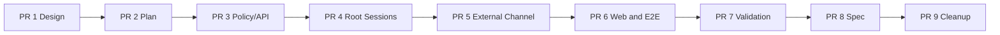

# Agent Default Projects for Automatic Sessions Implementation Plan

## Source of Truth

- Requirements: [`agent-260724/REQ`](../requirements/agent-260724-automatic-session-default-projects.md)
- ADR: [`agent-260724/ADR`](../adr/agent-260724-automatic-session-default-projects.md)
- Design: [`agent-260724/DESIGN`](../design/agent-260724-automatic-session-default-projects.md)
- Requirements short ID: `agent-260724`

This plan converts the approved snapshot into a reviewable stacked delivery. It
does not replace the phase execution plans required before each implementation
phase begins.

## Delivery Shape

The feature uses stacked PRs because persistence, API generation, root Session
transactions, External Channel locking, frontend state, and E2E validation have
sequential dependencies and distinct review risks.

```text
main
  <- feat/agent-default-projects-design
  <- feat/agent-default-projects-plan
  <- feat/agent-default-projects-policy
  <- feat/agent-default-projects-root-sessions
  <- feat/agent-default-projects-external-channel
  <- feat/agent-default-projects-web
  <- feat/agent-default-projects-validation
  <- feat/agent-default-projects-spec
  <- feat/agent-default-projects-cleanup
```

## PR Stack

### PR 1: Design baseline

- Title: `Automatic session default projects [1/9]: Design baseline`
- Branch/base: `feat/agent-default-projects-design` → `main`
- Boundary: approved Requirements, ADR, Design, and generated documentation
  index only.
- Output: immutable implementation input for every later phase.

### PR 2: Implementation plan

- Title: `Automatic session default projects [2/9]: Implementation plan`
- Branch/base: `feat/agent-default-projects-plan` →
  `feat/agent-default-projects-design`
- Boundary: this multi-phase plan only.
- Output: stack boundaries, dependency map, validation matrix, fixture
  prerequisites, continuity ownership, and spec candidates.

### PR 3: Phase 1 — Policy persistence and management API

- Title: `Automatic session default projects [3/9]: Policy persistence and management API`
- Branch/base: `feat/agent-default-projects-policy` →
  `feat/agent-default-projects-plan`
- Boundary:
  - revisioned Agent policy settings and ordered item persistence;
  - generated Alembic migration and existing-Agent backfill;
  - revision-1 policy creation for new Agents;
  - policy repository and domain contracts;
  - AgentAdmin-only read/replace service;
  - Runtime-backed non-empty path validation outside held DB transactions;
  - optimistic revision conflict and stable API error discriminators;
  - Public GET/PUT routes, OpenAPI dump, and regenerated Python/TypeScript
    public clients.
- Excludes:
  - applying policy Projects to root Sessions;
  - team-primary and External Channel producer changes;
  - Agent Settings UI.
- Required tests:
  - migration, constraints, ordering, empty clear, duplicate handling, and
    optimistic replacement;
  - AgentAdmin authorization and Workspace-owner exclusion;
  - Runtime ready, unavailable, missing, non-directory, invalid path, and
    revision-changed-during-validation behavior;
  - catalog projection update and separation from recency defaults.

### PR 4: Phase 2 — Shared root Session initialization and team-primary

- Title: `Automatic session default projects [4/9]: Root Session initialization`
- Branch/base: `feat/agent-default-projects-root-sessions` →
  `feat/agent-default-projects-policy`
- Boundary:
  - explicit versus Agent-default root workspace intent;
  - shared root creation service that accepts the producer-owned DB session;
  - atomic AgentSession, root SessionAgentContext, and context Project
    creation;
  - migration of explicit non-primary Session producers without changing
    setup-action, preset, catalog, or recency-default behavior;
  - team-primary ensure result that distinguishes newly created from reused;
  - policy snapshot application only in the race-winning creation
    transaction;
  - no Runtime I/O for Agent-default Session creation.
- Excludes:
  - External Channel producer migration;
  - frontend behavior.
- Required tests:
  - explicit empty and explicit different paths never merge with policy;
  - automatic empty and non-empty policy snapshots;
  - atomic rollback;
  - team-primary winner/loser race and existing-primary reuse;
  - no automatic mutation of presets or recency defaults;
  - subagent parent-context inheritance remains unchanged.

### PR 5: Phase 3 — External Channel integration

- Title: `Automatic session default projects [5/9]: External Channel integration`
- Branch/base: `feat/agent-default-projects-external-channel` →
  `feat/agent-default-projects-root-sessions`
- Boundary:
  - authorization Allow root Session creation uses Agent-default intent;
  - already-granted initial binding root Session creation uses Agent-default
    intent;
  - existing active binding reuses its Session without rereading policy;
  - existing request, resource, binding, connection, and activation
    transaction and lock order remains intact;
  - Project creation completes before binding commit and wake-up.
- Excludes:
  - provider-specific Project configuration;
  - live Slack credentials or provider changes;
  - frontend policy settings.
- Required tests:
  - both new-binding paths snapshot configured Projects;
  - empty policy compatibility;
  - existing binding reuse;
  - rollback keeps Session, context Projects, binding, grant, and decision
    atomic.

### PR 6: Phase 4 — Agent Settings UI and E2E coverage

- Title: `Automatic session default projects [6/9]: Agent Settings UI`
- Branch/base: `feat/agent-default-projects-web` →
  `feat/agent-default-projects-external-channel`
- Boundary:
  - Agent Settings hub row and `/settings/projects` route;
  - generated-client-backed tRPC policy procedures;
  - stable backend error discriminator exposure to the client;
  - reusable neutral Runtime directory picker extraction without copying the
    chat-owned picker;
  - container ADT and pure UI for loading, empty, clean, dirty, saving,
    Runtime-unavailable, missing, validation, and revision-conflict states;
  - add, remove, reorder, save, and reload-latest behavior;
  - localized copy, pure component stories, and focused container tests;
  - deterministic E2E support and scenarios for the complete product matrix.
- Excludes:
  - worktree or Git-ref controls;
  - channel-specific policy;
  - automatic overwrite after revision conflict.
- Required tests:
  - query-to-ADT conversion and draft preservation;
  - successful mutation invalidation;
  - Runtime and validation error recovery;
  - revision conflict reload;
  - desktop and mobile pure states;
  - E2E fixture operations use product/runtime boundaries and never mutate
    product tables directly.

### PR 7: E2E/testenv validation

- Title: `Automatic session default projects [7/9]: E2E validation`
- Branch/base: `feat/agent-default-projects-validation` →
  `feat/agent-default-projects-web`
- Boundary:
  - execute the validation matrix across backend, deterministic E2E, focused
    Runtime Provider, and Web Surface lanes;
  - record commands, environment, fixture readiness, evidence, and failures;
  - fix implementation defects discovered by validation;
  - compare implemented behavior strictly with the current living specs.
- Output:
  - a design-scoped validation report;
  - complete evidence or an explicit blocker with a tracking issue when the
    required substrate cannot run.
- Excludes:
  - spec promotion itself;
  - new product decisions.

### PR 8: Spec promotion

- Title: `Automatic session default projects [8/9]: Spec promotion`
- Branch/base: `feat/agent-default-projects-spec` →
  `feat/agent-default-projects-validation`
- Boundary:
  - run the spec-review workflow;
  - update current Agent, Workspace, Conversation, External Channel, and
    relevant flow specs;
  - correct stale AgentSession-owned Project language to
    SessionAgentContext-owned Project language;
  - add the same `implemented` date to Requirements and Design after all
    implementation and validation gates pass.
- Excludes:
  - editing the accepted ADR;
  - behavior changes unrelated to validation findings.

### PR 9: Cleanup

- Title: `Automatic session default projects [9/9]: Cleanup`
- Branch/base: `feat/agent-default-projects-cleanup` →
  `feat/agent-default-projects-spec`
- Boundary:
  - remove this multi-phase plan and every feature phase execution plan;
  - remove only temporary references made obsolete by implementation.
- Excludes:
  - behavior changes, refactors, or further product scope.

## Dependency and Parallelization Map



- The stack is sequential at PR boundaries.
- Within PR 3, persistence/repository work may proceed in parallel with API
  contract research only after shared policy models and error discriminators
  are fixed in the phase plan.
- Within PR 4, explicit producer integration and team-primary race work may
  proceed in parallel after the root creation service interface is fixed and
  shared integration files are reserved for the primary agent.
- PR 5 is isolated because External Channel lock and transaction ordering is a
  separate high-risk review boundary.
- Within PR 6, frontend UI work and testenv fixture support may proceed in
  parallel after generated API and picker interfaces are fixed.
- Validation, spec promotion, and cleanup remain sequential.

## Agent Continuity Plan

The primary agent remains the sole orchestrator, interface owner, integrator,
review-finding resolver, and phase progression authority.

| Role | Continuity |
| --- | --- |
| Policy persistence/API implementer | Keep one backend implementation owner through PR 3. Reuse that owner for policy-specific corrections found later. |
| Root Session implementer | Keep one backend implementation owner through PR 4 and reuse for root-creation corrections in PR 5 or PR 7. |
| External Channel implementer | Keep one External Channel owner through PR 5 and related validation corrections. |
| Frontend implementer | Keep one TypeScript owner through picker extraction, settings UI, stories, and Web Surface corrections. |
| Testenv/E2E implementer | Keep one validation owner through fixture support, E2E scenarios, and PR 7 evidence. |
| Independent reviewer | Use one reviewer that participates in no implementation workstream across the stack when available. |

Every assignment must cite the Requirements, ADR, Design, this plan, and the
current phase execution plan. Reassignment requires updating the current phase
plan before work continues.

## Interface and Ownership Constraints

- Automatic defaults and explicit `existing_project_paths` are distinct
  closed workspace intents and are never merged.
- Policy identity is the normalized absolute Agent Workspace path.
- Policy replacement is whole-list, ordered, atomic, and guarded by
  `expected_revision`.
- Non-empty policy writes validate through a ready Runtime Runner before the
  replacing transaction; empty clear does not require Runtime.
- Automatic root Session creation reads one coherent policy snapshot and does
  not call Runtime.
- Only a newly inserted team-primary receives policy Projects.
- External Channel producers retain their current lock order and
  producer-owned transaction.
- Subagent creation reuses the parent `context_id` and never reads policy.
- Generated clients are regenerated from OpenAPI and are never edited
  manually.
- The neutral directory picker must not import from an app page or create a
  reverse feature dependency.

## Data, API, and Runtime Changes by Phase

| Phase | Data | API | Runtime |
| --- | --- | --- | --- |
| PR 3 | settings/items tables, revision state, Agent create row | Public GET/PUT policy routes and stable error codes | Runner directory validation only during non-empty management writes |
| PR 4 | context Project snapshot on new roots | Existing Session APIs retain request/response shape | No Runtime call for automatic creation |
| PR 5 | no new schema | Existing External Channel responses retain shape | No new provider or Runner dependency |
| PR 6 | no product schema | tRPC projection of generated policy API | Reuses existing workspace start/read directory boundaries |
| PR 7 | fixture-owned disposable directories only | Verification through public/UI paths | Deterministic ready/unavailable fixture states |

## Test Strategy by Phase

- PR 3: repository, migration, service, API, error-code, and generated-contract
  tests.
- PR 4: root creation service, explicit producer regression, team-primary
  concurrency, rollback, and subagent exclusion tests.
- PR 5: focused External Channel transaction and binding lifecycle tests.
- PR 6: TypeScript component/container tests, stories, locale validation, and
  committed E2E scenarios plus fixture support.
- PR 7: execute complete E2E and quality matrix and record evidence.
- PR 8: documentation validation and spec traceability review.
- PR 9: documentation validation and stale-plan scan.

## E2E Primary Validation Matrix

| Scenario | Primary path | Expected evidence |
| --- | --- | --- |
| Save two default Projects | Web Surface settings journey and Public API | Ordered rows, revision increment, exact GET response |
| External Channel Allow creates root | Signed fake Slack admission and approval | Bound Session Project API returns configured paths |
| Already-granted initial binding creates root | Signed fake Slack deterministic path | New binding Session Project API returns configured paths |
| First team-primary ensure | Public team-primary route | Primary Session has configured paths |
| Explicit empty selection | Public Session create | No Projects despite non-empty Agent policy |
| Explicit different selection | Public Session create | Only explicit paths, with no policy merge |
| Policy changes after creation | Public API plus two Sessions | Old Session unchanged; later Session uses new policy |
| Subagent spawn | Public chat/tool journey | Child resolves the shared root context with no duplicates |
| Missing path save | Remove disposable Runtime directory, then PUT | Write rejected; prior revision and policy unchanged |
| Runtime unavailable save and clear | Deterministic Runtime state fixture | Non-empty write rejected; empty clear succeeds |
| Concurrent edit | Two expected-revision writes | Stale write conflicts and preserves winning policy |
| Responsive settings states | Web Surface desktop/mobile | Add, reorder, remove, save, conflict, and recovery remain reachable |

The Session Project API is the authoritative assertion surface for created
Session snapshots. Fake Slack is sufficient; no live Slack credential is
required.

## Fixture and Prerequisite Support

- Seed at least three disposable real directories under `/workspace/agent`
  through the Runtime/test fixture boundary.
- Provide one safe operation to remove a disposable directory for missing-path
  validation without touching a source checkout.
- Provide a deterministic Runtime/Runner unavailable state for management-write
  recovery coverage.
- Keep Runtime and Runner ready for successful non-empty policy writes.
- Reuse fake Slack admission, signing, approval, and provider configuration.
- Use no direct database writes in E2E scenarios.
- Web Surface uses the existing containerized Chromium lane.
- No external credentials or optional live-provider checks are needed.

## Validation Commands

The phase execution plans will narrow commands to their owned paths. The final
validation includes:

```bash
cd python/apps/azents
uv run ruff check .
uv run ruff format --check .
uv run pyright .
uv run pytest -vv
uv run python src/cli/dump_openapi.py
git diff --exit-code -- specs

cd typescript
pnpm run generate
pnpm run format:check
pnpm run lint
pnpm run typecheck
pnpm run build

cd testenv/azents/e2e
uv run ruff check .
uv run ruff format --check .
uv run pyright .
uv run pytest -vv -m "not live_external and not runtime_provider and not web_surface" ./src
uv run pytest -vv -m "web_surface and not live_external and not runtime_provider" ./src
```

Focused Runtime Provider and External Channel tests must also run when their
path filters select those lanes.

## Blockers and Manual Actions

- No requester or product blocker exists.
- PR 3 must establish a stable backend error discriminator that survives the
  generated client and tRPC boundary before PR 6 conflict UX begins.
- PR 4 must expose team-primary created versus existing status without
  weakening the current unique-constraint race authority.
- PR 5 must preserve External Channel resource and binding lock order.
- PR 6 must add disposable Runtime directory and unavailable-state fixture
  support before the complete E2E matrix can pass.
- No manual provider console, credential, Kubernetes, or production action is
  required.

## Spec Impact Candidates

- `docs/azents/spec/domain/agent.md`
- `docs/azents/spec/domain/workspace.md`
- `docs/azents/spec/domain/conversation.md`
- `docs/azents/spec/domain/external-channel.md`
- `docs/azents/spec/flow/external-channel-authorization.md`
- `docs/azents/spec/flow/external-channel-provider-ingress.md`

No execution-loop or Runtime-control behavior change is planned.

## Rollout and Cleanup

- The migration is additive and backfills revision-1 empty policies, preserving
  existing automatic Session behavior until an Agent administrator configures
  Projects.
- Application rollback leaves policy data inert and does not alter existing
  Session context snapshots.
- Existing External Channel bindings and existing team-primary Sessions are not
  retroactively modified.
- After validation and spec promotion, PR 9 removes this plan and all phase
  execution plans. Requirements, ADR, Design, current specs, and code remain as
  the durable sources of truth.
