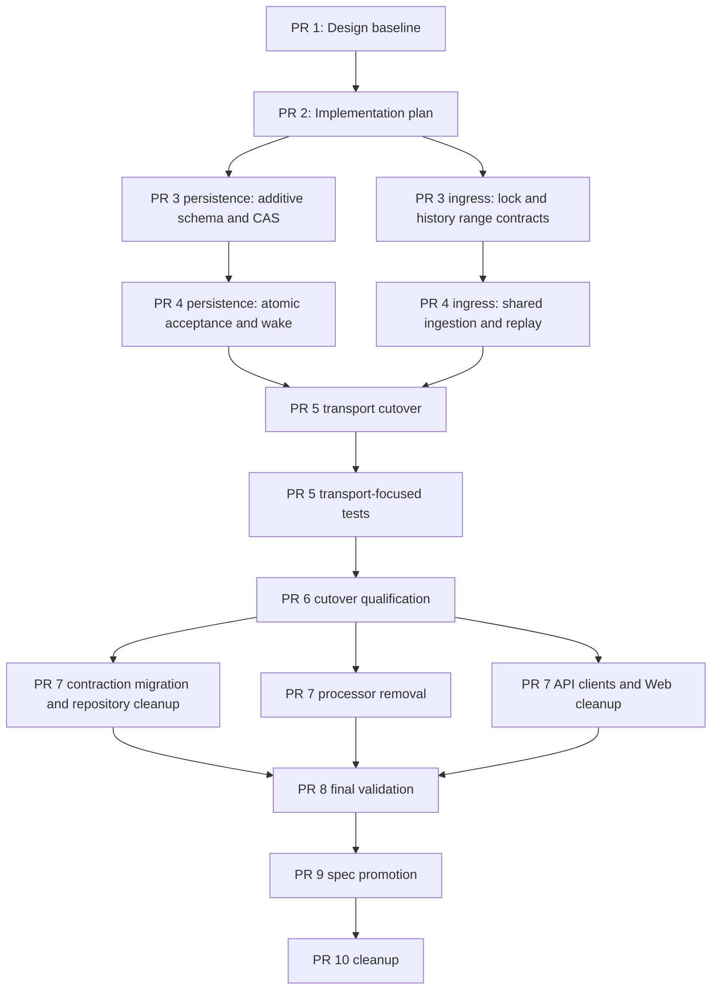

# Responsive Context-Preserving External Conversations Implementation Plan

## Feature Summary

This plan implements the approved `channel-260729` development snapshot. Slack HTTP,
Slack Socket Mode, and Discord Gateway triggers will synchronously resolve the provider
conversation, read bounded provider history, atomically accept one ordered Session input
batch with a durable PostgreSQL read position, dispatch the Session wake, and only then
return a successful transport outcome. Agent execution and provider reply delivery remain
asynchronous.

The implementation replaces deferred raw-event message ingestion, hydration-gated binding
activation, and pending-context release with one shared provider-neutral ingestion service.
It preserves current route, access, binding, Session, Channel Work, delivery, file, and
provider-transport authority boundaries.

## Authoritative Inputs

- Requirements:
  `docs/azents/requirements/channel-260729-responsive-context-preserving-conversations.md`
  (`channel-260729/REQ`)
- ADR:
  `docs/azents/adr/channel-260729-responsive-context-preserving-conversations.md`
  (`channel-260729/ADR`)
- Design:
  `docs/azents/design/channel-260729-responsive-context-preserving-conversations.md`
  (`channel-260729/DESIGN`)
- Current behavior:
  - `docs/azents/spec/domain/external-channel.md`
  - `docs/azents/spec/flow/external-channel-provider-ingress.md`
  - `docs/azents/spec/flow/external-channel-authorization.md`
  - `docs/azents/spec/flow/external-channel-lifecycle.md`
  - `docs/azents/spec/flow/external-channel-delivery.md`
  - `docs/azents/spec/flow/agent-execution-continuity.md`
  - `docs/azents/spec/flow/file-exchange-storage.md`
  - `docs/azents/spec/flow/test-strategy-e2e-primary.md`

The Requirements and Design remain unimplemented until validation and spec promotion are
complete. The accepted ADR is append-only and is not edited by implementation phases.

## Delivery Shape

The feature requires additive and destructive migrations, provider-specific history and
transport work, a shared transactional ingestion boundary, generated-client and Web
changes, deterministic multiprocess E2E, guarded rollout evidence, and current-spec
promotion. These dependencies require a stacked PR series.

Stack prefix: `External conversations`

| Order | PR title | Branch | Base | Deliverable |
| --- | --- | --- | --- | --- |
| 1 | `External conversations [1/10]: Design baseline` | `feature/channel-responsive-context-01-design-baseline` | `main` | Approved Requirements, ADR, Design, and generated docs index |
| 2 | `External conversations [2/10]: Implementation plan` | `feature/channel-responsive-context-02-implementation-plan` | PR 1 branch | This multi-phase plan, roster, interfaces, rollout gates, and validation matrix |
| 3 | `External conversations [3/10]: Foundation` | `feature/channel-responsive-context-03-foundation` | PR 2 branch | Additive position/boundary/wake schema, backfill/preflight, lock contract, position codecs, and dark provider-history range adapters |
| 4 | `External conversations [4/10]: Ingestion core` | `feature/channel-responsive-context-04-ingestion-core` | PR 3 branch | Shared ingestion service, atomic mailbox/position acceptance, omission reminder, wake dispatch, and approval/selector replay while transport ingress remains legacy |
| 5 | `External conversations [5/10]: Transport cutover` | `feature/channel-responsive-context-05-transport-cutover` | PR 4 branch | Slack HTTP/Socket and Discord Gateway direct handoff, direct Slack revocation, eager thread provisioning, and removal of processor startup |
| 6 | `External conversations [6/10]: Cutover qualification` | `feature/channel-responsive-context-06-cutover-qualification` | PR 5 branch | Deterministic synchronous-path evidence with the additive legacy schema retained, preflight coverage, and discovered fixes |
| 7 | `External conversations [7/10]: Contraction and surfaces` | `feature/channel-responsive-context-07-contraction-surfaces` | PR 6 branch | Destructive legacy schema/code removal, public management contraction, regenerated clients, and Session Channels UI cleanup |
| 8 | `External conversations [8/10]: Final validation` | `feature/channel-responsive-context-08-validation` | PR 7 branch | Complete post-contraction Slack/Discord E2E matrix, validation report, implementation/spec comparison, and discovered fixes |
| 9 | `External conversations [9/10]: Spec promotion` | `feature/channel-responsive-context-09-spec-promotion` | PR 8 branch | Spec review, current-spec updates, and matching implementation dates on Requirements and Design |
| 10 | `External conversations [10/10]: Cleanup` | `feature/channel-responsive-context-10-cleanup` | PR 9 branch | Remove this plan and every phase execution plan after implementation and specs are authoritative |

Create every PR before stack-wide CI monitoring. Do not merge any PR without explicit
requester approval. Merge order, if later authorized, is front to back.

## Execution Roster

| Role | Assigned agent | Persistent ownership | Planned phases |
| --- | --- | --- | --- |
| Primary orchestrator | `/root` | Phase progression, shared interfaces, integration, branch/PR ownership, plan and spec documents, generated-artifact integration, final validation and CI remediation | 1–10 |
| Persistence owner | `/root/channel-plan-persistence` | External-channel RDB models, repositories, migrations, position/CAS and wake persistence, mailbox and Session wake transaction support | 3, 4, 7, 8 |
| Ingress owner | `/root/channel-plan-ingress` | Slack HTTP/Socket, Discord Gateway, provider history adapters, transport deadlines/outcomes, direct revocation, legacy processor retirement | 3, 4, 5, 6, 7, 8 |
| Surface and validation owner | `/root/channel-plan-surfaces-validation` | Public projection contraction, OpenAPI/client generation integration, Web Session Channels, provider fakes, deterministic E2E, validation evidence | 5, 6, 7, 8 |
| Independent reviewer | `/root/channel-responsive-reviewer` | Read-only review of each phase contract and final phase diff | 1–9 |

The primary agent may continue, reset, or reassign an owner only at a recorded context
checkpoint. Every implementation owner receives the exact reviewer path
`/root/channel-responsive-reviewer` and directly requests review after focused checks.
The reviewer never edits implementation files.

## Context Checkpoints

At each phase boundary, record:

- completed product behavior and schema state;
- fixed or changed interfaces;
- focused and final validation evidence;
- review findings and correction status;
- remaining stack scope and explicit non-goals;
- relevant paths and migration head;
- rollout, security, data-loss, and compatibility risks; and
- whether each owner/reviewer retains useful compact context for the next phase.

No later-phase code begins before the current phase PR exists.

## Mandatory Phase Execution Plan Gate

Before editing implementation or validation code, changing generated artifacts or
specs, or delegating implementation work for PR 3 through PR 10, the primary agent must
create, store, and report a separate tracked phase execution plan under
`docs/azents/plans/`. A phase summary in this document, chat, an agent task, a commit
message, or a PR body is not a substitute.

Each phase execution plan must contain:

```markdown
## Phase Execution Plan

- Phase: `<number and name>`
- Branch/base: `<branch>` → `<base>`
- PR boundary: `<deliverable>`
- Inputs: `<completed dependencies>`
- Deliverables: `<observable outcomes>`
- Non-goals: `<explicit exclusions>`
- Interfaces: `<contracts fixed before parallel work>`

| Workstream | Owner | Owned paths | Depends on | Output | Validation |
| --- | --- | --- | --- | --- | --- |
| ... | ... | ... | ... | ... | ... |

- Integration order: `<sequence>`
- Independent review: `<scope, criteria, inputs, output>`
- Final validation: `<commands>`
- Scope-drift check: `<diff and non-goal comparison>`
- Context checkpoint: `<completed behavior, changed interfaces, evidence, remaining scope, relevant paths, risks>`
```

The complete plan is reported before phase work begins. Delegated owners receive only
their fixed interfaces and owned paths after the plan exists. For PR 10, the cleanup
phase plan is created and reported before removals, then removed with every other
feature plan as part of the cleanup boundary.

## Stable Interfaces Across the Stack

The following contracts are fixed before implementation work is delegated:

- Provider transports own authentication, connection and lease generation, trigger
  projection, absolute acknowledgement deadline, and native success/failure mapping.
- `ExternalChannelConversationIngestionService` is the only normal message-ingestion
  application boundary after cutover.
- Trigger locators contain provider authority and identity only. They contain no message
  body, blocks, embeds, files, attachment URL, raw callback, interaction token, or
  credential.
- PostgreSQL conversation positions are the durable ordering authority. Redis and memory
  locks are ephemeral coordination only.
- External-channel lock backend selection is explicit and independent from the existing
  Redis-backed Session broker.
- Provider history is read outside a PostgreSQL transaction under the coordination lock.
  The final short transaction compares the locked position with the read start before
  accepting input.
- Invocation batch, ordered items, mailbox item, Session running transition, wake intent,
  and normal position advancement commit together.
- A routing-only `SessionWakeUp` is dispatched and the durable batch wake state is marked
  dispatched before a successful provider outcome.
- Approval and selector state stores typed position and trigger boundaries without
  provider message content.
- Slack parent-channel ingestion uses a new `conversations.history` range path. Slack
  thread ingestion reuses and extends `conversations.replies` normalization.
- Discord history reuses current response/item byte limits and adds exact-trigger plus
  bounded-before range semantics.
- Slack provider requests retain `retry_handlers=[]`; implementation must not use raw
  Slack Web API requests or generic `.api_call()`.
- Public APIs expose no cursor, lock, boundary, or `context_omitted` state.
- Generated Python and TypeScript clients are regenerated from OpenAPI and never edited
  manually.
- Logs and evidence contain no credential, provider payload, message body, attachment
  metadata or URL, raw provider identifier, or production identity.

## Workstream Ownership

### Persistence and Transactional Core

Primary areas:

- external-channel RDB models, repository DTOs, repository operations, and lifecycle
  integration;
- Alembic revisions and migration tests;
- conversation position lock/CAS and invocation wake state;
- mailbox external invocation payload and Session wake transaction support.

This owner does not wire provider ingress or edit generated clients and Web code.

### Provider Ingress and History

Primary areas:

- Slack HTTP and Socket Mode transport services;
- Discord Gateway manager, callback projection, and history client;
- provider-specific range readers, deadlines, and typed error mapping;
- shared ingestion integration points, direct Slack revocation, and legacy event
  processor retirement.

This owner coordinates shared service interfaces with the primary and persistence owner
before parallel work. It does not own public management projection or generated clients.

### Public Surfaces and Validation

Primary areas:

- public external-channel management projection and route contract tests;
- OpenAPI and generated Python/TypeScript public clients through generation commands;
- azents-web Session Channels presentation, stories, and localized copy;
- deterministic Slack/Discord provider fakes and external-channel E2E;
- sanitized validation evidence and implementation/spec comparison.

E2E reproduces product state through provider, public API, and UI paths. Feature tests do
not write product rows directly.

### Shared Integration

The primary agent owns:

- the shared ingestion service interface and cross-owner DTO placement;
- configuration composition and DI boundaries;
- phase execution plans and checkpoints;
- shared tests and generated-artifact integration;
- any file whose ownership would otherwise overlap;
- final scope-drift and CI remediation decisions.

## Dependency and Parallelization Map



Parallel work is allowed only after a phase execution plan assigns non-overlapping paths
and fixes shared interfaces. Migration ordering, shared DTOs, DI composition, and
OpenAPI generation remain primary-owned integration points.

## PR 3 — Foundation

### Outcomes

- Add `external_channel_conversation_positions` with parent-channel and thread scope
  uniqueness and nullable read-through position.
- Add typed position/range boundaries to conversation admissions and access requests.
- Enforce connection/resource/position ownership with explicit relational constraints
  instead of untyped policy JSON.
- Add conversation range, omission, and wake dispatch fields to invocation batches.
- Backfill active thread positions from the recoverable binding/batch boundary and fail
  migration preflight for ambiguous active bindings. Do not infer parent-channel
  positions.
- Add position repository lock/CAS primitives and deterministic provider position codecs.
- Add the explicit Redis/memory conversation-lock protocol and backend contract tests.
- Add bounded Slack channel/thread and Discord range readers with exact-trigger,
  newest-20, connected-App/Bot exclusion, omission detection, deadlines, and typed
  failure classification.
- Add quiesce configuration and a content-free cutover preflight report while the legacy
  event processor remains the active ingress path.

### Non-Goals

- No normal transport calls the new ingestion path.
- No Session mailbox behavior changes.
- No legacy event, hydration, pending-context, activation, public API, or Web field is
  removed.
- No live ingress quiesce, database repair, deployment, or provider mutation is performed.

### Required Evidence

- Generated additive Alembic revision and linear revision-head update.
- Migration upgrade/downgrade and unsafe-state preflight tests on PostgreSQL.
- Position uniqueness/CAS and provider codec tests.
- Shared Redis/memory lock contract, owner-token, renewal/loss, cancellation, empty-Redis,
  and cross-process comparison tests.
- Slack/Discord range, author exclusion, pagination, byte bound, missing trigger, rate
  limit, malformed response, and deadline tests.

## PR 4 — Ingestion Core

### Outcomes

- Add the provider-neutral trigger locator and typed ingestion outcome.
- Implement shared initial parent/manual-thread resolution and bound-thread continuation.
- Persist canonical principals/messages/revisions from provider history without using the
  inbound payload as content authority.
- Atomically accept invocation batch/items, omission reminder, mailbox item, Channel Work
  and initial delivery intents, Session running transition, wake intent, and position
  advancement.
- Claim, dispatch, and mark the routing-only Session wake with crash/retry idempotency.
- Implement immutable access Allow and selector replay before or after the shared position
  passes the original trigger.
- Preserve legacy provider ingress wiring so the new path remains dark until the next PR.

### Non-Goals

- No provider transport switches to synchronous ingestion.
- No legacy schema or event processor removal.
- No public management API or Web contraction.

### Required Evidence

- Transaction rollback and position mismatch restart tests.
- Duplicate, delayed, concurrent, and already-advanced trigger tests.
- Mailbox payload ordering with one leading `SYSTEM_REMINDER` and at most 20 provider
  messages.
- One coherent projection change updates invocation-batch DTOs and queries, omission
  state, mailbox payload construction, mailbox promotion, and their focused tests.
- Wake crash-before-send, ambiguous send, post-send/pre-mark, dispatched redelivery, and
  stuck-Session recovery tests.
- Approval and selector replay tests with no cursor rollback or retained provider content.
- Security tests proving locators, logs, state, and operational evidence exclude provider
  content and secrets.

## PR 5 — Transport Cutover

### Outcomes

- Slack HTTP invokes the shared service after signed request verification and acknowledges
  only completed terminal outcomes.
- Slack Socket Mode invokes the same service under the current connection lease and
  acknowledges only after synchronous handoff.
- Discord Gateway message-create invokes the same service under current lease fencing;
  update/delete callbacks no longer create Session input.
- Unbound Discord parent invocation eagerly creates or reconciles the provider thread
  before acceptance. Delivery no longer lazily creates a missing thread.
- Slack `app_uninstalled` and `tokens_revoked` use direct authenticated connection
  lifecycle transitions without raw event rows.
- Selector, shortcut, and interaction continuation paths use typed replay boundaries.
- Agent Worker no longer starts `ExternalChannelEventProcessorService` in the cutover
  generation.
- Cutover gates prohibit mixed legacy and synchronous message-ingestion authorities.

### Non-Goals

- No destructive legacy schema removal yet.
- No managed binding API/UI field removal yet.
- No live cluster quiesce, rollout, manual database mutation, or provider verification.

### Required Evidence

- Transport acknowledgement timing and failure mapping tests.
- Socket/Gateway lease loss and reconnect behavior tests.
- Direct revocation and cleanup/reconnect-required tests.
- Eager Discord thread reconciliation and delivery-target integrity tests.
- Worker composition test proving the event processor is not started.
- Guard tests preventing dual ingestion and rejecting failed preflight state.

## PR 6 — Cutover Qualification

### Outcomes

- Extend deterministic Slack and Discord provider fakes with the minimum range-aware
  history, author mixture, failure sequence, duplicate/concurrency barrier, and
  acknowledgement timing capabilities needed to qualify the synchronous path.
- Prove Slack HTTP, Slack Socket, and Discord Gateway synchronous handoff while the
  additive legacy schema remains present but inactive.
- Prove provider/database/broker failures preserve the normal conversation position.
- Prove duplicate and concurrent triggers converge on one batch, mailbox input, and
  logical wake.
- Prove approval replay before and after shared position advancement.
- Exercise the content-free quiesce/preflight command against safe and rejected fixture
  states.
- Record preliminary cutover qualification commands and sanitized evidence, and fix
  defects found before destructive contraction begins.

### Non-Goals

- No legacy table, column, enum, processor, generated-client, or Web removal.
- No current-spec promotion.
- No live provider run, live ingress quiesce, deployment, or database mutation.
- No claim that production cutover or contraction has occurred.

### Required Evidence

- Required synchronous-path E2E for all three transports.
- Redis-backed and in-memory lock contract evidence.
- Duplicate/concurrency, bounded omission, connected-App/Bot exclusion, failure cursor,
  approval replay, and append-only edit/delete evidence.
- Safe preflight pass and abort-category tests with aggregate-only output.
- Independent review confirming that contraction prerequisites are represented and that
  the legacy schema is no longer a runtime correctness dependency.

PR 7 may contain contraction code after this deterministic qualification passes. Actual
deployment of the contraction migration remains prohibited until the operational
cutover and production-validation gates in `channel-260729/DESIGN` have been satisfied.

## PR 7 — Contraction and Surfaces

### Outcomes

- Drop `external_channel_events`, `external_channel_pending_contexts`, legacy hydration,
  activation, truncation, projection-position, and revision source-event schema after the
  qualification and preflight guards.
- Remove event/hydration processor repositories, services, enums, models, and dead tests.
- Preserve canonical external messages/revisions, invocation batches/items, bindings,
  Channel Work, delivery, file, interaction, provisioning, route, access, and Session
  behavior that remains authoritative.
- Remove `activation_status`, `truncated_message_count`, and `truncated_size` from the
  public `ManagedBinding` projection without adding cursor or omission fields.
- Regenerate public OpenAPI and both Python and TypeScript public clients.
- Remove the activation badge and retained-context truncation summary from Session
  Channels, update static stories, and remove only the obsolete keys from all locales.
- Carry the temporary cutover-gate removal implementation in this behavior-complete PR
  rather than leaving runtime cleanup to the documentation cleanup PR. The change is
  merge- and deployment-ineligible until the external operational checkpoint below has
  succeeded; deployed generations must retain the gates until then.

### Non-Goals

- No current-spec promotion.
- No manual edits to generated clients.
- No compatibility fallback or dual-read legacy path.
- No live schema downgrade or deployment action.

### Required Evidence

- Contraction upgrade/downgrade tests and repeated zero-backlog/ownership preflight.
- Focused full external-channel backend tests after processor removal.
- OpenAPI generation and generated Python/TypeScript client checks.
- Contract test proving retired `ManagedBinding` keys are absent.
- TypeScript format, lint, typecheck, build, and changed Storybook/component tests.

## PR 8 — Final Validation

### Outcomes

- Complete deterministic provider fake range, author, failure, concurrency,
  acknowledgement, and sanitized request-count coverage after contraction.
- Run the complete cross-transport E2E matrix through public/provider paths.
- Run Redis-backed and memory-lock concurrency contracts.
- Record commands, environment, results, fixture/prerequisite state, failures, fixes, and
  sanitized evidence in a supporting Design validation report.
- Compare implemented behavior strictly with current specs and identify every required
  spec update before spec promotion.
- Fix discovered implementation defects in their owning paths and rerun invalidated
  evidence.

### Primary E2E Matrix

| Behavior | Slack HTTP | Slack Socket | Discord Gateway |
| --- | --- | --- | --- |
| Authorized unbound parent invocation commits Session input before successful transport completion | Required | Required | Required |
| Provider thread is created or reused and all output targets it | Required | Required | Required |
| Bound-thread authorized continuation requires no mention | Required | Required | Required |
| Manual unbound thread is reused for first invocation | Required | Required | Required |
| Connected App/Bot output is excluded while human, other-bot, and visible system context is retained | Required | Required | Required |
| Newest 20 messages plus leading omission reminder | Required | Required | Required |
| Duplicate/concurrent trigger creates one batch, mailbox input, and logical wake | Required | Required | Required |
| Provider/database/broker failure preserves the normal position | Required | Required | Required |
| Approval Allow replays before and after the shared position passes the trigger | Required | Required | Required |
| Edit/delete does not rewrite accepted Session input | Required | Required | Required |
| Redis and in-memory conversation-lock contracts preserve accepted-input semantics | Required | Required | Required |
| Evidence and logs remain content-free and credential-free | Required | Required | Required |

### Fixture and Prerequisite Requirements

Deterministic CI requires fake provider credentials, PostgreSQL, Redis for the Redis lock
lane, and no Redis client for the memory lock contract. Provider fake control and evidence
remain bounded and exclude raw callbacks, message bodies, credentials, authorization
headers, signatures, attachment names/bytes/URLs, and production identifiers.

Optional live verification requires a fresh credential/prerequisite snapshot confirming:

- Slack scopes, App identity, workspace/channel access, callback reachability, and a
  disposable conversation;
- Discord Guild/channel access, connected Bot identity, Gateway intent, callback
  reachability, and a disposable conversation.

Scheduled optional live verification skips with a sanitized prerequisite summary when
not ready. A maintainer-requested live run fails when required credentials or
prerequisites are missing. Deterministic CI never depends on live credentials.

## PR 9 — Spec Promotion

Run `/spec-review` after validation and update current behavior in:

- `docs/azents/spec/domain/external-channel.md`;
- `docs/azents/spec/flow/external-channel-provider-ingress.md`;
- `docs/azents/spec/flow/external-channel-authorization.md`;
- `docs/azents/spec/flow/external-channel-lifecycle.md`;
- `docs/azents/spec/flow/external-channel-delivery.md`;
- `docs/azents/spec/flow/agent-execution-continuity.md`;
- `docs/azents/spec/flow/test-strategy-e2e-primary.md`.

Verify `file-exchange-storage.md` and update it only if file authority or locator behavior
changed. Add the same KST implementation date to the Requirements and Design only after
all mandatory implementation and validation evidence passes. Do not edit the accepted
ADR.

## PR 10 — Cleanup

Remove this multi-phase plan and all feature phase execution plans only after:

- implementation and contraction are complete;
- cutover qualification and final deterministic validation are complete;
- specs represent current behavior;
- Requirements and Design carry the matching implementation date; and
- every earlier stack PR exists.

The cleanup PR contains documentation-plan removal only. It does not include behavior,
migration, compatibility, refactoring, or runtime-gate changes.

## Migration, Rollout, and Rollback

### Additive Foundation

- Generate new revisions only through `alembic revision`; never edit an executed
  migration.
- Preserve one linear migration chain and update `db-schemas/rdb/revision`.
- Add position/boundary/wake schema and backfill active thread positions while the legacy
  processor remains authoritative.
- Reject ambiguous active binding state instead of inventing a cursor or performing
  manual repair.

### Guarded Cutover

1. Quiesce Slack HTTP, Slack Socket, and Discord Gateway message ingress through the
   temporary application gate.
2. Allow the legacy processor to converge.
3. Require sanitized zero counts for nonterminal events, waiting/wake-pending bindings,
   incomplete hydration, pending context, open admissions, pending access requests, and
   invocation-critical provisioning.
4. Verify every active binding has an unambiguous resource target, Session, route, latest
   accepted batch, and backfilled thread position.
5. Abort on any nonzero or ambiguous category. Do not repair production state manually.
6. Deploy one generation in which all transports use the synchronous service and no
   process starts the legacy processor.
7. Re-enable ingress only after API, Agent Worker, Slack Socket, and Discord Gateway roles
   are on that generation.

### External Operational Checkpoint Before Contraction

PR 7 may be created, reviewed, and validated in the stack before any live action, but it
must not be merged or deployed until an explicitly authorized operator has:

1. deployed the additive through cutover-qualified generation with the temporary gates
   still present;
2. quiesced message ingress through those gates;
3. observed a successful zero-backlog preflight;
4. deployed and re-enabled the synchronous generation;
5. recorded sanitized production-validation evidence for acknowledgement timing,
   Session handoff, position progress, retry behavior, and provider health; and
6. confirmed that rollback to the quiesced legacy schema is no longer required.

Failure or missing evidence preserves the deployed cutover gates and blocks contraction
merge/deployment. It does not trigger manual database repair. The primary agent does not
perform these live actions without separate explicit authorization, and PR creation or
CI success is not evidence that the operational checkpoint occurred.

Before contraction, rollback means returning to the quiesced legacy generation. After
contraction, rollback requires the complete prior application and schema backup. No
runtime compatibility branch or dual authority is retained.

This repository work stops at PRs and validation. It does not apply, sync, restart,
delete, migrate, or otherwise mutate live infrastructure.

## Validation Commands

Exact focused commands are fixed in each phase execution plan. The integrated matrix
includes:

### Python backend

```text
cd python/apps/azents
uv run ruff format --check <changed paths>
uv run ruff check <changed paths>
uv run pyright
uv run pytest <phase-focused tests>
uv run pytest
```

Migration tests require PostgreSQL through Docker/Testcontainers and must not be reported
as passed when the substrate is unavailable.

### OpenAPI and clients

```text
cd python/apps/azents
uv run python src/cli/dump_openapi.py
```

Then use the repository OpenAPI client-generation workflow for Python and TypeScript.
Generated artifacts are validated but never hand-edited.

### TypeScript

```text
cd typescript
pnpm run format
pnpm run lint
pnpm run typecheck
pnpm run build
```

### Deterministic E2E

```text
cd testenv/azents/e2e
uv run pytest -vv -m "not live_external and not runtime_provider and not web_surface" ./src
uv run pytest -vv -m "web_surface and not live_external and not runtime_provider" ./src
```

Run focused external-channel provider fake and journey tests before the complete lanes.

### Documentation

```text
python scripts/gen_docs_index.py --docs-root docs/azents --project-name azents --check
python -m unittest scripts.tests.test_gen_docs_index
git diff --check
```

## CI Execution Policy

- Create all ten PRs before stack-wide CI monitoring.
- Request `hardtack` on every PR.
- Run owner-focused checks before independent review and stable integrated checks once
  after corrections.
- Reuse evidence only while the diff, prerequisites, and environment remain equivalent.
- If an earlier PR changes, rebase later branches with the stacked-PR workflow and rerun
  only evidence invalidated by the changed interface; rerun the full matrix when the
  correction crosses shared persistence, ingestion, transport, or generated-client
  boundaries.
- Continue remediation until every required check on every PR is successful or an
  explicitly non-required lane is skipped by policy.
- Do not merge without explicit approval for that specific merge.

## Blockers and External Actions

No implementation blocker is currently known. The following are phase gates rather than
open design decisions:

- migration backfill must reject active bindings without a recoverable accepted thread
  position;
- legacy pending approvals and admissions must drain or expire before cutover because
  exact replay boundaries cannot be reconstructed;
- cutover requires zero legacy backlog and one application generation;
- contraction merge/deployment requires the separately authorized external operational
  checkpoint, verified synchronous operation, and repeated preflight evidence;
- optional live verification requires its credential/prerequisite snapshot;
- live infrastructure mutation and PR merge require separate explicit authorization.

Any discovery that changes user-visible scope, authorization, retention, or success
semantics returns to `feature-design` before implementation continues.

## Cleanup Source of Truth

After PR 10, active sources of truth are:

- current external-channel specs;
- immutable implemented `channel-260729` Requirements and Design;
- accepted `channel-260729` ADR;
- migration history and implementation code;
- deterministic validation evidence retained as a supporting Design record.
