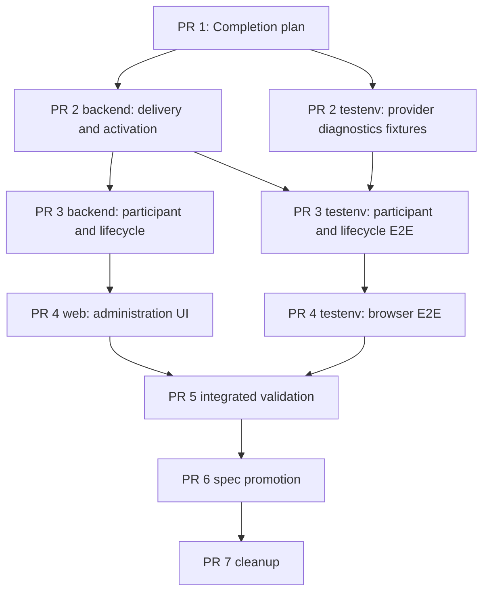

# Discord Slack Parity Completion Implementation Plan

## Feature Summary

This plan closes every remaining implementation, integration, evidence, and
documentation gap under `discord-260728/REQ`. It follows the production finding that
the first Discord binding created durable control, progress, and reply attempts but
all provider operations completed as `unknown/provider_ambiguous`, and the code audit
that found Discord activation releasing and waking before history hydration.

The delivery restores Slack-equivalent user-visible behavior:

1. reconcile eligible context before first execution;
2. provision or reuse one deterministic Discord thread;
3. deliver the Session link and initial checking progress through that thread;
4. release and wake the Session only through the defined activation gate;
5. preserve replies, files, progress, recovery, cleanup, and lifecycle behavior;
6. expose and verify complete Discord Multi App administration; and
7. prove every participant and administrator journey through deterministic E2E.

## Authoritative Inputs

- Requirements: `docs/azents/requirements/discord-260728-slack-parity.md`
  (`discord-260728/REQ`)
- ADR: `docs/azents/adr/discord-260728-slack-parity.md`
- Design: `docs/azents/design/discord-260728-slack-parity.md`
- Completion checklist:
  `docs/azents/plans/discord-260728-slack-parity-completion-checklist.md`
- Current behavior:
  - `docs/azents/spec/domain/external-channel.md`
  - `docs/azents/spec/flow/external-channel-provider-ingress.md`
  - `docs/azents/spec/flow/external-channel-authorization.md`
  - `docs/azents/spec/flow/external-channel-delivery.md`
  - `docs/azents/spec/flow/external-channel-lifecycle.md`
  - `docs/azents/spec/flow/test-strategy-e2e-primary.md`

The accepted ADR remains immutable. Current specs are promoted only after matching
implementation and evidence exist.

## Delivery Shape

The completion spans provider delivery, activation ordering, durable work lifecycle,
test fixtures, participant E2E, Workspace UI, browser E2E, and living specs. These
boundaries have sequential dependencies and require separate review, so delivery uses
stacked PRs.

Stack prefix: `Discord Slack parity completion`

| Order | PR | Deliverable | Depends on |
| --- | --- | --- | --- |
| 1 | Completion plan | Completion checklist, phase boundaries, roster, and validation matrix | Existing merged Requirements, ADR, and Design |
| 2 | Phase 1 — Delivery and activation | Safe delivery diagnostics, corrected Discord hydration/activation ordering, deterministic thread and pre-wake gate | PR 1 |
| 3 | Phase 2 — Participant and lifecycle | Invocation, selector, approval, work, reply, file, recovery, lifecycle completion plus deterministic participant E2E | PR 2 |
| 4 | Phase 3 — Administration UI | Discord Workspace management completion, stories, and browser E2E | PR 3 |
| 5 | Integrated validation | Complete deterministic/web-surface validation, strict checklist audit, and discovered fixes | PR 4 |
| 6 | Spec promotion | Spec review, verified current behavior, Requirements/Design implementation marking when complete | PR 5 |
| 7 | Cleanup | Remove completion implementation and phase plans after implementation and specs become authoritative | PR 6 |

All PRs are created before stack-wide CI monitoring. No PR is merged without explicit
requester approval for that merge.

## Stable Delivery Team

| Role | Assigned agent | Persistent ownership | Planned phases |
| --- | --- | --- | --- |
| Primary orchestrator | `/root` | Planning, interfaces, integration, scope, branches, PRs, final validation | 1–7 |
| Backend owner | `/root/parity-backend-owner` | Discord provider delivery, event processor, repository/work/lifecycle, focused backend tests | 2, 3, 5 |
| Testenv owner | `/root/parity-testenv-owner` | Discord fake, deterministic participant/admin/lifecycle E2E, sanitized evidence | 2, 3, 4, 5 |
| Web owner | `/root/parity-web-owner` | Generated-client consumption, tRPC, Workspace UI, stories, browser-facing behavior | 4, 5 |
| Independent reviewer | `/root/parity-reviewer` | Read-only review of every implementation phase | 2–6 |

Implementation owners request review directly from
`/root/parity-reviewer`. The reviewer does not implement or own product paths.

## Workstream Ownership

### Backend

Primary owned paths:

- `python/apps/azents/src/azents/services/external_channel/**`
- `python/apps/azents/src/azents/repos/external_channel/**`
- relevant public External Channel service/API tests

Generated API artifacts remain source-generated. Backend schema or public API changes
must update OpenAPI through repository generation commands before client regeneration.

### Testenv

Primary owned paths:

- `testenv/azents/e2e/src/support/discord_provider_fake.py`
- `testenv/azents/e2e/src/tests/test_discord_provider_fake.py`
- Discord-specific additions in
  `testenv/azents/e2e/src/tests/azents/public/test_external_channels.py`
- fixture and prerequisite support required by those journeys

Tests must reproduce state through user-facing provider/API/UI paths and must not write
product state directly to the database.

### Web

Primary owned paths:

- `typescript/apps/azents-web/src/trpc/routers/externalChannel.ts`
- `typescript/apps/azents-web/src/features/external-channel-workspace/**`
- related pure UI stories

Generated TypeScript clients under `src/generated/` are never hand-edited.

### Shared Integration Files

The primary orchestrator owns plan documents, phase plans, checklist status, current
spec promotion, generated-artifact integration, PR metadata, and any shared file whose
ownership would otherwise overlap.

## Dependency and Parallelization Map

Backend and testenv work may run in parallel only after the current phase execution
plan fixes their interfaces and owned paths. Web implementation begins after the
provider-correct management interface and deterministic test prerequisites are stable.

## Phase 1 — Delivery Diagnostics and Activation Ordering

### Outcomes

- Safe provider outcome classification replaces undifferentiated operational evidence
  while retaining `unknown` and no-blind-retry semantics.
- New Discord bindings begin in `waiting_hydration`.
- Discord approval Allow and selected-admission paths enter the same waiting state
  instead of releasing through Slack defaults or immediate Discord wake behavior.
- Root and existing-thread history reconciliation complete before context release.
- Correlated events clear before initial invocation creation.
- One deterministic provider thread becomes the delivery boundary.
- Concurrent initial deliveries claim thread provisioning through one canonical
  resource fence so multiple workers cannot create competing root threads.
- Session link and initial checking progress follow an explicit pre-wake delivery gate.
- Initial Session-link, progress, and approval-control delivery use the normal
  provider-dispatched action service rather than Slack-only legacy consumers.
- Binding activation and Session wake occur in the required order.

### Data, API, and Runtime Impact

- Prefer existing persistence fields and delivery status values.
- Add no alternative Discord Session, authorization, work, or retry domain.
- A schema change is allowed only when the existing durable model cannot represent the
  required activation state safely; any migration must be generated.
- No public management API change is expected in this phase.

### Primary Checklist Coverage

- `A-01` through `A-10`
- `B-01` through `B-20`
- `B-21` through `B-23`
- `E-01` through `E-05` and `E-13`
- initial portions of `G-01` through `G-03`
- `I-12` and `I-13`

### Required Validation

- Discord delivery focused tests
- event processor and hydration focused tests
- repository/work activation tests
- Discord fake controlled failure tests
- ordering test proving hydration and required provider setup precede wake

## Phase 2 — Participant, Work, and Lifecycle Completion

### Outcomes

- Mention and Message Command entry points converge on one immutable binding.
- Selector navigation, selection, approval, allow, deny, block, and revocation preserve
  canonical access semantics.
- Approval, Session links, progress, replies, files, and cleanup use one thread.
- Progress page updates, deletion recovery, final-reply cleanup, archive, disconnect,
  decommission, and reconnect behavior complete.
- Lifecycle cleanup and operational projection read authoritative Discord projection
  parts instead of Slack legacy progress-message state.
- Inbound Discord message deletion and confirmed provider missing-message outcomes
  recreate active desired progress pages.
- Deterministic participant journeys prove the complete behavior.

### Primary Checklist Coverage

- `C-01` through `C-10`
- `D-01` through `D-12`
- `E-06` through `E-12`
- `F-01` through `F-10`
- `G-04` through `G-22`
- `I-01` through `I-14`, excluding items completed in Phase 1
- `J-01` through `J-09` and `J-12` through `J-13`

### Required Validation

- focused interaction, selector, source, access, work, action, file, and lifecycle tests
- Discord fake contract tests
- deterministic participant E2E
- deterministic reconnect and lifecycle E2E

## Phase 3 — Discord Administration UI and Browser Evidence

### Outcomes

- Provider-correct management behavior is complete across public API, generated
  clients, tRPC, Workspace UI, and browser evidence.
- Discord setup, edit, validate, route, default, impact, disconnect, historical state,
  and redaction behavior are visible and tested.
- The Workspace surface uses provider-correct routing, navigation, component naming,
  deep-link provider restoration, and stable combined provider pagination.
- Slack management behavior remains unchanged.

### Primary Checklist Coverage

- `H-01` through `H-17`
- `J-10` and `J-11`

### Required Validation

- public management route/service/client tests
- regenerated Python and TypeScript client checks if schemas change
- TypeScript format, lint, typecheck, and build
- Storybook state coverage for changed pure components
- deterministic public API E2E
- web-surface browser E2E

## Phase 4 — Integrated Validation

### Outcomes

- Run every planned focused and full validation lane.
- Record environment, commands, results, and sanitized evidence.
- Audit every completion-checklist item.
- Fix implementation defects discovered by integrated evidence.
- Produce a strict implementation-versus-current-spec table.

### Required Validation Matrix

| Behavior | Primary evidence | Supporting evidence |
| --- | --- | --- |
| Mention and selected-message invocation | Deterministic participant E2E | parser, interaction, source, event processor tests |
| Selector and approval | Deterministic participant E2E | selector, admission, access tests |
| Hydration and pre-wake ordering | Deterministic participant E2E | event processor and history tests |
| One Discord thread | Provider fake E2E evidence | delivery and repository tests |
| Session link and initial progress | Participant E2E ordering evidence | work and delivery tests |
| Reply, file, progress, cleanup | Participant E2E | action, file, work tests |
| Missing-page recovery | Recovery E2E | work planner tests |
| Disconnect/reconnect/archive/decommission | Lifecycle E2E | lifecycle and repository tests |
| Discord Multi API | Deterministic public API E2E | route/service/client tests |
| Workspace management UI | Web-surface browser E2E | TypeScript and story checks |
| Redaction | Every deterministic evidence payload | focused security tests |

## Phase 5 — Spec Promotion

Run spec review after integrated validation. Update current behavior only when matching
implementation and evidence exist.

Spec candidates:

- `docs/azents/spec/domain/external-channel.md`
- `docs/azents/spec/flow/external-channel-provider-ingress.md`
- `docs/azents/spec/flow/external-channel-authorization.md`
- `docs/azents/spec/flow/external-channel-delivery.md`
- `docs/azents/spec/flow/external-channel-lifecycle.md`
- `docs/azents/spec/flow/test-strategy-e2e-primary.md`

Use one implementation date for the Requirements and Design only after every mandatory
completion item is satisfied. Do not edit the accepted ADR.

## Phase 6 — Cleanup

Remove this completion plan, every phase execution plan, and the completion checklist
only after implementation, integrated validation, spec promotion, and PR CI are
complete. Current specs and implementation then become the active source of truth.

## Fixture and Prerequisite Requirements

The deterministic Discord fake must support:

- Guild Message Command registration and selected-source interactions;
- signed component/select interaction relay;
- bounded root and thread history pages;
- deterministic root-thread create/reuse;
- message create/update/delete and multipart file operations;
- rate limit, permission, credential, provider rejection, 5xx, malformed response,
  response mismatch, and ambiguous transport scenarios;
- sanitized ordering and delivery evidence without provider message contents;
- Gateway dispatch, resume, invalid session, intent, and credential boundaries.

Docker/Testcontainers and the real web app/browser remain required for E2E. Missing
local infrastructure is reported honestly, but required PR CI evidence must still pass.

## Security and Durability Constraints

- PostgreSQL remains canonical.
- Keep existing lock order, configuration generation, app-claim generation, lease,
  checkpoint, immutable binding, authorization, delivery ledger, and file authority
  fences.
- Never persist or expose credentials, interaction tokens, signatures, selectors, raw
  provider requests/responses, attachment URLs or bytes, message contents, or exception
  details in evidence.
- Never replay ambiguous provider writes.
- Do not add backward compatibility or fallback behavior unless required by the current
  Slack contract.
- Do not change Slack user-visible behavior.

## Known Blockers and External Actions

- Production root-cause confirmation for the current ambiguous delivery requires a
  corrected diagnostic build to be deployed. This blocks checklist item `A-10`, but it
  does not block deterministic reproduction and code correction.
- Production mutation, deployment, merge, and live Discord verification require
  explicit requester approval at their respective boundaries.
- Existing ambiguous delivery rows are historical evidence and must not be retried.

## Rollout Notes

1. Merge from front to back only after explicit approval.
2. Monitor the snapshot build and `apiserver`, `worker`, and `discord-gateway` rollout.
3. Use a new Discord root conversation because an existing binding does not re-enter
   the first-binding path.
4. Verify provider-visible thread, Session link, progress, reply, file, and cleanup
   ordering.
5. Inspect only sanitized delivery state and logs.

## Completion Gate

The feature is complete only when:

- every mandatory checklist item is completed or explicitly superseded by a documented
  requirement-preserving implementation;
- the full participant and administrator deterministic journeys pass;
- web-surface browser evidence passes;
- living specs match implementation;
- every stacked PR has completed independent review and green CI; and
- no production verification claim is made without an actual new-conversation result.
