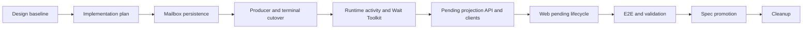

# Unified Agent Input Mailbox Implementation Plan

## Source of Truth

- Requirements: [`mailbox-260726/REQ`](../requirements/mailbox-260726-unified-agent-input-mailbox.md)
- ADR: [`mailbox-260726/ADR`](../adr/mailbox-260726-unified-agent-input-mailbox.md)
- Design: [`mailbox-260726/DESIGN`](../design/mailbox-260726-unified-agent-input-mailbox.md)
- Snapshot: `mailbox-260726`

This plan delivers the approved consume-on-read AgentSession mailbox, generalized `wait` tool, atomic descendant terminal delivery, and typed pending Web lifecycle. It does not change the confirmed queue-only versus Session-waking scheduling contract, broaden direct human writes to subagent Sessions, or add wait conditions beyond active descendant work.

## Delivery Shape

Use a ten-PR stack. The feature changes durable schema, every Agent input producer, terminal Run transactions, Redis/Worker routing, Engine Toolkit context, public API contracts, generated clients, Web timeline state, and E2E fixtures. These boundaries are sequentially dependent and independently reviewable; one focused PR would obscure migration, runtime, and UI correctness.

```text
main
  <- feature/mailbox-260726-design
  <- feature/mailbox-260726-plan
  <- feature/mailbox-260726-persistence
  <- feature/mailbox-260726-producers
  <- feature/mailbox-260726-wait
  <- feature/mailbox-260726-api
  <- feature/mailbox-260726-web
  <- feature/mailbox-260726-validation
  <- feature/mailbox-260726-spec
  <- feature/mailbox-260726-cleanup
```

PR title prefix: `Agent mailbox [N/10]`

## Stable Delivery Team

| Role | Assigned agent | Persistent ownership | Planned phases |
| --- | --- | --- | --- |
| Primary orchestrator | `/root` | Plans, phase progression, branch and PR stack, scope/interface decisions, final integrated verification, CI monitoring | All |
| Implementation owner | `/root/mailbox-implementer` | All bounded implementation and focused validation; directly requests review and applies findings | Phases 1-5, validation fixes, spec promotion, cleanup |
| Independent reviewer | `/root/mailbox-reviewer` | Read-only review against Requirements, ADR, Design, current phase plan, tests, migration safety, and scope boundaries | Every implementation, validation, spec, and cleanup phase |

The implementation owner must request review from exactly `/root/mailbox-reviewer` after each phase validation, apply grounded findings, rerun affected checks, and request recheck. The primary orchestrator performs only final scope, integration, and validation verification after that cycle completes.

## Dependency and Parallelization Map

All PR phases are sequential because each branch is based on the previous stack branch and later contracts consume earlier types or behavior.



Use one implementation owner because the phases share rename-sensitive symbols, generated contracts, and stacked transaction boundaries. No two agents edit implementation paths in parallel. Within a phase, independent discovery or review may run concurrently only when it is read-only. The reviewer never edits implementation files.

## PR and Phase Boundaries

### PR 1 — Design Baseline

- Branch/base: `feature/mailbox-260726-design` → `main`
- PR: `#887`
- Deliverable: approved Requirements, accepted ADR, primary Design, generated docs index.
- Behavior change: none.
- Validation: documentation frontmatter, snapshot lifecycle, index generation, repository feasibility.

### PR 2 — Implementation Plan

- Branch/base: `feature/mailbox-260726-plan` → `feature/mailbox-260726-design`
- Deliverable: this multi-phase implementation plan.
- Behavior change: none.
- Validation: docs index and snapshot validation.

### PR 3 — Phase 1: Mailbox Persistence Foundation

- Branch/base: `feature/mailbox-260726-persistence` → `feature/mailbox-260726-plan`
- Deliverable: canonical mailbox persistence types, generated in-place migration, typed envelope schema, repository/service rename, and migration fixtures.
- Data changes:
  - Rename `input_buffers` to `mailbox_items` while preserving IDs and FIFO order.
  - Generate the new Alembic revision with the repository migration command,
    never edit an executed migration, and update `db-schemas/rdb/revision` to the
    new head.
  - Rename dependent FK/source columns, indexes, constraints, and explicit enum/schema vocabulary selected by the phase plan.
  - Add the closed typed payload and backfill every current mailbox kind, including pending External Channel batches.
  - Preserve the real External Channel batch FK and the non-FK action-execution and Agent Run source identities under mailbox terminology.
  - Recreate every dependent FK, unique constraint, index, and check under mailbox
    vocabulary. Preserve the External Channel batch FK's nullable `SET NULL`
    behavior and keep dependent action-execution and Agent Run source rows valid
    throughout backfill and destructive-drop ordering.
- Internal caller cutover:
  - Move every ORM, repository, service, worker, action-execution, replay, and
    External Channel caller to mailbox types in this phase so the branch compiles
    without storage/service aliases, dual-read, or dual-write.
  - The existing public JSON field names may remain only as a temporary
    serialization boundary backed by mailbox-domain values until Phase 4 updates
    OpenAPI and generated clients. This is not an internal InputBuffer alias and is
    removed in Phase 4.
- Runtime/API boundary: no producer behavior, public wire contract, or Wait Toolkit behavior change.
- Tests:
  - migration upgrade with one pending row of every kind;
  - pending External Channel backfill with an intact source batch and a malformed
    or unresolvable batch that must abort before destructive column removal;
  - payload validation and invalid-backfill failure;
  - FIFO, idempotency, row-locking, stale-head, and delete-after-handoff repository/service tests;
  - focused Ruff, Pyright, and pytest.

### PR 4 — Phase 2: Producer, Preparation, and Terminal Cutover

- Branch/base: `feature/mailbox-260726-producers` → `feature/mailbox-260726-persistence`
- Deliverable: every producer and Agent input preparation path uses typed mailbox envelopes; External Channel input is immutable after admission; terminal delivery is atomic and queue-only.
- Data/runtime changes:
  - Cut over user messages, Goal continuations, Turn Actions, Agent messages, spawn assignments, follow-up tasks, and terminal results.
  - Build complete ordered External Channel context-plus-trigger payloads before enqueue; promotion no longer calls source projection repositories.
  - Preserve full wakeup for existing wake-session producers and queue-only admission for `send_message` and terminal results.
  - Introduce one transaction-aware terminal finalization coordinator for completed, failed, stopped, interrupted, and cancelled child Runs.
  - Atomically commit terminal state, direct-parent mailbox envelope, and enqueued/suppressed delivery marker.
  - Route normal Engine completion, event finalization, failed/unhandled Run
    finalization, Session lifecycle cancellation/stop, and User Stop through the
    coordinator; inventory every remaining `mark_terminal` caller before removing
    repair.
  - The caller inventory must include Engine execution `_mark_terminal`, failed
    event finalization, pending-Run cancellation, Session-wide remaining-Run
    terminal marking, individual lifecycle terminal marking, and User Stop
    individual and bulk paths. Bulk and pending cancellation paths must prepare
    each eligible child's direct-parent delivery or explicit suppression marker in
    the same transaction.
  - Prove and document the SessionAgent tree/root, child Run, direct parent, and
    parent mailbox lock order with concurrency tests.
  - Remove terminal-boundary, parent-wait, and source-session-reuse repair only after all terminal paths use the atomic coordinator.
- API boundary: internal mailbox vocabulary and source correlation may change, but typed public pending projections wait for Phase 4.
- Tests:
  - one admission/promotion path per mailbox kind;
  - External Channel promotion after source records mutate or become unavailable;
  - transaction rollback for every terminal outcome;
  - one test per terminal caller proving an eligible child terminal state cannot
    commit without its parent mailbox envelope or explicit suppression marker;
  - idle parent remains idle after queue-only result;
  - operation Turn Action handoff remains atomic;
  - focused Ruff, Pyright, and pytest.

### PR 5 — Phase 3: Runtime Activity and Wait Toolkit

- Branch/base: `feature/mailbox-260726-wait` → `feature/mailbox-260726-producers`
- Deliverable: live-owner-only queue activity, Run-scoped mailbox observer, independent `WaitToolkit`, and concise prompt migration from `wait_agent` to `wait`.
- Runtime changes:
  - Add a typed activity-only Redis/Worker signal routed only to a live owner.
  - Decode activity before the current create-runner path; absent owner or active runner is a benign drop.
  - Reuse active `SessionWakeUp` delivery as observer activity without duplicate producer signaling.
  - Create and close a monotonic `MailboxActivityObserver` per Run and pass it through Run execution into `TurnContext`.
  - Keep the observer injection route explicit:
    `SessionRunner → RunExecutor → EngineAdapter/TurnContext → WaitToolkit`.
  - Add `ActiveDescendantWaitCondition`, shared wait service, all-kind durable mailbox checks, subscribe/recheck ordering, bounded reconciliation, and final timeout recheck.
  - Add the independent auto-bound `WaitToolkit`; remove `wait_agent` without an alias and update every Subagent prompt/fixture surface.
- API boundary: no public chat projection change.
- Tests:
  - owner/no-owner/owner-race activity routing without idle runner creation;
  - observer revision, coalescing, handover, shutdown, and cancellation;
  - wait startup race and signal-loss reconciliation;
  - all five mailbox kinds end an eligible wait;
  - no-descendant, all-idle, timeout, and terminal-result ordering outcomes;
  - prompt and model-visible tool snapshots;
  - focused Ruff, Pyright, and pytest.

### PR 6 — Phase 4: Typed Pending Projection API and Generated Clients

- Branch/base: `feature/mailbox-260726-api` → `feature/mailbox-260726-wait`
- Deliverable: server-owned typed pending mailbox projections in REST and WebSocket contracts plus regenerated Python and TypeScript public clients.
- API/data changes:
  - Replace InputBuffer/Event-shaped pending live state with typed envelope and item projections.
  - Rename write snapshot and response vocabulary such as
    `accepted_input_buffer_id` and `input_buffer_events` to mailbox terminology.
  - Replace `/sessions/{session_id}/input-buffers/{buffer_id}` with the
    mailbox-item mutation route and retain the existing authorization and deletion
    behavior without a legacy route alias.
  - Expose action-execution source correlation as `source_mailbox_item_id` rather
    than `input_buffer_id`.
  - Include mailbox envelope ID, stable item key, semantic kind, creation time, source-safe presentation payload, and pending state.
  - Add stable pending-to-durable and pending-to-action correlation.
  - Add dedicated mailbox upsert/removal WebSocket actions and coordinated REST live/write snapshot fields.
  - Publish durable event or action ownership before pending removal.
  - Regenerate OpenAPI specs and both public client families; do not edit generated code manually.
- Public vocabulary cutover:

  | Current contract | Final contract |
  | --- | --- |
  | accepted type `input_buffer` | accepted type `mailbox_item` |
  | `accepted_input_buffer_id` | `accepted_mailbox_item_id` |
  | write snapshot `input_buffer_events` | `pending_mailbox_items` |
  | live snapshot `input_buffers` | `pending_mailbox_items` |
  | `ActionExecutionResponse.input_buffer_id` | `source_mailbox_item_id` |
  | `DELETE .../input-buffers/{buffer_id}` | `DELETE .../mailbox-items/{mailbox_item_id}` |
  | pending InputBuffer through `live_event_upserted/removed` | `mailbox_item_upserted/removed` |

  The old route, fields, accepted type value, and pending InputBuffer event shape
  are removed without public compatibility aliases.
- Frontend boundary: update only compile-level client consumers or adapters required for generated contract compatibility. Presentation behavior waits for Phase 5.
- Tests:
  - REST `/live` and write snapshot coverage for every kind;
  - replace the current External Channel assertion that pending invocation is
    deferred until durable promotion with a typed pending mailbox projection
    assertion immediately after admission;
  - WebSocket action serialization and transition ordering;
  - REST baseline reconstruction plus `mailbox_item_upserted/removed`, with
    durable history or action-execution publication observed before pending removal;
  - stale pending suppression when durable/action ownership exists;
  - OpenAPI dump and client regeneration checks;
  - Python and TypeScript generated package checks.

### PR 7 — Phase 5: Web Pending Lifecycle

- Branch/base: `feature/mailbox-260726-web` → `feature/mailbox-260726-api`
- Deliverable: every mailbox item renders with source-specific pending presentation and transitions without gaps, duplicates, or reordering.
- Web changes:
  - Replace `pendingInputBuffers` state with typed pending mailbox envelope/item state.
  - Reuse user, internal Agent, External Channel, Goal/Skill, and operation action renderers with common reduced emphasis.
  - Deduplicate by mailbox envelope and item key; durable history and active action execution win on resync.
  - Apply mailbox upsert/removal actions and REST baseline replacement under the existing epoch/generation rules.
  - Preserve detached-history behavior and existing input mutation permissions.
- Tests:
  - reducer and selector correlation ordering;
  - every source-specific pending renderer;
  - compound External Channel ordering;
  - refresh, reconnect, delayed action, and durable-first transition cases;
  - TypeScript format, lint, typecheck, targeted tests, and build.

### PR 8 — E2E and Validation

- Branch/base: `feature/mailbox-260726-validation` → `feature/mailbox-260726-web`
- Deliverable: deterministic cross-source E2E coverage, fixture/prerequisite support, validation report, and fixes found during integrated verification.
- Validation scope:
  - run `/spec-review` once before integrated QA, record the impact result, and
    use that result in the following Spec Promotion PR;
  - execute the E2E matrix below;
  - validate migration upgrade from a pre-feature fixture;
  - validate no live Slack credential is required for primary CI;
  - record commands, environment, evidence, failures, fixes, and implementation-versus-spec drift;
  - store the evidence in a supporting `mailbox-260726` validation report under
    `docs/azents/design/`;
  - send behavior fixes to the stable implementation owner and complete the same independent review cycle.

### PR 9 — Spec Promotion

- Branch/base: `feature/mailbox-260726-spec` → `feature/mailbox-260726-validation`
- Deliverable: current living specs reflect the implemented mailbox, wait, terminal, API, and Web behavior.
- Documentation changes:
  - apply the spec-impact result recorded at the start of the Validation PR
    without running a second spec review;
  - update affected domain and flow specs and their `code_paths`, `last_verified_at`, and `spec_version`;
  - add the same `implemented` date to Requirements and Design only after implementation and validation complete;
  - keep the accepted ADR immutable.
- Validation: docs index, snapshot lifecycle, spec checks, and representative behavior tests.

### PR 10 — Cleanup

- Branch/base: `feature/mailbox-260726-cleanup` → `feature/mailbox-260726-spec`
- Deliverable: remove this multi-phase plan and every mailbox phase execution plan after specs become the current source of truth.
- Boundary: documentation plan removal and stale plan-reference cleanup only; no behavior changes or refactors.
- Validation: docs index, repository scan for unintended old `InputBuffer`/`wait_agent` runtime vocabulary, and checks affected by cleanup.

## Phase Execution Plan Gate

Before any implementation edit in PRs 3-10, add and report a separate tracked phase plan under `docs/azents/plans/` using the mandatory `## Phase Execution Plan` structure. Each phase plan fixes branch/base, deliverables, non-goals, interfaces, owned paths, dependencies, validation, independent review criteria, and scope-drift checks. The current phase plan replaces prior task-level scope while Requirements, ADR, Design, and this plan remain authoritative.

## E2E Primary Validation Matrix

| Scenario | Expected behavior | Primary evidence | Phase |
| --- | --- | --- | --- |
| Active descendant plus user message | `wait` returns mailbox activity without consuming input; pending user bubble promotes once | browser/API E2E and durable history assertion | Validation |
| Active descendant plus operation Turn Action | wait returns; pending action transfers to active execution then durable result without duplicate | browser E2E and API snapshots | Validation |
| Active descendant plus queue-only `send_message` | active wait ends; an idle target Session is not started | deterministic worker/broker E2E | Phase 3 and Validation |
| Active descendant terminal result | terminal state and parent mailbox result commit atomically; active wait ends; idle parent remains idle | transaction integration test and team-session E2E | Phase 2 and Validation |
| Active descendant plus External Channel invocation | one immutable context-plus-trigger envelope wakes the Session; pending items promote contiguously | deterministic External Channel fixture E2E | Phase 2 and Validation |
| Active descendant plus Goal continuation | wait ends and continuation uses normal mailbox promotion | deterministic Agent E2E | Validation |
| No descendants | immediate `not_waitable/no_descendants` | AIMock tool assertion | Phase 3 and Validation |
| All descendants idle | immediate `not_waitable/all_descendants_idle` | AIMock tool assertion | Phase 3 and Validation |
| No mailbox activity | default and explicit timeout return `timed_out` without consumption | fake-clock/unit plus E2E smoke | Phase 3 and Validation |
| Lost activity signal | reconciliation observes committed mailbox state before overall timeout | deterministic broker failure test | Phase 3 |
| Browser refresh with every pending kind | REST reconstructs typed source-specific pending state | browser/API E2E | Phase 5 and Validation |
| Pending message promotion | durable item wins before pending removal with no gap or duplicate | WebSocket ordering E2E | Phase 4 and Validation |
| Worktree action handoff | active action projection wins before pending removal | browser/API E2E | Phase 5 and Validation |
| External source mutation after admission | promotion remains identical because mailbox owns the snapshot | backend integration test | Phase 2 |
| Worker ownership handover during wait | observer closes before ownership release; new owner resumes from durable mailbox | worker integration test | Phase 3 |

## Fixture and Prerequisite Support

- Extend deterministic AIMock subagent fixtures to invoke `wait` and expose activity, no-descendant, all-idle, and timeout outcomes.
- Add mailbox seed helpers containing one pending row of every existing kind and one pre-migration InputBuffer fixture for upgrade validation.
- Extend External Channel fixtures with retained context, authorized trigger,
  attachments/revisions/truncation metadata, an intact pre-migration source batch,
  an unresolvable pre-migration row, and post-admission source mutation/removal.
- Add deterministic live REST/WebSocket snapshots for compound External Channel items and operation Turn Action handoff.
- Add worker/broker fixtures for live owner present, heartbeat race, missing runner, ownership handover, and activity signal loss.
- Primary CI must not require live Slack or other provider credentials. Optional live-provider checks skip when prerequisite credentials are absent and fail only when the prerequisite snapshot says the provider is configured.
- Record browser screenshots or serialized timeline snapshots only where they provide stable evidence; semantic API and DOM assertions remain primary.

## Validation Commands by Area

Exact focused paths are fixed in each phase plan. The integrated validation set includes:

```bash
cd python/apps/azents
uv run ruff check .
uv run ruff format --check .
uv run pyright .
uv run pytest -vv

cd ../../../testenv/azents/e2e
uv run ruff check .
uv run ruff format --check .
uv run pyright .
uv run pytest -vv -m "not live_external and not runtime_provider and not web_surface" ./src
uv run pytest -vv -m "web_surface and not live_external and not runtime_provider" ./src

cd ../../../typescript
pnpm run format:check
pnpm run lint
pnpm run typecheck
pnpm run build

cd ..
python scripts/gen_docs_index.py --docs-root docs/azents --project-name azents --check
```

Phase 4 uses:

```bash
cd python/apps/azents
uv run python src/cli/dump_openapi.py

cd ../../../python/libs/azents-public-client
make generate

cd ../../../typescript
pnpm run generate --filter=@azents/public-client
```

Verify the OpenAPI source and both generated client trees are deterministic after
regeneration. Commands that differ from current package scripts must be corrected
in the phase plan before execution rather than silently skipped.

## Known Blockers and Prerequisites

No product or architecture blocker is known. The following implementation gates are mandatory:

- The in-place migration must abort before destructive column removal when any pending row cannot become a valid typed envelope.
- The terminal repair paths cannot be removed until every terminal transition uses the transaction-aware coordinator.
- Activity-only delivery cannot reuse the current unconditional Worker create-runner path.
- The API phase cannot merge partial generated-client updates; OpenAPI and both public client families move together.
- The Web phase cannot infer mailbox presentation from raw persistence payloads or temporary durable Events.
- The spec snapshot cannot be marked implemented until integrated E2E validation passes.

External/manual action: none required for deterministic CI. A coordinated schema-and-application deployment is required at rollout because the accepted no-alias migration does not support mixed old/new application versions.
Treat this coordinated deployment as an operational release prerequisite rather
than an architecture blocker.

## Spec Impact Candidates

At minimum inspect and update during spec promotion:

- `docs/azents/spec/flow/agent-execution-loop.md`
- `docs/azents/spec/domain/conversation.md`
- `docs/azents/spec/domain/toolkit.md`
- `docs/azents/spec/flow/chat-session-resync.md`
- External Channel domain/flow specs that describe invocation batches or InputBuffer promotion
- Team Session/subagent specs that describe `wait_agent`, terminal repair, or queue-only parent delivery

## Rollout and Rollback

- Deploy the schema and application as one coordinated cutover; do not run mixed versions against the renamed table and typed payload contract.
- Preserve mailbox IDs, FIFO order, idempotency identity, and producer scheduling mode through migration.
- Before any new typed-only or compound envelopes are admitted, rollback may rename schema objects and restore derived legacy columns.
- After new payloads are admitted, use a forward repair migration rather than a lossy automatic downgrade.
- Monitor mailbox head age, pending count, activity delivered/dropped/no-owner, wait outcomes, terminal atomic-delivery failures, correlation misses, and External Channel envelope size.

## Cleanup Exit Criteria

Cleanup may start only when:

- PRs 3-8 have passed their implementation, review, and validation gates;
- current specs describe the shipped behavior;
- Requirements and Design share the verified `implemented` date;
- no unrecorded hard-to-reverse decision remains;
- CI passes for every PR in the complete stack; and
- no merge is performed without separate explicit requester approval.
