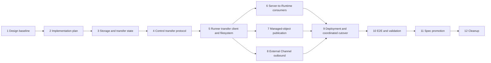

# Runtime File Transfer implementation plan

## Source of truth

- Requirements: [Runtime File Transfer Requirements](../requirements/transfer-260725-runtime-file-transfer.md) (`transfer-260725/REQ`)
- ADR: [Runtime File Transfer](../adr/transfer-260725-runtime-file-transfer.md) (`transfer-260725/ADR`)
- Design: [Runtime File Transfer Design](../design/transfer-260725-runtime-file-transfer.md) (`transfer-260725/DESIGN`)
- Current Runtime Control spec: [Agent Runtime Control](../spec/flow/agent-runtime-control.md)
- Current file-storage spec: [File Exchange and Storage](../spec/flow/file-exchange-storage.md)

This plan defines the stacked delivery boundaries for `transfer-260725`. It does
not replace the approved Requirements, accepted ADR, or primary Design. Every
implementation PR adds a separate phase execution plan under
`docs/azents/plans/` before code implementation begins.

## Feature summary

Runtime file transfer will move complete files across the Server/Runtime
boundary through a dedicated bounded streaming data plane terminated by Runtime
Control. Runtime Runner remains untrusted and receives no object-storage
credentials, URLs, keys, bucket names, or topology. Runtime Control streams
between Runner and immutable attempt-scoped S3-compatible transfer objects, and
trusted feature services use object-store-native copy when both endpoints are
managed objects. Runtime Control also owns all transfer state; Server and Worker
feature services use an authenticated internal coordinator RPC that carries
bounded metadata and opaque trusted-service handles only.

The stack removes complete-file bytes from Runner Control operation messages,
operation events, and Runtime Coordination Store. It preserves ordinary bounded
filesystem operations, existing feature authorization, product-file ownership,
and provider semantics.

## Fixed implementation invariants

- Global gRPC message-size increases are not the solution. Every transfer frame
  remains bounded below the ordinary message limit.
- Runner Control and Runner Transfer use separate gRPC services and distinct
  Runner channels, even when both endpoints resolve to the same Runtime Control
  Service.
- Runtime Coordination Store and Runtime Transfer State Store contain bounded
  metadata only and never file-body chunks.
- Preflight authorization and expected metadata resolution precede admission.
  `admit_and_create_preparing_attempt` atomically grants an admission
  reservation and creates bounded state metadata only. Rejection creates no
  lease, attempt metadata, object, provider body stream, multipart upload,
  Runner snapshot, or Runner intent. Object-key allocation and all external or
  body-bearing work start strictly after success. Any later setup failure
  releases the reservation through fenced, idempotent settlement.
- Object/provider/Runner preparation starts only after admission. Runner intent
  dispatch starts only after the immutable source object and manifest are
  `ready`.
- Existing Runtime Coordination remains Redis-backed because API/Worker and
  Runtime Control are separate processes sharing Runner connections,
  request/reply streams, operation metadata, and cancellation.
- Runtime Control solely owns Runtime Transfer State and selects its backend
  independently. `memory` is valid only when every internal coordinator and
  Runner transfer RPC reaches one Runtime Control process; `redis` supports
  multiple replicas. Redis transfer state may share the existing Redis client
  lifecycle while retaining a separate interface and key namespace.
- Server and Worker never instantiate Transfer State. They call an authenticated
  internal Runtime Transfer Coordinator service. Its messages contain bounded
  metadata and opaque handles, never complete file bodies. Invalid memory plus
  multi-replica or autoscaling configuration fails closed.
- Every attempt has an absolute logical content expiry of
  `min(attempt_created_at + 1 hour, authoritative_source_expires_at)` when the
  source has an earlier expiry. Heartbeats and retries do not extend it.
- SHA-256, exact actual length, strictly sequential offsets, attempt fencing,
  and atomic Runtime publication are required for success.
- Existing managed objects enter and leave the transfer namespace through
  object-store-native operations. Transfer production paths do not call eager
  `download_bytes()` to relay unchanged content.
- Runtime Control, Runner, providers, and adopted consumers use one coordinated
  protocol cutover. No legacy inline-binary fallback or mixed-version routing is
  added.
- Implementation phases 3-10 are not independently promoted to production.
  After all are approved and the cumulative phase 10 branch is validated,
  production deployment promotion is paused while the stack is merged
  front-to-back. Only the cumulative validated commit is deployed.

## Stable delivery team

| Role | Assigned agent | Persistent ownership | Planned phases |
| --- | --- | --- | --- |
| Primary orchestrator | `/root` | Planning, phase boundaries, interface decisions, integration verification, final review verification, PR creation, stack management, and final CI | 1-12 |
| Implementation owner | `/root/runtime-transfer-implementer` | All bounded implementation work across S3, state, Runtime Control, protobuf, Runner, consumers, providers, Helm, and tests; requests independent review and applies accepted findings directly | 3-10 |
| Independent reviewer | `/root/runtime-transfer-reviewer` | Independent phase review requested by the implementation owner after primary verification; security, correctness, resource bounds, rollout, cleanup boundary, and cumulative stack risk; rechecks addressed findings | 1-12 |

The implementation and review roles remain separate and persist across the
complete stack. A phase change alone does not create a new role. Reassignment
requires an unavailable or incompatible owner and must be recorded in this plan
and the active phase plan before work continues.

## Stack shape

```text
main
  <- feature/runtime-file-transfer-01-design-baseline
  <- feature/runtime-file-transfer-02-implementation-plan
  <- feature/runtime-file-transfer-03-storage-state
  <- feature/runtime-file-transfer-04-control-protocol
  <- feature/runtime-file-transfer-05-runner
  <- feature/runtime-file-transfer-06-server-to-runtime-consumers
  <- feature/runtime-file-transfer-07-managed-publication
  <- feature/runtime-file-transfer-08-external-channel-outbound
  <- feature/runtime-file-transfer-09-deployment-cutover
  <- feature/runtime-file-transfer-10-validation
  <- feature/runtime-file-transfer-11-spec-promotion
  <- feature/runtime-file-transfer-12-cleanup
```

Branches remain linear for stacked review and one-owner implementation. The
technical dependency graph is not fully linear: phases 6, 7, and 8 all consume
the phase 5 Runtime plane and converge before deployment. Within a phase, only
workstreams with disjoint owned paths and satisfied interfaces may proceed in
parallel. The current stable team has one implementation owner, so work remains
serialized unless this plan records a justified durable role addition.

## Dependency and parallelization map



- Phase 3 fixes bounded object and state contracts before any external Runner
  protocol depends on them.
- Phase 4 fixes protobuf, authorization, transfer-service, and control-operation
  correlation contracts, including the internal trusted coordinator service,
  before Runner implementation.
- Phase 5 implements the untrusted external endpoint against those fixed
  contracts before production consumers adopt it.
- Phase 6 owns Server-to-Runtime source preparation. Phases 7 and 8 split the
  Runtime-to-server direction into managed-object publication and provider
  relay because their transaction, compensation, retention, and final-success
  authorities differ.
- Phase 9 wires providers and deployment only after application behavior is
  present, so exact protocol/capability enforcement can be tested as a complete
  cutover.
- Phase 10 is the first full-stack user-visible validation gate. It may contain
  fixes found by E2E, but it does not broaden product scope.

## Phase 1: Design baseline

Branch: `feature/runtime-file-transfer-01-design-baseline`

PR title: `Runtime File Transfer [1/12]: Design baseline`

Purpose:

- Record the confirmed Requirements, accepted architecture decisions, and
  implementation-ready Design.
- Establish the untrusted Runner boundary, dedicated transfer RPC, immutable
  transfer object, state-store contract, admission order, one-hour expiry,
  coordinated cutover, and E2E-first validation contract.

Boundary:

- Documentation only.
- No implementation or living-spec promotion.

Verification:

- Documentation index and snapshot validation.
- `git diff --check`.
- Independent baseline review, including admission-order consistency.

## Phase 2: Multi-phase implementation plan

Branch: `feature/runtime-file-transfer-02-implementation-plan`

PR title: `Runtime File Transfer [2/12]: Implementation plan`

Purpose:

- Define reviewable implementation boundaries and dependency order.
- Record the stable delivery team, validation matrix, fixture requirements,
  rollout gates, and cleanup boundary.

Boundary:

- Adds this plan only.
- Does not add implementation code or phase execution plans for later PRs.

Verification:

- Documentation index and snapshot validation.
- `git diff --check`.
- Independent review against the Requirements, ADR, Design, and discovery
  reports.

## Phase 3: Storage and transfer state

Branch: `feature/runtime-file-transfer-03-storage-state`

PR title: `Runtime File Transfer [3/12]: Storage and transfer state`

Purpose:

- Add bounded S3-compatible transfer primitives.
- Add transfer domain values, admission, memory and Redis state stores,
  expiry/cleanup state, and contract tests.
- Add Runtime Control-owned transfer-state backend composition while preserving
  existing Redis-backed Runtime Coordination.

Included behavior:

- Bounded object metadata and body iteration with explicit close behavior.
- Immutable copy, multipart create/part/complete/abort, checksum metadata,
  verification, paginated cleanup, and conditional multipart-copy fallback
  when backend copy limits require it.
- Frozen transfer records with phase, outcome, cleanup, generation, revision,
  consumer, authoritative source expiry, and absolute-expiry fields. Logical
  expiry is the earlier of one hour after attempt creation and the source
  expiry when present.
- Atomic admission-reservation and metadata-only preparing-attempt creation,
  single claim, cancellation, terminal idempotency, consumer
  claim/acknowledgement, lease release, and stale attempt fencing.
- Runtime Control-only composition for memory or Redis Transfer State. Existing
  Redis Coordination construction remains unchanged. Phase 9 owns deployment
  propagation and validates that memory routes every coordinator and Runner
  transfer RPC to one Runtime Control process.
- Shared parameterized state-store contract tests for memory and Redis.
- Composition tests proving memory Transfer State coexists with Redis Runtime
  Coordination without changing existing operation routing.
- RustFS integration coverage for real copy, multipart, abort, bounded read,
  verification, and cleanup behavior.

Excluded behavior:

- Runner-facing or internal coordinator protobuf and gRPC services.
- Runner filesystem changes.
- Product consumer migration.
- Provider or Helm cutover wiring beyond configuration primitives required to
  test composition.

Primary validation:

- `az-common` Ruff, formatting, Pyright, and Pytest.
- Azents backend targeted transfer-state and coordination contract suites.
- Regression tests proving existing Redis Coordination behavior and
  API/Worker-to-Control routing remain unchanged.
- Focused real RustFS transfer-object integration tests under
  `testenv/azents/e2e`, including that project's Ruff, formatting, Pyright, and
  targeted Pytest commands.
- Assertions that admission rejection performs no S3 copy, multipart create,
  object allocation, or downstream preparation/dispatch callback.
- Injected-clock assertions that an earlier authoritative source expiry cannot
  be extended, revived, consumed, or published even when the physical transfer
  object remains.

## Phase 4: Control transfer protocol

Branch: `feature/runtime-file-transfer-04-control-protocol`

PR title: `Runtime File Transfer [4/12]: Control transfer protocol`

Purpose:

- Add the dedicated versioned Runner transfer protobuf and generated Python
  artifacts.
- Add the authenticated internal transfer-coordinator protobuf, client, and
  Runtime Control service used by trusted Server and Worker callers.
- Implement Runtime Control upload/download services, authentication,
  authorization, transfer-object streaming, cancellation, terminal error
  mapping, and control-operation correlation.

Included behavior:

- Typed Runner-initiated `DownloadTransfer` and `UploadTransfer` RPCs.
- Typed internal coordinator RPCs for admission, preparation/ready, dispatch,
  cancellation, verified-object handoff, consumer claim/acknowledgement,
  terminal settlement, and bounded cleanup status.
- Trusted-service authentication on every coordinator RPC, distinct from
  Runner credentials and bound to service identity, operation, Runtime,
  Session/Agent when applicable, direction, attempt, and allowed transition.
- Short-lived trusted-service credential issuance and verification rooted in
  the existing Runtime Control trusted credential authority. Every RPC validates
  expiry, not-before time, service identity, and coordinator-specific audience;
  static long-lived shared bearer tokens are excluded.
- Runtime Control as the sole Transfer State owner. Internal coordinator
  messages contain bounded metadata and opaque trusted-service handles but no
  complete file bodies.
- A bounded transfer-intent contract on the existing Runner Control stream,
  carrying transfer identity, authorized Runtime path, overwrite policy,
  expected length/SHA-256, deadline, cancellation, and result correlation but
  no file bytes.
- Bounded raw `bytes` chunks with sequential offsets and explicit completion.
- Per-RPC bearer authentication, durable desired-generation recheck, accepted
  Runner-generation binding, direction/attempt/deadline/phase validation, and
  atomic stream claim before the first byte.
- Runtime Control authoritative actual-byte and SHA-256 verification.
- Separate transfer budgets and bounded buffers, with no unbounded pending
  queue.
- Cancellation and deadline propagation through S3 reads, multipart writes,
  admission release, cleanup, and initiating operation result.
- Transfer-specific structured diagnostics and error-to-gRPC mapping.
- Exact protocol and `file.transfer.v1` capability constants plus the
  acceptance matrix that later Runner and deployment phases must implement and
  enforce.
- Real gRPC integration tests under default message limits.

Excluded behavior:

- Runner local transfer execution.
- Product consumer migration.
- Provider environment injection and Helm deployment cutover.

Generated-artifact gate:

- Add `runtime_runner_transfer.proto` and
  `runtime_transfer_coordinator.proto` to the generator input set.
- Regenerate and commit both new service module pairs and the changed Runner
  Control modules. The drift check covers every generated module, not only the
  new services.

```bash
cd python/libs/azents-runtime-control
uv run python scripts/generate_proto.py
git diff --exit-code -- src/azents_runtime_control/proto
```

Primary validation:

- `azents-runtime-control` and Azents backend Ruff, formatting, Pyright, and
  targeted Pytest suites.
- Unauthorized, stale generation, wrong direction, duplicate claim, invalid
  frame, size, checksum, deadline, and cancellation tests.
- Internal coordinator tests proving unauthorized callers fail before state
  access, Runner and trusted-service credentials are non-interchangeable,
  memory state works through the real cross-process RPC boundary, and no
  coordinator message carries file bytes.
- Expired, not-yet-valid, wrong-service, and wrong-audience trusted credential
  tests.
- A real gRPC transfer above 4 MiB through a synthetic authenticated test Runner
  proving that no individual message is proportional to the complete file and
  that a concurrent registered Runner Control stream and heartbeat remain
  available. Production Runner filesystem publication remains phase 5.

## Phase 5: Runner transfer client and filesystem safety

Branch: `feature/runtime-file-transfer-05-runner`

PR title: `Runtime File Transfer [5/12]: Runner transfer client and filesystem safety`

Purpose:

- Implement the untrusted Runner side of both transfer directions.
- Preserve independent data/control channels and exact-fd local-file semantics.
- Establish the fail-closed Phase 5 boundary for existing-destination
  replacement until Phase 9 provides workload-inaccessible same-filesystem
  staging.

Included behavior:

- Optional transfer endpoint configuration defaulting to the Runner Control
  endpoint, plus a channel and stub distinct from the long-lived Runner Control
  channel even when endpoint strings match.
- Runner advertisement and implementation of the exact protocol version and
  `file.transfer.v1` capability defined in phase 4.
- Server-to-Runtime attempt-owned unnamed same-filesystem staging descriptor,
  sequential write, incremental SHA-256/length verification, flush/fsync,
  destination recheck, and atomic exact-fd no-replace publication.
- Atomic no-overwrite semantics for destination races. An absent destination
  may publish for either overwrite policy. An existing destination with
  `overwrite=true` fails closed in Phase 5 rather than using a same-UID mutable
  pathname fallback.
- Runtime-to-server regular-file validation, bounded local snapshot, pre/post
  identity and size checks, checksum calculation, streaming from the snapshot,
  and cleanup.
- Cancellation, disconnect, deadline, malformed completion, and temp-file
  cleanup behavior isolated from ordinary Runner operations.

Excluded behavior:

- Provider command/environment forwarding.
- Production feature consumer migration.
- Existing-destination atomic replacement before Phase 9 provides a genuinely
  workload-inaccessible same-filesystem Runner staging boundary.
- Legacy transfer fallback.

Primary validation:

- Runner Ruff, formatting, Pyright, and Pytest.
- Filesystem race, symlink, source mutation, cancellation, descriptor cleanup,
  checksum, missing completion, fail-closed existing-destination replacement,
  and bounded-memory tests.
- Integration with the phase 4 service using distinct underlying channels.

## Phase 6: Server-to-Runtime consumers

Branch: `feature/runtime-file-transfer-06-server-to-runtime-consumers`

PR title: `Runtime File Transfer [6/12]: Server-to-Runtime consumers`

Purpose:

- Migrate every adopted complete-file source that materializes content into a
  Runtime to the common transfer service.

Included behavior:

- Exchange and Artifact import resolution returning authorized object handles
  and metadata instead of complete bodies.
- S3-native copy from managed objects into the immutable transfer namespace.
- Current-run VFS incremental decode/staging without a second complete binary
  buffer.
- External Channel and Slack inbound provider streaming into admitted multipart
  transfer objects with declared and actual limit enforcement.
- A narrow trusted coordinator/state extension that records opaque
  feature-side source-preparation multipart and completed-object cleanup evidence
  while the attempt remains PREPARING, so Runtime Control can reconcile Worker
  loss without learning provider credentials or file bytes.
- Runner intent only after the source snapshot is verified `ready`.
- Preservation of destination authorization, naming, overwrite, error, and
  explicit-transfer semantics.

Excluded behavior:

- Runtime-to-server publication and `present_file` migration.
- Provider deployment wiring.
- Ordinary bounded `file.write`, edit, patch, or text operations.

Primary validation:

- Import resolver/tool and External Channel service tests.
- Transfer-state and coordinator contract tests for preparation cleanup
  registration, transition, reconciliation, and READY fencing.
- Managed-object spy/integration assertions that eager `download_bytes()` is
  not called.
- Files above 4 MiB for Exchange, Artifact, and deterministic Slack source
  preparation with exact destination size/hash. VFS uses its existing 2 MiB
  product maximum and proves bounded incremental decoding at that accepted
  boundary without changing the product limit.
- Admission rejection and preparation failure tests proving no Runner intent or
  partial destination.
- Adapter cancellation tests proving provider reads stop, multipart work aborts,
  admission releases, and no Runtime success is reported.

## Phase 7: Managed-object publication

Branch: `feature/runtime-file-transfer-07-managed-publication`

PR title: `Runtime File Transfer [7/12]: Managed-object publication`

Purpose:

- Migrate `present_file` and reusable managed-object destinations to verified
  Runtime upload objects.
- Preserve product-owned authorization, transaction, preview, compensation, and
  final-success boundaries.

Included behavior:

- Runtime upload attempts replacing complete Runner Control `file.read` events
  for managed-object publication.
- Exchange and Artifact object-source publication with preallocated identity,
  S3-native final copy, bounded preview/transformation, ownership revalidation,
  metadata commit, compensation, and transfer consumer acknowledgement.
- `present_file` success only after Exchange publication succeeds.
- Incremental text preview validation with bounded retained prefix and
  disk-backed/spooled image preview input.

Excluded behavior:

- External Channel provider delivery.
- New product file identity or retention policy.
- Deployment/provider cutover wiring.

Primary validation:

- `present_file`, Exchange, Artifact, preview, transaction-boundary, and
  compensation tests.
- Files above 4 MiB proving S3-native final publication and no complete
  application relay.
- Publication failure, consumer retry-before-expiry, acknowledgement, source
  expiry, and cleanup behavior.

## Phase 8: External Channel outbound

Branch: `feature/runtime-file-transfer-08-external-channel-outbound`

PR title: `Runtime File Transfer [8/12]: External Channel outbound`

Purpose:

- Replace repeated ordinary Runtime file reads with one common Runtime upload
  attempt and a bounded provider-native stream.
- Keep provider delivery separate from product-file publication.

Included behavior:

- External Channel Runtime-source preflight, admission, upload, verified-object
  claim, provider stream, terminal delivery result, and acknowledgement.
- No Exchange, Artifact, ModelFile, or FilePart side effect for provider relay.
- Provider retry only while the original unacknowledged attempt remains within
  its absolute expiry; later retry creates a new attempt.
- Removal of repeated `read_range` complete-file relay from the adopted
  production path.

Excluded behavior:

- Exchange or Artifact publication.
- New provider-native protocol or provider size policy.
- Deployment/provider environment cutover wiring.

Primary validation:

- External Channel action, file-transfer, provider upload, authority
  revalidation, failure, retry, acknowledgement, expiry, and cleanup tests.
- Files above 4 MiB proving one Runtime upload attempt, bounded provider
  streaming, no product-file side effect, and no repeated ordinary file reads.
- Provider-delivery cancellation tests proving upload stops, consumer state is
  abandoned or settled, admission releases, and no provider success is
  reported.

## Phase 9: Deployment and coordinated cutover

Branch: `feature/runtime-file-transfer-09-deployment-cutover`

PR title: `Runtime File Transfer [9/12]: Deployment and coordinated cutover`

Purpose:

- Deliver Runner transfer endpoint and trust configuration through both Runtime
  Providers.
- Configure Runtime Control S3/state/limits and Helm deployment validation.
- Provide the protected same-filesystem Runner staging boundary required for
  atomic existing-destination replacement.
- Enforce the exact coordinated Runner protocol and capability cutover.

Included behavior:

- Provider lifecycle command and protobuf additions for transfer endpoint and
  existing TLS/auth material.
- Docker and Kubernetes Runner environment allowlists, serialization, desired
  state comparison, and reconciliation updates.
- Runner/workload UID or mount-namespace isolation that makes a same-filesystem
  staging directory inaccessible to workload code while remaining available to
  Runner. Enable `overwrite=true` replacement only when this boundary is
  configured; never fall back to a same-UID writable staging pathname.
- Runner staging configuration and atomic replacement from the protected
  same-filesystem directory, preserving the previous destination until commit,
  plus bounded cleanup of protected named staging entries.
- Runtime Control workspace S3 composition, state backend, TTL, chunk, part,
  buffer, concurrency, reconciliation, and transfer prefix settings.
- API Server and Worker internal coordinator endpoint, TLS trust, and
  short-lived trusted-service credential root/issuance configuration.
- Helm values, schema, templates, render tests, and transfer-state
  memory/single-owner/HPA rejection. Redis Runtime Coordination remains
  configured for API/Worker-to-Control communication in every mode.
- Portable transfer-prefix lifecycle and incomplete-multipart-abort
  configuration where the deployment owns the bucket lifecycle.
- An explicit operator action and evidence contract for production or other
  externally managed S3-compatible buckets. Cutover is blocked until the
  transfer-prefix expiration and incomplete-multipart defense are recorded.
- Runner receives transfer endpoint and trust material only. It receives no S3
  credential, bucket, object key, presigned URL, or storage topology.
- Registration rejects old/missing protocol versions and missing or false
  `file.transfer.v1` capability before ordinary Runtime work resumes.
- Coordinated deploy, Runtime recreation, smoke-test, and rollback notes.

Generated-artifact gate:

- Regenerate and commit `runtime_provider_control.proto` Python modules after
  adding the provider lifecycle fields.
- Run the same full generated-module drift check used in phase 4.

Excluded behavior:

- Mixed-version routing, compatibility adapters, or legacy inline fallback.
- Separate transfer deployment as the default topology.

Primary validation:

- Azents backend plus Docker and Kubernetes Runtime Provider Ruff, formatting,
  Pyright, and Pytest.
- Helm render tests and CI-equivalent `helm lint`.
- Configuration validation for TTL at most 3,600 seconds and calculable bounded
  process memory.
- Memory transfer-state validation proving every internal coordinator and
  Runner transfer endpoint resolves to the one Runtime Control owner while
  Runtime Coordination remains Redis-backed.
- Static and rendered-manifest assertions that Runner has no object-storage
  authority.
- Docker and Kubernetes tests proving workload code cannot read, replace, link,
  rename, or delete protected staging entries; existing-destination
  `overwrite=true` preserves the old file until atomic commit and remains
  fail-closed when the boundary is absent or crosses filesystems.
- Cutover tests proving that strict registration enforcement is activated only
  in the cumulative coordinated deployment, not by independently promoting an
  earlier implementation phase.
- Testenv lifecycle or abort-policy evidence and a documented production
  operator acknowledgement. These remain coarse defenses and do not replace
  synchronous logical expiry or explicit cleanup.

## Phase 10: E2E and validation

Branch: `feature/runtime-file-transfer-10-validation`

PR title: `Runtime File Transfer [10/12]: E2E and validation`

Purpose:

- Prove the complete integrated behavior through real Runtime Control, Runner,
  Redis Runtime Coordination with both memory and Redis Transfer State, RustFS,
  deterministic provider fixtures, and product surfaces.
- Record validation evidence and fix defects found without broadening scope.

Included behavior:

- A tracked validation report at
  `docs/azents/design/runtime-file-transfer-validation-report-2026-07-25.md`.
- Deterministic large-file fixtures and required prerequisite checks.
- Full primary E2E matrix below.
- Focused real-gRPC, RustFS, state-store parity, Helm, provider, and Runtime
  validation commands.
- Strict implementation-versus-current-spec comparison identifying the exact
  changes that phase 11 must promote.
- Environment details, exact commands and results, fixture/prerequisite
  validation, failures found, fixes applied, and post-fix rerun outcomes.
- Defect handoff to the persistent implementation owner in phase 10 or the
  responsible earlier phase. The primary agent verifies every correction, the
  same independent reviewer rechecks it, and later branches are rebased when an
  earlier phase changes.
- Lifecycle and incomplete-multipart defense evidence from phase 9. Missing
  evidence blocks completion and rollout.

Core prerequisite policy:

- Missing RustFS, Runner, or deterministic provider prerequisites fail the core
  transfer suite rather than skip.
- Live Slack remains optional and diagnostic. It may skip only when its explicit
  credential snapshot is absent.

## Phase 11: Spec promotion

Branch: `feature/runtime-file-transfer-11-spec-promotion`

PR title: `Runtime File Transfer [11/12]: Spec promotion`

Purpose:

- Run spec impact review after validated implementation.
- Promote the implemented behavior into living specs.
- Mark the Requirements and Design implemented with the same KST date only
  after all required validation passes.

Included behavior:

- Update `agent-runtime-control.md` for dedicated transfer RPCs, authorization,
  state backend, admission, cancellation, observability, and exact cutover.
- Update `file-exchange-storage.md` for object-native staging/publication,
  consumer ownership, bounded preview, retention, and migrated flows.
- Update External Channel flow coverage and relevant `code_paths`,
  `last_verified_at`, changelog, and spec details.
- Add the same `implemented` date to Requirements and Design.

Excluded behavior:

- All implementation and test behavior changes. Any mismatch returns to phase
  10 or the responsible earlier phase, reruns affected validation, and rebases
  this branch before promotion.
- Modification of the accepted ADR.

Verification:

- `/spec-review` workflow.
- Documentation index and snapshot validation.
- Traceability comparison against all twelve Requirements.

## Phase 12: Cleanup

Branch: `feature/runtime-file-transfer-12-cleanup`

PR title: `Runtime File Transfer [12/12]: Cleanup`

Purpose:

- Remove this multi-phase plan and every Runtime File Transfer phase execution
  plan after current specs and implemented snapshots become authoritative.
- Remove only stale temporary references identified by the completed stack.

Boundary:

- Documentation-plan cleanup only unless the validation/spec phases identify an
  explicitly deferred stale reference.
- No behavior changes, refactors, compatibility work, or production resource
  deletion.

Verification:

- Documentation index and snapshot validation.
- Final scope scan for temporary Runtime File Transfer plan references.
- Independent reviewer confirmation that only temporary plan artifacts and
  approved stale references are removed.

## Data, API, and runtime change map

| Phase | Data/state | API/protocol | Runtime/feature behavior |
| --- | --- | --- | --- |
| 3 | Ephemeral transfer records, leases, object metadata, cleanup state; no RDB migration | Internal S3 and transfer-state contracts | Bounded object/state foundation; existing Redis Coordination unchanged |
| 4 | Transfer object streaming and terminal evidence | New Runner transfer and internal coordinator protobuf/services and generated clients | Runtime Control solely owns state, terminates data RPC, and correlates trusted feature/control outcomes |
| 5 | Unnamed Runner temp/snapshot inodes only | Runner transfer client and capability/version | Atomic exact-fd no-replace download commit, fail-closed existing-destination replacement, and bounded upload snapshot |
| 6 | Transfer snapshots from managed/provider/VFS sources | Internal `AuthorizedTransferSource` and download service interfaces | Complete-file import and inbound External Channel use the common transfer path |
| 7 | Verified transfer object to managed destination | Internal verified-object product publication interfaces | `present_file`, Exchange, and Artifact use S3-native publication |
| 8 | Verified transfer object to provider | Internal provider-stream consumer interface | External Channel outbound uses one Runtime upload and bounded provider delivery |
| 9 | Deployment configuration, protected staging, and lifecycle evidence | Provider lifecycle payload and Runner environment contract | Protected same-filesystem atomic replacement, exact protocol cutover, and production composition |
| 10 | Synthetic fixtures and tracked validation evidence | No planned new contract | Integrated success, failure, isolation, cleanup, and prerequisite proof |
| 11 | Living-spec metadata | Documentation contract | Current behavior becomes authoritative |
| 12 | No retained plan state | No API change | Temporary plans are removed |

No relational transfer entity or database migration is planned. Product-owned
Exchange, Artifact, Session, Agent, Runtime, and External Channel records retain
their existing ownership and retention semantics.

## Requirement delivery matrix

| Requirement | Implementation phases | Primary validation |
| --- | --- | --- |
| `REQ-1` Server-to-Runtime transfer | 3-6, 9 | Large Slack and managed-source import E2E in 10 |
| `REQ-2` Runtime-to-server transfer | 3-5, 7-9 | `present_file` and provider outbound E2E in 10 |
| `REQ-3` Independent control/data behavior | 4-5, 9 | Concurrent Control/transfer gRPC and E2E in 10 |
| `REQ-4` Bounded streaming/backpressure | 3-5, 9 | RustFS, admission, memory-bound, and overload evidence in 10 |
| `REQ-5` Integrity/destination safety | 3-5, 7 | Corruption, overwrite race, copy/publication, and cleanup E2E in 10 |
| `REQ-6` Cancellation/terminal failure | 3-6, 8-9 | Preparation, stream, provider-adapter cancellation, and typed-result E2E in 10 |
| `REQ-7` Shared transfer contract | 6-8 | Import, presentation, and External Channel E2E in 10 |
| `REQ-8` Observability | 3-10 | Structured log, metric, phase, and failure evidence in 10 |
| `REQ-9` Untrusted Runner boundary | 4-5, 9 | Unauthorized-before-byte and no-Runner-S3 evidence in 10 |
| `REQ-10` Object-store-native movement | 3, 6-7 | No-eager-read/copy assertions and managed-object E2E in 10 |
| `REQ-11` Optional state backend | 3-4, 9 | Cross-process memory coordinator, memory restart, and Redis handoff evidence in 10 |
| `REQ-12` Short-lived retention | 3, 6-10 | Earlier-source expiry, one-hour expiry, lifecycle, and delete-failure evidence in 10 |

## Test strategy by phase

| Phase | Required test layers |
| --- | --- |
| 3 | S3 unit/fake tests, real RustFS integration, memory/Redis shared state-store contract suite, injected-clock expiry and admission tests |
| 4 | Protobuf generation drift, internal coordinator and Runner service tests, real gRPC integration under default limits, auth and adversarial frame tests |
| 5 | Runner filesystem and channel tests, source mutation/race/cancellation tests, Control/Runner integration |
| 6 | Import, resolver, managed-object copy, VFS, Slack/provider ingress, authorization and no-eager-read tests |
| 7 | `present_file`, Exchange/Artifact publication, preview, compensation, and managed consumer acknowledgement tests |
| 8 | External Channel provider egress, retry, authority, terminal delivery, and no-product-side-effect tests |
| 9 | Backend/provider unit tests, Docker/Kubernetes desired-state tests, Helm render/lint, lifecycle evidence, protocol registration rejection tests |
| 10 | Full focused quality matrix, deterministic E2E, failure injection, state backend parity, control/data concurrency evidence, tracked validation report |
| 11 | Spec review, docs validation, requirement traceability |
| 12 | Docs validation, stale-plan scan, and independent cleanup-boundary review |

For each changed Python subproject, run the strongest applicable set from its
own directory:

```bash
uv sync
uv run ruff check .
uv run ruff format --check .
uv run pyright .
uv run pytest -vv
```

Expected Python projects include:

- `python/libs/az-common`
- `python/libs/azents-runtime-control`
- `python/apps/azents`
- `python/apps/azents-runtime-runner`
- `python/apps/azents-runtime-provider-docker`
- `python/apps/azents-runtime-provider-kubernetes`
- `testenv/azents/e2e`

## E2E primary validation matrix

| Scenario | Expected evidence | Implementation coverage | Full-stack E2E |
| --- | --- | --- | --- |
| Deterministic 6 MiB Slack attachment to Runtime | Exact destination size/SHA-256, unchanged default gRPC limits, connected Control stream, no message-size `RESOURCE_EXHAUSTED` | 6 | 10 |
| Exchange and Artifact import above 4 MiB | S3-native snapshot copy, no eager body relay, exact Runtime destination | 6 | 10 |
| Current-run managed-file import above 4 MiB | Incremental staging without a second complete binary body, exact destination | 6 | 10 |
| `present_file` above 4 MiB | One Runner upload, verified object, S3-native Exchange publication, visible attachment | 7 | 10 |
| External Channel outbound above 4 MiB | One Runtime upload and bounded provider stream, no repeated ordinary file reads, no product-file side effect | 8 | 10 |
| Concurrent process/heartbeat during transfer | Ordinary bounded operation and heartbeat complete without data-stream starvation | 4-5 | 10 |
| Admission rejection | Immediate retryable failure; no attempt metadata/object/multipart/provider read/Runner intent | 3-4 | 10 |
| Cancellation during preparation, streaming, or provider delivery | RPC/provider work stops, multipart abort or cleanup starts, consumer state settles, lease releases, typed cancellation reaches caller | 3-6 and 8 | 10 |
| Actual-size overflow | `RESOURCE_EXHAUSTED`, no available object or Runtime commit | 4-5 | 10 |
| Corrupt, duplicated, omitted, or out-of-order frames | `DATA_LOSS` or protocol failure, no destination publication | 4-5 | 10 |
| Unauthorized transfer identity or direction | `PERMISSION_DENIED` before the first object read or upload write | 4 | 10 |
| Stale Runner generation | Authentication/precondition failure; current attempt remains unaffected | 3-5 | 10 |
| Duplicate attempt stream | Exactly one claim succeeds; duplicate receives deterministic rejection | 3-4 | 10 |
| Destination appears before no-overwrite commit | Existing destination remains; transfer fails explicitly | 5 | 10 |
| Source changes after preflight | Snapshot/identity validation fails before successful stream settlement | 5 | 10 |
| Managed publication failure | Transfer success remains distinct; no product metadata success; bounded retry only before expiry | 7 | 10 |
| Provider delivery failure | Transfer success remains distinct; no provider success; no product-file side effect | 8 | 10 |
| Earlier source expiry | Access and publication fail at the authoritative source expiry even before one hour | 3 and 6-8 | 10 |
| Logical expiry with failed physical delete | Every access fails after expiry; cleanup evidence remains; completed feature result is not reversed | 3 | 10 |
| Memory backend restart | Active work fails closed through the internal coordinator boundary and orphan presence is never inferred as success | 3-4 | 10 |
| Redis replica handoff | Shared transfer state fences duplicates and preserves terminal outcome through coordinator and Runner services | 3-4 | 10 |
| Old Runner registration | Exact protocol/capability rejection before transfer or ordinary work resumes | 9 | 10 |

Every E2E evidence record includes the operation result, transfer phase and
terminal classification, expected and actual bytes, SHA-256 equality,
destination or product visibility, Control connection continuity, cleanup
attempt, and absence of file content or secrets in diagnostics.

## Fixture and prerequisite requirements

- **RustFS:** real S3-compatible copy, multipart, abort, bounded read, metadata,
  lifecycle-defense, and cleanup behavior. Unit fakes are insufficient for the
  storage acceptance gate.
- **Redis/Valkey:** required for every integrated API/Worker-to-Runtime-Control
  lane because existing Runtime Coordination remains Redis-backed, including
  E2E with memory Transfer State. Redis Transfer State also uses it for shared
  replica/fencing tests.
- **Isolated memory Transfer State:** state-store contract tests remain
  mandatory and run without Redis. They do not substitute for the integrated
  memory Transfer State lane with Redis Runtime Coordination.
- **Runtime Control and Runner:** real gRPC service/client using default message
  limits and distinct transfer/control channels.
- **Deterministic Slack provider:** streaming body fixture with declared size,
  configurable interruption/oversize behavior, and synthetic payload above the
  old message limit.
- **File lifecycle fixture:** Exchange/Artifact managed objects with known size,
  SHA-256, content type, and an authoritative expiry both earlier and later than
  the one-hour maximum for copy, publication, and retention-ceiling assertions.
- **Injected clock:** one-hour absolute expiry, terminal metadata TTL, stale
  lease, consumer lease, and cleanup tests without wall-clock waiting.
- **Failure injection:** S3 copy/part/complete/abort/delete failures, provider
  disconnect, Runner disconnect, source mutation, checksum mismatch, and
  destination race.
- **Helm/provider fixtures:** memory/Redis backend, replica/HPA combinations,
  Runner transfer endpoint/TLS propagation, internal coordinator
  endpoint/TLS/short-lived trusted-service authority propagation, persistent
  Redis Runtime Coordination in both transfer-backend modes, and assertions
  that Runner receives no S3 authority.
- **Lifecycle evidence:** testenv/RustFS lifecycle or incomplete-multipart
  policy where supported, plus an operator-managed production bucket
  acknowledgement when lifecycle is outside repository control.

## Known blockers and manual actions

No architecture or repository blocker remains after the Design admission-order
correction.

The following are required delivery gates rather than blockers:

- RustFS must demonstrate the common multipart/copy/checksum subset used by the
  implementation.
- Runtime-provider E2E is not covered by the standard credential-free lane and
  must be selected explicitly in phase 10.
- A coordinated single-user cutover requires draining active Runtime work,
  deploying Control and consumers, recreating the Runtime with the new Runner,
  and running deterministic smoke tests.
- Phase 9 owns repository-managed lifecycle/abort configuration and the
  operator-action contract for externally managed production storage. Phase 10
  and rollout are blocked until the evidence is recorded.
- Object-storage lifecycle configuration remains a coarse orphan defense. It
  does not replace synchronous one-hour or earlier-source-expiry authorization
  checks or explicit cleanup.

## Spec impact candidates

Phase 11 will verify and update at least:

- `docs/azents/spec/flow/agent-runtime-control.md`
  - dedicated transfer service and distinct channels;
  - exact Runner protocol/capability registration;
  - per-RPC authentication and generation fencing;
  - transfer-state backend selection, admission, cancellation, reconciliation,
    observability, and terminal errors;
  - removal of complete-file bodies from control messages and coordination.
- `docs/azents/spec/flow/file-exchange-storage.md`
  - immutable transfer objects and one-hour logical expiry;
  - object-store-native import and publication;
  - verified-object consumer ownership and acknowledgement;
  - bounded preview/transform behavior;
  - migrated `import_file`, `present_file`, and External Channel flows.
- Any External Channel spec section whose current `iter_chunks` or
  `read_range` description differs from the implemented common transfer path.

Specs remain unchanged during implementation unless a phase directly changes
current behavior in a way that cannot safely wait for the planned promotion.

## Rollout and rollback

Rollout is coordinated and has no mixed-version period:

1. Phases 1 and 2 are documentation-only and may merge without production
   activation controls. Phases 3-10 must not be independently promoted.
2. Complete review and cumulative validation through phase 10 before merging
   implementation phases.
3. The primary orchestrator coordinates merge sequencing and confirms the
   production promotion hold. The environment operator or requester executes
   or explicitly approves the live deployment hold and later resume.
4. Drain or stop the single user's active Runtime work and pause production
   deployment promotion.
5. Merge the approved stack front-to-back through phase 10 without deploying
   intermediate phase commits.
6. Deploy the cumulative validated Runtime Control, consumers, provider
   contract, configuration, and Runner image.
7. Recreate the Runtime with the exact `file.transfer.v1` protocol.
8. Run deterministic transfer smoke tests in both directions.
9. Resume Runtime work and deployment promotion only after exact
   protocol/capability registration and smoke validation succeed.

Rollback is coordinated across Control, consumers, providers, and Runner. It
does not route adopted consumers through legacy inline-binary behavior. Any
orphan transfer object remains inaccessible after logical expiry and is removed
by explicit cleanup, reconciliation, or lifecycle defense.

## Cleanup outcome

After phase 12, the source of truth is:

- current living specs;
- immutable implemented Requirements and Design snapshots;
- the accepted ADR;
- generated and executable code; and
- durable test coverage.

This plan and all phase execution plans are intentionally temporary and are
removed from the final stack state.
