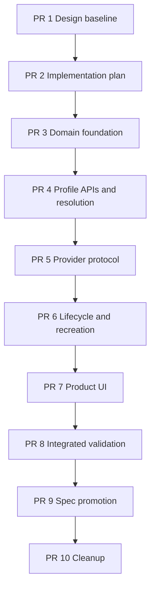

# Workspace-Owned Runtime Profiles Implementation Plan

## Feature Summary

This plan delivers `runtime-260730` as a sequential stacked-PR cutover from global execution
Profiles and restrictive Workspace/Agent overlays to Workspace-owned Runtime Profiles bound to
Provider-owned infrastructure Profiles.

The delivery removes Provider capability acceptance, introduces typed Pod and Container Profiles,
adds authoritative desired-configuration reconciliation, preserves separate applied Runtime
evidence, adds scoped durable recreation operations, replaces Agent Provider and restriction
settings with one Runtime Profile selection, migrates legacy effective configurations, and updates
Admin Web, main Web, Provider implementations, E2E fixtures, and living specs.

## Authoritative Inputs

- Requirements: `docs/azents/requirements/runtime-260730-workspace-owned-runtime-profiles.md`
  (`runtime-260730/REQ`)
- ADR: `docs/azents/adr/runtime-260730-workspace-owned-runtime-profiles.md`
  (`runtime-260730/ADR`)
- Design: `docs/azents/design/runtime-260730-workspace-owned-runtime-profiles.md`
  (`runtime-260730/DESIGN`)
- Current behavior:
  - `docs/azents/spec/domain/runtime-provider.md`
  - `docs/azents/spec/flow/agent-runtime-control.md`
  - `docs/azents/spec/flow/agent-runtime-persistence.md`

The accepted ADR is immutable after baseline review. Current specs are promoted only after matching
implementation and validation exist.

## Delivery Shape

The feature changes database ownership, Provider Control protocol, two Provider implementations,
Admin and Public APIs, generated clients, two frontends, runtime lifecycle, durable workers,
migration, fixtures, and E2E. These boundaries are sequential and independently reviewable, so the
delivery uses stacked PRs.

Stack prefix: `Runtime profiles`

| Order | PR | Branch | Deliverable | Base |
| --- | --- | --- | --- | --- |
| 1 | Design baseline | `feature/runtime-profiles-01-design-baseline` | Approved Requirements, ADR, and Design | `main` |
| 2 | Implementation plan | `feature/runtime-profiles-02-implementation-plan` | This plan, phase boundaries, validation, and ownership | PR 1 |
| 3 | Phase 1 — Domain foundation | `feature/runtime-profiles-03-domain-foundation` | Capability cutover, typed contracts, schema, repositories, migration scaffolding | PR 2 |
| 4 | Phase 2 — Profile APIs and resolution | `feature/runtime-profiles-04-profile-resolution` | Infrastructure and Workspace Profiles, Agent selection, desired reconciliation | PR 3 |
| 5 | Phase 3 — Provider protocol and implementations | `feature/runtime-profiles-05-provider-protocol` | Protobuf envelope, Kubernetes and Docker lowering, evidence | PR 4 |
| 6 | Phase 4 — Lifecycle and recreation | `feature/runtime-profiles-06-lifecycle-recreation` | command guards, applied promotion, durable scoped recreation | PR 5 |
| 7 | Phase 5 — Product UI | `feature/runtime-profiles-07-product-ui` | Admin, Workspace, Agent, status, generated client integration | PR 6 |
| 8 | Integrated validation | `feature/runtime-profiles-08-validation` | E2E/testenv evidence, migration validation, discovered fixes | PR 7 |
| 9 | Spec promotion | `feature/runtime-profiles-09-spec-promotion` | living specs and implementation marking | PR 8 |
| 10 | Cleanup | `feature/runtime-profiles-10-cleanup` | remove implementation and phase plans, obsolete temporary artifacts | PR 9 |

Create each PR before waiting on its CI. Monitor the full stack only after all planned PRs exist. No
PR is merged without explicit requester approval for that merge.

## Delivery Roles and Review

| Role | Assigned owner | Responsibility |
| --- | --- | --- |
| Primary orchestrator and implementation owner | `/root` | Phase plans, backend, providers, clients, frontend, testenv, integration, branches, PRs, CI |
| Independent reviewer | `hardtack` | GitHub review of every PR, with security/data-loss and contract boundaries highlighted |

No agent-team delegation was requested. `/root` remains the sole implementation owner and records a
context checkpoint in every phase plan and PR. `hardtack` is requested on every PR and remains the
stable independent reviewer.

## Stable Interfaces Across the Stack

The following interfaces are fixed by the ADR and Design and may change only by returning to
`feature-design`:

- Workspace Runtime Profiles are Workspace-owned complete Agent choices.
- Platform infrastructure Profiles are owned by one exact Provider.
- Agent infrastructure overrides and independent Provider preference do not survive the cutover.
- authenticated valid capability advertisement is immediately authoritative.
- capability history cannot be pinned or accepted by Admin.
- Profile contracts use compatibility-bound versions and additive typed modules.
- current desired configuration is authoritative; physical applied state may lag.
- capability/Profile loss preserves references and running incarnations but blocks new ones.
- Kubernetes Workspace PVC lifecycle is unchanged.
- Provider hard network boundary cannot be weakened by Pod or Workspace policy.
- Docker uses the same lifecycle and authority model without false Kubernetes parity.

## Workstream and Path Ownership

The exact phase plan narrows these paths before implementation begins.

### Backend domain and persistence

- `python/apps/azents/src/azents/core/runtime_*`
- `python/apps/azents/src/azents/rdb/models/runtime_*`
- `python/apps/azents/src/azents/repos/runtime_*`
- `python/apps/azents/src/azents/services/runtime_*`
- `python/apps/azents/src/azents/services/agent/**`
- `python/apps/azents/db-schemas/rdb/**`

Migrations are generated with Alembic and the schema revision pointer is advanced. Executed
migrations are never modified.

### API and generated clients

- `python/apps/azents/src/azents/api/admin/runtime_*`
- `python/apps/azents/src/azents/api/public/runtime_*`
- Agent API schemas and services touched by `runtime_profile_id`
- generated Admin and Public OpenAPI specifications and clients

OpenAPI clients are regenerated through the repository skill and never edited manually.

### Provider protocol and implementations

- `proto/azents/runtime_control/v1/runtime_provider_control.proto`
- `python/libs/azents-runtime-control/**`
- `python/apps/azents-runtime-provider-kubernetes/**`
- `python/apps/azents-runtime-provider-docker/**`

### Frontend

- `typescript/apps/azents-admin-web/src/features/runtime-providers/**`
- `typescript/apps/azents-admin-web/src/features/runtime-execution/**`
- `typescript/apps/azents-web/src/features/runtime-execution/**`
- Agent form and settings integrations
- corresponding tRPC routers, messages, stories, and tests

### Testenv and E2E

- `testenv/azents/e2e/**` Runtime Provider, Runtime execution, Admin, Workspace, Agent, and PVC fixtures
- Docker and Kubernetes prerequisite definitions needed by the planned journeys

### Shared integration ownership

`/root` owns documents, phase plans, generated-artifact integration, shared enums, migration ordering,
current-spec promotion, PR metadata, and cross-phase conflict resolution.

## Dependency Map

Later work may be researched while an earlier PR is active, but no later-phase implementation is
committed before its base PR and mandatory phase plan exist.

## Phase 1 — Domain Foundation

### Deliverables

- Replace current/accepted Provider contract state with one current capability revision and audit
  history.
- Remove Admin acceptance service/API behavior and readiness dependence.
- Mechanically align the existing Admin capability view, generated clients, and Provider E2E
  provisioning fixture with direct current-advertisement authority.
- Define typed capability, Kubernetes Pod Profile, Docker Container Profile, Workspace network
  restriction, compatibility, and configuration revision domain models.
- Add infrastructure Profile, Workspace Runtime Profile, reconciliation task, Runtime configuration
  revision, and recreation operation schema foundations.
- Add repositories with ownership, version, digest, compatibility, impact, and `SKIP LOCKED` claim
  behavior.
- Add migration scaffolding and deterministic legacy effective-policy conversion helpers without
  enabling the final cutover yet.

### Integration boundaries

- Existing Runtime selection and Provider command paths remain operational until later phases.
- New tables and types may coexist temporarily, but no permanent legacy fallback is introduced.
- Provider capability registration continues through the current protocol payload shape in this
  phase.

### Validation

- backend focused unit and repository tests;
- migration upgrade/downgrade and schema invariant tests;
- contract canonicalization and additive compatibility tests;
- OpenAPI/client generation and targeted Admin Web type/component tests;
- backend Ruff, Pyright, and focused Pytest.

## Phase 2 — Profile APIs and Resolution

### Deliverables

- Admin Provider-scoped Pod and Container Profile services and APIs.
- Public Workspace Runtime Profile CRUD, default, availability, and impact APIs.
- Agent create/update and responses use nullable `runtime_profile_id`.
- Remove Agent resource/network/Docker restriction mutations and independent Provider preference
  from active product paths.
- Deterministic exact-reference resolution creates ready or blocked immutable desired Runtime
  configuration revisions.
- PostgreSQL reconciliation tasks fan out Provider, infrastructure Profile, Workspace Profile, and
  Agent changes with optimistic stale-task fencing.
- Complete the one-way data conversion and switch backend reads to the new model.
- Regenerate OpenAPI specifications and Python/TypeScript clients.

### Integration boundaries

- Provider lifecycle commands may still receive a compatibility adapter from the new resolved
  configuration into the old command document until PR 5 replaces the protocol.
- Legacy tables become read-disabled after migration and are removed only when no code references
  remain.

### Validation

- authorization, optimistic concurrency, ownership, compatibility, and blocked-state tests;
- Agent creation-time default and missing-Profile tests;
- reconciliation retry and stale-fence tests;
- migration equivalence fixtures;
- OpenAPI dump and generated client checks;
- backend quality checks.

## Phase 3 — Provider Protocol and Implementations

### Deliverables

- Replace accepted-contract protocol assumptions with current capability advertisement.
- Add the full Runtime configuration envelope and exact evidence fields to protobuf and shared
  control library.
- Kubernetes Provider receives Pod Profile values per command and lowers them into existing Pod,
  PVC, and NetworkPolicy resources.
- Keep images, credentials, security implementation, mandatory communication, and hard network cap
  Provider-global.
- Preserve PVC non-shrink, reset, and terminal-delete behavior.
- Docker Provider receives enforceable Container Profile values without claiming unsupported quota,
  DinD, or NetworkPolicy controls.
- Provider and Runner reject stale revision, digest, and generation evidence.

### Integration boundaries

- This is an unreleased protocol cutover; no dual parser or compatibility fallback is retained.
- Every lowerer and Provider test is updated in the same PR.

### Validation

- protobuf generation and round-trip tests;
- shared runtime-control library quality checks;
- Kubernetes Pod/PVC/NetworkPolicy rendering, lifecycle, and evidence tests;
- Docker lowering and unsupported-capability tests;
- backend integration tests using the new command envelope.

## Phase 4 — Runtime Lifecycle and Scoped Recreation

### Deliverables

- Create/start/restart/reset/recreate lock and require the latest ready desired revision.
- Stop and terminal delete remain available for blocked configuration.
- In-place modules and recreated modules advance applied evidence only after exact Provider and Runner
  acknowledgement.
- Add durable Provider, infrastructure Profile, and Workspace Runtime Profile recreation operations
  with stable item sets, bounded concurrency, retries, progress, and failure details.
- Preserve Workspace PVC data during ordinary and bulk recreation.
- Expose operation APIs and status projections.

### Validation

- generation fencing, idempotency, blocked command, and stale evidence tests;
- `SKIP LOCKED` concurrency tests;
- partial failure, retry, superseded desired revision, and cancellation-boundary tests;
- PVC preservation integration coverage;
- backend quality checks.

## Phase 5 — Product UI

### Deliverables

- Admin capability surface adds Profile compatibility and impact workflows to the current
  revision/history view.
- Admin Pod and Container Profile management uses typed forms and compatibility status.
- Workspace Runtime Profile catalog supports exact infrastructure selection, network restrictions,
  default, lifecycle, availability, and scoped recreation.
- Agent Runtime settings become one Profile selector and clear missing/blocked states.
- Runtime status shows desired, applied, waiting-for-recreation, and operation progress.
- Remove legacy global Profile, Workspace restriction, Agent restriction, Provider picker, and Apply
  UI.
- Add localized messages, Storybook states, and responsive behavior.

### Validation

- TypeScript format, lint, typecheck, and build;
- container and component tests;
- Storybook coverage for active, unavailable, blocked, waiting, no-Profile, progress, and partial
  failure states;
- generated-client integration checks;
- browser-facing deterministic E2E prerequisites.

## Integrated Validation

### Required evidence

| Scenario | Primary evidence | Supporting evidence |
| --- | --- | --- |
| Pod Profile creation and compatibility | Admin E2E | API/service and typed contract tests |
| Workspace Profile creation and default | Workspace E2E | ownership and concurrency tests |
| Agent missing selection | Agent E2E | create/update service tests |
| Agent exact selection and binding | Runtime E2E | resolver and binding repository tests |
| authoritative desired propagation | Runtime E2E | reconciliation task tests |
| network narrowing without Apply | Kubernetes E2E | network composition tests |
| PVC-preserving bulk recreation | Kubernetes E2E | Provider lifecycle tests |
| capability loss and restoration | Provider fake/live E2E | compatibility and command guard tests |
| DinD resources and storage | Kubernetes E2E | rendered Pod tests |
| Docker Profile | Docker E2E when prerequisite enabled | Docker lowering tests |
| migration equivalence | migration integration suite | resolver fixtures |
| partial bulk failure and retry | operation E2E | worker concurrency tests |

### Validation commands

- Python Ruff, Pyright, and relevant/full Pytest for every touched project.
- protobuf and generated-runtime-control checks.
- OpenAPI dump and client regeneration checks.
- TypeScript format, lint, typecheck, and build.
- deterministic testenv E2E for Kubernetes, Workspace, Agent, Provider capability, and bulk
  recreation.
- optional Docker E2E only when the job explicitly omits the Docker Provider prerequisite;
  otherwise missing prerequisite is a failure.

The validation PR records commands, environment, prerequisite snapshots, results, screenshots or
resource evidence where useful, failures found, fixes, and a strict implementation-versus-spec gap
table.

## Fixture and Prerequisite Requirements

- one authenticated connected Kubernetes Provider whose capability advertisement can be changed by
  the deterministic fixture;
- at least two Pod Profiles, including Runner-only and DinD;
- one optional Docker Provider and Container Profile;
- a Workspace Manager and Agents in configured, unconfigured, running, stopped, blocked, and
  waiting-for-recreation states;
- PVC seed and readback helpers;
- Provider resource inspection for Pod, PVC, NetworkPolicy, and configuration evidence;
- a recreation worker failure injection for one item in a multi-Runtime operation;
- migration fixtures containing multiple global Profiles, Workspace and Agent restrictions, and
  Provider preferences.

E2E state is created through product APIs or documented fixture prerequisites, not by test-only
mutation of product tables after the journey begins.

## Security, Data, and Rollout Constraints

- PostgreSQL is authoritative; Redis is optional and never required for reconciliation or operation
  correctness.
- Provider authentication completes before capability advertisement changes current state.
- Required capabilities are derived server-side from typed specs.
- Workspace policy cannot remove mandatory Runtime Control communication or widen Platform network
  boundaries.
- no raw PodSpec, Docker options, host mounts, security context, image, or credential input is
  accepted from Profile APIs.
- migration does not shrink or replace existing Workspace PVCs.
- legacy policy parsing is removed after one-way migration; no fallback remains.
- logs and audit metadata contain no secret plaintext.
- live infrastructure changes, deployment, and PR merge require explicit requester approval.

## Spec Impact

Candidates for promotion after validation:

- `docs/azents/spec/domain/runtime-provider.md`
- `docs/azents/spec/flow/agent-runtime-control.md`
- `docs/azents/spec/flow/agent-runtime-persistence.md`
- Agent and Workspace domain specs if their stored selection contract changes are covered there
- E2E strategy spec when new prerequisite or evidence rules are introduced

Requirements and Design receive one `implemented` date only after all mandatory implementation and
validation evidence is complete. The ADR remains unchanged.

## Context Checkpoints

Every phase execution plan records:

- completed user-visible behavior;
- changed schemas, APIs, protocol, and generated artifacts;
- validation evidence;
- remaining scope and non-goals;
- relevant paths;
- failed approaches or repeated errors;
- migration and stack-rebase risk; and
- whether `/root` context remains compact enough to continue.

If a new user-visible scope, ownership boundary, security contract, persistence behavior, or
mutually exclusive architecture path appears, stop implementation and return to
`runtime-260730/REQ` and ADR rather than silently changing this plan.

## Known Risks and Blockers

- Migration can generate many deduplicated infrastructure and Workspace Profiles; fixtures must
  bound and measure this fan-out.
- Protocol cutover touches all Provider and shared-control consumers and must remain atomic within
  its PR.
- desired reconciliation must not overwrite a newer source mutation or Runtime generation.
- Docker exposes fewer enforceable controls than Kubernetes and must not report false parity.
- Admin and Public generated clients must stay synchronized with backend route changes.
- E2E Kubernetes prerequisite setup may be the longest validation lane.

No confirmed product blocker remains. Missing implementation evidence or a discovered contradictory
security/persistence boundary returns the work to feature design.

## Completion Gate

The feature is complete only when:

- every implementation phase has a stored and reported Phase Execution Plan;
- every phase PR has focused validation and requested independent review from `hardtack`;
- integrated E2E and migration evidence pass;
- living specs match implemented behavior;
- Requirements and Design are marked implemented with the same verified date;
- implementation and phase plans are removed in cleanup;
- all stacked PR required CI checks are green; and
- no PR is merged without explicit requester approval.
