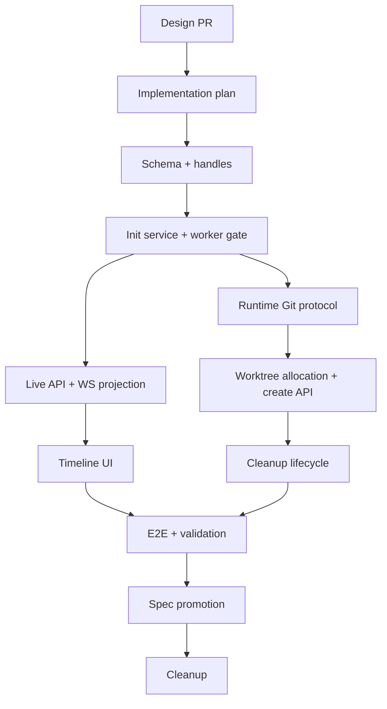

# Session Worktree Initialization Implementation Plan

## Feature Summary

This plan ships the approved session initialization and Git worktree lifecycle designs as a stacked PR series.

Design and ADR inputs:

- [Session Initialization Steps](../design/session-initialization-steps.md)
- [Session Git Worktree Lifecycle](../design/session-git-worktree-lifecycle.md)
- [ADR-0091: Session Initialization Lifecycle](../adr/0091-session-initialization-lifecycle.md)
- [ADR-0092: Azents-Owned Git Worktree Ownership and Cleanup](../adr/0092-azents-owned-git-worktree-ownership-and-cleanup.md)
- [Session Git Worktree Lifecycle Research](../notes/session-git-worktree-lifecycle-research.md)

The implementation introduces a durable per-session initialization lifecycle, gates first-run dispatch until initialization is ready, adds human-readable session handles, adds typed runner Git operations, creates Azents-owned branch-backed session worktrees, registers ready worktrees as session Projects, and cleans them up asynchronously after archive/delete.

## Non-Goals and Boundaries

- Do not convert `session_workspace_projects` into a Git ownership model.
- Do not make worktree setup an agent tool call.
- Do not update Project presets/defaults for worktree-created Projects.
- Do not add `/workspace/agent/.azents/**` user registration rejection in the MVP.
- Do not block archive HTTP requests on Git cleanup.
- Do not add custom runtime image wrapper scripts for Git behavior.
- Do not implement a general user-defined workflow engine.

## Stack Prefix

`Session Worktree Initialization`

## Planned PR Stack

| Order | PR title | Scope |
| --- | --- | --- |
| 1 | `Session Worktree Initialization [1/12]: Design` | ADRs, design docs, research note, docs index. |
| 2 | `Session Worktree Initialization [2/12]: Implementation plan` | This multi-phase plan and stack/validation matrix. |
| 3 | `Session Worktree Initialization [3/12]: Session handles and initialization schema` | DB enums/tables for initialization, initialization steps/events, session handle column/backfill, BIP-39 wordlist snapshot, repositories, migration. |
| 4 | `Session Worktree Initialization [4/12]: Initialization service and worker gate` | Step discovery for no-op initialization, creation path integration, worker pre-`RunExecutor` gate, retry intent path skeleton, backend unit tests. |
| 5 | `Session Worktree Initialization [5/12]: Initialization live API and WebSocket projection` | REST live/write snapshot schemas, detail endpoint, initialization WS actions, OpenAPI/client regeneration, frontend wire types/reducer support without full UI polish. |
| 6 | `Session Worktree Initialization [6/12]: Initialization timeline UI` | Compact `Preparing session` card, expanded details panel, retry/delete/cleanup action surface, Storybook/static states, frontend tests. |
| 7 | `Session Worktree Initialization [7/12]: Runtime Git operation protocol` | Proto/control/client/server/runner operation additions for `list_git_refs`, `create_git_worktree`, `remove_git_worktree`, `delete_git_branch`, semantic result/error mapping, unit tests. |
| 8 | `Session Worktree Initialization [8/12]: Worktree allocation and session creation API` | `session_git_worktrees`, worktree mode request/response, Git ref preview API, allocation service, Project/catalog registration success path, OpenAPI/client regeneration. |
| 9 | `Session Worktree Initialization [9/12]: Worktree cleanup lifecycle` | Archive/delete cleanup pending state, background cleanup worker, manual cleanup retry action, catalog deletion, cleanup failure projection, backend tests. |
| 10 | `Session Worktree Initialization [10/12]: E2E fixtures and validation` | Deterministic initialization fixtures, Git repository fixtures, E2E scenarios, evidence capture, fixes found by validation. |
| 11 | `Session Worktree Initialization [11/12]: Spec promotion` | `/spec-review`, update current specs, mark designs implemented only after verification, document shipped behavior and drift fixes. |
| 12 | `Session Worktree Initialization [12/12]: Cleanup` | Remove this temporary plan and stale planning references after specs are current. |

## Phase Dependencies



## Data/API/Runtime Changes by Phase

### Phase 1 — Design

- Adds design/ADR/research artifacts only.
- No product behavior changes.

### Phase 2 — Implementation plan

- Adds this temporary plan only.
- No product behavior changes.

### Phase 3 — Session handles and initialization schema

Data changes:

- Add `agent_sessions.handle` with global uniqueness and backfill.
- Vendor BIP-39 English wordlist snapshot used by session handle generation.
- Add initialization status/step/event PostgreSQL enum types.
- Add `session_initializations`, `session_initialization_steps`, and `session_initialization_events`.
- Add repositories/data models for initialization lifecycle.

API/runtime behavior:

- No external API behavior change yet, except internal persistence availability.

Tests:

- Migration tests for handle backfill/uniqueness.
- Repository tests for initialization rows, step ordering, event sequence.
- Handle generator tests with unique retry path.

### Phase 4 — Initialization service and worker gate

Data/API/runtime behavior:

- Create ready initialization rows for ordinary sessions.
- Create pending/running initialization rows for sessions with future blocking steps.
- Add no-op step discovery.
- Add pre-run initialization gate before `RunExecutor.execute()` promotes input buffers.
- Add retry intent/reset service skeleton and same-session broker wake-up path.

Tests:

- New ordinary sessions still run normally.
- Pending/failed initialization leaves input buffers pending and creates no `agent_runs` row.
- Retry request records intent and wakes the session runner.
- Missing initialization after rollout is an invariant failure, not a silent bypass.

### Phase 5 — Initialization live API and WebSocket projection

API/runtime behavior:

- Add `/live.initialization` projection.
- Add initialization detail endpoint for durable steps/events.
- Add `session_initialization_updated` and `session_initialization_event_appended` WebSocket actions.
- Add REST write snapshot initialization field.
- Regenerate OpenAPI and public clients.

Tests:

- REST live snapshot includes initialization projection.
- Write response snapshot includes initialization state.
- WS update/action serialization tests.
- Reconnect baseline restores compact projection and detail events from durable tables.

### Phase 6 — Initialization timeline UI

Frontend behavior:

- Render pending first input and compact `Preparing session` initialization card.
- Render expanded detail panel with step attempts, command argv, stdout/stderr, exit code, semantic failure code, and failure summary.
- Render retry/delete/cleanup/manual guidance actions by allowed state.
- Keep initialization out of durable transcript rendering/model history semantics.

Tests:

- Component tests and Storybook states for pending, running, ready, blocking failure, non-blocking warning, cleanup required, cleanup failed.
- Container reducer tests for `/live` baseline and WS event replay.

### Phase 7 — Runtime Git operation protocol

Runtime changes:

- Add typed protocol payloads/results for:
  - `list_git_refs`
  - `create_git_worktree`
  - `remove_git_worktree`
  - `delete_git_branch`
- Add generated proto bindings and conversion code.
- Add backend operation-client methods.
- Add runner argv-based Git implementation and semantic failure mapping.
- Add stdout/stderr streaming callback support for initialization event append.

Tests:

- Proto conversion round trips.
- Runner operation success/failure tests with temporary Git repositories.
- Semantic failures: not Git repo, invalid ref, branch exists, worktree path exists, Git command failed.
- Cancellation/timeout behavior.

### Phase 8 — Worktree allocation and session creation API

Data/API/runtime behavior:

- Add `session_git_worktrees` model/repository/service.
- Add worktree mode to new-session create/first-message APIs.
- Add Git ref preview API backed by `list_git_refs`.
- Allocate worktree path/branch from `agent_sessions.handle` and repo leaf.
- Run `create_git_worktree` as a blocking initialization step.
- On success, create `session_workspace_projects` row and upsert `agent_project_catalog` without updating presets/defaults.
- Request non-blocking catalog status refresh.
- Regenerate OpenAPI and public clients.

Tests:

- Valid worktree session creates allocation, initialization steps, Project registration, catalog entry, and first run starts only after ready.
- Invalid ref blocks first run and keeps input buffer pending.
- Branch/path collision suffixing records exact final names.
- Catalog upsert failure blocks initialization; status refresh warning does not.

### Phase 9 — Worktree cleanup lifecycle

Data/API/runtime behavior:

- Archive marks worktree allocations `cleanup_pending`, soft-archives session, and enqueues cleanup.
- Background cleanup validates ownership, removes worktree, deletes branch, deletes catalog entry, and marks `cleaned`.
- Cleanup failure marks `cleanup_failed` and stores user-safe summary.
- Manual cleanup action re-enqueues the same worker after ownership revalidation.
- Hard delete preserves ownership metadata until cleanup reaches `cleaned` or `cleanup_failed`.

Tests:

- Archive returns before Git cleanup completes.
- Clean/dirty worktree cleanup succeeds.
- Cleanup failure does not unarchive or fail archive.
- Manual cleanup retry succeeds after a prior failure.
- Cleanup never deletes paths without matching ownership row.

### Phase 10 — E2E fixtures and validation

E2E/testenv behavior:

- Add deterministic initialization test provider for slow success/failure/non-blocking warning.
- Add Git repository fixture helpers with known commits, branches, tags, collisions, dirty worktree state, and cleanup failure injection.
- Run planned E2E matrix and record evidence.
- Fix discovered issues in this validation PR or responsible earlier phase.

### Phase 11 — Spec promotion

Documentation behavior:

- Run `/spec-review`.
- Update current specs under `docs/azents/spec/` for shipped behavior.
- Mark design documents implemented only after implementation and validation are complete.
- Keep ADRs immutable after adoption/implementation.

### Phase 12 — Cleanup

Documentation behavior:

- Remove this temporary plan after specs are current and the feature is fully implemented.
- No behavior changes.

## E2E Primary Validation Matrix

| Scenario | Expected result | Primary phase |
| --- | --- | --- |
| Ordinary session without setup | First message appears and first run starts normally | 4/10 |
| Slow blocking initialization | Pending input remains visible, initialization card streams progress, no run starts before ready | 5/6/10 |
| Blocking initialization failure | No `agent_runs` row, input remains pending, retry/delete/manual guidance visible | 4/6/10 |
| Retry after failure | Failed/downstream steps rerun, prior attempt logs remain, first run starts after success | 4/6/10 |
| Non-blocking warning | Warning visible, initialization becomes ready, first run starts | 5/6/10 |
| Reconnect during initialization | `/live` and detail endpoint restore card/logs; buffered WS replay dedupes by event id | 5/6/10 |
| Git ref discovery | Source Project selection loads default branch/branches/tags from typed runner operation | 7/8/10 |
| Valid worktree session | Worktree is created, Project/catalog registered, first run starts in created worktree | 8/10 |
| Invalid starting ref | Git setup fails with stderr/semantic error, run remains gated | 8/10 |
| Branch collision | Suffixed branch name is selected and persisted | 8/10 |
| Repo leaf path collision | Suffixed repo leaf path is selected under same session handle directory | 8/10 |
| Archive clean worktree | Archive returns quickly; background cleanup removes worktree/branch/catalog | 9/10 |
| Archive dirty worktree | Force removal succeeds for owned worktree; unrelated paths untouched | 9/10 |
| Archive cleanup failure | Archive remains successful; worktree is `cleanup_failed`; manual retry is available | 9/10 |
| Manual cleanup retry | Same cleanup worker reruns and marks `cleaned` after issue resolves | 9/10 |

## Fixture and Prerequisite Requirements

Required deterministic fixtures:

- Test-only initialization step provider with modes:
  - no steps
  - slow blocking success
  - blocking failure then success
  - non-blocking warning
  - streamed stdout/stderr
- Temporary Git repository fixture under Agent Workspace with:
  - known commits
  - default branch
  - extra local branch
  - tag
  - invalid ref case
  - existing branch collision
  - worktree path collision
  - dirty worktree state
  - cleanup failure injection

Credential/prerequisite snapshot:

- Record Git version, fixture repository path, selected starting ref, resolved commit, runtime provider mode, and fixture mode.
- Do not record provider credentials, runtime-control tokens, Git credentials, or token maps.

CI policy:

- Deterministic initialization and Git fixture E2E run in required CI once the feature flag is enabled.
- Provider-specific live tests may remain optional/nightly until stable.
- Missing Git binary in required deterministic CI is a failure once worktree mode is enabled.

## Spec Impact Candidates

Likely specs to update in Phase 11:

- `docs/azents/spec/domain/conversation.md`
  - `agent_sessions.handle`
  - `SessionInitialization` lifecycle
  - run dispatch gate
  - title generation timing for initialization
  - archive/delete cleanup behavior
- `docs/azents/spec/domain/workspace.md`
  - worktree-created Project registration
  - catalog update without presets/defaults
  - Project Browser worktree projection
  - Git ref preview contract
- `docs/azents/spec/flow/chat-session-resync.md`
  - `/live.initialization`
  - initialization WebSocket actions
  - reconnect/detail recovery behavior
- `docs/azents/spec/flow/agent-execution-loop.md`
  - worker gate before input promotion
  - retry and run dispatch sequencing
- `docs/azents/spec/flow/run-resume.md`
  - session ownership and initialization retry/wake-up behavior
- `docs/azents/spec/flow/agent-runtime-control.md`
  - typed Git runner operations and semantic errors
- `docs/azents/spec/flow/test-strategy-e2e-primary.md`
  - deterministic fixture/E2E requirements if needed

## Rollout Notes

- Introduce schema and ordinary ready initialization first, before enabling blocking worktree setup.
- Keep worktree mode behind a feature flag until deterministic E2E passes.
- Keep ordinary session creation behavior-preserving throughout early phases.
- Enable worktree mode only after runner Git operations, live UI, and cleanup path are all present.
- Keep hard delete conservative until cleanup metadata retention is implemented.

## Known Blockers and External Actions

- Implementation phases require explicit approval before code changes beyond design/plan PRs.
- BIP-39 English wordlist snapshot must be vendored from `bitcoin/bips` during Phase 3.
- Runtime-control generated protobuf/client artifacts must be regenerated during Phase 7.
- Public API clients must be regenerated in phases that change OpenAPI schemas/routes.
- E2E CI must have Git available before deterministic worktree tests become required.

## Validation Commands by Phase

Documentation phases:

```console
python scripts/gen_docs_index.py --docs-root docs/azents --project-name azents --check
```

Backend phases:

```console
cd python/apps/azents
uv run ruff check --fix .
uv run ruff format .
uv run pyright
uv run pytest
```

Runtime runner/control phases:

```console
cd python/apps/azents-runtime-runner
uv run ruff check --fix .
uv run ruff format .
uv run pyright
uv run pytest

cd ../../libs/azents-runtime-control
uv run ruff check --fix .
uv run ruff format .
uv run pyright
uv run pytest
```

Frontend phases:

```console
cd typescript
pnpm run format
pnpm run lint --filter=@azents/web
pnpm run typecheck --filter=@azents/web
pnpm run build --filter=@azents/web
```

E2E validation phase:

```console
cd testenv/azents/e2e
uv run pytest ./src
```
