# Team Session Execution Boundaries Implementation Plan

- Requirements: [session-260724/REQ](../requirements/session-260724-team-session-execution-boundaries.md)
- ADR: [session-260724/ADR](../adr/session-260724-team-session-execution-boundaries.md)
- Design: [session-260724/DESIGN](../design/session-260724-team-session-execution-boundaries.md)
- Stack prefix: `Team Session execution boundaries`

## Feature Summary

Implement Team Session execution with no ambient User identity. Public request authorization,
per-input Human sender provenance, internal Session/workload authority, resource ownership, and
future User Session capabilities remain separate. Broker signals become routing-only, execution
facts come from canonical durable state, Team capabilities resolve without a User, and accepted or
generated resources use Session/Run lineage.

The implementation is delivered as stacked PRs because it spans public admission, event schemas,
broker contracts, Worker execution, Engine and Toolkit contexts, file-resource persistence,
provider output, generated API clients, frontend projection, migration, recovery, and E2E validation.
Behavior-changing runtime phases are reviewed separately but must be released through the coordinated
cutover defined by `session-260724/ADR-D7`; no mixed old/new Worker population is supported.

## Delivery Stack

| Order | Branch | Base | PR scope | Primary gate |
| --- | --- | --- | --- | --- |
| 1/10 | `design/userless-session-authorization` | `main` | Approved Requirements, ADR, Design, and supporting audit | Documentation validation |
| 2/10 | `plan/userless-session-authorization` | PR 1 | This implementation plan | Documentation validation |
| 3/10 | `feature/team-session-admission-provenance` | PR 2 | Durable request idempotency, transactional requester admission, sender persistence, public projections, generated clients, and sender UI | Backend unit/integration, API generation, TypeScript checks |
| 4/10 | `feature/team-session-canonical-execution` | PR 3 | Routing-only broker messages, canonical execution snapshot, owner-generation-first loading, Worker/RunExecutor boundary | Broker/Worker/recovery tests and Python quality checks |
| 5/10 | `feature/team-session-userless-engine` | PR 4 | Remove generic User contexts, stable Team Toolkit lifecycle, Agent-only Memory projection, subagent/continuation cleanup | Engine/Toolkit/Memory tests and Python quality checks |
| 6/10 | `feature/team-session-resource-authority` | PR 5 | Exchange provenance, ModelFile Run lineage, Userless Artifact/import/present/read/provider output, public/internal authorization separation | Migration, resource lifecycle, provider output, Runtime Provider tests |
| 7/10 | `feature/team-session-cutover-replay` | PR 6 | Deterministic data backfill, Postgres-derived replay/preflight tooling, old broker rejection, coordinated cutover operational evidence | Migration upgrade tests, replay integration, invariant checks |
| 8/10 | `validate/team-session-execution-boundaries` | PR 7 | Deterministic E2E journeys, bounded Worker/broker fault controls, full validation report, and implementation/spec drift fixes | Required E2E lanes and complete quality matrix |
| 9/10 | `spec/team-session-execution-boundaries` | PR 8 | Living spec promotion and matching `implemented` dates after verified implementation | Spec review and docs validation |
| 10/10 | `cleanup/team-session-execution-boundaries` | PR 9 | Remove this stale implementation plan and temporary validation references | Documentation validation and final stack CI |

The complete stack is created before CI monitoring. PRs are not merged without explicit approval.
If stack history must be rewritten, only `--force-with-lease` is permitted.

## Cross-Phase Invariants

Every implementation phase must preserve these boundaries:

- A requester User is used only for the current public authorization or audit operation.
- `sender_user_id` describes one Human input and never grants execution, resource, credential, or
  personalization authority.
- No code infers a User from sender, Agent creator, Workspace owner, viewer, approver, attachment
  uploader, External Channel principal, recovery source, or fallback.
- Internal execution derives Agent, Workspace, Session tree, Run, owner generation, and work identity
  from durable canonical records.
- Generated clients are regenerated from OpenAPI; generated files are never edited manually.
- Executed migrations are never modified. Every schema change uses a newly generated Alembic
  revision and updates `db-schemas/rdb/revision`.
- Public resource access and internal execution resource access remain separate service boundaries.
- Runtime code relies on structured logging for Sentry delivery and does not call the Sentry SDK.
- No compatibility decoder, dual-write path, empty User, or nullable execution-User fallback remains
  in the final cutover branch.

## Phase Dependencies

```mermaid
flowchart LR
    D[Design baseline] --> P[Implementation plan]
    P --> A[Admission and sender provenance]
    A --> C[Canonical execution loading]
    C --> E[Userless Engine and Team capabilities]
    E --> R[Session resource authority]
    R --> M[Migration replay and cutover]
    M --> V[E2E and validation]
    V --> S[Spec promotion]
    S --> X[Cleanup]
```

- Phase 1 establishes durable sender and request identity before broker and execution identity are
  removed.
- Phase 2 makes Postgres-derived execution facts available before generic contexts are simplified.
- Phase 3 removes User from Engine and Toolkit contracts after the Worker has a canonical snapshot.
- Phase 4 replaces User-required file/output operations before the clean cutover is declared ready.
- Phase 5 completes deterministic migration and recovery from durable state after old broker payloads
  are discarded.
- Validation, spec promotion, and cleanup depend on all implementation phases.

## Phase 1 — Durable Admission and Sender Provenance

### Data changes

- Generate a forward migration that renames `input_buffers.actor_user_id` to `sender_user_id` and
  adds source-kind constraints for new Human message/action buffers.
- Add nullable historical `sender_user_id` to Human durable event payload schemas and preserve a
  non-null value for every new Human event.
- Add `sender_user_id` to `ActionExecution` so operation actions retain sender provenance after their
  source InputBuffer is deleted.
- Rename requester-audit fields such as `chat_write_requests.user_id`, pending command `user_id`, and
  stop requester metadata to explicit requester-oriented names.
- Extend `ChatWriteRequestType` for normal messages and TurnActions.

### Service and API changes

- Consolidate Human message and TurnAction writes behind one admission transaction that locks and
  revalidates Session, Agent, Workspace, root lineage, requester membership, idempotency, and
  referenced Exchange files.
- Store normal message and TurnAction idempotency in `chat_write_requests`.
- Resolve retries through the stable InputBuffer ID, deterministic event external IDs, and
  `ActionExecution.input_buffer_id` without recreating promoted work.
- Copy sender provenance into live InputBuffer, durable history, action, and fork projections.
- Expose sender data through public API schemas. Regenerate Python and TypeScript public clients.
- Update azents-web message projection to display a current profile when available and a bounded
  unavailable-sender state for historical null provenance. Do not infer a sender.

### Tests

- Admission authorization and rollback matrices, including membership changes inside the transaction.
- Concurrent idempotency, payload mismatch, post-promotion retry, and notification-failure behavior.
- Sender propagation across UserMessage, ActionMessage, ActionExecution, live, history, and fork.
- Migration tests for pending Human buffers and historical events with unavailable sender.
- OpenAPI regeneration checks and focused TypeScript format, lint, typecheck, and build.

## Phase 2 — Pure Broker and Canonical Execution Snapshot

### Runtime changes

- Reduce `SessionWakeUp` and `SessionStopSignal` to `session_id` routing identity.
- Remove Agent, User, Workspace, interface, handle, and transient prompt values from broker encoding,
  producers, Redis tests, testenv injection, and Worker handling.
- Claim Session owner generation before execution context construction.
- Add an immutable canonical execution snapshot that validates active Session, Agent, Workspace,
  SessionAgent tree/context, root lineage, execution mode, owner generation, and expected durable work.
- Make SessionRunner and RunExecutor consume the snapshot rather than independently resolving
  execution identity from broker fields.
- Keep mutable work operations responsible for short transaction re-lock and exact-row revalidation.

### Tests

- Pure broker round trips and rejection of rich/old payloads.
- Cross-Session, cross-Workspace, inactive, archived, stale-generation, broken-tree, and subagent
  lineage negative matrices.
- Worker takeover, pending command, recoverable Run, idle continuation, and FIFO-head drift.
- Verification that broker producers cannot override Agent or Workspace execution identity.

## Phase 3 — Userless Engine and Team Capability Projection

### Contract changes

- Remove `user_id` from `InputMessage`, `InvokeInput`, `RunContext`, `ToolkitContext`,
  `ResolveContext`, and `TurnContext`.
- Remove Team runtime `SessionType.USER/SYSTEM` classification and unused interface fields.
- Remove User-qualified Session Toolkit keys and make Toolkit lifecycle stable by source identity and
  revision.
- Remove subagent, recovery, continuation, scheduler, and fallback propagation of an execution User.

### Capability changes

- Project Workspace Toolkit configs, Agent attachments, Toolkit-level OAuth, Workspace LLM
  integrations, Runtime files, Agent Memory, Session/Goal/Todo/Skill/subagent/system capabilities,
  and durable External Channel capabilities without User identity.
- Register only Agent-scope Memory in Team execution. User-scope Memory remains available through
  authenticated management APIs but is not projected to Team Runs.
- Remove legacy MCP per-user OAuth and GitHub per-user PAT runtime fallback paths if any live residue
  remains.
- Keep management and OAuth operations requester-aware outside runtime resolution.

### Tests

- Type and constructor coverage proving generic execution contracts contain no User field.
- Same Toolkit instance and capability set across different Human senders, External Channel,
  recovery, continuation, and subagent paths.
- Agent Memory read/write availability and User Memory absence in Team Sessions.
- MCP, GitHub, Runtime, Tool Search, Goal/Todo/Skill, and subagent regression tests.

## Phase 4 — Session-Owned Resources and Output

### Data changes

- Generate ExchangeFile provenance schema with typed source kind and source-specific fields and
  constraints. Remove required `created_by_user_id` ownership semantics after deterministic backfill.
- Add exact `created_run_id` lineage to ModelFile and backfill from unique Session/run-index pairs.
- Preserve Artifact's existing Session/Run/Tool-call lineage.

### Service changes

- Introduce validated Session/Run resource authority for internal ExchangeFile, ModelFile, and
  Artifact operations.
- Separate requester-authorized public upload/view/download/delete methods from execution-authorized
  create/resolve/import/materialize methods.
- Convert `import_file`, `present_file`, `read_image`, MCP Artifact output, provider-hosted generated
  files, and client generated images to Session/Run authority.
- Preserve root retention for accepted input and generated Exchange output, exact Session ownership
  for ModelFile, and exact Run ownership for Artifact.
- Preserve output compensation and deterministic Run/call/output retry identities.
- Update archived-root purge and periodic file cleanup for new provenance and lineage fields.

### Tests

- Internal/public resource authorization matrices and cross-root rejection.
- Exchange source CHECK constraints and Human/Agent/Tool/provider/system/migration variants.
- ModelFile and Artifact Session/Run validation, recovery, compensation, GC, and purge.
- `present_file`, `import_file`, `read_image`, MCP output, provider image, and client image paths with
  no User context.
- Sender membership removal after attachment admission and later different-member continuation.

## Phase 5 — Migration Replay and Coordinated Cutover

### Migration and tooling

- Complete deterministic data classification for historical Human sender and Exchange source rows.
- Record unavailable historical provenance explicitly; never synthesize a User or Run.
- Add an idempotent cutover preflight/replay command that reads only durable Postgres Session,
  InputBuffer, pending command, Run, continuation, and stop state.
- Report migration classification counts, pending work counts, replay counts, and invariant failures
  without logging message/file contents or credentials.
- Re-enqueue only pure Session wake-ups after old Redis broker messages and ownership state are
  discarded.

### Operational boundary

- Document and verify admission pause, Worker/scheduler drain, database backup, old process stop,
  forward migration, new process deployment, Postgres replay, health checks, and admission resume.
- Rollback restores the pre-cutover database and previous images. Old application code never runs
  against newly written sender/provenance state.

### Tests

- Upgrade tests with pending buffers, promoted events, commands, recoverable Runs, root/subagent
  resources, provider output, previews, and ambiguous historical rows.
- Replay idempotency, bounded batching, stale state rejection, and repeated execution.
- Old broker payload rejection and Postgres-only work reconstruction.
- Restore rehearsal evidence for the forward-only operational path.

## E2E and Validation Phase

### Primary E2E matrix

| Scenario | Required evidence | Lane |
| --- | --- | --- |
| Two members send to one Team Session | Independent sender IDs with identical Team capabilities | Deterministic API/WS |
| Unauthorized or removed member writes/reads | No durable side effects or disclosure | Deterministic API |
| Sender removed after attachment admission | Accepted work executes; current member reads; removed member denied | Deterministic API/Worker |
| Worker restart before promotion | One promotion with retained attachment and no original sender context | Deterministic restart or Runtime Provider |
| Different member continues file-bearing history | Existing FilePart remains model-visible | Deterministic AIMock file |
| External Channel invocation | Provider principal executes with no Azents User | Deterministic Slack fake |
| Subagent delivery and recovery | SessionAgent/Run lineage works with no User | Deterministic E2E |
| Agent Memory versus User Memory | Agent scope available; User scope absent | Deterministic AIMock Tool |
| Present/import/read/MCP output | Session/Run-owned output survives recovery | Runtime Provider |
| Provider/client generated image | Exchange and ModelFile output succeeds once without User | Deterministic provider proxy |
| Public resource access | Current member allowed; non-member and stored source denied | Deterministic API |
| Broker notification failure | Accepted input executes once through retry/recovery | Deterministic fault injection |
| Cutover fixture | Pending work/resources migrate and replay through new contracts | Migration integration and smoke E2E |

### Fixture and prerequisite support

- Reuse local AIMock, object storage, Slack provider fake, and locally enrolled Docker Runtime Provider.
- Add a reusable two-User Team Session fixture through public/admin APIs.
- Add bounded Worker restart and one-shot post-commit broker failure controls. These controls may not
  mutate product rows directly.
- Use a pre-migration SQL fixture only in migration integration tests, never in product E2E journeys.
- The required matrix uses no external credentials. Missing deterministic fixture readiness fails CI.
- Optional/live provider coverage follows existing prerequisite snapshot and skip/fail policy.

### Validation report

The validation PR records exact commands, environment, results, E2E evidence, fixture readiness,
failures and fixes, migration classification counts, generated-client verification, and a strict
implemented-behavior versus current-spec comparison.

## Quality Gates by Phase

- Python changes: focused Ruff, Pyright, and pytest from `python/apps/azents`.
- Migration changes: generated revision verification, revision pointer, upgrade tests, and affected
  repository/service tests.
- OpenAPI changes: repository OpenAPI/client generator only, followed by generated-client tests.
- TypeScript changes: run format, lint, typecheck, and build sequentially from `typescript/`.
- Testenv changes: Pyright and focused pytest, then required deterministic E2E lanes.
- Documentation changes: snapshot/frontmatter validation, generated index validation, and relevant
  documentation tests.
- Final validation: all required GitHub CI checks on every PR in the complete stack.

## Blockers and External Actions

No implementation blocker is currently known.

The production cutover requires these external/manual actions, but they do not block code review or
CI:

- approved maintenance window;
- verified database backup and restore rehearsal;
- coordinated admission pause and Worker/scheduler drain;
- deployment of the complete behavior-changing stack without mixed old/new Workers; and
- explicit approval before merging any PR.

## Spec Impact Candidates

The spec-promotion PR updates and increments the applicable living specs:

- `docs/azents/spec/domain/conversation.md`
- `docs/azents/spec/flow/agent-execution-loop.md`
- `docs/azents/spec/flow/run-resume.md`
- `docs/azents/spec/flow/file-exchange-storage.md`
- `docs/azents/spec/domain/toolkit.md`
- `docs/azents/spec/domain/memory.md`
- `docs/azents/spec/domain/external-channel.md`
- `docs/azents/spec/flow/external-channel-authorization.md`
- `docs/azents/spec/flow/periodic-execution.md`

After complete validation, the Requirements and Design receive the same KST `implemented` date. The
accepted ADR remains append-only and immutable.

## Rollout and Cleanup

- Review and build the complete stack before monitoring CI, then fix CI from the responsible phase
  and rebase later branches with the repository stacked-PR workflow.
- Do not deploy partially migrated behavior. Release the behavior-changing phases through the
  coordinated cutover.
- Keep migration and replay telemetry content-free and bounded.
- After implementation, E2E validation, and spec promotion are complete, delete this implementation
  plan in the cleanup PR. Current specs, immutable snapshot documents, ADR decisions, and code become
  the source of truth.
