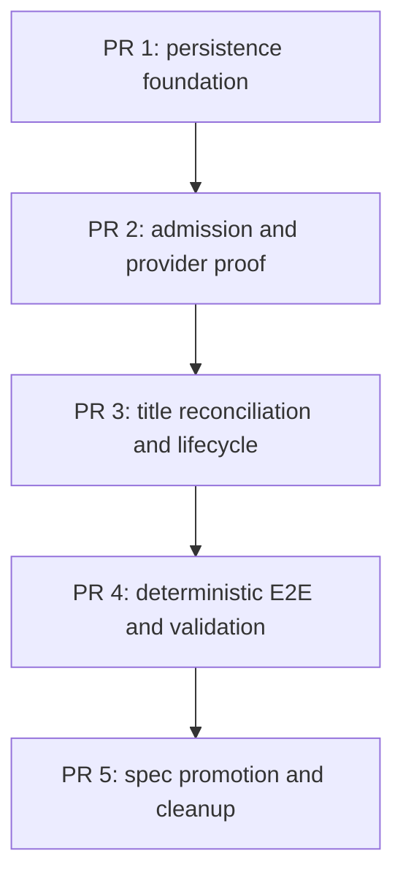

# External Channel Automatic Title Implementation Plan

## Authoritative Inputs

- Requirements:
  [`title-260802/REQ`](../requirements/title-260802-external-channel-automatic-title.md)
- ADR:
  [`title-260802/ADR`](../adr/title-260802-external-channel-automatic-title.md)
- Approved Design:
  [`title-260802/DESIGN`](../design/title-260802-external-channel-automatic-title.md)
  revision `5`
- Approved Design mechanisms: `M1`, `M2`, `M3`, `M4`, `M5`, `M6`, `M7`, `M8`
- Design delta: `None`
- Current behavior:
  - `docs/azents/spec/domain/external-channel.md`
  - `docs/azents/spec/flow/external-channel-provider-ingress.md`
  - `docs/azents/spec/flow/external-channel-delivery.md`
  - `docs/azents/spec/flow/external-channel-lifecycle.md`
  - `docs/azents/spec/flow/test-strategy-e2e-primary.md`

The confirmed Requirements, accepted ADR, and approved Design remain the product and
design authority. This plan only decomposes their implementation.

## Delivery Shape

The feature spans additive persistence, mailbox title assignment, Discord history and
delivery contracts, Worker reconciliation, lifecycle cleanup, and deterministic E2E.
Those boundaries have sequential interfaces and independent validation needs, so the
work uses five stacked PRs.

Stack prefix: `External Channel automatic titles`

| Order | PR | Deliverable | Depends on |
| --- | --- | --- | --- |
| 1 | Persistence foundation | Approved snapshot, generated migration, candidate/projection models and repositories, candidate-gated External Channel title-source support | `main` |
| 2 | Admission and provider proof | Exact-root observation, normal and Access-Allow artifact creation, direct/adopted provisioning proof, current Worker integration | PR 1 |
| 3 | Title reconciliation and lifecycle | Atomic final-title arming, Discord title GET/PATCH reconciliation, retry, takeover, archive/disconnect/decommission/purge behavior | PR 2 |
| 4 | Deterministic E2E and integrated validation | Discord fake proof fields and barriers, Slack/Discord journeys, mixed-version and lifecycle evidence, full validation | PR 3 |
| 5 | Spec promotion and cleanup | Living Specs, matching `implemented` dates, plan removal, final generated documentation indexes | PR 4 |

All planned PRs are opened before stack-wide CI monitoring. No PR is merged without
explicit requester approval for that merge.

## Stable Delivery Team

| Role | Assigned agent | Persistent ownership |
| --- | --- | --- |
| Primary orchestrator | `/root` | Plans, interfaces, integration, shared files, branches, PRs, final validation |
| Persistence owner | `/root/title-persistence-owner` | Migration, RDB models, candidate/projection repository contracts and focused tests |
| Runtime owner | `/root/title-runtime-owner` | Mailbox/title services, Discord history/delivery/projection services, Worker and lifecycle integration |
| Testenv owner | `/root/title-testenv-owner` | Discord fake, deterministic E2E fixtures and journeys, sanitized evidence |
| Independent reviewer | `/root/title-feature-reviewer` | Read-only review of every implementation phase |

Every implementation owner requests review directly from
`/root/title-feature-reviewer`. The reviewer never edits implementation or creates
product/design authority.

## Phase Interfaces and Dependencies

### Phase 1 — Persistence foundation

Approved mechanisms: `M1`, `M2`, and persistence prerequisites for `M3`–`M8`.

Outcomes:

- additive generated schema for the durable Session-title candidate and per-Resource
  Discord projection;
- typed enums, constraints, explicit indexes, and restrictive lifecycle ownership;
- repository contracts for idempotent candidate/projection creation, exact candidate
  consumption, projection reads/claims, and atomic generated-title arming;
- External Channel authorized invocation title extraction remains closed and requires
  the durable candidate;
- no producer path creates a candidate yet, so current runtime behavior remains
  unchanged.

Removal obligations:

- replace the `USER_MESSAGE`-only title-source assumption with a closed user-like
  extractor;
- do not treat `title_source = null` as sufficient External Channel eligibility;
- create no projection state in mutable Resource labels or legacy delivery enums.

Validation:

- migration model/revision checks;
- candidate/projection repository tests;
- Session title helper and repository tests;
- Ruff, Pyright, focused Pytest, snapshot documentation validation.

### Phase 2 — Admission and provider proof

Approved mechanisms: `M1`, `M2`, `M4`, `M5`, `M8`.

Outcomes:

- Discord exact-root history returns bounded thread observation with fail-closed
  absent/present/unknown classification;
- ordinary ingestion and Access-Allow replay create the same exact candidate and
  projection artifacts;
- immediate mailbox enqueue, running transition, initial controls, and wake remain
  unchanged;
- current candidate-aware `ensure_thread()` uses the stored provisional title;
- direct projection proof and complete admission-evidence adoption establish provider
  readiness;
- incomplete evidence records a usable canonical thread as unmanaged and relinquishes
  only title ownership;
- Worker drains bounded provisioning claims with persisted retry and stale recovery.

Removal obligations:

- remove any title-ownership inference from Resource labels, delivery status, Bot
  ownership alone, current Agent name, or incomplete metadata;
- replace projection-owned provider calls followed by unfenced local recording;
- preserve legacy `ensure_thread()` for ordinary delivery without making it title
  authority.

Validation:

- history and ingestion focused tests;
- Access-Allow/setup replay coverage;
- direct-create, legacy/current race, Agent rename, existing thread, and crash tests;
- Worker claim/retry tests and mixed-version reader compatibility.

### Phase 3 — Title reconciliation and lifecycle

Approved mechanisms: `M3`, `M5`, `M6`, `M7`, lifecycle portion of `M8`.

Outcomes:

- successful `auto_initial -> auto_generated` replacement atomically snapshots the
  immutable desired title into eligible projections;
- Discord GET-before-PATCH reconciliation applies once, recognizes already-applied
  state, and relinquishes on provider/human takeover;
- transient provisioning/title outcomes retry with capped persisted backoff and stale
  recovery; ordinary messages remain at-most-once;
- manual Session title changes never replace or cancel an already armed projection;
- disconnect, archive, Agent decommission, connection termination, purge, and restore
  obey restrictive lifecycle boundaries.

Removal obligations:

- replace the creation-only prohibition only for the one proven initial automatic
  title projection;
- retain later Session/Agent/Discord rename independence;
- add projection cleanup before restrictive Session finalization.

Validation:

- Session title service/repository tests;
- Discord provider GET/PATCH and retry tests;
- lifecycle, purge, decommission, rollback, and multi-Binding isolation tests.

### Phase 4 — Deterministic E2E and integrated validation

Approved mechanisms: `M1`–`M8`.

Outcomes:

- Discord fake exposes exact-root flags, thread owner/name/metadata/create timestamp,
  mutable takeover, crash barriers, and bounded sanitized evidence;
- deterministic Discord primary journey proves immediate execution, automatic Session
  title, direct or adopted ownership, and one final PATCH;
- Slack journey proves automatic Session title without provider title projection;
- existing/later Session, context/Bot exclusion, attachments, Access Allow, manual
  title edit, pre-existing thread, Agent rename, human takeover, retry, lifecycle, and
  mixed-version journeys pass;
- complete backend and testenv quality matrix is recorded;
- implementation is audited against all Requirements, M1–M8, and every removal
  obligation.

No live Discord test is required. Optional live tests may skip only for absent
credentials and never replace deterministic evidence.

### Phase 5 — Spec promotion and cleanup

Run `/spec-review` after stable integrated validation.

Expected Spec updates:

- `docs/azents/spec/domain/external-channel.md`
- `docs/azents/spec/flow/external-channel-provider-ingress.md`
- `docs/azents/spec/flow/external-channel-delivery.md`
- `docs/azents/spec/flow/external-channel-lifecycle.md`
- `docs/azents/spec/flow/test-strategy-e2e-primary.md`

After implementation and validation:

- add the same `implemented: 2026-08-02` date to Requirements and Design;
- keep the accepted ADR unchanged;
- remove this implementation plan and every phase plan;
- let pre-commit regenerate and validate documentation indexes.

## Security, Data, and Runtime Constraints

- PostgreSQL is canonical; Redis is not required for correctness.
- Provider credentials remain encrypted and operation-scoped.
- Persist no raw provider response, source message body, title text in logs,
  credentials, callback data, or attachment bytes.
- Root observation and thread proof retain only bounded identities, flags, ownership,
  name, provider timestamps, and sanitized failure codes.
- Ordinary replies, progress, files, `finish`, and Runtime transfer authority retain
  existing semantics.
- No new API, generated client, frontend, Helm setting, environment variable, broker
  message, Worker mode, or fallback path is introduced.

## Validation Matrix

| Area | Required evidence |
| --- | --- |
| Documentation | snapshot validator, frontmatter/index validation, `git diff --check` |
| Database | generated migration, revision pointer, schema/model consistency tests |
| Backend style/types | Ruff format/check, Pyright |
| Backend behavior | focused repository/service/Worker/lifecycle tests and full Pytest |
| Provider contract | Discord delivery/history fake contract tests |
| Product behavior | deterministic fake-provider E2E for Discord and Slack |
| Design conformance | M1–M8 bidirectional diff audit and removal absence evidence |
| Specs | `/spec-review`, updated `last_verified_at`, matching implemented dates |

## External Actions and Blockers

- No production deployment, provider mutation, Kubernetes change, or PR merge is
  authorized by this plan.
- Missing local Docker/provider prerequisites must be reported honestly; required PR
  CI evidence still must pass.
- A new material decision or product contract change returns to feature design.

## Completion Gate

The feature is complete only when:

- all five PRs are created and independently reviewed;
- all Requirements and M1–M8 are implemented without unauthorized behavior;
- every removal obligation has absence evidence;
- deterministic backend and E2E validation passes;
- Living Specs match the implementation;
- Requirements and Design share the implementation date;
- phase plans are removed; and
- every required CI check is green.
