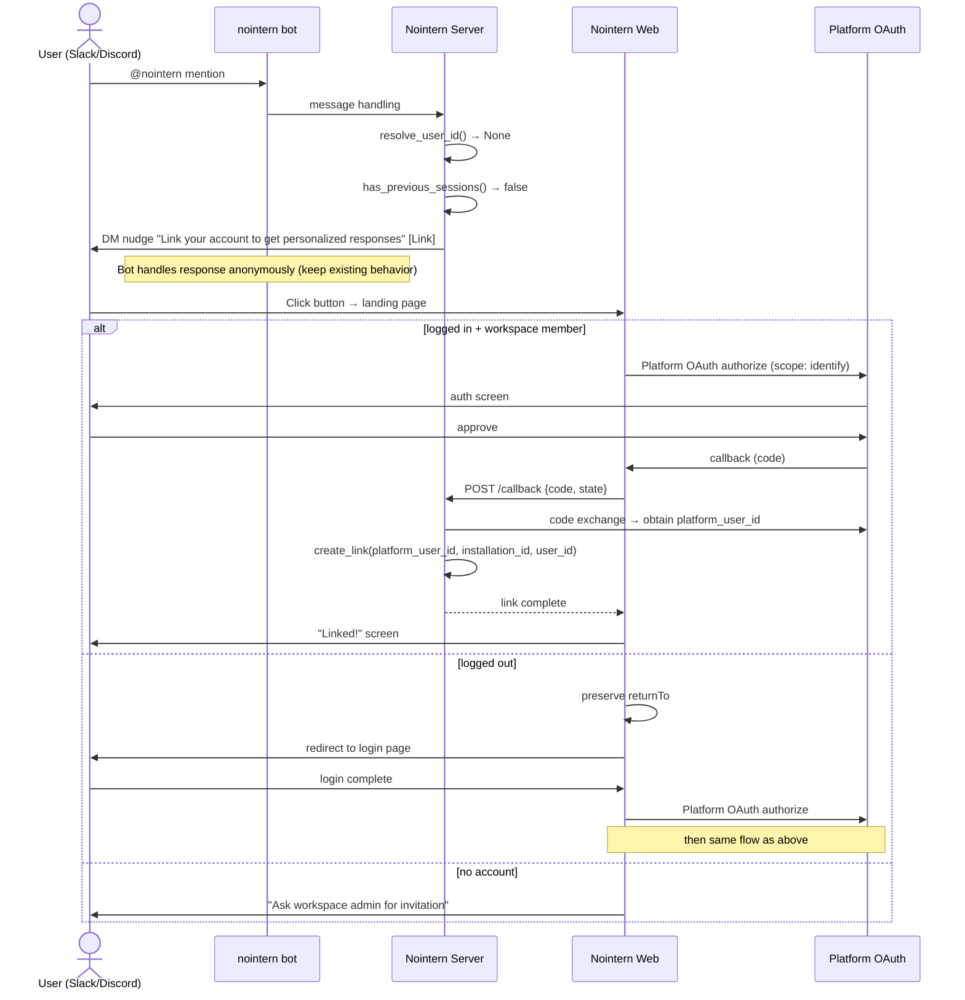

# External Platform Account Linking Historical Requirements Reconstruction

> This is a provenance-marked historical reconstruction, not newly approved product intent.
> It contains only statements recoverable from the source document. Unknown intent remains explicitly unknown.

- Snapshot: `account-260315`
- Source: `docs/azents/design/account-260315-account-linking.md`
- Historical source date basis: `2026-03-15`
- Requester confirmation of the historical reconstruction: not recorded; confirmation is required before treating this as approved intent.

## Problem

Design feature that links external platform user IDs such as Slack/Discord with nointern user ID. After linking completes, bot can identify the user on mention and provide personalized responses plus per-user OAuth toolkit usage.

## Primary Actor

Unknown — the historical source does not state this explicitly.

## Primary Scenario

When user mentions nointern bot for first time in Slack/Discord, user receives account link nudge by DM and links account.

## Supporting Scenarios

When user mentions nointern bot for first time in Slack/Discord, user receives account link nudge by DM and links account.

## Goals

Unknown — the historical source does not state this explicitly.

## Non-goals

Unknown — the historical source does not state this explicitly.

## Requirements

Unknown — the historical source does not state this explicitly.

## Fixed Constraints

Unknown — the historical source does not state this explicitly.

## Open Assumptions

Unknown — the historical source does not state this explicitly.

## Historical Unknowns

- Explicit requester confirmation and original acceptance criteria are unknown unless stated above.
- Any product intent not quoted or paraphrased from the source remains unknown.
