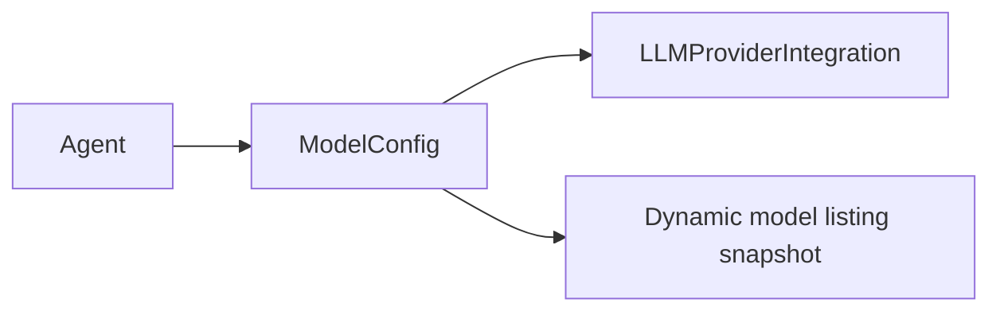

# ModelConfig Removal and Agent Model Snapshot Historical Requirements Reconstruction

> This is a provenance-marked historical reconstruction, not newly approved product intent.
> It contains only statements recoverable from the source document. Unknown intent remains explicitly unknown.

- Snapshot: `config-260616`
- Source: `docs/azents/design/config-260616-config-removal.md`
- Historical source date basis: `2026-06-16`
- Requester confirmation of the historical reconstruction: not recorded; confirmation is required before treating this as approved intent.

## Problem

Current azents model selection structure operates around `ModelConfig`.

`ModelConfig` was designed as workspace-level alias/preset, but actual Agent creation UX is closer to "choose provider integration and select catalog model." Separate `ModelConfig` CRUD creates this complexity.

- Alias/preset must be managed before Agent model selection.
- Advanced parameter defaults are split between `ModelConfig` and Agent override.
- Workspace default model is needed, but runtime alias inheritance is not needed.
- `ModelConfig` update is immediately reflected in referencing Agent and implicitly changes execution model of existing Agent.

This design removes `ModelConfig` and makes Agent directly store model catalog selection snapshot.

## Primary Actor

Unknown — the historical source does not state this explicitly.

## Primary Scenario

Unknown — the historical source does not state this explicitly.

## Supporting Scenarios

Unknown — the historical source does not state this explicitly.

## Goals

1. Remove `ModelConfig` table/API/service/repository/frontend route.
2. Agent create/update receives catalog model selection key and stores server-verified snapshot in Agent.
3. Introduce Workspace default main/lightweight model snapshot.
4. Workspace default is used only as copy source at Agent submit time.
5. Consolidate advanced model parameters into one Agent setting.
6. Remove Subagent model inherit mode and give subagent its own snapshot as well.
7. Remove legacy `model_config_id` API/runtime path without backward compatibility.

## Non-goals

- Automatic drift correction between Agent snapshot and latest catalog listing is out of scope.
- Bulk update preset feature is out of scope.
- Provider failover, model quota, and billing policy are out of scope.
- Catalog listing cache table is out of scope.

## Requirements

Unknown — the historical source does not state this explicitly.

## Fixed Constraints

Unknown — the historical source does not state this explicitly.

## Open Assumptions

Unknown — the historical source does not state this explicitly.

## Historical Unknowns

- Explicit requester confirmation and original acceptance criteria are unknown unless stated above.
- Any product intent not quoted or paraphrased from the source remains unknown.
