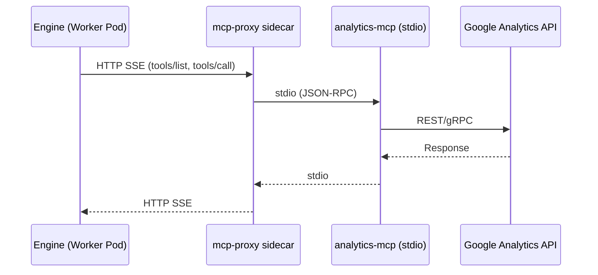
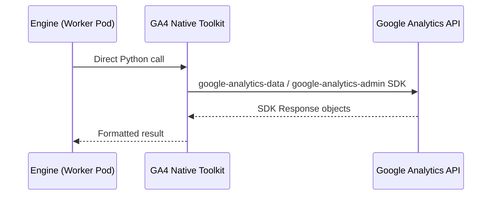

# GA4 stdio MCP -> Native Toolkit Migration Historical Requirements Reconstruction

> This is a provenance-marked historical reconstruction, not newly approved product intent.
> It contains only statements recoverable from the source document. Unknown intent remains explicitly unknown.

- Snapshot: `ga4-260401`
- Source: `docs/azents/design/ga4-260401-ga4-toolkit.md`
- Historical source date basis: `2026-04-01`
- Requester confirmation of the historical reconstruction: not recorded; confirmation is required before treating this as approved intent.

## Problem

Current Google Analytics 4 toolkit is based on stdio MCP (`analytics-mcp`) + mcp-proxy sidecar. Convert it to native Python toolkit to remove sandbox dependency and cold start.

**Current structure (stdio MCP):**

**After migration (native):**

## Primary Actor

Unknown — the historical source does not state this explicitly.

## Primary Scenario

Unknown — the historical source does not state this explicitly.

## Supporting Scenarios

Unknown — the historical source does not state this explicitly.

## Goals

Unknown — the historical source does not state this explicitly.

## Non-goals

Unknown — the historical source does not state this explicitly.

## Requirements

Unknown — the historical source does not state this explicitly.

## Fixed Constraints

Unknown — the historical source does not state this explicitly.

## Open Assumptions

Unknown — the historical source does not state this explicitly.

## Historical Unknowns

- Explicit requester confirmation and original acceptance criteria are unknown unless stated above.
- Any product intent not quoted or paraphrased from the source remains unknown.
