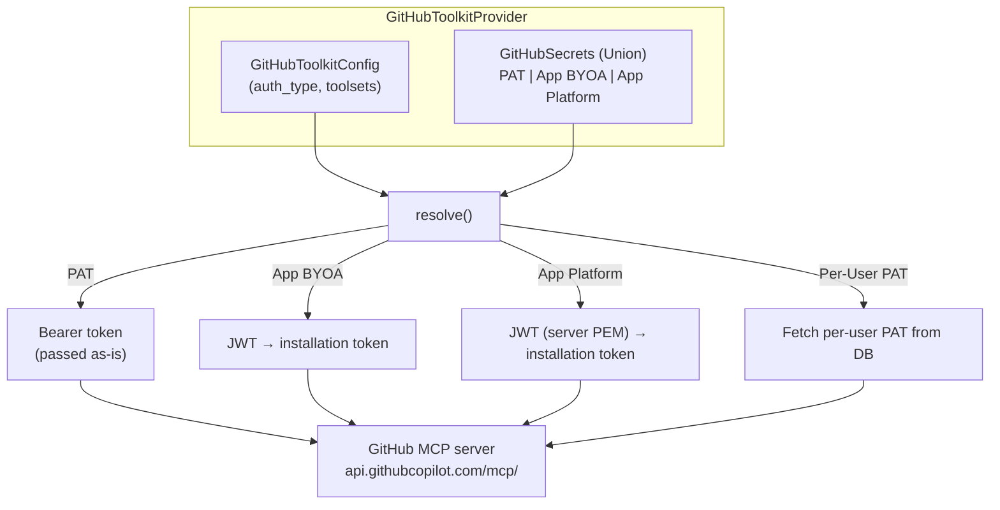

# GitHub Toolkit Historical Requirements Reconstruction

> This is a provenance-marked historical reconstruction, not newly approved product intent.
> It contains only statements recoverable from the source document. Unknown intent remains explicitly unknown.

- Snapshot: `github-260313`
- Source: `docs/azents/design/github-260313-github-toolkit.md`
- Historical source date basis: `2026-03-13`
- Requester confirmation of the historical reconstruction: not recorded; confirmation is required before treating this as approved intent.

## Problem

Service Toolkit based on GitHub MCP server. Implement as a single `github` ToolkitType supporting multiple authentication methods by extending `McpBasedToolkitProvider`.

## Primary Actor

Unknown — the historical source does not state this explicitly.

## Primary Scenario

Unknown — the historical source does not state this explicitly.

## Supporting Scenarios

Unknown — the historical source does not state this explicitly.

## Goals

Unknown — the historical source does not state this explicitly.

## Non-goals

Unknown — the historical source does not state this explicitly.

## Requirements

Unknown — the historical source does not state this explicitly.

## Fixed Constraints

Unknown — the historical source does not state this explicitly.

## Open Assumptions

Unknown — the historical source does not state this explicitly.

## Historical Unknowns

- Explicit requester confirmation and original acceptance criteria are unknown unless stated above.
- Any product intent not quoted or paraphrased from the source remains unknown.
