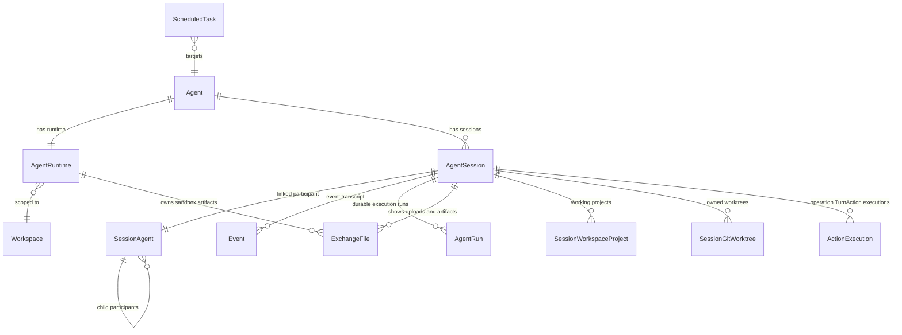

# Conversation & Events

The `conversation` domain owns `AgentSession`, event transcript events, durable
`agent_runs`, input buffers, exchange files, and scheduled task dispatch.

Production agent execution now uses the event runtime. OpenAI Agents SDK `RunState` and legacy
raw `runtime/llm.py` are not production conversation state.

## 1. Domain Model



`AgentSession` is the conversation boundary. Direct session write routes target the requested session.
The default team conversation is the agent's team primary session, represented by
`agent_sessions.primary_kind = 'team_primary'`. Runtime current/active session lookup must not
redirect direct session writes or default team session lookup to another session.

`AgentRuntime` remains the long-lived shared runtime identity and sandbox lifecycle owner. Session
execution control state is stored on `AgentSession`; detailed run phase/tool state is stored in
`agent_runs`. Runtime lifecycle state must not be used as the authority for a session run, pending
command, stop intent, or run heartbeat.

`SessionAgent` is the session-scoped participant tree used by subagents. It does not replace
`AgentSession`; every participant links one-to-one to an `AgentSession`, and the linked session owns
that participant's transcript, runs, input buffers, Goal, Todo, Toolkit State, Skill projection,
ModelFiles, artifacts, and exchange files.

## 2. AgentSession

`rdb/models/agent_session.py` stores session identity and lifecycle.

| Field | Type | Notes |
| --- | --- | --- |
| `id` | `str(32)` | UUID7 hex |
| `handle` | string | Human-readable, BIP-39-derived session handle used for user-facing allocation names such as owned Git worktree paths. |
| `workspace_id` / `agent_id` | FK | Workspace and agent boundary |
| `current_model_target_label` / `current_reasoning_effort` | string / enum \| null | Session-owned requested profile for the next turn; null effort represents model Default. |
| `current_model_selection` | JSONB \| null | Session-owned resolved physical model snapshot used by the next turn. |
| `current_effective_context_window_tokens` / `current_effective_auto_compaction_threshold_tokens` | int \| null | Effective limits resolved with the current model snapshot. |
| `current_inference_resolved_at` | timestamptz \| null | Resolution time for the complete current inference snapshot. |
| `session_kind` | enum | `root` or `subagent`; ordinary session lists include only `root` sessions |
| `status` | enum | `active` or `archived` |
| `primary_kind` | enum \| null | `team_primary` marks the agent's default team conversation; future non-primary sessions may use `null` or another explicit kind. |
| `start_reason` | enum | `initial`, `system_recovery` |
| `title` | string \| null | Optional user-facing title. `null` means no title is available and clients should render a contextual fallback. |
| `title_source` | enum \| null | `manual`, `auto_initial`, or `auto_generated`; null means no title source yet. |
| `title_generated_at` | timestamptz \| null | Last automatic title generation timestamp. |
| `title_generation_event_id` | `str(32)` \| null | Event used as the automatic title generation boundary. |
| `last_user_input_at` | timestamptz | Latest non-reverted `user_message` timestamp used for session list ordering; initialized to `created_at` until user input exists. |
| `end_reason` | enum \| null | Archive reason |
| `model_input_head_event_id` | `str(32)` \| null | Event model-input head after append-only compaction |
| `run_state` / `run_heartbeat_at` | enum / timestamptz | Session execution recovery state |
| `pending_command_*` | mixed | Single pending idle command for this session |
| `stop_requested_*` | mixed | Durable stop intent for this session |

Only one team primary session may exist per agent in the current product state. Additional active
non-primary team sessions may exist under the same agent with `primary_kind = null`.
`GET /chat/v1/agents/{agent_id}/sessions` lists active agent sessions with the team primary session
first and the remaining sessions ordered by persisted `last_user_input_at`, the timestamp of the
most recent non-reverted `user_message` event or the session creation time when no user input exists.
This lets newly created sessions appear naturally in the active list before their first message. Each
session item includes `run_state` so azents-web can mark running sessions in the Agent rail session
list. `POST /chat/v1/agents/{agent_id}/sessions` creates an active non-primary team session. The
current request shape is `existing_project_paths` plus ordered `setup_actions`.
`existing_project_paths` registers explicit Project paths supplied by the client and does not copy
Projects from the team primary session. Each `create_git_worktree` setup action is stored as an
ordered `action_message` input before the first user message; the action execution creates an
Azents-owned Git worktree from the source Project path and starting ref before registering the created
worktree as a session Project. Legacy `workspace_items`, `workspace_mode`, and `project_paths` request
fields are not part of the current contract.
`POST /chat/v1/agents/{agent_id}/sessions/messages` creates the same kind of non-primary team session
and enqueues setup action inputs plus the first user message in one write boundary. Setup action inputs
remain ahead of the user message in FIFO order. Successful Project-mutating action execution gates the
first model run until context can be rebuilt from the updated Project registry; failed actions are
marked failed and FIFO processing continues to the first user message. The first-message create
response is `ChatWriteResponse`, including the created `session_id` and live snapshot. azents-web Agent detail routes surface the active
session list in the Agent rail and navigate selected sessions through
`/w/{handle}/agents/{agent_id}/sessions/{session_id}`. The Agent rail new-session action navigates to
`/w/{handle}/agents/{agent_id}/sessions/new`, which is a draft route and must not create an
`AgentSession` row. The draft route renders the Agent top bar plus the chat input surface, but it does
not render session-scoped Projects or Context tabs. The draft composer shows a compact additive
workspace selector where repository folders are added to one list and each selected folder can switch
between repository and new worktree modes from the row-level type selector. Azents-owned concrete
worktrees remain registered in the session where they are selected but are excluded from reusable
Project defaults and presets. Explicit new-worktree items persist their source Project and mode as the
reusable default. The worktree base branch picker refreshes Git refs when mounted, selects the source
Project's currently checked-out local branch by default, supports branch-name search, and shows local
branches only. On first-message
success, azents-web replaces the draft
URL with the created session URL and invalidates the Agent session list cache.

The draft and concrete-session composers project usage for the currently selected Agent-owned model
option when its provider is `chatgpt_oauth`, `xai_oauth`, or `openrouter`. The composer resolves the
option's stored integration ID, reuses the integration-scoped subscription-usage query, and switches
query identity when the selected model changes. Other API-key and unsupported providers do not render
the affordance or request usage. OpenRouter participates only when its API key has a bounded credit
limit; a successful snapshot with a `null` limit or remaining-limit value has no displayable limits and
renders no composer affordance. Desktop shows a compact status beside the model selector and
operational details in the model popover; mobile keeps the compact status and places the same details
in the model bottom sheet. Available limits, loading, stale, unavailable, and trusted external states
remain local to the usage projection and never disable model selection or message submission. The
session surface exposes no financial details. Manual refresh, the existing 60-second query freshness
policy, focus revalidation, no automatic retry, and last-successful stale projection remain shared
with Workspace LLM Settings.

Each session may have a user-facing `title`. `PATCH /chat/v1/sessions/{session_id}/title`
sets or clears a manual title after workspace membership validation. The request body uses `{ "title":
string | null }`: non-null titles are trimmed and must be non-empty and at most 200 characters; an
explicit `null` clears the title and title source so automatic title generation may run again. Manual
titles set `title_source = manual` and automatic generation must never overwrite them.

Automatic title generation has two phases. When the first user message is promoted into the durable
transcript and the session has no title source, the server stores a deterministic `auto_initial` title
from the beginning of that message. The worker then immediately schedules best-effort lightweight
model title generation from that initial user prompt without waiting for the first run to complete.
The resulting concise `auto_generated` title only replaces the deterministic title while
`title_source = auto_initial` and `title_generation_event_id` still points at the same initial prompt
event. Manual title updates or clears therefore remain authoritative, while long-running first turns
do not delay automatic title generation. Title generation failures must not affect run execution.
Clients display `title` when present and otherwise fall back to a contextual label such as "Team
primary" or "Session". Concrete session route top bars show this session title while preserving the
Agent avatar/icon affordance, and expose an inline title edit action that calls the manual title update
endpoint.

`POST /chat/v1/agents/{agent_id}/sessions/{session_id}/archive` archives the complete root
`SessionAgent` tree for an active non-primary root session. The service locks the root and descendant
sessions in stable order and rejects the request while any subtree session or `AgentRun` is active.
Team-primary roots cannot be archived because they remain the stable default conversation anchor for
an Agent.

Archive snapshots the current instance retention revision, whole-day value, `archived_at`, and finite
`purge_after` deadline on the root. Unlimited retention stores a null deadline and snapshot value.
Every linked descendant `AgentSession` is marked archived so direct worker, command, input, wake-up,
and recovery boundaries can reject it without resolving the tree again. Zero-day retention completes
the archive transaction and only makes the root eligible for the next asynchronous purge pass.
Archive preserves durable transcript data, run rows, file metadata, project registry rows, and all
Azents-owned worktree allocations.

`GET /chat/v1/agents/{agent_id}/sessions/archived` returns archived roots separately from the active
session list. Each item includes `archived_at`, `purge_after`, and the immutable retention snapshot;
the list response also includes the current instance retention value for archive confirmation copy.
`POST /chat/v1/agents/{agent_id}/sessions/{session_id}/restore` restores the complete tree only while
the root purge job has not started fencing. Restore cancels eligible unstarted purge work, clears the
root archive snapshot, marks every linked session active, and returns the root session. A root that
has crossed the purge fence returns a conflict and cannot become active again.

The Agent rail keeps rename and archive in the existing session action menu. Archive is available
only for inactive non-primary roots and opens policy-aware confirmation copy. If the selected session
is archived, Main Web navigates to `/w/{handle}/agents/{agent_id}/sessions/new`. The collapsible
Archived section shows title fallback, archive time, immutable retention snapshot, scheduled deletion
or Unlimited state, and Restore. It exposes no permanent-delete action.

The public `DELETE /chat/v1/sessions/{session_id}` route is absent. Permanent deletion is owned only
by durable purge after fencing. Purge deletes subtree ModelFile, Artifact, bound ExchangeFile and
preview blobs, broker state, and every owned worktree path/branch before the database subtree is
removed. A cleanup failure retains ownership metadata and retry state rather than cascading database
deletion.

Direct session writes are session-scoped. When a route contains `session_id`, input buffers, live
projections, broker wake-up, and the REST response use that same session id. Runtime current/active
session lookup is invalid for that direct write path and for default team session selection. If any
internal write helper produces a different session id from the REST boundary's resolved target, the
write is invalid and must not enqueue a broker wake-up for that alternate session. `agent_runtime_id`
is not stored on `AgentSession`; runtime lookup happens only after a session target has already been
selected.

### SessionAgent

`rdb/models/session_agent.py` stores the live participant tree for one root session. A root
`AgentSession` has one root `SessionAgent` with path `/root`. `spawn_agent` creates child or nested
`SessionAgent` rows with `kind = subagent`, a linked hidden `AgentSession` whose `session_kind` is
`subagent`, and the same workspace and Agent boundary as the parent session. Spawn request validation,
profile derivation, child participant/session/run creation, selected context append, and initial
mailbox input commit atomically. Invalid target labels, unsupported explicit effort, full-history
profile overrides, invalid fork selections, or incomplete parent run provenance leave no child
participant, session, run, activity event, or broker wake-up.

| Field | Type | Notes |
| --- | --- | --- |
| `id` | `str(32)` | SessionAgent ID |
| `context_id` | FK | Root-tree context shared by all participants in the tree |
| `root_session_agent_id` | FK self | Root participant for this tree |
| `agent_session_id` | FK `agent_sessions` | One-to-one linked transcript/execution session |
| `kind` | enum | `root` or `subagent` |
| `name` | string | Tree-local name segment. Child names must start with a letter or number and contain only letters, numbers, underscores, or hyphens. |
| `path` | text | Canonical absolute path under `/root` |
| `agent_type` | string | Spawned agent type snapshot. Current supported value is `default`. |
| `parent_session_agent_id` | FK self \| null | Parent participant; null only for the root participant |
| `last_task_message` | text \| null | Latest delegated task/message preview |
| `parent_observed_run_index` / `parent_observed_event_id` | int / `str(32)` \| null | Cursor for terminal child run results observed by the parent |

The tree enforces unique `(root_session_agent_id, path)` and `(parent_session_agent_id, name)`. The
repository resolves absolute paths such as `/root/reviewer` and current-agent-relative child paths.
It never resolves across root trees. Ordinary agent session list APIs filter to `session_kind = root`,
so child sessions stay hidden from the Agent rail while remaining directly readable through authorized
history, live, and detail routes.

### SessionWorkspaceProject

`rdb/models/session_workspace_project.py` stores the project registry used as session working
context. `SessionWorkspaceProject` rows are owned by `AgentSession` through `session_id`.
Runtime owns only the physical workspace where project paths exist.

Project and context inspector routes are session-scoped under
`/chat/v1/agents/{agent_id}/sessions/{session_id}/...`. They validate that the selected session
belongs to the requested agent and that the requester is a workspace member before reading or writing
that session's rows. Runtime lookup is allowed only after that session context is selected, and only
for physical workspace validation or runner filesystem operations. Runtime current project, selected
project, active project, team-primary fallback, and runtime-owned project catalog state are not part of
the conversation prompt contract. The Agent Project catalog is only a reusable path/status projection
for browser and new-session preview UI; session Project rows remain the prompt-eligibility source.

RuntimeToolkit loads registered project prompt content from the current logical `AgentSession` ID.
Runtime context sharing affects shell/file operations; it must not make project registry ownership or
project prompt selection fall back to a parent, team-primary, or runtime session.

### ActionExecution and SessionGitWorktree

The legacy setup lifecycle tables are no longer part of the current conversation model. Setup work that affects a session is represented by
operation TurnActions carried through FIFO `action_message` input buffers, and ordinary sessions have
no separate setup baseline row. An action input remains queue transport rather than becoming a durable
`action_message` transcript event. Goal and Skill actions atomically apply their side effects and
append their canonical model-visible events during preparation. A `create_git_worktree` action is
atomically claimed as an `ActionExecution` before its source buffer is deleted. A Project-mutating
action that succeeds invalidates the prepared context; the same active `AgentRun` rebuilds its
turn-local request from the updated Session inference snapshot before the next model call. Failed
actions are terminal and do not block later FIFO input.

`action_executions` stores live operation TurnAction state keyed by the source `input_buffer_id` and
includes the typed action payload plus the admitting Session `owner_generation`.
`action_execution_events` stores its ordered live progress records such as step start, command
start/completion, stdout/stderr text, warning, failure, and completion. `GET
/chat/v1/sessions/{session_id}/live` and REST write snapshots expose these active projections.

Completion, failure, or cancellation atomically appends one durable `action_execution_result` snapshot
with deterministic identity `action_execution_result:{execution_id}` and deletes the live execution
and progress rows. Terminal state is therefore owned only by transcript history. A worker takeover
cancels leftover active operations before new work and never replays their potentially completed side
effects. Failed and cancelled actions are not retried or discarded through a separate mutation API.

`session_git_worktrees` is the cleanup authority for Azents-owned worktrees. It stores the source
Project path, starting ref, generated worktree path, generated branch name, base commit, status,
failure summary, cleanup summary, and the owning action execution when the worktree came from a
TurnAction. Worktree creation uses typed Runner Git operations, registers exactly the created path in
`session_workspace_projects`, and upserts the Agent Project catalog entry without updating
last-created-session defaults. Existing Project selections still refresh presets/defaults directly;
worktree actions refresh source-path presets and register only the created worktree path as prompt
context. The ownership row, not reserved-root membership or `session_workspace_projects`, is required
before destructive cleanup can remove a path or branch.

## 3. AgentRun

`agent_runs` is the durable execution-state table for the event loop.

| Field | Type | Notes |
| --- | --- | --- |
| `id` | `str(32)` | UUID7 hex run id |
| `session_id` | FK `agent_sessions` | Owning conversation |
| `run_index` | int | Session-scoped monotonic run index |
| `phase` | enum | UI activity source |
| `status` | enum | `pending`, `running`, `completed`, `stopped`, `failed`, `interrupted`, or `cancelled` |
| `active_tool_calls` | JSONB array | `call_id`, `name`, redacted/summarized `arguments`, `started_at`, and `owner_generation` |
| `retry_state` | JSONB \| null | Durable current-model-turn retry state; cleared on successful model output admission or terminal transition |
| `parent_agent_run_id` | FK `agent_runs` \| null | Parent run lineage for a subagent's first run |
| `last_completed_event_id` | `str(32)` \| null | Terminal run boundary event id when available |
| `terminal_result_event_id` | `str(32)` \| null | Terminal assistant/error event used by parent subagent observation |
| `terminal_result_message` | text \| null | User-safe terminal message returned by `wait_agent` and projected in the Subagent Tree |
| `created_at` / `updated_at` | timestamptz | Durable lifecycle timestamps |

Phase values are `idle`, `preparing_input`, `waiting_for_model`, `streaming_model`,
`normalizing_output`, `executing_tools`, `appending_events`, `compacting`, and `stopping`.

`retry_state` is the source of truth for the current model turn's failed-run retry progress. While
present, the run remains `running` and live run state exposes the active retry cycle during backoff
and the in-flight retry attempt. Successful model output admission clears `retry_state` in the same
transaction that appends the output, so a later model turn starts with a fresh retry budget and REST
resync cannot recover an earlier turn's error. Terminal run updates also clear `retry_state`
defensively so retry progress cannot leak into completed, stopped, failed, interrupted, or cancelled
runs. Classified provider-attributed retry state may retain only the closed category, diagnostic
retryability, bounded redacted provider message, safe code/type/status/retry hint, internal
provider/model/integration identifiers, and stable safe fingerprint. Every classified provider
category uses the complete failed-run budget; diagnostic `non_retryable` does not short-circuit a
typed provider failure. An unclassified provider outcome does not create provider retry state and
instead follows the ordinary internal-error path.

A run is precreated as `pending` and associated with its ordered durable input events through
`agent_run_input_events`. Normal buffered input resolves its requested profile before activation, then
atomically writes the complete Session inference snapshot, canonical transcript events, run-input
associations, Goal/Skill side effects, and buffer deletion. A handled preparation failure consumes the
buffer, appends a deterministic `system_error`, preserves the previous Session inference snapshot,
and completes the active run without retry. Only one pending run may exist for a session. Pending and
running runs are active recovery state.

The requested label is intent, while the Session-owned current inference snapshot is the execution authority at each turn boundary. `AgentRun` stores lifecycle, parentage, activity, retry, and terminal-result state; it does not own or restore model selection. A profile change arriving during an active run is prepared for the next boundary, and the same run rebuilds its physical request and effective limits from the new Session snapshot instead of creating a replacement run. Manual retry creates a new pending run, preserves the original ordered input-event associations, and re-resolves the Session's requested profile against current Agent routing before execution. A subagent's first run is precreated with `parent_agent_run_id`; child creation first stores either the exact parent Session snapshot or a statically validated spawn override on the child Session. Recovery activates the child from that Session snapshot without deriving model state from the parent run row.

## 4. Event Transcript Events

Event transcript is the durable source of truth for model/tool/session output. Event payloads are
stored as JSONB and validated by event kind.

Event kinds:

- `user_message`
- `assistant_message`
- `reasoning`
- `client_tool_call`
- `client_tool_result`
- `provider_tool_call`
- `turn_marker`
- `run_marker`
- `interrupted`
- `compaction_marker`
- `compaction_summary`
- `system_reminder`
- `goal_continuation`
- `goal_updated`
- `agent_message`
- `action_execution_result`
- `skill_loaded`
- `goal_briefing`
- `system_error`
- `unknown_adapter_output`

`agent_message` records agent-to-agent mailbox delivery in the target child session. Its payload stores `message_kind` (`spawn_agent`, `send_message`, or `followup_task`), source/target `SessionAgent` ids, source/target canonical paths, and content. Model lowering renders it as explicitly sourced delegated user-role-compatible input for the target session; the parent transcript keeps only the ordinary collaboration tool call/result.

`action_message` is an InputBuffer kind for user-selected TurnActions, not a newly appended transcript
event. `skill` actions load Skill context by appending `skill_loaded` and an optional normal
`user_message`. `create_git_worktree` actions create buffer-keyed live execution state before the
source buffer is consumed. `action_execution_result` is a durable transcript event containing the complete terminal action
execution projection after a worktree action completes, fails, or is cancelled; it lets history
reloads render operation logs without treating them as model input or ordinary chat bubbles.

`skill_loaded` records a Skill turn action side effect. Its payload stores the Skill display name,
exact `skill_path`, full Skill body, original user action message, content hash, source label, and
relative hint. Model lowering injects `skill_loaded` as a required user-role instruction to read and
follow the embedded Skill body; the original user action message is promoted as the following normal
`user_message` event when non-empty. The UI renders `skill_loaded` as an expandable control event, while the consumed Skill input buffer
does not create a duplicate action-message bubble.

`system_error` payloads may include optional user-safe failed-run metadata under `failure`. The
metadata identifies terminal failed-run output, provider/runtime presentation kind, finalization
reason, retry counts, last error type, diagnostic retryability/failure code, and bounded attempt
summaries. A provider-authored scalar message may be stored only after the common deterministic
bounding and secret-redaction boundary. Stack traces, credentials, headers, cookies, request/model
output, arbitrary raw provider bodies, raw stream frames, and SDK serialization are not stored in
durable transcript payloads.

Attachments are payload-specific, not event-common. Client and provider tool delivery attachments are
canonical `AttachmentOutputPart` values inside semantic/result output; tool payloads do not own a
parallel top-level attachments field. Tool output is either a plain string or an ordered typed-part
array containing `OutputTextPart`, `AttachmentOutputPart`, `ArtifactOutputPart`, or `FileOutputPart`;
the serialized discriminators are `text`/`output_text`, `attachment`, `artifact`, and `file`.

events have both physical append identity and model-visible order. Physical ids keep the
durable append/audit sequence. `model_order` is scoped to a session and is the ordering/filtering key
used when reading future model input. Sequential appends allocate `model_order` with a gap so later
compaction can insert model-visible system events without renumbering the whole transcript.
Compaction keeps append-only storage while presenting future model input from a single
`compaction_summary` head event.

Every `provider_tool_call` stores required provider-neutral semantic content under
`payload.semantic`: nullable readable `input`, model-visible `output`, and typed `references`.
References carry kind `url | file | other`, nullable URI/title/excerpt, and stable string metadata.
Tool-created delivery files are `AttachmentOutputPart` values in `semantic.output`; model replay files
are `FileOutputPart` values in the same output. Adapters normalize provider-exposed semantic content
before persistence, apply canonical field and collection bounds, and keep provider-only fields inside
the opaque native artifact. The persisted contract does not use top-level provider-tool `arguments`,
`output`, or `attachments` fields.

`ProviderToolCallPayload.status` is the provider-neutral lifecycle state `running`, `completed`,
`failed`, `cancelled`, or `interrupted` when known. Live provider-tool calls carry the latest observed
canonical state. Durable calls carry the terminal status normalized from the one provider-native item;
historical events may omit it. Provider-native stage strings remain confined to the adapter native
artifact.

`NativeArtifact.item` is adapter-native opaque payload. Event core does not interpret it.
Same-native pass-through is allowed only when the compat key matches exactly:

```text
adapter:native_format:provider:model:schema_version
```

Official OpenAI SDK Responses artifacts use adapter identity `openai`; LiteLLM Responses artifacts
use `litellm`. A mismatch always reconstructs provider input from canonical events. Provider-tool
fallback uses one deterministic readable rendering of semantic input, output, references, excerpts,
and stable metadata rather than inspecting native artifacts. This includes forward cutover from old
LiteLLM artifacts and a code-version rollback that reads newer OpenAI-native artifacts;
cross-adapter objects are never replayed as though they shared schema ownership.

A completed provider-hosted `image_generation` item uses one durable provider-call shape. Its
`semantic.output` contains both a ModelFile-backed `FileOutputPart` and the independently stored
Exchange original as an `AttachmentOutputPart`. Provider Base64, decoded bytes, and native `result`
fields are transient only and are excluded from event payloads, native artifacts, REST/WebSocket
projections, and frontend state. xAI Imagine retains client tool call/result ownership while storing
the same two output-part kinds in the durable client result; credentials and transient bytes remain
excluded. Same-native lowering reconstructs the provider-native image result from the ModelFile in
request-local memory and emits the bounded Exchange URI context separately. An incompatible adapter
or model, and every later-model use of a client-generated result, lowers the file through the normal
rich-image path or an explicit bounded unavailable-image placeholder while retaining attachment URI
metadata.

## 5. History And Live Event APIs

The final `events` table is the durable transcript table. Public chat readers use two separate
event-list APIs:

- `GET /chat/v1/sessions/{session_id}/history` returns persisted transcript events, paginated by
  durable event id. `before` pages older history and `after` pages newer history; the two cursors
  are mutually exclusive. Responses include directionally accurate `has_more` for older pages and
  `has_newer` for newer pages. Each raw response page owns its `next_cursor` and `previous_cursor`;
  clients advance those cursors even when every event on a page is hidden by the render projection.
- `GET /chat/v1/sessions/{session_id}/live` returns current non-durable live state such as
  streaming assistant text, streaming reasoning, provider-hosted tool activity, PostgreSQL-backed active
  client tool calls, pending input buffers, run state, session todo snapshot, and action execution
  projections. Redis stores streaming assistant/reasoning partials and attempt-local provider-tool
  activity; active client-tool events are reconstructed from the running `AgentRun`.
- `GET /chat/v1/agents/{agent_id}/sessions/{session_id}/subagents/tree` returns the durable
  Subagent Tree projection for the root tree containing the selected root or child session. The
  projection includes nested nodes, canonical paths, linked child `agent_session_id` values for
  detail routes, projected status, latest task/message preview, latest run metadata, terminal result
  preview, and unread terminal result indicator.

Durable human `user_message` events preserve their immutable requested profile intent. They do not
embed an associated AgentRun summary and do not change when later run provenance changes. Pending
buffers likewise expose only requested intent. The dedicated live Run projection carries the current
Session inference snapshot's allowlisted physical provenance; clients never infer it from Composer or
Agent defaults.

Each `turn_marker` with provider usage copies the exact Session inference snapshot applied to that
model call. The immutable public provenance consists only of the Agent-owned target label, raw
nullable reasoning effort, nullable user-facing model display name, effective context window, and
effective automatic-compaction threshold. `run_id` remains the marker-to-AgentRun link. Historical
markers without these nullable fields remain valid, and readers report provenance as unavailable
instead of borrowing the current Session, Agent, Composer, or live Run profile. Physical provider and
model identifiers, integration selection, credentials, and the full resolved selection are not stored
in the public marker payload.

The frontend retains raw durable events and raw live partial events separately from rendered
`ChatMessage` view models. Projection identity is semantic rather than event-kind-global: assistant
output uses native output identity or response/content indices, reasoning uses native identity or its
projection root, client tool call/result pairs use `call_id`, and each provider tool call uses its own
`call_id`. A durable provider call replaces the matching live call without result-merge state.
Provider-tool calls render provider-neutral running, completed, failed, or historical fallback states
from canonical status. Semantic names such as `web_search` and `image_generation` select presentation
labels without branching on provider identity or execution ownership. Provider projection reads text
and references from `semantic.output` and projects only `AttachmentOutputPart` values as UI files;
`FileOutputPart` remains model-only. Client-tool results preserve their own completion/failure status
and canonical output parts. An available `image_generation` attachment renders directly in the owning
provider-tool or client-tool card without requiring diagnostic details to expand; preview and download
continue through the Exchange attachment surface.
Live `agent_message` events use the same source-labeled internal-agent row as their durable form. When
a live entity and durable event describe the same semantic output, the durable projection replaces
the live projection without a duplicate or disappearance.

Both responses use the same event transport shape as the durable transcript. The removed
`/chat/v1/sessions/{session_id}/messages` aggregate endpoint is not part of the public contract:
history, live state, pending input, and activity state must not be recombined into a message-list
schema at the API boundary.

Live projections are stored behind a `LiveEventStore` abstraction. The production implementation uses
Redis, while tests may use the in-memory implementation. Pending input buffers are persisted in the
input-buffer table and are exposed through `/live` as projections with metadata marking the projection
source. Goal continuation starts as a pending `goal_continuation` input buffer and becomes a durable
`goal_continuation` event only when the session runner flushes buffers into the next model input.
The `/live` reader obtains access, pending input, active Run, Goal/Todo Toolkit state, and action
execution projections in one short PostgreSQL session. It closes that session before reading Redis
live projections and performs no nested database session reads inside the snapshot.
`goal_updated` is appended when the user updates the session Goal. User-requested stop appends
`interrupted` before the terminal run marker. The UI must not render these control events as user
bubbles or delete controls; it may render non-interactive timeline indicators such as goal controls or
an interrupted divider.

Session todo is persisted in `toolkit_states`, not in the transcript. `/live` and REST write snapshots expose it as `todo: { items }`; each item has `content` and status `pending`, `in_progress`, or `completed`. The same live and write snapshots expose `action_executions` as the current active operation TurnAction projections. Terminal snapshots exist only as durable `action_execution_result` events so completed, failed, or cancelled worktree progress remains visible after live state is deleted. The worker broadcasts `todo_state_changed` after `update_todo` so the chat UI can update without a separate todo read API.

WebSocket chat clients receive subscription and event actions:

- `subscribed` after the server has registered the session broadcast subscription;
- `subscription_health_check_ack` for visible-state subscription reconcile requests;
- `history_event_appended` for newly persisted transcript events;
- `live_event_upserted` for current live projections;
- `live_event_removed` when a projection is no longer current;
- `input_actions_updated` when composer action definitions change, including Skill projection list changes;
- `runtime_error`, `authorization_request`, and `account_link_nudge` for user-facing runtime and
  integration controls;
- `compaction_started` and `compaction_complete` for transient compaction UI state;
- `todo_state_changed` when the session-scoped TodoToolkit State changes;
- `live_run_updated` when the authoritative running Run projection changes, including failed-run retry state and the optional context-preparation operation;
- `live_run_cleared` with the exact terminal `run_id` when cleanup removes that current run projection;
- `action_execution_updated` when an active operation TurnAction execution projection changes;
- `action_execution_removed` after an operation's durable terminal snapshot replaces its live state;
- `subagent_tree_changed` when subagent tool side effects or wait observation cursors change the
  durable Subagent Tree projection. This event is an invalidation signal only; clients refetch the
  dedicated tree API instead of treating the live event as tree state.

The server-to-client contract consists of canonical action envelopes plus the explicitly public
control frames listed above. A durable event appears only as the nested `event` of
`history_event_appended`; a raw top-level durable Event frame is not public. Internal runtime telemetry
such as provider deltas and Run lifecycle events is projected into canonical live actions rather than
broadcast directly.

Durable/live handoff follows these invariants:

- `history_event_appended` is renderable event state and clients must not skip tool calls only
  because the event arrived through the history action.
- `live_event_removed` removes only the live projection. It must not remove a durable view model that
  has already been promoted from `history_event_appended`.
- `live_run_updated` replaces the current `run` live-state snapshot atomically, including profile,
  retry, and context-preparation operation fields; `live_run_cleared` clears only when its required
  `run_id` exactly matches the current live run, and it does not remove
  durable transcript events. A delayed terminal or clear for Run A cannot clear a newer Run B.
- When a durable event has a matching live counterpart, the worker publishes the history
  append action before publishing the live removal action.
- Operation terminalization commits the durable `action_execution_result` append and live execution
  deletion in one database transaction, then publishes `action_execution_removed`.
- If the same semantic entity is present in both durable history and live projection, durable history
  wins for rendering; operation executions use their stable execution ID for this handover.

Text and reasoning streaming projections are server-side batched before live store upsert and
`live_event_upserted` broadcast. The worker flushes pending `ContentDelta` and `ReasoningDelta`
batches before event durable boundaries and terminal runtime boundaries. Provider-tool activity is
projected as a full canonical snapshot keyed by `call_id`; duplicate snapshots are suppressed and
terminal state cannot regress to running. Redis stores only the latest live projection, not every
provider delta. A failed non-Stop model attempt removes its assistant, reasoning, and provider-tool
live projections before retry state is published. A matching durable provider-tool call or result is
broadcast first and then removes the live projection by `call_id`.

Legacy chat UI deltas and input-buffer notifications such as `content_delta`,
`reasoning_delta`, `function_call_delta`, `run_started`, `run_phase_changed`, `input_buffered`, and
`input_buffer_deleted` are not frontend state contracts.

### Frontend Markdown rendering

azents-web renders user-visible chat Markdown with GitHub Flavored Markdown, soft line breaks, and
compact chat typography. Fenced code blocks render through the chat code block renderer. A fenced code
block with language `mermaid` renders as an inline Mermaid diagram instead of syntax-highlighted text.
The Mermaid renderer is client-side, lazy-loads the Mermaid package, uses strict Mermaid security
settings for untrusted chat content, and falls back to the original source block with a user-visible
error message when diagram rendering fails.

## 6. Input Buffers And Session Inputs

Chat route and collaboration inputs are prepared before model-call boundaries. The supported
InputBuffer kinds are `user_message`, `goal_continuation`, `action_message`, and `agent_message`.
Broker wake-ups are payload-free signals and never carry model input.

Input buffers are session-bound. The `input_buffers` table stores `session_id`, not
`agent_runtime_id`. Inference-producing buffers store optional requested target label and nullable
reasoning effort. If the head has no explicit profile, preparation uses the current Session requested
profile, then the Agent default when the Session has no snapshot.

`InputBufferService` owns input-buffer reads and writes. Enqueue commits only the pending row;
producers own wake-up and run-state transitions. Preparation handles exactly one FIFO head per
transaction. The worker first reads the head's identity and inference requirement, resolves the
profile and attachment metadata outside any database session when needed, then locks the Session and
the same FIFO head. Attachment resolution is metadata-only during promotion: it never downloads the
Exchange file or creates a replacement ModelFile, and model rich input comes only from FileParts
stored on the buffer at its creation boundary. If the identity changed while external preparation
ran, the worker discards the stale result and starts again. Successful preparation atomically updates
the complete Session inference snapshot, applies Goal/Skill state changes, appends canonical events,
associates input events with the active run, and deletes the source buffer.

Canonical outcomes are:

| Input buffer kind | Preparation result |
| --- | --- |
| `user_message` | Durable `user_message` event. |
| `goal_continuation` | Durable `goal_continuation` event. |
| `agent_message` | Durable `agent_message` event. |
| Goal `action_message` | Goal side effect plus canonical goal/user events; no `action_message` event. |
| Skill `action_message` | `skill_loaded` plus optional `user_message`; no `action_message` event. |
| Worktree `action_message` | Buffer-keyed live `ActionExecution` claim with action payload and current owner generation; no `action_message` event. |

A handled preparation failure consumes only the failing head, appends a deterministic `system_error`,
preserves the previous Session inference snapshot, and is never retried. FIFO draining may continue
when a later input makes the next turn eligible. Operation failure is likewise terminal and does not
require a separate session-initialization gate or retry/discard action.

Web chat message/edit/command writes use REST commit endpoints instead of WebSocket write payloads.
`GET /chat/v1/agents/{agent_id}/team-primary-session` resolves or creates the agent's team
primary session and returns its `session_id`.
`GET /chat/v1/agents/{agent_id}/sessions/{session_id}` validates that a URL-selected session belongs
to the path agent and is visible to the requester; session missing, agent/session mismatch, and access
denied all return 404. Child subagent sessions are directly readable through this route and through
history/live routes, but they are read-only for human chat writes.
`POST /chat/v1/sessions/{session_id}/messages` appends a user message input to an existing root
session and rejects `session_kind = subagent` before creating a chat write request, input buffer, live
projection, or broker wake-up.
`POST /chat/v1/sessions/{session_id}/edit-message`,
`POST /chat/v1/sessions/{session_id}/commands`, and
`POST /chat/v1/sessions/{session_id}/retry-failed-run` are idle-only control boundaries. Message,
edit, command, and failed-run retry write paths reject `session_kind = subagent` before write side
effects; new subagent instructions must enter through parent-agent collaboration tools as
`agent_message` input. All REST write
requests require `client_request_id`; accepted writes are recorded in `chat_write_requests` so
retries with the same key return the same accepted target instead of creating duplicate side effects.
REST write idempotency is scoped to `(session_id, user_id, client_request_id)`. The same
`client_request_id` may be reused independently for different explicit session routes because the URL
session is the write boundary. New-session messages, normal messages, and edits require `inference_profile = { model_target_label, reasoning_effort }`; the label is client-visible Agent intent. Effort is concrete in normal user input whenever the selected target advertises explicit levels, while models with an empty explicit-level list use nullable provider/model default internally and show no effort control. Commands require `inference_profile = null`, and failed-run retry accepts no profile override. Message writes commit a `user_message` input buffer
to the explicit path session before returning success, mark the same session running in the producer
transaction, then send a worker wake-up signal for that session. The message path must not
resolve runtime current/active session state to replace the requested `session_id`. Edit writes
rewrite durable history state, clear pending input buffers, commit a
`user_message` input buffer, mark the session running in the producer transaction, and send a
wake-up for the explicit path session. Command writes do not enter the input buffer; they store a
single pending command on `agent_sessions`, mark the explicit path session running, and send a wake-up
for that session. Failed-run retry writes target the latest visible failed-run `system_error`; they
are rejected with `409 Conflict` if any newer visible durable event exists, if the session is running,
or if pending input/command state exists. Accepted retry writes soft-revert the failed event and later
visible events, mark the session running, send a normal wake-up, return accepted type
`failed_run_retry`, and set `history_reload_required = true`. Signal delivery is not the persistence source of truth. REST write
responses include `session_id`, `client_request_id`, an accepted target, an authoritative live
snapshot, and `history_reload_required` for writes such as edit/command that require durable history
reload.

WebSocket chat connections are existing-session live subscription channels. They publish
subscription/history/live event actions and accept only the `subscription_health_check` control
message for subscription reconcile. Chat input, edit, command, and stop payloads are not accepted on
WebSocket. Stop is a REST control boundary: `POST /chat/v1/sessions/{session_id}/stop`.
Stop records a durable `agent_sessions.stop_requested_at` intent and sends a best-effort broker stop
signal so an active runner can cancel immediately. If the stopped session is linked to a
`SessionAgent`, stop applies to that participant subtree: a root session stop records stop intents for
running descendants, while a child detail stop records stop intents for that child subtree. Runner
polling of the DB intent covers broker signal loss. Model-visible `interrupt_agent` remains
target-scoped and does not automatically stop descendants.
`/chat/v1/sessions/new` is not a WebSocket write or subscription route. Web clients first resolve
the team primary session through `GET /chat/v1/agents/{agent_id}/team-primary-session`, navigate to
`/w/{handle}/agents/{agent_id}/sessions/{session_id}`, and then write through
`POST /chat/v1/sessions/{session_id}/messages`. Legacy message/edit/command/stop
WebSocket compatibility paths are not part of the public contract and must not create input buffers,
edits, commands, stop requests, or compatibility error responses.

User messages preserve durable `content`, payload-specific `attachments`, and `metadata` in event
`user_message` payloads. Adapter lowerers may render headers or attachment context into model input,
but that model-visible rendering is not stored by mutating the event content text.

## 7. Exchange Files And Attachments

Exchange files remain the durable user-visible file/artifact surface. One provider-hosted generated-image
`provider_tool_call` references both the original user-visible Exchange file through an
`AttachmentOutputPart` and the later-model input through a ModelFile-backed `FileOutputPart`. The two
resources keep independent storage keys, media type, size, hash, authorization, and lifecycle metadata.
The call is not admitted when only one resource succeeds, and retry-safe deterministic admission must
not duplicate metadata or delete objects already referenced by an earlier committed attempt.

## 8. Compaction

Compaction is append-only. Planning and external summary generation write no transcript lifecycle
event. After generation and enrichment succeed, one transaction appends adjacent
`compaction_marker` and `compaction_summary` events, keeps old events for UI/audit, and moves
`agent_sessions.model_input_head_event_id` to the summary id so future model input starts from the
compacted head. Failed, cancelled, stopped, and stale-plan attempts append neither event and do not
move the head.

Future model input is selected and sorted by event `model_order`. Auto and manual compaction both
summarize the full selected model-input transcript into one `compaction_summary` event. While the
provider operation is active, the Run exposes one stable `preparing_context` live operation; retries
and backoff update the same identity and every terminal boundary removes it. Runtime compaction
summary hooks may enrich the generated summary before continuity is appended. The summary
content also includes bounded `Recent User Messages` and `Recent Transcript` sections. The
user-message section keeps the last five user messages visible even when a long tool-heavy run leaves
no user messages in the recent turn window. The transcript section uses readable model-visible
excerpts from the last five completed model turns. Provider-tool call excerpts use the same
deterministic semantic renderer as cross-native lowering, so input, output, typed references, and
bounded file/attachment/reference metadata survive compaction without exposing opaque artifacts. Each excerpt is
truncated independently before it is embedded in the summary payload, so oversized tool output cannot
remain as an unbounded raw tail or storage JSON dump.

## 9. Invariants

- `AgentSession` is the conversation boundary; interface type is not a session partition.
- Event transcript is the durable model/tool source of truth.
- Native artifacts are opaque same-native replay optimizations, never canonical event state.
- Every durable provider-tool call carries bounded provider-neutral semantic input, output, and references; model-visible consumers do not parse native artifacts.
- `agent_runs.phase` and `active_tool_calls` are the durable UI activity source.
- Classified provider failures retain only bounded redacted diagnostics through retry state and terminal failed-run history; every classified category receives the complete configured retry budget, while unclassified provider outcomes are internal errors and do not enter provider retry state.
- User Stop is terminal, clears retry and live-operation state, and never creates a stopped-Run recovery or replay source.
- Public chat UI state is restored from `/history`, `/live`, the dedicated Subagent Tree API, and event WebSocket actions, including session todo, action execution state, and subagent tree invalidations.
- Existing transcript/session data migration is not required for the private service cutover.
- Web chat message/edit/command writes have a single REST commit boundary; WebSocket is not a fallback write path.
- Web chat stop has a single REST control boundary; WebSocket is not a fallback stop/control path.
- `client_request_id` retry for chat writes must converge to the same accepted target without duplicate side effects.
- Input buffers are session-bound and must not store or require `agent_runtime_id`.
- Run-producing human inputs carry an explicit requested profile, and preparation processes exactly one FIFO head per transaction before folding its effect into the next turn.
- Requested profile intent and ordered run-input associations are durable; the Session's complete prepared inference snapshot is authoritative for the next turn and may change at a later boundary within the same active run.
- `SessionAgent` is the subagent tree source of truth; `AgentSession` remains the transcript/run/input boundary.
- Child sessions are hidden from ordinary Agent session lists by `session_kind = subagent`, not by access-control bypass.
- Child subagent sessions are human read-only: REST message/edit/command/failed-run retry writes reject them before side effects, while parent-agent collaboration tools may enqueue `agent_message` input.
- `wait_agent` observes terminal child run projections once by advancing `parent_observed_run_index`; it must not infer results by scanning child transcript history.
- Any service path that enqueues input buffers must mark `agent_sessions.run_state` as `running` in
  the same transaction.

## 10. Verification

Current verification:

- `cd python/apps/azents && uv run pytest src/azents/engine/tools/subagent_test.py src/azents/api/public/chat/v1/chat_api_test.py::TestRestMessageWriteContract::test_validate_rest_session_rejects_subagent_before_write src/azents/services/agent_session_input_test.py::TestAgentSessionInputService::test_create_buffered_agent_input_rejects_subagent_before_wake src/azents/services/chat/subagent_tree_test.py::TestSubagentTreeProjection::test_finalize_tree_propagates_interrupted_to_all_descendants src/azents/services/chat_write_test.py::TestChatWriteService::test_pending_command_rejects_subagent_session_before_write src/azents/services/session_git_worktree/service_test.py -q`
- `cd python/apps/azents && uv run pytest src/azents/engine/tools/subagent_test.py src/azents/services/chat/subagent_tree_test.py src/azents/worker/run/executor_test.py -q`
- `cd testenv/azents/e2e && uv run pytest ./src/tests/azents/public/test_subagents.py -q` in Docker-enabled deterministic E2E environments

- `cd python/apps/azents && uv run pytest src/azents/runtime -q`
- `cd python/apps/azents && uv run pyright`
- `cd testenv/azents && uv run pytest testenv/tests -q`
- deterministic azents E2E CI for public chat/tool behavior
- `cd testenv/azents/e2e && uv run pyright src/tests/azents/public/test_chat_input_buffer.py`
- `cd testenv/azents/e2e && uv run pytest -vv src/tests/azents/public/test_session_git_worktree_lifecycle.py` in deterministic E2E CI
- REST chat write verification evidence is recorded in `docs/azents/design/rest-chat-write-boundary.md`; preemptive stop audit and E2E coverage evidence is recorded in `docs/azents/design/preemptive-user-stop-phase6-audit.md` and `docs/azents/design/preemptive-user-stop-phase7-verification.md`. Docker/testcontainers blocker #4468 and browser-runner blocker #4469 track scenarios that could not run in the current agent runtime.

## 11. Changelog

- **2026-07-19** — v114. Added root-session archive and restore, immutable retention snapshots, scheduled durable purge state, archived-session listing, and public archived-session UI behavior.
- **2026-07-19** — v113. Added selected-model OpenRouter bounded credit usage while keeping `null` key limits completely hidden from composer surfaces.
- **2026-07-19** — v112. Added selected-model OAuth subscription usage to draft and concrete-session composers with provider-eligible query selection, compact desktop/mobile presentation, operational-only detail, and composer-local failure isolation.
- **2026-07-18** — v109. Added xAI client-owned image-generation events with the shared Base64-free attachment and ModelFile output contract.
- **2026-07-18** — v107. Added bounded typed provider-failure metadata, complete-budget provider retry, reconnect-safe context preparation, atomic successful compaction commit, and terminal non-replayable User Stop.
- **2026-07-17** — v106. Added Base64-free dual materialization, request-local replay, retry-safe admission, and direct attachment presentation for provider-hosted generated images.
- **2026-07-16** — v105. Added provider-neutral live provider-tool lifecycle state, Redis resync,
  attempt cleanup, semantic frontend presentation, and durable-before-live-removal handoff.
- **2026-07-16** — v104. Added strict cross-adapter native artifact ownership and canonical fallback
  behavior for the official OpenAI SDK cutover and code-version rollback.
- **2026-07-16** — v103. Scoped durable retry state to the active model turn and required successful output admission to clear it atomically before later turn progress.
- **2026-07-15** — v102. Required `/live` to close its single PostgreSQL snapshot before Redis I/O
  and prohibited nested Goal/Todo database sessions during output reconstruction.
- **2026-07-15** — v101. Required input-buffer attachment metadata resolution outside the locking
  transaction, FIFO head revalidation afterward, and creation-boundary-only FileParts.
- **2026-07-14** — v100. Defined action execution tables as active operation state, with owner-generation admission, atomic durable terminal snapshot/delete handover, explicit live removal, and cancelled no-reexecution recovery.
- **2026-07-13** — v99. Promoted raw-page cursor ownership, cross-page semantic projection identity, provider/internal-agent rendering, durable-over-live promotion, and explicit public WebSocket delivery boundaries.
- **2026-07-12** — v98. Made PostgreSQL active tool ownership authoritative for execution and live reconstruction, and removed the Background flag from active calls.
- **2026-07-12** — v97. Added exact terminal Run correlation, durable per-turn inference provenance, and historical-marker compatibility.
- **2026-07-12** — v96. Aligned invariants and verification with Session-owned turn snapshots and terminal buffer-keyed action execution.
- **2026-07-12** — v95. Promoted sequential single-head preparation, Session inference ownership, buffer-only action transport, and terminal action result history.
- **2026-07-11** — v94. Added atomic spawn profile validation, `spawn_override` run provenance, and child last-used profile initialization.
- **2026-07-10** — v93. Required concrete reasoning-effort choices for normal user input when explicit levels are advertised.
- **2026-07-10** — v92. Added durable requested/resolved inference profiles, profile-aware FIFO run boundaries, run-input associations, session-last-used intent, and retry/subagent provenance.
- **2026-07-09** — v91. Clarified that failed-run retry state is cleared when retry wait ends and the next attempt starts, preventing stale live retry errors during later successful progress.
- **2026-07-09** — v90. Documented child subagent human-write rejection before REST, input-buffer, command, and operation side effects.
- **2026-07-08** — v89. Added the current `SessionAgent` subagent tree, `agent_message` mailbox input, terminal child run projection, Subagent Tree API, hidden child session semantics, and subtree stop behavior.
- **2026-07-08** — v88. Clarified TurnAction FIFO behavior: failed operation actions are marked failed and later input continues, while successful Project mutation rebuilds context at the next boundary.
- **2026-07-06** — v86. Removed SessionInitialization from current conversation state and added durable `action_execution_result` terminal history events.
- **2026-07-05** — v85. Promoted operation TurnAction execution for new-session Git worktree setup, action execution projections, and clean setup request fields.
- **2026-07-04** — v83. Removed existing-session Git worktree attachment from the current conversation API and initialization contract.
- **2026-07-04** — v81. Added session initialization, worktree-mode session creation, run gating, live initialization projections, and Azents-owned Git worktree cleanup semantics.
- **2026-06-25** — v60. Moved coarse run state, run heartbeat, pending command, and stop intent
  ownership from `AgentRuntime` to `AgentSession`; `AgentRuntime` remains shared sandbox lifecycle
  state.
- **2026-06-20** — v59. Documented session-bound input buffers, removed runtime-bound buffer
  ownership from the spec, and defined the `InputBufferService` transaction boundary for running-state
  transitions and goal continuation promotion.
- **2026-07-03** — v80. Reflected explicit Project path session creation and separated Agent Project catalog UI projection from session Project prompt ownership.
- **2026-07-05** — v84. Added failed-run retry attempt history, live-run update/clear WebSocket actions, and manual failed-run retry write semantics.
- **2026-06-13** — v54. Added session todo snapshot and `todo_state_changed` WebSocket event to Chat live state. Todo is side state stored in `toolkit_states`, not durable transcript/compaction state.

- **2026-07-07 (spec_version=87)** — Removed unimplemented Project registration request API and storage from current conversation/session behavior.
