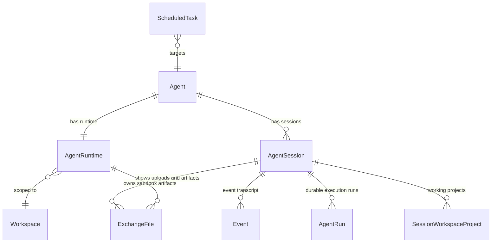

# Conversation & Events

The `conversation` domain owns `AgentSession`, event transcript events, durable
`agent_runs`, input buffers, exchange files, and scheduled task dispatch.

Production agent execution now uses the event runtime. OpenAI Agents SDK `RunState` and legacy
raw `runtime/llm.py` are not production conversation state.

## 1. Domain Model



`AgentSession` is the conversation boundary. Direct session write routes target the requested session.
The default team conversation is the agent's team primary session, represented by
`agent_sessions.primary_kind = 'team_primary'`. Runtime current/active session lookup must not
redirect direct session writes or default team session lookup to another session.

`AgentRuntime` remains the long-lived shared runtime identity and sandbox lifecycle owner. Session
execution control state is stored on `AgentSession`; detailed run phase/tool state is stored in
`agent_runs`. Runtime lifecycle state must not be used as the authority for a session run, pending
command, stop intent, or run heartbeat.

## 2. AgentSession

`rdb/models/agent_session.py` stores session identity and lifecycle.

| Field | Type | Notes |
| --- | --- | --- |
| `id` | `str(32)` | UUID7 hex |
| `workspace_id` / `agent_id` | FK | Workspace and agent boundary |
| `status` | enum | `active` or `archived` |
| `primary_kind` | enum \| null | `team_primary` marks the agent's default team conversation; future non-primary sessions may use `null` or another explicit kind. |
| `start_reason` | enum | `initial`, `system_recovery` |
| `title` | string \| null | Optional user-facing title. `null` means no title is available and clients should render a contextual fallback. |
| `title_source` | enum \| null | `manual`, `auto_initial`, or `auto_generated`; null means no title source yet. |
| `title_generated_at` | timestamptz \| null | Last automatic title generation timestamp. |
| `title_generation_event_id` | `str(32)` \| null | Event used as the automatic title generation boundary. |
| `end_reason` | enum \| null | Archive reason |
| `model_input_head_event_id` | `str(32)` \| null | Event model-input head after append-only compaction |
| `run_state` / `run_heartbeat_at` | enum / timestamptz | Session execution recovery state |
| `pending_command_*` | mixed | Single pending idle command for this session |
| `stop_requested_*` | mixed | Durable stop intent for this session |

Only one team primary session may exist per agent in the current product state. Additional active
non-primary team sessions may exist under the same agent with `primary_kind = null`.
`GET /chat/v1/agents/{agent_id}/sessions` lists active agent sessions with the team primary session
first and the remaining sessions newest-updated first. Each session item includes `run_state` so
azents-web can mark running sessions in the Agent rail session list. `POST /chat/v1/agents/{agent_id}/sessions`
creates an active non-primary team session and snapshot-copies registered projects from the team
primary session. Pending project registration requests are not copied. azents-web Agent detail routes
surface this list in the Agent rail and navigate selected sessions through
`/w/{handle}/agents/{agent_id}/sessions/{session_id}`. Creating a session invalidates the Agent
session list cache and navigates to the newly created session URL.

Each session may have a user-facing `title`. `PATCH /chat/v1/sessions/{session_id}/title`
sets or clears a manual title after workspace membership validation. The request body uses `{ "title":
string | null }`: non-null titles are trimmed and must be non-empty and at most 200 characters; an
explicit `null` clears the title and title source so automatic title generation may run again. Manual
titles set `title_source = manual` and automatic generation must never overwrite them.

Automatic title generation has two phases. When the first user message is promoted into the durable
transcript and the session has no title source, the server stores a deterministic `auto_initial` title
from the beginning of that message. After the first terminal run, the worker uses the Agent's
lightweight model to generate a concise `auto_generated` title from the session transcript. This
replacement is race-safe and only applies while `title_source = auto_initial`; if a user renames the
session before generation completes, the automatic update is skipped. Title generation is best-effort
and failures must not affect run completion. Clients display `title` when present and otherwise fall
back to a contextual label such as "Team primary" or "Session".

`POST /chat/v1/agents/{agent_id}/sessions/{session_id}/archive` archives an active non-primary
AgentSession. Archive is a soft lifecycle transition: durable transcript data, run rows, exchange
files, and project registry rows remain, while the session is removed from active session lists.
Team-primary AgentSessions cannot be archived because they are the stable default conversation anchor
for an Agent. Running sessions cannot be archived; users must stop the run before archiving. Archived
sessions are not part of the current active session UI/API surface.

The Agent rail shows session actions in a row action menu. Rename remains available from that menu
when the title mutation is wired. Archive appears in the same menu only for non-primary sessions that
are not running and opens a confirmation dialog before calling the archive API. If the archived
session is currently selected, the UI returns to `/w/{handle}/agents/{agent_id}/chat`, which resolves
to the team-primary session.

Direct session writes are session-scoped. When a route contains `session_id`, input buffers, live
projections, broker wake-up, and the REST response use that same session id. Runtime current/active
session lookup is invalid for that direct write path and for default team session selection. If any
internal write helper produces a different session id from the REST boundary's resolved target, the
write is invalid and must not enqueue a broker wake-up for that alternate session. `agent_runtime_id`
is not stored on `AgentSession`; runtime lookup happens only after a session target has already been
selected.

### SessionWorkspaceProject

`rdb/models/session_workspace_project.py` stores the project registry used as session working
context. `SessionWorkspaceProject` and `SessionWorkspaceProjectRegistrationRequest` rows are owned by
`AgentSession` through `session_id`. Runtime owns only the physical workspace where project paths
exist.

Project and context inspector routes are session-scoped under
`/chat/v1/agents/{agent_id}/sessions/{session_id}/...`. They validate that the selected session
belongs to the requested agent and that the requester is a workspace member before reading or writing
that session's rows. Runtime lookup is allowed only after that session context is selected, and only
for physical workspace validation or runner filesystem operations. Runtime current project, selected
project, active project, team-primary fallback, and runtime-owned project catalog state are not part of
the conversation contract.

RuntimeToolkit loads registered project prompt content from the current logical `AgentSession` ID.
Runtime context sharing affects shell/file operations; it must not make project registry ownership or
project prompt selection fall back to a parent, team-primary, or runtime session.

## 3. AgentRun

`agent_runs` is the durable execution-state table for the event loop.

| Field | Type | Notes |
| --- | --- | --- |
| `id` | `str(32)` | UUID7 hex run id |
| `session_id` | FK `agent_sessions` | Owning conversation |
| `phase` | enum | UI activity source |
| `active_tool_calls` | JSONB array | `call_id`, `name`, redacted/summarized `arguments`, `started_at`, `background` |
| `created_at` / `updated_at` | timestamptz | Durable lifecycle timestamps |

Phase values are `idle`, `preparing_input`, `waiting_for_model`, `streaming_model`,
`normalizing_output`, `executing_tools`, `appending_events`, `compacting`, and `stopping`.

## 4. Event Transcript Events

Event transcript is the durable source of truth for model/tool/session output. Event payloads are
stored as JSONB and validated by event kind.

Event kinds:

- `user_message`
- `background_completion`
- `assistant_message`
- `reasoning`
- `client_tool_call`
- `client_tool_result`
- `provider_tool_call`
- `provider_tool_result`
- `turn_marker`
- `run_marker`
- `interrupted`
- `compaction_marker`
- `compaction_summary`
- `subagent_start`
- `subagent_end`
- `system_reminder`
- `goal_continuation`
- `goal_updated`
- `goal_briefing`
- `system_error`
- `unknown_adapter_output`

Attachments are payload-specific, not event-common. Tool result output is always a part array using
`output_text`, `output_image`, `output_file`, `output_audio`, or `output_video`.

events have both physical append identity and model-visible order. Physical ids keep the
durable append/audit sequence. `model_order` is scoped to a session and is the ordering/filtering key
used when reading future model input. Sequential appends allocate `model_order` with a gap so later
compaction can place summary/tail events between existing orders without renumbering the whole
transcript. This lets compaction keep append-only storage while presenting a logical order such as
`compaction_summary` followed by preserved raw tail events.

`NativeArtifact.item` is adapter-native opaque payload. Event core does not interpret it.
Same-native pass-through is allowed only when the compat key matches:

```text
adapter:native_format:provider:model:schema_version
```

## 5. History And Live Event APIs

The final `events` table is the durable transcript table. Public chat readers use two separate
event-list APIs:

- `GET /chat/v1/sessions/{session_id}/history` returns persisted transcript events, paginated by
  durable event id. `before` pages older history and `after` pages newer history; the two cursors
  are mutually exclusive. Responses include `has_more` for older pages and `has_newer` for newer
  pages.
- `GET /chat/v1/sessions/{session_id}/live` returns current non-durable live state such as
  streaming assistant text, streaming reasoning, active tool calls, pending input buffers, run state,
  and session todo snapshot.

Both responses use the same event transport shape as the durable transcript. The removed
`/chat/v1/sessions/{session_id}/messages` aggregate endpoint is not part of the public contract:
history, live state, pending input, and activity state must not be recombined into a message-list
schema at the API boundary.

Live projections are stored behind a `LiveEventStore` abstraction. The production implementation uses
Redis, while tests may use the in-memory implementation. Pending input buffers are persisted in the
input-buffer table and are exposed through `/live` as projections with metadata marking the projection
source. Goal continuation starts as a pending `goal_continuation` input buffer and becomes a durable
`goal_continuation` event only when the session runner flushes buffers into the next model input.
`goal_updated` is appended when the user updates the session Goal. User-requested stop appends
`interrupted` before the terminal run marker. The UI must not render these control events as user
bubbles or delete controls; it may render non-interactive timeline indicators such as goal controls or
an interrupted divider.

Session todo is persisted in `toolkit_states`, not in the transcript. `/live` and REST write snapshots expose it as `todo: { items }`; each item has `content` and status `pending`, `in_progress`, or `completed`. The worker also broadcasts `todo_state_changed` after `update_todo` so the chat UI can update without a separate todo read API.

WebSocket chat clients receive subscription and event actions:

- `subscribed` after the server has registered the session broadcast subscription;
- `subscription_health_check_ack` for visible-state subscription reconcile requests;
- `history_event_appended` for newly persisted transcript events;
- `live_event_upserted` for current live projections;
- `live_event_removed` when a projection is no longer current;
- `todo_state_changed` when the session-scoped TodoToolkit State changes.

Durable/live handoff follows these invariants:

- `history_event_appended` is renderable event state and clients must not skip tool calls only
  because the event arrived through the history action.
- `live_event_removed` removes only the live projection. It must not remove a durable view model that
  has already been promoted from `history_event_appended`.
- When a durable event has a matching live counterpart, the worker publishes the history
  append action before publishing the live removal action.
- If the same semantic entity is present in both durable history and live projection, durable history
  wins for rendering.

Text and reasoning streaming projections are server-side batched before live store upsert and
`live_event_upserted` broadcast. The worker flushes pending `ContentDelta` and `ReasoningDelta`
batches before event durable boundaries and terminal runtime boundaries. Redis stores only the
latest live projection, not every provider delta.

Legacy chat UI deltas and input-buffer notifications such as `content_delta`,
`reasoning_delta`, `function_call_delta`, `run_started`, `run_phase_changed`, `input_buffered`, and
`input_buffer_deleted` are not frontend state contracts.

## 6. Input Buffers And Session Inputs

Chat route input buffers are flushed before model-call boundaries and promoted to durable session
input. Session runner payload ingress uses input buffers. The supported input buffer kinds are
`user_message`, `edited_user_message`, `background_completion`, and `goal_continuation`. Broker
messages do not carry model input payloads.

Input buffers are session-bound. The `input_buffers` table stores `session_id`, not
`agent_runtime_id`. Runtime-specific columns or runtime-scoped buffer queries are invalid because the
buffer is part of the conversation, not the sandbox lifecycle.

`InputBufferService` owns all input-buffer reads and writes. Public chat routes, worker idle
continuation, session runner flushing, and tests should go through this service instead of calling
`InputBufferRepository` directly, except where repository tests or migrations explicitly exercise the
storage layer. Service methods are responsible for these transaction boundaries:

- enqueueing or moving buffers to a session marks `agent_sessions.run_state` as `running` in the same
  database transaction as the buffer mutation;
- flushing buffers claims the session-bound pending set, appends the corresponding durable events,
  and deletes the claimed buffers after successful promotion;
- buffer idempotency is scoped to `(session_id, kind, idempotency_key)` when an idempotency key is
  present.

The durable event kind is determined by buffer kind at flush time:

| Input buffer kind | Durable event kind |
| --- | --- |
| `user_message` | `user_message` |
| `edited_user_message` | `user_message` |
| `background_completion` | `background_completion` |
| `goal_continuation` | `goal_continuation` |

Wake-up delivery is a signal only. The persisted buffer plus the `running` state transition is the
recovery source of truth if the signal is lost.

Web chat message/edit/command writes use REST commit endpoints instead of WebSocket write payloads.
`GET /chat/v1/agents/{agent_id}/team-primary-session` resolves or creates the agent's team
primary session and returns its `session_id`.
`GET /chat/v1/agents/{agent_id}/sessions/{session_id}` validates that a URL-selected session belongs
to the path agent and is visible to the requester; session missing, agent/session mismatch, and access
denied all return 404.
`POST /chat/v1/sessions/{session_id}/messages` appends a user message input to an existing session.
`POST /chat/v1/sessions/{session_id}/edit-message` and
`POST /chat/v1/sessions/{session_id}/commands` are idle-only control boundaries. All REST write
requests require `client_request_id`; accepted writes are recorded in `chat_write_requests` so
retries with the same key return the same accepted target instead of creating duplicate side effects.
REST write idempotency is scoped to `(session_id, user_id, client_request_id)`. The same
`client_request_id` may be reused independently for different explicit session routes because the URL
session is the write boundary. Message writes commit a `user_message` input buffer
to the explicit path session before returning success, mark the same session running through
`InputBufferService`, then send a worker wake-up signal for that session. The message path must not
resolve runtime current/active session state to replace the requested `session_id`. Edit writes
rewrite durable history state, clear pending input buffers, commit an
`edited_user_message` input buffer, mark the session running through `InputBufferService`, and send a
wake-up for the explicit path session. Command writes do not enter the input buffer; they store a
single pending command on `agent_sessions`, mark the explicit path session running, and send a wake-up
for that session. Signal delivery is not the persistence source of truth. REST write
responses include `session_id`, `client_request_id`, an accepted target, an authoritative live
snapshot, and `history_reload_required` for writes such as edit/command that require durable history
reload.

WebSocket chat connections are existing-session live subscription channels. They publish
subscription/history/live event actions and accept only the `subscription_health_check` control
message for subscription reconcile. Chat input, edit, command, and stop payloads are not accepted on
WebSocket. Stop is a REST control boundary: `POST /chat/v1/sessions/{session_id}/stop`.
Stop records a durable `agent_sessions.stop_requested_at` intent and sends a best-effort broker stop
signal so an active runner can cancel immediately. Runner polling of the DB intent covers broker
signal loss.
`/chat/v1/sessions/new` is not a WebSocket write or subscription route. Web clients first resolve
the team primary session through `GET /chat/v1/agents/{agent_id}/team-primary-session`, navigate to
`/w/{handle}/agents/{agent_id}/sessions/{session_id}`, and then write through
`POST /chat/v1/sessions/{session_id}/messages`. Legacy message/edit/command/stop
WebSocket compatibility paths are not part of the public contract and must not create input buffers,
edits, commands, stop requests, or compatibility error responses.

User messages preserve durable `content`, payload-specific `attachments`, and `metadata` in event
`user_message` payloads. Adapter lowerers may render headers or attachment context into model input,
but that model-visible rendering is not stored by mutating the event content text.

## 7. Exchange Files And Attachments

Exchange files remain the durable user-visible file/artifact surface. Generated model image/file output
is represented in event transcript as provider tool call/result events with attachments.

## 8. Compaction

Compaction is append-only. It appends `compaction_marker` and `compaction_summary`, keeps old events
for UI/audit, and moves `agent_sessions.model_input_head_event_id` to the summary id so future model
input starts from the compacted head.

Future model input is selected and sorted by event `model_order`. Automatic compaction
excludes preserved tail turns from the summary text and assigns the summary an intermediate model
order before the preserved tail. The input builder can therefore read the normal model-input range
without a dedicated compaction branch while the model still sees `compaction_summary` followed by the
preserved raw tail. Manual compaction and fallback compaction do not preserve a separate raw tail.

## 9. Invariants

- `AgentSession` is the conversation boundary; interface type is not a session partition.
- Event transcript is the durable model/tool source of truth.
- Native artifacts are opaque replay optimizations, never event state.
- `agent_runs.phase` and `active_tool_calls` are the durable UI activity source.
- Public chat UI state is restored from `/history`, `/live`, and event WebSocket actions, including session todo state.
- Existing transcript/session data migration is not required for the private service cutover.
- Web chat message/edit/command writes have a single REST commit boundary; WebSocket is not a fallback write path.
- Web chat stop has a single REST control boundary; WebSocket is not a fallback stop/control path.
- `client_request_id` retry for chat writes must converge to the same accepted target without duplicate side effects.
- Input buffers are session-bound and must not store or require `agent_runtime_id`.
- Any service path that enqueues input buffers must mark `agent_sessions.run_state` as `running` in
  the same transaction.

## 10. Verification

Current verification:

- `cd python/apps/azents && uv run pytest src/azents/runtime -q`
- `cd python/apps/azents && uv run pyright`
- `cd testenv/azents && uv run pytest testenv/tests -q`
- deterministic azents E2E CI for public chat/tool behavior
- `cd testenv/azents/e2e && uv run pyright src/tests/azents/public/test_chat_input_buffer.py`
- REST chat write verification evidence is recorded in `docs/azents/design/rest-chat-write-boundary.md`; preemptive stop audit and E2E coverage evidence is recorded in `docs/azents/design/preemptive-user-stop-phase6-audit.md` and `docs/azents/design/preemptive-user-stop-phase7-verification.md`. Docker/testcontainers blocker #4468 and browser-runner blocker #4469 track scenarios that could not run in the current agent runtime.

## 11. Changelog

- **2026-06-25** — v60. Moved coarse run state, run heartbeat, pending command, and stop intent
  ownership from `AgentRuntime` to `AgentSession`; `AgentRuntime` remains shared sandbox lifecycle
  state.
- **2026-06-20** — v59. Documented session-bound input buffers, removed runtime-bound buffer
  ownership from the spec, and defined the `InputBufferService` transaction boundary for running-state
  transitions and goal continuation promotion.
- **2026-06-13** — v54. Added session todo snapshot and `todo_state_changed` WebSocket event to Chat live state. Todo is side state stored in `toolkit_states`, not durable transcript/compaction state.
