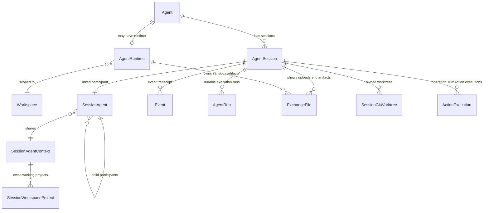

# Conversation & Events

The `conversation` domain owns `AgentSession`, event transcript events, durable
`agent_runs`, mailbox items, and exchange files.

Production agent execution now uses the event runtime. OpenAI Agents SDK `RunState` and legacy
raw `runtime/llm.py` are not production conversation state.

Root `AgentSession` rows have an explicit product mode of Team or User. Team roots keep shared
Workspace-member visibility and Team primary behavior. User roots are private to one associated User,
never carry a primary role, and authorize only that owner while the owner remains a Workspace member.
Subagent sessions derive product identity from their root and do not store an independent product mode
or associated User. A Human `sender_user_id` remains immutable provenance for one admitted input and is
not an execution identity. The Session, Agent, Workspace, root tree, Run, owner generation, and durable
work selection are the only authority for internal execution. No execution layer infers ownership from
a sender, requester, broker signal, Agent creator, Workspace owner, viewer, approver, uploader, or
fallback.

## 1. Domain Model


```mermaid
erDiagram
    Agent ||--o| AgentRuntime : "may have runtime"
    Agent ||--o{ AgentSession : "has sessions"
    AgentRuntime }o--|| Workspace : "scoped to"
    AgentSession ||--|| SessionAgent : "linked participant"
    SessionAgent ||--o{ SessionAgent : "child participants"
    SessionAgent }o--|| SessionAgentContext : "shares"
    SessionAgentContext ||--o{ SessionWorkspaceProject : "owns working projects"
    AgentSession ||--o{ Event : "event transcript"
    AgentSession ||--o{ AgentRun : "durable execution runs"
    AgentSession ||--o{ ExchangeFile : "shows uploads and artifacts"
    AgentSession ||--o{ SessionGitWorktree : "owned worktrees"
    AgentSession ||--o{ ActionExecution : "operation TurnAction executions"
    AgentRuntime ||--o{ ExchangeFile : "owns sandbox artifacts"
```

`AgentSession` is the conversation boundary. Direct session write routes target the requested session.
The default team conversation is the agent's team primary session, represented by
`agent_sessions.primary_kind = 'team_primary'`. Runtime current/active session lookup must not
redirect direct session writes or default team session lookup to another session.

`AgentRuntime` is an optional long-lived shared managed-execution identity and lifecycle owner.
Runtime-free Agents execute model and compatible server/remote work without creating this row.
Session execution control state is stored on `AgentSession`; detailed run phase/tool state is stored
in `agent_runs`. Runtime lifecycle state must not be used as the authority for a session run,
pending command, stop intent, or run heartbeat.

`SessionAgent` is the session-scoped participant tree used by subagents. It does not replace
`AgentSession`; every participant links one-to-one to an `AgentSession`, and the linked session owns
that participant's transcript, runs, mailbox items, Goal, Todo, Toolkit State, Skill projection,
ModelFiles, artifacts, and exchange files.

`SessionAgentContext` is the shared root-tree working-context boundary. The root
`SessionAgent` and every descendant subagent retain the same `context_id`.
`session_agent_context_projects` therefore owns authoritative Project membership;
the Session-scoped Project APIs resolve the selected Session to that context and
return compatibility projections. A subagent never reapplies Agent defaults or
creates duplicate Project rows independently.

Its managed working-folder binding is an independent lifecycle:

- `none` — the root was created while Runtime-free and has no path;
- `pending` — the root was created while managed but has not yet bound to current Runner evidence;
- `bound` — the context owns one exact path under the current Runner-reported Agent Workspace; and
- `invalidated` — permanent Runtime removal terminally revoked the historical binding.

Only `pending` may become `bound`, using current-generation Runner evidence. `none` and
`invalidated` never bind after a later Runtime add.

## 2. AgentSession

`rdb/models/agent_session.py` stores session identity and lifecycle.

| Field                                                                                            | Type                  | Notes                                                                                                                             |
| ------------------------------------------------------------------------------------------------ | --------------------- | --------------------------------------------------------------------------------------------------------------------------------- |
| `id`                                                                                             | `str(32)`             | UUID7 hex                                                                                                                         |
| `handle`                                                                                         | string                | Human-readable, BIP-39-derived session handle used for user-facing allocation names such as owned Git worktree paths.             |
| `workspace_id` / `agent_id`                                                                      | FK                    | Workspace and agent boundary                                                                                                      |
| `applied_model_target_label` / `applied_reasoning_effort`                                        | string / enum \| null | Session-owned applied label and nullable effort used by future implicit main-model turns; null applied label means inherit the Agent main-model mapping. |
| `current_model_target_label` / `current_reasoning_effort`                                        | string / enum \| null | Prepared-turn label and effort for the immutable current provider call or retry/recovery; this is not the public applied intent.                    |
| `current_model_selection` / `current_model_settings`                                            | JSONB \| null         | Complete prepared physical model and model-scoped settings snapshot for the current call.                                                          |
| `current_effective_context_window_tokens` / `current_effective_auto_compaction_threshold_tokens` | int \| null           | Effective limits stored with the prepared physical snapshot.                                                                                         |
| `current_inference_resolved_at`                                                                  | timestamptz \| null   | Resolution time for the complete prepared-turn snapshot.                                                                                            |
| `session_kind`                                                                                   | enum                  | `root` or `subagent`; ordinary session lists include only `root` sessions                                                         |
| `status`                                                                                         | enum                  | `active` or `archived`                                                                                                            |
| `primary_kind`                                                                                   | enum \| null          | `team_primary` marks the agent's default Team conversation. User Sessions always store `null` and never become Team primary.      |
| `product_mode`                                                                                   | enum \| null          | Root-only `team` or `user`. Subagent rows store `null` and derive identity from the root. Existing roots were backfilled to Team. |
| `associated_user_id`                                                                             | FK \| null            | Required for User roots; null for Team roots and all subagents. Not a client-selectable field.                                    |
| `start_reason`                                                                                   | enum                  | `initial`, `system_recovery`                                                                                                      |
| `title`                                                                                          | string \| null        | Optional user-facing title. `null` means no title is available and clients should render a contextual fallback.                   |
| `title_source`                                                                                   | enum \| null          | `manual`, `auto_initial`, or `auto_generated`; null means no title source yet.                                                    |
| `title_generated_at`                                                                             | timestamptz \| null   | Last automatic title generation timestamp.                                                                                        |
| `title_generation_event_id`                                                                      | `str(32)` \| null     | Event used as the automatic title generation boundary.                                                                            |
| `last_user_input_at`                                                                             | timestamptz           | Latest non-reverted `user_message` timestamp used for session list ordering; initialized to `created_at` until user input exists. |
| `end_reason`                                                                                     | enum \| null          | Archive reason                                                                                                                    |
| `model_input_head_event_id`                                                                      | `str(32)` \| null     | Event model-input head after append-only compaction                                                                               |
| `run_state` / `run_heartbeat_at`                                                                 | enum / timestamptz    | Session execution recovery state                                                                                                  |
| `pending_command_*`                                                                              | mixed                 | Single pending idle command for this session                                                                                      |
| `stop_requested_*`                                                                               | mixed                 | Durable stop intent for this session                                                                                              |

Only one team primary session may exist per agent in the current product state. Additional active
non-primary team sessions may exist under the same agent with `primary_kind = null`.
`GET /chat/v1/agents/{agent_id}/sessions` is the bounded Team session directory read. Its
`status=active|archived`, `offset`, and `limit` query parameters select one Team root-session page and
return `items`, `total_count`, `offset`, `limit`, and current archive-retention policy metadata.
Active rows place the team primary session first, then pinned non-primary Team sessions, then unpinned
Team sessions. Each non-primary group orders by persisted `last_user_input_at`, then `updated_at`,
with a stable session-id tie breaker. Archived rows order by
`archived_at`, then `updated_at`, with the same tie breaker. Active rows retain unread terminal-run
and automatic-archive projections; archived rows retain archive time, purge deadline, and the
immutable retention snapshot. `GET /chat/v1/agents/{agent_id}/sessions/sidebar` returns every pinned
active Team root session plus at most 20 distinct recent non-pinned active Team root sessions in
separate `pinned` and `recent` arrays; it never returns User, archived, or subagent sessions. Both
reads validate Agent membership and are side-effect free: they never ensure or create a Team-primary
Session and never wait for Runtime state. Each session item includes `run_state` so azents-web can
mark running sessions in the Agent rail session list. `POST
/chat/v1/agents/{agent_id}/sessions` creates an active non-primary team session. The current request
shape is `existing_project_paths` plus ordered `setup_actions`.
`existing_project_paths` registers explicit Project paths supplied by the client and does not copy
Projects from the team primary session. Each `create_git_worktree` setup action is stored as an
ordered `action_message` input before the first user message; the action execution creates an
Azents-owned Git worktree from the source Project path and starting ref before registering the created
worktree as a session Project. Legacy `workspace_items`, `workspace_mode`, and `project_paths` request
fields are not part of the current contract.

Every root creation call selects exactly one workspace intent. Explicit intent uses
the caller's `existing_project_paths`, including an explicitly empty list, and never merges the
Agent policy. Non-empty paths and setup actions require managed Runtime authority and are normalized
under the current Runner-reported Agent Workspace root. Agent-default intent reads the current
ordered automatic Project policy and snapshots it into the new
`SessionAgentContext`. Root creation writes the AgentSession, root SessionAgent,
context, and context Projects in the caller-owned transaction without Runtime I/O. A Runtime-free
root with empty intent receives binding state `none`; a managed root receives `pending` until an
authorized Runtime-dependent operation binds it.
Root creation reads the Agent lifecycle, Runtime capability, and capability version
without retaining a preliminary Agent row lock. After the Runtime FK-dependent
context write, one final conditional Agent update revalidates the exact authority.
A concurrent lifecycle or capability transition rejects and rolls back the entire
root tree, while Runtime-first reconciliation can complete without a cross-row lock
cycle.
The creation result may report the source policy revision for transaction-local
provenance; the durable authority is the context Project snapshot.

Team-primary ensure applies Agent-default intent only to the unique insert winner.
A concurrent loser or any later ensure reuses the existing team-primary Session and
its immutable context snapshot rather than rereading policy. External Channel root
creation also uses Agent-default intent. Ordinary Public API/Web non-primary
creation remains explicit.

`POST /chat/v1/agents/{agent_id}/sessions/messages` creates the same kind of non-primary Team session
and enqueues setup action inputs plus the first user message in one write boundary.
`POST /chat/v1/agents/{agent_id}/user-sessions/messages` performs the equivalent atomic admission for a
User root: it associates the authenticated requester, stores no primary role, and returns
`ChatWriteResponse` with the created `session_id`. Setup action inputs remain ahead of the user message
in FIFO order. Successful Project-mutating action execution gates the first model run until context can
be rebuilt from the updated Project registry; failed actions are marked failed and FIFO processing
continues to the first user message.

Public Session read, write, control, live/history subscription, archive/restore, tree, and download
boundaries authorize Team Sessions by Workspace membership and User Sessions by owner match. Denied
User Session identifiers return not-found-safe responses without revealing private metadata.

While Agent capability is `removing`, new input, Session creation/recovery, subagent work, queued
Runtime actions, and ordinary execution fail closed across Team and private User trees. Permanent
removal retains conversations, product mode, owner privacy, pin/archive state, Memory, Goals, Todos,
Exchange files, ModelFiles, and Artifacts. It deletes context Project/worktree metadata and changes
every pre-removal `pending` or `bound` folder binding to `invalidated`; retained contexts never
regain Workspace authority after re-add.

azents-web Agent detail routes surface Team and My Sessions tabs in the Agent rail. The Team tab uses the
bounded pinned/recent sidebar summary and exposes an All sessions link to the paginated active/archived
Team directory; the Agent profile link opens that same Team directory, while the My tab uses the
owner-scoped active User Session list. Team mutations invalidate the paginated directory and bounded
sidebar summary, while My mutations invalidate the owner-scoped User Session list. Selected sessions
navigate through `/w/{handle}/agents/{agent_id}/sessions/{session_id}`.
Team create navigates to `/w/{handle}/agents/{agent_id}/sessions/new`. My create navigates to
`/w/{handle}/agents/{agent_id}/sessions/new?scope=user`. The draft route renders a Team/My scope
selector initialized from that route state, defaults to Team when absent or invalid, and updates the
route state without creating or mutating a Session. The selected scope chooses the existing Team or
requester-owned User first-message admission boundary. Both draft routes must not create an
`AgentSession` row until the first accepted message. The draft route renders the Agent top bar plus the
chat input surface, but it does not render session-scoped Projects or Context tabs. The draft composer
shows a compact additive workspace selector where repository folders are added to one list and each
selected folder can switch between repository and new worktree modes from the row-level type selector.
Azents-owned concrete worktrees remain registered in the session where they are selected but are excluded
from reusable Project defaults and presets. Explicit new-worktree items persist their source Project and
mode as the reusable default. The worktree base branch picker refreshes Git refs when mounted, selects
the source Project's currently checked-out local branch by default, supports branch-name search, and
shows local branches only. On first-message success, azents-web replaces the draft URL with the created
session URL and invalidates the relevant User Session list plus both Team directory/sidebar caches.

The draft and concrete-session headers project subscription usage for the currently selected
Agent-owned model option when its provider is `chatgpt_oauth`, `xai_oauth`, `openrouter`, or
`kimi_oauth`. The header resolves the option's stored integration ID, reuses the integration-scoped
subscription-usage query, and switches query identity when the composer model changes. Other API-key
and unsupported providers do not render the affordance or request usage. OpenRouter participates only
when its API key has a bounded credit limit; a successful snapshot with a `null` limit or
remaining-limit value has no displayable limits and renders no header affordance. Desktop and mobile
open operational details from the compact header status in an independent usage popover. Available
limits, loading, stale, unavailable, and trusted external states remain local to the usage projection
and never disable model selection or message submission. The session surface exposes no financial
details. Manual refresh, the existing 60-second query freshness policy, focus revalidation, no
automatic retry, and last-successful stale projection remain shared with Workspace LLM Settings.

Concrete-session composers place the context-window usage ring beside the composer controls. Activating
it opens the desktop model popover or mobile model bottom sheet and automatically scrolls to the latest
durable or active-run context-window details. Root-session pickers render model and reasoning-effort
controls above those details. Read-only subagent pickers render only the context-window details, so the
context ring remains inspectable without exposing an inference-profile mutation path.

Each session may have a user-facing `title`. `PATCH /chat/v1/sessions/{session_id}/title`
sets or clears a manual title after workspace membership validation. The request body uses `{ "title":
string | null }`: non-null titles are trimmed and must be non-empty and at most 200 characters; an
explicit `null` clears the title and title source so automatic title generation may run again. Manual
titles set `title_source = manual` and automatic generation must never overwrite them.

Automatic title generation has two phases. When the first eligible input is promoted into the durable
transcript and the session has no title source, the server stores a deterministic `auto_initial` title
from the beginning of that input. Ordinary Sessions use the first `user_message`. A newly created
External Channel root Session may instead use only the creation-marked human
`authorized_invocation` event; surrounding context, later invocations, Bots, Agent output, and tool
results are ineligible. Its title text is limited to the authorized body and bounded safe attachment
names and media types without reading attachment contents. The worker then immediately schedules
best-effort lightweight model title generation from that exact initial prompt without waiting for the
first run to complete. The Agent's saved lightweight-model snapshot selects the response envelope:
`strict_json_schema = true` uses only a strict one-field Structured Output contract, `false` uses only
title-only plain text, and `null` starts with Structured Output. The unknown branch changes once to
plain text only when a typed provider parameter or code identifies that output contract as unsupported
or unroutable, or when a successful response cannot be decoded as the required title object.
Authentication, rate limiting, timeout, transport, provider availability, and other operational
failures retain the active mode and existing provider retry policy. Every request keeps the same saved
provider integration and model. Shared instructions preserve request-named products, tools, filenames,
and technical terms and tell the model to ignore platform markup used only to address the Agent
without rewriting the canonical input.

The resulting concise `auto_generated` title only replaces the deterministic title while
`title_source = auto_initial` and `title_generation_event_id` still points at the same initial prompt
event. Manual title updates or clears therefore remain authoritative, while long-running first turns
do not delay automatic title generation. Title generation and any post-commit External Channel title
projection failures must not affect run execution.
Clients display `title` when present and otherwise fall back to a contextual label such as "Team
primary" or "Session". Concrete session route top bars show this session title while preserving the
Agent avatar/icon affordance, and expose an inline title edit action that calls the manual title update
endpoint. The Web document title mirrors the displayed session title as `{session title} - Azents`.

`POST /chat/v1/agents/{agent_id}/sessions/{session_id}/archive` archives the complete root
`SessionAgent` tree for an active non-primary root session. The service locks the root and descendant
sessions in stable order and rejects the request while any subtree session or `AgentRun` is active.
Team-primary roots cannot be archived because they remain the stable default conversation anchor for
an Agent.

Every Session has a non-null `last_activity_at` baseline and a root-level `pinned` flag. Durable user,
Agent, and tool transcript events advance `last_activity_at` monotonically; list ordering remains
based on the separate user-input projection. One mailbox promotion batch advances both projections
with one conditional Session update based only on newly inserted events. Session updates and retained
Session row locks acquire the referenced Agent in FK-compatible `KEY SHARE` mode first, preserving one
`Agent -> AgentSession` lock order across input admission and promotion. An Agent's positive
`auto_archive_ttl_days` configuration defaults to 30 days. The `session_auto_archive` scheduler task considers only active, non-primary,
unpinned root Sessions, locks each complete tree, and rechecks the current Agent TTL, root pin,
maximum `last_activity_at` across all tree Sessions, subtree run state, and active runs. A tree is
eligible only when its maximum activity is at least the configured TTL in the past. It then invokes
the same archive lifecycle as manual archive, including retention snapshot, lifecycle participants,
external-channel cleanup, and post-commit worktree cleanup. Pinning is preserved through archive and
restore and only excludes automatic archive; it never changes manual archive eligibility.

The active Agent-session list projects `auto_archive_after` from the maximum `last_activity_at`
across each complete root tree plus the Agent's current TTL. Team-primary and pinned roots project
null because automatic archive does not apply to them. The Agent rail shows an Archives soon badge
when the projected deadline is within `min(floor(auto_archive_ttl_days / 2), 5)` whole days. A
zero-day result disables the badge, so a one-day TTL has no warning badge. Active Sessions whose
deadline has already passed remain marked until the asynchronous archive transition completes.

`PATCH /chat/v1/agents/{agent_id}/sessions/{session_id}/pin` accepts `{ "pinned": boolean }` for an
accessible active non-primary root Session and returns the updated Session projection. Subagent
Sessions are read-only, while inactive and team-primary roots are not found or rejected,
respectively. The Agent rail shows a pin icon on protected Sessions and offers Pin or Unpin from the
non-primary root Session action menu.

Archive snapshots the current instance retention revision, whole-day value, `archived_at`, and finite
`purge_after` deadline on the root. Unlimited retention stores a null deadline and snapshot value.
Every linked descendant `AgentSession` is marked archived so direct worker, command, input, wake-up,
and recovery boundaries can reject it without resolving the tree again. Zero-day retention completes
the archive transaction and only makes the root eligible for the next asynchronous purge pass.
Archive preserves durable transcript data, run rows, and file metadata. After the complete archive
transaction commits, it makes one best-effort forced cleanup attempt for every non-cleaned
Azents-owned worktree allocation in the root tree. The attempt may remove modified or untracked
contents, the Azents-created branch, linked Project and catalog rows, and an empty session-scoped
worktree parent directory. Runtime unavailability, Git failure, ownership mismatch, or any other
cleanup failure is logged and may remain in allocation state, but it does not roll back archive,
change the successful response, or create retention retry work. A crash or cancellation after commit
may skip the attempt. Restore does not recreate a worktree removed during archive.

`GET /chat/v1/agents/{agent_id}/sessions?status=archived` returns archived roots as one paginated
directory status. Each item includes `archived_at`, `purge_after`, and the immutable retention
snapshot; the page response also includes the current instance retention value as policy metadata.
`POST /chat/v1/agents/{agent_id}/sessions/{session_id}/restore` restores the complete tree only while
the root purge job has not started fencing. Restore cancels eligible unstarted purge work, clears the
root archive snapshot, marks every linked session active, and returns the root session. A root that
has crossed the purge fence returns a conflict and cannot become active again.

The Agent rail keeps rename and the archive-backed removal action in the existing session action
menu. The action is available only for inactive non-primary roots. Main Web labels it Delete, uses a
trash icon, and confirms only that the session will be removed from the list; the confirmation omits
retention, preservation, restoration, and permanent-deletion claims. The mutation still archives the
root tree. The bounded sidebar renders separate Pinned and Recent groups from the sidebar summary,
never requests archived rows, visually treats those groups as subordinate to the Sessions section,
and exposes an All sessions link to
`/w/{handle}/agents/{agent_id}/sessions`. The directory supports `?status=active|archived&page=N`,
page navigation through Mantine's Pagination control, direct session links, and Restore on archived
rows. It shares the Agent context header and content inset used by other Agent detail screens. If the
selected session is archived, Main Web navigates to
`/w/{handle}/agents/{agent_id}/sessions/new`.

The public `DELETE /chat/v1/sessions/{session_id}` route is absent. Permanent database deletion is
owned only by durable purge after fencing. Purge deletes subtree ModelFile, Artifact, bound
ExchangeFile and preview blobs, broker state, lifecycle context rows, worktree allocation rows, and
the database Session subtree. It never asks a Runtime Runner or Runtime provider to inspect or mutate
a Git repository, branch, path, or worktree, and physical Git state cannot block deletion.
`session.git-worktrees@1` remains in durable participant snapshots as a database-only compatibility
tombstone: incomplete legacy checkpoints advance normally without Runtime access and unblock
`session.context`. Its allocation table is a pure database child deleted explicitly by the finalizer
before restrictive context rows, regardless of recorded cleanup status.
Irreversible purge fencing also snapshots the required participant keys and policy versions. A fenced
job executes only that immutable snapshot across retries and deployments; later registry additions
apply only to newly fenced jobs. Persisted keys, policy versions, and dependencies must remain
supported, and an unsupported snapshot remains retryable rather than silently changing its required
work.

Direct session writes are session-scoped. When a route contains `session_id`, mailbox items, live
projections, broker wake-up, and the REST response use that same session id. Runtime current/active
session lookup is invalid for that direct write path and for default team session selection. If any
internal write helper produces a different session id from the REST boundary's resolved target, the
write is invalid and must not enqueue a broker wake-up for that alternate session. `agent_runtime_id`
is not stored on `AgentSession`; runtime lookup happens only after a session target has already been
selected.

### SessionAgent

`rdb/models/session_agent.py` stores the live participant tree for one root session. A root
`AgentSession` has one root `SessionAgent` with path `/root`. `spawn_agent` creates child or nested
`SessionAgent` rows with `kind = subagent`, a linked hidden `AgentSession` whose `session_kind` is
`subagent`, and the same workspace and Agent boundary as the parent session. Spawn request validation,
profile derivation, child participant/session/run creation, selected context append, and initial
mailbox input commit atomically. Invalid target labels, unsupported explicit effort, full-history
profile overrides, invalid fork selections, or incomplete parent run provenance leave no child
participant, session, run, activity event, or broker wake-up.

| Field                                                    | Type                    | Notes                                                                                                                               |
| -------------------------------------------------------- | ----------------------- | ----------------------------------------------------------------------------------------------------------------------------------- |
| `id`                                                     | `str(32)`               | SessionAgent ID                                                                                                                     |
| `context_id`                                             | FK                      | Root-tree context shared by all participants in the tree                                                                            |
| `root_session_agent_id`                                  | FK self                 | Root participant for this tree                                                                                                      |
| `agent_session_id`                                       | FK `agent_sessions`     | One-to-one linked transcript/execution session                                                                                      |
| `kind`                                                   | enum                    | `root` or `subagent`                                                                                                                |
| `name`                                                   | string                  | Tree-local name segment. Child names must start with a letter or number and contain only letters, numbers, underscores, or hyphens. |
| `path`                                                   | text                    | Canonical absolute path under `/root`                                                                                               |
| `agent_type`                                             | string                  | Spawned agent type snapshot. Current supported value is `default`.                                                                  |
| `parent_session_agent_id`                                | FK self \| null         | Parent participant; null only for the root participant                                                                              |
| `last_task_message`                                      | text \| null            | Latest delegated task/message preview                                                                                               |
| `parent_observed_run_index` / `parent_observed_event_id` | int / `str(32)` \| null | Monotonic cursor advanced only when a terminal `agent_result` is promoted into the direct parent's durable transcript.              |

The tree enforces unique `(root_session_agent_id, path)` and `(parent_session_agent_id, name)`. The
repository resolves absolute paths such as `/root/reviewer` and current-agent-relative child paths.
It never resolves across root trees. Ordinary agent session list APIs filter to `session_kind = root`,
so child sessions stay hidden from the Agent rail while remaining directly readable through authorized
history, live, and detail routes.

### SessionWorkspaceProject

`rdb/models/session_workspace_project.py` stores the project registry used as session working
context. `SessionWorkspaceProject` rows are owned by `AgentSession` through `session_id`.
Runtime owns only the physical workspace where project paths exist.

Project and context inspector routes are session-scoped under
`/chat/v1/agents/{agent_id}/sessions/{session_id}/...`. They validate that the selected session
belongs to the requested agent and that the requester is a workspace member before reading or writing
that session's rows. Runtime lookup is allowed only after that session context is selected, and only
for physical workspace validation or runner filesystem operations. Runtime current project, selected
project, active project, team-primary fallback, and runtime-owned project catalog state are not part of
the conversation prompt contract. The Agent Project catalog is only a reusable path/status projection
for browser and new-session preview UI; session Project rows remain the prompt-eligibility source.

RuntimeToolkit loads registered project prompt content from the current logical `AgentSession` ID.
Runtime context sharing affects shell/file operations; it must not make project registry ownership or
project prompt selection fall back to a parent, team-primary, or runtime session.

### ActionExecution and SessionGitWorktree

The legacy setup lifecycle tables are no longer part of the current conversation model. Setup work that affects a session is represented by
operation TurnActions carried through FIFO `action_message` mailbox envelopes, and ordinary sessions have
no separate setup baseline row. An action input remains queue transport rather than becoming a durable
`action_message` transcript event. Goal and Skill actions atomically apply their side effects and
append their canonical model-visible events during preparation. A `create_git_worktree` action is
atomically claimed as an `ActionExecution` before its source mailbox envelope is deleted. A Project-mutating
action that succeeds invalidates the prepared context; the same active `AgentRun` rebuilds its
turn-local request from the updated Session inference snapshot before the next model call. Failed
actions are terminal and do not block later FIFO input.

The Agent-facing `create_git_worktree` and `remove_git_worktree` tools are a closed bridge exception
to that ordinary same-Run invalidation contract. Their handlers enqueue internal
`agent_create_git_worktree` or `agent_remove_git_worktree` action mailbox items under the current
client-tool call identity and return only durable acceptance. The action terminal transaction appends
the ordinary visible `action_execution_result`, enqueues one hidden
`turn_action_continuation` mailbox item keyed by execution ID, and deletes live execution state
atomically. Its bounded continuation payload contains terminal worktree facts but not raw command
output, credentials, or internal exceptions.

`turn_action_continuation` uses `wake_session` scheduling and is omitted from pending human-message
presentation. It may promote only after its recorded predecessor Run is terminal. Promotion
atomically deletes the mailbox row and appends one invisible `system_reminder` event with a
deterministic external identity, making the turn eligible for inference. The action result remains
the user-visible history authority; the reminder is model input only. Replay exposes either the
pending mailbox row or the promoted event, never duplicate continuation input.

`action_executions` stores live operation TurnAction state keyed by the source
`source_mailbox_item_id` and
includes the typed action payload plus the admitting Session `owner_generation`.
`action_execution_events` stores its ordered live progress records such as step start, command
start/completion, stdout/stderr text, warning, failure, and completion. `GET
/chat/v1/sessions/{session_id}/live` and REST write snapshots expose these active projections.

Completion, failure, or cancellation atomically appends one durable `action_execution_result` snapshot
with deterministic identity `action_execution_result:{execution_id}` and deletes the live execution
and progress rows. Terminal state is therefore owned only by transcript history. A worker takeover
cancels leftover active operations before new work and never replays their potentially completed side
effects. Failed and cancelled actions are not retried or discarded through a separate mutation API.

`session_agent_context_git_worktrees` is the cleanup authority for Azents-owned worktrees. It stores the source
Project path, starting ref, generated worktree path, generated branch name, base commit, status,
failure summary, cleanup summary, and the owning action execution when the worktree came from a
TurnAction. Worktree creation uses typed Runner Git operations, registers exactly the created path in
`session_agent_context_projects`, and upserts the Agent Project catalog entry without updating
last-created-session defaults. Existing Project selections still refresh presets/defaults directly;
worktree actions refresh source-path presets and register only the created worktree path as prompt
context. Generated paths are allocated under
`<current-agent-workspace>/.azents/worktrees/<session-handle>/`. The ownership row,
not reserved-root membership or `session_agent_context_projects`, is required
before destructive cleanup can remove a path or branch.

## 3. AgentRun

`agent_runs` is the durable execution-state table for the event loop.

| Field                           | Type                    | Notes                                                                                                                                                        |
| ------------------------------- | ----------------------- | ------------------------------------------------------------------------------------------------------------------------------------------------------------ |
| `id`                            | `str(32)`               | UUID7 hex run id                                                                                                                                             |
| `session_id`                    | FK `agent_sessions`     | Owning conversation                                                                                                                                          |
| `run_index`                     | int                     | Session-scoped monotonic run index                                                                                                                           |
| `phase`                         | enum                    | UI activity source                                                                                                                                           |
| `status`                        | enum                    | `pending`, `running`, `completed`, `stopped`, `failed`, `interrupted`, or `cancelled`                                                                        |
| `active_tool_calls`             | JSONB array             | `call_id`, `name`, redacted/summarized `arguments`, `started_at`, and `owner_generation`                                                                     |
| `retry_state`                   | JSONB \| null           | Durable current-model-turn retry state; cleared on successful model output admission or terminal transition                                                  |
| `vfs_projection`                | JSONB \| null           | Self-contained immutable `azents://` source and file snapshot authorized for this run. It is ensured before input promotion and reused by recovery.           |
| `parent_agent_run_id`           | FK `agent_runs` \| null | Parent run lineage for a subagent's first run                                                                                                                |
| `last_completed_event_id`       | `str(32)` \| null       | Terminal run boundary event id when available                                                                                                                |
| `terminal_result_event_id`      | `str(32)` \| null       | Terminal assistant/error event used for the terminal mailbox result and Subagent Tree preview.                                                               |
| `terminal_result_message`       | text \| null            | User-safe terminal message delivered through `agent_result` and projected in the Subagent Tree.                                                              |
| `parent_result_delivery_state`  | enum \| null            | `suppressed` for historical results or `enqueued` after durable direct-parent mailbox delivery; null means a current eligible result has not been finalized. |
| `parent_result_mailbox_item_id` | `str(32)` \| null       | Durable identity of the terminal result mailbox envelope even after promotion deletes the mailbox row.                                                        |
| `parent_result_enqueued_at`     | timestamptz \| null     | Time the terminal result and delivery marker committed atomically.                                                                                           |
| `created_at` / `updated_at`     | timestamptz             | Durable lifecycle timestamps                                                                                                                                 |

`agent_session_unread_runs` is a sparse shared review projection for active root Sessions. Its primary key is `session_id`; it records one terminal `run_id` and the monotonic session-local `run_index`. A row means the Session is unread through that terminal Run, while no row means read. Every first transition from a nonterminal Run to `completed`, `failed`, `stopped`, `interrupted`, or `cancelled` upserts the boundary in the same transaction, retaining only the greatest `run_index`. Subagent and archived Sessions do not create this projection. The public active Session list and detail responses expose nullable `unread_terminal_run_id`. `POST /chat/v1/agents/{agent_id}/sessions/{session_id}/read` validates an observed terminal Run and conditionally clears the boundary only when its stored run index is not newer, so acknowledgement of Run N cannot clear concurrent Run N+1.

Phase values are `idle`, `preparing_input`, `waiting_for_model`, `streaming_model`,
`normalizing_output`, `executing_tools`, `appending_events`, `compacting`, and `stopping`.

`retry_state` is the source of truth for the current model turn's failed-run retry progress. While
present, the run remains `running` and live run state exposes the active retry cycle during backoff
and the in-flight retry attempt. Successful model output admission clears `retry_state` in the same
transaction that appends the output, so a later model turn starts with a fresh retry budget and REST
resync cannot recover an earlier turn's error. Terminal run updates also clear `retry_state`
defensively so retry progress cannot leak into completed, stopped, failed, interrupted, or cancelled
runs. Classified provider-attributed retry state may retain only the closed category, diagnostic
retryability, bounded redacted provider message, safe code/type/status/retry hint, internal
provider/model/integration identifiers, and stable safe fingerprint. Every classified provider
category uses the complete failed-run budget; diagnostic `non_retryable` does not short-circuit a
typed provider failure. An unclassified provider outcome does not create provider retry state and
instead follows the ordinary internal-error path.

A run is precreated as `pending` and associated with its ordered durable input events through
`agent_run_input_events`. Normal mailbox-item input resolves its requested profile before activation, then
atomically writes the complete Session inference snapshot, canonical transcript events, run-input
associations, Goal/Skill side effects, and mailbox-item deletion. A handled preparation failure consumes the
mailbox item, appends a deterministic `system_error`, preserves the previous Session inference snapshot,
and completes the active run without retry. Only one pending run may exist for a session. Pending and
running runs are active recovery state.

The requested label is intent, while the Session-owned current inference snapshot is the execution authority at each turn boundary. `AgentRun` stores lifecycle, parentage, activity, retry, terminal-result state, and its immutable managed-file projection; it does not own or restore model selection. A profile change arriving during an active run is prepared for the next boundary, and the same run rebuilds its physical request and effective limits from the new Session snapshot instead of creating a replacement run. Manual retry creates a new pending run, preserves the original ordered input-event associations, and re-resolves the Session's requested profile against current Agent routing before execution. A subagent's first run is precreated with `parent_agent_run_id`; child creation first stores either the exact parent Session snapshot or a statically validated spawn override on the child Session. Recovery activates the child from that Session snapshot without deriving model state from the parent run row. Each child run independently owns its VFS projection row rather than inheriting the parent run's projection.

Every current subagent Run that reaches `completed`, `failed`, `stopped`, `interrupted`, or
`cancelled` is eligible for one queue-only terminal result to its direct parent. Terminal state,
validated direct-parent ownership, the typed queue-only `agent_result:{run_id}` mailbox envelope,
and the Run delivery marker commit atomically in one transaction. If that transaction fails, the
complete terminal-and-delivery transaction is retried; no partial terminal state or mailbox side effect
is treated as authoritative. `wait` is a pure observer and later source-session reuse has no authority
to repair or complete parent delivery. Delivery failure therefore does not leave terminal state
committed without its corresponding mailbox envelope and delivery marker.

## 4. Event Transcript Events

Event transcript is the durable source of truth for model/tool/session output. Event payloads are
stored as JSONB and validated by event kind.

Event kinds:

- `user_message`
- `assistant_message`
- `reasoning`
- `client_tool_call`
- `client_tool_result`
- `provider_tool_call`
- `turn_marker`
- `run_marker`
- `interrupted`
- `compaction_marker`
- `compaction_summary`
- `system_reminder`
- `goal_continuation`
- `goal_updated`
- `agent_message`
- `action_execution_result`
- `skill_loaded`
- `goal_briefing`
- `system_error`
- `unknown_adapter_output`

`agent_message` records agent-to-agent mailbox delivery in the target session. Instruction payloads use
`message_kind` `spawn_agent`, `send_message`, or `followup_task` and store source/target
`SessionAgent` ids, canonical paths, and content. Terminal payloads use `message_kind = agent_result`
and additionally store source Run id/index/status plus the nullable source terminal event id. Shared
provider lowering renders instructions as `NEW_TASK` or `MESSAGE` envelopes and terminal payloads as
`AGENT_RESULT` envelopes. Terminal content is the Run's user-safe result projection or a fixed status
fallback; internal exception text and provider diagnostics are not mailbox content.

A terminal `agent_result` remains unread while merely enqueued or observed by `wait`. Promotion
into the direct parent's durable transcript validates the actual source child and terminal Run metadata,
then advances the child's observation cursor monotonically in the same transaction that appends or
deduplicates the event and deletes the mailbox envelope. After commit, the execution layer publishes a
`subagent_tree_changed` invalidation for every cursor that advanced.

`action_message` is a mailbox kind for user-selected TurnActions, not a newly appended transcript
event. `skill` actions load Skill context by appending `skill_loaded` and an optional normal
`user_message`. `create_git_worktree` actions create mailbox-item-keyed live execution state before the
source mailbox envelope is consumed. `action_execution_result` is a durable transcript event containing the complete terminal action
execution projection after a worktree action completes, fails, or is cancelled; it lets history
reloads render operation logs without treating them as model input or ordinary chat bubbles.

`skill_loaded` records a Skill turn action side effect. Its payload stores the Skill display name,
exact `skill_path`, full Skill body, original user action message, content hash, source label, and
relative hint. Model lowering injects `skill_loaded` as a required user-role instruction to read and
follow the embedded Skill body; the original user action message is promoted as the following normal
`user_message` event when non-empty. The UI renders `skill_loaded` as an expandable control event, while the consumed Skill mailbox item
does not create a duplicate action-message bubble.

`system_error` payloads may include optional user-safe failed-run metadata under `failure`. The
metadata identifies terminal failed-run output, provider/runtime presentation kind, finalization
reason, retry counts, last error type, diagnostic retryability/failure code, and bounded attempt
summaries. A provider-authored scalar message may be stored only after the common deterministic
bounding and secret-redaction boundary. Stack traces, credentials, headers, cookies, request/model
output, arbitrary raw provider bodies, raw stream frames, and SDK serialization are not stored in
durable transcript payloads.

Attachments are payload-specific, not event-common. Client and provider tool delivery attachments are
canonical `AttachmentOutputPart` values inside semantic/result output; tool payloads do not own a
parallel top-level attachments field. Tool output is either a plain string or an ordered typed-part
array containing `OutputTextPart`, `AttachmentOutputPart`, `ArtifactOutputPart`, or `FileOutputPart`;
the serialized discriminators are `text`/`output_text`, `attachment`, `artifact`, and `file`.

Every `client_tool_call` and `client_tool_result` persists a closed `wire_dialect`: `json_function`
or `plaintext_custom`. Call `arguments` remains the exact decoded provider input and must be
interpreted only through that stored dialect. Result creation copies the dialect from its admitted
call; a call/result mismatch is rejected rather than repaired or relabeled. Legacy persisted client
call, result, and active-call records without the additive field are read only as
`json_function`; newly written records contain an explicit value. Null, unknown, and malformed values
do not receive that legacy interpretation.

events have both physical append identity and model-visible order. Physical ids keep the
durable append/audit sequence. `model_order` is scoped to a session and is the ordering/filtering key
used when reading future model input. Sequential appends allocate `model_order` with a gap so later
compaction can insert model-visible system events without renumbering the whole transcript.
Compaction keeps append-only storage while presenting future model input from a single
`compaction_summary` head event.

Every `provider_tool_call` stores required provider-neutral semantic content under
`payload.semantic`: nullable readable `input`, model-visible `output`, and typed `references`.
References carry kind `url | file | other`, nullable URI/title/excerpt, and stable string metadata.
Tool-created delivery files are `AttachmentOutputPart` values in `semantic.output`; model replay files
are `FileOutputPart` values in the same output. Adapters normalize provider-exposed semantic content
before persistence, apply canonical field and collection bounds, and keep provider-only fields inside
the opaque native artifact. The persisted contract does not use top-level provider-tool `arguments`,
`output`, or `attachments` fields.

`ProviderToolCallPayload.status` is the provider-neutral lifecycle state `running`, `completed`,
`failed`, `cancelled`, or `interrupted` when known. Live provider-tool calls carry the latest observed
canonical state. Durable calls carry the terminal status normalized from the one provider-native item;
historical events may omit it. Provider-native stage strings remain confined to the adapter native
artifact.

`NativeArtifact.item` is adapter-native opaque payload. Event core does not interpret it.
Same-native pass-through is allowed only when the compat key matches exactly:

```text
adapter:native_format:provider:model:schema_version
```

Official OpenAI SDK Responses artifacts use adapter identity `openai`; LiteLLM Responses artifacts
use `litellm`. A mismatch always reconstructs provider input from canonical events. Provider-tool
fallback uses one deterministic readable rendering of semantic input, output, references, excerpts,
and stable metadata rather than inspecting native artifacts. This includes forward cutover from old
LiteLLM artifacts and a code-version rollback that reads newer OpenAI-native artifacts;
cross-adapter objects are never replayed as though they shared schema ownership.

Client-tool native artifacts are subordinate to the canonical stored dialect. A same-native custom
artifact is replayable only when the current route can represent that custom dialect and the native
item type matches it; JSON-function artifacts have the analogous function item contract. When a later
route cannot represent a completed custom call/result pair, lowering preserves the durable events but
emits bounded, explicitly non-executable historical context. It omits the custom input, keeps only a
bounded result preview when present, does not create active ownership, and never converts the pair to
the other dialect. A native function/custom output item without an earlier matching-dialect call is
dropped before provider dispatch; an incompatible historical custom result remains only as its bounded
non-executable projection.

A completed provider-hosted `image_generation` item uses one durable provider-call shape. Its
`semantic.output` contains both a ModelFile-backed `FileOutputPart` and the independently stored
Exchange original as an `AttachmentOutputPart`. Provider Base64, decoded bytes, and native `result`
fields are transient only and are excluded from event payloads, native artifacts, REST/WebSocket
projections, and frontend state. xAI Imagine retains client tool call/result ownership while storing
the same two output-part kinds in the durable client result; credentials and transient bytes remain
excluded. Same-native lowering reconstructs the provider-native image result from the ModelFile in
request-local memory and emits the bounded Exchange URI context separately. An incompatible adapter
or model, and every later-model use of a client-generated result, lowers the file through the normal
rich-image path or an explicit bounded unavailable-image placeholder while retaining attachment URI
metadata.

## 5. History And Live Event APIs

The final `events` table is the durable transcript table. Public chat readers use two separate
event-list APIs:

- `GET /chat/v1/sessions/{session_id}/history` returns persisted transcript events, paginated by
  durable event id. `before` pages older history and `after` pages newer history; the two cursors
  are mutually exclusive. Responses include directionally accurate `has_more` for older pages and
  `has_newer` for newer pages. Each raw response page owns its `next_cursor` and `previous_cursor`;
  clients advance those cursors even when every event on a page is hidden by the render projection.
- `GET /chat/v1/sessions/{session_id}/live` returns current non-durable live state such as
  streaming assistant text, streaming reasoning, provider-hosted tool activity, PostgreSQL-backed active
  client tool calls, pending mailbox items, run state, session todo snapshot, and action execution
  projections. Redis stores streaming assistant/reasoning partials and attempt-local provider-tool
  activity; active client-tool events are reconstructed from the running `AgentRun`.
- `GET /chat/v1/agents/{agent_id}/sessions/{session_id}/subagents/tree` returns the durable
  Subagent Tree projection for the root tree containing the selected root or child session. The
  projection includes nested nodes, canonical paths, linked child `agent_session_id` values for
  detail routes, projected status, latest task/message preview, latest run metadata, terminal result
  preview, and unread terminal result indicator.

Durable human `user_message` events preserve their immutable requested profile intent. They do not
embed an associated AgentRun summary and do not change when later run provenance changes. Pending mailbox items likewise expose only requested intent and source-safe presentation data. The dedicated live Run projection carries the current
Session inference snapshot's allowlisted physical provenance; clients never infer it from Composer or
Agent defaults.

Each `turn_marker` with provider usage copies the exact Session inference snapshot applied to that
model call. The immutable public provenance consists only of the Agent-owned target label, raw
nullable reasoning effort, nullable user-facing model display name, effective context window, and
effective automatic-compaction threshold. `run_id` remains the marker-to-AgentRun link. Historical
markers without these nullable fields remain valid, and readers report provenance as unavailable
instead of borrowing the current Session, Agent, Composer, or live Run profile. Physical provider and
model identifiers, integration selection, credentials, and the full resolved selection are not stored
in the public marker payload.

The frontend retains raw durable events and raw live partial events separately from rendered
`ChatMessage` view models. Projection identity is semantic rather than event-kind-global: assistant
output uses native output identity or response/content indices, reasoning uses native identity or its
projection root, client tool call/result pairs use `call_id`, and each provider tool call uses its own
`call_id`. A durable provider call replaces the matching live call without result-merge state.
Provider-tool calls render provider-neutral running, completed, failed, or historical fallback states
from canonical status. Provider projection reads text and references from `semantic.output` and
projects only `AttachmentOutputPart` values as UI files; `FileOutputPart` remains model-only.
Client-tool results preserve their own completion/failure status and canonical output parts. The
client projection also retains an optional raw result `metadata` object with the matched active
tool call; rendering may use it only through an exact first-party adapter contract.

Live and durable client-tool projections retain the stored dialect with the call identity. The web
presentation validates the dialect-specific `apply_patch` input shape before using the specialized
renderer; malformed or unsupported input remains a per-call Generic card and is never reclassified
as the other dialect.

Before a client-tool call becomes durable, the resolved Tool Catalog snapshots the source of a
DB-attached Toolkit onto the call as `toolkit_config_id`, `toolkit_type`, `toolkit_name`, and
`toolkit_slug`. The same immutable snapshot is copied to the active client-tool call and its live
projection. Built-in, auto-bound, and otherwise source-less calls retain `toolkit_source = null`.
Presentation never infers Toolkit ownership from a model-visible tool-name prefix; historical calls
without a snapshot remain source-less. Source-less client calls may use a frontend-owned specialized
renderer only through the exact builtin allowlist: `read`, `grep`, `glob`, `write`, `edit`,
`apply_patch`, `delete`, `exec_command`, `write_stdin`, `present_file`, `read_image`, `import_file`,
the five Memory tools, the three Goal tools, `update_todo`, `load_skill`, the six Subagent tools, and
`tool_search`. Selection requires phase-aware validation of semantic arguments and every structured
terminal result consumed by the renderer. Toolkit-owned, unknown, malformed, historical drifted,
preparing, or incompatible calls render through the Generic card for that call only. Exact provider
`web_search` calls use their canonical provider query and validated HTTP references for a dedicated
presentation; other provider identities retain their Generic presentation.

The chat presentation layer consumes the ordered durable event stream plus the latest live partial
stream, rather than regrouping rendered messages into semantic phases. It preserves the transcript order
of reasoning, client-tool calls, provider-tool calls, skill loads, compaction markers, and goal controls
inside one frontend-only Activity. A user message, visible assistant delivery, attachment-bearing tool
output, terminal run marker, or explicit action-execution placement closes the Activity before later
work. Mixed client and provider calls retain their raw diagnostic order. Authorization requests do not
change boundaries; the first pending request is a compact action on the latest Activity when one exists,
while additional requests remain standalone.

An Activity is collapsed by default. Its compact row uses the standard Run state indicator rather than a
tool-specific icon or title: the active Activity shows the shared animated Run indicator for the full live
Run lifetime, and a completed Activity shows a check icon after the Run closes. Ordered-work categories,
including Reasoning, remain dimmed summary text; failed events are counted in the same tone as the final
summary item. Category overflow is summarized without hiding detail from assistive technology. Expanding
the row reveals contextual event renderers in event order.

Reasoning, Skill, client-tool, provider-tool, and non-interactive control events use one canonical
Activity-row grid for vertical padding, disclosure-chevron space, icon size, text baseline, status, and
right-side action placement. A missing disclosure keeps the same leading slot, and right-side status or
actions do not shift the left summary columns. Every client or provider Tool row reserves and renders a
sibling Raw data `…` action even when its retained arguments and result are empty. Its dialog always presents
the canonical technical tool name before retained arguments and result. A validated specialized
client tool row shows its localized action, privacy-reviewed resource identity or bounded qualifier, and
minimal semantic detail. Memory content, Goal/Todo text, Skill bodies, messages, tasks, tool-search queries,
file URIs, and search patterns remain expanded-only or Raw-only according to the renderer. Generic rows
show only the canonical tool name and lifecycle status in the collapsed summary, without filler copy, and
retain raw arguments and output as their primary expanded content.

An expanded non-empty `update_todo` replacement renders its ordered items as one compact read-only checklist
instead of generic semantic fields and per-item cards. Completed items use a dimmed checked icon and
struck-through text, every `in_progress` item uses the blue progress ring and light-blue row
background, and pending items use the neutral empty checkbox. The visible detail omits the raw
operation and status strings; those values remain available in Raw data. A `clear` operation has no
empty expanded detail.

Provider `web_search` rows use a globe identity and the canonical search query. Their expanded semantic
detail renders the provider summary plus validated result title, source host, URL, excerpt, and external
link. Provider calls without valid rich detail still retain the same Tool row and Raw data action. The
frontend may use stable generic categories for source-less builtin and provider tools, but does not use
tool-name prefixes as a Toolkit identity heuristic.

A tool result or provider call with visible attachments closes the preceding Activity and renders through
the normal standalone message attachment surface. The raw tool card is not duplicated inside Activity, so
images and non-image files share the same attachment, preview, and download behavior without a
payload-validation or image-only promotion path.
Live `agent_message` events use the same source-labeled internal-agent row as their durable form. When
a live entity and durable event describe the same semantic output, the durable projection replaces
the live projection without a duplicate or disappearance.

Both responses use the same event transport shape as the durable transcript. The removed
`/chat/v1/sessions/{session_id}/messages` aggregate endpoint is not part of the public contract:
history, live state, typed pending mailbox items, and activity state must not be recombined into a
message-list schema at the API boundary.

Live projections are stored behind a `LiveEventStore` abstraction. The production implementation uses
Redis, while tests may use the in-memory implementation. Pending mailbox items are persisted in the
`mailbox_items` table and are exposed through `/live` as typed envelope/item projections. Goal
continuation starts as a pending `goal_continuation` mailbox envelope and becomes a durable
`goal_continuation` event only when the session runner flushes mailbox items into the next model input.
External Channel continuation uses the separate `external_channel_continuation`
mailbox and event kind across pending, live, durable, and public API projections.
The `/live` reader obtains access, pending input, active Run, Goal/Todo Toolkit state, and action
execution projections in one short PostgreSQL session. It closes that session before reading Redis
live projections and performs no nested database session reads inside the snapshot.
`goal_updated` is appended when the user updates the session Goal. After a User stop closes its active
Run, the worker persists and publishes `interrupted` followed by the terminal run marker. The UI renders
an interrupted divider only from the persisted `interrupted` history event; Stop requests, RunStopped
controls, and live projections never create an interruption divider. The UI must not render these control
events as user bubbles or delete controls; it may render non-interactive timeline indicators such as goal
controls or an interrupted divider.

Session todo is persisted in `toolkit_states`, not in the transcript. `/live` and REST write snapshots expose it as `todo: { items }`; each item has `content` and status `pending`, `in_progress`, or `completed`. The same live and write snapshots expose `action_executions` as the current active operation TurnAction projections. Terminal snapshots exist only as durable `action_execution_result` events so completed, failed, or cancelled worktree progress remains visible after live state is deleted. The worker broadcasts `todo_state_changed` after `update_todo` so the chat UI can update without a separate todo read API.

WebSocket chat clients receive subscription and event actions:

- `subscribed` after the server has registered the session broadcast subscription;
- `subscription_health_check_ack` for visible-state subscription reconcile requests;
- `history_event_appended` for newly persisted transcript events;
- `live_event_upserted` for current live projections;
- `live_event_removed` when a projection is no longer current;
- `input_actions_updated` when composer action definitions change, including Skill projection list changes;
- `runtime_error`, `authorization_request`, and `account_link_nudge` for user-facing runtime and
  integration controls;
- `compaction_started` and `compaction_complete` for transient compaction UI state;
- `todo_state_changed` when the session-scoped TodoToolkit State changes;
- `live_run_updated` when the authoritative running Run projection changes, including failed-run retry state and the optional context-preparation operation;
- `live_run_cleared` with the exact terminal `run_id` when cleanup removes that current run projection;
- `action_execution_updated` when an active operation TurnAction execution projection changes;
- `action_execution_removed` after an operation's durable terminal snapshot replaces its live state;
- `subagent_tree_changed` when subagent lifecycle/tool side effects or promotion-time terminal-result
  acknowledgment changes the durable Subagent Tree projection. This event is an invalidation signal only; clients refetch the
  dedicated tree API instead of treating the live event as tree state.

The server-to-client contract consists of canonical action envelopes plus the explicitly public
control frames listed above. A durable event appears only as the nested `event` of
`history_event_appended`; a raw top-level durable Event frame is not public. Internal runtime telemetry
such as provider deltas and Run lifecycle events is projected into canonical live actions rather than
broadcast directly.

Durable/live handoff follows these invariants:

- `history_event_appended` is renderable event state and clients must not skip tool calls only
  because the event arrived through the history action.
- `live_event_removed` removes only the live projection. It must not remove a durable view model that
  has already been promoted from `history_event_appended`.
- `live_run_updated` replaces the current `run` live-state snapshot atomically, including profile,
  retry, and context-preparation operation fields; `live_run_cleared` clears only when its required
  `run_id` exactly matches the current live run, and it does not remove
  durable transcript events. A delayed terminal or clear for Run A cannot clear a newer Run B.
- When a durable event has a matching live counterpart, the worker publishes the history
  append action before publishing the live removal action.
- Operation terminalization commits the durable `action_execution_result` append and live execution
  deletion in one database transaction, then publishes `action_execution_removed`.
- If the same semantic entity is present in both durable history and live projection, durable history
  wins for rendering; operation executions use their stable execution ID for this handover.

Text and reasoning streaming projections are server-side batched before live store upsert and
`live_event_upserted` broadcast. The worker flushes pending `ContentDelta` and `ReasoningDelta`
batches before event durable boundaries and terminal runtime boundaries. Provider-tool activity is
projected as a full canonical snapshot keyed by `call_id`; duplicate snapshots are suppressed and
terminal state cannot regress to running. Redis stores only the latest live projection, not every
provider delta. A failed non-Stop model attempt removes its assistant, reasoning, and provider-tool
live projections before retry state is published. A matching durable provider-tool call or result is
broadcast first and then removes the live projection by `call_id`.

Legacy chat UI deltas and superseded input-buffer notifications such as `content_delta`,
`reasoning_delta`, `function_call_delta`, `run_started`, `run_phase_changed`, `input_buffered`, and
`input_buffer_deleted` are not frontend state contracts.

### Frontend Markdown rendering

azents-web renders user-visible chat Markdown with GitHub Flavored Markdown, soft line breaks, and
compact chat typography. Fenced code blocks render through the chat code block renderer. A fenced code
block with language `mermaid` renders as an inline Mermaid diagram instead of syntax-highlighted text.
The Mermaid renderer is client-side, lazy-loads the Mermaid package, uses strict Mermaid security
settings for untrusted chat content, and falls back to the original source block with a user-visible
error message when diagram rendering fails.

## 6. Mailbox And Session Inputs

Chat route and collaboration inputs are prepared before model-call boundaries. The supported
Mailbox kinds are `user_message`, `goal_continuation`, `turn_action_continuation`,
`external_channel_continuation`, `action_message`, `agent_message`, and
`external_channel_message`. Every mailbox envelope carries explicit scheduling intent and an
immutable typed payload whose ordered items use stable `(mailbox_item_id, item_key)` identity.
Broker wake-ups are payload-free signals and never carry model input.

Mailbox items are session-bound. The `mailbox_items` table stores `session_id`, not
`agent_runtime_id`. Every row also stores required scheduling intent as `queue_only` or
`wake_session`. Inference-producing items store optional requested target label and nullable
reasoning effort. If the head has no explicit profile, preparation uses the current Session requested
profile, then the Agent default when the Session has no snapshot.

`MailboxService` owns mailbox reads and writes. Enqueue commits only the pending row;
producers own wake-up and run-state transitions. User, Goal, action, spawn, and follow-up inputs use
`wake_session`; ordinary `send_message` and terminal `agent_result` inputs use `queue_only` and do not
mark or wake the target session. Queue-only rows remain in FIFO order and are promoted with a later
wake-producing input, but they do not count as follow-up work and do not prevent a session with no
active Run from becoming idle. An External Channel message is ordinary FIFO input after its
ingress finalization transaction commits the conversation-position advance, mailbox rows, and Session
running transition. Preparation handles exactly one FIFO head per transaction. The worker
first reads the head's identity and inference requirement, resolves the profile and attachment metadata outside any database session when needed, then locks the Session and
the same FIFO head. Attachment resolution is metadata-only during promotion: it never downloads the
Exchange file or creates a replacement ModelFile, and model rich input comes only from FileParts
stored on the mailbox item at its creation boundary. If the identity changed while external preparation
ran, the worker discards the stale result and starts again. Successful preparation atomically updates
the complete Session inference snapshot, applies Goal/Skill state changes, appends canonical events,
associates input events with the active run, and deletes the source mailbox item. After one row
commits, the same leased runner reads the next FIFO head without rebuilding canonical execution
authority. Concurrent appends are consumed by a later loop iteration or wake-up.

Canonical outcomes are:

| Mailbox kind              | Preparation result                                                                                                     |
| ------------------------- | ---------------------------------------------------------------------------------------------------------------------- |
| `user_message`            | Durable `user_message` event.                                                                                          |
| `goal_continuation`       | Durable `goal_continuation` event.                                                                                     |
| `external_channel_continuation` | Durable `external_channel_continuation` event.                                                                    |
| `agent_message`           | Durable `agent_message` event.                                                                                         |
| `external_channel_message` | One source-attributed `external_channel_message` event.                                                           |
| `turn_action_continuation` | Invisible deterministic `system_reminder` after its predecessor Run is terminal; the turn becomes inference-eligible. |
| Goal `action_message`     | Goal side effect plus canonical goal/user events; no `action_message` event.                                           |
| Skill `action_message`    | `skill_loaded` plus optional `user_message`; no `action_message` event.                                                |
| Worktree `action_message` | Mailbox-item-keyed live `ActionExecution` claim with action payload and current owner generation; no `action_message` event. |

A handled preparation failure consumes only the failing head, appends a deterministic `system_error`,
preserves the previous Session inference snapshot, and is never retried. FIFO draining may continue
when a later input makes the next turn eligible. Operation failure is likewise terminal and does not
require a separate session-initialization gate or retry/discard action.

Web chat message/edit/command writes use REST commit endpoints instead of WebSocket write payloads.
`GET /chat/v1/agents/{agent_id}/team-primary-session` resolves or creates the agent's team
primary session and returns its `session_id`.
`GET /chat/v1/agents/{agent_id}/sessions/{session_id}` validates that a URL-selected session belongs
to the path agent and is visible to the requester; session missing, agent/session mismatch, and access
denied all return 404. The response includes the root `product_mode` (`team` or `user`, or null for
subagent rows) so clients can resolve Team/My navigation scope from an authorized detail response.
Child subagent sessions are directly readable through this route and through history/live routes, but
they are read-only for human chat writes.
`POST /chat/v1/sessions/{session_id}/inputs` accepts one composer input for an existing root
Session. An input without an action appends a user message, a command action creates an idle-only
pending command, and other typed actions enter the turn-action flow. The route rejects
`session_kind = subagent` before creating a chat write request, mailbox item, pending command, live
projection, or broker wake-up.
`PUT /chat/v1/sessions/{session_id}/model-profile` is the transcript-free full replacement for the
applied Session profile. It validates the label and effort against the current Agent options while
holding the Session write lock, records the required client idempotency key, and returns only the
accepted `session_id`, label, and effort. A matching replay returns the original accepted result
before revalidating mutable Agent options; reusing the key with a different payload is a conflict.
Success changes only the durable applied Session intent: it creates no mailbox item, transcript
event, pending command, Run, wake-up, provider call, or prepared-turn snapshot. The current
prepared snapshot remains authoritative for an already-started provider call, while future implicit
turn boundaries resolve the newly applied intent against the current Agent option mapping.
`POST /chat/v1/sessions/{session_id}/edit-message`,
`POST /chat/v1/sessions/{session_id}/retry-failed-run`, and command actions submitted through the
input route are idle-only control boundaries. Message, edit, command, and failed-run retry write paths
reject `session_kind = subagent` before write side effects; new subagent instructions must enter
through parent-agent collaboration tools as `agent_message` input. All REST write
requests require `client_request_id`; accepted writes are recorded in `chat_write_requests` so
retries with the same key return the same accepted target instead of creating duplicate side effects.
REST write idempotency is scoped to `(session_id, requester_user_id, client_request_id)`. The same
`client_request_id` may be reused independently for different explicit session routes because the URL
session is the write boundary. New-session messages, normal messages, and edits require `inference_profile = { model_target_label, reasoning_effort }`; the label is client-visible Agent intent. Effort is concrete in normal user input whenever the selected target advertises explicit levels, while models with an empty explicit-level list use nullable provider/model default internally and show no effort control. Commands require `inference_profile = null`, and failed-run retry accepts no profile override. Message writes commit a `user_message` mailbox envelope
to the explicit path session only after the admission transaction locks and reauthorizes the current
requester against the active Session, Agent, Workspace, root lineage, idempotency record, and any
claimed ExchangeFiles. The new Human mailbox envelope records the authenticated `sender_user_id`; command and
stop rows retain requester audit separately and do not become a sender or execution identity. The
transaction marks the same session running before commit. After commit, the producer may send only
`SessionWakeUp(session_id)`; a notification failure delays delivery but does not revoke, delete, or
recreate accepted work. The message path must not
resolve runtime current/active session state to replace the requested `session_id`. Edit writes
rewrite durable history state, clear pending mailbox items, commit a
`user_message` mailbox envelope, mark the session running in the producer transaction, and send a
wake-up for the explicit path session. Command writes do not enter the mailbox; they store a
single pending command on `agent_sessions`, mark the explicit path session running, and send a wake-up
for that session. Failed-run retry writes target the latest visible failed-run `system_error`; they
are rejected with `409 Conflict` if any newer visible durable event exists, if the session is running,
or if pending mailbox item/command state exists. Accepted retry writes soft-revert the failed event and later
visible events, mark the session running, send a normal wake-up, return accepted type
`failed_run_retry`, and set `history_reload_required = true`. Signal delivery is not the persistence source of truth. REST write
responses include `session_id`, `client_request_id`, an accepted target, an authoritative live
snapshot, and `history_reload_required` for writes such as edit/command that require durable history
reload.

WebSocket chat connections are existing-session live subscription channels. They publish
subscription/history/live event actions and accept only the `subscription_health_check` control
message for subscription reconcile. Chat input, edit, command, and stop payloads are not accepted on
WebSocket. Stop is a REST control boundary: `POST /chat/v1/sessions/{session_id}/stop`.
Stop records a durable `agent_sessions.stop_requested_at` intent and sends a best-effort broker stop
signal so an active runner can cancel immediately. If the stopped session is linked to a
`SessionAgent`, stop applies to that participant subtree: a root session stop records stop intents for
running descendants, while a child detail stop records stop intents for that child subtree. Runner
polling of the DB intent covers broker signal loss. Model-visible `interrupt_agent` remains
target-scoped and does not automatically stop descendants.
`/chat/v1/sessions/new` is not a WebSocket write or subscription route. Web clients first resolve
the team primary session through `GET /chat/v1/agents/{agent_id}/team-primary-session`, navigate to
`/w/{handle}/agents/{agent_id}/sessions/{session_id}`, and then write through
`POST /chat/v1/sessions/{session_id}/inputs`. Legacy message/edit/command/stop
WebSocket compatibility paths are not part of the public contract and must not create mailbox items, edits, commands, stop requests, or compatibility error responses.

User messages preserve durable `content`, payload-specific `attachments`, and `metadata` in event
`user_message` payloads. Adapter lowerers may render headers or attachment context into model input,
but that model-visible rendering is not stored by mutating the event content text.

## 7. Exchange Files And Attachments

Exchange files remain the durable user-visible file/artifact surface. One provider-hosted generated-image
`provider_tool_call` references both the original user-visible Exchange file through an
`AttachmentOutputPart` and the later-model input through a ModelFile-backed `FileOutputPart`. The two
resources keep independent storage keys, media type, size, hash, authorization, and lifecycle metadata.
The call is not admitted when only one resource succeeds, and retry-safe deterministic admission must
not duplicate metadata or delete objects already referenced by an earlier committed attempt.

## 8. Compaction

Compaction is append-only. Planning and external summary generation write no transcript lifecycle
event. After generation and enrichment succeed, one transaction appends adjacent
`compaction_marker` and `compaction_summary` events, keeps old events for UI/audit, and moves
`agent_sessions.model_input_head_event_id` to the summary id so future model input starts from the
compacted head. Failed, cancelled, stopped, and stale-plan attempts append neither event and do not
move the head.

Future model input is selected and sorted by event `model_order`. Auto and manual compaction both
summarize the full selected model-input transcript into one `compaction_summary` event. While the
provider operation is active, the Run exposes one stable `preparing_context` live operation; retries
and backoff update the same identity and every terminal boundary removes it. Runtime compaction
summary hooks may enrich the generated summary before continuity is appended. The summary
content also includes bounded `Recent User Messages` and `Recent Transcript` sections. The
user-message section keeps the last five user messages visible even when a long tool-heavy run leaves
no user messages in the recent turn window. The transcript section uses readable model-visible
excerpts from the last five completed model turns. Provider-tool call excerpts use the same
deterministic semantic renderer as cross-native lowering, so input, output, typed references, and
bounded file/attachment/reference metadata survive compaction without exposing opaque artifacts. Each excerpt is
truncated independently before it is embedded in the summary payload, so oversized tool output cannot
remain as an unbounded raw tail or storage JSON dump.

## 9. Invariants

- `AgentSession` is the conversation boundary; interface type is not a session partition.
- Event transcript is the durable model/tool source of truth.
- Native artifacts are opaque same-native replay optimizations, never canonical event state.
- Every durable provider-tool call carries bounded provider-neutral semantic input, output, and references; model-visible consumers do not parse native artifacts.
- `agent_runs.phase` and `active_tool_calls` are the durable UI activity source.
- Classified provider failures retain only bounded redacted diagnostics through retry state and terminal failed-run history; every classified category receives the complete configured retry budget, while unclassified provider outcomes are internal errors and do not enter provider retry state.
- User Stop is terminal, clears retry and live-operation state, and never creates a stopped-Run recovery or replay source.
- Public chat UI state is restored from `/history`, `/live`, the dedicated Subagent Tree API, and event WebSocket actions, including session todo, action execution state, and subagent tree invalidations.
- Existing transcript/session data migration is not required for the private service cutover.
- Web chat message/edit/command writes have a single REST commit boundary; WebSocket is not a fallback write path.
- Web chat stop has a single REST control boundary; WebSocket is not a fallback stop/control path.
- `client_request_id` retry for chat writes must converge to the same accepted target without duplicate side effects.
- Mailbox items are session-bound and must not store or require `agent_runtime_id`.
- Run-producing human inputs carry an explicit requested profile, and preparation processes exactly one FIFO head per transaction before folding its effect into the next turn.
- Requested profile intent and ordered run-input associations are durable; the Session's complete prepared inference snapshot is authoritative for the next turn and may change at a later boundary within the same active run.
- `SessionAgent` is the subagent tree source of truth; `AgentSession` remains the transcript/run/input boundary.
- Child sessions are hidden from ordinary Agent session lists by `session_kind = subagent`, not by access-control bypass.
- Child subagent sessions are human read-only: REST message/edit/command/failed-run retry writes reject them before side effects, while parent-agent collaboration tools may enqueue `agent_message` input.
- `wait` observes the current agent's pending mailbox and descendant activity without consuming input or advancing observation cursors; it never scans child transcript history for result content.
- Terminal child results enter the direct parent's mailbox exactly once through durable Run-level delivery markers and queue-only typed `agent_result` mailbox envelopes/items.
- A child result becomes observed only when its validated `agent_result` is promoted into the direct parent's durable transcript; cursor advancement is monotonic and transactional with promotion.
- Every mailbox producer records explicit scheduling intent. Only `wake_session` items mark or wake an idle session; `queue_only` items preserve FIFO delivery without blocking idle.
- A broker wake-up and stop signal are routing-only `session_id` notifications. They do not carry or
  override requester, sender, User, Agent, Workspace, prompt, interface, capability, or resource
  authority.
- A canonical Postgres snapshot is loaded only after the Session owner-generation claim. It validates
  the active Session, Agent, Workspace, current/root `SessionAgent` tree and context, exact owner
  generation, and expected FIFO mailbox item, pending command, recoverable Run, or idle continuation.
  Mutable promotion and control paths re-lock their exact durable rows before commit.
- `sender_user_id` and requester audit fields are provenance/audit only. They never authorize model,
  Toolkit, credential, resource, Run, recovery, continuation, or subagent execution.

## 10. Verification

Current verification:

- `cd python/apps/azents && uv run pytest src/azents/engine/tools/subagent_test.py src/azents/api/public/chat/v1/chat_api_test.py::TestRestMessageWriteContract::test_validate_rest_session_rejects_subagent_before_write src/azents/services/agent_session_input_test.py::TestAgentSessionInputService::test_create_buffered_agent_input_rejects_subagent_before_wake src/azents/services/chat/subagent_tree_test.py::TestSubagentTreeProjection::test_finalize_tree_propagates_interrupted_to_all_descendants src/azents/services/chat_write_test.py::TestChatWriteService::test_pending_command_rejects_subagent_session_before_write src/azents/services/session_git_worktree/service_test.py -q`
- `cd python/apps/azents && uv run pytest src/azents/engine/tools/subagent_test.py src/azents/services/chat/subagent_tree_test.py src/azents/worker/run/executor_test.py -q`
- `cd testenv/azents/e2e && uv run pytest ./src/tests/required/public/test_subagents.py -q` in Docker-enabled deterministic E2E environments

- `cd python/apps/azents && uv run pytest src/azents/runtime -q`
- `cd python/apps/azents && uv run pyright`
- `cd testenv/azents && uv run pytest testenv/tests -q`
- deterministic azents E2E CI for public chat/tool behavior
- `cd testenv/azents/e2e && uv run pyright src/tests/required/public/test_chat_input_buffer.py`
- REST chat write verification evidence is recorded in `docs/azents/design/rest-chat-write-boundary.md`; preemptive stop audit and E2E coverage evidence is recorded in `docs/azents/design/preemptive-user-stop-phase6-audit.md` and `docs/azents/design/preemptive-user-stop-phase7-verification.md`. Docker/testcontainers blocker #4468 and browser-runner blocker #4469 track scenarios that could not run in the current agent runtime.

## 11. External Channel Conversation Projection

An authorized External Channel ingress batch admits each canonical provider message as
one independent `external_channel_message` mailbox row. Rows from one processing
batch share one order group and use contiguous sequence values in queue and provider-history
order. The ingress finalization transaction atomically advances the conversation position,
commits the mailbox rows, and makes the Session runnable. Promotion consumes each FIFO row
into one `external_channel_message` event. Provider-control delivery has no promotion gate.

Each event retains provider, resource/binding, canonical message and revision,
sender, author type, provider timestamp, `prompt_role = context | invocation`, lifecycle, and
nullable validated original URL. Revisions may additionally retain bounded
provider ID-to-display-name mappings; model lowering preserves raw IDs and
renders the batch mapping table after the source messages. It is distinct from `user_message`: the
external participant is not the current Azents Web user. Live and durable
projections use the same semantic identity so durable history replaces live
state without duplicate timeline rows.

Edits and deletes do not rewrite a revision already projected into Session
history. A later authorized release may append a source-attributed correction.
Provider history remains outside Conversation persistence; the source-attributed
Event snapshots and other Session-owned projection state follow the AgentSession
lifecycle.

## 12. Scheduled Task Events

The closed Mailbox and Event contracts include
`scheduled_task_trigger`, `scheduled_task_continuation`, and
`scheduled_task_result`.

Trigger and continuation Mailbox items are internal wake-producing Session input.
Promotion appends their dedicated Event kinds and preserves their source identity;
they are not editable user-authored chat messages. A trigger promotion also binds
the new AgentRun to the exact admitted Scheduled Task cycle. Continuation starts a
fresh Run for an already-started cycle.

`scheduled_task_result` is the canonical durable terminal result. Its payload
contains title, scheduled instant, `finished` or `failed` status, and result text.
The history API preserves the typed Event payload even though Scheduled control
events do not project into ordinary chat-message rows. Pending live projections
identify trigger and continuation work with dedicated Scheduled Task
presentations.

## 13. Changelog

- **2026-08-19** — v151. Replaced preliminary Agent row locking during root
  Session creation with a final capability/version conditional update after
  Runtime FK-dependent persistence.
- **2026-08-18** — v150. Batched mailbox recency projections into one monotonic
  Session update and established Agent-before-Session FK lock ordering for input
  admission and promotion.
- **2026-08-16** — v149. Added typed Scheduled Task trigger, continuation, and
  result Mailbox/Event/history/live projection contracts and exact Run-cycle
  binding at promotion.

- **2026-08-17** — v149. Made Team session directory/sidebar reads side-effect free and removed
  Runtime I/O from root Session creation, preventing Agent-row/Runtime reconciliation deadlocks.
- **2026-08-15** — v148. Removed stale user-facing Scheduled Task ownership, obsolete source/API
  paths, and the obsolete standalone command route. Aligned External Channel mailbox terminology and
  projection behavior with independent canonical message rows and `prompt_role`.
- **2026-08-12** — v147. Added Agent-managed worktree bridge actions, atomic terminal
  history/continuation handoff, predecessor-Run fencing, and fresh-Run system-reminder promotion.
- **2026-08-10** — v146. Made AgentRuntime optional for conversation execution, added nullable
  Session working-folder binding states, Runtime-free root creation, irreversible removal fencing
  across Team/User trees, and permanent stale-context invalidation after re-add.

- **2026-08-07** — v145. Added explicit Team/My selection to the new-session draft
  while retaining URL-backed default Team behavior, and ordered active Team directory
  rows as primary, pinned, then unpinned before the existing deterministic recency keys.
- **2026-08-06** — v144. Aligned the Agent session directory with the shared Agent detail header and content layout, standardized pagination, and made the Agent profile link open the Team directory.
- **2026-08-06** — v143. Added root product mode to authorized session detail responses so direct
  session URLs can resolve Team/My navigation scope without broad User Session reads.
- **2026-08-06** — v142. Added User Session list/admission routes to the API inventory.
- **2026-08-06** — v141. Replaced unbounded active/archived session reads with a status-paginated directory and a server-composed pinned/recent sidebar summary; added the Agent session directory route and coherent sidebar/directory invalidation.
- **2026-08-03** — v140. Normalized session Project inputs against the current Runner-reported Agent Workspace and derived generated worktree allocation and cleanup ownership from that Runtime-specific root.
- **2026-08-03** — v139. Added saved-capability-directed Structured Output and plain-text automatic
  title envelopes, one bounded unknown-capability compatibility transition, and prompt-only
  invocation-markup guidance without changing title authority.
- **2026-08-03** — v138. Allowed only the creation-marked authorized human External
  Channel trigger for a new root Session to enter the existing two-phase automatic
  title lifecycle, with safe attachment metadata and non-blocking post-commit provider
  projection.
- **2026-08-01** — v137. Removed the External Channel activation promotion gate;
  accepted invocation mailboxes now follow the ordinary FIFO contract, with the
  conversation position as the sole duplicate-prevention authority.
- **2026-07-31** — v136. Added the dedicated
  `external_channel_continuation` mailbox, event, live projection, and public API
  contract instead of reusing Goal continuation.
- **2026-07-24** — v132. Promoted Team Session requester/sender separation, post-commit
  routing-only wakes, canonical Postgres execution authority, and Userless execution invariants.
- **2026-07-24** — v131. Added explicit versus Agent-default root workspace intent,
  winner-only team-primary policy snapshotting, Runtime-free root initialization,
  and shared `SessionAgentContext` Project ownership/subagent inheritance.
- **2026-07-23** — v130. Made archive the only best-effort Runtime/Git worktree cleanup point and made retention purge database-only with ordinary convergence for existing worktree participant failures.
- **2026-07-23** — v129. Added external-message ID-to-display-name mapping projection while preserving canonical provider text and action identifiers.
- **2026-07-22** — v126. Added External Channel batch InputBuffer promotion, source-attributed transcript events, stable live/durable identity, and revision/lifecycle ownership.

- **2026-07-23** — v128. Raw data dialogs show the canonical technical Tool name before retained arguments and result for both client and provider calls.
- **2026-07-22** — v126. Added archive-time worktree integrity inspection, dirty-worktree preservation, purge-only forced cleanup, terminal absence classification, ambiguous-target safety, and ordinary retry convergence.
- **2026-07-21** — v125. Added closed client-tool wire dialect persistence, same-dialect replay and pairing, and bounded non-executable custom history projection.
- **2026-07-21** — v123. Completed validated specialized presentation coverage for source-less client builtins, added rich provider `web_search`, standardized Activity event rows and fixed Raw data action placement, removed Generic filler copy, and kept sensitive payloads out of collapsed summaries.
- **2026-07-20** — v122. Added validated, source-aware specialized rendering for the Phase 1 Runtime client-tool set, preserved client result metadata in the frontend projection, and retained per-call Generic raw fallback with separate Raw data diagnostics.
- **2026-07-20** — v121. Replaced phase-based Activity grouping with ordered durable/live event projection, persisted Toolkit source snapshots for client-tool identity, and rendered all attachment-bearing tool outputs as standalone deliveries.
- **2026-07-20** — v120. Added frontend-only continuous tool activity grouping, validated semantic phases with Generic fallback, compact authorization placement, and standalone generated-image deliverables without duplicate nested attachments.
- **2026-07-20** — v119. Swapped the context-window and subscription-usage affordance locations, restored automatic context-detail scrolling, and kept subagent pickers context-only.
- **2026-07-20** — v118. Moved context-window usage details from the session header into the model picker, made subscription usage an independent composer popover, and removed model/effort picker exposure from read-only subagent composers.
- **2026-07-26** — v133. Added dynamic per-Agent automatic archive TTLs, monotonic Session activity, root pin protection, the automatic archive scheduler path, and the public pin mutation/UI.
- **2026-07-29** — v134. Replaced expanded `update_todo` semantic cards with a compact ordered checklist that highlights active work and keeps raw operation/status values in Raw data.
- **2026-07-20** — v117. Replaced policy-aware archive confirmation with concise delete-style session-removal copy while preserving archive-backed retention behavior.
- **2026-07-19** — v115. Added explicit input scheduling intent, queue-only terminal `agent_result` delivery with durable Run idempotency, and promotion-time direct-parent observation acknowledgment.
- **2026-07-19** — v114. Added root-session archive and restore, immutable retention snapshots, scheduled durable purge state, archived-session listing, and public archived-session UI behavior.
- **2026-07-19** — v113. Added selected-model OpenRouter bounded credit usage while keeping `null` key limits completely hidden from composer surfaces.
- **2026-07-19** — v112. Added selected-model OAuth subscription usage to draft and concrete-session composers with provider-eligible query selection, compact desktop/mobile presentation, operational-only detail, and composer-local failure isolation.
- **2026-07-18** — v109. Added xAI client-owned image-generation events with the shared Base64-free attachment and ModelFile output contract.
- **2026-07-18** — v107. Added bounded typed provider-failure metadata, complete-budget provider retry, reconnect-safe context preparation, atomic successful compaction commit, and terminal non-replayable User Stop.
- **2026-07-17** — v106. Added Base64-free dual materialization, request-local replay, retry-safe admission, and direct attachment presentation for provider-hosted generated images.
- **2026-07-16** — v105. Added provider-neutral live provider-tool lifecycle state, Redis resync,
  attempt cleanup, semantic frontend presentation, and durable-before-live-removal handoff.
- **2026-07-16** — v104. Added strict cross-adapter native artifact ownership and canonical fallback
  behavior for the official OpenAI SDK cutover and code-version rollback.
- **2026-07-16** — v103. Scoped durable retry state to the active model turn and required successful output admission to clear it atomically before later turn progress.
- **2026-07-15** — v102. Required `/live` to close its single PostgreSQL snapshot before Redis I/O
  and prohibited nested Goal/Todo database sessions during output reconstruction.
- **2026-07-15** — v101. Required input-buffer attachment metadata resolution outside the locking
  transaction, FIFO head revalidation afterward, and creation-boundary-only FileParts.
- **2026-07-14** — v100. Defined action execution tables as active operation state, with owner-generation admission, atomic durable terminal snapshot/delete handover, explicit live removal, and cancelled no-reexecution recovery.
- **2026-07-13** — v99. Promoted raw-page cursor ownership, cross-page semantic projection identity, provider/internal-agent rendering, durable-over-live promotion, and explicit public WebSocket delivery boundaries.
- **2026-07-12** — v98. Made PostgreSQL active tool ownership authoritative for execution and live reconstruction, and removed the Background flag from active calls.
- **2026-07-12** — v97. Added exact terminal Run correlation, durable per-turn inference provenance, and historical-marker compatibility.
- **2026-07-12** — v96. Aligned invariants and verification with Session-owned turn snapshots and terminal buffer-keyed action execution.
- **2026-07-12** — v95. Promoted sequential single-head preparation, Session inference ownership, buffer-only action transport, and terminal action result history.
- **2026-07-11** — v94. Added atomic spawn profile validation, `spawn_override` run provenance, and child last-used profile initialization.
- **2026-07-10** — v93. Required concrete reasoning-effort choices for normal user input when explicit levels are advertised.
- **2026-07-10** — v92. Added durable requested/resolved inference profiles, profile-aware FIFO run boundaries, run-input associations, session-last-used intent, and retry/subagent provenance.
- **2026-07-09** — v91. Clarified that failed-run retry state is cleared when retry wait ends and the next attempt starts, preventing stale live retry errors during later successful progress.
- **2026-07-09** — v90. Documented child subagent human-write rejection before REST, input-buffer, command, and operation side effects.
- **2026-07-08** — v89. Added the current `SessionAgent` subagent tree, `agent_message` mailbox input, terminal child run projection, Subagent Tree API, hidden child session semantics, and subtree stop behavior.
- **2026-07-08** — v88. Clarified TurnAction FIFO behavior: failed operation actions are marked failed and later input continues, while successful Project mutation rebuilds context at the next boundary.
- **2026-07-06** — v86. Removed SessionInitialization from current conversation state and added durable `action_execution_result` terminal history events.
- **2026-07-05** — v85. Promoted operation TurnAction execution for new-session Git worktree setup, action execution projections, and clean setup request fields.
- **2026-07-04** — v83. Removed existing-session Git worktree attachment from the current conversation API and initialization contract.
- **2026-07-04** — v81. Added session initialization, worktree-mode session creation, run gating, live initialization projections, and Azents-owned Git worktree cleanup semantics.
- **2026-06-25** — v60. Moved coarse run state, run heartbeat, pending command, and stop intent
  ownership from `AgentRuntime` to `AgentSession`; `AgentRuntime` remains shared sandbox lifecycle
  state.
- **2026-06-20** — v59. Documented session-bound input buffers, removed runtime-bound buffer
  ownership from the spec, and defined the `InputBufferService` transaction boundary for running-state
  transitions and goal continuation promotion.
- **2026-07-03** — v80. Reflected explicit Project path session creation and separated Agent Project catalog UI projection from session Project prompt ownership.
- **2026-07-05** — v84. Added failed-run retry attempt history, live-run update/clear WebSocket actions, and manual failed-run retry write semantics.
- **2026-06-13** — v54. Added session todo snapshot and `todo_state_changed` WebSocket event to Chat live state. Todo is side state stored in `toolkit_states`, not durable transcript/compaction state.

- **2026-07-07 (spec_version=87)** — Removed unimplemented Project registration request API and storage from current conversation/session behavior.
