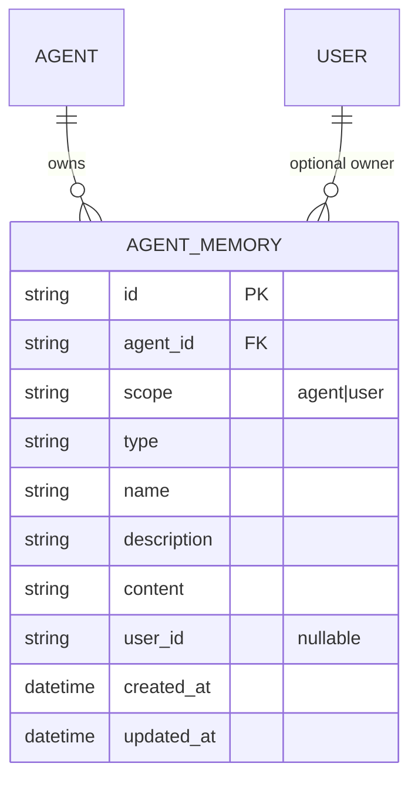

# Memory

## Overview

Memory is an RDB-backed knowledge store for saving user preferences, project state, repeated feedback, and external system references discovered by agent during conversation so they can be reused in later executions. Current implementation does not use vector DB or hidden automatic summaries. Memory changes only when agent explicitly calls `save_memory`, `list_memories`, `get_memory`, `search_memories`, or `delete_memory` tools.

Memory belongs to Agent. Even within same Workspace, Memory is not shared when Agent differs. Within a single Agent, Memory has two scopes.

- `agent` scope — team/project knowledge shared with all users of that Agent.
- `user` scope — personal preferences/feedback visible only to specific user. Cannot be read or stored in executions without user context.

## Domain Model

Main constraints of `agent_memories` are:

| Constraint | Meaning |
|---|---|
| `uq_agent_memories_agent_scope` | `(agent_id, name)` unique in agent scope where `user_id IS NULL` |
| `uq_agent_memories_user_scope` | `(agent_id, user_id, name)` unique in user scope where `user_id IS NOT NULL` |
| `ix_agent_memories_agent_id` | partial index for listing agent scope |
| `ix_agent_memories_agent_user` | partial index for listing user scope |

`scope` column is PostgreSQL ENUM `memory_scope` (`agent`, `user`). `type` is stored as free string in current code, but tool descriptions recommend four usages: `user`, `feedback`, `project`, `reference`.

## Behavior

### Tool exposure

During AgentRuntime resolve, Agent with `memory_enabled` enabled receives Memory tools and Memory index prompt. If user context exists, both agent scope and user scope summaries are exposed; if user context does not exist, only agent scope is exposed. If `memory_enabled=false`, neither Memory tools nor prompt are exposed.

### Save / upsert

`save_memory` uses `name` as upsert key within same scope. If existing row exists, update `description`, `content`, `type`, and `scope`; otherwise create new row. If tool input has `scope=user` but execution context has no `user_id`, raise `FunctionToolError("Cannot save user-scope memory: no user context")`.

### List / get / search / delete

- `list_memories(scope=None, type=None)` returns agent scope summary and user scope summary grouped by type as markdown list. It queries sorted up to 100 rows per scope.
- `get_memory(scope, name)` returns full `content` of a single Memory. Missing row is handled as tool error.
- `search_memories(query, scope=None)` is `ILIKE` search over `name`, `description`, and `content`. If `scope=None` and user context exists, it searches both agent scope and user scope and returns up to 50 summaries.
- `delete_memory(scope, name)` deletes by scope/name and returns existence result as JSON.

## Invariants

- Memory is isolated per Agent. user scope is also limited by `(agent_id, user_id)`.
- user scope cannot be written or directly read in execution without user context.
- Output of Memory tools is normal tool output, so it may remain as conversation event. Whether to save credentials, secrets, or personally identifiable information depends on Agent tool-use policy and user instruction.
- Search is lexical `ILIKE`. Current implementation has no embedding similarity, automatic relevance ranking, or automatic compaction-to-memory promotion.

## Related specs

- LLM/tool orchestration of Agent follows [`agent.md`](agent.md) and [`../flow/agent-execution-loop.md`](../flow/agent-execution-loop.md).
- Conversation history compaction is separate from Memory and covered in [`../flow/context-compaction.md`](../flow/context-compaction.md).
