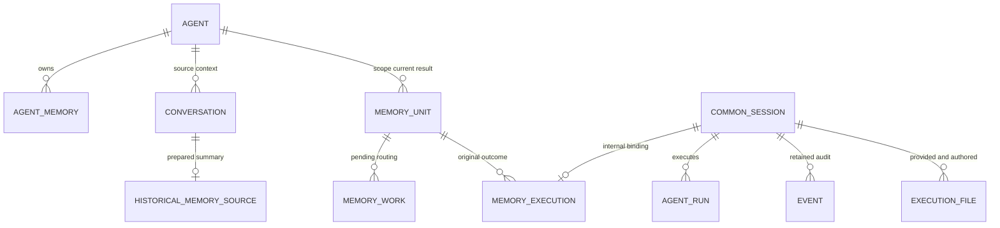

# Memory

## Overview

One Agent `memory_enabled` setting governs Saved and Historical Memory.
Saved Memory is independently managed Agent/User knowledge explicitly saved by
an Agent or human. Historical Memory prepares summaries of permitted source
conversations and integrates the supplied summary corpus into one current result
per Team or associated-User scope. Both are potentially stale reference data;
current instructions and verified evidence take precedence.

Preparation and integration never mutate Saved entries. Conversation boundaries
select whole current integrated documents and a Saved index; explicit VFS lookup
reads current authorized records without refreshing that boundary. Internal
integration uses common Session/Run/Event execution without exposing a public
Conversation. It receives prepared summary files, not original transcripts or a
previous integrated result, and succeeds only through explicit file submission.

## Domain Model

Saved entries remain in `agent_memories` with ID, Agent ID, `agent|user` scope,
free-form type, name, description, content, optional User ID and timestamps.
Partial unique keys remain `(agent_id, name)` and `(agent_id, user_id, name)`.

`historical_memory_sources` stores each source conversation's latest optional
summary, title/activity/tail snapshots, preparation time and bounded retry/model
operation progress. Completion markers are all present or all absent; an empty
summary can record preparation completion without usable content. The source row
cascades with its canonical Session. No content-version, evidence-hash or
availability-generation contract is used for source or aggregate authoring.

`memory_units` binds `(Agent, Workspace, team|user, associated User)` to its current
Markdown, complete rendered block, acceptance time, active internal Session and
due/retry routing state. `memory_executions` binds a common internal Session to
its scope, immutable deadline, execution policy, cumulative started turns and
original accepted tool outcome. That accepted outcome retains content-free
scalars independently of the Session audit lifetime. `memory_work` contains
pending scheduling changes and exact server-owned admission associations; it is
not a model-authored coverage ledger or source-version index.

Common `session_execution_files` stores provided read-only summary files and
writable authored files for one execution. Common Session, Run and Event rows
store ownership, lifecycle, dialogue, tool results, compaction and scalar usage.
There is one current aggregate per scope, not an immutable aggregate revision
history or dependency manifest. Source/version/exposure/draft ledgers are not
part of the integrated-result contract.

The `memory/context_snapshot` Toolkit State stores the selected Saved index and
up to two whole scope results, boundary head and creation time (schema 2).
Historical entries contain the exact scope, rendered bytes and publication time,
not revision identifiers or source dependencies. It is a frozen input selection,
not independent access authority or a whole-corpus projection.


```mermaid
erDiagram
    AGENT ||--o{ AGENT_MEMORY : owns
    AGENT ||--o{ CONVERSATION : "source context"
    CONVERSATION ||--o| HISTORICAL_MEMORY_SOURCE : "prepared summary"
    AGENT ||--o{ MEMORY_UNIT : "scope current result"
    MEMORY_UNIT ||--o{ MEMORY_WORK : "pending routing"
    MEMORY_UNIT ||--o{ MEMORY_EXECUTION : "original outcome"
    COMMON_SESSION ||--o| MEMORY_EXECUTION : "internal binding"
    COMMON_SESSION ||--o{ AGENT_RUN : executes
    COMMON_SESSION ||--o{ EVENT : "retained audit"
    COMMON_SESSION ||--o{ EXECUTION_FILE : "provided and authored"
```

## Authorization and Lifecycle

Model-facing Memory use is confined to the same Agent/Workspace and active
Conversation root. Team conversations see Agent Saved Memory and Team current
results; User conversations can also see their associated User's Saved Memory
and personal result while current Workspace membership exists. Sender, broker,
viewer and model-supplied paths cannot choose another User scope. Children
inherit their Conversation root's selection.

Source preparation and lookup check source lifecycle and access. Integration
provisions only currently eligible same-scope summaries into read-only execution
files. Subsequent model/tool/submission admission checks current common execution
ownership, cancellation/deadline and scope authority, not each original source's
version or a full influence manifest. Source lifecycle changes schedule new work;
they do not revoke a retained aggregate by dependency lookup. Current aggregate
and frozen snapshot reads reauthorize the scope itself. Agent disablement or
personal membership loss denies new model-facing scope use; independently
permitted peer scopes and Saved entries remain available.

Memory disablement stops admission/preparation and automatic context and denies
the model-facing Memory mount. It does not delete retained data or prohibit
otherwise authorized human settings inspection. Source archive/purge denies new
source lookup and provision; restore can expose retained prepared summaries and
schedule integration again. Ten-day source age limits first preparation
admission, not summary retention or integration eligibility.

Internal executions are not Conversations and cannot become source conversations
or leak into public lists, exact-ID conversation routes or public history/search.
Their diagnostic Session/Run/Event/tool/file payload remains available through
explicit privileged execution-audit access until the common retention purge.

## Historical Preparation

Enabled five-minute discovery admits never-prepared active root Sessions only
when latest conversation or Run activity is between six hours and ten days old
and no Run is ongoing. New activity restarts the six-hour inactivity condition.
Pinned and Team-primary Sessions are not excluded solely for their navigation or
retention role. A discovery pass admits at most 500 sources and dispatches at
most 25 due Agent jobs after database admission completes.

Once admitted, retry/completion remain possible beyond ten days; prepared
summaries remain usable while current authority and lifecycle allow. Unchanged
completed content is not re-extracted merely because time passes. New content
permits a later inactive refresh while the previous permitted summary remains
available. Publication rechecks enablement, active source, and access; it does
not require equality with a current content revision.

Preparation admission and publication explicitly acquire current Agent,
associated membership, root Session and canonical source in that order. Preliminary
identities only route those acquisitions; locked relationships and eligibility
are refreshed before acceptance. The Agent settings gate uses NO KEY UPDATE,
preserving writer exclusion while allowing enrollment's foreign-key KEY SHARE
references. A Memory toggle uses the same sufficient gate rather than failing
an ordinary source wait. Provider summarization remains outside these owning DB
operations.

Registered `historical_memory.prepare` jobs coalesce by Agent execution key in
process-local Job Runtime. A job attempts at most ten source operations under an
absolute thirty-minute request deadline. Preparation handler concurrency defaults
to 12 and can be configured from 1 to 12.
Integration is dispatched to the common Session Worker; it consumes no separate
Job Runtime consolidation semaphore or reserved two-slot handler. PostgreSQL
progress and periodic rediscovery recover interrupted work. Redis persistence is
not required and cross-process duplicate calls are possible.

Preparation uses the Agent Lightweight candidate chain and the truthful
`historical_memory` operation kind, never the Main chain. Input uses bounded
semantic event tiers, chronological rendering, and at most 200 eligible events
per tier. Preparation reserves the complete ordinary request's instructions and
UTF-8 framing, plus any explicit selected output setting, before allocating source
evidence within the resolved input window on the existing four-byte token-estimate
basis. It reprojects semantic evidence against
the fully lowered request when escaping/framing changes the measured size. Human requests/corrections, Agent
proposals, other Agent messages, contextual failures, and tool outcomes remain
distinguishable. A declarative durable-name conversational-tool registry
reconstructs tool-mediated conversation with delivery provenance. Sensitive
values are redacted from input; hidden reasoning/instructions and raw attachment
bytes are excluded.

One ordinary text-model call asks for JSON containing only `summary`, validated
strictly by the application after native terminal completion. Preparation,
consolidation and foreground compaction use the same provider-operation
composition over the foreground lowerers, adapters, capability admission and
normalized output contracts. The exact selected model settings control output:
an unspecified output cap remains unspecified, while an explicit cap receives
the foreground model-supported clamp. Preparation adds no wire JSON-schema
requirement, provider routing override or fixed output ceiling.
Service-owned
identity/scope/timestamps remain outside model output. Useful context preserves
scope, consequential reasons, chronology, reported evidence, corrections, and
unfinished work; empty content means no summary. Valid oversized summaries are
guarded to 9,000 UTF-8 bytes with a truncation note. Provider/timeout/output
failure retains prior results and stores bounded retry progress. Delay starts at
one minute and grows exponentially to six hours; candidate quota health can
advance the persisted Lightweight chain. Success publishes result/source markers
atomically and clears retry progress.

## Agentic Consolidation

### Common execution and provided files

Each due Team or personal scope is durably associated with one internal common
Session and routed by `SessionWakeUp` to the ordinary Worker. Session owner
generation, broker lock, heartbeat, Run activation, stop/shutdown supervision and
Event storage are common execution infrastructure. The Session has no public
Conversation profile, Runtime, source transcript backend, Saved mutation or
attached Toolkit. There is no Scheduler-local integration executor, separate
unit lease/token owner or additional Memory concurrency semaphore.

A fresh execution provisions `azents://execution/README.md` and read-only
`inputs/<source-session-id>.md` files from currently eligible prepared summaries.
It does not seed original conversation/events/results, previous aggregate prose,
previous execution dialogue or unfinished authored files. Generic read/glob/grep
and write/edit/delete/apply_patch operate only on this execution's file backend.
Provided files are read-only. Ordinary common file read-before-overwrite and
atomic patch semantics apply; no aggregate draft revision/observation epoch or
source manifest is added to file mutation authority.

The actual foreground model-operation kind is `FOREGROUND`, resolved through the
Agent's Lightweight option label and captured candidates/settings. This is the
common model-operation lifecycle, not selection of the Main route. Candidate
capture, provider lowerers/adapters, usage and native completion use the shared
contracts; quota handoff can advance compatible captured Lightweight candidates
without a Main fallback. Every physical SDK send checks current owner and stop
admission. Admission denial remains an execution admission error, not a provider
failure or quota signal.

### Explicit submission and continuation

The Agent authors a writable Markdown file and calls `submit_memory` with only
its canonical `azents://execution/...` path. Scope, source/work identities and
settlement are server-bound, not model arguments. Arbitrary useful Markdown is
accepted without prescribed headings, routes or coverage. Validation requires a
writable authored file, valid UTF-8/no NUL, safe model-facing framing and at most
10,000 UTF-8 bytes for the complete rendered result. An empty authored document
is valid and clears that scope's usable current result without filler.

Missing/read-only/wrong-domain files, invalid artifact content and rendered-size
problems return correctable tool feedback, including size information when
available. The same Session/Run, dialogue, files, deadline and policy remain
active for correction and resubmission. Final prose without acceptance also
appends a continuation prompt in that execution; normal model completion never
publishes. Ordinary siblings finish before submitted authored bytes are read.
Only durable accepted submission terminates the host.

Submission atomically stores current Markdown/rendered bytes/acceptance time,
settles only work associated with the supplied corpus, records the original tool
outcome and completes the common `FOREGROUND` operation/Run. Unseen and
late-arriving unassociated work remains pending. Repeated acknowledgement of the
same accepted tool identity returns the original outcome, not another
publication or fresh work settlement. Secondary audit/transport/archive faults
after commit are logged and do not change accepted success into failure.

### Continuity, limits and lifecycle

`historical_memory_execution` supplies nullable `max_turns` (unlimited by default)
and positive `timeout_seconds` (600 by default). Fresh admission stores one
absolute deadline and policy. Logical turns persist across candidate handoff.
After takeover of an interrupted owned execution, a new clean internal Session
inherits the predecessor's original deadline/policy and consumed turn count;
old owner submission is fenced. Restart does not grant a new execution budget.
The Worker can finish an already accepted original outcome without rerunning the
model. Deadline/stop/failure settlement preserves the prior current result and
releases unfinished work for subsequent ordinary discovery; due failure backoff
starts at one minute and caps at six hours.

Each model step reconstructs canonical input from the common model-input head.
Growing dialogue uses the common EventCompactor with the selected true resolved
window, shared checkpoint prompt and owner-fenced marker/summary/head commit.
Compaction retains execution files and useful checkpoint state in the same
Session/Run; it neither generates a new integration execution nor resets
submission policy. Internal normalized output and tools are durably auditable,
not merely a RAM-only conversation.

Terminal internal executions use common archive/retention/purge participants.
Archive does not eagerly delete dialogue, tool results, provided summaries or
authored files. They survive for authorized audit until retention expiry, and
Unlimited retains them indefinitely. The generic purge removes execution file
and Event/Run/model-operation payload only after normal lifecycle fencing and
required cleanup. Current aggregate and original accepted scalars survive audit
purge. There is no Memory-only draft GC, revision collection or operator cutover
CLI in the execution workflow.

## Automatic Boundary Snapshot

Enabled root Conversation Run preparation selects the current Saved index and
whole current Team/associated-personal integrated results. The successful
compaction-head boundary can refresh that selection inside a Run. Child
execution inherits it. Identical selection retains content/creation time;
unchanged content can be rebound to the new committed head. Failed/stale
compaction or snapshot CAS contributes no new selection.

Other turns reauthorize selected Saved IDs and Historical scope permission
without replacing selected bytes, refreshing descriptions or admitting newer
results. Scope checks use independent ordinary read-only authority; source
versions, archived source identities and dependency manifests are not consulted
for aggregate or selected-result access. A new live current aggregate can differ
from frozen selected bytes without changing them. Denied scope contributes no
Historical block, and the independently authorized peer remains available.
Snapshot writes retain the captured common Session owner-generation fence.

Saved entries are type/name/ID sorted lookup indexes, not copied full bodies.
Each whole Historical rendered result has its independent 10,000-byte allowance;
authorized User context may compose Team and personal results for up to 20,000
bytes without lending unused peer capacity. No ranking, source packing or
per-source fallback replaces a missing current result.

Native replay compatibility binds the actual permitted semantic prompt text.
Changed/denied text uses current canonical history and resets incompatible opaque
reasoning/signatures or stored-response continuation. It carries no aggregate
revision/source-manifest identity. Durable visible Events remain intact.
Historical blocks remain untrusted data rather than current instruction or
independent proof. Explicit original-source inspection remains separately
authorized and optional when evidence can materially affect the answer.

## Live Read-Only Memory VFS

Generic `read`, `grep`, and `glob` route the registered Memory mount independently
of Runtime availability. Every operation checks current root authority, Memory
policy, Agent/Workspace, User membership/scope, and source lifecycle for source
paths. Aggregate aliases use current scope authority rather than original-source
manifests. The mount
lazily renders PostgreSQL-backed files; it is not a whole-corpus immutable run
projection and cannot be written or transferred into Runtime.

```text
azents://memory/README.md
azents://memory/consolidated/{team,user}/summary.md
azents://memory/saved/{agent,user}/<memory-id>.md
azents://memory/historical/{team,user}/<source-session-id>/summary.md
azents://memory/sources/{team,user}/<session-id>/session.md
azents://memory/sources/{team,user}/<session-id>/events/<event-id>.md
azents://memory/sources/{team,user}/<session-id>/tool-results/<event-id>.txt
```

Paths use database IDs rather than labels. README provides narrow lookup patterns;
consolidated paths are exact aliases resolved from the current root authority,
never a model-supplied User ID. Their bodies are the latest scope-authorized
current results and may be newer than the frozen boundary selection. Internal
execution files and pending-work
associations are absent from the foreground mount.
Directory index files are not required. Saved files contain safe metadata,
description, and content. Historical files contain available summary, activity
and preparation timestamps, and exact source path. Session files link optional
summary and latest visible event. Event files retain semantic text/provenance,
conversational-tool delivery status where available, adjacent visible paths, and
optional exact result paths. Internal/reverted events are absent.

Exact tool-result reads expose bounded persisted textual parts plus safe result
metadata, not inputs, hidden/native artifacts, references, attachments, or file
bytes. Authorization does not arbitrarily redact historical output: selected
text itself may be sensitive. Broad grep never searches result bodies, and any
`tool-results` grep prefix is unsupported.

Glob translates grammar into bounded authorized ID queries without rendering
bodies and returns sorted canonical URIs, up to 1,000 candidates/results. Grep
queries bounded scoped Saved names/descriptions/content, Historical title/summary,
source metadata, and eligible semantic events. Repository row/per-row byte bounds
constrain candidates before rendering. Common matching-file, line, searched-file,
and scanned-byte limits are upper bounds; backend admission may truncate earlier.
Regex runs in a killable isolated Python subprocess, not the application event
loop. Memory operations have a two-second bound with explicit deadline/limit
truncation. Exact rendered files obey the two-MiB VFS file cap. Denied, missing,
archived, invalid-domain, or unavailable exact reads share one non-enumerating
unavailable result; unauthorized IDs are not exposed by discovery.

## Saved Mutation and Tool Surface

Root Memory-enabled execution retains only `save_memory` and `delete_memory` as
Memory domain tools. Subagent auto-binding retains context/generic reads, not
Saved mutation. Save remains upsert-by-name in the authorized Agent/User scope,
replacing description/content/type or creating an entry. Delete remains exact
scope/name deletion with an explicit missing-entry error. Team execution rejects
User mutation; User execution binds its associated User.

All reads use generic VFS tools. Dedicated `list_memories`, `get_memory`,
`search_memories`, `search_sessions`, `read_session_history`, and
`read_session_tool_result` factories/exposure are removed without aliases. The
canonical Session event store and repositories remain source evidence.

## Public API and Settings UI

Existing Saved CRUD remains under
`/agent/v1/workspaces/{handle}/agents/{agent_id}/memories` and `/{memory_id}`.
List requires exact `scope=agent|user` with optional `type`/`query`, opaque cursor,
and `limit` from 1 to 100 (default 20). It returns `items` and `next_cursor`;
the exclusive keyset is `(type, name, id)`, with one-row lookahead rather than a
whole-list limit. Cursor identity binds Agent, associated User, type and query;
malformed or mismatched cursors return a non-content-echoing `422`. Non-empty
Saved query uses lexical case-insensitive all-term matching. Human create/update
uses duplicate-name conflicts rather than runtime upsert. Agent mutations require
Agent admin or Workspace owner; User mutations affect only the current user's own
visible entries.

Read-only Historical settings endpoints:

- `GET /agent/v1/workspaces/{handle}/agents/{agent_id}/historical-memories`
- `GET /agent/v1/workspaces/{handle}/agents/{agent_id}/historical-memories/{source_session_id}`
- `GET /agent/v1/workspaces/{handle}/agents/{agent_id}/consolidated-memory`

List requires exact `scope=team|user` and accepts an optional escaped lexical
substring query over current source title/available summary, opaque cursor, and
`limit` from 1 to 100 (default 20). Sort is completed activity descending,
preparation descending, source ID ascending. Responses carry source ID/scope/title,
activity-through boundary, preparation time, complete bounded summary, and source
conversation `source_path`; list also returns `next_cursor`. Title/summary rows
over two MiB are unavailable. Invalid cursors return `422`; denied/missing rows
use the existing non-enumerating `404` mapping. Every request checks Agent
visibility, Workspace membership, active root source, and exact Team or current
User scope. Inspection remains available while Agent Memory is disabled.

The integrated endpoint requires `scope=team|user` and derives the personal User
from the authenticated Workspace member. It returns current `markdown` and
`published_at`, both null when no current document is visible, without generation
or source-packing fallback. Human Agent visibility and current membership apply
even while Memory is disabled. Reads check current Agent/Workspace/personal scope permission without source
version, aggregate revision or dependency-manifest validation.

The settings page provides Saved/Historical kind selection. Its responsive header
puts the explanation below the title/control row, using the full available width.
Saved keeps Agent/User scopes, search, create/edit modal and delete confirmation,
and fetches cursor pages through an automatic scroll sentinel. Historical defaults
to selected Team/current-User integrated Markdown; a one-level in-page detail view
contains per-session search, summaries, dates and original-conversation links.
Its per-session list also fetches automatically, with no Load more button.
The sentinel uses the actual overflow scrolling container, avoids concurrent
next-page fetches, stops at exhaustion, and preserves loaded entries on a
next-page error with explicit retry. Scope/query/navigation changes do not mix
pages. One existing toggle remains; there is no additional Historical toggle,
badge, notification or per-answer usage claim. The inventory is not the exact set
used by a response.

## Invariants

- Saved mutation is explicit; source summarization never changes Saved rows.
- Source age limits first admission, not retry or retained summary use.
- Content freshness is best effort; lifecycle/access/enablement is current.
- Snapshot selection is boundary-owned, explicit lookup is live.
- Lifecycle/access loss affects new use, not answers already delivered.
- Arbitrary result bodies are isolated from broad discovery/search.
- VFS failure does not refresh snapshots or mutate source state. Missing summaries
  do not prevent permitted original-source lookup.
- Logs retain counts, timing, limits, and safe usage fields, not summary/Saved/
  event/result text or credentials.

## Schema Conversion and Retention

The schema conversion preserves Saved entries, prepared source summaries,
current accepted results and pending changes while replacing unit attempts,
private draft/coverage/evidence tables and immutable result revisions with common
execution bindings and current scope results. It does not activate two writers.
The retired Scheduler integration handler and Memory handover CLI are not live
execution paths. Actual deployment/migration is an operator action; this spec
records implemented behavior, not evidence that a production rollout occurred.

Common archived internal Session purge removes its retained audit payload through
the same durable lifecycle/resource phases as Conversations. Detached original
acceptance scalars and current unit result remain available after that cleanup.
Old-code rollback after destructive removal of obsolete schema is not promised.

## Change History

| Date | Version | Change |
|---|---:|---|
| 2026-10-07 | 23 | Replace integration drafts/manifests and Scheduler-local hosts with summary-only common Worker executions, explicit file submission, retained audit and scope-only current results |
| 2026-10-06 | 22 | Added Saved cursor paging and integrated Historical overview, one-level session details, automatic scroll pagination and full-width header description |
| 2026-10-06 | 19 | Replace nonwaiting producer/source/handover fences with exact waiting admission, renewable-lease-safe participant planning and whole-operation/page recovery |
| 2026-10-05 | 16 | Make uncertain publication inspection read-only and unfenced; condition revision GC on exact current/reference exclusions without candidate locks |
| 2026-10-04 | 14 | Make consumer/foreground descriptions read-only and unfenced while retaining exact own-manifest denial and producer mutation authority |
| 2026-10-04 | 13 | Keep concurrent consumer authority locks FK-compatible and preserve writer exclusion |
| 2026-10-04 | 12 | Promoted isolated agentic consolidation, fenced exact coverage/manifests, independent 10k documents/20k composition, latest-live aliases, denial continuity and coordinated handover |
| 2026-10-02 | 11 | Refresh Memory during root Run preparation and hook-driven post-compaction context reconstruction, reuse unchanged content, and preserve read-only per-turn filtering and child inheritance |
| 2026-10-02 | 10 | Promoted Historical preparation, boundary snapshots, live Memory VFS, generic-read cutover, Saved-only mutation, and retained read-only Historical settings |
| 2026-10-01 | 9 | Moved runtime Memory, prompt-scope, and Session-history transactions into completed repository operations |
| 2026-09-26 | 8 | Added Memory-gated authorized Session discovery, visible paging, and selected tool-result text lookup |
| 2026-08-06 | 7 | Documented User Session Agent+User Memory projection while Team Sessions remain Agent-scope only |
| 2026-07-24 | 6 | Restricted Team runtime projection to shared Agent Memory |
| 2026-07-17 | 5 | Added exact-to-partial lexical search and duplicate prevention guidance |
| 2026-07-09 | 3 | Clarified keyword Memory search guidance |
| 2026-07-02 | 2 | Added public Agent Memory settings API/UI and permissions |
| 2026-05-10 | 1 | Initial Memory domain spec |

## Related specs

- Toolkit composition follows [`toolkit.md`](toolkit.md).
- Context/tool execution follows [`../flow/agent-execution-loop.md`](../flow/agent-execution-loop.md).
- Same-Session compaction follows [`../flow/context-compaction.md`](../flow/context-compaction.md).
- Background discovery follows [`../flow/periodic-execution.md`](../flow/periodic-execution.md).
