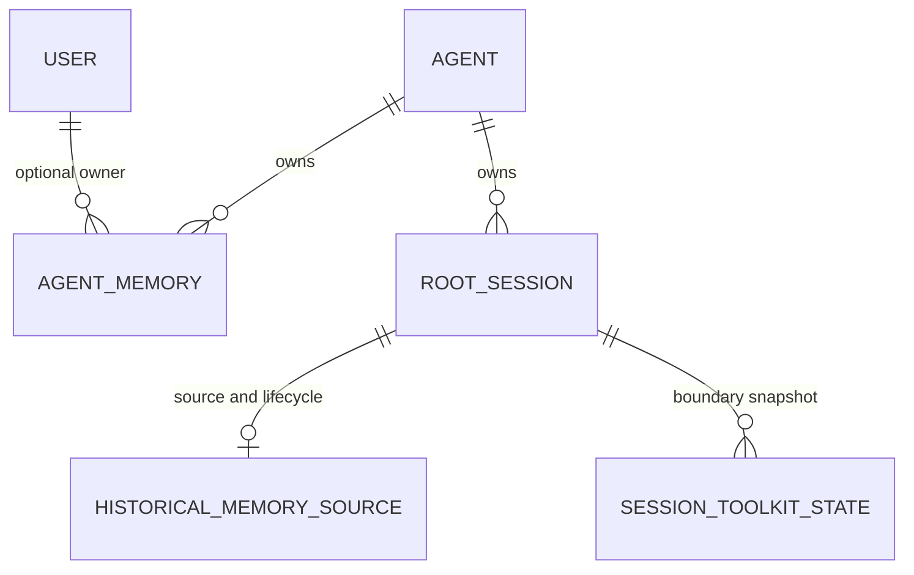

# Memory

## Overview

One Agent `memory_enabled` setting governs two distinct kinds of Memory:

- **Saved Memory** is independently managed Agent/User knowledge explicitly saved
  by the Agent or human: preferences, feedback, project state, and references.
- **Historical Memory** is an automatically prepared, source-linked historical
  summary of an authorized root Session. It may be incomplete, stale, or wrong;
  it is reference data, not an independent instruction or current proof.

Preparation never creates, edits, or deletes Saved Memory. There is no embedding
index, integration-model overview call, or promotion of repeated history into
independent corroboration. Initial and post-compaction model context use a
persisted deterministic boundary snapshot; explicit VFS reads inspect currently
permitted live records without refreshing that snapshot.

## Domain Model

Saved entries remain in `agent_memories` with ID, Agent ID, `agent|user` scope,
free-form type, name, description, content, optional User ID, and timestamps.
The partial unique keys are `(agent_id, name)` for Agent scope and
`(agent_id, user_id, name)` for User scope. Existing partial lookup indexes and
the PostgreSQL `memory_scope` enum remain unchanged. Suggested types are `user`,
`feedback`, `project`, and `reference`.

`historical_memory_sources` has one source-owned row per root Session. Its
`source_session_id` primary key references `agent_sessions` with cascade deletion.
The row contains the latest optional summary and source-title snapshot, completed
source activity and tail-event markers, preparation time, and minimal retry
progress: admission time, last attempt, next retry, failure count/category, and
serialized `historical_memory` model-operation state. Completed markers are all
present or all absent. A successful empty summary records completion without a
usable summary. There is no attempt ledger, copied transcript, or durable running
state.

The `memory/context_snapshot` Session Toolkit State stores selected Saved index
entries and whole Historical source blocks, exact VFS paths, boundary head-event
ID, and creation time. It is not an independent live-access authority or a copy
of the Memory corpus inside `agent_runs.vfs_projection`.


```mermaid
erDiagram
    AGENT ||--o{ AGENT_MEMORY : owns
    USER ||--o{ AGENT_MEMORY : "optional owner"
    AGENT ||--o{ ROOT_SESSION : owns
    ROOT_SESSION ||--o| HISTORICAL_MEMORY_SOURCE : "source and lifecycle"
    ROOT_SESSION ||--o{ SESSION_TOOLKIT_STATE : "boundary snapshot"
```

## Authorization and Lifecycle

Model-facing use is confined to the same Agent and Workspace and an active
privacy root. Team executions see shared Agent Saved Memory and permitted Team
sources. User executions may also see their durable associated User's Saved
Memory and personal root Sessions while current Workspace membership exists.
Sender/requester provenance, broker routing, viewers, and model-supplied paths
never select another personal scope. Subagents inherit their root boundary.

Preparation admission/publication, snapshot selection/use, live VFS operations,
and human settings reads each reauthorize independently. Memory disablement
stops new admission/preparation and automatic context and denies the Memory
mount; it neither deletes rows nor removes retained human settings inspection.

Source archive or access loss excludes dependent Historical Memory and source
paths from the next model operation even when storage remains retained. Restore
may make retained summaries available again; purge cascades source rows and
permanently removes their evidence. Saved entries are not deleted because a
source is archived or purged. Ten-day source age is not an expiry policy.

## Historical Preparation

Enabled five-minute discovery admits never-prepared active root Sessions only
when latest conversation or Run activity is between six hours and ten days old
and no Run is ongoing. New activity restarts the six-hour inactivity condition.
Pinned and Team-primary Sessions are not excluded solely for their navigation or
retention role. A discovery pass admits at most 500 sources and dispatches at
most 25 due Agent jobs after database admission completes.

Once admitted, retry/completion remain possible beyond ten days; prepared
summaries remain usable while current authority and lifecycle allow. Unchanged
completed content is not re-extracted merely because time passes. New content
permits a later inactive refresh while the previous permitted summary remains
available. Publication rechecks enablement, active source, and access; it does
not require equality with a current content revision.

Registered `historical_memory.prepare` jobs coalesce by Agent execution key in
process-local Job Runtime. A job attempts at most ten source operations under an
absolute thirty-minute request deadline. Handler concurrency defaults to 15 of
the application Runtime's 16 slots and must leave at least one slot for other
jobs. PostgreSQL progress and periodic rediscovery recover interrupted work;
Redis persistence is not required and cross-process duplicate calls are possible.

Preparation uses the Agent Lightweight candidate chain and the truthful
`historical_memory` operation kind, never the Main chain. Input uses bounded
semantic event tiers, chronological rendering, 70% of the resolved input window,
and at most 200 eligible events per tier. Human requests/corrections, Agent
proposals, other Agent messages, contextual failures, and tool outcomes remain
distinguishable. A declarative durable-name conversational-tool registry
reconstructs tool-mediated conversation with delivery provenance. Sensitive
values are redacted from input; hidden reasoning/instructions and raw attachment
bytes are excluded.

One provider call requests strict JSON containing only `summary`. Service-owned
identity/scope/timestamps remain outside model output. Useful context preserves
scope, consequential reasons, chronology, reported evidence, corrections, and
unfinished work; empty content means no summary. Valid oversized summaries are
guarded to 9,000 UTF-8 bytes with a truncation note. Provider/timeout/output
failure retains prior results and stores bounded retry progress. Delay starts at
one minute and grows exponentially to six hours; candidate quota health can
advance the persisted Lightweight chain. Success publishes result/source markers
atomically and clears retry progress.

## Automatic Boundary Snapshot

Before each root Run loop, the existing `on_run_start` preparation hook reselects
currently available Saved index entries and prepared Historical summaries.
Selection compares entries with the persisted snapshot and retains unchanged
content and its creation time; identical selection/head requires no state write.
No Run ID is added to the snapshot or compared to detect this boundary.

Independently, the existing `on_session_compact` hook marks a pending refresh.
Because this hook announces compaction start, the following model-context
reconstruction reselects only after a new successful compaction-summary head has
committed. This can occur inside the same Run and does not wait for another Run.
Unchanged content is rebound to the new head without replacing its text or
creation time. Failed/stale compaction leaves the head unchanged and admits no
new Memory. Child Run/compaction hooks inherit the root selection rather than
reselecting it.

Other model/tool turns only reauthorize and filter currently unavailable Saved
IDs and Historical source IDs; they do not replace entries, update snapshot
text, or admit newly prepared summaries. Missing/corrupt state is initialized
only by explicit lifecycle refresh, not ordinary prompt reads. A failed refresh
or snapshot CAS conflict contributes no automatic Memory to that execution.

Saved index entries are type/name/ID sorted. Historical candidates are bounded to
200 and ranked deterministically. New Sessions rank by source activity,
preparation time, and source ID; after compaction lexical matches against known
context precede those tie-breaks. Only complete source-summary groups fit within
the 10,000-byte Historical budget. Identical normalized summaries may share one
body with all selected source references. Groups are presented older-to-newer,
not as generated cross-Session overview prose.

Prompt sections distinguish Saved and Historical Memory and include exact Saved,
summary, and original-source VFS paths. Historical blocks are explicit data
boundaries. Current instructions and verified current evidence take precedence;
source inspection is optional when wording, chronology, evidence, or uncertainty
can materially affect the answer.

## Live Read-Only Memory VFS

Generic `read`, `grep`, and `glob` route the registered Memory mount independently
of Runtime availability. Every operation checks current root authority, Memory
policy, Agent/Workspace, User membership/scope, and source lifecycle. The mount
lazily renders PostgreSQL-backed files; it is not a whole-corpus immutable run
projection and cannot be written or transferred into Runtime.

```text
azents://memory/README.md
azents://memory/saved/{agent,user}/<memory-id>.md
azents://memory/historical/{team,user}/<source-session-id>/summary.md
azents://memory/sources/{team,user}/<session-id>/session.md
azents://memory/sources/{team,user}/<session-id>/events/<event-id>.md
azents://memory/sources/{team,user}/<session-id>/tool-results/<event-id>.txt
```

Paths use database IDs rather than labels. README provides narrow lookup patterns;
directory index files are not required. Saved files contain safe metadata,
description, and content. Historical files contain available summary, activity
and preparation timestamps, and exact source path. Session files link optional
summary and latest visible event. Event files retain semantic text/provenance,
conversational-tool delivery status where available, adjacent visible paths, and
optional exact result paths. Internal/reverted events are absent.

Exact tool-result reads expose bounded persisted textual parts plus safe result
metadata, not inputs, hidden/native artifacts, references, attachments, or file
bytes. Authorization does not arbitrarily redact historical output: selected
text itself may be sensitive. Broad grep never searches result bodies, and any
`tool-results` grep prefix is unsupported.

Glob translates grammar into bounded authorized ID queries without rendering
bodies and returns sorted canonical URIs, up to 1,000 candidates/results. Grep
queries bounded scoped Saved names/descriptions/content, Historical title/summary,
source metadata, and eligible semantic events. Repository row/per-row byte bounds
constrain candidates before rendering. Common matching-file, line, searched-file,
and scanned-byte limits are upper bounds; backend admission may truncate earlier.
Regex runs in a killable isolated Python subprocess, not the application event
loop. Memory operations have a two-second bound with explicit deadline/limit
truncation. Exact rendered files obey the two-MiB VFS file cap. Denied, missing,
archived, invalid-domain, or unavailable exact reads share one non-enumerating
unavailable result; unauthorized IDs are not exposed by discovery.

## Saved Mutation and Tool Surface

Root Memory-enabled execution retains only `save_memory` and `delete_memory` as
Memory domain tools. Subagent auto-binding retains context/generic reads, not
Saved mutation. Save remains upsert-by-name in the authorized Agent/User scope,
replacing description/content/type or creating an entry. Delete remains exact
scope/name deletion with an explicit missing-entry error. Team execution rejects
User mutation; User execution binds its associated User.

All reads use generic VFS tools. Dedicated `list_memories`, `get_memory`,
`search_memories`, `search_sessions`, `read_session_history`, and
`read_session_tool_result` factories/exposure are removed without aliases. The
canonical Session event store and repositories remain source evidence.

## Public API and Settings UI

Existing Saved CRUD remains under
`/agent/v1/workspaces/{handle}/agents/{agent_id}/memories` and `/{memory_id}`.
List requires exact `scope=agent|user` with optional `type`/`query`. Non-empty
Saved query uses lexical case-insensitive all-term matching. Human create/update
uses duplicate-name conflicts rather than runtime upsert. Agent mutations require
Agent admin or Workspace owner; User mutations affect only the current user's own
visible entries.

Historical settings adds only:

- `GET /agent/v1/workspaces/{handle}/agents/{agent_id}/historical-memories`
- `GET /agent/v1/workspaces/{handle}/agents/{agent_id}/historical-memories/{source_session_id}`

List requires exact `scope=team|user` and accepts an optional escaped lexical
substring query over current source title/available summary, opaque cursor, and
`limit` from 1 to 100 (default 20). Sort is completed activity descending,
preparation descending, source ID ascending. Responses carry source ID/scope/title,
activity-through boundary, preparation time, complete bounded summary, and source
conversation `source_path`; list also returns `next_cursor`. Title/summary rows
over two MiB are unavailable. Invalid cursors return `422`; denied/missing rows
use the existing non-enumerating `404` mapping. Every request checks Agent
visibility, Workspace membership, active root source, and exact Team or current
User scope. Inspection remains available while Agent Memory is disabled.

The existing settings page provides Saved/Historical kind selection. Saved keeps
Agent/User scopes, search, create/edit modal, and delete confirmation. Historical
offers Team/current-User grouping, search, pagination, summary inspection, and
links to original conversations without edit/delete controls. One existing toggle
remains; there is no additional Historical toggle, badge, notification, or
per-answer usage claim. The inventory is not the exact set used by a response.

## Invariants

- Saved mutation is explicit; source summarization never changes Saved rows.
- Source age limits first admission, not retry or retained summary use.
- Content freshness is best effort; lifecycle/access/enablement is current.
- Snapshot selection is boundary-owned, explicit lookup is live.
- Lifecycle/access loss affects new use, not answers already delivered.
- Arbitrary result bodies are isolated from broad discovery/search.
- VFS failure does not refresh snapshots or mutate source state. Missing summaries
  do not prevent permitted original-source lookup.
- Logs retain counts, timing, limits, and safe usage fields, not summary/Saved/
  event/result text or credentials.

## Change History

| Date | Version | Change |
|---|---:|---|
| 2026-10-02 | 11 | Refresh Memory during root Run preparation and hook-driven post-compaction context reconstruction, reuse unchanged content, and preserve read-only per-turn filtering and child inheritance |
| 2026-10-02 | 10 | Promoted Historical preparation, boundary snapshots, live Memory VFS, generic-read cutover, Saved-only mutation, and retained read-only Historical settings |
| 2026-10-01 | 9 | Moved runtime Memory, prompt-scope, and Session-history transactions into completed repository operations |
| 2026-09-26 | 8 | Added Memory-gated authorized Session discovery, visible paging, and selected tool-result text lookup |
| 2026-08-06 | 7 | Documented User Session Agent+User Memory projection while Team Sessions remain Agent-scope only |
| 2026-07-24 | 6 | Restricted Team runtime projection to shared Agent Memory |
| 2026-07-17 | 5 | Added exact-to-partial lexical search and duplicate prevention guidance |
| 2026-07-09 | 3 | Clarified keyword Memory search guidance |
| 2026-07-02 | 2 | Added public Agent Memory settings API/UI and permissions |
| 2026-05-10 | 1 | Initial Memory domain spec |

## Related specs

- Toolkit composition follows [`toolkit.md`](toolkit.md).
- Context/tool execution follows [`../flow/agent-execution-loop.md`](../flow/agent-execution-loop.md).
- Same-Session compaction follows [`../flow/context-compaction.md`](../flow/context-compaction.md).
- Background discovery follows [`../flow/periodic-execution.md`](../flow/periodic-execution.md).
