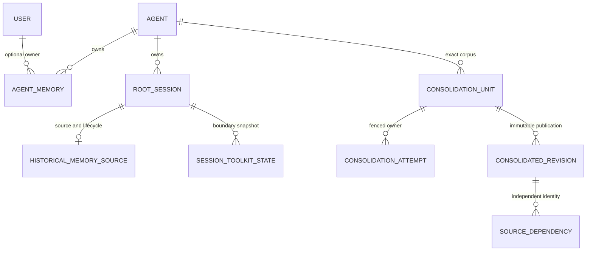

# Memory

## Overview

One Agent `memory_enabled` setting governs two distinct kinds of Memory:

- **Saved Memory** is independently managed Agent/User knowledge explicitly saved
  by the Agent or human: preferences, feedback, project state, and references.
- **Historical Memory** prepares source-linked summaries of authorized root
  Sessions, then an isolated background Agent integrates each Team or personal
  corpus into one compact document with source routes. Both prepared sources
  and integrated documents may be incomplete, stale, or wrong; they are reference
  data, not independent instructions or current proof.

Preparation and consolidation never create, edit, or delete Saved Memory. There
is no embedding index or promotion of repeated history into independent
corroboration. Initial and post-compaction context deterministically selects
whole published documents into a persisted boundary snapshot; explicit VFS
reads inspect currently permitted live records without refreshing that snapshot.

## Domain Model

Saved entries remain in `agent_memories` with ID, Agent ID, `agent|user` scope,
free-form type, name, description, content, optional User ID, and timestamps.
The partial unique keys are `(agent_id, name)` for Agent scope and
`(agent_id, user_id, name)` for User scope. Existing partial lookup indexes and
the PostgreSQL `memory_scope` enum remain unchanged. Suggested types are `user`,
`feedback`, `project`, and `reference`.

`historical_memory_sources` has one source-owned row per root Session. Its
`source_session_id` primary key references `agent_sessions` with cascade deletion.
The row contains the latest optional summary and source-title snapshot, completed
source activity and tail-event markers, preparation time, and minimal retry
progress: admission time, last attempt, next retry, failure count/category, and
serialized `historical_memory` model-operation state. Completed markers are all
present or all absent. A successful empty summary records completion without a
usable summary. Preparation retains its existing bounded progress rather than
copying transcripts or adding a preparation attempt ledger. Canonical prepared
content has a monotonically increasing summary generation and evidence hash.
Availability generation and personal enrollment grant identity track authority
loss independently from content changes.

Consolidation uses exact `(Agent, Workspace, team|user, associated User)` units.
Private PostgreSQL state contains ownership/lease generation, finite pending
work, attempt/budget journals, drafts and file identities, evidence and inherited
dependency manifests, idempotent mutation receipts, and immutable published
revisions. A source purge cannot cascade away the independent dependency
identity that invalidates influenced bytes. Publication chooses the current
revision atomically with exact work dispositions; no scalar covered watermark
acknowledges unseen or late-committed work.

The `memory/context_snapshot` Session Toolkit State stores selected Saved index
entries and up to two whole consolidated documents, exact unit/revision
identities, boundary head-event ID, and creation time (schema version 2). It is
not an independent live-access authority or a copy of the corpus inside
`agent_runs.vfs_projection`. A schema-1/invalid snapshot contributes no automatic
Memory until explicit boundary preparation replaces it.


```mermaid
erDiagram
    AGENT ||--o{ AGENT_MEMORY : owns
    USER ||--o{ AGENT_MEMORY : "optional owner"
    AGENT ||--o{ ROOT_SESSION : owns
    ROOT_SESSION ||--o| HISTORICAL_MEMORY_SOURCE : "source and lifecycle"
    ROOT_SESSION ||--o{ SESSION_TOOLKIT_STATE : "boundary snapshot"
    AGENT ||--o{ CONSOLIDATION_UNIT : "exact corpus"
    CONSOLIDATION_UNIT ||--o{ CONSOLIDATION_ATTEMPT : "fenced owner"
    CONSOLIDATION_UNIT ||--o{ CONSOLIDATED_REVISION : "immutable publication"
    CONSOLIDATED_REVISION ||--o{ SOURCE_DEPENDENCY : "independent identity"
```

## Authorization and Lifecycle

Model-facing use is confined to the same Agent and Workspace and an active
privacy root. Team executions see shared Agent Saved Memory and permitted Team
sources. User executions may also see their durable associated User's Saved
Memory and personal root Sessions while current Workspace membership exists.
Sender/requester provenance, broker routing, viewers, and model-supplied paths
never select another personal scope. Subagents inherit their root boundary.

Preparation admission/publication, consolidation model/tool admission and
publication, snapshot selection/use, live VFS operations,
and human settings reads each reauthorize independently. Memory disablement
stops new admission/preparation and automatic context and denies the Memory
mount; it neither deletes rows nor removes retained human settings inspection.

Source archive, access loss, membership removal or Memory disablement excludes
the whole affected aggregate from the next model admission and live read. Its
selected snapshot bytes, retained draft, draft-bound coverage and contaminated
RAM-only execution cannot be reused. The other independently authorized unit
and Saved entries remain available.

Restore may expose retained prepared summaries again, but monotonic availability
and fresh enrollment grant identities prevent old influenced aggregates/drafts
from becoming authorized merely because access is currently allowed. A clean
attempt regenerates the affected unit. Purge removes canonical source rows while
independent manifests retain denial evidence. Content-only updates may leave an
older authorized revision usable and create new pending work. Ten-day source age
limits first preparation admission, not retention or consolidation eligibility.

## Historical Preparation

Enabled five-minute discovery admits never-prepared active root Sessions only
when latest conversation or Run activity is between six hours and ten days old
and no Run is ongoing. New activity restarts the six-hour inactivity condition.
Pinned and Team-primary Sessions are not excluded solely for their navigation or
retention role. A discovery pass admits at most 500 sources and dispatches at
most 25 due Agent jobs after database admission completes.

Once admitted, retry/completion remain possible beyond ten days; prepared
summaries remain usable while current authority and lifecycle allow. Unchanged
completed content is not re-extracted merely because time passes. New content
permits a later inactive refresh while the previous permitted summary remains
available. Publication rechecks enablement, active source, and access; it does
not require equality with a current content revision.

Registered `historical_memory.prepare` jobs coalesce by Agent execution key in
process-local Job Runtime. A job attempts at most ten source operations under an
absolute thirty-minute request deadline. Handler concurrency defaults to 12 of
the application Runtime's 16 slots; consolidation uses at most two more, keeping
combined Memory capacity at 14 and reserving two slots for other jobs. Configured
preparation capacity must satisfy that combined bound. PostgreSQL progress and
periodic rediscovery recover interrupted work;
Redis persistence is not required and cross-process duplicate calls are possible.

Preparation uses the Agent Lightweight candidate chain and the truthful
`historical_memory` operation kind, never the Main chain. Input uses bounded
semantic event tiers, chronological rendering, 70% of the resolved input window,
and at most 200 eligible events per tier. Human requests/corrections, Agent
proposals, other Agent messages, contextual failures, and tool outcomes remain
distinguishable. A declarative durable-name conversational-tool registry
reconstructs tool-mediated conversation with delivery provenance. Sensitive
values are redacted from input; hidden reasoning/instructions and raw attachment
bytes are excluded.

One provider call requests strict JSON containing only `summary`. Service-owned
identity/scope/timestamps remain outside model output. Useful context preserves
scope, consequential reasons, chronology, reported evidence, corrections, and
unfinished work; empty content means no summary. Valid oversized summaries are
guarded to 9,000 UTF-8 bytes with a truncation note. Provider/timeout/output
failure retains prior results and stores bounded retry progress. Delay starts at
one minute and grows exponentially to six hours; candidate quota health can
advance the persisted Lightweight chain. Success publishes result/source markers
atomically and clears retry progress.

## Agentic Consolidation

Each Team and personal unit runs an independent internal Lightweight execution.
Its model input, tool results, retry state and files never contain the peer
unit's body, inventory, existence hint or pending work. This execution is an
ephemeral host of the same model/tool iteration core as foreground conversation,
with RAM-only dialogue and PostgreSQL-backed private files/progress. It creates
no foreground Session/Run and requires no Runtime, Runner RPC or materialization.

Creating a new internal model operation captures current exact authorized local
declarations for the configured Lightweight choices and compiles the same final
schema-3 contract used by foreground execution. Admission uses actual encoded
request settings and internal function declarations rather than a conservative
historical display boolean. Missing required metadata preserves identity and
produces a typed diagnostic, not a quota fallback or permissive support state.
Existing attempt operations, retries and quota cursors retain their captured
candidates; metadata refresh does not reinterpret completed or active history.

The Agent reads scoped prepared-source/work inventories and summaries, then
authors `azents://memory-draft/summary.md` and exact `coverage.json` dispositions
over multiple ordinary tool rounds. Generic read/search/write/edit/delete/patch
use separate registered VFS capabilities. Private mutations are draft/version/
observation-epoch bound and owner-fenced; multi-file patches commit all-or-none.
Repeated receipts require the same digest. Absolute paths and public/peer
Memory mutations are unavailable in this host.

Normal model completion is not publication evidence. The host freezes files,
validates `Historical Context` and meaningful `Source Routes`, exact delivered
work dispositions, independently rendered size and the complete influence
manifest, and atomically publishes one immutable revision plus exact coverage.
The final model text is not parsed as a replacement document. Failed/hard-cutoff
attempts retain the prior permitted publication; safe drafts may be recovered
after current authorization and complete-manifest validation.

Short PostgreSQL claims establish one owner per exact unit with a 120-second
lease renewed every 30 seconds. Source/file/model dispatch checks are fenced
against stale owners and current evidence. Expired owners stop admitting work;
late responses cannot commit. Finite-pass bounds survive productive slices;
newer or late-committed unseen work remains pending. Publication acknowledgement
loss inspects the durable outcome rather than publishing twice.

The `historical_memory_execution` System Settings Section supplies the only
additional execution cutoffs: nullable `max_turns` (unlimited by default) and
positive `timeout_seconds` (600 by default). Dispatch snapshots one policy and
absolute deadline into the Job Runtime request; the durable claim and supervisor
use that same deadline. Logical turns use the shared iteration core and remain
claim-scoped across quota candidate handoff. Physical retries and tool calls
are observations, not turns.

Input/output requests use the selected model settings and shared provider/tool
contracts. There are no memory-only cumulative token, dispatch, tool-count,
input-window percentage or private draft file/byte/receipt capacity cutoffs.
Requested output tokens may be unspecified. Physical dispatches and available
actual scalar usage are recorded idempotently; unavailable usage remains unknown,
not fabricated as zero or an exact billing ceiling. Generic text reads honor
caller bounds. Source/work inventory pages still batch database retrieval and
provide continuation routes. The independent 10,000-byte publication contract,
complete manifests and atomic publication remain unchanged.

Only quota failures advance the Lightweight chain; other failures do not change
health or use Main fallback. Persisted attempt `failure_code` is restricted to
safe authentication, permission, quota/billing and selected-model availability
categories. Internal faults, database/authority failures, timeouts and automatic
cutoffs settle retry state without a user-facing code. Registered Job Runtime
terminal failures emit one sanitized ERROR traceback with content-free execution
identity; provider bodies, credentials, memory content and hidden reasoning are
excluded. Migration `a332f5e0f329` removes obsolete capacity checks, permits
unspecified output observations and clears prior nonactionable attempt codes.

Five-minute rediscovery recovers due work; productive slices requeue without a
failure delay. Failure/no-progress backoff starts at one minute and caps at six
hours; three no-progress slices trigger backoff and an operational warning.
Ineligible units wait for eligibility. Fenced cleanup collects terminal/
superseded private payloads and drafts without meaningful progress for 24 hours,
preserving active work, unfinished passes and referenced revisions. Per-process
limits multiply with worker replicas; they are not a deployment-wide spend cap.

## Automatic Boundary Snapshot

Before each root Run loop, the existing `on_run_start` preparation hook reselects
currently available Saved index entries and independently published Team and
associated-personal documents.
Selection compares entries with the persisted snapshot and retains unchanged
content and its creation time; identical selection/head requires no state write.
No Run ID is added to the snapshot or compared to detect this boundary.

Independently, the existing `on_session_compact` hook marks a pending refresh.
Because this hook announces compaction start, the following model-context
reconstruction reselects only after a new successful compaction-summary head has
committed. This can occur inside the same Run and does not wait for another Run.
Unchanged content is rebound to the new head without replacing its text or
creation time. Failed/stale compaction leaves the head unchanged and admits no
new Memory. Child Run/compaction hooks inherit the root selection rather than
reselecting it.

Other model/tool turns only reauthorize and filter currently unavailable Saved
IDs and each selected revision's exact manifest; they do not replace entries,
update snapshot text, or admit newly published documents. Missing/corrupt state is initialized
only by explicit lifecycle refresh, not ordinary prompt reads. A failed refresh
or snapshot CAS conflict contributes no automatic Memory to that execution.

Consumer authority checks hold FK-compatible `FOR NO KEY UPDATE` locks on the
selected root Session and Agent. These locks exclude authority writers while
allowing the `KEY SHARE` parent protection used by Session/event FK operations.
Current User membership is locked separately and the existing enablement,
root lifecycle, Workspace, and product-scope checks remain unchanged.
Concurrent consumers that already hold canonical Agent parent `KEY SHARE`
protection can authorize both the same root and distinct roots sharing that
Agent without mutually upgrading the parent locks to `FOR UPDATE`.

Saved index entries are type/name/ID sorted. Each independently framed whole
Historical document is at most 10,000 UTF-8 bytes, including headings, scope
framing and source routes. Authorized foreground composition may contain both
units for up to 20,000 bytes; an absent unit lends no extra budget to its peer.
There is no per-source ranking, lexical topic selection, candidate cap,
deduplication, packing or source-summary fallback. Empty/missing/denied
publication contributes no automatic Historical document.

The selected revision is validated against its own manifest, not the current
pointer's manifest. A newer live read cannot silently replace its old bytes.
Model preparation captures visible text and exact admitted Historical unit/
revision identities in the same authorization operation. The identities remain
out-of-band: they add no prompt framing, byte budget or access authority.
Native artifact compatibility binds the actual semantic instruction prefix and
these exact identities for each prepared request and its output normalization.
This applies to Responses encrypted reasoning and PydanticAI signed/redacted
thinking, including opaque signatures embedded in assistant and tool-call parts.

Changed/denied/unbound compatibility uses request-local canonical replay, omits
incompatible opaque state and resets stored-response continuation. A new clean
revision resets compatibility even if its visible bytes equal the prior result,
including an unobserved revoke/restore interval. A fresh adapter/restart does not
authorize old state by matching only text or the latest pointer. Durable Events
and visible assistant/tool history remain intact; unchanged authorized selection
retains supported native fidelity. Provider SDKs own supported wire handling for
canonical history without old signatures, rather than application-authored
substitute encrypted state.

Prompt sections distinguish Saved and Historical Memory and include exact Saved,
summary, and original-source VFS paths. Historical blocks are explicit data
boundaries. Current instructions and verified current evidence take precedence;
source inspection is optional when wording, chronology, evidence, or uncertainty
can materially affect the answer.

## Live Read-Only Memory VFS

Generic `read`, `grep`, and `glob` route the registered Memory mount independently
of Runtime availability. Every operation checks current root authority, Memory
policy, Agent/Workspace, User membership/scope, and source lifecycle. The mount
lazily renders PostgreSQL-backed files; it is not a whole-corpus immutable run
projection and cannot be written or transferred into Runtime.

```text
azents://memory/README.md
azents://memory/consolidated/{team,user}/summary.md
azents://memory/saved/{agent,user}/<memory-id>.md
azents://memory/historical/{team,user}/<source-session-id>/summary.md
azents://memory/sources/{team,user}/<session-id>/session.md
azents://memory/sources/{team,user}/<session-id>/events/<event-id>.md
azents://memory/sources/{team,user}/<session-id>/tool-results/<event-id>.txt
```

Paths use database IDs rather than labels. README provides narrow lookup patterns;
consolidated paths are exact aliases resolved from the current root authority,
never a model-supplied User ID. Their bodies are latest authorized immutable
publications and may be newer than the frozen boundary selection. Private
drafts and work inventories are absent from the foreground mount.
Directory index files are not required. Saved files contain safe metadata,
description, and content. Historical files contain available summary, activity
and preparation timestamps, and exact source path. Session files link optional
summary and latest visible event. Event files retain semantic text/provenance,
conversational-tool delivery status where available, adjacent visible paths, and
optional exact result paths. Internal/reverted events are absent.

Exact tool-result reads expose bounded persisted textual parts plus safe result
metadata, not inputs, hidden/native artifacts, references, attachments, or file
bytes. Authorization does not arbitrarily redact historical output: selected
text itself may be sensitive. Broad grep never searches result bodies, and any
`tool-results` grep prefix is unsupported.

Glob translates grammar into bounded authorized ID queries without rendering
bodies and returns sorted canonical URIs, up to 1,000 candidates/results. Grep
queries bounded scoped Saved names/descriptions/content, Historical title/summary,
source metadata, and eligible semantic events. Repository row/per-row byte bounds
constrain candidates before rendering. Common matching-file, line, searched-file,
and scanned-byte limits are upper bounds; backend admission may truncate earlier.
Regex runs in a killable isolated Python subprocess, not the application event
loop. Memory operations have a two-second bound with explicit deadline/limit
truncation. Exact rendered files obey the two-MiB VFS file cap. Denied, missing,
archived, invalid-domain, or unavailable exact reads share one non-enumerating
unavailable result; unauthorized IDs are not exposed by discovery.

## Saved Mutation and Tool Surface

Root Memory-enabled execution retains only `save_memory` and `delete_memory` as
Memory domain tools. Subagent auto-binding retains context/generic reads, not
Saved mutation. Save remains upsert-by-name in the authorized Agent/User scope,
replacing description/content/type or creating an entry. Delete remains exact
scope/name deletion with an explicit missing-entry error. Team execution rejects
User mutation; User execution binds its associated User.

All reads use generic VFS tools. Dedicated `list_memories`, `get_memory`,
`search_memories`, `search_sessions`, `read_session_history`, and
`read_session_tool_result` factories/exposure are removed without aliases. The
canonical Session event store and repositories remain source evidence.

## Public API and Settings UI

Existing Saved CRUD remains under
`/agent/v1/workspaces/{handle}/agents/{agent_id}/memories` and `/{memory_id}`.
List requires exact `scope=agent|user` with optional `type`/`query`. Non-empty
Saved query uses lexical case-insensitive all-term matching. Human create/update
uses duplicate-name conflicts rather than runtime upsert. Agent mutations require
Agent admin or Workspace owner; User mutations affect only the current user's own
visible entries.

Historical settings adds only:

- `GET /agent/v1/workspaces/{handle}/agents/{agent_id}/historical-memories`
- `GET /agent/v1/workspaces/{handle}/agents/{agent_id}/historical-memories/{source_session_id}`

List requires exact `scope=team|user` and accepts an optional escaped lexical
substring query over current source title/available summary, opaque cursor, and
`limit` from 1 to 100 (default 20). Sort is completed activity descending,
preparation descending, source ID ascending. Responses carry source ID/scope/title,
activity-through boundary, preparation time, complete bounded summary, and source
conversation `source_path`; list also returns `next_cursor`. Title/summary rows
over two MiB are unavailable. Invalid cursors return `422`; denied/missing rows
use the existing non-enumerating `404` mapping. Every request checks Agent
visibility, Workspace membership, active root source, and exact Team or current
User scope. Inspection remains available while Agent Memory is disabled.

The existing settings page provides Saved/Historical kind selection. Saved keeps
Agent/User scopes, search, create/edit modal, and delete confirmation. Historical
offers Team/current-User grouping, search, pagination, summary inspection, and
links to original conversations without edit/delete controls. One existing toggle
remains; there is no additional Historical toggle, badge, notification, or
per-answer usage claim. The inventory is not the exact set used by a response.

## Invariants

- Saved mutation is explicit; source summarization never changes Saved rows.
- Source age limits first admission, not retry or retained summary use.
- Content freshness is best effort; lifecycle/access/enablement is current.
- Snapshot selection is boundary-owned, explicit lookup is live.
- Lifecycle/access loss affects new use, not answers already delivered.
- Arbitrary result bodies are isolated from broad discovery/search.
- VFS failure does not refresh snapshots or mutate source state. Missing summaries
  do not prevent permitted original-source lookup.
- Logs retain counts, timing, limits, and safe usage fields, not summary/Saved/
  event/result text or credentials.

## Coordinated Handover and Rollback

Additive migrations do not activate a second writer or perform live cutover.
Operators must separately quiesce affected API/gateway/scheduler/job/Engine
admission, drain/stop workers and ensure old processes cannot resume before
running `python -m azents.cli.memory_handover forward|rollback|reactivate
--confirm-execution-quiesced`. The flag records operator confirmation, not
automatic discovery of deployed process absence.

Forward resets old automatic snapshots, fences units and enrolls existing
prepared sources without waiting for Stage 1. Rollback resets snapshots/fences
units while preserving Saved/source data and durable foreground Run history.
Reactivation after old-code writes conservatively reconciles canonical summaries
and availability continuity before new admission. Interrupted root/child Runs
reconstruct from the root after an explicit boundary; obsolete snapshots are
never replayed merely because durable conversation remains.

## Change History

| Date | Version | Change |
|---|---:|---|
| 2026-10-04 | 13 | Keep concurrent consumer authority locks FK-compatible and preserve writer exclusion |
| 2026-10-04 | 12 | Promoted isolated agentic consolidation, fenced exact coverage/manifests, independent 10k documents/20k composition, latest-live aliases, denial continuity and coordinated handover |
| 2026-10-02 | 11 | Refresh Memory during root Run preparation and hook-driven post-compaction context reconstruction, reuse unchanged content, and preserve read-only per-turn filtering and child inheritance |
| 2026-10-02 | 10 | Promoted Historical preparation, boundary snapshots, live Memory VFS, generic-read cutover, Saved-only mutation, and retained read-only Historical settings |
| 2026-10-01 | 9 | Moved runtime Memory, prompt-scope, and Session-history transactions into completed repository operations |
| 2026-09-26 | 8 | Added Memory-gated authorized Session discovery, visible paging, and selected tool-result text lookup |
| 2026-08-06 | 7 | Documented User Session Agent+User Memory projection while Team Sessions remain Agent-scope only |
| 2026-07-24 | 6 | Restricted Team runtime projection to shared Agent Memory |
| 2026-07-17 | 5 | Added exact-to-partial lexical search and duplicate prevention guidance |
| 2026-07-09 | 3 | Clarified keyword Memory search guidance |
| 2026-07-02 | 2 | Added public Agent Memory settings API/UI and permissions |
| 2026-05-10 | 1 | Initial Memory domain spec |

## Related specs

- Toolkit composition follows [`toolkit.md`](toolkit.md).
- Context/tool execution follows [`../flow/agent-execution-loop.md`](../flow/agent-execution-loop.md).
- Same-Session compaction follows [`../flow/context-compaction.md`](../flow/context-compaction.md).
- Background discovery follows [`../flow/periodic-execution.md`](../flow/periodic-execution.md).
