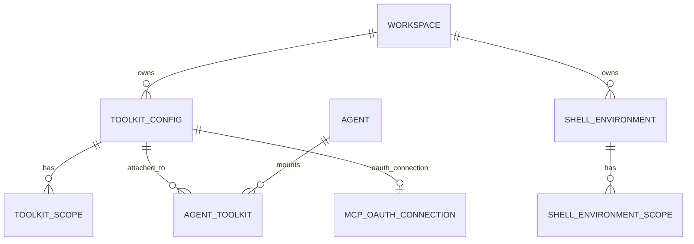
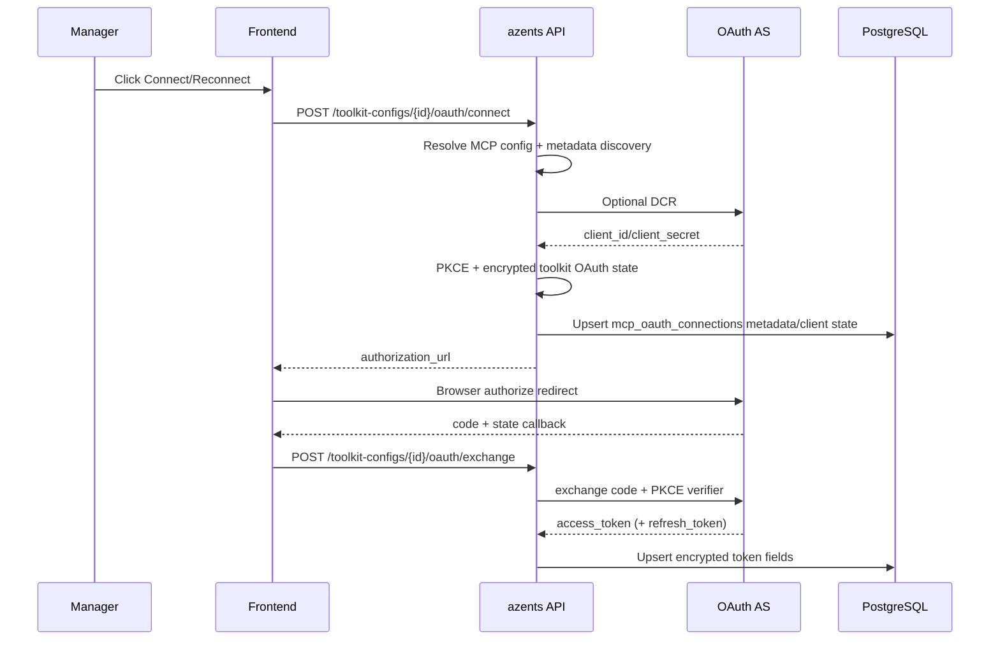
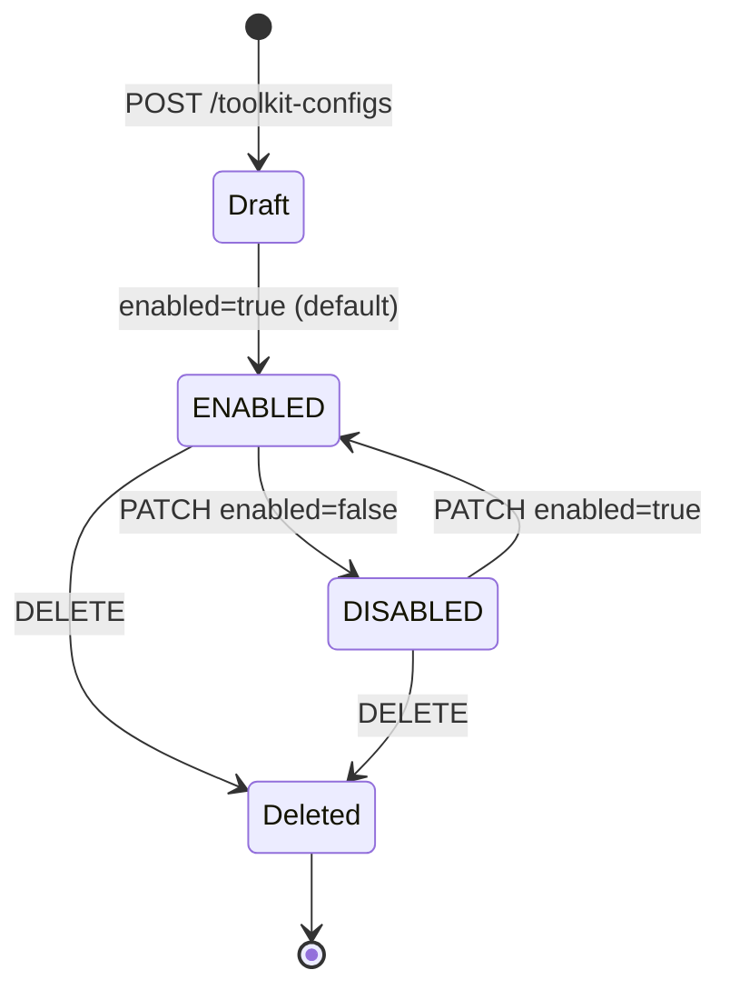
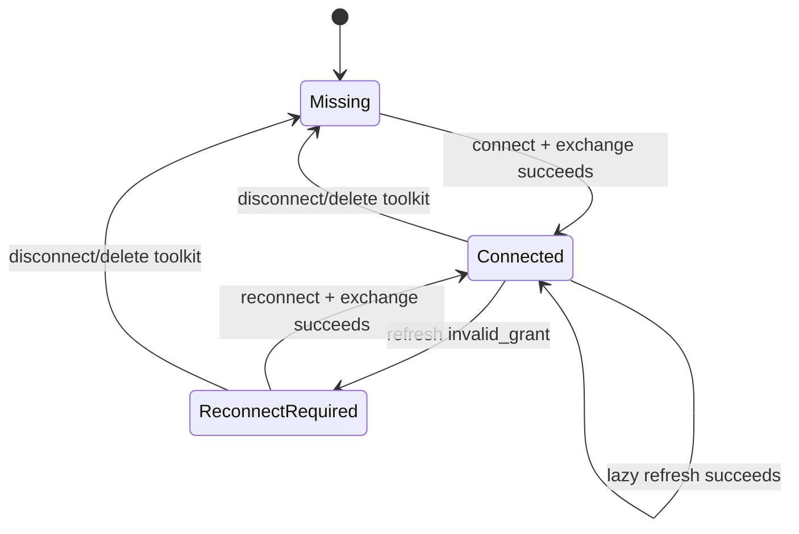

# Toolkit

## Overview

Toolkit is the **tool bundle** that an azents agent mounts to interact with the outside world. One ToolkitConfig consists of (a) **tool type (`toolkit_type`)**, (b) provider-specific **config** (for example MCP server URL, GCP project ID, GitHub toolsets), and (c) encrypted **credentials**. Workspace managers create toolkits and expose them to agents through workspace-level `ToolkitScope`.

This domain covers three feature groups.

1. **Toolkit bundle** — external service integration tools such as MCP / GitHub / GCP / AWS / Notion / Sentry / GoogleAnalytics / Kubernetes. Implemented by three tables: `ToolkitConfig` + `ToolkitScope` + `AgentToolkit`.
2. **MCP OAuth2 connection** — toolkit-level OAuth2 client/token state for remote MCP servers. Implemented by `MCPOAuthConnection`.
3. **ShellEnvironment** — Agent Runtime network domain restriction profile. Implemented by `ShellEnvironment` + `ShellEnvironmentScope`. Unlike other toolkits, Shell is **not mounted through AgentToolkit** and is injected directly into Runtime settings.

All credentials are stored in DB with Fernet (`AZ_CREDENTIAL_ENCRYPTION_KEY`) symmetric encryption and are never exposed in agent prompt. (`CredentialCipher`, [`python/apps/azents/src/azents/core/crypto.py`](../../../../python/apps/azents/src/azents/core/crypto.py))

## Domain Model



### Entities

- **ToolkitConfig** — workspace-owned tool + setting bundle. Can be shared by multiple agents. (`workspace_id`, `toolkit_type`, `slug`, `config`, `prompt`, `encrypted_credentials`, `enabled`). ([`rdb/models/toolkit.py`](../../../../python/apps/azents/src/azents/rdb/models/toolkit.py))
- **ToolkitScope** — workspace visibility scope for ToolkitConfig. `scope_type` is `WORKSPACE`; `scope_id` is the Workspace ID. WORKSPACE scope is automatically added on creation. ([`services/toolkit/__init__.py`](../../../../python/apps/azents/src/azents/services/toolkit/__init__.py))
- **AgentToolkit** — Agent ↔ ToolkitConfig link. `(agent_id, toolkit_id)` is UNIQUE. Denormalized `toolkit_type` column supports enforcing **one toolkit type per Agent**.
- **MCPOAuthConnection** — Toolkit-level MCP OAuth client registration and token state. `toolkit_id` is UNIQUE; client IDs, client secrets, access tokens, and refresh tokens are encrypted. Status is `connected` or `reconnect_required`.
- **ShellEnvironment** — workspace-owned network domain profile. Lists `allowed_domains`, `denied_domains`. Workspace can have at most one `is_default=True` row, enforced by partial unique index.
- **ShellEnvironmentScope** — ShellEnvironment visibility scope. Reuses same `ToolkitScopeType` enum as ToolkitScope.

### Enum / Type

- `ToolkitType` (code-level) — one of `shell`, `mcp`, `github`, `notion`, `gcp`, `aws`, `sentry`, `google_analytics`, `kubernetes`, `envvar`. DB column is free string but runtime must match key registered in `get_toolkit_registry`. ([`core/tools.py` L71-88](../../../../python/apps/azents/src/azents/core/tools.py))

  `envvar` is a generic environment variable injection toolkit. Long-lived API tokens (Notion / OpenAI / Sentry, etc.) can be stored and injected as child process env during agent shell execution. It implements `Toolkit.expose_env()` protocol. Unlike MCP-based toolkit, credentials are exposed inside Runtime. See [sandbox-credential-injection design (archived)](../../design/sandbox-credential-injection-2026-04-24.md).

  `github` toolkit has `inject_runtime_environment: bool` config option. When enabled, token resolved at runtime is exposed to Runtime Runner environment variables. PAT credentials expose `GH_TOKEN` and `GITHUB_TOKEN`. GitHub App credentials store `installations[]` targets with installation ID and account login metadata. For a single GitHub App installation, Runtime also exposes `GH_TOKEN` and `GITHUB_TOKEN`; for multiple installations, Runtime exposes `GITHUB_INSTALLATION_MAP` plus `GITHUB_TOKEN_INSTALLATION_<installation_id>` variables. The git credential helper installed in agent-runtime image (`/usr/local/bin/azents-git-credential`) reads the repository owner from Git credential protocol input and chooses the matching installation token. GitHub CLI commands are not wrapped; agents must explicitly select the desired installation token at command time, for example `GH_TOKEN=$GITHUB_TOKEN_INSTALLATION_<installation_id> gh ...`. Token TTL cache defaults to 55 minutes. See [github-toolkit-shell-env design](../../design/github-toolkit-shell-env-2026-04-24.md) and [github-toolkit-multi-installation design](../../design/github-toolkit-multi-installation.md).
- `ToolkitScopeType` — `workspace` StrEnum. ([`core/enums.py`](../../../../python/apps/azents/src/azents/core/enums.py))
- `ToolkitStatus` — status returned by toolkit every runtime turn: `enabled` / `disabled`. If `disabled`, no tools/prompts are delivered to LLM.

## Behavior

### Toolkit Type & Scope

ToolkitConfig is created per workspace and starts with **at least one WORKSPACE scope**. Toolkit visibility is workspace-only; Team-scoped Toolkit visibility is not current behavior.

`list_available_for_workspace_user` verifies WorkspaceUser membership and returns enabled toolkits with a WORKSPACE scope for the requested workspace. (`enabled=True` required) ([`repos/toolkit/__init__.py`](../../../../python/apps/azents/src/azents/repos/toolkit/__init__.py))

To mount toolkit on Agent:

1. Call `attach_to_agent(agent_id, toolkit_id)`.
2. Service checks Agent → Workspace ownership, Toolkit → Workspace ownership, and whether toolkit is in user's available list.
3. INSERT `AgentToolkit` row. UNIQUE violation on `(agent_id, toolkit_id)` returns `DuplicateAgentToolkit`.

### Tool Name Prefixing

ToolkitConfig `slug` is the DB-registered toolkit's model-visible namespace. It is unique within a workspace (`uq_toolkit_configs_workspace_slug`) and is used as the outer tool-name prefix for DB-registered toolkits.

`resolve_agent_tools()` resolves DB-registered `AgentToolkit` rows into `ToolkitBinding` records with `slug=ToolkitConfig.slug` and `use_prefix=True`. During `build_tool_catalog()`, every `FunctionTool` returned by an enabled binding is renamed with `tool.with_prefix(f"{slug}__")` when `use_prefix=True`. The final model-visible name is therefore:

```text
{toolkit_slug}__{tool_name}
```

Auto-bound single-instance toolkits use `use_prefix=False`; their tool names are exposed as-is. This applies to builtin/runtime shell tools and the session-bound goal/todo tools. For example, `exec_command`, `write_stdin`, `read`, `get_goal`, and `update_todo` are not prefixed.

Some toolkits may add their own internal segment before the outer ToolkitConfig slug is applied. GitHub multi-installation routing does this by prefixing each installation's MCP tools with a safe account-login segment. With ToolkitConfig slug `github`, installation `azents`, and MCP tool `get_file_contents`, the final model-visible name becomes:

```text
github__azents__get_file_contents
```

The slug prefix is only a tool-call namespace. Toolkit State uses its own `toolkit_namespace` field and is not derived automatically from the model-visible tool name.

Final provider-facing client tools are canonicalized by model-visible tool name before lowering to the model request. Toolkit-local generation may use whatever construction order is convenient, but `ToolCatalog.native_tools` is name-sorted so identical toolkit configuration and identical successful toolkit state produce stable function-tool ordering. Provider-hosted tools are also sorted by stable semantic name/config before request lowering when more than one hosted tool is present.

### Toolkit CRUD / Setup UI

azents-web provides workspace-scoped toolkit management screens.

- `/w/[handle]/toolkits` — Toolkit list accessible to current user.
- `/w/[handle]/toolkits/new` — config/credential input form per toolkit type.
- `/w/[handle]/toolkits/[toolkitId]/edit` — edit existing ToolkitConfig.
- `/w/[handle]/toolkit/[toolkitId]/setup` — connection status check and authorize redirect for toolkit requiring per-user OAuth/setup.

`features/toolkits` form branches config fields per toolkit type for GitHub, Kubernetes, MCP, Google Analytics, Notion, Sentry, GCP, AWS, Shell, and EnvVar. `features/toolkit-setup` executes setup action returned by backend, and if account link must come first it follows `next_toolkit` handoff from [`../flow/account-linking.md`](../flow/account-linking.md).

### GitHub Multi-Installation Routing

GitHub App Toolkit credentials are installation-aware.

- `github_app` stores App ID, private key, and `installations[]` target metadata.
- `github_app_platform` stores `installations[]` target metadata and uses platform App credentials from server config.
- Each installation target includes `installation_id`, `account_login`, `account_type`, and optional avatar URL.
- Platform App credentials validate every selected installation through the current user's synced `github_user_installations` access list.

At runtime, GitHubToolkitProvider creates one lazy MCP binding per installation. `update_context()` collects each binding's GitHub MCP tools and prefixes them with a safe account-login segment before the engine applies the ToolkitConfig slug prefix. For example, a toolkit slug `github` with `azents` and `hardtack` installations exposes final tool names such as `github__azents__get_file_contents` and `github__hardtack__create_pull_request`. The toolkit prompt includes the account-login to installation-ID mapping so the model can choose tools by repository owner.

When Runtime environment injection is enabled, multi-installation GitHub App credentials expose `GITHUB_INSTALLATION_MAP` and installation-specific token variables. The git credential helper routes HTTPS Git credentials by repository owner. GitHub CLI commands use `GH_TOKEN` / `GITHUB_TOKEN` from the current default installation. The default installation initially falls back to the first configured installation and can be changed during the session with the `switch_installation` tool by passing an installation ID or account login. The selected installation is stored in session-bound Toolkit State under namespace `github` and state name `selected_installation`. Single-installation credentials also expose `GH_TOKEN` and `GITHUB_TOKEN` for normal GitHub CLI compatibility.

### MCP OAuth Connection Flow

MCP-based toolkits (`mcp`, `notion`, `sentry`) use toolkit-level OAuth when their resolved MCP config has `auth_type=oauth2`. `oauth2_per_user` is no longer a supported auth type.



Runtime loads `mcp_oauth_connections` by `toolkit_id`, refreshes near-expiry tokens lazily under `SELECT ... FOR UPDATE`, and retries MCP tool calls once after a 401-triggered refresh. `invalid_grant` marks the connection `reconnect_required`.

Toolkit config responses include an `oauth_connection` summary for UI status/actions. The toolkit edit page exposes connect/reconnect/disconnect actions for generic MCP OAuth, Notion, and Sentry.

### MCP Tool Snapshot Lifecycle

MCP-backed toolkits must keep `list_tools` discovery off the normal run preparation critical path.

- `update_context()` reads the latest successful session-bound Toolkit State snapshot and returns immediately.
- If no successful snapshot exists, the toolkit exposes no MCP tools.
- Background refresh lists tools, sorts them deterministically, builds a complete serializable snapshot, then atomically replaces the stored snapshot.
- Refresh failure keeps the previous successful snapshot unchanged. If there is no previous snapshot, no tools are exposed.
- Loading, retry, setup, and status pseudo-tools are not model-visible MCP availability controls.
- MCP loading/error text is not injected into Toolkit prompts.
- Generic MCP, Notion, and Sentry use the common MCP snapshot lifecycle. AWS, GCP, and GitHub MCP wrapper paths follow the same non-blocking/no-loading-prompt exposure contract and sort component/tool output deterministically.

Snapshot payload stores only serializable tool metadata needed to rebuild model-visible wrappers, including raw MCP name, model-visible name, description, input schema, server URL, transport mode, loaded timestamp, and a stable tool hash. Runtime-only objects such as background tasks, auth callbacks, SigV4 auth, token providers, and artifact sinks stay in process memory.

GitHub multi-installation bindings must expose cached installation MCP tools even before the lazy concrete `McpToolkit` for that installation has finished preparing. A binding that already has target metadata, `agent_id`, `session_id`, and an installation-specific MCP snapshot state name has enough information to read a previous successful snapshot from Toolkit State. Reconstructing model-visible specs from that snapshot must not require installation token exchange.

Snapshot-backed GitHub tool handlers resolve installation authorization at execution time. They call the installation token provider only when the model calls a tool, and they preserve the same auth-failure retry path as live MCP-backed tools. This keeps first-turn provider-facing schemas stable when an installation snapshot exists, while avoiding token issuance work during normal run preparation.

### Credential Isolation

Strong invariant: **raw credential is never exposed in agent prompt**.

- **DB layer**: `RDBToolkitConfig.encrypted_credentials` stores Fernet ciphertext. If `ToolkitRepository` is created without cipher, it cannot read or write `credentials` field.
- **Output layer**: API response (`ToolkitConfigResponse`) does not return plaintext credentials, only exposes existence as `has_credentials: bool` (`ToolkitOutput.has_credentials`). ([`services/toolkit/data.py` L13-21](../../../../python/apps/azents/src/azents/services/toolkit/data.py))
- **Runtime injection**: credential is passed only to toolkit provider as `ResolveContext.credentials_json`, and is used as header/token only for network calls to MCP server. LLM system prompt includes only administrator-provided `ToolkitConfig.prompt`.

### Shell Environment Execution

Shell is composed of the builtin/runtime toolkit (`exec_command` / `write_stdin` / import_file / present_file / read / write / grep / glob / ...) and is injected by default for all agents. ShellEnvironment is a profile determining **which domains are allowed for external network calls**.

- ShellToolkitConfig has fields `allowed_domains`, `denied_domains`, `agent_data_root`, `memory_enabled` ([`core/tools.py` L331-356](../../../../python/apps/azents/src/azents/core/tools.py)).
- Runtime reads allow/block lists from Runtime settings, builds `SandboxDomainConfig`, and Agent Runtime lifecycle path passes it to Provider allocation policy ([`services/agent_runtime`](../../../../python/apps/azents/src/azents/services/agent_runtime), [`runtime`](../../../../python/apps/azents/src/azents/runtime)).
- If `allowed_domains` is empty, it runs in "allow all" mode (only denied_domains applied).
- Shell file tools guide LLM-facing path surface for durable working files under Provider-reported Agent Workspace and temporary files under `/tmp/**`. User upload is copied to Runtime by `import_file` using `exchange://{object_key}` file-location URI, and internal artifact is copied with `artifact://{storage_key}` file-location URI. `/tmp/**` destination import warns that result can disappear after Runtime restart and returns original URI for reimport. `present_file` exports only files under durable Agent Workspace as user-visible `exchange://{object_key}` attachment.
- `grep` file tool accepts both file path and directory path. Directory path searches recursively by default. Built-in heavy-directory excludes such as `.git`, `node_modules`, `.next`, and build/cache directories are applied by default. `exclude` adds caller-provided exclude patterns on top of those defaults; `disable_default_excludes: true` explicitly scans paths that the defaults would skip. Grep also enforces searched-file and scanned-byte safety caps so sparse matches across very large workspaces do not monopolize Runtime operation time.
- `glob` file tool accepts absolute path patterns. Recursive patterns such as `**` search below the non-glob prefix and may return matching directories as well as files so directory-oriented patterns like `/workspace/agent/.claude/skills/*` are visible to agents. Built-in heavy-directory excludes such as `.git`, `node_modules`, `.next`, and build/cache directories are applied by default. `exclude` adds caller-provided exclude patterns on top of those defaults; `disable_default_excludes: true` explicitly scans paths that the defaults would skip.
- Shell prompt guides LLM to prefer dedicated file tools for filesystem work: use `read` instead of `cat`, `grep` instead of shell `grep`/`rg`, `write`/`edit` instead of shell redirection or `sed` when possible. Use `exec_command` for command execution, package installation, or when dedicated tool does not fit. Use `write_stdin` with empty `chars` to poll a running process. Runtime config prompts sort registered projects and domain lists deterministically.
- `exec_command(command, workdir?, yield_time_ms?, max_output_bytes?)` starts a pipe-based Runner-owned process. If the process exits within the yield window, the tool result includes final output and exit code. If it is still running, the result includes collected output plus a process `process_id` for later interaction. `yield_time_ms` defaults to 10000 ms and accepts the 250-30000 ms range.
- `write_stdin(process_id, chars = "", yield_time_ms?, max_output_bytes?)` writes to an existing process. Empty `chars` is the poll primitive and only drains unread output. Non-empty writes default to 250 ms and cap at 30000 ms; empty polls default to 5000 ms and allow 5000-300000 ms. Missing/expired/terminated process ids are returned as normal tool observations with structured metadata rather than assistant/system failures. Per ADR-0083, user stop requests TERM for all live exec processes owned by the stopped `AgentSession`; worker graceful shutdown/handover does not TERM runner-owned exec processes by itself.
- Runtime process tool results are text for model visibility plus generic `metadata` on the client tool result payload. Metadata includes process status, process id when present, exit code when exited, truncation facts, and missing reason when unavailable. The engine preserves this metadata generically and does not branch on exec-specific keys.
- The legacy `bash` tool is no longer exposed as the model-visible runtime shell command tool. Existing file tools continue to use Runner file operations.

### Runtime Hook Provider Contract

Runtime `Toolkit` instance can explicitly register supported lifecycle callbacks through `hooks() -> RuntimeHooks`. Registration is `TypedDict(total=False)` mapping. Dispatcher does not infer by method existence; it only calls callbacks present in mapping key.

- Default `hooks()` implementation returns empty mapping, so toolkit without hooks behaves as no-op provider.
- One lifecycle key registers at most one callback per provider. If provider needs to compose multiple behaviors, it owns ordering inside that callback.
- Dispatcher records normal exceptions from all hooks as structured warning and trace event, then isolates them fail-open. `asyncio.CancelledError` is execution stop signal and propagates.
- Dispatch target is not every Toolkit connected to run, but only Toolkit bindings that remained `ToolkitStatus.ENABLED` and activated without exception in that turn's `update_context()`. Sandbox lifecycle uses a resolver injected into sandbox manager to determine provider list separately.
- Trace stores only provider slug, lifecycle, status, result kind, exception class, duration, short-circuit status. Raw args, raw output, prompt text, and credential are not stored.

Supported lifecycles:

| Lifecycle | Context | Result | Meaning |
|---|---|---|---|
| `on_session_start` | `SessionStartHookContext` | `None` | called once on first run of session lifetime |
| `on_session_clear` | `SessionClearHookContext` | `None` | defined in provider contract but not yet dispatched in current clear path |
| `on_session_compact` | `SessionCompactHookContext` | `None` | defined in provider contract but not yet dispatched in current compaction path |
| `on_run_start` | `RunStartHookContext` | `None` | called right after run execution starts |
| `on_run_end` | `RunEndHookContext` | `None` | called for every started run with `completed` / `error` / `cancelled` / `unknown` reason |
| `on_turn_start` | `TurnStartHookContext` | `TurnStartResult` or `None` | can inject additional user prompt at turn start |
| `on_turn_end` | `TurnEndHookContext` | `None` | called for every started turn with reason |
| `on_before_tool_call` | `BeforeToolCallHookContext` | `ToolCallDecision` or `None` | decide allow/deny before tool handler execution |
| `on_after_tool_call` | `AfterToolCallHookContext` | `ToolOutputDecision` or `None` | keep or replace text channel of tool handler result |
| `on_sandbox_hibernate` | `SandboxHibernateHookContext` | `None` | legacy sandbox hibernate hook; Provider persistence is event in Agent Runtime path |
| `on_sandbox_restore` | `SandboxRestoreHookContext` | `None` | legacy sandbox restore hook; Provider persistence is event in Agent Runtime path |

Injected prompt returned by `on_turn_start` is passed to engine as event hook prompt result with `hook_provider_slug` and `hook_prompt_index` filled by dispatcher. `persistence=visible_user_input` is stored as normal user input, and `hidden_internal_input` is stored as internal user input, both included in replay/resume.

`deny` decision from `on_before_tool_call` short-circuits on first deny, returns deny message as tool output, and does not run handler. `on_after_tool_call` forms provider-order pipeline. If earlier provider returns `replace_output`, next provider receives replaced `output_text`; final replacement applies only to SDK output text channel. Image artifact block is preserved and output cap is reapplied after replacement.

AGENTS.md instruction loader registers runtime hooks through `hooks()`. It does not inject AGENTS.md content into Toolkit prompts.

### AGENTS.md Instruction Loading

Shell runtime treats AGENTS.md as a successful `read` tool result appendix, not as a Toolkit/system prompt fragment.

- Root instruction candidate is `/workspace/agent/AGENTS.md` for read targets under `/workspace/agent`.
- Registered Project instruction candidates are `AGENTS.md` files from the Project root to the read target directory, parent-to-child.
- Candidate content is read fresh from Runtime file storage only while handling a successful `read` result.
- Missing and non-file candidates are ignored.
- Reading an `AGENTS.md` file does not append that same file as its own appendix.
- `write`, `edit`, `delete`, `grep`, `glob`, `import_file`, `present_file`, and `read_image` do not append AGENTS.md instructions in this contract.
- Toolkit State stores only a sorted dedupe path list under namespace `builtin`, state name `agents_md_appendix_dedupe`; it does not store AGENTS.md content.
- `on_session_compact` clears the dedupe path list so future reads may append current AGENTS.md content again.
- Appendix content uses the existing AGENTS.md content cap and is appended after the original read output in a `<system-reminder>` block.
- Prompt builds and toolkit startup must not start or touch Runtime solely to discover AGENTS.md.

The shell runtime prompt contains only fixed guidance that read results may include `<system-reminder>` AGENTS.md appendix blocks and that the agent should follow them for the paths they apply to.

### Goal/Todo Prompt and Result Stability

Goal and Todo auto-bound toolkits expose fixed tool definitions independent of current stored state. Their Toolkit prompts are fixed instruction text and do not include the current Goal objective/status or Todo list. The model can call `get_goal` when it needs exact Goal state; Todo UI/state snapshots remain the user-visible source of truth for Todo state.

`update_todo` persists the new state and publishes `TodoStateChanged`, but returns compact acknowledgement text (`Done`) instead of echoing the full Todo JSON.

### Activation Conditions by Toolkit

| Toolkit | Activation condition | Credential source |
|---|---|---|
| `shell` (builtin) | always. Domain restriction by ShellEnvironment. | — |
| `mcp` | ToolkitConfig.enabled=True and `auth_type` satisfied (`none`/`header`/`bearer`/`oauth2`) | `encrypted_credentials` for static auth or `MCPOAuthConnection` for OAuth2 |
| `github` | depends on `github_auth_type` — `pat`: workspace ToolkitConfig credentials, `github_app`: installation id, `github_app_platform`: platform App JWT | ToolkitConfig `encrypted_credentials` or platform App configuration |
| `notion`, `sentry` | MCP + toolkit-level OAuth2 connection exists | `MCPOAuthConnection` |
| `gcp`, `aws` | Cloud-provider native auth (IRSA / workload identity) | — (no config) |
| `kubernetes` | depends on `clusters[].auth_type` — kubeconfig / token / EKS / GKE | kubeconfig secret |
| `google_analytics` | service account / ADC | — |

### Main-Only Toolkit

**Main-only toolkit** is a toolkit kept parent-agent-only so it is not exposed even if subagent inherits parent toolkit (§ "Toolkit Inherit"). Reasons include recursion prevention (`subagent` tool), context pollution prevention (`memory`), and role separation (`schedule`, background task).

Each Toolkit self-defines tools to exclude from subagent (DP4 C — [`design/subagent-inherit-2026-04-24.md` §DP4](../../design/subagent-inherit-2026-04-24.md)).

- **`BuiltinToolkit.SUBAGENT_EXCLUDED_TOOLS`** — `frozenset({"shell_recreate_sandbox"})`. This tool can destroy parent sandbox and break parent execution if called by subagent accidentally. Applied to subagent-bound `BuiltinToolkit` with `set_excluded_tools(BuiltinToolkit.SUBAGENT_EXCLUDED_TOOLS)` ([`engine/tools/subagent.py`](../../../../python/apps/azents/src/azents/engine/tools/subagent.py), [`engine/tools/shell.py`](../../../../python/apps/azents/src/azents/engine/tools/shell.py)).
- Built-in main-only tools (`memory`, `schedule`, `subagent`, `background_task`) are structurally blocked through other paths:
  - memory prompt/tools are controlled by `Agent.memory_enabled=False` (subagent path forces `memory_enabled=False`).
  - `schedule`, `subagent`, `background_task` toolkits are **dynamically injected by worker engine** and are not stored in `agent_toolkits` table. Subagent tool resolve path does not have this dynamic inject, so they are naturally not inherited.

External constant lists (`MAIN_ONLY_TOOL_NAMES`, `MAIN_ONLY_TOOLKIT_TYPES`) were removed and changed so each Toolkit encapsulates its own exclusion (DP4 C). If a DB-registered MCP toolkit needs "main-only" later, extend that Toolkit with an attribute. Introducing DB column (`toolkit_configs.main_only`) is postponed as excessive for current requirements.

### Toolkit Inherit (Subagent)

Subagent can optionally inherit parent's DB-registered toolkits. Inherit is controlled at agent row level ([`rdb/models/agent_subagent.py`](../../../../python/apps/azents/src/azents/rdb/models/agent_subagent.py), [`repos/agent_subagent/data.py`](../../../../python/apps/azents/src/azents/repos/agent_subagent/data.py)).

- **`agents.toolkit_inherit_mode`** column — enum `'all'` (default, DP2 B) / `'none'`. Controlled at Agent row level (DP1 A).
- **`'all'` (default)** — When subagent is called, use parent's DB-registered toolkit **exclusively**. Subagent's own `agent_toolkits` are **completely ignored** (no merge). Runtime branch details: [`spec/flow/subagent-delegation.md` §4](../flow/subagent-delegation.md).
- **`'none'`** — Subagent's own `agent_toolkits` junction is used as-is. Same as existing behavior (no regression). Existing subagents were opted out to `'none'` in migration.

**Inherit target** — only DB-registered toolkits stored in `agent_toolkits` table. These are **not** inherited regardless of inherit mode:

- **Auto-bound** — `BuiltinToolkit` (shell + file + grep, etc.; only memory part turned off for subagent with `memory_enabled` flag), `Schedule`. They are injected directly by worker engine rather than DB junction.
- **Worker dynamic inject** — `subagent`, `background_task`, etc. Not intentionally injected into subagent tool resolve to prevent recursion (A → B → A).

**Design rationale**: "general-purpose subagent — subagent inheriting tools used by parent as-is" use case from issue [#2967](https://github.com/azents/azents/issues/2967). See [`design/subagent-inherit.md` § DP6](../../design/subagent-inherit.md) for Exclusive (no merge) rationale.

## Business Rules

- `[toolkit-type-unique-per-agent]` At most one AgentToolkit with same `toolkit_type` per Agent. Enforced by denormalized `agent_toolkits.toolkit_type` column + application-level validation (currently no DB-level constraint, UNIQUE only on `(agent_id, toolkit_id)`). ([`rdb/models/toolkit.py` L150-163](../../../../python/apps/azents/src/azents/rdb/models/toolkit.py))
- `[toolkit-slug-unique-per-workspace]` `(workspace_id, slug)` is UNIQUE. Slug allows lowercase letters, numbers, and underscores only (`^[a-z0-9_]+$`); dashes are rejected because the slug becomes the outer model-visible tool namespace before the `__` tool separator. If slug omitted, default is `toolkit_type`. ([`services/toolkit/__init__.py` L124-125](../../../../python/apps/azents/src/azents/services/toolkit/__init__.py))
- `[workspace-scope-access]` WORKSPACE scope toolkit can be attached by workspace members. Toolkit visibility is workspace-only.
- `[shell-is-not-toolkit-config]` Request creating ToolkitConfig with `toolkit_type="shell"` returns 400. Shell is managed only through ShellEnvironment. ([`api/public/toolkit/v1/__init__.py` L82-87](../../../../python/apps/azents/src/azents/api/public/toolkit/v1/__init__.py))
- `[mcp-oauth-toolkit-level]` MCP OAuth connection is UNIQUE by `toolkit_id`. All runs mounting the same ToolkitConfig use the same OAuth connection.
- `[mcp-oauth-no-per-user]` `oauth2_per_user`, `MCPAuthRequest`, and `MCPOAuth2Token` are removed current behavior. Runtime does not emit per-user authorization request events for MCP OAuth.
- `[oauth-state-encrypted]` State passed through OAuth connect/exchange is AES-GCM encrypted with a key derived from the credential encryption key. State payload binds toolkit_id, workspace_id, manager user_id, redirect_uri, and PKCE verifier.
- `[oauth-dcr-when-needed]` If no existing/client credentials are available and the OAuth server exposes `registration_endpoint`, connect performs Dynamic Client Registration and stores the returned client fields in `MCPOAuthConnection`.
- `[credential-encryption-required]` If `ToolkitRepository` is instantiated without cipher, credential field read/write raises exception — plaintext storage in DB impossible.
- `[credentials-not-in-response]` ToolkitConfigResponse does not include plaintext credentials and exposes only `has_credentials: bool`.
- `[workspace-default-shell-env]` Workspace can have at most one ShellEnvironment with `is_default=True` (DB-enforced by partial unique index `ix_shell_environments_workspace_default`). ([`rdb/models/shell_environment.py` L64-69](../../../../python/apps/azents/src/azents/rdb/models/shell_environment.py))
- `[default-shell-env-not-deletable]` Deleting default ShellEnvironment returns 400 (`DefaultCannotBeDeleted`).
- `[shell-domain-whitelist]` If ShellEnvironment.allowed_domains is not empty, sandbox network proxy blocks domain requests outside whitelist. denied_domains are always blocked regardless of allow status.
- `[shell-env-name-unique]` `(workspace_id, name)` is UNIQUE — duplicate ShellEnvironment name forbidden.
- `[agent-workspace-file-tool-boundary]` Shell file tools guide Provider-reported Agent Workspace subpaths and `/tmp/**` paths. External Exchange files and internal Artifacts enter Runtime through `import_file`; `/tmp/**` import result includes transient warning and original file-location URI. User-downloadable file is exported by `present_file` only from Agent Workspace subfile as `exchange://{object_key}` attachment.
- `[agents-md-project-boundary]` Project-scoped `AGENTS.md` auto-load works only inside registered Project. Agent Workspace root instruction is separate root scope, and Agent Workspace root itself is not treated as Project.
- `[toolkit-hook-effects]` Toolkit tool-call hook may perform `on_before_tool_call` deny and `on_after_tool_call` text output replacement within ADR-0033 scope. Arbitrary input mutation, retry/continuation wrapper, credential trace storage are not allowed.
- `[toolkit-session-lifecycle]` Executable Toolkit instance is managed by session-scoped lifecycle registry tied to `_SessionRunner` active lifetime. New run reconciles desired toolkit snapshot, and new toolkit `__aenter__()` must complete before engine `update_context()` call. Removed toolkit is `__aexit__()` after successful reconcile.
- `[toolkit-turn-context]` run/turn-scoped values such as `run_id`, current actor `user_id`, `publish_event`, `check_stop` must not remain stale in long-lived toolkit instance. If tool handler needs these values, create handler with current turn values from `update_context(TurnContext)`.

## State Transitions

### ToolkitConfig



- In `DISABLED`, toolkit is excluded from `list_available_for_workspace_user` result and runtime does not resolve toolkit. AgentToolkit row remains.
- Credential/config changes automatically invalidate existing credentials when `auth_type` changes (`repo_update["credentials"] = None`). ([`services/toolkit/__init__.py` L269-274](../../../../python/apps/azents/src/azents/services/toolkit/__init__.py))

### MCPOAuthConnection



`Connected` means runtime may use the encrypted access token, refreshing lazily when needed. `ReconnectRequired` means runtime should not assume refresh can recover; a manager reconnect is required.

## Permissions

All endpoints first pass `WorkspaceMember` authentication; subsequent permissions:

| Permission | Target | Use |
|---|---|---|
| `TOOLKITS_WRITE` | Manager+ | Toolkit Config CRUD, Scope management, OAuth authorize, GitHub platform installations |
| `TOOLKITS_READ` | Member+ | available toolkit query, attach/detach toolkit to Agent, test-connection |
| `SHELL_ENVIRONMENTS_WRITE` | Manager+ | ShellEnvironment CRUD, scope management, set-default |
| `SHELL_ENVIRONMENTS_READ` | Member+ | available ShellEnvironment query, detail query |

Role mapping: Manager has READ + WRITE, Member has READ only ([`core/auth/roles.py` L26-39](../../../../python/apps/azents/src/azents/core/auth/roles.py)).

Toolkit OAuth connect, exchange, and disconnect require `TOOLKITS_WRITE` because the OAuth connection is toolkit-level manager-owned state.

Unauthenticated endpoint: `GET /toolkits` (platform-provided ToolkitProvider catalog) — available even before login.

## Toolkit State

Toolkit State is a common storage model where a toolkit can store durable JSON state bound to one AgentSession. Side state that does not need a separate relation model but must persist between turns is stored in the `toolkit_states` table.

Identity is always session-bound and is the combination of `agent_id`, `session_id`, `toolkit_namespace`, and `state_name`. `session_id` is required. Stored payload consists of `state_json`, `schema_version`, and optimistic-lock `version`.

Runtime abstraction is `ToolkitStateStore` and typed `ToolkitStateHandle`. `load(default_factory)` returns default if row is missing. `save(state)` performs whole-state replace. `update(default_factory, mutator)` reads latest state, applies the mutator, and retries on optimistic lock conflict.

### Session Todo State

TodoToolkit stores todo list as session-scope Toolkit State.

- scope: `session`
- toolkit namespace: `todo`
- state name: `todo`
- schema version: `1`

Payload is `items` array. Each item has `content`, `status`. Status values allowed are only `pending`, `in_progress`, `completed`.

TodoToolkit is always-on toolkit not exposed as user Toolkit config, like shell/builtin, and provides unprefixed `update_todo` tool. Operations:

- `replace`: replace entire list with input item array.
- `clear`: clear entire list.

After `update_todo`, saved snapshot is exposed to UI through chat live state `todo` field and WebSocket `todo_state_changed` event. Todo is not durable transcript event and is not separately injected into compaction input.

## API Reference

OpenAPI spec is authoritative for all endpoints. Major operations:

### `/toolkit/v1` (omitting `/workspaces/{handle}` prefix)

**ToolkitConfig CRUD** (Manager)
- `POST /toolkit-configs` — create
- `GET /toolkit-configs` — Manager list all
- `GET /toolkit-configs/available` — list available to current user
- `GET|PATCH|DELETE /toolkit-configs/{id}` — get/update/delete one

**Scope management**
- `POST /toolkit-configs/{id}/scopes` — add ToolkitScope
- `GET /toolkit-configs/{id}/scopes` — list
- `DELETE /toolkit-configs/{id}/scopes/{scope_id}` — delete

**Agent Toolkit**
- `GET /agents/{agent_id}/toolkits` — list mounted toolkits
- `POST /agents/{agent_id}/toolkits` — attach
- `DELETE /agents/{agent_id}/toolkits/{agent_toolkit_id}` — detach

**OAuth / Test connection**
- `POST /toolkit-configs/{id}/oauth/connect` — issue manager-owned toolkit OAuth authorization URL
- `POST /toolkit-configs/{id}/oauth/exchange` — callback code → toolkit OAuth connection token exchange
- `DELETE /toolkit-configs/{id}/oauth/connection` — delete toolkit OAuth connection
- `POST /toolkit-configs/{id}/test-connection` — test saved toolkit connection
- `POST /toolkit-configs/test-connection` — test unsaved form values connection
- `GET /github/platform-install-url` — GitHub Platform App installation URL
- `GET /github/platform-oauth-url` — GitHub Platform OAuth URL
- `POST /github/platform-installations` — OAuth code → user's installation list

**Catalog**
- `GET /toolkits` — (unauthenticated) platform ToolkitProvider catalog + config schema

### `/shell-environment/v1`

- `POST /workspaces/{handle}/shell-environments` — create
- `GET /workspaces/{handle}/shell-environments[/available|/{id}]` — query
- `PATCH /workspaces/{handle}/shell-environments/{id}` — update
- `POST /workspaces/{handle}/shell-environments/{id}/set-default` — set default
- `DELETE /workspaces/{handle}/shell-environments/{id}` — delete (not default)
- `POST|GET|DELETE /workspaces/{handle}/shell-environments/{id}/scopes[/{scope_id}]` — scope CRUD

## Glossary

- **Toolkit** — tool bundle mounted by agent. Combination of platform provider + workspace `ToolkitConfig`.
- **ToolkitConfig** — concrete toolkit instance created by workspace.
- **ToolkitScope** — workspace visibility row. `scope_type` is `workspace`.
- **AgentToolkit** — agent ↔ toolkitConfig mount relation.
- **ToolkitProvider** — code-level toolkit implementation ABC. Creates executable `Toolkit` instance with `resolve()`.
- **Toolkit (runtime)** — executable instance that session lifecycle registry enters/reuses/exits while active `AgentSession` lives. Returns tools/prompt every turn with `update_context()`. Controls LLM exposure with `ToolkitStatus.ENABLED/DISABLED`. Active Toolkit can register tool-call before/after hooks per ADR-0033 hook contract.
- **MCP** — Model Context Protocol. Current production path uses remote HTTP / Streamable HTTP/SSE based MCP toolkit. Dormant per-agent stdio sidecar path was removed by ADR-0029.
- **DCR** — Dynamic Client Registration. Automatic OAuth2 client registration. Stored as `McpSecretsOAuth2Dcr`.
- **PKCE** — OAuth2 public client protection (S256 code_challenge/verifier).
- **toolkit-level OAuth** — OAuth client/token state owned by one ToolkitConfig and stored in `mcp_oauth_connections`.
- **ShellEnvironment** — workspace sandbox network profile. Lists allowed/denied domains.
- **Fernet** — `cryptography` symmetric encryption. URL-safe base64 32 byte key from `AZ_CREDENTIAL_ENCRYPTION_KEY` environment variable.

## Changelog

- **2026-06-28** (spec_version 37) — Promoted Runtime Exec Process Tools behavior: runtime shell command execution is exposed as `exec_command`/`write_stdin`, `bash` is removed from model-visible runtime shell tools, and process tool results preserve generic metadata.
- **2026-06-13** (spec_version 23) — Split TodoToolkit into separate always-on toolkit and reflected `update_todo` tool plus chat live state exposure contract.
- **2026-06-15** (spec_version 24) — Removed deleted external chat platform toolkit provider and auto-binding description; updated to current ToolkitType surface.
- **2026-05-19** (spec_version 13) — Changed LLM-facing name of Shell command execution tool from `shell_execute_code` to `bash`.
- **2026-04-24** (spec_version 3) — Added Main-Only Toolkit section and Toolkit Inherit (Subagent) section. Reflected BuiltinToolkit self-encapsulation (DP4 C), `agents.toolkit_inherit_mode` default `'all'` (DP2 B), and agent-row-level policy. Related issue [#2967](https://github.com/azents/azents/issues/2967), design `design/subagent-inherit.md`.
- **2026-05-03** (spec_version 4) — External platform routing transition Phase 1. Removed legacy session mapping lookup from external platform interface toolkit provider and reflected that `resolve_for_interface()` returns `None` when there is no interface context.
- **2026-05-05** (spec_version 5) — Reflected state at time external platform inbound switched to fixed agent-based active `AgentSession` dispatch. Interface toolkit activated only with interface context of that run and no legacy session lookup.
- **2026-05-05** (spec_version 6) — Reflected Exchange import/export and `/home/sandbox`/`/tmp` path policy for Shell file tools.
- **2026-05-06** (spec_version 7) — Restricted `present_file` export target to durable `/home/sandbox/**` and reflected transient warning contract for `/tmp/agent/uploads/**` import result.
- **2026-04-24** (spec_version 2) — Reflected `envvar` toolkit and `github` toolkit `inject_sandbox_environment` option in Enum / Type section. This option is normalized from legacy config keys `inject_shell_env`/`inject_sandbox_setting` through DB migration. Rationale: `design/sandbox-credential-injection-2026-04-24.md`, `design/github-toolkit-shell-env-2026-04-24.md`.
- **2026-04-20** (spec_version 1) — Initial Living Spec. Integrated three entity groups into one spec: Toolkit + MCP OAuth + ShellEnvironment. Corresponding code: ToolkitConfig CRUD, ToolkitScope, AgentToolkit, MCP per-user OAuth (superseded by toolkit-level OAuth), MCPAuthRequest rate limit + mute, ShellEnvironment + Scope, sandbox domain whitelist injection.
- **2026-05-14** (spec_version 11) — Reflected Toolkit tool-call observation hook and builtin AGENTS.md instruction loading contract. Added root `/home/sandbox/AGENTS.md`, loaded Project boundary, active Toolkit hook dispatch rules.
- **2026-05-25** (spec_version 15) — Updated Shell/file tool path surface to Provider-reported Agent Workspace path and reflected Runtime Runner operation path plus explicit no-fallback workspace path contract.
- **2026-06-11** (spec_version 21) — Corrected Project-scoped `AGENTS.md` boundary from loaded Project to registered Project after Project Source/load-state removal.

- **2026-06-26** (spec_version 36) — Updated Shell `glob` recursive/directory matching contract and changed `glob`/`grep` exclude semantics to additive defaults with explicit `disable_default_excludes`. Added grep searched-file and scanned-byte safety cap behavior.

## Session Goal Toolkit

Goal Toolkit is a session-scoped Toolkit State tool that is always auto-bound without user settings. State namespace/name is `goal/goal`; it stores `schema_version`, `objective`, `status`, `created_at`, `updated_at`. Supported statuses are `active`, `paused`, `blocked`, `complete`.

Exposed tools are `get_goal`, `create_goal`, `update_goal`. `create_goal` fails if unfinished Goal already exists. `update_goal` only allows transitioning active Goal to `complete` or `blocked`. Subagent execution does not inherit parent session Goal.

Goal Toolkit registers `on_session_idle` runtime hook. If active Goal exists, it returns continuation input containing Goal objective. Dispatcher merges continuations from multiple providers in provider order and attaches provider slug/index metadata.

- **2026-06-22 (spec_version=33)** — Removed Team-scoped Toolkit visibility. ToolkitScope is workspace-only.
