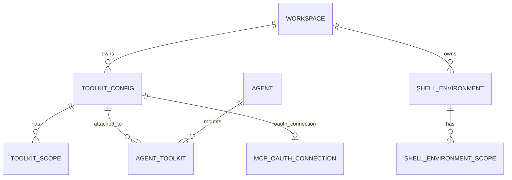
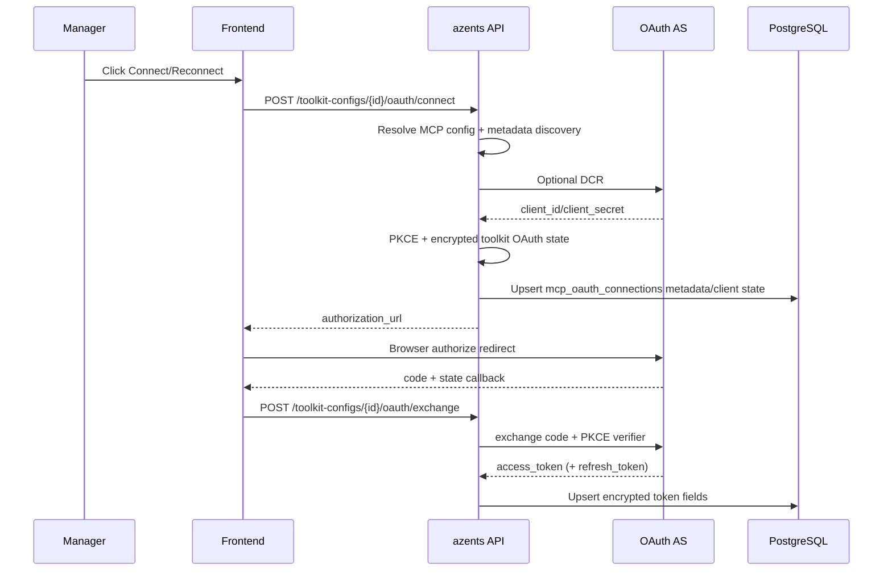
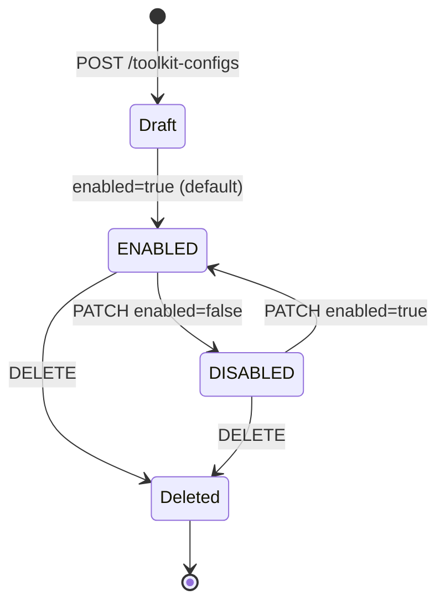
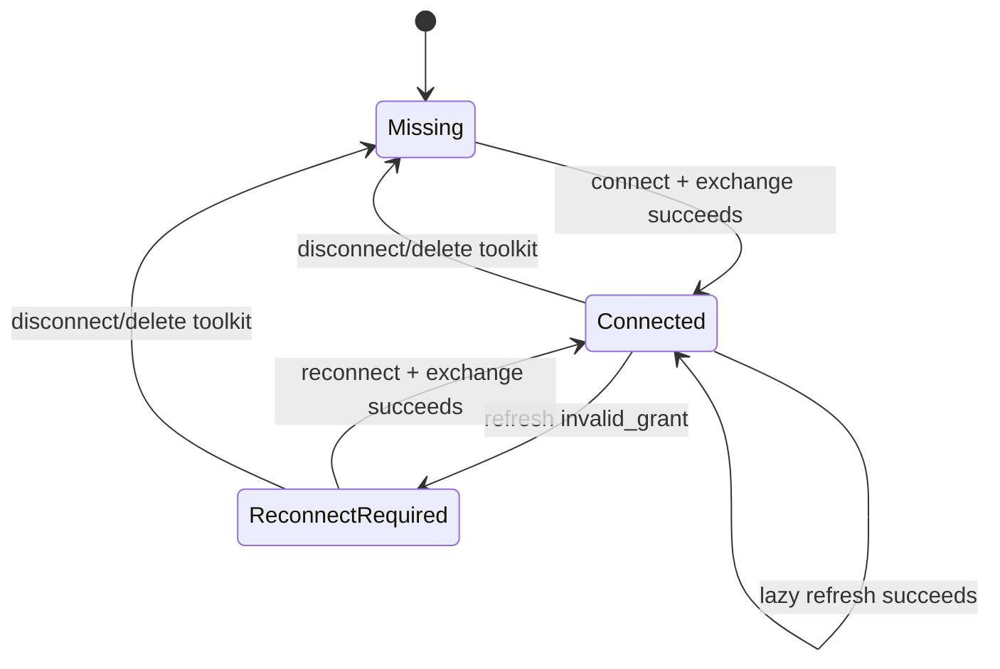

# Toolkit

## Overview

Toolkit is the **tool bundle** that an azents agent mounts to interact with the outside world. One ToolkitConfig consists of (a) **tool type (`toolkit_type`)**, (b) provider-specific **config** (for example MCP server URL, GCP project ID, GitHub toolsets), and (c) encrypted **credentials**. Workspace managers create toolkits and expose them to agents through workspace-level `ToolkitScope`.

This domain covers four feature groups.

1. **Toolkit bundle** — external service integration tools such as MCP / GitHub / GCP / AWS / Notion / Sentry / GoogleAnalytics / Kubernetes. Implemented by three tables: `ToolkitConfig` + `ToolkitScope` + `AgentToolkit`.
2. **MCP OAuth2 connection** — toolkit-level OAuth2 client/token state for remote MCP servers. Implemented by `MCPOAuthConnection`.
3. **ShellEnvironment** — Agent Runtime network domain restriction profile. Implemented by `ShellEnvironment` + `ShellEnvironmentScope`. Unlike other toolkits, Shell is **not mounted through AgentToolkit** and is injected directly into Runtime settings.
4. **Managed Skill VFS** — immutable run-scoped `azents://` resources for release-bundled global and Toolkit Provider Skills. Managed files remain outside the Runtime filesystem until `import_file` materializes one selected entry.

All credentials are stored in DB with Fernet (`AZ_CREDENTIAL_ENCRYPTION_KEY`) symmetric encryption and are never exposed in agent prompt. (`CredentialCipher`, [`python/apps/azents/src/azents/core/crypto.py`](../../../../python/apps/azents/src/azents/core/crypto.py))

## Domain Model



### Entities

- **ToolkitConfig** — workspace-owned tool + setting bundle. Can be shared by multiple agents. (`workspace_id`, `toolkit_type`, `slug`, `config`, `prompt`, `encrypted_credentials`, `enabled`, `revision`). `revision` starts at `1` and increments whenever persisted ToolkitConfig state changes. ([`rdb/models/toolkit.py`](../../../../python/apps/azents/src/azents/rdb/models/toolkit.py))
- **ToolkitScope** — workspace visibility scope for ToolkitConfig. `scope_type` is `WORKSPACE`; `scope_id` is the Workspace ID. WORKSPACE scope is automatically added on creation. ([`services/toolkit/__init__.py`](../../../../python/apps/azents/src/azents/services/toolkit/__init__.py))
- **AgentToolkit** — Agent ↔ ToolkitConfig link. `(agent_id, toolkit_id)` is UNIQUE. Denormalized `toolkit_type` column supports enforcing **one toolkit type per Agent**.
- **MCPOAuthConnection** — Toolkit-level MCP OAuth client registration and token state. `toolkit_id` is UNIQUE; client IDs, client secrets, access tokens, and refresh tokens are encrypted. Status is `connected` or `reconnect_required`.
- **ShellEnvironment** — workspace-owned network domain profile. Lists `allowed_domains`, `denied_domains`. Workspace can have at most one `is_default=True` row, enforced by partial unique index.
- **ShellEnvironmentScope** — ShellEnvironment visibility scope. Reuses same `ToolkitScopeType` enum as ToolkitScope.

### Enum / Type

- `ToolkitType` (code-level) — one of `shell`, `mcp`, `github`, `notion`, `gcp`, `aws`, `sentry`, `google_analytics`, `kubernetes`, `envvar`. DB column is free string but runtime must match key registered in `get_toolkit_registry`. ([`core/tools.py` L71-88](../../../../python/apps/azents/src/azents/core/tools.py))

  `envvar` is a generic environment variable injection toolkit. Long-lived API tokens (Notion / OpenAI / Sentry, etc.) can be stored and injected as child process env during agent shell execution. It implements `Toolkit.expose_env()` protocol. Unlike MCP-based toolkit, credentials are exposed inside Runtime. See [sandbox-credential-injection design (archived)](../../design/sandbox-260421-sandbox-credential-injection-2026.md).

  When an existing `envvar` Toolkit is edited, non-empty submitted values replace only their matching stored values. Empty submitted values preserve the stored value, while values whose names are removed from `config.entries` are removed from encrypted credentials. This lets the redacted edit form preserve values that a manager leaves blank while retaining explicit entry deletion semantics.

  `github` toolkit has `inject_runtime_environment: bool` config option. When enabled, token resolved at runtime is exposed to Runtime Runner environment variables. PAT credentials expose `GH_TOKEN` and `GITHUB_TOKEN`. GitHub App credentials store `installations[]` targets with installation ID and account login metadata. For a single GitHub App installation, Runtime also exposes `GH_TOKEN` and `GITHUB_TOKEN`; for multiple installations, Runtime exposes `GITHUB_INSTALLATION_MAP` plus `GITHUB_TOKEN_INSTALLATION_<installation_id>` variables. The git credential helper installed in agent-runtime image (`/usr/local/bin/azents-git-credential`) reads the repository owner from Git credential protocol input and chooses the matching installation token. GitHub CLI commands are not wrapped; agents must explicitly select the desired installation token at command time, for example `GH_TOKEN=$GITHUB_TOKEN_INSTALLATION_<installation_id> gh ...`. Token TTL cache defaults to 55 minutes. See [github-toolkit-shell-env design](../../design/github-260424-github-toolkit-shell-env-2026.md) and [github-toolkit-multi-installation design](../../design/github-260621-github-toolkit-multi-installation.md).
- `ToolkitScopeType` — `workspace` StrEnum. ([`core/enums.py`](../../../../python/apps/azents/src/azents/core/enums.py))
- `ToolkitStatus` — status returned by toolkit every runtime turn: `enabled` / `disabled`. If `disabled`, no tools/prompts are delivered to LLM.

## Behavior

### Toolkit Type & Scope

ToolkitConfig is created per workspace and starts with **at least one WORKSPACE scope**. Toolkit visibility is workspace-only; Team-scoped Toolkit visibility is not current behavior.

`list_available_for_workspace_user` verifies WorkspaceUser membership and returns enabled toolkits with a WORKSPACE scope for the requested workspace. (`enabled=True` required) ([`repos/toolkit/__init__.py`](../../../../python/apps/azents/src/azents/repos/toolkit/__init__.py))

To mount toolkit on Agent:

1. Call `attach_to_agent(agent_id, toolkit_id)`.
2. Service checks Agent → Workspace ownership, Toolkit → Workspace ownership, and whether toolkit is in user's available list.
3. INSERT `AgentToolkit` row. UNIQUE violation on `(agent_id, toolkit_id)` returns `DuplicateAgentToolkit`.

### Tool Name Prefixing

ToolkitConfig `slug` is the DB-registered toolkit's model-visible namespace. It is unique within a workspace (`uq_toolkit_configs_workspace_slug`) and is used as the outer tool-name prefix for DB-registered toolkits.

`resolve_agent_tools()` resolves DB-registered `AgentToolkit` rows into `ToolkitBinding` records with `slug=ToolkitConfig.slug` and `use_prefix=True`. During `build_tool_catalog()`, every `FunctionTool` returned by an enabled binding is renamed with `tool.with_prefix(f"{slug}__")` when `use_prefix=True`. The final model-visible name is therefore:

```text
{toolkit_slug}__{tool_name}
```

Auto-bound single-instance toolkits use `use_prefix=False`; their tool names are exposed as-is. This applies to Memory Read, Memory Write, Runtime file/process tools, Subagent collaboration tools, and the session-bound Goal/Todo tools. For example, `list_memories`, `save_memory`, `exec_command`, `write_stdin`, `read`, `spawn_agent`, `wait_agent`, `get_goal`, and `update_todo` are not prefixed.

Some toolkits may add their own internal segment before the outer ToolkitConfig slug is applied. GitHub multi-installation routing does this by prefixing each installation's MCP tools with a safe account-login segment. With ToolkitConfig slug `github`, installation `azents`, and MCP tool `get_file_contents`, the final model-visible name becomes:

```text
github__azents__get_file_contents
```

The slug prefix is only a tool-call namespace. Toolkit State uses its own `toolkit_namespace` field and is not derived automatically from the model-visible tool name.

Final provider-facing client tools are canonicalized by model-visible tool name before lowering to the model request. Toolkit-local generation may use whatever construction order is convenient, but `ToolCatalog.native_tools` is name-sorted so identical toolkit configuration and identical successful toolkit state produce stable function-tool ordering. Provider-hosted tools are also sorted by stable semantic name/config before request lowering when more than one hosted tool is present.

One logical catalog entry may declare multiple provider wire variants while preserving its final
model-visible name, catalog identity, source metadata, Tool Search identity, and executor lookup.
`FunctionTool` owns the immutable variant declarations and optional guidance for each dialect.
Ordinary tools implicitly declare one JSON-function variant.

Prepared-call selection is generic. A semantic model-profile registry determines eligibility, an
adapter-profile registry supplies the ordinary default dialect preference plus any semantic-profile
override, and catalog projection chooses the first matching tool-declared variant. Selection never
branches on the model-visible tool name. The selected declaration, guidance, handler route, and
durable dialect are frozen together. Variant guidance is included only when the matching declaration
is provider-visible after Tool Search projection.

Candidate catalog construction records tool declarations without selecting a wire dialect.
Provider declaration lowering and execution require a prepared catalog produced by compatibility
projection. The only post-projection extension is the internal Tool Search function, which is
validated as one unconditional JSON-function variant before it is added.

The current dual-variant entry is `apply_patch`. It requires the reviewed V4A patch semantic profile
and declares JSON-function and plaintext-custom variants. Native OpenAI Responses prefers plaintext
custom, while the reviewed OpenRouter LiteLLM Responses profile selects JSON function. Other current
LiteLLM routes keep ordinary JSON tools but do not enable the V4A patch semantic profile. A prepared
catalog exposes one variant, never both, and Tool Search/declaration-budget projection counts that
selected declaration once.

### Managed Skill VFS

Azents-managed Skill packages use a read-only virtual filesystem distinct from the Agent Runtime filesystem. The first registered mount is `skills`, and every managed Skill entrypoint has the canonical form:

```text
azents://skills/{namespace}/{skill}/SKILL.md
```

The `azents` namespace is reserved for approved global release-bundled packages. A Toolkit Provider may declare one approved release resource root under the namespace equal to its stable Provider slug, such as `github`. A Provider package is eligible only when the Agent has an enabled attachment to an enabled ToolkitConfig of that Provider type. Credential state, provider connection health, and the Workspace-local ToolkitConfig slug do not change content eligibility or rewrite the URI. The initial projection records source identity but not a concrete ToolkitConfig tool prefix, so managed package instructions cannot assume one Workspace-local prefix.

Every AgentRun stores one self-contained immutable VFS projection in `agent_runs.vfs_projection`. The projection records schema and revision identity, deterministic source records, canonical entries, content hashes, media types, decoded sizes, and Base64 bodies. Release sources are scanned from local Python package resources. A process-local catalog may retain the last successful source slice, but recovery authority is the projection persisted on the AgentRun. Once set, retries, worker takeover, and resume never replace it with current package bytes.

The Skill Toolkit combines managed entrypoints with the existing filesystem Skill snapshot. Filesystem Skills keep absolute `SKILL.md` paths and the session-scoped `latest`/`active` adoption lifecycle. Managed Skills use their exact `azents://` URI as `skill_path`; equal slugs remain separate when their locators differ. `load_skill` dispatches absolute paths only to the active filesystem projection and canonical managed URIs only to the current run VFS projection, with no cross-source fallback.

Composer actions use a fresh non-persisted VFS preview while the Session is idle and the active AgentRun projection while it is running. A selected managed SkillAction stores only its exact URI. Run input preparation validates that URI against the projection ensured for the active run before emitting the durable `skill_loaded` event. Eligibility drift between an idle preview and run creation therefore produces the normal unavailable-Skill error rather than reading stale preview content.

`import_file` registers an `azents` resolver alongside `exchange` and `artifact`. The resolver validates the canonical URI, current run ownership, exact projection membership, Base64 content, decoded size, and SHA-256 hash before passing bytes to the existing Runtime materialization path. Ordinary Runtime `read`, `glob`, `grep`, `write`, and `edit` tools remain path-only and never resolve `azents://` directly. Only the materialized Runtime copy follows Runtime path retention rules; the source entry remains part of the retained immutable AgentRun projection.

Root and subagent executions use the same admission contract. Each AgentRun independently ensures a projection for its resolved Agent, Session, and Workspace context rather than inheriting another run's projection.

### Toolkit CRUD / Setup UI

azents-web provides workspace-scoped toolkit management screens.

- `/w/[handle]/toolkits` — Toolkit list accessible to current user.
- `/w/[handle]/toolkits/new` — config/credential input form per toolkit type.
- `/w/[handle]/toolkits/[toolkitId]/edit` — edit existing ToolkitConfig.
- `/w/[handle]/toolkit/[toolkitId]/setup` — connection status check and authorize redirect for toolkit requiring per-user OAuth/setup.

`features/toolkits` form branches config fields per toolkit type for GitHub, Kubernetes, MCP, Google Analytics, Notion, Sentry, GCP, AWS, Shell, and EnvVar. `features/toolkit-setup` executes setup action returned by backend, and if account link must come first it follows `next_toolkit` handoff from [`../flow/account-linking.md`](../../design/account-260315-account-linking.md).

### GitHub Multi-Installation Routing

GitHub App Toolkit credentials are installation-aware.

- `github_app` stores App ID, private key, and `installations[]` target metadata.
- `github_app_platform` stores `installations[]` target metadata plus the durable Platform App ID that authorized them. It resolves the current effective App credentials from System Settings at each OAuth or token operation boundary.
- Each installation target includes `installation_id`, `account_login`, `account_type`, and optional avatar URL.
- Platform App credentials validate every selected installation through the current user's synced `github_user_installations` access list.

At runtime, GitHubToolkitProvider creates one lazy MCP binding per installation. `update_context()` collects each binding's GitHub MCP tools and prefixes them with a safe account-login segment before the engine applies the ToolkitConfig slug prefix. For example, a toolkit slug `github` with `azents` and `hardtack` installations exposes final tool names such as `github__azents__get_file_contents` and `github__hardtack__create_pull_request`. The toolkit prompt includes the account-login to installation-ID mapping so the model can choose tools by repository owner.

When Runtime environment injection is enabled, multi-installation GitHub App credentials expose `GITHUB_INSTALLATION_MAP` and installation-specific token variables. The git credential helper routes HTTPS Git credentials by repository owner. GitHub CLI commands use `GH_TOKEN` / `GITHUB_TOKEN` from the current default installation. The default installation initially falls back to the first configured installation and can be changed during the session with the `switch_installation` tool by passing an installation ID or account login. The selected installation is stored in session-bound Toolkit State under namespace `github` and state name `selected_installation`. Single-installation credentials also expose `GH_TOKEN` and `GITHUB_TOKEN` for normal GitHub CLI compatibility.

### Platform GitHub App identity and runtime resolution

Platform App installation rows and `github_app_platform` Toolkit credentials are bound to the numeric App ID that authorized them. The App ID is mandatory for every persisted record. OAuth synchronization writes App-aware installation ownership. Toolkit create, update, and unsaved connection-test paths derive the App ID from the current server-resolved Platform App snapshot rather than accepting a client-selected identity. The application does not normalize retired unbound records at startup.

Public install URL generation, OAuth start/callback, installation synchronization, and Worker token issuance resolve one coherent Platform GitHub App snapshot from System Settings at the operation boundary. OAuth state carries the internal effective generation, and callback processing rejects generation drift before code exchange. Token issuance verifies the Toolkit's bound App ID and the User installation's App ID against the current effective App before any external token request. Same-App key or OAuth-secret rotation preserves the binding; an App-ID mismatch fails closed.

Toolkit list/detail responses expose an optional redacted `authorization_state` with `status=reconnect_required` and the stable reason `app_identity_changed` when a persisted Toolkit belongs to a different Platform App. Main Web uses this Public API projection to block misleading connect/test actions and guide a manager to reconnect; it does not call the Admin API or depend on the Admin client. Persisted Toolkit configuration and Agent attachments are retained across App identity changes.

### MCP OAuth Connection Flow

MCP-based toolkits (`mcp`, `notion`, `sentry`) use toolkit-level OAuth when their resolved MCP config has `auth_type=oauth2`. `oauth2_per_user` is no longer a supported auth type.



Runtime loads `mcp_oauth_connections` by `toolkit_id`, refreshes near-expiry tokens lazily under `SELECT ... FOR UPDATE`, and retries MCP tool calls once after a 401-triggered refresh. `invalid_grant` marks the connection `reconnect_required`.

Toolkit config responses include an `oauth_connection` summary for UI status/actions. The toolkit edit page exposes connect/reconnect/disconnect actions for generic MCP OAuth, Notion, and Sentry.

### MCP Tool Snapshot Lifecycle

MCP-backed toolkits must keep `list_tools` discovery off the normal run preparation critical path.

- `update_context()` reads the latest successful session-bound Toolkit State snapshot and returns immediately.
- If no successful snapshot exists, the toolkit exposes no MCP tools.
- Background refresh lists tools, sorts them deterministically, builds a complete serializable snapshot, then atomically replaces the stored snapshot.
- Refresh failure keeps the previous successful snapshot unchanged. If there is no previous snapshot, no tools are exposed.
- Loading, retry, setup, and status pseudo-tools are not model-visible MCP availability controls.
- MCP loading/error text is not injected into Toolkit prompts.
- Generic MCP, Notion, and Sentry use the common MCP snapshot lifecycle. AWS, GCP, and GitHub MCP wrapper paths follow the same non-blocking/no-loading-prompt exposure contract and sort component/tool output deterministically.

Snapshot payload stores only serializable tool metadata needed to rebuild model-visible wrappers, including raw MCP name, model-visible name, description, input schema, server URL, transport mode, loaded timestamp, and a stable tool hash. Runtime-only objects such as background tasks, auth callbacks, SigV4 auth, token providers, and artifact sinks stay in process memory.

GitHub multi-installation bindings must expose cached installation MCP tools even before the lazy concrete `McpToolkit` for that installation has finished preparing. A binding that already has target metadata, `agent_id`, `session_id`, and an installation-specific MCP snapshot state name has enough information to read a previous successful snapshot from Toolkit State. Reconstructing model-visible specs from that snapshot must not require installation token exchange.

Snapshot-backed GitHub tool handlers resolve installation authorization at execution time. They call the installation token provider only when the model calls a tool, and they preserve the same auth-failure retry path as live MCP-backed tools. This keeps first-turn provider-facing schemas stable when an installation snapshot exists, while avoiding token issuance work during normal run preparation.

### Model-Visible Tool Exposure and Search

Each Agent stores a persisted `tool_search_enabled` setting that defaults to `true` when a new Agent is created and is managed from the Agent Capabilities API/UI. Existing Agents retain their stored value; setting the field to `false` is an explicit opt-out. When disabled, the complete executable client-tool catalog remains model-visible in canonical final-name order. The engine does not inject `tool_search`, defer attached service operations, apply compatibility-budget projection, or update Tool Search working-set recency.

When `tool_search_enabled` is enabled, the executable Tool Catalog retains every currently available client function with its final model-visible name, current schema and handler, Toolkit source metadata, and an exposure class. The final name is both the executor routing key and the persisted working-set identity.

For each DB-attached catalog entry, the catalog source retains the ToolkitConfig ID, type, display name, and slug independently of the final model-visible name. When the model invokes that entry, the engine snapshots those source facts onto the durable `client_tool_call` and the matching active/live client-tool projection. UI consumers use this snapshot for product identity and must not infer Toolkit ownership from a tool-name prefix. Built-in and auto-bound entries have no ToolkitConfig source snapshot.

Auto-bound core execution and session-control capabilities are direct and remain pinned in every prepared model call. DB-attached service Toolkit operations are deferred by default, including MCP, GitHub, GCP, AWS, Sentry, Notion, Kubernetes, and Google Analytics operations. A service control tool required to operate its integration may be explicitly direct; the current registered exception is GitHub `switch_installation`.

When at least one deferred tool exists, the engine adds the unprefixed direct `tool_search` function. Its schema and description are stable rather than embedding the current Toolkit list. Input contains a non-empty capability `query` and an optional result `limit` with default 5 and maximum 10. Search uses deterministic in-memory BM25 over the current deferred catalog. Documents include final-name tokens, Toolkit slug/type/class/display name, description, parameter names and descriptions, and routing metadata. Positive-score results are ordered by relevance and then final name.

Calling `tool_search` activates the returned names for the immediately following prepared model call. Search activation moves results to the front of shared recency in relevance order; searching for an already-active tool refreshes it. Invoking a deferred tool also moves it to the most-recent position before runtime-hook denial, handler execution, or tool-level failure, because invocation itself is the relevance signal.

The working set is session-bound Toolkit State with identity `tool_search/working_set`. Its versioned payload stores only an ordered most-recent-first list of final tool names; it does not copy descriptions, schemas, handlers, or MCP snapshots. Updates use the existing optimistic-lock retry contract. A missing name is skipped while unavailable but remains in recency state. If that final name returns, or its schema/handler changes, the current executable catalog entry is used without losing activation. The state survives model turns, AgentRuns, worker handoff/restart, and archive/unarchive until a successful context compaction. Manual and automatic compaction replace its `tool_names` with an empty list in the same transaction that appends the summary and moves the model-input head, regardless of the current Agent opt-in value. Skipped, failed, cancelled, or stale compaction leaves the working set unchanged. Other Session Toolkit State is not reset.

Tool Search does not replace Toolkit attachment, credential validation, or MCP discovery. MCP-backed availability continues to come only from the latest successful session snapshot described above; Tool Search indexes the executable catalog produced from that snapshot and never performs `list_tools` on the model-call critical path.

### Credential Isolation

Strong invariant: **raw credential is never exposed in agent prompt**.

- **DB layer**: `RDBToolkitConfig.encrypted_credentials` stores Fernet ciphertext. If `ToolkitRepository` is created without cipher, it cannot read or write `credentials` field.
- **Output layer**: API response (`ToolkitConfigResponse`) does not return plaintext credentials, only exposes existence as `has_credentials: bool` (`ToolkitOutput.has_credentials`). ([`services/toolkit/data.py` L13-21](../../../../python/apps/azents/src/azents/services/toolkit/data.py))
- **Runtime injection**: credential is passed only to toolkit provider as `ResolveContext.credentials_json`, and is used as header/token only for network calls to MCP server. LLM system prompt includes only administrator-provided `ToolkitConfig.prompt`.

### Runtime Tool Execution and Shell Environment

Runtime file/process tools (`exec_command` / `write_stdin` / import_file / present_file / read / write / grep / glob / ...) are auto-bound when runtime tools are enabled for the Agent. ShellEnvironment is a profile determining **which domains are allowed for external network calls**.

Memory Read and Memory Write are resolved as separate auto-bound capabilities. Memory Read exposes `list_memories`, `get_memory`, and `search_memories`. Memory Write exposes `save_memory` and `delete_memory`. Root execution mode binds both when Agent memory is enabled. The future subagent execution mode keeps Memory Read eligible and excludes Memory Write from auto-binding.

- ShellToolkitConfig has fields `allowed_domains`, `denied_domains`, `agent_data_root`, `memory_enabled` ([`core/tools.py` L331-356](../../../../python/apps/azents/src/azents/core/tools.py)).
- Runtime reads allow/block lists from Runtime settings, builds `SandboxDomainConfig`, and Agent Runtime lifecycle path passes it to Provider allocation policy ([`services/agent_runtime`](../../../../python/apps/azents/src/azents/services/agent_runtime), [`runtime`](../../../../python/apps/azents/src/azents/runtime)).
- If `allowed_domains` is empty, it runs in "allow all" mode (only denied_domains applied).
- Runtime file tools guide LLM-facing path surface for durable working files under Provider-reported Agent Workspace and temporary files under `/tmp/**`. User upload is copied to Runtime by `import_file` using `exchange://{object_key}` file-location URI, and internal artifact is copied with `artifact://{storage_key}` file-location URI. `/tmp/**` destination import warns that result can disappear after Runtime restart and returns original URI for reimport. `present_file` exports only files under durable Agent Workspace as user-visible `exchange://{object_key}` attachment.
- `grep` file tool accepts both file path and directory path. Directory path searches recursively by default. Built-in heavy-directory excludes such as `.git`, `node_modules`, `.next`, and build/cache directories are applied by default. `exclude` adds caller-provided exclude patterns on top of those defaults; `disable_default_excludes: true` explicitly scans paths that the defaults would skip. Grep also enforces searched-file and scanned-byte safety caps so sparse matches across very large workspaces do not monopolize Runtime operation time.
- `glob` file tool accepts absolute path patterns and implements a shell-style pathname matching subset: `*`, `?`, character classes (`[...]`), recursive `**` matching zero or more path segments, and comma-separated brace alternatives such as `*.{jpg,png}`, including nested alternatives. Recursive patterns search below the non-glob prefix and may return matching directories as well as files, so `/workspace/agent/.claude/skills/*` exposes directory entries and `/foo/bar/**/baz.{jpg,png}` matches both `/foo/bar/baz.jpg` and nested equivalents. Brace expansion is evaluated once per tool call and is limited to 256 alternatives. Brace sequences such as `{1..10}`, extglob, variable expansion, command substitution, shell quoting, backslash escaping, and tilde expansion are not supported. Patterns beginning with `~` fail explicitly instead of depending on the Runtime process home directory. Built-in heavy-directory excludes such as `.git`, `node_modules`, `.next`, and build/cache directories are applied by default. `exclude` adds caller-provided exclude patterns on top of those defaults; `disable_default_excludes: true` explicitly scans paths that the defaults would skip.
- Runtime tool prompt guides LLM to prefer dedicated file tools for filesystem work: use `read` instead of `cat`, `grep` instead of shell `grep`/`rg`, `write`/`edit` instead of shell redirection or `sed` when possible. Use `exec_command` for command execution, package installation, or when dedicated tool does not fit. Use `write_stdin` with empty `chars` to poll a running process. Runtime config prompts sort registered projects and domain lists deterministically.
- `exec_command(command, workdir?, yield_time_ms?, max_output_bytes?)` starts a pipe-based Runner-owned process. If the process exits within the yield window, the tool result includes final output and exit code. If it is still running, the result includes collected output plus a process `process_id` for later interaction. `yield_time_ms` defaults to 10000 ms and accepts the 250-30000 ms range.
- `write_stdin(process_id, chars = "", yield_time_ms?, max_output_bytes?)` writes to an existing process. Empty `chars` is the poll primitive and only drains unread output. `yield_time_ms=0` returns the currently buffered output immediately. Non-empty writes default to 250 ms and allow 0-30000 ms; empty polls default to 5000 ms and allow 0-300000 ms. Missing/expired/terminated process ids are returned as normal tool observations with structured metadata rather than assistant/system failures. Per [exec-260628/ADR](../../adr/exec-260628-exec-stop-termination.md), user stop requests TERM for all live exec processes owned by the stopped `AgentSession`; worker graceful shutdown/handover does not TERM runner-owned exec processes by itself.
- Runtime process tool results are text for model visibility plus generic `metadata` on the client tool result payload. Metadata includes process status, process id when present, exit code when exited, truncation facts, and missing reason when unavailable. The engine preserves this metadata generically and does not branch on exec-specific keys.
- The legacy `bash` tool is no longer exposed as the model-visible runtime shell command tool. Existing file tools continue to use Runner file operations.

One `RuntimeRunnerFileStorage` instance is created per Runtime Toolkit turn and shared by visible file tools and instruction appendix loaders. The storage is bound to the Runtime Agent identity, carries the invoking Agent Session ID as `owner_session_id` on every Runner file operation, and lazily reuses one ready Runtime ID/generation snapshot for its lifetime. A subagent therefore uses its parent Agent Runtime while retaining its own Session ownership. An in-flight storage instance does not retry a failed mutation against a replacement Runner generation.

Structured logs separate visible file-tool duration and Runtime operation count from appendix processing. They include tool status, Session identity, phase duration, candidate/discovery/cache/dedupe counts, and internal list/stat/read counts as applicable. Raw file content, rendered appendix content, and model-visible output are not logged.

### Runtime Hook Provider Contract

Runtime `Toolkit` instance can explicitly register supported lifecycle callbacks through `hooks() -> RuntimeHooks`. Registration is `TypedDict(total=False)` mapping. Dispatcher does not infer by method existence; it only calls callbacks present in mapping key.

- Default `hooks()` implementation returns empty mapping, so toolkit without hooks behaves as no-op provider.
- One lifecycle key registers at most one callback per provider. If provider needs to compose multiple behaviors, it owns ordering inside that callback.
- Dispatcher records normal exceptions from all hooks as structured warning and trace event, then isolates them fail-open. `asyncio.CancelledError` is execution stop signal and propagates.
- Dispatch target is not every Toolkit connected to run, but only Toolkit bindings that remained `ToolkitStatus.ENABLED` and activated without exception in that turn's `update_context()`. Sandbox lifecycle uses a resolver injected into sandbox manager to determine provider list separately.
- Trace stores only provider slug, lifecycle, status, result kind, exception class, duration, short-circuit status. Raw args, raw output, prompt text, and credential are not stored.

Supported lifecycles:

| Lifecycle | Context | Result | Meaning |
|---|---|---|---|
| `on_session_start` | `SessionStartHookContext` | `None` | called once on first run of session lifetime |
| `on_session_clear` | `SessionClearHookContext` | `None` | defined in provider contract but not yet dispatched in current clear path |
| `on_session_compact` | `SessionCompactHookContext` | `None` | defined in provider contract but not yet dispatched in current compaction path |
| `on_run_start` | `RunStartHookContext` | `None` | called right after run execution starts |
| `on_run_end` | `RunEndHookContext` | `None` | called for every started run with `completed` / `error` / `cancelled` / `unknown` reason |
| `on_turn_start` | `TurnStartHookContext` | `TurnStartResult` or `None` | can inject additional user prompt at turn start |
| `on_turn_end` | `TurnEndHookContext` | `None` | called for every started turn with reason |
| `on_before_tool_call` | `BeforeToolCallHookContext` | `ToolCallDecision` or `None` | decide allow/deny before tool handler execution |
| `on_after_tool_call` | `AfterToolCallHookContext` | `ToolOutputDecision` or `None` | keep or replace text channel of tool handler result |
| `on_sandbox_hibernate` | `SandboxHibernateHookContext` | `None` | legacy sandbox hibernate hook; Provider persistence is event in Agent Runtime path |
| `on_sandbox_restore` | `SandboxRestoreHookContext` | `None` | legacy sandbox restore hook; Provider persistence is event in Agent Runtime path |

Injected prompt returned by `on_turn_start` is passed to engine as event hook prompt result with `hook_provider_slug` and `hook_prompt_index` filled by dispatcher. `persistence=visible_user_input` is stored as normal user input, and `hidden_internal_input` is stored as internal user input, both included in replay/resume.

`deny` decision from `on_before_tool_call` short-circuits on first deny, returns deny message as tool output, and does not run handler. `on_after_tool_call` forms provider-order pipeline. If earlier provider returns `replace_output`, next provider receives replaced `output_text`; final replacement applies only to SDK output text channel. Image artifact block is preserved and output cap is reapplied after replacement.

AGENTS.md instruction loader registers runtime hooks through `hooks()`. It does not inject AGENTS.md content into Toolkit prompts.

### AGENTS.md Instruction Loading

Shell runtime treats AGENTS.md as a successful `read` tool result appendix, not as a Toolkit/system prompt fragment.

- Root instruction candidate is `/workspace/agent/AGENTS.md` for read targets under `/workspace/agent`.
- Registered Project instruction candidates are `AGENTS.md` files from the Project root to the read target directory, parent-to-child.
- Candidate content is read fresh from Runtime file storage only while handling a successful `read` result. AGENTS.md content is not cached.
- Missing and non-file candidates are ignored and cached as discovery misses for five seconds within the Session-managed Toolkit instance, avoiding repeated stat operations during read bursts.
- The Toolkit instance serializes appendix processing with a Session-local lock. After acquiring it, each caller reloads persistent dedupe state and removes already-appended paths before stat/read I/O, so parallel reads append and read each candidate at most once per dedupe lifecycle.
- Reading an `AGENTS.md` file does not append that same file as its own appendix.
- `write`, `edit`, `delete`, `grep`, `glob`, `import_file`, `present_file`, and `read_image` do not append AGENTS.md instructions in this contract.
- Toolkit State stores only a sorted dedupe path list under namespace `builtin`, state name `agents_md_appendix_dedupe`; it does not store AGENTS.md content.
- `on_session_compact` clears both the dedupe path list and the local missing-candidate cache so future reads may discover and append current AGENTS.md content again.
- Appendix content uses the existing AGENTS.md content cap and is appended after the original read output in a `<system-reminder>` block.
- Prompt builds and toolkit startup must not start or touch Runtime solely to discover AGENTS.md.

The shell runtime prompt contains only fixed guidance that read results may include `<system-reminder>` AGENTS.md appendix blocks and that the agent should follow them for the paths they apply to.

### Claude Rules Instruction Loading

The `claude_rules` auto-bound runtime Toolkit treats `.claude/rules/**/*.md` files as successful `read` tool result appendices. It exposes no model-visible tools and no Toolkit prompt fragments.

Activation and context:

- `ClaudeRulesToolkitProvider` is auto-bound whenever runtime tools are enabled.
- The Toolkit shares the runtime instruction context prepared for file-instruction loaders: Runtime `FileStorage`, sorted registered Projects, and runtime-scoped agent/session identity.
- Prompt builds and toolkit startup must not start or touch Runtime solely to discover Claude rules.

Candidate roots:

- Workspace rules are discovered under `/workspace/agent/.claude/rules/**/*.md` for read targets under `/workspace/agent`.
- If the read target is inside a registered Project, Project rules are also discovered under `<project.path>/.claude/rules/**/*.md`.
- Workspace-root rules are evaluated before Project-root rules.
- Nested `.claude/rules` roots below arbitrary subdirectories are not discovered.
- Only Markdown files (`.md`) are candidates.
- Each supported root's sorted Markdown path list is cached for five seconds within the Session-managed Toolkit instance. The cache stores discovery paths only; rule content, parsed frontmatter, and path-match results remain uncached.
- Missing rule roots and repo/config-level issues are skipped quietly.

Matching and safety:

- A rule without `paths` frontmatter is global for its source owner root.
- `paths` frontmatter may be a string or a list of strings. Unsupported shapes or malformed frontmatter cause the rule to be skipped quietly.
- Relative `paths` globs match paths relative to the source owner root (`/workspace/agent` for workspace rules, `<project.path>` for Project rules).
- Absolute `paths` globs match normalized absolute runtime paths.
- Glob matching is path-segment aware; `**` matches zero or more path segments.
- Discovered rules are ordered deterministically by normalized runtime path within each root.
- If multiple candidates resolve to the same real path, the first root-order occurrence is kept and later duplicates are skipped.
- A candidate whose resolved real path is outside its source owner root is skipped.
- Reading a rule file does not append that same file as its own appendix.

Appendix and state:

- Candidate content is read fresh from Runtime file storage only while handling a successful `read` result.
- The Toolkit instance serializes discovery, persistent dedupe reload, pre-I/O path filtering, stat/read work, state update, and rendering with a Session-local lock. A parallel caller that acquires the lock later skips paths appended by the first caller before content I/O.
- `write`, `edit`, `delete`, `grep`, `glob`, `import_file`, `present_file`, and `read_image` do not append Claude rules in this contract.
- Rule content is rendered raw, including frontmatter, inside a `<system-reminder>` appendix after the original read output.
- Claude rules use their own per-file content cap and truncation marker.
- Toolkit State stores only a sorted dedupe path list under namespace `claude_rules`, state name `claude_rules_appendix_dedupe`; it does not store rule file content.
- `on_session_compact` clears both the dedupe path list and the local rule-path discovery cache so future reads may discover and append current Claude rules again.
- Runtime/FileStorage communication failures after a successful read are logged as errors and leave the read output unchanged.
- Toolkit State failures and code bugs are not swallowed by `ClaudeRulesToolkit`; they flow to the runtime hook dispatcher fail-open path.

### Auto-bound Subagent Collaboration Toolkit

`SubagentToolkitProvider` is an auto-bound toolkit resolved by the worker. It is eligible in both root
and subagent execution modes and exposes the coherent collaboration bundle as unprefixed tools:

- `spawn_agent`
- `send_message`
- `followup_task`
- `wait_agent`
- `interrupt_agent`
- `list_agents`

`spawn_agent` currently supports only `agent_type = default`; unsupported values fail as tool errors.
Its `fork_turns` parameter defaults to `all`, so the child starts with the parent's current
model-visible context unless the caller explicitly selects no context or a bounded number of turns.
The dynamic tool description lists only Agent-owned selectable model options whose
`settings.subagent_enabled` is true. Each eligible entry includes its label, explicit reasoning-effort
values, and optional `subagent_guidance`; disabled entries and their guidance are not disclosed. The
same filtered set validates explicit `model_target_label` values. Missing and disabled labels return
the same unavailable-override tool error before durable child creation. Omitting the target label,
including an effort-only override, retains parent-target inheritance even when the inherited option is
disabled. When every option is disabled, the tool advertises inheritance only.
Before creating a child, `spawn_agent` enforces the Agent's `subagent_settings` while holding a
row lock on the root `SessionAgent`, so parallel spawn calls in the same root tree serialize before
capacity is checked. `max_subagents` limits active subagents across the root `SessionAgent` tree; a
subagent counts as active when its linked `AgentSession.run_state` is `running` or its latest run
status is `pending` or `running`. `followup_task` uses the same root-tree lock and capacity snapshot:
assigning more work to an already-active target remains allowed at capacity, while waking an inactive
target that would exceed `max_subagents` fails before input or broker side effects. `max_depth` limits
child creation by depth below `/root`. Limit failures are returned as clear tool errors and do not
queue the requested task.
The static toolkit prompt selects the Codex Multi-Agent V2 root or child usage hint from the current
`SessionAgent.kind`. Both variants append the shared direct-tool-call and shared-workspace hint, the
configured concurrency slot count as `max_subagents + 1`, and the explicit-request-only delegation
policy. Azents changes only provider/runtime terminology, mailbox coordination wording, and the
tool-availability claim: mailbox envelopes are described as model input, `exec_command` replaces
Codex `functions.exec` namespaces, `wait_agent` observes current-agent mailbox activity and descendant
idleness, and child execution is described as lacking Azents root/user-facing capabilities. Maximum
depth remains a runtime spawn constraint and is not included in the prompt. When parent history is
forked, the boundary reminder identifies the child by name and full path, distinguishes inherited
parent actions from the child's own actions, and explains that `wait_agent` observes only that child's
descendants and current mailbox rather than the child itself.

The toolkit stores inter-agent delivery as target-session `agent_message` input buffers through the
typed mailbox service. `send_message` uses `queue_only` scheduling and does not wake or mark the target
running. `spawn_agent` and `followup_task` use `wake_session`, mark the target running, and send normal
payload-free broker wake-up signals. A terminal child Run is delivered to its persisted direct parent
as one queue-only `agent_result`; terminal content is the user-safe Run projection or a fixed status
fallback, never internal exception or provider diagnostic text. Mailbox writes hold the root
`SessionAgent` row lock and require the target `AgentSession` to remain active. Wake-producing writes
also require that no stop has already been requested. Terminal-result delivery takes the same
root-tree lock before locking and finalizing the terminal Run, so archive, restore, stop, spawn,
mailbox wake, and result delivery cannot cross the tree lifecycle boundary concurrently.
`interrupt_agent` likewise locks the root tree and target `AgentSession` before recording stop intent.

`wait_agent` has no `agent_name` field. Its only input is optional `timeout_seconds`, defaulting to 30
and bounded from 0 through 600; unknown fields are rejected. Each observation first repairs eligible
terminal results from direct children, then checks any pending `agent_message` in the current agent's
mailbox and activity across the full current descendant subtree. Mailbox activity has priority and
returns `Mailbox updated.` without payload content. An empty tree returns `No descendant agents to wait
for.`, an entirely idle subtree returns `All descendant agents are idle.`, and deadline expiry while
any descendant remains active returns `Wait timed out; active descendants: ...` with
`timed_out = true`. Active means a running Session, a pending/running Run, or pending `wake_session`
input; queue-only input alone does not make a descendant active. `timeout_seconds = 0` performs one
immediate observation. Waiting never consumes mailbox rows and never advances observation cursors;
the next model boundary performs FIFO promotion.

`interrupt_agent` records stop intent only for the named target session and returns its previous
projected status; it does not close, delete, or recursively stop descendants. The toolkit emits
non-durable `subagent_tree_changed` invalidations for durable tree changes. Terminal unread state
clears only after validated `agent_result` promotion advances the direct child's observation cursor;
`wait_agent` observation by itself does not acknowledge the result.

### Goal/Todo Prompt and Result Stability

Goal and Todo auto-bound toolkits expose fixed tool definitions independent of current stored state. Their Toolkit prompts are fixed instruction text and do not include the current Goal objective/status or Todo list. The model can call `get_goal` when it needs exact Goal state; Todo UI/state snapshots remain the user-visible source of truth for Todo state. Goal Toolkit is root/user-facing and is filtered out of future subagent-mode auto-binding.

`update_todo` persists the new state and publishes `TodoStateChanged`, but returns compact acknowledgement text (`Done`) instead of echoing the full Todo JSON. During compaction, Todo Toolkit appends a readable `Todo Snapshot` to the compaction summary only when the Todo list is non-empty. Goal Toolkit similarly appends a readable `Goal Snapshot` only for unfinished non-empty Goal state.

### Activation Conditions by Toolkit

| Toolkit | Activation condition | Credential source |
|---|---|---|
| `memory_read` | auto-bound when Agent memory is enabled; eligible for root and subagent execution modes | — |
| `subagent` | auto-bound collaboration toolkit; eligible for root and subagent execution modes | `spawn_agent`, `send_message`, `followup_task`, `wait_agent`, `interrupt_agent`, `list_agents` |
| `memory_write` | auto-bound when Agent memory is enabled and execution mode is root | — |
| `runtime` | auto-bound when runtime tools are enabled. Domain restriction by ShellEnvironment. | — |
| `claude_rules` | auto-bound when runtime tools are enabled; exposes hooks only, no model-visible tools | — |
| `mcp` | ToolkitConfig.enabled=True and `auth_type` satisfied (`none`/`header`/`bearer`/`oauth2`) | `encrypted_credentials` for static auth or `MCPOAuthConnection` for OAuth2 |
| `github` | depends on `github_auth_type` — `pat`: workspace ToolkitConfig credentials, `github_app`: installation ID, `github_app_platform`: System Settings-resolved platform App JWT with App-ID binding checks | ToolkitConfig `encrypted_credentials` plus the current effective Platform GitHub App Section |
| `notion`, `sentry` | MCP + toolkit-level OAuth2 connection exists | `MCPOAuthConnection` |
| `gcp`, `aws` | Cloud-provider native auth (IRSA / workload identity) | — (no config) |
| `kubernetes` | depends on `clusters[].auth_type` — kubeconfig / token / EKS / GKE | kubeconfig secret |
| `google_analytics` | service account / ADC | — |

### Runtime-Only Toolkit Boundary

Memory Read, Memory Write, Runtime file/process tools, Goal, Todo, AGENTS.md, Claude Rules, schedule, and background-task behavior are runtime-owned capabilities rather than user-created `ToolkitConfig` rows unless explicitly represented in the ToolkitConfig API. Runtime-only toolkits are mounted by worker/runtime policy and are not inherited through `agent_toolkits` rows.

Toolkit resolution receives an execution mode. Root sessions use root mode. Child sessions whose `AgentSession.session_kind` is `subagent` use subagent mode. This filter keeps root/user-facing capabilities such as Memory Write and Goal Toolkit out of subagent auto-binding without changing DB-registered ToolkitConfig resolution. Runtime file/process tools, Memory Read, Claude Rules, Skill, and Subagent collaboration remain eligible for subagent mode when their normal activation conditions are satisfied.


## Business Rules

- `[toolkit-type-unique-per-agent]` At most one AgentToolkit with same `toolkit_type` per Agent. Enforced by denormalized `agent_toolkits.toolkit_type` column + application-level validation (currently no DB-level constraint, UNIQUE only on `(agent_id, toolkit_id)`). ([`rdb/models/toolkit.py` L150-163](../../../../python/apps/azents/src/azents/rdb/models/toolkit.py))
- `[toolkit-slug-unique-per-workspace]` `(workspace_id, slug)` is UNIQUE. Slug allows lowercase letters, numbers, and underscores only (`^[a-z0-9_]+$`); dashes are rejected because the slug becomes the outer model-visible tool namespace before the `__` tool separator. If slug omitted, default is `toolkit_type`. ([`services/toolkit/__init__.py` L124-125](../../../../python/apps/azents/src/azents/services/toolkit/__init__.py))
- `[workspace-scope-access]` WORKSPACE scope toolkit can be attached by workspace members. Toolkit visibility is workspace-only.
- `[shell-is-not-toolkit-config]` Request creating ToolkitConfig with `toolkit_type="shell"` returns 400. Shell is managed only through ShellEnvironment. ([`api/public/toolkit/v1/__init__.py` L82-87](../../../../python/apps/azents/src/azents/api/public/toolkit/v1/__init__.py))
- `[mcp-oauth-toolkit-level]` MCP OAuth connection is UNIQUE by `toolkit_id`. All runs mounting the same ToolkitConfig use the same OAuth connection.
- `[mcp-oauth-no-per-user]` `oauth2_per_user`, `MCPAuthRequest`, and `MCPOAuth2Token` are removed current behavior. Runtime does not emit per-user authorization request events for MCP OAuth.
- `[oauth-state-encrypted]` State passed through OAuth connect/exchange is AES-GCM encrypted with a key derived from the credential encryption key. State payload binds toolkit_id, workspace_id, manager user_id, redirect_uri, and PKCE verifier.
- `[oauth-dcr-when-needed]` If no existing/client credentials are available and the OAuth server exposes `registration_endpoint`, connect performs Dynamic Client Registration and stores the returned client fields in `MCPOAuthConnection`.
- `[credential-encryption-required]` If `ToolkitRepository` is instantiated without cipher, credential field read/write raises exception — plaintext storage in DB impossible.
- `[credentials-not-in-response]` ToolkitConfigResponse does not include plaintext credentials and exposes only `has_credentials: bool`.
- `[workspace-default-shell-env]` Workspace can have at most one ShellEnvironment with `is_default=True` (DB-enforced by partial unique index `ix_shell_environments_workspace_default`). ([`rdb/models/shell_environment.py` L64-69](../../../../python/apps/azents/src/azents/rdb/models/shell_environment.py))
- `[default-shell-env-not-deletable]` Deleting default ShellEnvironment returns 400 (`DefaultCannotBeDeleted`).
- `[shell-domain-whitelist]` If ShellEnvironment.allowed_domains is not empty, sandbox network proxy blocks domain requests outside whitelist. denied_domains are always blocked regardless of allow status.
- `[shell-env-name-unique]` `(workspace_id, name)` is UNIQUE — duplicate ShellEnvironment name forbidden.
- `[agent-workspace-file-tool-boundary]` Shell file tools guide Provider-reported Agent Workspace subpaths and `/tmp/**` paths. External Exchange files and internal Artifacts enter Runtime through `import_file`; `/tmp/**` import result includes transient warning and original file-location URI. User-downloadable file is exported by `present_file` only from Agent Workspace subfile as `exchange://{object_key}` attachment.
- `[agents-md-project-boundary]` Project-scoped `AGENTS.md` auto-load works only inside registered Project. Agent Workspace root instruction is separate root scope, and Agent Workspace root itself is not treated as Project.
- `[toolkit-hook-effects]` Toolkit tool-call hook may perform `on_before_tool_call` deny and `on_after_tool_call` text output replacement within [hook-260518/ADR](../../adr/hook-260518-hook.md) scope. Arbitrary input mutation, retry/continuation wrapper, credential trace storage are not allowed.
- `[toolkit-session-lifecycle]` Executable Toolkit instance is managed by session-scoped lifecycle registry tied to `_SessionRunner` active lifetime. Each actionable wake-up resolves a fresh desired toolkit snapshot. A binding with the same stable identity and source revision retains its entered instance; a changed revision enters a replacement before the previous instance is closed. New or replacement toolkit `__aenter__()` must complete before engine `update_context()` call. Removed and replaced toolkits are `__aexit__()` only after successful reconciliation.
- `[toolkit-turn-context]` run/turn-scoped values such as `run_id`, current actor `user_id`, `publish_event`, `check_stop` must not remain stale in long-lived toolkit instance. If tool handler needs these values, create handler with current turn values from `update_context(TurnContext)`.

## State Transitions

### ToolkitConfig



- In `DISABLED`, toolkit is excluded from `list_available_for_workspace_user` result and runtime does not resolve toolkit. AgentToolkit row remains.
- Credential/config changes automatically invalidate existing credentials when `auth_type` changes (`repo_update["credentials"] = None`). ([`services/toolkit/__init__.py` L269-274](../../../../python/apps/azents/src/azents/services/toolkit/__init__.py))

### MCPOAuthConnection



`Connected` means runtime may use the encrypted access token, refreshing lazily when needed. `ReconnectRequired` means runtime should not assume refresh can recover; a manager reconnect is required.

## Permissions

All endpoints first pass `WorkspaceMember` authentication; subsequent permissions:

| Permission | Target | Use |
|---|---|---|
| `TOOLKITS_WRITE` | Manager+ | Toolkit Config CRUD, Scope management, OAuth authorize, GitHub platform installations |
| `TOOLKITS_READ` | Member+ | available toolkit query, attach/detach toolkit to Agent, test-connection |
| `SHELL_ENVIRONMENTS_WRITE` | Manager+ | ShellEnvironment CRUD, scope management, set-default |
| `SHELL_ENVIRONMENTS_READ` | Member+ | available ShellEnvironment query, detail query |

Role mapping: Manager has READ + WRITE, Member has READ only ([`core/auth/roles.py` L26-39](../../../../python/apps/azents/src/azents/core/auth/roles.py)).

Toolkit OAuth connect, exchange, and disconnect require `TOOLKITS_WRITE` because the OAuth connection is toolkit-level manager-owned state.

Unauthenticated endpoint: `GET /toolkits` (platform-provided ToolkitProvider catalog) — available even before login.

## Toolkit State

Toolkit State is a common storage model where a toolkit can store durable JSON state bound to one AgentSession. Side state that does not need a separate relation model but must persist between turns is stored in the `toolkit_states` table.

Identity is always session-bound and is the combination of `agent_id`, `session_id`, `toolkit_namespace`, and `state_name`. `session_id` is required. Stored payload consists of `state_json`, `schema_version`, and optimistic-lock `version`.

Runtime abstraction is `ToolkitStateStore` and typed `ToolkitStateHandle`. `load(default_factory)` returns default if row is missing. `save(state)` performs whole-state replace. `update(default_factory, mutator)` reads latest state, applies the mutator, and retries on optimistic lock conflict.

### Session Todo State

TodoToolkit stores todo list as session-scope Toolkit State.

- scope: `session`
- toolkit namespace: `todo`
- state name: `todo`
- schema version: `1`

Payload is `items` array. Each item has `content`, `status`. Status values allowed are only `pending`, `in_progress`, `completed`.

TodoToolkit is always-on toolkit not exposed as user Toolkit config, like shell/builtin, and provides unprefixed `update_todo` tool. Operations:

- `replace`: replace entire list with input item array.
- `clear`: clear entire list.

After `update_todo`, saved snapshot is exposed to UI through chat live state `todo` field and WebSocket `todo_state_changed` event. Todo is not durable transcript event and is not separately injected into compaction input.

## API Reference

OpenAPI spec is authoritative for all endpoints. Major operations:

### `/toolkit/v1` (omitting `/workspaces/{handle}` prefix)

**ToolkitConfig CRUD** (Manager)
- `POST /toolkit-configs` — create
- `GET /toolkit-configs` — Manager list all
- `GET /toolkit-configs/available` — list available to current user
- `GET|PATCH|DELETE /toolkit-configs/{id}` — get/update/delete one

**Scope management**
- `POST /toolkit-configs/{id}/scopes` — add ToolkitScope
- `GET /toolkit-configs/{id}/scopes` — list
- `DELETE /toolkit-configs/{id}/scopes/{scope_id}` — delete

**Agent Toolkit**
- `GET /agents/{agent_id}/toolkits` — list mounted toolkits
- `POST /agents/{agent_id}/toolkits` — attach
- `DELETE /agents/{agent_id}/toolkits/{agent_toolkit_id}` — detach

**OAuth / Test connection**
- `POST /toolkit-configs/{id}/oauth/connect` — issue manager-owned toolkit OAuth authorization URL
- `POST /toolkit-configs/{id}/oauth/exchange` — callback code → toolkit OAuth connection token exchange
- `DELETE /toolkit-configs/{id}/oauth/connection` — delete toolkit OAuth connection
- `POST /toolkit-configs/{id}/test-connection` — test saved toolkit connection
- `POST /toolkit-configs/test-connection` — test unsaved form values connection
- `GET /github/platform-install-url` — GitHub Platform App installation URL
- `GET /github/platform-oauth-url` — GitHub Platform OAuth URL
- `POST /github/platform-installations` — OAuth code → user's installation list

**Catalog**
- `GET /toolkits` — (unauthenticated) platform ToolkitProvider catalog + config schema

### `/shell-environment/v1`

- `POST /workspaces/{handle}/shell-environments` — create
- `GET /workspaces/{handle}/shell-environments[/available|/{id}]` — query
- `PATCH /workspaces/{handle}/shell-environments/{id}` — update
- `POST /workspaces/{handle}/shell-environments/{id}/set-default` — set default
- `DELETE /workspaces/{handle}/shell-environments/{id}` — delete (not default)
- `POST|GET|DELETE /workspaces/{handle}/shell-environments/{id}/scopes[/{scope_id}]` — scope CRUD

## Glossary

- **Toolkit** — tool bundle mounted by agent. Combination of platform provider + workspace `ToolkitConfig`.
- **ToolkitConfig** — concrete toolkit instance created by workspace.
- **ToolkitScope** — workspace visibility row. `scope_type` is `workspace`.
- **AgentToolkit** — agent ↔ toolkitConfig mount relation.
- **ToolkitProvider** — code-level toolkit implementation ABC. Creates executable `Toolkit` instance with `resolve()`.
- **Toolkit (runtime)** — executable instance that session lifecycle registry enters/reuses/exits while active `AgentSession` lives. Returns tools/prompt every turn with `update_context()`. Controls LLM exposure with `ToolkitStatus.ENABLED/DISABLED`. Active Toolkit can register tool-call before/after hooks per [hook-260518/ADR](../../adr/hook-260518-hook.md) hook contract.
- **MCP** — Model Context Protocol. Current production path uses remote HTTP / Streamable HTTP/SSE based MCP toolkit. Dormant per-agent stdio sidecar path was removed by [ambiguous historical ADR reference](../../notes/legacy-docid-migration-ambiguity-manifest-2026-07-21.md#ambiguity-ref-287).
- **DCR** — Dynamic Client Registration. Automatic OAuth2 client registration. Stored as `McpSecretsOAuth2Dcr`.
- **PKCE** — OAuth2 public client protection (S256 code_challenge/verifier).
- **toolkit-level OAuth** — OAuth client/token state owned by one ToolkitConfig and stored in `mcp_oauth_connections`.
- **ShellEnvironment** — workspace sandbox network profile. Lists allowed/denied domains.
- **Fernet** — `cryptography` symmetric encryption. URL-safe base64 32 byte key from `AZ_CREDENTIAL_ENCRYPTION_KEY` environment variable.

## External Channel Action Tool

`channel_action` is a conditional direct tool, not a Workspace `ToolkitConfig`
and not an automatic assistant-output relay. Runtime exposes its unprefixed
name only when the current root AgentSession has an active External Channel
binding. Execution context includes the binding-scoped Channel Work snapshot,
and every call must target a binding owned by the current Agent and Session.

Ingress creates the current work cycle and its initial Slack Activity Tracker before
Agent execution. The tool atomically commits an optional conversational reply and
the complete ordered task replacement before any provider call. One update supports
at most 49 tasks so one native Slack plan and its required-status Todo cards fit the
provider message. `continue` preserves unfinished Channel Work and updates the
retained Tracker. `finish` requires a final reply, ends the work cycle, and deletes
the Tracker only after the reply is durably delivered. Ordinary Session Todo state
remains separate and never becomes the Channel Work source of truth.

## Changelog

- **2026-07-23** (spec_version 72) — Rendered Channel Work tasks inside one Slack plan with an explicit status on every Todo card.
- **2026-07-23** (spec_version 71) — Limited Channel Work to 49 tasks and changed delivered `finish` actions from retained completion updates to Activity Tracker deletion.
- **2026-07-23** (spec_version 70) — Added pre-execution Activity Tracker creation, same-message task updates, required final replies, and delivered-reply completion gating to the External Channel Action contract.
- **2026-07-22** (spec_version 69) — Added the conditional direct `channel_action` tool, binding-scoped work snapshot, atomic action boundary, and separation from Session Todo state.

- **2026-07-21** (spec_version 67) — Generalized client-tool wire selection into semantic model profiles, adapter profile preferences, and tool-declared variants without model-visible tool-name branches.
- **2026-07-21** (spec_version 66) — Kept existing `apply_patch` eligibility and selected plaintext custom only for the native OpenAI Responses adapter; all other eligible transports retain the JSON-function variant.
- **2026-07-21** (spec_version 65) — Removed percentage-based plaintext-custom `apply_patch` selection; exact reviewed route and model compatibility now select one dialect without session or runtime rollout configuration.
- **2026-07-21** (spec_version 64) — Enabled Tool Search by default for newly created Agents while preserving existing persisted values and explicit per-Agent opt-outs.
- **2026-07-20** (spec_version 62) — Persisted immutable DB-attached Toolkit source snapshots on client-tool calls and prohibited UI ownership inference from final tool names.
- **2026-07-20** (spec_version 61) — Bound Platform GitHub App installations and Toolkits to durable App identity, moved OAuth and Worker token operations to System Settings resolution, and added the redacted Public reconnect-required projection.
- **2026-07-20** (spec_version 61) — Reset only `tool_search/working_set` after successful context compaction while preserving all other Session Toolkit State.
- **2026-07-20** (spec_version 60) — Defined Shell `glob` as a shell-style pathname matching subset with zero-or-more-segment `**`, bounded comma-separated brace alternatives, explicit rejection of tilde expansion, and no shell quoting or backslash interpretation.
- **2026-07-19** (spec_version 59) — Made `wait_agent` targetless and mailbox-activity based, preserved source-owned wake scheduling, and moved terminal unread acknowledgment to mailbox promotion.
- **2026-07-19** (spec_version 58) — Made Tool Search an Agent-level opt-in capability that defaults to the complete legacy model-visible catalog.
- **2026-07-19** (spec_version 57) — Added direct/deferred tool exposure, deterministic Tool Search metadata and activation, and session-shared final-name recency through Toolkit State.
- **2026-07-19** (spec_version 56) — Added Session-owned Runtime file storage snapshot reuse, structured file-tool and appendix diagnostics, five-second AGENTS.md/Claude Rules discovery caches, Session-local singleflight, pre-I/O dedupe, and compaction cache reset behavior.
- **2026-07-17** (spec_version 55) — Filtered explicit subagent model targets by per-option availability and rendered bounded target-specific guidance while preserving inheritance.
- **2026-07-10** (spec_version 54) — Aligned the root and child Subagent Toolkit prompts with the frozen Codex Multi-Agent V2 usage, workspace, concurrency, and explicit-delegation guidance.
- **2026-07-10** (spec_version 53) — Made untargeted `wait_agent` calls report explicitly when no descendants exist.
- **2026-07-10** (spec_version 52) — Identified children in forked-history boundaries and rejected self-targeted `wait_agent` calls.
- **2026-07-10** (spec_version 51) — Allowed `write_stdin` zero-yield calls in both write and poll modes so callers can drain currently buffered process output immediately.
- **2026-07-09** (spec_version 50) — Added Codex-compatible subagent concurrency slot prompt text and `spawn_agent` active capacity/depth limit enforcement from Agent settings.
- **2026-07-09** (spec_version 48) — Corrected `wait_agent` timeout behavior to wait for running child results until the requested timeout expires before returning a timeout response.
- **2026-07-08** (spec_version 47) — Added the auto-bound Subagent collaboration toolkit and updated execution-mode filtering from future subagent mode to current root/subagent resolution.
- **2026-07-08** (spec_version 46) — Split auto-bound memory resolution into Memory Read and Memory Write capabilities, renamed the auto-bound runtime binding from shell to runtime, and documented root/subagent execution-mode filtering for Memory Write and Goal Toolkit.
- **2026-07-01** (spec_version 43) — Added Goal compaction summary enrichment behavior.
- **2026-07-01** (spec_version 42) — Added Todo compaction summary enrichment behavior.
- **2026-07-01** (spec_version 41) — Clarified that subagent Todo state is scoped to the subagent agent/session.
- **2026-06-28** (spec_version 37) — Promoted Runtime Exec Process Tools behavior: runtime shell command execution is exposed as `exec_command`/`write_stdin`, `bash` is removed from model-visible runtime shell tools, and process tool results preserve generic metadata.
- **2026-06-13** (spec_version 23) — Split TodoToolkit into separate always-on toolkit and reflected `update_todo` tool plus chat live state exposure contract.
- **2026-06-15** (spec_version 24) — Removed deleted external chat platform toolkit provider and auto-binding description; updated to current ToolkitType surface.
- **2026-05-19** (spec_version 13) — Changed LLM-facing name of Shell command execution tool from `shell_execute_code` to `bash`.
- **2026-04-24** (spec_version 3) — Added Main-Only Toolkit section and Toolkit Inherit (Subagent) section. Reflected BuiltinToolkit self-encapsulation (DP4 C), `agents.toolkit_inherit_mode` default `'all'` (DP2 B), and agent-row-level policy. Related issue [#2967](https://github.com/azents/azents/issues/2967), design `design/subagent-inherit.md`.
- **2026-05-03** (spec_version 4) — External platform routing transition Phase 1. Removed legacy session mapping lookup from external platform interface toolkit provider and reflected that `resolve_for_interface()` returns `None` when there is no interface context.
- **2026-05-05** (spec_version 5) — Reflected state at time external platform inbound switched to fixed agent-based active `AgentSession` dispatch. Interface toolkit activated only with interface context of that run and no legacy session lookup.
- **2026-05-05** (spec_version 6) — Reflected Exchange import/export and `/home/sandbox`/`/tmp` path policy for Shell file tools.
- **2026-05-06** (spec_version 7) — Restricted `present_file` export target to durable `/home/sandbox/**` and reflected transient warning contract for `/tmp/agent/uploads/**` import result.
- **2026-04-24** (spec_version 2) — Reflected `envvar` toolkit and `github` toolkit `inject_sandbox_environment` option in Enum / Type section. This option is normalized from legacy config keys `inject_shell_env`/`inject_sandbox_setting` through DB migration. Rationale: `design/sandbox-260421-sandbox-credential-injection-2026.md`, `design/github-260424-github-toolkit-shell-env-2026.md`.
- **2026-04-20** (spec_version 1) — Initial Living Spec. Integrated three entity groups into one spec: Toolkit + MCP OAuth + ShellEnvironment. Corresponding code: ToolkitConfig CRUD, ToolkitScope, AgentToolkit, MCP per-user OAuth (superseded by toolkit-level OAuth), MCPAuthRequest rate limit + mute, ShellEnvironment + Scope, sandbox domain whitelist injection.
- **2026-05-14** (spec_version 11) — Reflected Toolkit tool-call observation hook and builtin AGENTS.md instruction loading contract. Added root `/home/sandbox/AGENTS.md`, loaded Project boundary, active Toolkit hook dispatch rules.
- **2026-05-25** (spec_version 15) — Updated Shell/file tool path surface to Provider-reported Agent Workspace path and reflected Runtime Runner operation path plus explicit no-fallback workspace path contract.
- **2026-06-11** (spec_version 21) — Corrected Project-scoped `AGENTS.md` boundary from loaded Project to registered Project after Project Source/load-state removal.

- **2026-06-26** (spec_version 36) — Updated Shell `glob` recursive/directory matching contract and changed `glob`/`grep` exclude semantics to additive defaults with explicit `disable_default_excludes`. Added grep searched-file and scanned-byte safety cap behavior.

## Session Goal Toolkit

Goal Toolkit is a session-scoped Toolkit State tool that is always auto-bound without user settings. State namespace/name is `goal/goal`; it stores `schema_version`, `objective`, `status`, `created_at`, `updated_at`. Supported statuses are `active`, `paused`, `blocked`, `complete`.

Exposed tools are `get_goal`, `create_goal`, `update_goal`. `create_goal` fails if unfinished Goal already exists. `update_goal` only allows transitioning active Goal to `complete` or `blocked`.

Goal Toolkit registers `on_session_idle` runtime hook. If active Goal exists, it returns continuation input containing Goal objective. Dispatcher merges continuations from multiple providers in provider order and attaches provider slug/index metadata.

- **2026-06-22 (spec_version=33)** — Removed Team-scoped Toolkit visibility. ToolkitScope is workspace-only.
