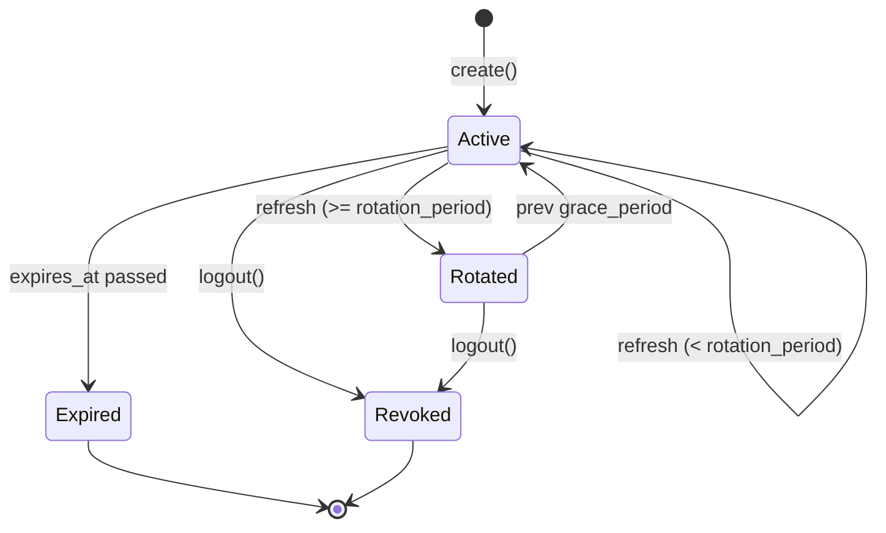

# User & Authentication

## 1. Overview

This domain covers azents user accounts, email, signup, login, session, and security elevation. One platform-wide account can join multiple workspaces as member, and authentication uses JWT access token plus DB-based refresh token session (rotation + grace period) structure.

Core characteristics:

- **Signup token controlled registration** — Normal new account creation is performed only by email-bound signup token redeem. The only zero-user exception is one-time Admin bootstrap.
- **Email OTP is login/elevation, not public signup** — Email OTP verify is used for existing user login and elevation. Under default setting other than `registration_mode=open`, new email OTP verify does not auto-create user.
- **Email-bound signup token** — Every signup token is fixed to normalized email. On successful redeem, corresponding primary `UserEmail.verified_at` is filled.
- **Workspace invitation remains membership intent** — invitation is not account creation authority, and pending invitation can be created for email without existing user. If email sending is available, invitation email can include signup token link.
- **Admin bootstrap** — A one-time setup token can create the first verified password user, `system_admin` assignment, and session only while the instance has zero users. It does not create a Workspace.
- **Persisted system authorization** — Admin API operations authenticate the ordinary Azents user JWT and require a live database-backed `system_admin` assignment. Workspace roles never imply system access.
- **Independent Admin Web session** — Admin Web signs in through the Public API but stores separately named HTTP-only cookies and forwards the current user access token to the Admin API.
- **Explicit existing-install promotion** — Existing users gain initial or recovery access only through the exact-email operator CLI; startup and migrations never auto-promote a user.
- **Credential provider projection** — email/password are summarized by credential provider abstraction and exposed differently for public login projection and authenticated security projection.
- **SMTP-gated email credential** — email credential is valid login/elevation credential only when SMTP is configured, even if verified primary email exists. When SMTP disabled, other valid credential such as password is needed.
- **Password is one login method** — password login is stored as bcrypt hash. Security setting changes require elevated access token.
- **Admin-issued password reset** — password recovery is not self-service email flow; it uses admin-issued user_id-bound, hash-only, single-use reset token.
- **Refresh token rotation + grace** — refresh token has rotation period and grace period to mitigate simultaneous request race.

## 2. Domain Model

```mermaid
erDiagram
    User ||--o{ UserEmail : "has"
    User ||--o| UserEmail : "primary_email"
    User ||--o| PasswordLogin : "optional"
    User ||--o{ Session : "has"
    User ||--o{ GithubUserInstallation : "has"
    EmailVerification }o--|| UserEmail : "email string"
    SignupToken ||--o{ SignupTokenRedemption : "redeemed by"
    SignupTokenRedemption }o--|| User : "creates"
    User ||--o{ PasswordResetToken : "reset target"
    PasswordResetToken ||--o{ PasswordResetTokenRedemption : "redeemed by"
    PasswordResetTokenRedemption }o--|| User : "recovers"
    User ||--o{ SystemUserRole : "receives"
    User ||--o{ SystemUserRole : "grants"

    User {
        string id PK
        string primary_email_id FK
    }
    UserEmail {
        string id PK
        string user_id FK
        string email UK
        datetime verified_at
    }
    SignupToken {
        string id PK
        string token_hash UK
        string email
        string created_by_user_id FK
        enum delivery_method
        datetime expires_at
        int max_uses
        int used_count
        datetime revoked_at
    }
    SignupTokenRedemption {
        string id PK
        string signup_token_id FK
        string user_id FK
        string email
        string ip_address
        string user_agent
        datetime redeemed_at
    }
    PasswordResetToken {
        string id PK
        string token_hash UK
        string user_id FK
        string created_by_user_id FK
        datetime expires_at
        datetime used_at
        datetime revoked_at
    }
    PasswordResetTokenRedemption {
        string id PK
        string password_reset_token_id FK
        string user_id FK
        string ip_address
        string user_agent
        datetime redeemed_at
    }
    Session {
        string id PK
        string user_id FK
        string refresh_token UK
        string prev_refresh_token
        datetime refresh_token_created_at
        datetime expires_at
        datetime max_expires_at
        datetime revoked_at
    }
    PasswordLogin {
        string id PK
        string user_id FK_UK
        string password_hash
    }
    EmailVerification {
        string id PK
        string email
        string code
        string csrf_token
        datetime expires_at
        datetime verified_at
    }
    SystemUserRole {
        string user_id PK_FK
        enum role PK "system_admin"
        string granted_by_user_id FK
        datetime granted_at
    }
    SystemBootstrapState {
        int id PK "always 1"
        string token_hash
        datetime created_at
        datetime consumed_at
    }
```

## 3. Signup and Login Behavior

### 3.1 Email OTP login

`POST /auth/v1/email/send-code` creates OTP and CSRF token and tries email delivery. `POST /auth/v1/email/verify` finds verification row by `(email, csrf_token)` and validates code/expiry/single-use conditions.

After verify succeeds:

- If existing user email exists, issue session and access/refresh token.
- If user email is absent and `registration_mode=open`, create user for legacy compatibility.
- If user email is absent and default `registration_mode=signup_token` or `closed`, return `RegistrationRequired` and do not create user.

### 3.2 Signup token lifecycle

Signup token returns plaintext token to user only once or delivers it as email link. DB stores only SHA-256 hash.

Token usable conditions:

- `revoked_at is null`
- `expires_at > now`
- `used_count < max_uses`
- input email equals token email
- corresponding email is not registered yet

Redeem transaction first validates token usability, email match, and existing registration. After all validations that can fail pass, it claims `used_count` with conditional update and creates user, verified primary email, password login, session, and redemption audit row.

### 3.3 Email signup delivery

`POST /auth/v1/signup/email` creates email-bound signup token and sends `/signup?token=...` link by email if email service is configured. If email service is not configured, it fails with `SignupEmailDeliveryUnavailable`. Manual delivery uses admin signup token create API.

### 3.4 Password login

`POST /auth/v1/login/password` finds user by email, verifies bcrypt hash in `password_logins.user_id`, and issues session/token. Missing email, unset password, and mismatch are all unified as `InvalidCredentials`.

`GET /auth/v1/login/methods?email=` does not directly expose user existence and returns only password setting status as `has_password`. Unregistered email returns `has_password=false`.

### 3.5 Credential projection

Credential providers produce an internal credential summary with `configured`, `valid`, `can_login`, `can_elevate`, `can_remove`, and optional `unavailable_reason`.

- Email credential is configured when the user has a verified primary email.
- Email credential is valid only when email delivery/SMTP is configured.
- Password credential is configured and valid when a `PasswordLogin` row exists.
- `GET /auth/v1/login/methods?email=` returns only no-leak public projection: `has_password` for the specific user email and `email_available` for instance-level SMTP availability. Unknown email returns `has_password=false`; `email_available` is not user-specific.
- `GET /security/v1/auth-methods` and `/elevation-methods` return authenticated diagnostic projection including `configured`, `valid`, capabilities, and `unavailable_reason`.

### 3.6 Admin-issued password reset

Password reset is not self-service email recovery. An admin creates a reset token for an existing user by `user_id` or email lookup. The token row is user_id-bound and does not snapshot email.

Token creation:

- generates a high-entropy plaintext token and returns it only in the create response;
- stores only SHA-256 `token_hash` in DB;
- defaults expiry to 24 hours unless the service input supplies a different `expires_at`;
- builds `/reset-password?token=...` reset URL for manual delivery.

Token preview validates hash, expiry, `used_at`, and `revoked_at`. A valid preview returns a masked current email hint from the target user. Invalid preview does not reveal user details.

Token redeem validates password policy before consuming the token. On success it atomically marks the token used, creates or updates the target user's password credential, revokes all existing sessions for the user, and writes a `PasswordResetTokenRedemption` audit row. Redeem returns success only; it does not issue login tokens.

### 3.7 System roles and Admin API authorization

`system_user_roles` stores instance-wide assignments separately from Workspace membership. The only current role is `system_admin`. Every operational Admin API request decodes the ordinary Azents access token, verifies its live Session/User, and reads the current assignment from PostgreSQL. Role state is not embedded in the JWT, so grant or revoke applies immediately to an already-issued access token.

All Admin routers are protected by this dependency except health probes and the two bootstrap operations. Debug, global User/Workspace management, token administration, and model-catalog operations use the same boundary. Missing or invalid identity returns `401`; an authenticated user without the live role receives `403`.

Role revoke and User deletion share one serialized transaction boundary. An operation that would remove the final `system_admin` fails with stable `409 Conflict`, while deleting a non-final administrator cascades that user's assignment. `GET /user/v1/me/system-roles` exposes only the authenticated user's current roles for Main Web navigation. UI visibility is not an authorization control.

The operator CLI grants `system_admin` to one normalized exact email. It is the only initial-promotion and recovery path after users exist. It neither creates a user nor issues a session, and migrations, startup, Workspace ownership, and environment configuration do not auto-promote users.

### 3.8 Admin bootstrap

`GET /system/v1/bootstrap/status` returns only `{ available }`. `POST /system/v1/bootstrap/first-admin` accepts the setup token in `X-Azents-Setup-Token` and succeeds only when the total User count is zero and the singleton token hash is active and unconsumed.

The setup token is either operator-configured or generated with at least 256 bits of entropy. Only its hash is stored. A generated plaintext token is logged once after durable persistence; a configured plaintext token is never logged. While the instance remains empty, a configured token can replace an unconsumed generated token.

Bootstrap serializes concurrent attempts and atomically creates the first User, verified primary email, password login, `system_admin` assignment, normal refresh Session, and consumed marker. It creates no Workspace or Workspace membership. Validation and rolled-back failures do not consume the token; after any User exists, bootstrap cannot reopen.

### 3.9 Admin Web session

Admin Web uses Public API password login and refresh, but stores its own `az-admin-token`, `az-admin-refresh`, and `az-admin-token-expires-at` HTTP-only cookies. Production cookies are `Secure`, `SameSite=Lax`, and scoped to the configured Admin Web public base path. Admin Web and Main Web sessions are independent even on the same host.

Protected Admin Web tRPC procedures refresh the user session through the Public API when needed, enforce same-origin mutation requests, and forward the resulting user bearer token to the Admin API. Login and session checks require a live `system_admin` assignment. Refresh rejection, logout, or self-revocation clears Admin cookies and returns the browser to Admin login. No machine credential, GitHub organization login, shared cookie, or unauthenticated fallback remains.

### 3.10 Workspace invitation integration

Workspace invitation remains email-bound membership intent. Invitation can be created for email without user, and after signup token redeem with same email and login, pending invitation API returns it.

When sending invitation email, if target email is not yet registered as user email and email service is configured, invitation email includes signup token URL. If email service is not configured, invitation is created as-is and signup token is not created.

### 3.11 Surface routing and deployment configuration

Main Web, Admin Web, Public API, and Admin API use explicit public or internal URLs instead of deriving topology from hard-coded prefixes. Admin Web's public base URL may include a gateway path and controls redirects plus cookie path. Server-to-server calls use separately configured Public/Admin API internal URLs. Main Web receives only an optional public Admin Web URL.

Helm keeps Admin Web public routing separate from internal API services. An operator-provided bootstrap token is referenced through an existing Kubernetes Secret and injected only into the Admin API/server boundary; chart defaults contain no secret literal. Obsolete GitHub Admin login and Admin API OAuth2 client-credential settings are not part of the chart contract.

## 4. Session / Refresh Token Lifecycle



- rotation period default is 10 minutes.
- grace period default is 5 minutes.
- access token default expiry is 30 minutes.
- refresh token default expiry is 180 days.
- If `max_expires_at` exists, rotation does not extend absolute lifetime.

## 5. Password and Elevation

Password policy:

- minimum 8 chars
- at least one lowercase, uppercase, number, and special character each
- stored with bcrypt `gensalt` + `hashpw`

Sensitive operations require `elv=true` access token. Elevation is acquired by email OTP or password re-entry. Password change/delete requires elevation, not direct old password confirmation. Password deletion is allowed only when at least one valid credential remains after deletion. For example, if SMTP is disabled and password is the only valid credential, password deletion is rejected with `409 Conflict`.

## 6. Business Rules

- `[registration-default-signup-token]` — default new signup is signup token redeem.
- `[legacy-open-registration-explicit]` — email OTP new user auto-creation is allowed only when `registration_mode=open`.
- `[signup-token-email-bound]` — signup token always has normalized email.
- `[signup-token-hash-only]` — plaintext signup token is not stored in DB.
- `[signup-token-single-use-default]` — default `max_uses=1`.
- `[signup-token-atomic-claim]` — redeem claims `used_count` with conditional update after passing validations that can fail. email mismatch, existing registered email, weak password failure do not consume use count.
- `[signup-token-redeem-verifies-email]` — primary `UserEmail.verified_at` created by redeem is set to redeem time.
- `[signup-token-redemption-audit]` — successful redeem remains as `signup_token_redemptions` row.
- `[email-verification-single-use]` — email verification row cannot be reused after being verified once.
- `[login-method-lookup-no-leak]` — unregistered email also responds `has_password=false`.
- `[login-invalid-no-leak]` — password login failure does not distinguish existence.
- `[admin-bootstrap-user-count-zero]` — Admin bootstrap is available only while total User count is zero and an active setup-token hash exists.
- `[admin-bootstrap-no-workspace]` — successful bootstrap creates identity, password, system role, and Session state but no Workspace or Workspace membership.
- `[admin-bootstrap-single-winner]` — concurrent attempts are serialized and exactly one successful transaction can consume the setup token.
- `[admin-bootstrap-secret-hash-only]` — configured setup-token plaintext is never stored or logged; generated plaintext is emitted only once after hash persistence.
- `[system-admin-live-lookup]` — Admin authorization reads the persisted role for every protected request rather than trusting JWT role claims.
- `[system-admin-final-assignment]` — role revoke and User deletion cannot leave the instance with zero system administrators.
- `[system-admin-distinct-from-workspace]` — OWNER/MANAGER Workspace roles do not grant Admin API access.
- `[system-admin-existing-install-cli]` — users-first installations and recovery require explicit exact-email CLI grant; no automatic promotion path exists.
- `[workspace-invitation-membership-intent]` — invitation has no signup authority.
- `[credential-email-smtp-gated]` — verified email credential is valid login/elevation credential only when SMTP/email delivery is configured.
- `[credential-last-valid-required]` — credential deletion is allowed only when at least one valid credential remains after deletion.
- `[password-reset-admin-issued]` — password reset token is issued by admin and is not self-service email recovery.
- `[password-reset-user-id-bound]` — password reset token is bound to `user_id` and does not store email snapshot.
- `[password-reset-hash-only]` — plaintext password reset token is not stored in DB.
- `[password-reset-single-use]` — successful redeem sets `used_at`, so password reset token cannot be reused.
- `[password-reset-no-auto-login]` — password reset redeem revokes existing sessions and does not issue login token.

## 7. API Reference

### Public — `/auth/v1`

- `POST /email/send-code` → `{ csrf_token }`
- `POST /email/verify` → `{ access_token, refresh_token, expires_in }`
- `GET /signup/status` → `{ email_signup_available }`
- `POST /signup/email` → `{ sent }`
- `POST /signup-tokens/preview` → `{ valid, email, expires_at }` (`email` is a masked hint)
- `POST /signup-tokens/redeem` → `{ access_token, refresh_token, expires_in }`
- `POST /token/refresh` → `{ access_token, refresh_token, expires_in }`
- `POST /logout` → 204
- `POST /login/password` → `{ access_token, refresh_token, expires_in }`
- `GET /login/methods?email=` → `{ has_password, email_available }`
- `POST /password-reset-tokens/preview` → `{ valid, email, expires_at }` (`email` is a masked current email hint)
- `POST /password-reset-tokens/redeem` → `{ success }`

### Public — `/user/v1`

- `GET /me/system-roles` → current authenticated user's live instance-role projection

### Admin bootstrap — `/system/v1`

- `GET /bootstrap/status` → `{ available }` (unauthenticated)
- `POST /bootstrap/first-admin` → ordinary access/refresh session response (unauthenticated, setup-token header required)
- `GET /me` → current authenticated system-administrator projection
- `GET /role-assignments` → paged current role assignments
- `PUT /users/{user_id}/roles/system_admin` → idempotent grant
- `DELETE /users/{user_id}/roles/system_admin` → revoke with final-admin invariant

### Admin API — `/auth/v1`

- `POST /signup-tokens` → token metadata + one-time plaintext token
- `GET /signup-tokens` → token metadata list, plaintext token excluded
- `DELETE /signup-tokens/{token_id}` → 204
- `POST /password-reset-tokens` → token metadata + one-time plaintext token and reset URL
- `GET /password-reset-tokens` → token metadata list, plaintext token excluded
- `DELETE /password-reset-tokens/{token_id}` → 204
- Existing E2E helpers: `/email-verifications*`

All other Admin API operations, including `/auth/v1` token operations and Debug routes, require the same user bearer token plus live `system_admin` assignment. Health probes and the two bootstrap operations above are the complete unauthenticated Admin allowlist.

### Public — `/security/v1`

- `GET /auth-methods` (elevated) → `{ methods: AuthMethod[] }`
- `GET /elevation-methods` → `{ methods: AuthMethod[] }`
- `POST /elevate/send-code`
- `POST /elevate/email`
- `POST /elevate/password`
- `POST /password` (elevated)
- `DELETE /password` (elevated)

`AuthMethod` contains `type`, `enabled`, `configured`, `valid`, `can_login`, `can_elevate`, `can_remove`, and nullable `unavailable_reason`.

## 8. Frontend Routes

- `/login` — existing login page. Existing users continue with password or email OTP. It exposes a signup-link request action only when registration policy and email delivery allow it.
- `/signup?token=...` — previews a signup token, shows a masked email hint, and redeems it with user-entered email and password.
- `/reset-password?token=...` — previews an admin-issued reset token and submits a new password. Success does not auto-login; user signs in separately.
Main Web has no setup route. It shows the configured Admin Web URL only when the authenticated Public API self-role projection includes `system_admin`; it never imports or calls the Admin API client.

Admin Web `/login` selects one of two modes from Admin bootstrap status. An empty instance shows first-administrator setup with email, password, and one-time setup token. After bootstrap is consumed, the same route shows normal password login. Protected Admin resource routes require Admin cookies and authoritative downstream role checks.

Admin-issued signup/password-reset token management and other instance-wide operations remain on Admin Web/Admin API. Workspace-scoped product administration remains on Main Web/Public API.

## 9. Changelog

- **2026-07-13** (v7) — Replaced public first-owner Workspace bootstrap with one-time Admin bootstrap, added persisted live system-administrator authorization and CLI recovery, and documented independent Admin Web user sessions.
- **2026-04-20** (v1) — Initial living spec.
- **2026-05-09** (v2) — Refresh/session/elevation behavior verified.
- **2026-06-17** (v3) — Signup-on-first-verify replaced by signup-token controlled registration. Added signup token model/service/API, email signup delivery, invitation signup-link integration, first owner bootstrap, and frontend `/signup`/`/setup` routes.
- **2026-06-29** (v5) — Removed GitHub PAT credential storage from the user-auth domain; GitHub auth is now toolkit-level only.
- **2026-06-18** (v3) — Verified cleanup: signup token failed redeem paths no longer consume `used_count`; login signup CTA is gated by signup status; preview exposes a masked email hint; account signup-token admin UI is documented.
- **2026-06-18** (v4) — Added credential provider projection, SMTP-gated email credential validity, last valid credential deletion invariant, and admin-issued password reset tokens.
- **2026-07-08** (v6) — Moved first-owner bootstrap to public Workspace API for main web and removed main-web admin-issued token management pending a system admin permission model.
