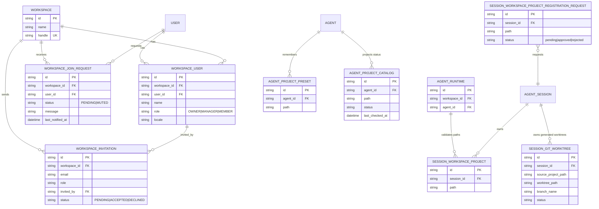
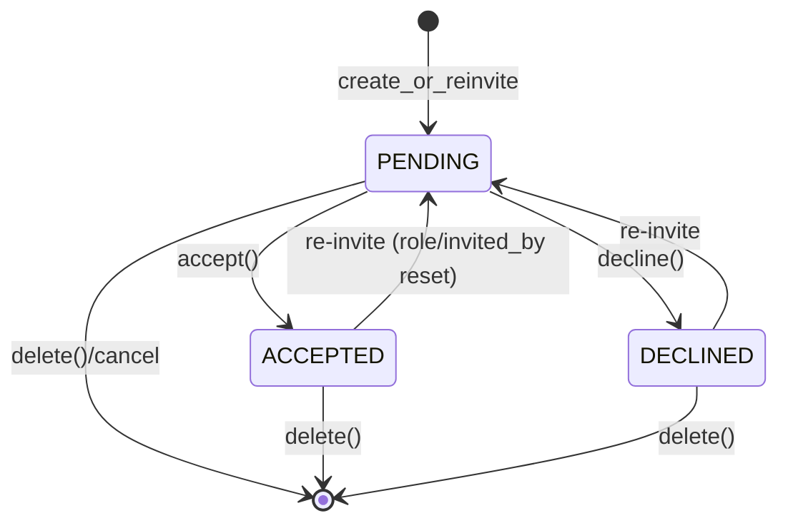
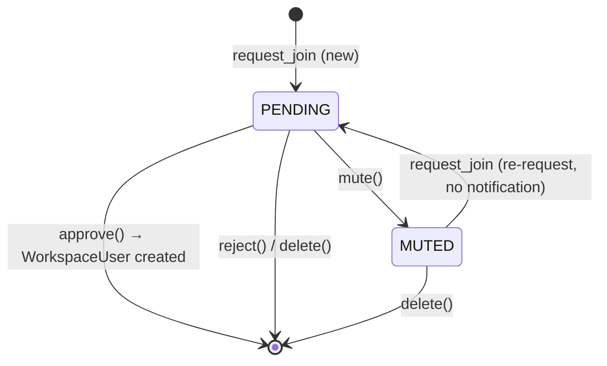

# Workspace & Membership

## Overview

Workspace is the top-level unit of Azents service. It is the space where users create agents and collaborate, and it is the permission boundary that shares almost every resource such as agents, sessions, toolkits, and shell environments. It is used in URLs and external references through globally unique identifier called handle. Users belonging to Workspace are represented as `WorkspaceUser` and have one of three roles: OWNER/MANAGER/MEMBER.

In this document, **Workspace** refers only to the organization unit above. Runtime working storage owned by AgentRuntime is called **Agent Workspace**. Agent Workspace absolute path is Runtime metadata reported by Provider, and server stores and uses this value in `agent_runtimes.workspace_path`. The `workspace` naming in code/API paths may remain for compatibility, but documents distinguish organization-level Workspace from Agent Workspace.

There are two membership acquisition paths: (1) `WorkspaceInvitation` flow where an existing member invites by email, and (2) `WorkspaceJoinRequest` flow where an external user requests to join. Both converge into creation of a `WorkspaceUser` record. WorkspaceUser is the only current workspace membership model; sub-workspace Team and TeamMember concepts are not part of current behavior.

## Domain Model

- **Workspace** — organization container. `handle` is globally unique and used as URL identifier.
- **WorkspaceUser** — User × Workspace membership profile. Stores role, display name, and locale.
- **WorkspaceInvitation** — email-based invitation. `(workspace_id, email)` is unique.
- **WorkspaceJoinRequest** — user → Workspace join request. `(workspace_id, user_id)` is unique.
- **SessionWorkspaceProject** — session-owned row registering an already-existing directory inside AgentRuntime's Agent Workspace as Project boundary.
- **SessionGitWorktree** — session-owned worktree allocation metadata and cleanup authority for Azents-created Git worktree Projects.
- **SessionWorkspaceProjectRegistrationRequest** — session-owned approval row where Agent requests user to register a folder it created as Project.
- **AgentProjectCatalog** — Agent-scoped reusable Project path candidate and filesystem status projection. It is a read model for browser/selection UI, not the prompt-eligibility source of truth.

## Behavior

### Agent Workspace Runtime State

Agent Workspace API exposes Agent-based Runtime lifecycle state to user. `GET /chat/v1/agents/{agent_id}/workspace` is a read API, so it does not automatically start Runtime start/reset. Server reads PostgreSQL Runtime state as source of truth and returns `runtime`, `workspace`, and `actions` by summarizing Provider observed state, Provider connection state, and Runner state.

UI renders server-calculated summary/actions. It does not recompute availability on frontend by combining Provider/Runner raw state. Frontend-side judgment is limited to API failure and network error.

| Runtime summary | Workspace response | Behavior |
|---|---|---|
| `STOPPED` | `UNAVAILABLE` | No currently running Runtime. Provide start action |
| `STARTING` / `STOPPING` / `RESETTING` / `RECOVERING` | `UNAVAILABLE` or transitional summary | In transition. Do not expose READY early |
| `PROVIDER_DISCONNECTED` | `UNAVAILABLE` | No Provider connection/observation, so lifecycle/workspace access unavailable. Show explicit error |
| `RUNNER_UNAVAILABLE` | `UNAVAILABLE` | Provider observation exists but Runner operation path is absent. Show retry/recover action |
| `FAILED` | `UNAVAILABLE` | Show server failure code/message and only available actions |
| `RUNNING` | `READY` | File list/read/download available only if provider-reported Agent Workspace path and Runner operation path are both valid |

File list/read/write/upload/download APIs work only when Runtime is `RUNNING`, Provider reported Agent Workspace path, and Runner operation path is ready. If Provider path is missing, return unavailable/failure based on `PROVIDER_WORKSPACE_PATH_MISSING` and do not create `/home/sandbox` or `/workspace/agent` fallback.

Agent Workspace path preview first uses Runner `file.stat` to classify the path. File paths return `FILE` preview content, including markdown text when readable. Directory paths return `DIRECTORY` listing data for tree navigation; azents-web opens directories in the file tree instead of rendering a separate directory preview page.

Lifecycle API is desired-state declaration. `start`/`stop`/`restart`/`recover`/reconcile do not delete Agent Workspace data. Only `reset` may delete Agent Workspace.

### Agent Workspace Projects

Agent Workspace Project is a boundary registry explicitly registered by user for an existing directory under AgentRuntime's Provider-reported Agent Workspace. Agent Workspace root itself is not a Project. Current public API registers any non-root descendant directory under `/workspace/agent`, including nested folders.

- Project Source, archive upload, empty folder bootstrap, Runtime pending load/ACK do not exist in public API or current DB/service/runtime provisioning layers. Provisioning such as file creation, archive extract, and git clone is separated into future Project Import/Provisioning phase.
- New session creation is workspace-item based. `workspace_items` may mix `existing_project` items and `git_worktree` items in one ordered selection. Existing Project items register explicit Project paths and do not copy Projects from the team-primary session. Git worktree items create Azents-owned Git worktrees from source Project paths and local base branches, then register the created worktree paths as session Projects. Legacy `workspace_mode` and `project_paths` requests are normalized into the same workspace selection model.
- `agent_project_defaults` stores the last non-empty new-session workspace item selection used when creating a non-primary session for the Agent. New-session defaults come from this table, not from the current live Project rows of the most recent session. Creating a new session with non-empty workspace items replaces the stored defaults in selection order; creating a session with an empty workspace item list leaves the stored defaults unchanged.
- `GET /chat/v1/agents/{agent_id}/session-project-defaults` returns both legacy `project_paths` and ordered `items` for the new-session UI, including source metadata (`empty` or `last_created_session`).
- `agent_project_presets` stores agent-scoped recent Project path presets. Creating a new session with selected Projects, registering an existing Project, or approving a registration request refreshes matching presets. `GET /chat/v1/agents/{agent_id}/project-presets` returns these presets ordered by recent use.
- `agent_project_catalog` stores Agent-scoped reusable Project path candidates and filesystem status projection (`unchecked`, `available`, `missing`, `unavailable`, or `error`) with optional detail and `last_checked_at`. Catalog status is a UI projection; it does not decide prompt Project eligibility. Worktree session creation upserts the created worktree path into the catalog and may refresh status, but it does not update Project presets or last-created-session defaults.
- `GET /chat/v1/agents/{agent_id}/git-refs?source_project_path=...` previews branches, tags, default branch, and HEAD commit for a Git source Project through typed Runtime Runner Git operations. Runtime unavailable or Git semantic failures are surfaced as user-safe preview errors.
- `POST /chat/v1/agents/{agent_id}/sessions/{session_id}/projects/register` registers an existing directory as Project for the selected AgentSession. Server validates user access, agent/session match, active Runtime directory existence, and Project path policy, then creates the session-owned registry row. This API does not modify filesystem.
- `GET /chat/v1/agents/{agent_id}/sessions/{session_id}/projects` returns registered Project list for the selected AgentSession. Public response exposes only `id`, `path`, `created_at`, `updated_at`.
- `GET /chat/v1/agents/{agent_id}/sessions/{session_id}/workspace/project-browser-manifest` returns a backend-owned Project browser manifest for the selected session. It derives Project root entries from `session_workspace_projects`, joins catalog status projection by Agent/path, and returns backend-provided capabilities. Project root entries allow registry removal when tied to a session Project and disallow filesystem delete, move, and rename. Entries linked to `session_git_worktrees` expose `repository_type: "git"` so clients can render Git-specific Project root metadata without probing the filesystem.
- `POST /chat/v1/agents/{agent_id}/workspace/project-browser-manifest/preview` accepts explicit `project_paths` before a session exists and returns the same Project browser entry model. Preview entries do not expose session registry removal because no session Project row exists yet, and they do not expose repository metadata.
- Project browser manifest reads do not call runtime runner file stat/list operations before responding. Missing or unchecked catalog projection is represented as stored/unchecked status and may be refreshed by separate boundary-triggered sync work.
- `DELETE /chat/v1/agents/{agent_id}/sessions/{session_id}/projects/{project_id}` removes only the selected session's registry row. Filesystem folder deletion is destructive and not included. Azents-owned worktree cleanup is a separate archive/delete lifecycle based on `session_git_worktrees` ownership metadata, not on the Project registry row alone.
- Path policy follows: `/workspace/agent` root forbidden, path outside `/workspace/agent` forbidden, exact duplicate Project path per session forbidden. Nested Project paths are allowed.
- Registration request is flow where Agent asks user approval to include a folder it created into the current session's Projects. Approve validates active Runtime path and creates registered Project in the selected AgentSession; reject does not create Project.

New-session azents-web UI shows a compact additive workspace item list above the draft first-message composer. It loads stored last-created-session defaults, shows recent agent-level presets, lets users add existing Projects or new worktree items to the same list, and can preview explicit Project paths through the backend Project browser manifest preview. Worktree branch selection in this draft UI uses the Git ref preview endpoint but exposes only local branches by default; remote branches and tags are not shown in the base branch selector. Concrete session azents-web UI exposes Project management inside the Workspace surface instead of a separate Projects tab. The Workspace browser opens in `Projects` mode by default, lists registered Project roots, and keeps `All files` as an explicit secondary mode rooted at the Agent Workspace root. Empty Project sets show an explicit empty Projects state and do not fall back to Agent Workspace root entries. Project browser root rows display the folder basename as the primary label and render the full absolute path as dimmed, truncated secondary text after the name. Git-backed Project root rows use a Git folder icon; non-Git Project roots keep the normal folder icon. Source upload/list/delete, bootstrap source type selection, and loaded/loading/failed state UI are not currently implemented.

### Workspace Home / Membership UI

azents-web `/w/[handle]` home is an agent-centered entry point inside Workspace. Current UI shows Agent list and subagent rows, and sidebar renders workspace navigation and agent section together for workspace-scoped pages. `WorkspaceHome`, `WorkspaceSidebar`, `AgentSidebarSection`, `AgentTeamCard`, and `SubagentTeamRow` compose this IA. The `AgentTeam*` names are frontend IA names and do not represent a Workspace Team domain entity.

Agent detail routes under `/w/[handle]/agents/[agentId]` use a separate Agent-focused shell. The outer `/w/[handle]` layout remains the membership/auth boundary, but visual layout is split by route groups: workspace pages use the workspace sidebar shell, while Agent detail pages use an Agent rail. The Agent rail contains workspace escape, linked Agent identity, session list, session creation, and global account/workspace actions. The linked Agent identity opens the independent Agent settings page under the same Agent-focused shell. Agent settings is an independent page and does not render session Chat/Projects/Context tabs. Concrete session routes under `/w/[handle]/agents/[agentId]/sessions/[sessionId]` own Chat/Projects/Context navigation through the session header. Mobile Agent detail pages keep a single-column content area and expose the rail through a drawer opened from the Agent settings or session header. The existing chat runtime/workspace panel remains a desktop right-side panel and a mobile secondary drawer for Runtime file browsing and settings only.

Membership UI has these routes:

- `/w/[handle]/members` — exposes workspace member list, invitation, and join request review.
- `/join/[handle]` — entrypoint where external user requests to join by workspace handle or checks pending state.
- invitation/join request tRPC router wraps backend REST API. UI exposes management actions to users with OWNER/MANAGER permission, and provides read/request-centered screen to MEMBER.

### Membership Lifecycle

Membership is created through three paths.

1. **Workspace creation (automatic OWNER)** — `WorkspaceService.create_with_owner()` creates Workspace + OWNER role WorkspaceUser + default ShellEnvironment ("Default", WORKSPACE scope) in one transaction. Creator automatically becomes OWNER and this is not selectable in UI.
2. **Invitation acceptance** — existing member (manager or higher) invites by email. When invited user accepts, WorkspaceUser is created with that role (except OWNER). Display name is automatically set to prefix before `@` of invitation email.
3. **JoinRequest approval** — user requests to join by handle. When existing member approves, WorkspaceUser is created with role=MEMBER. Display name is automatically set to first 8 chars of `user_id[:8]` (drift candidate — needs better default).

Membership is removed by `WorkspaceUserService.delete()`. When Workspace is deleted, CASCADE cleans all WorkspaceUser, Invitation, and JoinRequest rows.

### Role Invariants

`WorkspaceUserService.update_role()` and `delete()` enforce these invariants.

- **Cannot modify/delete self** — if `actor_workspace_user_id == target`, immediately fail with `CannotModifySelf`.
- **Cannot demote/delete OWNER (normal path)** — if target is OWNER, fail with `CannotModifyOwner`. OWNER can be replaced only through `transfer_ownership` flow.
- **Cannot promote to OWNER** — if role update input is `OWNER`, return `InvalidRole`. API cannot directly set new OWNER; must use dedicated transfer endpoint.
- **Admin forced delete** — `delete_force()` skips self-check but still blocks OWNER deletion. (called only by admin API)

### Invitation Flow

`WorkspaceInvitationService.create()` handles duplicate invitations naturally through `create_or_reinvite` repository method.

1. Normalize input email with `lower().strip()`.
2. Check whether User with same email is already workspace member → fail with `AlreadyMember` if exists.
3. If pending JoinRequest from same User exists, **automatically approve while creating invitation**: create `WorkspaceUser` immediately and delete JoinRequest.
4. If existing `(workspace_id, email)` record exists:
   - transition to PENDING regardless of status
   - reset role/invited_by (supports reinviting removed member)
5. If absent, create new PENDING record.
6. Send invitation email (best effort — invitation remains valid even if email fails).

Acceptance (`accept`) validates email ownership (included in user's `user_emails`) and allows only PENDING. If not PENDING, fail with `AlreadyProcessed`. If ownership validation fails, mask existence with `InvitationNotFound` to prevent existence leakage. Decline (`decline`) follows same validation/status rules.

> ⚠️ **Drift:** Issue description says "7-day expiration", but code does not confirm it. `RDBWorkspaceInvitation` has no `expires_at` field and no expiration validation logic. See Changelog.

### JoinRequest Flow

Behavior of `WorkspaceJoinRequestService.request_join()`:

1. Check workspace existence by handle.
2. If already member, `AlreadyMember`.
3. If existing request is PENDING, `PendingRequestExists` (duplicate request forbidden).
4. If existing request is MUTED, return it to PENDING but **do not resend notification** (spam prevention).
5. If new request, create and send notification based on `NOTIFICATION_COOLDOWN = 24h`. Send and update `last_notified_at` only if `last_notified_at` is absent or cooldown elapsed.

Approval (`approve`) creates WorkspaceUser (role=MEMBER) and deletes request. Rejection (`reject`) simply deletes request. `mute()` transitions only status to MUTED and stops future notifications.

### Ownership Transfer

`WorkspaceUserService.transfer_ownership()` performs two role updates in one session.

1. Check new OWNER candidate is member of same workspace → otherwise `NotMemberOfWorkspace`.
2. Find current OWNER and demote to MANAGER.
3. Promote new OWNER candidate to OWNER.

Because it runs within transaction boundary, there is no state where Workspace has no OWNER.

### Git worktree-created Projects

A Git worktree-created Project is an Agent Workspace Project whose directory is created under the Azents reserved worktree root for one non-primary AgentSession. The source Project path must be an existing Git repository reachable inside the Agent Runtime workspace. The selected starting ref is resolved by Runner Git operations, and creation uses a generated branch/worktree path based on the session handle and source repository leaf. Branch or path collisions are retried with deterministic suffixes and the persisted allocation records the final names.

A non-primary session can own a Git worktree allocation created during new-session `git_worktree` mode. The initialization row processes that blocking setup before the first run and returns initialization to `ready` after the worktree path is created and registered as the session Project.

Each created worktree is prompt-eligible only through its session-owned `SessionWorkspaceProject` row, just like manually selected Projects. The `SessionGitWorktree` row is retained for lifecycle and cleanup, and links to the registered Project row after registration succeeds. Archive/delete cleanup iterates every non-cleaned `SessionGitWorktree` allocation owned by the session, removes each worktree, removes each Azents-created branch, deletes catalog entries for the worktree paths, and marks allocations cleaned. Cleanup failure leaves the archive successful and records a cleanup summary for manual retry.

## Business Rules

At least 7 rules — all actually verified in code:

- `[unique-handle]` — Workspace `handle` is globally unique. DB-level `UQ_HANDLE`.
- `[unique-membership]` — one WorkspaceUser per `(workspace_id, user_id)`. `UQ_WORKSPACE_USER`.
- `[owner-required]` — `create_with_owner` atomically creates Workspace + OWNER, guaranteeing Workspace without OWNER cannot exist.
- `[no-owner-via-update]` — `update_role()` rejects OWNER promotion input with `InvalidRole`. OWNER can be changed only through transfer path.
- `[no-self-modification]` — actor cannot change own role or delete self (`CannotModifySelf`).
- `[no-owner-demotion]` — direct demotion/deletion of OWNER target is `CannotModifyOwner`. Replacement only through `transfer_ownership` path.
- `[ownership-transfer-workspace-match]` — new OWNER candidate must be member of same workspace (`NotMemberOfWorkspace`).
- `[unique-invitation]` — one invitation record per `(workspace_id, email)`; existing record is reset to PENDING with `create_or_reinvite`.
- `[invitation-email-ownership]` — on invitation accept/decline, request user must have verified email in list. Failure masks existence with `InvitationNotFound`.
- `[invitation-pending-only]` — `accept/decline` allows only PENDING; reprocessing ACCEPTED/DECLINED returns `AlreadyProcessed`.
- `[join-request-single-pending]` — one active request per `(workspace_id, user_id)`. Duplicate PENDING request is `PendingRequestExists`.
- `[join-request-notification-cooldown]` — new request notification has 24h cooldown based on `last_notified_at`; MUTED→PENDING transition does not notify.
- `[project-existing-directory]` — Project registration allows only Agent Workspace directory that actually exists in active Runtime.
- `[project-root-denied]` — Agent Workspace root itself cannot be registered as a Project.
- `[project-exact-duplicate-denied]` — same session cannot register the exact same Project path twice. Nested Project paths are allowed.
- `[project-registry-only-delete]` — Project delete API removes only registry row, not filesystem folder.
- `[project-browser-manifest-non-blocking]` — Project browser manifest reads return stored catalog projection and do not block on runner filesystem stat/list operations.
- `[worktree-project-registration]` — Git worktree sessions register exactly the created worktree path as a session Project after the Runner confirms worktree creation.
- `[worktree-initialization-gates-first-run]` — new-session Git worktree setup uses the session initialization lifecycle and gates the first run until blocking setup is ready.
- `[worktree-cleanup-authority]` — destructive cleanup of an Azents-owned worktree requires a matching `session_git_worktrees` ownership row; Project registry rows or reserved-root paths are not sufficient authority.
- `[project-root-action-policy]` — Project browser root entries expose backend capabilities; filesystem delete, move, and rename are disabled for Project roots, while registry removal is available only for existing session Project rows.

## State Transitions

### WorkspaceInvitation

Re-invite (`create_or_reinvite`) returns to PENDING regardless of status. This supports reinviting same email after member removal (delete WorkspaceUser).

### WorkspaceJoinRequest

`approve()` deletes request record and creates WorkspaceUser with MEMBER role. If invitation is created for same user, PENDING request is automatically approved and record is deleted.

## Permissions (RBAC)

| Action | OWNER | MANAGER | MEMBER | Unauthenticated |
|--------|-------|---------|--------|--------|
| View Workspace (handle) | ✅ | ✅ | ✅ | ✅ |
| Create Workspace | ✅ (auto OWNER) | ✅ | ✅ | ❌ |
| Update/delete Workspace | admin only | admin only | ❌ | ❌ |
| List members | ✅ | ✅ | ✅ | ❌ |
| Change member role | ✅ | ✅ | ❌ | ❌ |
| Delete member (remove) | ✅ | ✅ | ❌ | ❌ |
| Transfer OWNER permission | ✅ | ❌ | ❌ | ❌ |
| Create/reinvite invitation | ✅ | ✅ | ❌ | ❌ |
| Cancel invitation (delete) | ✅ | ✅ | ❌ | ❌ |
| Accept/decline invitation | invitation target only | invitation target only | invitation target only | ❌ |
| List invitations I received | ✅ | ✅ | ✅ | ❌ |
| Join request | — | — | — | authenticated user |
| Approve/reject/mute join request | ✅ | ✅ | ❌ | ❌ |

> ✅ = allowed, ❌ = forbidden, "admin" = path exposed only in admin API. Public API role-based guards are implemented through `WorkspaceMember` / manager guard dependencies; at time of writing, admin API paths use separate internal auth.

## API Reference

### Public API (`/api/v1`)

| operationId | Method · Path | Rules |
|---|---|---|
| `workspace_v1_get_workspace_by_handle` | GET `/workspace/v1/workspaces/{handle}` | — |
| `workspace_v1_list_workspaces` | GET `/workspace/v1/workspaces` | — |
| `workspace_v1_create_workspace` | POST `/workspace/v1/workspaces` | `[unique-handle]`, `[owner-required]` |
| `workspaceuser_v1_get_current_member` | GET `/workspace-user/v1/workspaces/{handle}/me` | — |
| `workspaceuser_v1_get_my_profile` | GET `/workspace-user/v1/workspaces/{handle}/me/profile` | — |
| `workspaceuser_v1_update_my_profile` | PATCH `/workspace-user/v1/workspaces/{handle}/me/profile` | — |
| `workspaceuser_v1_list_workspace_users` | GET `/workspace-user/v1/workspaces/{handle}/workspace-users` | — |
| `workspaceuser_v1_update_workspace_user_role` | PATCH `/workspace-user/v1/workspaces/{handle}/workspace-users/{id}` | `[no-owner-via-update]`, `[no-self-modification]`, `[no-owner-demotion]` |
| `workspaceuser_v1_delete_workspace_user` | DELETE `/workspace-user/v1/workspaces/{handle}/workspace-users/{id}` | `[no-self-modification]`, `[no-owner-demotion]` |
| `invitation_v1_create_invitation` | POST `/invitation/v1/...` | `[unique-invitation]` |
| `invitation_v1_list_workspace_invitations` | GET `/invitation/v1/workspaces/{handle}/invitations` | — |
| `invitation_v1_get_my_invitation` | GET `/invitation/v1/workspaces/{handle}/invitations/me` | `[invitation-email-ownership]` |
| `invitation_v1_list_received_invitations` | GET `/invitation/v1/invitations/received` | `[invitation-email-ownership]` |
| `invitation_v1_accept_invitation` | POST `/invitation/v1/invitations/{id}/accept` | `[invitation-email-ownership]`, `[invitation-pending-only]` |
| `invitation_v1_decline_invitation` | POST `/invitation/v1/invitations/{id}/decline` | `[invitation-email-ownership]`, `[invitation-pending-only]` |
| `invitation_v1_cancel_invitation` | DELETE `/invitation/v1/...` | — |
| `join_request_v1_create_join_request` | POST `/join-request/v1/...` | `[join-request-single-pending]`, `[join-request-notification-cooldown]` |
| `join_request_v1_list_join_requests` | GET `/join-request/v1/workspaces/{handle}/join-requests` | — |
| `join_request_v1_get_my_join_request` | GET `/join-request/v1/workspaces/{handle}/join-requests/me` | — |
| `join_request_v1_approve_join_request` | POST `/join-request/v1/workspaces/{handle}/join-requests/{id}/approve` | `[unique-membership]` |
| `join_request_v1_reject_join_request` | POST `/join-request/v1/workspaces/{handle}/join-requests/{id}/reject` | — |
| `join_request_v1_mute_join_request` | POST `/join-request/v1/workspaces/{handle}/join-requests/{id}/mute` | — |
| `chat_v1_create_team_agent_session` | POST `/chat/v1/agents/{agent_id}/sessions` | `existing_projects` or `git_worktree` workspace mode |
| `chat_v1_create_team_agent_session_message` | POST `/chat/v1/agents/{agent_id}/sessions/messages` | `existing_projects` or `git_worktree` workspace mode |
| `chat_v1_list_agent_project_presets` | GET `/chat/v1/agents/{agent_id}/project-presets` | workspace membership |
| `chat_v1_get_agent_session_project_defaults` | GET `/chat/v1/agents/{agent_id}/session-project-defaults` | workspace membership |
| `chat_v1_preview_agent_git_refs` | GET `/chat/v1/agents/{agent_id}/git-refs` | Git source Project path and Runtime Runner availability |
| `chat_v1_get_session_project_browser_manifest` | GET `/chat/v1/agents/{agent_id}/sessions/{session_id}/workspace/project-browser-manifest` | `[project-browser-manifest-non-blocking]`, `[project-root-action-policy]` |
| `chat_v1_preview_project_browser_manifest` | POST `/chat/v1/agents/{agent_id}/workspace/project-browser-manifest/preview` | `[project-browser-manifest-non-blocking]`, `[project-root-action-policy]` |
| `chat_v1_list_agent_projects` | GET `/chat/v1/agents/{agent_id}/sessions/{session_id}/projects` | agent/session workspace membership |
| `chat_v1_register_agent_project` | POST `/chat/v1/agents/{agent_id}/sessions/{session_id}/projects/register` | `[project-existing-directory]` |
| `chat_v1_delete_agent_project` | DELETE `/chat/v1/agents/{agent_id}/sessions/{session_id}/projects/{project_id}` | `[project-registry-only-delete]` |

### Admin API

| operationId | Method · Path | Rules |
|---|---|---|
| `workspace_v1_list_workspaces` (admin) | GET | — |
| `workspace_v1_create_workspace` (admin) | POST | `[unique-handle]` |
| `workspace_v1_get_workspace` | GET | — |
| `workspace_v1_update_workspace` | PATCH | `[unique-handle]` |
| `workspace_v1_delete_workspace` | DELETE | CASCADE propagation |
| `workspaceuser_v1_create_workspace_user` | POST | `[unique-membership]` |
| `workspaceuser_v1_list_workspace_users` (admin) | GET | — |
| `workspaceuser_v1_get_workspace_user` | GET | — |
| `workspaceuser_v1_update_workspace_user` | PATCH | — |
| `workspaceuser_v1_delete_workspace_user` (admin) | DELETE | `[no-owner-demotion]` (self-check bypass) |
| `workspaceuser_v1_transfer_workspace_ownership` | POST | `[ownership-transfer-workspace-match]`, `[owner-required]` |
| `invitation_v1_list_workspace_invitations` (admin) | GET | — |
| `invitation_v1_delete_invitation` | DELETE | — |

## Glossary

- **Workspace** — top-level unit of Azents service. Space where users create agents and collaborate; shared boundary for all resources.
- **Agent Workspace** — durable Runtime working directory owned by AgentRuntime. Absolute path is Provider metadata. Current Kubernetes/Docker Provider v1 reports `/workspace/agent` by default, but server/API contract does not hardcode this value. It is not the Workspace/Membership domain in this document; lifecycle/persistence contract is covered in `spec/flow/agent-runtime-control.md` and `spec/flow/agent-runtime-persistence.md`.
- **Handle** — globally unique URL slug identifier of Workspace.
- **WorkspaceUser** — Workspace × User membership. Has role, display name, and locale.
- **Role** — permission hierarchy OWNER / MANAGER / MEMBER (`WorkspaceUserRole`).
- **Invitation** — email-based invitation. PENDING/ACCEPTED/DECLINED state (`InvitationStatus`).
- **Join Request** — external user's join request. PENDING/MUTED state (`JoinRequestStatus`).
- **Ownership Transfer** — 2-step operation transitioning OWNER → MANAGER / new OWNER → OWNER in single transaction.
- **Mute** — state that stops JoinRequest notification. Returns to PENDING automatically on re-request.
- **Agent Workspace Project** — Project boundary explicitly registered for an existing directory under AgentRuntime's Provider-reported Agent Workspace.
- **Project browser manifest** — backend-owned read model for Project-first browser entries, status projection, and action capabilities.
- **Agent Project Catalog** — Agent-scoped path candidate/status projection table used by Project browser and new-session preview UI. It is not the canonical session Project binding.

## Changelog

- **2026-07-04** — v25. Added Git worktree workspace mode, Git ref preview, worktree-created Project registration, catalog behavior, and cleanup authority semantics.

- **2026-04-20 (spec_version=1)** — Initial Living Spec. Domain spec documented according to azents Living Spec system P7 ([#2792](https://github.com/azents/azents/issues/2792)).
- **2026-05-02 (spec_version=2)** — Clarified in Glossary that Enhanced File Browser's Session Workspace terminology differs from organization Workspace domain.
- **2026-05-02 (spec_version=3)** — After Enhanced File Browser implementation verification, promoted related design document to archive. Organization Workspace behavior contract unchanged.
- **2026-05-08 (spec_version=5)** — Fixed terminology in Overview and Glossary: Workspace as Azents top-level organization unit, Session Workspace as `/home/sandbox`-based session working storage.
- **2026-05-09 (spec_version=6)** — Reflected Session Workspace Project Source / Project / registration request registry according to Workspace permission boundary and Session Workspace terminology.
- **2026-05-24 (spec_version=10)** — Redefined `/home/sandbox` runtime file browser surface as Agent Workspace and reflected agent-based workspace API.
- **2026-05-25 (spec_version=11)** — Redefined Agent Workspace path as Provider-reported Runtime metadata, and reflected Agent Runtime structure where UI renders server summary/actions. Removed `/home/sandbox` fallback and implicit fresh workspace fallback.
- **2026-06-11 (spec_version=12)** — Reduced Project public surface to existing folder registration and removed Project Source/archive/bootstrap/loaded state UI/API from public contract.
- **2026-06-11 (spec_version=13)** — Removed remaining Project Source/provisioning DB/repo/service/runtime layers and simplified Project registry into existing folder boundary registry.
- **2026-06-11 (spec_version=14)** — Removed Project name field and defined path itself as Project boundary identifier.
- **Related design document** — rationale from JoinRequest introduction is stored in [docs/azents/design/workspace-join-request-plan.md](../../design/workspace-join-request-plan.md).

### Discovered Drift

- **No invitation expiration** — Issue #2792 body specifies "WorkspaceInvitation expires in 7 days", but code (`RDBWorkspaceInvitation`, `WorkspaceInvitationService`) has no `expires_at` field or expiration validation logic. Actual behavior is no expiration. → Whether to introduce expiration later needs separate design/ADR.
- **Role name mismatch** — Issue body says "OWNER/ADMIN/MEMBER", but actual enum (`core.enums.WorkspaceUserRole`) is **OWNER / MANAGER / MEMBER**. This document follows code.
- **Display name on JoinRequest approval** — uses raw `user_id[:8]`, which is hard for humans to read. UX improvement candidate (needs separate issue tracking).

- **2026-06-22 (spec_version=15)** — Removed Workspace Team and TeamMember as current domain concepts. WorkspaceUser is the only current membership model.
- **2026-06-26 (spec_version=18)** — Project and registration request public APIs became AgentSession-scoped. Removed team-primary compatibility lookup from project list/register/delete/approval routes.
- **2026-07-03 (spec_version=24)** — Promoted Workspace Project Browser behavior: backend Project browser manifests, Agent Project catalog status projection, Project-first Workspace UI, explicit All files mode, and backend Project root capabilities.
