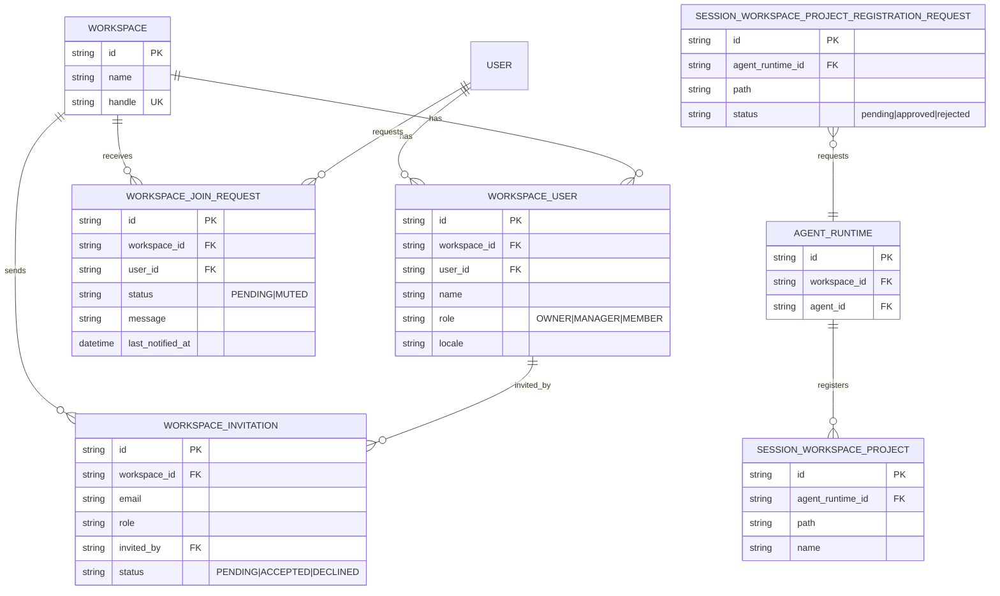
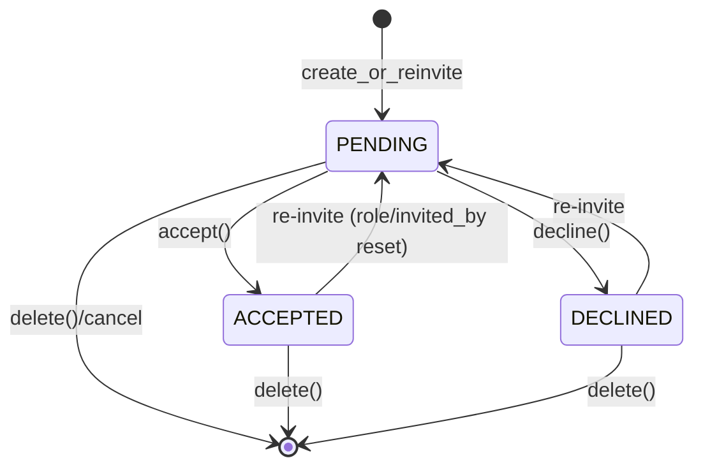
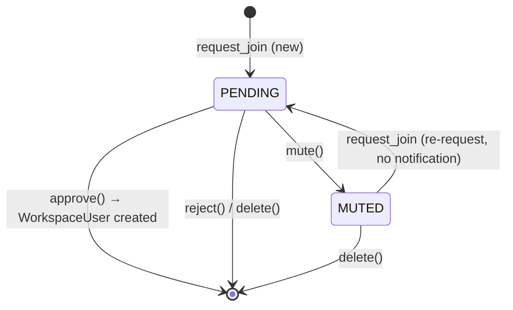

# Workspace & Membership

## Overview

Workspace is the top-level unit of Azents service. It is the space where users create agents and collaborate, and it is the permission boundary that shares almost every resource such as agents, sessions, toolkits, and shell environments. It is used in URLs and external references through globally unique identifier called handle. Users belonging to Workspace are represented as `WorkspaceUser` and have one of three roles: OWNER/MANAGER/MEMBER.

In this document, **Workspace** refers only to the organization unit above. Runtime working storage owned by AgentRuntime is called **Agent Workspace**. Agent Workspace absolute path is Runtime metadata reported by Provider, and server stores and uses this value in `agent_runtimes.workspace_path`. The `workspace` naming in code/API paths may remain for compatibility, but documents distinguish organization-level Workspace from Agent Workspace.

There are two membership acquisition paths: (1) `WorkspaceInvitation` flow where an existing member invites by email, and (2) `WorkspaceJoinRequest` flow where an external user requests to join. Both converge into creation of a `WorkspaceUser` record. WorkspaceUser is the only current workspace membership model; sub-workspace Team and TeamMember concepts are not part of current behavior.

## Domain Model

- **Workspace** — organization container. `handle` is globally unique and used as URL identifier.
- **WorkspaceUser** — User × Workspace membership profile. Stores role, display name, and locale.
- **WorkspaceInvitation** — email-based invitation. `(workspace_id, email)` is unique.
- **WorkspaceJoinRequest** — user → Workspace join request. `(workspace_id, user_id)` is unique.
- **SessionWorkspaceProject** — row registering an already-existing directory inside AgentRuntime's Agent Workspace as Project boundary.
- **SessionWorkspaceProjectRegistrationRequest** — approval row where Agent requests user to register a folder it created as Project.

## Behavior

### Agent Workspace Runtime State

Agent Workspace API exposes Agent-based Runtime lifecycle state to user. `GET /chat/v1/agents/{agent_id}/workspace` is a read API, so it does not automatically start Runtime start/reset. Server reads PostgreSQL Runtime state as source of truth and returns `runtime`, `workspace`, and `actions` by summarizing Provider observed state, Provider connection state, and Runner state.

UI renders server-calculated summary/actions. It does not recompute availability on frontend by combining Provider/Runner raw state. Frontend-side judgment is limited to API failure and network error.

| Runtime summary | Workspace response | Behavior |
|---|---|---|
| `STOPPED` | `UNAVAILABLE` | No currently running Runtime. Provide start action |
| `STARTING` / `STOPPING` / `RESETTING` / `RECOVERING` | `UNAVAILABLE` or transitional summary | In transition. Do not expose READY early |
| `PROVIDER_DISCONNECTED` | `UNAVAILABLE` | No Provider connection/observation, so lifecycle/workspace access unavailable. Show explicit error |
| `RUNNER_UNAVAILABLE` | `UNAVAILABLE` | Provider observation exists but Runner operation path is absent. Show retry/recover action |
| `FAILED` | `UNAVAILABLE` | Show server failure code/message and only available actions |
| `RUNNING` | `READY` | File list/read/download available only if provider-reported Agent Workspace path and Runner operation path are both valid |

File list/read/write/upload/download APIs work only when Runtime is `RUNNING`, Provider reported Agent Workspace path, and Runner operation path is ready. If Provider path is missing, return unavailable/failure based on `PROVIDER_WORKSPACE_PATH_MISSING` and do not create `/home/sandbox` or `/workspace/agent` fallback.

Agent Workspace path preview first uses Runner `file.stat` to classify the path. File paths return `FILE` preview content, including markdown text when readable. Directory paths return `DIRECTORY` listing data for tree navigation; azents-web opens directories in the file tree instead of rendering a separate directory preview page.

Lifecycle API is desired-state declaration. `start`/`stop`/`restart`/`recover`/reconcile do not delete Agent Workspace data. Only `reset` may delete Agent Workspace.

### Agent Workspace Projects

Agent Workspace Project is a boundary registry explicitly registered by user for an existing directory under AgentRuntime's Provider-reported Agent Workspace. Agent Workspace root itself is not a Project. MVP registers only direct child directory in shape `/workspace/agent/<project-folder>` as Project.

- Project Source, archive upload, empty folder bootstrap, Runtime pending load/ACK do not exist in public API or current DB/service/runtime provisioning layers. Provisioning such as file creation, archive extract, and git clone is separated into future Project Import/Provisioning phase.
- `POST /chat/v1/agents/{agent_id}/projects/register` registers an existing directory as Project. Server validates user access, active Runtime directory existence, and Project path policy, then creates registry row. This API does not modify filesystem.
- `GET /chat/v1/agents/{agent_id}/projects` returns registered Project list. Public response exposes only `id`, `path`, `created_at`, `updated_at`.
- `DELETE /chat/v1/agents/{agent_id}/projects/{project_id}` removes only registry row. Filesystem folder deletion is destructive and not included.
- Path policy follows: `/workspace/agent` root forbidden, path outside `/workspace/agent` forbidden, nested Project forbidden, direct child directory required.
- Registration request is flow where Agent asks user approval to include a folder it created into Project. Approve validates active Runtime path and creates registered Project; reject does not create Project.

Projects tab in azents-web Workspace panel exposes only registered Project list, existing folder registration form, and registration request approve/reject. Source upload/list/delete, bootstrap source type selection, and loaded/loading/failed state UI are not currently implemented.

### Workspace Home / Membership UI

azents-web `/w/[handle]` home is an agent-centered entry point inside Workspace. Current UI shows Agent list and subagent rows, and sidebar renders workspace navigation and agent section together. `WorkspaceHome`, `WorkspaceSidebar`, `AgentSidebarSection`, `AgentTeamCard`, and `SubagentTeamRow` compose this IA. The `AgentTeam*` names are frontend IA names and do not represent a Workspace Team domain entity.

Membership UI has these routes:

- `/w/[handle]/members` — exposes workspace member list, invitation, and join request review.
- `/join/[handle]` — entrypoint where external user requests to join by workspace handle or checks pending state.
- invitation/join request tRPC router wraps backend REST API. UI exposes management actions to users with OWNER/MANAGER permission, and provides read/request-centered screen to MEMBER.

### Membership Lifecycle

Membership is created through three paths.

1. **Workspace creation (automatic OWNER)** — `WorkspaceService.create_with_owner()` creates Workspace + OWNER role WorkspaceUser + default ShellEnvironment ("Default", WORKSPACE scope) in one transaction. Creator automatically becomes OWNER and this is not selectable in UI.
2. **Invitation acceptance** — existing member (manager or higher) invites by email. When invited user accepts, WorkspaceUser is created with that role (except OWNER). Display name is automatically set to prefix before `@` of invitation email.
3. **JoinRequest approval** — user requests to join by handle. When existing member approves, WorkspaceUser is created with role=MEMBER. Display name is automatically set to first 8 chars of `user_id[:8]` (drift candidate — needs better default).

Membership is removed by `WorkspaceUserService.delete()`. When Workspace is deleted, CASCADE cleans all WorkspaceUser, Invitation, and JoinRequest rows.

### Role Invariants

`WorkspaceUserService.update_role()` and `delete()` enforce these invariants.

- **Cannot modify/delete self** — if `actor_workspace_user_id == target`, immediately fail with `CannotModifySelf`.
- **Cannot demote/delete OWNER (normal path)** — if target is OWNER, fail with `CannotModifyOwner`. OWNER can be replaced only through `transfer_ownership` flow.
- **Cannot promote to OWNER** — if role update input is `OWNER`, return `InvalidRole`. API cannot directly set new OWNER; must use dedicated transfer endpoint.
- **Admin forced delete** — `delete_force()` skips self-check but still blocks OWNER deletion. (called only by admin API)

### Invitation Flow

`WorkspaceInvitationService.create()` handles duplicate invitations naturally through `create_or_reinvite` repository method.

1. Normalize input email with `lower().strip()`.
2. Check whether User with same email is already workspace member → fail with `AlreadyMember` if exists.
3. If pending JoinRequest from same User exists, **automatically approve while creating invitation**: create `WorkspaceUser` immediately and delete JoinRequest.
4. If existing `(workspace_id, email)` record exists:
   - transition to PENDING regardless of status
   - reset role/invited_by (supports reinviting removed member)
5. If absent, create new PENDING record.
6. Send invitation email (best effort — invitation remains valid even if email fails).

Acceptance (`accept`) validates email ownership (included in user's `user_emails`) and allows only PENDING. If not PENDING, fail with `AlreadyProcessed`. If ownership validation fails, mask existence with `InvitationNotFound` to prevent existence leakage. Decline (`decline`) follows same validation/status rules.

> ⚠️ **Drift:** Issue description says "7-day expiration", but code does not confirm it. `RDBWorkspaceInvitation` has no `expires_at` field and no expiration validation logic. See Changelog.

### JoinRequest Flow

Behavior of `WorkspaceJoinRequestService.request_join()`:

1. Check workspace existence by handle.
2. If already member, `AlreadyMember`.
3. If existing request is PENDING, `PendingRequestExists` (duplicate request forbidden).
4. If existing request is MUTED, return it to PENDING but **do not resend notification** (spam prevention).
5. If new request, create and send notification based on `NOTIFICATION_COOLDOWN = 24h`. Send and update `last_notified_at` only if `last_notified_at` is absent or cooldown elapsed.

Approval (`approve`) creates WorkspaceUser (role=MEMBER) and deletes request. Rejection (`reject`) simply deletes request. `mute()` transitions only status to MUTED and stops future notifications.

### Ownership Transfer

`WorkspaceUserService.transfer_ownership()` performs two role updates in one session.

1. Check new OWNER candidate is member of same workspace → otherwise `NotMemberOfWorkspace`.
2. Find current OWNER and demote to MANAGER.
3. Promote new OWNER candidate to OWNER.

Because it runs within transaction boundary, there is no state where Workspace has no OWNER.

## Business Rules

At least 7 rules — all actually verified in code:

- `[unique-handle]` — Workspace `handle` is globally unique. DB-level `UQ_HANDLE`.
- `[unique-membership]` — one WorkspaceUser per `(workspace_id, user_id)`. `UQ_WORKSPACE_USER`.
- `[owner-required]` — `create_with_owner` atomically creates Workspace + OWNER, guaranteeing Workspace without OWNER cannot exist.
- `[no-owner-via-update]` — `update_role()` rejects OWNER promotion input with `InvalidRole`. OWNER can be changed only through transfer path.
- `[no-self-modification]` — actor cannot change own role or delete self (`CannotModifySelf`).
- `[no-owner-demotion]` — direct demotion/deletion of OWNER target is `CannotModifyOwner`. Replacement only through `transfer_ownership` path.
- `[ownership-transfer-workspace-match]` — new OWNER candidate must be member of same workspace (`NotMemberOfWorkspace`).
- `[unique-invitation]` — one invitation record per `(workspace_id, email)`; existing record is reset to PENDING with `create_or_reinvite`.
- `[invitation-email-ownership]` — on invitation accept/decline, request user must have verified email in list. Failure masks existence with `InvitationNotFound`.
- `[invitation-pending-only]` — `accept/decline` allows only PENDING; reprocessing ACCEPTED/DECLINED returns `AlreadyProcessed`.
- `[join-request-single-pending]` — one active request per `(workspace_id, user_id)`. Duplicate PENDING request is `PendingRequestExists`.
- `[join-request-notification-cooldown]` — new request notification has 24h cooldown based on `last_notified_at`; MUTED→PENDING transition does not notify.
- `[project-existing-directory]` — Project registration allows only Agent Workspace directory that actually exists in active Runtime.
- `[project-registry-only-delete]` — Project delete API removes only registry row, not filesystem folder.

## State Transitions

### WorkspaceInvitation

Re-invite (`create_or_reinvite`) returns to PENDING regardless of status. This supports reinviting same email after member removal (delete WorkspaceUser).

### WorkspaceJoinRequest

`approve()` deletes request record and creates WorkspaceUser with MEMBER role. If invitation is created for same user, PENDING request is automatically approved and record is deleted.

## Permissions (RBAC)

| Action | OWNER | MANAGER | MEMBER | Unauthenticated |
|--------|-------|---------|--------|--------|
| View Workspace (handle) | ✅ | ✅ | ✅ | ✅ |
| Create Workspace | ✅ (auto OWNER) | ✅ | ✅ | ❌ |
| Update/delete Workspace | admin only | admin only | ❌ | ❌ |
| List members | ✅ | ✅ | ✅ | ❌ |
| Change member role | ✅ | ✅ | ❌ | ❌ |
| Delete member (remove) | ✅ | ✅ | ❌ | ❌ |
| Transfer OWNER permission | ✅ | ❌ | ❌ | ❌ |
| Create/reinvite invitation | ✅ | ✅ | ❌ | ❌ |
| Cancel invitation (delete) | ✅ | ✅ | ❌ | ❌ |
| Accept/decline invitation | invitation target only | invitation target only | invitation target only | ❌ |
| List invitations I received | ✅ | ✅ | ✅ | ❌ |
| Join request | — | — | — | authenticated user |
| Approve/reject/mute join request | ✅ | ✅ | ❌ | ❌ |

> ✅ = allowed, ❌ = forbidden, "admin" = path exposed only in admin API. Public API role-based guards are implemented through `WorkspaceMember` / manager guard dependencies; at time of writing, admin API paths use separate internal auth.

## API Reference

### Public API (`/api/v1`)

| operationId | Method · Path | Rules |
|---|---|---|
| `workspace_v1_get_workspace_by_handle` | GET `/workspace/v1/workspaces/{handle}` | — |
| `workspace_v1_list_workspaces` | GET `/workspace/v1/workspaces` | — |
| `workspace_v1_create_workspace` | POST `/workspace/v1/workspaces` | `[unique-handle]`, `[owner-required]` |
| `workspaceuser_v1_get_current_member` | GET `/workspace-user/v1/workspaces/{handle}/me` | — |
| `workspaceuser_v1_get_my_profile` | GET `/workspace-user/v1/workspaces/{handle}/me/profile` | — |
| `workspaceuser_v1_update_my_profile` | PATCH `/workspace-user/v1/workspaces/{handle}/me/profile` | — |
| `workspaceuser_v1_list_workspace_users` | GET `/workspace-user/v1/workspaces/{handle}/workspace-users` | — |
| `workspaceuser_v1_update_workspace_user_role` | PATCH `/workspace-user/v1/workspaces/{handle}/workspace-users/{id}` | `[no-owner-via-update]`, `[no-self-modification]`, `[no-owner-demotion]` |
| `workspaceuser_v1_delete_workspace_user` | DELETE `/workspace-user/v1/workspaces/{handle}/workspace-users/{id}` | `[no-self-modification]`, `[no-owner-demotion]` |
| `invitation_v1_create_invitation` | POST `/invitation/v1/...` | `[unique-invitation]` |
| `invitation_v1_list_workspace_invitations` | GET `/invitation/v1/workspaces/{handle}/invitations` | — |
| `invitation_v1_get_my_invitation` | GET `/invitation/v1/workspaces/{handle}/invitations/me` | `[invitation-email-ownership]` |
| `invitation_v1_list_received_invitations` | GET `/invitation/v1/invitations/received` | `[invitation-email-ownership]` |
| `invitation_v1_accept_invitation` | POST `/invitation/v1/invitations/{id}/accept` | `[invitation-email-ownership]`, `[invitation-pending-only]` |
| `invitation_v1_decline_invitation` | POST `/invitation/v1/invitations/{id}/decline` | `[invitation-email-ownership]`, `[invitation-pending-only]` |
| `invitation_v1_cancel_invitation` | DELETE `/invitation/v1/...` | — |
| `join_request_v1_create_join_request` | POST `/join-request/v1/...` | `[join-request-single-pending]`, `[join-request-notification-cooldown]` |
| `join_request_v1_list_join_requests` | GET `/join-request/v1/workspaces/{handle}/join-requests` | — |
| `join_request_v1_get_my_join_request` | GET `/join-request/v1/workspaces/{handle}/join-requests/me` | — |
| `join_request_v1_approve_join_request` | POST `/join-request/v1/workspaces/{handle}/join-requests/{id}/approve` | `[unique-membership]` |
| `join_request_v1_reject_join_request` | POST `/join-request/v1/workspaces/{handle}/join-requests/{id}/reject` | — |
| `join_request_v1_mute_join_request` | POST `/join-request/v1/workspaces/{handle}/join-requests/{id}/mute` | — |
| `chat_v1_list_agent_projects` | GET `/chat/v1/agents/{agent_id}/projects` | agent workspace membership |
| `chat_v1_register_agent_project` | POST `/chat/v1/agents/{agent_id}/projects/register` | `[project-existing-directory]` |
| `chat_v1_delete_agent_project` | DELETE `/chat/v1/agents/{agent_id}/projects/{project_id}` | `[project-registry-only-delete]` |

### Admin API

| operationId | Method · Path | Rules |
|---|---|---|
| `workspace_v1_list_workspaces` (admin) | GET | — |
| `workspace_v1_create_workspace` (admin) | POST | `[unique-handle]` |
| `workspace_v1_get_workspace` | GET | — |
| `workspace_v1_update_workspace` | PATCH | `[unique-handle]` |
| `workspace_v1_delete_workspace` | DELETE | CASCADE propagation |
| `workspaceuser_v1_create_workspace_user` | POST | `[unique-membership]` |
| `workspaceuser_v1_list_workspace_users` (admin) | GET | — |
| `workspaceuser_v1_get_workspace_user` | GET | — |
| `workspaceuser_v1_update_workspace_user` | PATCH | — |
| `workspaceuser_v1_delete_workspace_user` (admin) | DELETE | `[no-owner-demotion]` (self-check bypass) |
| `workspaceuser_v1_transfer_workspace_ownership` | POST | `[ownership-transfer-workspace-match]`, `[owner-required]` |
| `invitation_v1_list_workspace_invitations` (admin) | GET | — |
| `invitation_v1_delete_invitation` | DELETE | — |

## Glossary

- **Workspace** — top-level unit of Azents service. Space where users create agents and collaborate; shared boundary for all resources.
- **Agent Workspace** — durable Runtime working directory owned by AgentRuntime. Absolute path is Provider metadata. Current Kubernetes/Docker Provider v1 reports `/workspace/agent` by default, but server/API contract does not hardcode this value. It is not the Workspace/Membership domain in this document; lifecycle/persistence contract is covered in `spec/flow/agent-runtime-control.md` and `spec/flow/agent-runtime-persistence.md`.
- **Handle** — globally unique URL slug identifier of Workspace.
- **WorkspaceUser** — Workspace × User membership. Has role, display name, and locale.
- **Role** — permission hierarchy OWNER / MANAGER / MEMBER (`WorkspaceUserRole`).
- **Invitation** — email-based invitation. PENDING/ACCEPTED/DECLINED state (`InvitationStatus`).
- **Join Request** — external user's join request. PENDING/MUTED state (`JoinRequestStatus`).
- **Ownership Transfer** — 2-step operation transitioning OWNER → MANAGER / new OWNER → OWNER in single transaction.
- **Mute** — state that stops JoinRequest notification. Returns to PENDING automatically on re-request.
- **Agent Workspace Project** — Project boundary explicitly registered for an existing directory under AgentRuntime's Provider-reported Agent Workspace.

## Changelog

- **2026-04-20 (spec_version=1)** — Initial Living Spec. Domain spec documented according to azents Living Spec system P7 ([#2792](https://github.com/azents/azents/issues/2792)).
- **2026-05-02 (spec_version=2)** — Clarified in Glossary that Enhanced File Browser's Session Workspace terminology differs from organization Workspace domain.
- **2026-05-02 (spec_version=3)** — After Enhanced File Browser implementation verification, promoted related design document to archive. Organization Workspace behavior contract unchanged.
- **2026-05-08 (spec_version=5)** — Fixed terminology in Overview and Glossary: Workspace as Azents top-level organization unit, Session Workspace as `/home/sandbox`-based session working storage.
- **2026-05-09 (spec_version=6)** — Reflected Session Workspace Project Source / Project / registration request registry according to Workspace permission boundary and Session Workspace terminology.
- **2026-05-24 (spec_version=10)** — Redefined `/home/sandbox` runtime file browser surface as Agent Workspace and reflected agent-based workspace API.
- **2026-05-25 (spec_version=11)** — Redefined Agent Workspace path as Provider-reported Runtime metadata, and reflected Agent Runtime structure where UI renders server summary/actions. Removed `/home/sandbox` fallback and implicit fresh workspace fallback.
- **2026-06-11 (spec_version=12)** — Reduced Project public surface to existing folder registration and removed Project Source/archive/bootstrap/loaded state UI/API from public contract.
- **2026-06-11 (spec_version=13)** — Removed remaining Project Source/provisioning DB/repo/service/runtime layers and simplified Project registry into existing folder boundary registry.
- **2026-06-11 (spec_version=14)** — Removed Project name field and defined path itself as Project boundary identifier.
- **Related design document** — rationale from JoinRequest introduction is stored in [docs/azents/design/workspace-join-request-plan.md](../../design/workspace-join-request-plan.md).

### Discovered Drift

- **No invitation expiration** — Issue #2792 body specifies "WorkspaceInvitation expires in 7 days", but code (`RDBWorkspaceInvitation`, `WorkspaceInvitationService`) has no `expires_at` field or expiration validation logic. Actual behavior is no expiration. → Whether to introduce expiration later needs separate design/ADR.
- **Role name mismatch** — Issue body says "OWNER/ADMIN/MEMBER", but actual enum (`core.enums.WorkspaceUserRole`) is **OWNER / MANAGER / MEMBER**. This document follows code.
- **Display name on JoinRequest approval** — uses raw `user_id[:8]`, which is hard for humans to read. UX improvement candidate (needs separate issue tracking).

- **2026-06-22 (spec_version=15)** — Removed Workspace Team and TeamMember as current domain concepts. WorkspaceUser is the only current membership model.
