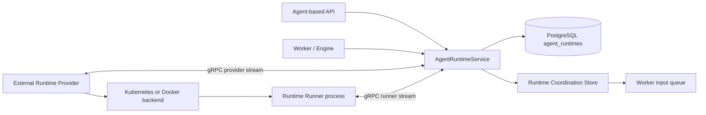

# Agent Runtime Control

## Overview

Agent Runtime is top-level domain of execution environment per Agent, not a sub-concept of sandbox/session. Runtime is one per Agent, and Control API looks up, creates, and controls Runtime by `agent_id` without using active session lookup. Legacy `azents-sandbox` provider-control path does not receive production traffic.

Control replica is stateless. Runtime existence, desired state, provider observed state, provider connection state, runner state, and failure summary have PostgreSQL `agent_runtimes` row as durable source of truth. Process-local handle/cache cannot be used even as performance aid for deciding Runtime state.

## Planes

## Durable State

`agent_runtimes` stores the product authority for Runtime state:

- desired lifecycle state and desired generation
- selected `runtime_provider_id`
- provider observed state, provider generation, provider runtime id, connection state
- provider-reported Agent Workspace path
- runner state, runner generation, active operation ids, connection state
- current-generation failure code/message/details
- run state for the Agent execution loop
- terminal-delete requested generation, acknowledged generation, and acknowledgement timestamp

Server output exposes raw Runtime data only as diagnostics. UI behavior must be driven by the server-computed summary/actions:

- summary examples: `STOPPED`, `STARTING`, `RUNNING`, `STOPPING`, `RESETTING`, `RECOVERING`, `PROVIDER_DISCONNECTED`, `RUNNER_UNAVAILABLE`, `FAILED`
- actions examples: start, stop, restart, reset, recover

Frontend code may handle API failure and network failure locally, but it must not recompute Runtime availability by combining raw provider/runner states.

## Coordination Store

The Runtime Coordination Store is the only cross-replica volatile coordination abstraction. It has Redis and in-memory implementations. Redis is the distributed production implementation; in-memory is for standalone/dev/test only.

The store owns:

- provider and runner connection registry
- provider generation-scoped request/reply streams
- runner generation-scoped operation request/reply streams and operation body streams
- operation metadata, heartbeat/progress/final events
- generation fencing data used to reject stale provider/runner messages
- request claim cursors and stream metadata used to acknowledge delivered Provider/Runner requests

Generation fencing is enforced before volatile stream messages mutate durable state. Control rejects or closes Provider/Runner streams whose inbound message generation differs from the accepted registration generation. Durable Provider reports are accepted only when both the Provider stream generation and observed desired generation are monotonic relative to the `agent_runtimes` row. Durable Runner state reports are accepted only when the Runner generation is not older than the row generation. Stale reports must not overwrite workspace path, observed state, runner availability, or current failure fields.

Provider report framing always uses the generation accepted for the current Control stream. A Provider reconnect or leader failover may observe backend resources whose labels contain an older Provider generation; those labels are historical command metadata and must be replaced with the current connection generation before initial resync reports, watch reports, or command completion reports are sent to Control.

Provider and Runner request streams use explicit claim/ack delivery. Control returns each claimed request with the stream cursor and consumer-group metadata needed to acknowledge the request only after it has been sent on the matching gRPC stream. Unacknowledged requests may be reclaimed after an idle interval so a Control replica crash or stream interruption does not strand in-flight Provider/Runner work.

Runner operation cancellation is an ordered request on the same generation-scoped stream as the original operation. Control records `cancel_requested_at`, transitions non-final metadata to `cancel_requested`, and appends `operation.cancel` after the operation request. Start authorization atomically claims an active operation as running, so cancellation may win before handler creation. A Runner whose start claim is denied emits the operation's terminal cancellation result instead of silently dropping the request. Pending work is removed from the owner queue; active work is cancelled through its handler task. Final operation metadata and reply cursors remain authoritative, and a late Runner final cannot overwrite an already accepted terminal result.

Connection heartbeat and revoke operations are generation-fenced. In Redis-backed coordination, heartbeat refresh and revoke are atomic compare-and-set/delete operations against the current connection generation. Reading an expired connection must not delete the key because a newer reconnect may have replaced it concurrently. When a Runner stream closes, Control records `stream_closed` durable state only if revoking that same generation succeeds; stale close handling must not overwrite a newer Runner generation.

The store is not a source of product truth. Losing store data may interrupt in-flight commands but must not make a Control replica infer that a Runtime does not exist or that workspace data can be discarded.

## Control Stream Authentication

Provider and Runner streams use separate credentials.

Every Provider stream presents a Provider-bound credential as bearer metadata. Control resolves that credential to one known durable Provider before reading registration, rejects a client-supplied Provider ID or credential ID that does not match the resolved identity, and records the authenticated credential on the durable connection. A Runtime Control shared token cannot authenticate a Provider, and a Provider connection cannot create or discover its Provider resource.

Runner streams use the optional Runtime Control transport-token gate. When `AZ_RUNTIME_CONTROL_AUTH_ENABLED` is true, Control requires a non-empty `AZ_RUNTIME_CONTROL_AUTH_TOKEN` at startup and rejects Runner streams that do not provide the matching token. Runners may present the token with `authorization: Bearer ...` metadata or `x-azents-runtime-control-token` metadata.

The Helm chart reads the Runner transport token and Provider credential from separate existing Secret references. It must not place token or credential literals in default values or rendered manifests. Runtime Control auth is disabled by default in chart values. When enabled, `server.runtimeControl.auth.existingSecret` and `server.runtimeControl.auth.tokenKey` identify the transport token used by the Control server. The Kubernetes Provider receives the same transport token only so it can inject it into Runtime Runner containers; the Provider's own Control stream continues to use its Provider-bound credential.

Credential values are secret material. Logs, test evidence, and user-visible diagnostics may mention authentication being enabled, disabled, missing, or invalid, but must not include raw values.

## Provider Contract

Provider is lifecycle-only. It implements:

- start
- stop
- restart
- reset
- observe
- terminal delete

Provider reports backend observed state and metadata. The Agent Workspace absolute path is provider metadata and is stored on `agent_runtimes.workspace_path`. Runner registration can validate that it mounted the same path, but Runner is not the authority for choosing the Agent Workspace path.

Kubernetes Runtime Pod reuse compares Provider-managed configuration while allowing additive fields injected by Kubernetes admission and defaulting. In particular, configured tolerations must remain present, but built-in `NoExecute` tolerations added by Kubernetes do not make an otherwise reusable Pod stale or trigger replacement during repeated start reconciliation.

If Provider is disconnected or reports no workspace path for a Runtime that needs workspace access, Control records an explicit failure/unavailable state. It must not invent a fallback path. `PROVIDER_WORKSPACE_PATH_MISSING` is the explicit error for a missing provider path.

Kubernetes and Docker Providers are external components. They must not import Azents server modules, DB sessions, repositories, or in-process managers. They communicate with Control only via the runtime-control protocol and their backend APIs.

Terminal delete is an internal-only command used by Agent decommission finalization. Control
dispatches it until the Provider reports a matching terminal-delete acknowledgement. Docker removes
the Runtime container and provider-owned root; Kubernetes removes the Runtime Pod and PVC.
Already-absent resources acknowledge successfully, so repeated delivery is idempotent. A stale
report cannot satisfy the request: Control persists acknowledgement only when the observed desired
generation equals the currently requested generation. Terminal delete is not a public lifecycle
action and does not create a user-facing permanent-delete control.

## Runner Contract

Runner is operation-only. It handles operations inside an already provisioned Runtime:

- process start/write operations used by model-visible `exec_command` and `write_stdin`
- file stat/list/read/write/grep
- file upload/download body streams
- Git repository/worktree operations used by operation TurnAction execution and cleanup
- operation heartbeat/progress/final events

`file.stat` is the authoritative operation for classifying a workspace path as file, directory, symlink, other, or missing before a caller chooses a file or directory operation.

`file.list` accepts either a workspace file path or directory path. File paths return that single file entry. Directory paths are direct-child listings by default, and callers can opt into recursive listing with exclude patterns so high-level file tools can skip heavy trees such as `.git` or `node_modules`.

`file.glob` accepts a Runtime filesystem path pattern and evaluates pathname matching inside the Runner rather than listing paths for Engine-side matching. It supports `*`, `?`, character classes, recursive `**`, bounded comma-separated brace alternatives, directory matches, and exclude patterns. Patterns beginning with `~` fail explicitly. One visible `glob` tool call dispatches one Runner operation and returns structured file-list entries for matching files and directories.

`file.grep` accepts a workspace file path or directory path plus a regex pattern. The Runner performs file discovery, text decoding, regex matching, line limiting, file limiting, exclude filtering, searched-file limiting, and scanned-byte limiting inside the Runtime workspace, then returns a structured final payload of matched files, line matches, truncation status, and truncation reason. Callers should not implement grep by issuing `file.list` plus one `file.read` operation per file.

`file.apply_patch` accepts one bounded UTF-8 V4A document plus an absolute Runtime `base_path`. The grammar requires `*** Begin Patch` and `*** End Patch`, supports only Add File, Update File, and Delete File operations, and permits each relative path at most once. Update hunks use exact unique logical-line context with optional anchors and an end-of-file assertion. The parser rejects malformed envelopes, unsupported operations, ambiguous or missing context, overlapping hunks, duplicate paths, invalid encodings, and mixed patch newlines before mutation.

Every patch path is confined below the canonical base directory. The Runner rejects absolute paths, lexical parent traversal, escaping or symlink parents, final symlinks, unsupported file kinds, invalid UTF-8 or binary source, mixed source newlines, existing Add destinations, missing Update/Delete targets, and destructive precondition drift. Bounded limits cover patch bytes, operation and hunk counts, path length, per-file and aggregate bytes, and the end-to-end deadline. LF and CRLF sources retain their newline style and final-newline state.

The Runner parses an immutable operation plan, preflights all targets, stages Add/Update payloads, records source observations, and revalidates the complete plan before commit. It commits Add and Update operations in patch order, then Delete operations in patch order, revalidating immediately before each publication. Each path uses an atomic publication primitive where supported. Parse, preflight, stage, or pre-commit revalidation failure leaves every target unchanged. A later commit failure stops immediately, preserves the committed prefix, cleans uncommitted staging files, and does not attempt rollback.

Terminal success returns ordered changes with path, action, added and removed line counts, and the resulting content hash when applicable. Terminal failure returns phase, stable reason, exact committed changes, the failed operation, remaining operations, and whether the delta is exact. Runner logs contain only bounded operational counts, phases, reasons, paths where safe, and timing; raw patch, source, and replacement content are excluded.

Runner executes blocking file read/download, write/upload, stat, list, glob, grep, delete, mkdir, move, bulk-delete, and bulk-move sections through a dedicated `ThreadPoolExecutor` instead of on the asyncio event loop. The production default is eight filesystem workers, bounded independently from ordinary Runner admission and owner scheduling limits. This prevents one admitted recursive traversal or regex scan from blocking unrelated async operations after fair scheduling has dispatched them.
Recursive list and grep helpers receive a thread-safe cancellation signal. Cancelling the async handler sets that signal, and traversal plus line scanning check it between blocking operations. Cancellation is cooperative and does not preempt an operating-system filesystem call already executing in a worker thread. Existing final payloads and semantic file error mappings remain unchanged.

Git operations are typed Runner operations, not arbitrary shell strings. `list_git_refs` previews local
branches, remote branches, tags, default branch, and HEAD commit for a source Project path.
`create_git_worktree` creates a branch-backed worktree from a source Project and starting ref and
returns the final worktree path, branch name, and base commit. `inspect_git_worktree` is
non-mutating: it resolves the exact workspace target, reads `git worktree list --porcelain`, reports
whether that path is registered and which local branch it uses, classifies the physical target as
`directory`, `missing`, or `other`, and returns only a nullable dirty boolean for an exact registered
directory. It never returns status paths, diff content, or repository contents.

`remove_git_worktree` requires the recorded branch and repeats registration plus physical-target
inspection immediately before mutation. An exact registered directory may be removed under the
caller's explicit force policy. A missing target returns terminal `already_absent`, clearing stale Git
registration when present. An existing unregistered target, an existing registered target with a
different branch, a missing target whose stale registration names a different branch, and a
non-directory target return `worktree_ownership_ambiguous` without deletion.
`delete_git_branch` deletes only the requested branch in the valid source repository and returns
`already_absent` when that exact branch no longer exists. These operations return semantic failures
for non-Git paths, invalid refs, collisions, ownership ambiguity, and Git command failures so product
services can persist bounded setup or cleanup classifications.

Runner registration and state reports include a mounted workspace path. Control compares it with the provider-reported path and records an explicit failure if they differ. A Runner `busy` report means it is healthy and actively executing an operation, so Control persists it as `ready` rather than treating it as a Runtime failure. Operation routing uses runner generation fencing so stale runner streams cannot complete newer operations.

Every ordinary Runner operation carries common nullable `owner_session_id` scheduling context in the operation request and domain envelope. Server-side clients require callers to pass the nullable value explicitly. Session-scoped process, file, Skill projection, Project registration, and worktree operations pass the invoking Agent Session ID. This includes internal file stat/list/read operations performed after a successful visible `read` to discover AGENTS.md and Claude Rules appendices. Subagents use their own Agent Session ID for both visible and appendix-internal work while resolving files against their parent Agent Runtime. Agent Workspace management, Agent Project catalog work, pre-Session Git preview, and other Agent-level operations pass `None` and use the system owner. Ownership is trusted scheduling and operator-diagnostic context, not authorization proof, and it is not exposed in model-visible tool output.

Ordinary process, file, and Git operations share owner and Runtime capacity. The default active limits are 10 per Agent Session, 10 for the system owner, and 50 for the Runtime. Each owner has a FIFO pending queue. The Runner visits eligible owner queues in round-robin order, skips owners already at their active limit, and advances the rotation after each dispatch. FIFO is guaranteed within one owner; cross-owner order is fair rather than globally FIFO. A long-running owner cannot block unrelated Session or system work while Runtime capacity remains available.

Admission occurs directly at the Runner transport receive boundary. There is no unbounded intermediate operation queue in front of scheduler accounting. The defaults allow 100 pending operations per owner and 1,000 per Runtime. Exceeding either bound produces a final `operation_queue_full` result without automatic Control retry. An admitted operation keeps its end-to-end deadline; if it expires while pending, the Runner returns final `operation_timeout` before acquiring an active slot or invoking the operation handler. Cancellation is fenced immediately before handler task creation, and disconnect/shutdown clears generation-local pending work so it cannot be replayed after Runner replacement.

Session termination uses a separate control queue with default concurrency 4. Termination and mandatory Runner cleanup do not consume ordinary 10/50 capacity, so user stop remains available while ordinary work is saturated. The control queue is not a general priority path for user operations.

The Runner reports READY/BUSY state with active operation IDs and string-encoded diagnostic snapshots for Runtime, system, per-Session, and control pending/active counts plus cumulative queue rejection and pre-execution timeout counts. Structured JSON logs record request and generation identity, ownership class and Session ID, admission/scheduling counts, `queue_wait_ms`, `execution_ms`, and configured limits. Each offloaded filesystem operation also records `filesystem_status`, `filesystem_queue_wait_ms`, `filesystem_execution_ms`, and `filesystem_max_workers`, separating executor pressure from ordinary scheduling time. Queue pressure and final operation failures remain tool observations; they do not trigger Runtime lifecycle transitions or server/runtime restarts.

The Runner reads six validated deployment settings: `AZ_RUNTIME_RUNNER_MAX_CONCURRENT_OPERATIONS_PER_SESSION`, `AZ_RUNTIME_RUNNER_MAX_CONCURRENT_SYSTEM_OPERATIONS`, `AZ_RUNTIME_RUNNER_MAX_CONCURRENT_OPERATIONS`, `AZ_RUNTIME_RUNNER_MAX_PENDING_OPERATIONS_PER_OWNER`, `AZ_RUNTIME_RUNNER_MAX_PENDING_OPERATIONS`, and `AZ_RUNTIME_RUNNER_MAX_CONCURRENT_CONTROL_OPERATIONS`. Docker and Kubernetes Providers forward only these allowlisted Runner settings. Provider reuse checks compare the exact managed setting set, so changing or removing an override replaces the Runtime workload. Kubernetes Helm values expose the six settings under `runtimeProviderKubernetes.runnerLimits`; existing Runtimes must be restarted after limit changes.

Runner owns runtime exec process handles, stdin writers, stdout/stderr drains, unread output buffers, process exit state, and process cleanup. Control and Worker store only routing/projection metadata. Process sessions are scoped to AgentSession and current Runner generation; runner restart, generation mismatch, cleanup, or missing ids produce model-visible missing/terminated/expired observations through `write_stdin` rather than server-side assistant/system failures.

A Control stream disconnect fences the previous Runner generation, cancels its active operation tasks, and terminates its managed exec processes before reconnecting. Managed exec processes run in dedicated operating-system process groups. Cleanup signals the complete process group, escalates from termination to kill, drains or cancels process tasks within bounded deadlines, and must never wait indefinitely before the Runner opens its next Control stream. Cleanup emits structured process count, duration, timeout, process id, and process-group diagnostics without logging commands, credentials, or Runtime Control tokens.

Process output is continuously drained into bounded Runner-owned buffers. Tool calls drain unread buffers into one model-visible client tool result and preserve structured process metadata. Callers observe process completion through process events or later `write_stdin` polling. Runtime Control has no fire-and-forget Background operation envelope, receipt, completion claim, or completion-input path. `RunnerOperationRequest` protobuf field 7 is reserved and must not be reused.

Runner operations are deadline-bounded end to end. Every `RuntimeRunnerOperation` carries a non-null `deadline_at`. Callers pass the same deadline to the reply-stream fold/resume path; waiting for a final reply without a deadline is invalid. If the reply stream does not produce a final event before the deadline, Control appends a local final error event with `operation_timeout`, marks the operation final, and the caller receives a failed operation result instead of waiting indefinitely. Coordination Store operation metadata must live at least until the operation deadline plus a buffer so timeout/final folding can complete; it must not expire earlier merely because the default operation TTL is shorter than the requested deadline. Provider lifecycle commands and Coordination Store metadata may still model optional deadlines because they cover different request classes and storage TTL semantics.

For `file.apply_patch`, cancellation is cooperative through parse, preflight, staging, and complete-plan revalidation. A cancellation observed before commit returns a typed no-change failure. Commit does not accept a cancellation checkpoint after its first mutation boundary; Control and Engine continue waiting for the bounded typed success or partial-failure terminal result so committed changes are never misreported as a generic cancellation.

## Lifecycle Semantics

Lifecycle APIs are desired-state declarations. Repeating the same request must converge to the same state and must not delete Agent Workspace data.

- `start` sets desired state to running.
- `stop` sets desired state to stopped and must preserve workspace data.
- `restart` restarts compute but must preserve workspace data.
- `recover`/reconcile may repair control/backend drift but must preserve workspace data.
- `reset` is the only lifecycle operation allowed to delete Agent Workspace data.

Reset carries its own desired generation and a final desired state. Provider is responsible for performing backend deletion/recreation according to that command and reporting the resulting observed state.

## Delivery

Production deploys the new path through GitOps:

- ECR repositories and GitHub Actions build/push runtime images.
- Helm values/templates render runtime-control, runtime-runner, and Kubernetes provider settings.
- ArgoCD Application/root/overlay includes the runtime provider deployment.
- Final cutover defaults route production to the Agent Runtime path and disables/prunes the legacy sandbox provider-control traffic path.

Manual image push, manual `kubectl apply`, or manual ArgoCD value edits are not completion criteria.

## Validation

Required deterministic coverage:

- repository/service tests for desired/observed/runner state summary/actions
- Coordination Store contract tests for in-memory and Redis implementations
- provider/runner gRPC registration, generation fencing, request/reply/body stream tests
- Runner operation tests for process, file, Git, and strict V4A patch operations
- Runtime Control contract tests for ordered operation cancellation, start/cancel races, terminal cursor authority, and typed patch result folding
- Provider tests for Docker host bind mount persistence and Kubernetes PVC persistence
- azents deterministic E2E for Agent Workspace bootstrap and lifecycle actions
- credential-free runtime-provider E2E for multi-file `apply_patch`, typed results, final manifests, and traversal rejection

Live/provider evidence belongs in the testenv prerequisite system and must redact tokens, credential ids, auth headers, rendered secrets, and raw Runtime tokens.

## Changelog

- **2026-07-22** (spec_version 24) — Added content-free Git worktree inspection, branch-fenced removal, terminal missing-target and missing-branch outcomes, and non-destructive ambiguous-target rejection.
- **2026-07-21** (spec_version 23) — Added generation-fenced internal Provider terminal deletion and durable acknowledgement for Agent decommission finalization.
- **2026-07-20** (spec_version 22) — Added strict Runner-owned V4A `file.apply_patch`, ordered cancellation and terminal settlement, bounded path and content safety, staged revalidation, deterministic commit ordering, and exact no-rollback partial-failure reporting.
- **2026-07-20** (spec_version 21) — Removed chart-enforced Runtime Control replica, autoscaling, and disruption-budget availability policy so deployments own their scaling configuration.
- **2026-07-20** (spec_version 20) — Added native Runner `file.glob` evaluation so Engine glob calls use one Runtime filesystem operation with recursive, brace, directory, exclude, and explicit tilde-rejection semantics.
- **2026-07-20** (spec_version 19) — Bounded Runner reconnect cleanup with process-group termination and required highly available Runtime Control replicas.
- **2026-07-19** (spec_version 18) — Added the bounded eight-worker filesystem executor, cooperative traversal cancellation, filesystem-specific queue/execution diagnostics, and explicit invoking-Session ownership for appendix-internal file operations.
- **2026-07-12** (spec_version 17) — Removed the Background Runner operation protocol and reserved `RunnerOperationRequest` field 7 while preserving explicit process observation.
- **2026-07-12** (spec_version 16) — Removed the obsolete background-operation completion publication path; process completion remains caller-observed through Runner events and `write_stdin` polling.
- **2026-07-11** (spec_version 15) — Defined Runner `busy` reports as healthy operation activity normalized to durable `ready` state.
- **2026-07-10** (spec_version 14) — Added common Session ownership, per-owner FIFO and cross-owner fair scheduling, 10/10/50 active defaults, bounded pending admission, a dedicated termination path, structured diagnostics, and deployed Runner limit configuration.
- **2026-07-10** (spec_version 13) — Allowed Kubernetes admission-defaulted tolerations during Runtime Pod reuse so repeated start reconciliation does not delete a healthy Pod.
- **2026-07-10** (spec_version 12) — Required Provider-side report generation rebasing after reconnect or leader failover so historical backend labels cannot close the current Control stream.
- **2026-07-09** (spec_version 11) — Added generation-fenced connection heartbeat/revoke semantics and stale Runner stream-close handling.
- **2026-07-09** (spec_version 10) — Added Provider/Runner request claim/ack/reclaim semantics, operation metadata deadline buffering, and background completion context propagation.
- **2026-07-09** (spec_version 9) — Added monotonic Provider/Runner generation fencing for stream messages and durable Runtime state updates.
- **2026-07-09** (spec_version 8) — Added Runtime Control shared-token authentication for Provider and Runner gRPC streams and documented the Helm Secret-based wiring contract.
- **2026-07-04** (spec_version 6) — Added typed Runner Git operations for ref preview, worktree creation, worktree removal, and branch deletion.
- **2026-06-28** (spec_version 5) — Promoted Runtime Runner process operations and runner-owned process lifecycle/buffer semantics for `exec_command` and `write_stdin`.
