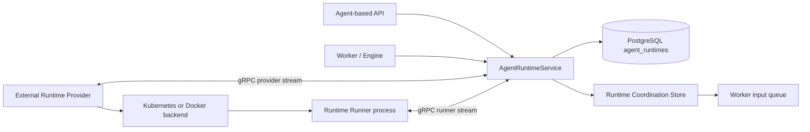

# Agent Runtime Control

## Overview

Agent Runtime is top-level domain of execution environment per Agent, not a sub-concept of sandbox/session. Runtime is one per Agent, and Control API looks up, creates, and controls Runtime by `agent_id` without using active session lookup. Legacy `azents-sandbox` provider-control path does not receive production traffic.

Control replica is stateless. Runtime existence, desired state, provider observed state, provider connection state, runner state, and failure summary have PostgreSQL `agent_runtimes` row as durable source of truth. Process-local handle/cache cannot be used even as performance aid for deciding Runtime state.

## Planes

## Durable State

`agent_runtimes` stores the product authority for Runtime state:

- desired lifecycle state and desired generation
- selected `runtime_provider_id`
- provider observed state, provider generation, provider runtime id, connection state
- provider-reported Agent Workspace path
- runner state, runner generation, active operation ids, connection state
- current-generation failure code/message/details
- run state for the Agent execution loop

Server output exposes raw Runtime data only as diagnostics. UI behavior must be driven by the server-computed summary/actions:

- summary examples: `STOPPED`, `STARTING`, `RUNNING`, `STOPPING`, `RESETTING`, `RECOVERING`, `PROVIDER_DISCONNECTED`, `RUNNER_UNAVAILABLE`, `FAILED`
- actions examples: start, stop, restart, reset, recover

Frontend code may handle API failure and network failure locally, but it must not recompute Runtime availability by combining raw provider/runner states.

## Coordination Store

The Runtime Coordination Store is the only cross-replica volatile coordination abstraction. It has Redis and in-memory implementations. Redis is the distributed production implementation; in-memory is for standalone/dev/test only.

The store owns:

- provider and runner connection registry
- provider generation-scoped request/reply streams
- runner generation-scoped operation request/reply streams and operation body streams
- operation metadata, heartbeat/progress/final events
- background operation completion claims
- generation fencing data used to reject stale provider/runner messages
- request claim cursors and stream metadata used to acknowledge delivered Provider/Runner requests

Generation fencing is enforced before volatile stream messages mutate durable state. Control rejects or closes Provider/Runner streams whose inbound message generation differs from the accepted registration generation. Durable Provider reports are accepted only when both the Provider stream generation and observed desired generation are monotonic relative to the `agent_runtimes` row. Durable Runner state reports are accepted only when the Runner generation is not older than the row generation. Stale reports must not overwrite workspace path, observed state, runner availability, or current failure fields.

Provider report framing always uses the generation accepted for the current Control stream. A Provider reconnect or leader failover may observe backend resources whose labels contain an older Provider generation; those labels are historical command metadata and must be replaced with the current connection generation before initial resync reports, watch reports, or command completion reports are sent to Control.

Provider and Runner request streams use explicit claim/ack delivery. Control returns each claimed request with the stream cursor and consumer-group metadata needed to acknowledge the request only after it has been sent on the matching gRPC stream. Unacknowledged requests may be reclaimed after an idle interval so a Control replica crash or stream interruption does not strand in-flight Provider/Runner work.

Connection heartbeat and revoke operations are generation-fenced. In Redis-backed coordination, heartbeat refresh and revoke are atomic compare-and-set/delete operations against the current connection generation. Reading an expired connection must not delete the key because a newer reconnect may have replaced it concurrently. When a Runner stream closes, Control records `stream_closed` durable state only if revoking that same generation succeeds; stale close handling must not overwrite a newer Runner generation.

The store is not a source of product truth. Losing store data may interrupt in-flight commands but must not make a Control replica infer that a Runtime does not exist or that workspace data can be discarded.

## Control Stream Authentication

Runtime Control gRPC streams support a shared-token authentication gate for Provider and Runner connections. When `AZ_RUNTIME_CONTROL_AUTH_ENABLED` is true, Control requires a non-empty `AZ_RUNTIME_CONTROL_AUTH_TOKEN` at startup and rejects Provider or Runner streams that do not provide the matching token before stream registration is processed. Clients may present the token with `authorization: Bearer ...` metadata or `x-azents-runtime-control-token` metadata.

The Helm chart wires Runtime Control auth from an existing Kubernetes Secret only. It must not place token literals in default values or rendered manifests. Runtime Control auth is disabled by default in chart values so consumers can opt into the Runtime Control component without committing a placeholder Secret reference. When Runtime Control auth is enabled for the chart, `server.runtimeControl.auth.existingSecret` and `server.runtimeControl.auth.tokenKey` identify the Secret key used by the Control server and Kubernetes Provider deployment. Providers propagate the same token to Runtime Runner containers through `AZ_RUNTIME_CONTROL_AUTH_TOKEN` so Runner streams authenticate back to Control.

Auth token values are secret material. Logs, test evidence, and user-visible diagnostics may mention auth being enabled, disabled, missing, or invalid, but must not include raw token values.

## Provider Contract

Provider is lifecycle-only. It implements:

- start
- stop
- restart
- reset
- observe

Provider reports backend observed state and metadata. The Agent Workspace absolute path is provider metadata and is stored on `agent_runtimes.workspace_path`. Runner registration can validate that it mounted the same path, but Runner is not the authority for choosing the Agent Workspace path.

If Provider is disconnected or reports no workspace path for a Runtime that needs workspace access, Control records an explicit failure/unavailable state. It must not invent a fallback path. `PROVIDER_WORKSPACE_PATH_MISSING` is the explicit error for a missing provider path.

Kubernetes and Docker Providers are external components. They must not import Azents server modules, DB sessions, repositories, or in-process managers. They communicate with Control only via the runtime-control protocol and their backend APIs.

## Runner Contract

Runner is operation-only. It handles operations inside an already provisioned Runtime:

- process start/write operations used by model-visible `exec_command` and `write_stdin`
- file stat/list/read/write/grep
- file upload/download body streams
- Git repository/worktree operations used by operation TurnAction execution and cleanup
- operation heartbeat/progress/final events

`file.stat` is the authoritative operation for classifying a workspace path as file, directory, symlink, other, or missing before a caller chooses a file or directory operation.

`file.list` accepts either a workspace file path or directory path. File paths return that single file entry. Directory paths are direct-child listings by default, and callers can opt into recursive listing with exclude patterns so high-level file tools can skip heavy trees such as `.git` or `node_modules`.

`file.grep` accepts a workspace file path or directory path plus a regex pattern. The Runner performs file discovery, text decoding, regex matching, line limiting, file limiting, exclude filtering, searched-file limiting, and scanned-byte limiting inside the Runtime workspace, then returns a structured final payload of matched files, line matches, truncation status, and truncation reason. Callers should not implement grep by issuing `file.list` plus one `file.read` operation per file.

Git operations are typed Runner operations, not arbitrary shell strings. `list_git_refs` previews local branches, remote branches, tags, default branch, and HEAD commit for a source Project path. `create_git_worktree` creates a branch-backed worktree from a source Project and starting ref and returns the final worktree path, branch name, and base commit. `remove_git_worktree` removes an owned worktree path with explicit force policy. `delete_git_branch` deletes only the requested branch in the source repository. These operations return semantic failures for non-Git paths, invalid refs, collisions, and Git command failures so product services can show user-safe setup or cleanup summaries.

Runner registration and state reports include a mounted workspace path. Control compares it with the provider-reported path and records an explicit failure if they differ. Operation routing uses runner generation fencing so stale runner streams cannot complete newer operations.

Runner may process multiple operations concurrently up to its configured bounded concurrency. A long-running operation must not block unrelated operation requests from being scheduled while capacity remains available.

Runner owns runtime exec process handles, stdin writers, stdout/stderr drains, unread output buffers, process exit state, and process cleanup. Control and Worker store only routing/projection metadata. Process sessions are scoped to AgentSession and current Runner generation; runner restart, generation mismatch, cleanup, or missing ids produce model-visible missing/terminated/expired observations through `write_stdin` rather than server-side assistant/system failures.

Process output is continuously drained into bounded Runner-owned buffers. Tool calls drain unread buffers into one model-visible client tool result and preserve structured process metadata. Running exec processes do not use background operation completion publication and do not inject `background_completion` messages when they exit; callers observe completion through process events or later `write_stdin` polling.

Runner operations are deadline-bounded end to end. Every `RuntimeRunnerOperation` carries a non-null `deadline_at`, including foreground and background operations. Foreground callers pass the same deadline to the reply-stream fold/resume path; waiting for a final reply without a deadline is invalid. If the reply stream does not produce a final event before the deadline, Control appends a local final error event with `operation_timeout`, marks the operation final, and the caller receives a failed operation result instead of waiting indefinitely. Coordination Store operation metadata must live at least until the operation deadline plus a buffer so timeout/final folding can complete; it must not expire earlier merely because the default operation TTL is shorter than the requested deadline. Provider lifecycle commands and Coordination Store metadata may still model optional deadlines because they cover different request classes and storage TTL semantics.

## Lifecycle Semantics

Lifecycle APIs are desired-state declarations. Repeating the same request must converge to the same state and must not delete Agent Workspace data.

- `start` sets desired state to running.
- `stop` sets desired state to stopped and must preserve workspace data.
- `restart` restarts compute but must preserve workspace data.
- `recover`/reconcile may repair control/backend drift but must preserve workspace data.
- `reset` is the only lifecycle operation allowed to delete Agent Workspace data.

Reset carries its own desired generation and a final desired state. Provider is responsible for performing backend deletion/recreation according to that command and reporting the resulting observed state.

## Background Operation Completion

Long-running Runner operations can be marked background. Control stores background operation metadata in the Coordination Store, folds matching request events from the generation-scoped operation reply stream when a final event appears, claims publication idempotently, and enqueues a structured Worker input message. Background operation metadata includes the request id, operation id, parent AgentSession context, workspace id, agent id, tool name, and idempotency key needed to publish completion after the original request stream has been claimed, acknowledged, or retried.

The Worker input queue message contains the parent AgentSession id, workspace id, agent id, runtime id, operation id, request id, tool name, status, completion text, and an idempotency key. Worker stores it as a `background_completion` input buffer for the parent AgentSession and sends a session wake-up. Completion publication must be idempotent across Control replica restarts.

## Delivery

Production deploys the new path through GitOps:

- ECR repositories and GitHub Actions build/push runtime images.
- Helm values/templates render runtime-control, runtime-runner, and Kubernetes provider settings.
- ArgoCD Application/root/overlay includes the runtime provider deployment.
- Final cutover defaults route production to the Agent Runtime path and disables/prunes the legacy sandbox provider-control traffic path.

Manual image push, manual `kubectl apply`, or manual ArgoCD value edits are not completion criteria.

## Validation

Required deterministic coverage:

- repository/service tests for desired/observed/runner state summary/actions
- Coordination Store contract tests for in-memory and Redis implementations
- provider/runner gRPC registration, generation fencing, request/reply/body stream tests
- Runner operation tests for process, file, and Git operations
- Provider tests for Docker host bind mount persistence and Kubernetes PVC persistence
- azents deterministic E2E for Agent Workspace bootstrap and lifecycle actions

Live/provider evidence belongs in the testenv prerequisite system and must redact tokens, credential ids, auth headers, rendered secrets, and raw Runtime tokens.

## Changelog

- **2026-07-10** (spec_version 12) — Required Provider-side report generation rebasing after reconnect or leader failover so historical backend labels cannot close the current Control stream.
- **2026-07-09** (spec_version 11) — Added generation-fenced connection heartbeat/revoke semantics and stale Runner stream-close handling.
- **2026-07-09** (spec_version 10) — Added Provider/Runner request claim/ack/reclaim semantics, operation metadata deadline buffering, and background completion context propagation.
- **2026-07-09** (spec_version 9) — Added monotonic Provider/Runner generation fencing for stream messages and durable Runtime state updates.
- **2026-07-09** (spec_version 8) — Added Runtime Control shared-token authentication for Provider and Runner gRPC streams and documented the Helm Secret-based wiring contract.
- **2026-07-04** (spec_version 6) — Added typed Runner Git operations for ref preview, worktree creation, worktree removal, and branch deletion.
- **2026-06-28** (spec_version 5) — Promoted Runtime Runner process operations and runner-owned process lifecycle/buffer semantics for `exec_command` and `write_stdin`.
