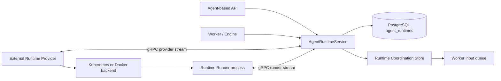

# Agent Runtime Control

## Overview

Agent Runtime is top-level domain of execution environment per Agent, not a sub-concept of sandbox/session. Runtime is one per Agent, and Control API looks up, creates, and controls Runtime by `agent_id` without using active session lookup. Legacy `azents-sandbox` provider-control path does not receive production traffic.

Control replica is stateless. Runtime existence, desired state, provider observed state, provider connection state, runner state, and failure summary have PostgreSQL `agent_runtimes` row as durable source of truth. Process-local handle/cache cannot be used even as performance aid for deciding Runtime state.

## Planes

```mermaid
flowchart LR
    API[Agent-based API]
    Worker[Worker / Engine]
    RuntimeSvc[AgentRuntimeService]
    DB[(PostgreSQL agent_runtimes)]
    Store[Runtime Coordination Store]
    Provider[External Runtime Provider]
    Backend[Kubernetes or Docker backend]
    Runner[Runtime Runner process]
    Queue[Worker input queue]

    API --> RuntimeSvc
    Worker --> RuntimeSvc
    RuntimeSvc --> DB
    RuntimeSvc --> Store
    Provider <-->|gRPC provider stream| RuntimeSvc
    Runner <-->|gRPC runner stream| RuntimeSvc
    Provider --> Backend
    Backend --> Runner
    Store --> Queue
```

## Interactive Terminal Control

The Runner advertises hidden capability `terminal.v1`. Runtime Control carries only
bounded open and terminate intents on the existing Runner Control stream. Each active
Terminal then uses one dedicated outbound bidirectional Runner gRPC stream for opaque
PTY input/output, resize, acknowledgement, status, and exit events. Existing Runner
operation and Runtime transfer streams never carry PTY bytes.

Terminal admission freezes Runtime ID, desired generation, current Runner connection
generation, Session working-folder authority, and Terminal identity. The Runner PTY
registry rejects stale generations, duplicate opens, malformed sequences, and unknown
Terminal IDs. Control-stream disconnect or a newer Runner generation terminates every
old-generation PTY. A data-stream interruption may reconnect only during the bounded
grace while Control generation remains current; ordered input and replay evidence
resume the same PTY without replaying accepted input.

Each coordination snapshot sends a newer coalesced resize to the Runner before pending
input from that snapshot. A resize accepted before subsequent browser input therefore
reaches the PTY before that input executes, without fixed timing delays or a separate
resize acknowledgement round trip.

Server coordination admits at most one active Terminal per Session, eight per user,
and sixteen per Runtime; the Runner independently enforces the Session and Runtime
ceilings. Terminal data frames are limited to 16 KiB, queued input to 64 KiB, live
unacknowledged output to 256 KiB, and replay to the smaller of 1 MiB or 64 chunks.
Tickets expire after 30 seconds. PTY authority has a 30-minute idle deadline, an
eight-hour absolute deadline, and two-minute browser and Runner-stream grace periods.
These bounds are the same for Redis and in-memory coordination.

Natural process exit and requested termination remain asynchronous Runner outcomes.
The Runner keeps a terminating stream alive for final status/exit delivery and retries
a failed or interrupted final flush by reconnecting within the overall stream grace.
The browser receive path likewise waits for the final exit or revocation control after
requesting termination instead of treating the terminate request itself as completion.
Authority invalidation or exhausted grace still closes the path fail-closed.

Runtime lifecycle always has priority. Stop, restart, reset, recreation, repair,
removal, and Runner replacement publish Terminal invalidation and proceed immediately;
they never acquire a Terminal lock, wait for browser acknowledgement, or wait for PTY
cleanup. The Linux Runner owns PTY allocation, process-session cleanup, TERM/KILL
escalation, idle and maximum lifetime, and complete Session-wide teardown. Shared
protocol contracts remain OS-neutral so another Runner backend can implement the same
surface later.

Terminal coordination is separate from ordinary Runtime operation coordination while
sharing the Redis-or-memory deployment choice. It stores bounded volatile attachment,
sequence, replay, quota, heartbeat, and revocation state only. PostgreSQL receives no
Terminal bytes or transcript. Structured logs and metrics retain identifiers, bounded
lifecycle reasons, durations, byte counts, truncation, quota, and cleanup outcomes,
never command, output, environment, or working-directory content.

## Runtime File Transfer

Complete-file movement uses a separate Runtime File Transfer capability. The ordinary
Runner Control stream carries only an authenticated transfer intent, progress,
cancellation, and terminal result. It never carries file-body chunks, and Runtime
Control keeps the existing gRPC message limits.

`RuntimeTransferCoordinator` is an internal trusted-service RPC. It admits one
directional attempt, owns its bounded state record, issues opaque object handles, and
serializes revision-fenced state transitions. The record contains identity, Runtime and
Runner generations, bounded manifests, destination policy, deadline, lease state,
phase, terminal outcome, cleanup state, bounded latest cleanup-failure evidence,
and consumer claims. Cleanup-failure evidence contains only a stable artifact
classification, latest observation time, and a saturating attempt count. Redis
stores that bounded coordination data for multi-replica deployments; the
in-memory implementation is single-process development and test support only.
Neither implementation stores byte chunks, provider URLs, S3 credentials, raw
storage object keys, raw provider upload IDs, raw provider errors, or product
file metadata. Existing object and multipart cleanup responsibilities use opaque
internal handles that are not exposed as storage authority.

`RuntimeRunnerTransfer` is a distinct authenticated Runner gRPC service terminated by
Runtime Control. `DownloadTransfer` streams ordered bounded raw frames from the
Control-owned immutable attempt object to the Runner and ends with the verified byte
count and SHA-256. `UploadTransfer` accepts an open frame, ordered bounded raw frames,
and one completion frame. Control streams the frames into its attempt object, verifies
the actual byte count and SHA-256, and only then makes the object available to a trusted
consumer.

The Runner receives only transfer/attempt identity, direction, Runtime path, expected
manifest, deadline, operation correlation, and generation-scoped dispatch authority.
It never receives object-store credentials, bucket or object identity, presigned URLs,
provider upload URLs, opaque trusted-service handles, or storage topology. Runtime
Control is the only component that streams between the Runner data RPC and the object
store; it uses bounded incremental I/O and does not buffer a complete file.

Each attempt is admitted before any bytes move and is fenced by Runtime desired
generation, accepted Runner generation, dispatch ID, deadline, and state revision.
Ordered offsets, maximum sizes, expected and actual manifests, cancellation, and
terminal state are checked at the Control boundary. A malformed, stale, duplicate, or
cross-attempt frame fails that attempt without exposing another object. Ordinary Runner
control operations remain independently available while a transfer stream is active.

For downloads, the Runner writes to a randomly named temporary file in the destination
directory and commits the requested destination only after complete verification. An
admitted overwrite atomically replaces the destination; failed and cancelled attempts
remove their temporary file and leave the prior destination unchanged. This transfer
integrity does not require root, fixed Linux identities, Provider-created staging, or
elevated Runner capabilities. For
uploads, the Runner snapshots one authorized source before opening the transfer and
reports its independently calculated manifest. A terminal transfer result is accepted
only for the current dispatch and cannot be replaced by a late result.

Verified objects are claimed by trusted consumers through short leases. A consumer
receives an opaque handle and bounded async stream, acknowledges only after its
product/provider publication succeeds, and abandons or settles a failed claim. Cleanup
removes terminal objects and incomplete multipart preparations according to their
bounded retention policy. A provider mutation is attempted at most once: no transfer or
provider call is replayed after mutation starts or its outcome is unknown.

Every attempt has a non-extendable logical expiration no later than one hour after
admission. Runtime Control rejects every access after that deadline even when the
physical object remains. Settlement immediately attempts exact object deletion or
multipart abort. The bounded repair loop also scans one page of completed objects and
one page of incomplete multipart uploads under the Control-owned transfer prefix,
independently of the selected transfer-state backend. Storage-reported objects and
uploads at least one hour old are deleted or aborted without recreating transfer state.
This lets an empty restarted in-memory or Redis store fail previous attempts closed,
resume new transfers, and converge orphan cleanup without Redis retention or leadership.
Backend lifecycle policy remains a later infrastructure-owned defense and is not a
Runtime Transfer authorization or startup input.

Cleanup responsibility is `pending` before the first exact external cleanup
attempt. A handled multipart-abort, completed-object-delete, combined, or
preparation cleanup failure changes it to `retryable_failure` with bounded latest
evidence. Each later failed repair updates the observation and saturating attempt
count; successful cleanup clears the evidence and marks cleanup complete. The
Memory and Redis stores enforce the same invariant. Redis transfer record schema
changes use the existing coordinated cutover and do not add a compatibility
reader or relational transfer entity.

The handling boundary for each failed cleanup attempt emits one structured
warning with origin traceback frames, a static replacement exception message,
and safe transfer/attempt or aggregate artifact fields. It never logs storage
keys, raw provider upload IDs, raw exception text, hashes, credentials,
endpoints, or bytes. State-independent orphan repair additionally reports
bounded listed/deleted/aborted/failed/skipped counters.

Runtime-to-Server transfer cleanup uses bounded abandon, status-recovery, and
cancellation-confirmation attempts after the transfer result is fixed. A
confirmed terminal status ends cleanup silently. If those paths cannot establish
terminal cleanup, the final observer records the last handled failure once with
the same sanitized traceback policy and does not change the transfer result.

## Durable State

`agent_runtimes` stores the product authority for Runtime state:

- desired lifecycle state and desired generation
- selected logical and durable Provider IDs used for exact routing
- monotonic Runtime-scoped `configuration_sequence` high-water mark
- provider observed state, provider generation, provider runtime id, connection state
- runner-reported Agent Workspace path
- runner state, runner generation, active operation ids, connection state
- current-generation failure code/message/details
- run state for the Agent execution loop
- terminal-delete requested generation, acknowledged generation, and acknowledgement timestamp

One one-to-one `runtime_configuration_states` row exists only while desired or applied configuration
state exists. It contains the current desired status, positive sequence, target desired generation,
digest, canonical source/configuration document or bounded reason, Provider/Runner acknowledgement
evidence, and the optional applied sequence/generation/digest/document/time. Source Profile,
infrastructure Profile, and Provider capability identifiers inside these documents are scalar
snapshot evidence rather than foreign keys to mutable source rows. Superseded desired and applied
documents are not retained as product history.

Server output exposes raw Runtime data only as diagnostics. UI behavior is driven by
one server-computed lifecycle presentation and the server-computed public actions.
The presentation contains:

- desired target (`running` or `stopped`);
- convergence (`stable`, `starting`, `stopping`, `resetting`, `recovering`,
  `blocked`, or `failed`);
- direct Provider connection and resource facts;
- the direct Runner state;
- overall availability (`ready`, `stopped`, `transitioning`,
  `provider_disconnected`, `runner_unavailable`, `configuration_blocked`,
  `failed`, or `removing`);
- one bounded safe reason code or `null`; and
- desired generation as the freshness identity.

Presentation precedence is terminal removal, a stopped desired target, a ready
current-generation Runner, current-generation failure, blocked desired configuration,
Provider disconnection that blocks convergence, desired/observed convergence, and
Runner unavailability. A ready Runner therefore remains available when Provider host
control disconnects or a future desired configuration is blocked or waiting for
recreation. Higher-precedence availability never rewrites the direct Provider or
Runner facts.

The Agent Runtime response and Agent Workspace bootstrap response expose the same
lifecycle presentation composed by `AgentRuntimeService`. Workspace keeps its
separate Runtime/access union only for file-browser layout and obtains lifecycle
actions from the same server authority. The public single-summary projection is not
part of the current API.

Runtime Settings and Workspace render one user-impact status plus separate execution
environment, Runtime connection, and host-control facts. Selected and applied Runtime
Profile, execution Profile, and network values remain available for verification, while
configuration sequence, generation, digest, raw reason code, and capability identifiers
remain outside the normal product surface. The UI renders only lifecycle actions that
the server currently authorizes and suppresses duplicate actions during an in-flight
transition. It polls while convergence is non-stable, permanent removal is active, or
configuration is waiting for recreation. Frontend code may handle API failure and
network failure locally, but it must not recompute Runtime availability or operation
completion from raw Provider/Runner fields.

Restart requires explicit confirmation that Agent Workspace storage is preserved
and the Runtime will be temporarily unavailable. Reset uses a distinct destructive
confirmation because it may delete Agent Workspace data. Mutation loading covers
request submission only; after submission, the shared lifecycle presentation and
polling show convergence.

## Coordination Store

The Runtime Coordination Store is the only cross-replica volatile coordination abstraction. It has Redis and in-memory implementations. Redis is the distributed production implementation; in-memory is for standalone/dev/test only.

The store owns:

- provider and runner connection registry
- provider generation-scoped request/reply streams
- runner generation-scoped operation request/reply streams and operation body streams
- operation metadata, heartbeat/progress/final events
- generation fencing data used to reject stale provider/runner messages
- request claim cursors and stream metadata used to acknowledge delivered Provider/Runner requests

Each Provider- or Runner-subject connection generation counter remains persistent
within the selected coordination-store instance and is separate from the
short-lived current-connection TTL. Redis does not expire these counters, and
the in-memory implementation retains them for its process lifetime, so a
reconnect cannot reuse a lower generation after a long offline period. Each
Redis registration atomically increments the counter, removes a legacy expiry
that an earlier deployment may have left on the key, and installs that exact
generation as the current connection. Concurrent registration cannot restore a
lower generation after a higher generation becomes current.

Generation fencing is enforced atomically with volatile operation mutations. One
store transaction verifies the current connection generation while it creates
operation metadata and appends the request. The same rule covers ordered Runner
cancellation, Runner operation-start authorization, and Provider/Runner-originated
reply append. Operation metadata retains the exact request ID, target subject,
generation, request/reply streams, and admitted request cursor. Retrying one exact
dispatch is idempotent, while a replaced connection cannot create request-less
metadata, append a cancellation, start work, or finalize an operation.

Control rejects or closes Provider/Runner streams whose inbound message generation
differs from the accepted registration generation. Durable Provider reports are
accepted only when both the Provider stream generation and observed desired
generation are monotonic relative to the `agent_runtimes` row.
Durable Runner state reports are accepted only when the Runner generation is not older than the row
generation and any reported configuration evidence names the exact current desired generation,
positive configuration sequence, and digest. Provider configuration evidence is additionally
fenced by the exact bound Provider and current Provider connection generation. A Runner from the
replaced desired generation is ignored during workload handoff and cannot create an
evidence-mismatch failure for the new target. Stale reports must not overwrite workspace path,
observed state, configuration evidence, runner availability, or current failure fields.

Provider report framing always uses the generation accepted for the current Control stream. A Provider reconnect or leader failover may observe backend resources whose labels contain an older Provider generation; those labels are historical command metadata and must be replaced with the current connection generation before initial resync reports, watch reports, or command completion reports are sent to Control.

The Provider refreshes its connection lease on a task independent from serial lifecycle command
execution. A rejected or timed-out heartbeat ends the run loop, cancels in-flight command work, and
returns authority to the outer reconnect loop. Provider and Control gRPC transport queues are
bounded, and Control removes at most one lifecycle command from coordination for a live Provider
stream until that command completes. A command completion report is applied through the completion
frame exactly once; independent initial-resync and watch reports remain separate report frames.

Kubernetes Provider lifecycle reports describe the backend Pod state directly. Process-local
command history, verification caches, and NetworkPolicy state do not rewrite an observed running
Pod to `starting`. Watch, initial-resync, and failover reports may omit reconciliation evidence and
remain valid current-protocol lifecycle observations.

After an explicit lifecycle or configuration command, Kubernetes Provider v3 may attach one
structured aggregate `network_enforcement` reconciliation observation. `in_sync` confirms every
mode-required resource and readiness fence; `drifted` reports bounded mismatch evidence without
changing the lifecycle state. Missing or drifted evidence cannot acknowledge the desired
configuration. A complete report containing another reconciliation kind is rejected before it
becomes actionable; kinds are never ignored or partially consumed.

Authority is explicitly separated. The **Provider** owns factual lifecycle/resource observation and
configuration application, and cannot retain command history as lifecycle authority. The **Runtime
Control report sink** validates/fences Provider identity, generation, lifecycle, and configuration
evidence and persists only ordinary lifecycle/configuration facts; it must not interpret drift,
dispatch a repair, or retain repair state. The **gRPC bridge** owns only stream-local
`request_id → command_type` correlation. The **Lifecycle Reconciler** owns desired-state convergence
and dispatch: only a successful correlated `OBSERVE` completion may hand it current
`network_enforcement:drifted` evidence, which it re-fences before a non-destructive
`UPDATE_CONFIGURATION` dispatch. The Reconciler does not reinterpret Provider lifecycle facts and
does not persist a drift candidate, claim, retry time, or completion history.

The Kubernetes Provider owns each Runtime-specific enforcement bundle. Direct mode owns the
Runtime Pod, PVC, and complete Runtime NetworkPolicy. Proxy-required mode additionally owns one
dedicated proxy Pod, stable Service, canonical policy ConfigMap, logical-Runtime CA Secret, proxy
ingress/egress NetworkPolicies, public Runtime trust mount, and exact mandatory Service host
mappings. No-network mode owns a Platform-only Runtime NetworkPolicy and no proxy resources.
Creation uses typed Kubernetes API operations, while reconciliation of existing complete resources
uses resourceVersion-fenced replacement where exact semantics are required. Pods retain explicit
delete-and-recreate lifecycle semantics, PVCs retain data-preserving updates, and the leader Lease
retains concurrency-sensitive merge updates.

Control periodically dispatches idempotent Provider `start` commands for running Runtimes and
read-only Provider `observe` commands where current lifecycle state needs re-observation. Periodic
`start` revalidates the desired Runner image and Provider-managed workload configuration, reuses an
equivalent workload, and replaces only a drifted workload while preserving Agent Workspace storage.
Network enforcement repair is not a periodic durable candidate: only one valid, current,
live-stream `OBSERVE` completion reporting `network_enforcement:drifted` may immediately dispatch
`UPDATE_CONFIGURATION`, never `START`. The handoff is discarded after use. A missing completion,
Provider reconnect, Control restart, stale generation/configuration fence, unsupported evidence, or
dispatch failure creates no replay or hot loop; the next periodic `OBSERVE` is the only retry.
The Reconciler validates current fences and exact configuration from a lock-free Runtime snapshot,
then performs a fresh lock-free target check before preparing Provider dispatch. A state change that
is observed by either check discards the handoff; a later periodic observation converges a change
that races after the last check. Pending lifecycle dispatch and terminal deletion block the handoff.
Lifecycle and desired-configuration adoption retain their existing precedence and do not compete
with this one-shot handoff. Eligible handoff and successful dispatch logs carry Runtime/Provider
identity, Provider and desired generations, configuration sequence, reconciliation kind, and
reason; these logs are not durable repair state.

The live Provider connection registry, rather than a cached per-Runtime connection flag, gates dispatch; periodic attempts are durably throttled while a Provider is unavailable, and a successful dispatch refreshes the cached connection flag. Start timeout evaluation happens only after the current reconciliation pass has checked that live registry and only for a desired generation already dispatched to its Provider, so a Control rollout cannot convert a stale durable `connected` flag into a false `START_TIMEOUT`. This converges Runner image/configuration drift after deployment and closes gaps when a backend deletion event is missed during Provider reconnect or leader handoff. A current-generation Provider `stopped` report also converges durable Runner state to `disconnected`; the stopped backend is authoritative that no Runner remains available. Kubernetes Pod replacement treats deletion as asynchronous: the Provider must not apply the replacement under the same name until the old Pod is no longer observable, avoiding immutable-field PATCH failures during restart.

Runtime Profile reconciliation classifies one action for each candidate. A ready desired slot may
dispatch lifecycle work, wait for Provider acknowledgement, offer exact sequence/digest/generation
evidence to the Runner through the ordinary heartbeat acknowledgement, wait for a matching Runner
state report, adopt an enforcement-bundle change in place, wait for explicit recreation, or do
nothing. Independent loops must not select competing lifecycle and configuration actions for the
same observation.

Infrastructure-Profile hard deletion and Runtime recreation use one target-first lock hierarchy.
The recreation worker resolves and share-locks the exact current target and version before claiming
an operation item, then revalidates the operation, Runtime, configuration, target identity, and
target version before dispatch. The delete transaction exclusively locks the target first, rechecks
all current Workspace Runtime Profile references, and completes target-scoped pending or running
recreation with remaining items skipped as `target_deleted` before removing the Profile. A restart
already dispatched before the delete lock was acquired settles through ordinary generation fencing;
deletion schedules no cancellation, compensating lifecycle command, or new Runtime work.

Provider and Runner request streams use explicit claim/ack delivery. Control returns each claimed
request with the stream cursor and consumer-group metadata needed to acknowledge the request only
after it has been sent on the matching gRPC stream. Unacknowledged requests may be reclaimed after
an idle interval so a Control replica crash or stream interruption does not strand in-flight
Provider/Runner work. A repeated stop request for a Runtime already targeted by stop retains the
existing desired generation. Configuration-requiring commands use the current ready desired slot.
Cleanup-only stop, stopped-desired observe, and terminal delete may instead use the retained applied
document when desired state is blocked or unconfigured; command evidence remains fenced by the
current lifecycle desired generation plus the retained positive sequence and digest.

Runner operation cancellation is an ordered request on the same generation-scoped stream as the original operation. Control records `cancel_requested_at`, transitions non-final metadata to `cancel_requested`, and appends `operation.cancel` after the operation request. Start authorization atomically claims an active operation as running, so cancellation may win before handler creation. A Runner whose start claim is denied emits the operation's terminal cancellation result instead of silently dropping the request. Pending work is removed from the owner queue; active work is cancelled through its handler task. Final operation metadata and reply cursors remain authoritative, and a late Runner final cannot overwrite an already accepted terminal result.

Connection heartbeat and revoke operations are generation-fenced. In Redis-backed coordination, heartbeat refresh and revoke are atomic compare-and-set/delete operations against the current connection generation. Reading an expired connection must not delete the key because a newer reconnect may have replaced it concurrently. When a Runner stream closes, Control records `stream_closed` durable state only if revoking that same generation succeeds; stale close handling must not overwrite a newer Runner generation.

The store is not a source of product truth. Losing store data may interrupt in-flight commands but must not make a Control replica infer that a Runtime does not exist or that workspace data can be discarded.

## Control Stream Authentication

Provider and Runner streams use distinct authentication methods and credentials. Authentication evidence establishes authority before Control reads registration claims; a payload can only be checked for consistency with that authenticated identity.

Every Provider stream declares exactly one authentication method in gRPC metadata. Control dispatches only to that method's verifier and never infers a method from token shape or falls back after a failure. The supported methods are:

- `azents_issued_token`, which resolves an active, unexpired Azents-issued credential through its durable authentication binding; and
- `kubernetes_service_account`, which verifies a Kubernetes ServiceAccount projected token and resolves its durable bootstrap-owned binding.

The normalized Provider authentication result contains the durable binding ID, Provider ID, method, normalized subject, method-safe audit metadata, and evidence expiry. Control records that result on the durable Provider connection. An issued-token connection records its credential ID; a Kubernetes ServiceAccount connection has no synthetic credential or enrollment grant. A binding must be active and belong to the authenticated Provider. Registration `provider_id`, credential identifiers, scope, and generation cannot select or discover a Provider; a mismatched registration is rejected with `PERMISSION_DENIED`.

Authenticated Kubernetes Provider registration accepts protocol
`agent-runtime-provider-kubernetes-v2` for retained legacy direct operation and
`agent-runtime-provider-kubernetes-v3` for current strict contracts. Protocol v2 cannot send
operational diagnostics and uses the legacy `network_policy` reconciliation contract. Protocol v3
requires diagnostics and uses aggregate `network_enforcement` evidence. Runtime Control rejects v1
and every other Kubernetes protocol value with `FAILED_PRECONDITION` before proposing a capability
contract or registering connection and command authority. A connection cannot mix versioned report
contracts or use v2 as fallback for a v3 strict contract. Docker Provider protocol admission is
unchanged.

For `kubernetes_service_account`, Runtime Control submits the presented projected token to Kubernetes TokenReview with the exact `azents-runtime-control` audience. It accepts only an authenticated review with that audience and an exact `system:serviceaccount:<namespace>:<name>` subject matching one active durable binding. Evidence expiry is derived only after that successful review. The Kubernetes Provider watches the projected token file and reconnects after rotation. Runtime Control, not the Provider ServiceAccount, has the narrow `create` permission on `authentication.k8s.io/tokenreviews`.

Provider connection authority remains binding-backed after registration. Heartbeats and commands require the authenticated binding, Provider, subject, and method-specific evidence to remain active and unexpired. Expiry or revocation prevents a connection from retaining command authority; reconnecting does not bypass those checks. Unknown methods, malformed or rejected evidence, missing or ambiguous bindings, stale credentials, and method/configuration mismatches fail closed with bounded `UNAUTHENTICATED` errors.

Runner authentication uses a signed credential bound to one logical Runtime ID and its durable desired generation. Runtime Control derives its signing key from the existing credential-encryption root and does not require an operator-managed shared Runtime Control token. The Provider receives the plaintext credential only in the lifecycle command and injects it into the Runtime Runner as `AZ_RUNTIME_RUNNER_AUTH_TOKEN`; it is not persisted or logged. A deterministic one-way credential fingerprint may be retained as the non-secret connection credential identifier.

Before accepting a Runner stream, Control verifies the signature, resolves the Runtime ID and desired generation from the verified credential, loads the durable Runtime, and requires the generation to equal the current durable desired generation. A registration `runtime_id` may only match that resolved identity; another Runtime claim is rejected with `PERMISSION_DENIED`. Missing, malformed, tampered, absent-Runtime, or stale-generation Runner credentials are rejected with `UNAUTHENTICATED`. Desired-generation changes invalidate prior credentials without a wall-clock refresh or a shared-token compatibility path. Physical connection generation fencing remains separate from this logical Runtime-incarnation authority.

Credential values, projected token contents, bearer headers, verifiers, and plaintext signed Runner credentials are excluded from logs, diagnostics, fixtures, rendered manifests, and Git. Authentication failures expose only bounded method-safe status and error codes.

## Helm Authentication and Storage Boundary

The Helm chart keeps Runtime Control TLS mandatory and removes active shared Runtime Control authentication values, Provider credential values, credential bootstrap Jobs, staging/final credential Secrets, Provider credential volumes, and their Secret-based wiring. The trusted Kubernetes Provider instead receives an explicit projected ServiceAccount token volume with the `azents-runtime-control` audience and token path. Bootstrap metadata declares the opaque `system-kubernetes` Provider and its Kubernetes ServiceAccount binding for durable reconciliation.

Runtime Control receives a dedicated ClusterRole/ClusterRoleBinding that permits only TokenReview creation. Provider workload RBAC does not grant TokenReview, SubjectAccessReview, or impersonation authority. It grants workload-namespace operations for Runtime Pods, PersistentVolumeClaims, Services, ConfigMaps, NetworkPolicies, and `get/create/update/delete` for Secrets, plus leader-Lease access. The Provider implementation uses the Secret authority only for ownership-validated logical-Runtime CA material required by strict proxy enforcement; it is not an authentication credential path. Provider ClusterRole authority is limited to the configured workload Namespace and SelfSubjectAccessReview creation. Separate namespaced Roles grant `get` for explicitly named mandatory Services. Chart rendering must not include a legacy Provider credential or shared Runner-token path, credential plaintext, a host Docker socket, or a generic privileged workload toggle.

Authentication rollout resources do not own, select, prune, reset, rename, replace, or delete Runtime PersistentVolumeClaims or PersistentVolumes. Provider-driven Runtime Pod replacement caused by credential or authentication reconciliation reuses the existing Runtime PVC. PVC deletion remains limited to the existing explicit Runtime reset and terminal-delete lifecycle paths; the authentication cutover itself never issues either operation.

## Provider Contract

Provider owns substrate lifecycle and exact Runtime configuration application. It implements:

- start
- stop
- restart
- reset
- observe
- terminal delete

Each lifecycle command carries the complete canonical Runtime configuration envelope for the target
desired generation. The envelope names the exact Provider, Provider capability revision,
infrastructure Profile, Workspace Runtime Profile, resolved typed configuration, digest, Runner
image, and generation-scoped Runner credential. Providers reject another Provider's envelope,
unsupported Profile kinds, invalid typed values, and generation mismatch before backend mutation.

The envelope accepts retained Kubernetes Pod Profile v1/v2, Kubernetes Pod Profile v3, and Docker
Container Profile v1/v2 contracts. Kubernetes v1/v2 and Docker remain direct-only. Kubernetes v3
contains the resolved `direct`, `proxy_required`, or `no_network` authority, including effective
CIDR/domain policy and mandatory Service identities. Historical schema-v2 payloads with
`process_containment: null` are normalized before exact-field validation. Any non-null removed
field remains invalid, so an active containment request fails before Provider mutation instead of
falling back to direct execution.

Stop and terminal delete use a cleanup-only envelope validator for unsupported historical
configurations. It preserves canonical document, evidence, desired-generation, Provider-kind, and
Provider-binding checks but does not reinterpret or execute the unsupported Profile. Start,
restart, reset, update, and observe continue to require the complete supported typed Profile.

Provider reports include the applied configuration sequence, desired generation, and digest.
Control records Provider acknowledgement only when Runtime identity, bound Provider, Provider
generation, desired generation, current desired sequence, and digest all match. After that
acknowledgement, Runner heartbeat ACK may carry the same pending evidence; Runner adopts it locally
and emits its ordinary state report. Runner evidence must also match the authenticated Runtime and
current Runner generation. Once both reports match the current ready desired tuple, one
compare-and-set copies the desired sequence/generation/digest/document into the applied slot and
overwrites the previous applied slot. There is no separate Runner configuration-update request/ACK
protocol.

Provider reports backend observed state and configuration evidence without Agent Workspace metadata.
Kubernetes Provider v3 command reports may additionally carry exactly one structured aggregate
`network_enforcement` reconciliation observation. Watch, failover, and lifecycle-only reports may
omit that field. Absence means the report supplies no actionable reconciliation evidence and cannot
acknowledge strict enforcement; it does not invoke a compatibility fallback. Current-generation
Runner registration and state reports carry the effective absolute Agent Workspace path; Control
validates and stores that value in `agent_runtimes.workspace_path`.

Kubernetes Runtime Pod reuse compares Provider-managed configuration while allowing additive fields injected by Kubernetes admission and defaulting. In particular, configured tolerations must remain present, but built-in `NoExecute` tolerations added by Kubernetes do not make an otherwise reusable Pod stale or trigger replacement during repeated start reconciliation.

Workload reuse comparison includes the Provider-managed images, resources, mounts, workload
security context, and managed environment. The Agent Workspace remains the durable Provider-owned
mount. Provider-owned temporary storage remains Runtime-incarnation-scoped and is recreated with
compute.

Missing or non-absolute current Runner workspace evidence records `RUNNER_WORKSPACE_PATH_MISSING` or `RUNNER_WORKSPACE_PATH_INVALID` and prevents Runner readiness. Advancing the desired generation clears the previous Runner path so another generation cannot reuse stale evidence. Control never invents a fallback path.

Kubernetes and Docker Providers are external components. They must not import Azents server modules, DB sessions, repositories, or in-process managers. They communicate with Control only via the runtime-control protocol and their backend APIs.

Terminal delete is an internal-only command used by Agent decommission and permanent managed
Runtime removal. Control dispatches it until the Provider reports a matching terminal-delete
acknowledgement. Docker removes the Runtime container and provider-owned root; Kubernetes removes
the Runtime Pod and PVC. Already-absent resources acknowledge successfully, so repeated delivery is
idempotent. A stale report cannot satisfy the request: Control persists acknowledgement only when
the observed desired generation equals the currently requested generation. Product APIs expose a
durable removal operation, not terminal delete as a direct lifecycle action.

## Runner Contract

Runner is operation-only. It handles operations inside an already provisioned Runtime:

- process start/write operations used by model-visible `exec_command` and `write_stdin`
- file stat/list/read/write/grep
- file upload/download body streams
- Git repository/worktree operations used by operation TurnAction execution and cleanup
- operation heartbeat/progress/final events

Runner uses one direct execution backend. Agent processes inherit the Runner environment and then
apply explicitly authorized operation/Toolkit values, preserving Provider-supplied Runtime
capabilities such as Docker and Testcontainers endpoint settings.

Process and native file operations execute under the Runner operating-system user. Relative paths
are anchored to the Agent Workspace; absolute paths are normalized and rely on ordinary
operating-system filesystem permissions. Native operations do not launch a per-operation helper or
framed helper protocol. Model-visible operation envelopes, logical paths, results, deadlines,
cancellation, bounded-resource, atomicity, and error contracts remain unchanged. Product services
may retain narrower boundaries for their own actions, such as user-visible file presentation.

`file.stat` is the authoritative operation for classifying a workspace path as file, directory, symlink, other, or missing before a caller chooses a file or directory operation.

`file.list` accepts either a workspace file path or directory path. File paths return that single file entry. Directory paths are direct-child listings by default, and callers can opt into recursive listing with exclude patterns so high-level file tools can skip heavy trees such as `.git` or `node_modules`.

`file.glob` accepts a Runtime filesystem path pattern and evaluates pathname matching inside the Runner rather than listing paths for Engine-side matching. It supports `*`, `?`, character classes, recursive `**`, bounded comma-separated brace alternatives, directory matches, and exclude patterns. Patterns beginning with `~` fail explicitly. One visible `glob` tool call dispatches one Runner operation and returns structured file-list entries for matching files and directories.

`file.grep` accepts a workspace file path or directory path plus a regex pattern. The Runner performs file discovery, text decoding, regex matching, line limiting, file limiting, exclude filtering, searched-file limiting, and scanned-byte limiting inside the Runtime workspace, then returns a structured final payload of matched files, line matches, truncation status, and truncation reason. Callers should not implement grep by issuing `file.list` plus one `file.read` operation per file.

`file.read` accepts a path, non-negative byte offset, and positive bounded byte count capped at 8 MiB. Runner rejects malformed ranges, seeks to the requested offset, and reads only that range before emitting one Base64 `file_chunk`; it does not load the complete source file before slicing the response.

`file.read_text` accepts a path, non-negative decoded-character offset, positive bounded character count capped at 64 Ki characters, and text encoding. The encoding defaults to UTF-8 when omitted. Runner incrementally reads and strictly decodes bounded byte chunks while locating and collecting the requested character range, returns the actual start/end character cursors plus truncation metadata, and emits direct text in a Control text event; it never emits a Base64 `file_chunk` for this operation. Unknown encodings, malformed ranges, and invalid byte sequences required to reach or complete the requested range return stable errors rather than replacement-decoded content.

`file.apply_patch` accepts one bounded UTF-8 V4A document plus an absolute Runtime `base_path`. The grammar requires `*** Begin Patch` and `*** End Patch`, supports only Add File, Update File, and Delete File operations, and permits each relative path at most once. Update hunks use exact unique logical-line context with optional anchors and an end-of-file assertion. The parser rejects malformed envelopes, unsupported operations, ambiguous or missing context, overlapping hunks, duplicate paths, invalid encodings, and mixed patch newlines before mutation.

Every patch path is confined below the canonical base directory. The Runner rejects absolute paths, lexical parent traversal, escaping or symlink parents, final symlinks, unsupported file kinds, invalid UTF-8 or binary source, mixed source newlines, existing Add destinations, missing Update/Delete targets, and destructive precondition drift. Bounded limits cover patch bytes, operation and hunk counts, path length, per-file and aggregate bytes, and the end-to-end deadline. LF and CRLF sources retain their newline style and final-newline state.

The Runner parses an immutable operation plan, preflights all targets, stages Add/Update payloads, records source observations, and revalidates the complete plan before commit. It commits Add and Update operations in patch order, then Delete operations in patch order, revalidating immediately before each publication. Each path uses an atomic publication primitive where supported. Parse, preflight, stage, or pre-commit revalidation failure leaves every target unchanged. A later commit failure stops immediately, preserves the committed prefix, cleans uncommitted staging files, and does not attempt rollback.

Terminal success returns ordered changes with path, action, added and removed line counts, and the resulting content hash when applicable. Terminal failure returns phase, stable reason, exact committed changes, the failed operation, remaining operations, and whether the delta is exact. Runner logs contain only bounded operational counts, phases, reasons, paths where safe, and timing; raw patch, source, and replacement content are excluded.

Runner executes blocking file read/download, write/upload, stat, list, glob, grep, delete, mkdir, move, bulk-delete, and bulk-move sections through a dedicated `ThreadPoolExecutor` instead of on the asyncio event loop. The production default is eight filesystem workers, bounded independently from ordinary Runner admission and owner scheduling limits. This prevents one admitted recursive traversal or regex scan from blocking unrelated async operations after fair scheduling has dispatched them.
Recursive list and grep helpers receive a thread-safe cancellation signal. Cancelling the async handler sets that signal, and traversal plus line scanning check it between blocking operations. Cancellation is cooperative and does not preempt an operating-system filesystem call already executing in a worker thread. Existing final payloads and semantic file error mappings remain unchanged.

Git operations are typed Runner operations, not arbitrary shell strings. `list_git_refs` previews local
branches, remote branches, tags, default branch, and HEAD commit for a source Project path.
`create_git_worktree` creates a branch-backed worktree from a source Project and starting ref and
returns the final worktree path, branch name, and base commit. `inspect_git_worktree` is
non-mutating: it resolves the exact workspace target, reads `git worktree list --porcelain`, reports
whether that path is registered and which local branch it uses, classifies the physical target as
`directory`, `missing`, or `other`, and returns only a nullable dirty boolean for an exact registered
directory. It never returns status paths, diff content, or repository contents.

`remove_git_worktree` requires the recorded branch and repeats registration plus physical-target
inspection immediately before mutation. An exact registered directory may be removed under the
caller's explicit force policy. A missing target returns terminal `already_absent`, clearing stale Git
registration when present. An existing unregistered target, an existing registered target with a
different branch, a missing target whose stale registration names a different branch, and a
non-directory target return `worktree_ownership_ambiguous` without deletion.
`delete_git_branch` deletes only the requested branch in the valid source repository and returns
`already_absent` when that exact branch no longer exists. These operations return semantic failures
for non-Git paths, invalid refs, collisions, ownership ambiguity, and Git command failures so product
services can persist bounded setup or cleanup classifications.

Session-folder archive cleanup validates the stored exact path against the current
managed Agent Workspace before Runner I/O and preserves that lexical target through
deletion. A lexical root symlink is unlinked rather than resolved or traversed; a
real directory is recursively removed; and descendant symlinks are removed as
entries without following their targets. A target that escapes the validated managed
root, or a root that is another filesystem kind, fails before destructive I/O.
Ordinary file-operation resolution behavior remains unchanged outside this
Session-folder cleanup contract.

`discover_managed_git_worktrees` and `remove_discovered_git_worktree` serve the explicit manual
orphan-cleanup TurnAction only. Discovery is confined to the current Runtime's Azents worktree root
and emits bounded identity metadata, including the canonical target, repository anchor, registration
state, and Git identity fingerprint; it never exposes file contents, diffs, or status paths. Removal
accepts that discovery identity, repeats registration and fingerprint checks immediately before
`git worktree remove --force`, rejects target or repository-anchor drift, and never deletes the local
branch. Runtime Control relays caller cancellation and deadline settlement to the same
generation-scoped Runner operation before accepting a local terminal timeout or cancellation.

Session archive is the only automatic Session lifecycle boundary that invokes these typed Git
removal operations. It commits the database archive first and then makes one forced best-effort
root-tree cleanup attempt. Cleanup failure is logged and recorded without changing archive success or
creating retention retry work. Retention purge has no Runtime operation client or provider dependency:
it checkpoints the database-only `session.git-worktrees@1` compatibility participant and deletes
allocation rows through database finalization without inspecting physical Git state.

Runner resolves the Agent Workspace from explicit startup input and otherwise from `HOME`, requires a normalized absolute path, and reports it during registration and state updates. The current-generation report is authoritative; Provider metadata does not approve or override it. A Runner `busy` report means it is healthy and actively executing an operation, so Control persists it as `ready` rather than treating it as a Runtime failure. Operation routing uses runner generation fencing so stale runner streams cannot complete newer operations.

Every ordinary Runner operation carries common nullable `owner_session_id` scheduling context in the operation request and domain envelope. Server-side clients require callers to pass the nullable value explicitly. Session-scoped process, file, Skill projection, Project registration, and worktree operations pass the invoking Agent Session ID. This includes internal file stat/list/read operations performed after a successful visible `read` to discover AGENTS.md and Claude Rules appendices. Subagents use their own Agent Session ID for both visible and appendix-internal work while resolving files against their parent Agent Runtime. Agent Workspace management, Agent Project catalog work, pre-Session Git preview, and other Agent-level operations pass `None` and use the system owner. Ownership is trusted scheduling and operator-diagnostic context, not authorization proof, and it is not exposed in model-visible tool output.

Ordinary process, file, and Git operations share owner and Runtime capacity. The default active limits are 10 per Agent Session, 10 for the system owner, and 50 for the Runtime. Each owner has a FIFO pending queue. The Runner visits eligible owner queues in round-robin order, skips owners already at their active limit, and advances the rotation after each dispatch. FIFO is guaranteed within one owner; cross-owner order is fair rather than globally FIFO. A long-running owner cannot block unrelated Session or system work while Runtime capacity remains available.

Admission occurs directly at the Runner transport receive boundary. There is no unbounded intermediate operation queue in front of scheduler accounting. The defaults allow 100 pending operations per owner and 1,000 per Runtime. Exceeding either bound produces a final `operation_queue_full` result without automatic Control retry. An admitted operation keeps its end-to-end deadline; if it expires while pending, the Runner returns final `operation_timeout` before acquiring an active slot or invoking the operation handler. Cancellation is fenced immediately before handler task creation, and disconnect/shutdown clears generation-local pending work so it cannot be replayed after Runner replacement.

Session termination uses a separate control queue with default concurrency 4. Termination and mandatory Runner cleanup do not consume ordinary 10/50 capacity, so user stop remains available while ordinary work is saturated. The control queue is not a general priority path for user operations.

The Runner reports READY/BUSY state with active operation IDs and string-encoded diagnostic snapshots for Runtime, system, per-Session, and control pending/active counts plus cumulative queue rejection and pre-execution timeout counts. Structured JSON logs record request and generation identity, ownership class and Session ID, admission/scheduling counts, `queue_wait_ms`, `execution_ms`, and configured limits. Each offloaded filesystem operation also records `filesystem_status`, `filesystem_queue_wait_ms`, `filesystem_execution_ms`, and `filesystem_max_workers`, separating executor pressure from ordinary scheduling time. Queue pressure and final operation failures remain tool observations; they do not trigger Runtime lifecycle transitions or server/runtime restarts.

The Runner reads six validated deployment settings: `AZ_RUNTIME_RUNNER_MAX_CONCURRENT_OPERATIONS_PER_SESSION`, `AZ_RUNTIME_RUNNER_MAX_CONCURRENT_SYSTEM_OPERATIONS`, `AZ_RUNTIME_RUNNER_MAX_CONCURRENT_OPERATIONS`, `AZ_RUNTIME_RUNNER_MAX_PENDING_OPERATIONS_PER_OWNER`, `AZ_RUNTIME_RUNNER_MAX_PENDING_OPERATIONS`, and `AZ_RUNTIME_RUNNER_MAX_CONCURRENT_CONTROL_OPERATIONS`. Docker and Kubernetes Providers forward only these allowlisted Runner settings. Provider reuse checks compare the exact managed setting set, so changing or removing an override replaces the Runtime workload during periodic running-Runtime reconciliation. Kubernetes Helm values expose the six settings under `runtimeProviderKubernetes.runnerLimits`.

Runner owns runtime exec process handles, stdin writers, stdout/stderr drains, unread output buffers, process exit state, and process cleanup. Control and Worker store only routing/projection metadata. Process sessions are scoped to AgentSession and current Runner generation; runner restart, generation mismatch, cleanup, or missing ids produce model-visible missing/terminated/expired observations through `write_stdin` rather than server-side assistant/system failures.

A Control stream disconnect fences the previous Runner generation, cancels its active operation tasks, and terminates its managed exec processes before reconnecting. Managed exec processes run in dedicated operating-system process groups. Cleanup signals the complete process group, escalates from termination to kill, drains or cancels process tasks within bounded deadlines, and must never wait indefinitely before the Runner opens its next Control stream. Cleanup emits structured process count, duration, timeout, process id, and process-group diagnostics without logging commands, credentials, or Runtime Control tokens.

Process output is continuously drained into bounded Runner-owned buffers. Tool calls drain unread buffers into one model-visible client tool result and preserve structured process metadata. Callers observe process completion through process events or later `write_stdin` polling. Runtime Control has no fire-and-forget Background operation envelope, receipt, completion claim, or completion-input path. `RunnerOperationRequest` protobuf field 7 is reserved and must not be reused.

Runner operations are deadline-bounded end to end. Every `RuntimeRunnerOperation` carries a non-null `deadline_at`. Callers pass the same deadline to the reply-stream fold/resume path; waiting for a final reply without a deadline is invalid. If the reply stream does not produce a final event before the deadline, Control appends a local final error event with `operation_timeout`, marks the operation final, and the caller receives a failed operation result instead of waiting indefinitely. Coordination Store operation metadata must live at least until the operation deadline plus a buffer so timeout/final folding can complete; it must not expire earlier merely because the default operation TTL is shorter than the requested deadline. Provider lifecycle commands and Coordination Store metadata may still model optional deadlines because they cover different request classes and storage TTL semantics.

For `file.apply_patch`, cancellation is cooperative through parse, preflight, staging, and complete-plan revalidation. A cancellation observed before commit returns a typed no-change failure. Commit does not accept a cancellation checkpoint after its first mutation boundary; Control and Engine continue waiting for the bounded typed success or partial-failure terminal result so committed changes are never misreported as a generic cancellation.

## Lifecycle Semantics

Lifecycle APIs are desired-state declarations. Repeating the same request must converge to the same state and must not delete Agent Workspace data.

`AgentRuntime` is optional. Runtime GET is read-only and never creates a row. The dedicated add
transition creates or rearms one logical Runtime in stopped desired state and attaches an exact
ready desired current-configuration slot at a new positive configuration sequence without
dispatching compute. A later start or authorized Runtime-dependent operation performs ordinary lazy
provisioning.

Permanent removal is a separate irreversible product transition. Its PostgreSQL coordinator fences
Agent work, interrupts active Session trees, clears Runtime-owned product state, requests terminal
delete, and remains pending through Provider outage or ambiguous dispatch. Finalization requires
exact requested/desired/acknowledged generation equality. After completion, rearm preserves the
logical Runtime ID but advances desired generation and clears Provider/Runner observation,
Workspace path, the bounded configuration-state row, failure, terminal-request, and
incarnation-scoped dispatch state. The Runtime-owned configuration-sequence high-water mark remains
monotonic across terminal cleanup and rearm.

- `start` sets desired state to running.
- `stop` sets desired state to stopped and must preserve workspace data.
- `restart` deletes the current compute resource, preserves workspace data, and
  uses a successful correlated Provider completion to durably rearm `start` for
  the same desired generation.
- `recover`/reconcile may repair control/backend drift but must preserve workspace data.
- `reset` is the only lifecycle operation allowed to delete Agent Workspace data.

Reset carries its own desired generation and a final desired state. Provider is responsible for performing backend deletion/recreation according to that command and reporting the resulting observed state.

Restart completion handoff succeeds only for the exact Runtime, current desired
generation, `restart` command, running target, non-terminal-delete state, and a
Provider report generation that is not stale. The atomic handoff records `start` as
the current lifecycle command, makes that same generation immediately claimable by
the reconciler, and clears an uncertain current-generation dispatch failure. It
does not advance desired generation or configuration sequence. A lost completion
can be retried idempotently, and a persisted handoff survives Control restart.

Docker Restart validates ownership and complete configuration, removes only the
Runtime container, preserves the Provider-owned Runtime root and Agent Workspace,
and reports stopped. Kubernetes Restart requests deletion of the Runtime Pod and
execution-scoped policy/proxy resources, preserves the Workspace PVC/PV and stable
Runtime CA, and reports stopping after deletion acknowledgement. Neither Provider
creates replacement compute inside Restart; ordinary Start convergence owns the
replacement.

Runtime configuration authority is one bounded desired/applied current-state row plus the
Runtime-owned sequence high-water mark. Resolution snapshots the Agent's exact Workspace Runtime
Profile and durable Provider, capability, infrastructure Profile, source versions, resolved
configuration, desired generation, and canonical digest. Live Provider connection state is not
configuration identity and cannot change desired status or digest. A materially new source,
lifecycle generation, blocked result, or unconfigured target overwrites the desired slot at the
next positive configuration sequence; an identical target reuses the current sequence. There is no
Agent Apply boundary, historical configuration catalog, or legacy policy fallback.

Lifecycle commands that create or replace physical compute require a ready current desired slot.
An absent, unconfigured, or blocked desired slot prevents create/start/restart/reset/recreate and
reports a bounded reason. Stop and terminal delete remain available where needed to remove
authority or complete decommissioning and may use retained applied evidence for cleanup.

Every explicit Runtime-backed tool or TurnAction resolves one bounded immutable operation target.
The resolver may request start when that operation permits it. Starting or replacing compute still
requires a ready desired configuration and Provider host authority. Once a current-generation
Runner is ready, operation qualification instead uses the applied sequence, digest, and target
generation that the Runner is serving, its positive Runner generation, and its current reported
Agent Workspace path. Provider connection/resource observation and a pending, blocked, or
unavailable future desired selection do not fence that existing data-plane target. Protocol `BUSY`
reports retain availability by normalizing to durable `READY`. Callers preserve the exact selected
applied or desired authority as appropriate. Runner loss, terminal deletion, capability-version
change, supersession of the serving applied generation, timeout, cancellation, or authority drift
fails closed rather than retargeting the operation to another Runtime incarnation.

Desired/applied mismatch never authorizes implicit recreation. Kubernetes CIDR-only or proxy-owned
policy/artifact changes may adopt in place through exact aggregate Provider and ordinary Runner
evidence. Mode, Runtime trust, mandatory-host mapping, PodSpec, PVC, and Docker changes remain
waiting for an explicit recreation operation. Recreation snapshots the exact target version plus
configuration sequence, digest, and desired generation, dispatches one fenced next generation,
skips stale or superseded items, and completes only after that exact replacement state becomes
applied and the Runtime has the expected desired generation, Provider-running
observation, connected Provider, ready positive-generation Runner, and current
Runner-reported Agent Workspace path. Stopped Runtimes skip immediate recreation
and adopt the current Profile on their next start.

Start, stop, restart, ordinary recreation, recovery, and in-place adoption preserve Agent Workspace
data. Reset and terminal delete retain their explicit destructive boundaries. Provider or Profile
loss preserves stored selection and running incarnation state; it does not select a fallback or
silently weaken configuration.

Owner-only exact-version Workspace Runtime Profile deletion clears matching Workspace default and
Agent selections without fallback. Each affected managed Runtime receives a higher-sequence
`unconfigured/runtime_profile_required` desired slot while its applied slot, Provider binding,
running workload, and Agent Workspace remain intact. Profile-dependent lifecycle and Runner work
that require a new incarnation remain unavailable until explicit replacement selection. A ready
Runner serving the retained applied slot remains usable for ordinary Runtime operations. Stop,
observation where applicable, and terminal removal retain their ordinary Provider authority.

## Delivery

Production deploys the new path through GitOps:

- ECR repositories and GitHub Actions build/push runtime images.
- A Docker-enabled Kubernetes Runtime mounts its private DIND Unix socket directly into the Runner.
- Docker Runtime containers drop all Linux capabilities and enable `no-new-privileges`.
- Kubernetes Runner containers run as non-root UID/GID 1000, drop all Linux capabilities, disable
  privilege escalation, and use the RuntimeDefault seccomp profile. A Profile-selected DinD
  sidecar remains a separate privileged substrate component.
- The Runner and DIND sidecar mount the Agent Workspace and Pod-local shared temporary directory at identical absolute paths so ordinary workspace and temporary-file bind mounts resolve against the same files in both containers.
- The Runner receives Docker and Testcontainers endpoint settings; no Azents component filters or rewrites Docker HTTP requests.
- The privileged DIND sidecar receives the Profile's Kubernetes resource values and owns a separate bounded temporary data volume.
- Helm values/templates render runtime-control, runtime-runner, and Kubernetes provider settings.
- ArgoCD Application/root/overlay includes the runtime provider deployment.
- Final cutover defaults route production to the Agent Runtime path and disables/prunes the legacy sandbox provider-control traffic path.

Manual image push, manual `kubectl apply`, or manual ArgoCD value edits are not completion criteria.

## Validation

Required deterministic coverage:

- repository/service tests for desired/observed/runner state summary/actions
- Coordination Store contract tests for in-memory and Redis implementations
- provider/runner gRPC registration, generation fencing, request/reply/body stream tests
- Kubernetes protocol v1 registration rejection, retained protocol-v2 legacy admission without
  diagnostics, and protocol-v3 strict admission with required diagnostics
- strict aggregate `network_enforcement` report decoding, incomplete/drifted acknowledgement
  rejection, exact `in_sync` promotion, and Docker rejection
- stream-local `OBSERVE` completion correlation, current row-lock repair fencing, structured
  handoff/dispatch logs, stale generation/sequence rejection, and
  lifecycle/configuration/repair/periodic precedence
- Runner operation tests for process, file, Git, and strict V4A patch operations
- Runtime Control contract tests for ordered operation cancellation, start/cancel races, terminal cursor authority, and typed patch result folding
- Provider tests for Docker host bind mount persistence, Kubernetes PVC persistence, direct DIND socket topology, and deployment-owned NetworkPolicy hard caps
- Runtime Profile tests for exact resolution, current-capability compatibility, desired/applied
  evidence, one-action reconciliation, explicit recreation, stale target skips, and bounded failures
- shared operation-target tests for delayed start, durable readiness plus protocol `BUSY`
  normalization, exact sequence/digest/generation fencing, Provider disconnection, supersession,
  timeout, cancellation, and Workspace evidence
- Runner direct execution tests for environment propagation, process groups, deadlines,
  cancellation, native filesystem behavior, and ordinary operating-system permission failures
- Docker compatibility tests for CLI, Buildx, Compose, workspace and temporary-file bind mounts, SDK, Testcontainers Network, PostgreSQL port binding, and Ryuk cleanup
- Profile parsing and Runtime Control tests proving historical null-field compatibility and
  fail-closed rejection of active containment payloads
- azents deterministic E2E for Agent Workspace bootstrap and lifecycle actions
- credential-free runtime-provider E2E for explicit/default/unconfigured Profile precedence, exact
  binding, applied evidence, Provider loss without fallback, recreation, and recovery
- credential-free runtime-provider E2E for multi-file `apply_patch`, typed results, final manifests, and traversal rejection

Live/provider evidence belongs in the testenv prerequisite system and must redact tokens, credential ids, auth headers, rendered secrets, and raw Runtime tokens.

## Changelog

- **2026-09-03 (spec_version=73)** — Added concrete Terminal quotas,
  frame/buffer/replay and lifetime bounds, final-exit reconnect delivery, and the
  policy, folder, transition, and removal authority mappings.
- **2026-09-01 (spec_version=72)** — Added `terminal.v1`, dedicated per-Terminal
  Runner gRPC streams, volatile fenced coordination, Linux PTY lifecycle, privacy
  boundaries, and Runtime-priority invalidation without lifecycle locks.
- **2026-08-28** (spec_version 71) — Made connection registration and
  operation request admission atomic, bound operation metadata to the exact target
  subject and request identity, and generation-fenced Runner cancellation/start plus
  Provider/Runner target replies in both Redis and in-memory coordination stores.
- **2026-08-26** (spec_version 70) — Kept Provider connection heartbeats independent
  from serial lifecycle command execution, bounded Provider and Control transport
  queues, admitted one Provider command at a time, and applied command completion
  reports exactly once.
- **2026-08-26** (spec_version 69) — Made current-generation ready Runner evidence the
  data-plane availability authority independently of Provider host-control connectivity
  and future desired-configuration status, retained Provider authority for lifecycle
  mutation, and simplified Runtime UI to user-impact status, actionable facts, selected
  versus applied settings, and server-authorized actions.
- **2026-08-25** (spec_version 68) — Replaced the public single-summary Runtime
  projection with one server-computed lifecycle presentation shared by Runtime and
  Workspace APIs, added authoritative UI polling and Restart/Reset confirmation
  boundaries, and required deterministic Workspace preservation evidence across
  Stop, Restart, and Profile Recreation with deletion only through Reset.
- **2026-08-24** (spec_version 65) — Made `file.read_text` character-oriented
  end to end, with Runner-owned incremental decoding, character cursors, and
  explicit truncation metadata while preserving bounded byte-chunk I/O.
- **2026-08-24** (spec_version 64) — Required ordinary `file.read` byte ranges
  to reject malformed or oversized requests and use bounded seek/read I/O
  instead of loading the complete source before slicing.
- **2026-08-18** (spec_version 63) — Corrected Kubernetes Provider workload RBAC to
  include strict-network Service, ConfigMap, NetworkPolicy, and logical-Runtime CA Secret
  operations while preserving server-only TokenReview and credential-Secret-free authentication.
- **2026-08-18** (spec_version 62) — Added bounded latest cleanup-failure
  evidence to volatile Runtime Transfer state, distinguished pending cleanup
  responsibility from actual retryable failure, and exposed safe traceback and
  aggregate repair diagnostics.
- **2026-08-13** (spec_version 61) — Added hierarchical Runtime network configuration,
  Kubernetes Provider protocol v3 aggregate enforcement evidence, strict-mode resources and
  trust/hosts boundaries, mode-aware in-place versus recreation impact, bounded diagnostics, and
  deterministic control-plane E2E plus focused Provider/proxy validation.
- **2026-08-12** (spec_version 60) — Added target-first recreation locking and atomic
  infrastructure Profile deletion terminalization so deleted authority cannot dispatch later
  Runtime restarts while already-dispatched work remains generation-fenced.
- **2026-08-11** (spec_version 59) — Replaced Runtime configuration revisions with bounded
  desired/applied current state, monotonic sequence/digest/generation fencing, exact promotion and
  terminal cleanup, and Owner hard-delete behavior that preserves applied running Workspace state.
- **2026-08-11** (spec_version 58) — Removed Azents-owned process containment, backend bootstrap,
  AppArmor/RuntimeClass preparation, qualification, and containment CI evidence; retained direct
  Runner execution, provider workload hardening, null-field compatibility, and active-field
  rejection.
- **2026-08-10** (spec_version 57) — Made logical Runtime creation explicit and lazy, added durable
  irreversible Runtime removal with reconnect-safe exact-generation terminal acknowledgement, and
  documented higher-generation rearm after deletion.

- **2026-08-09** (spec_version 56) — Made filesystem access permissions one common Runtime policy,
  retained bwrap enforcement for shell and managed processes, and moved every typed non-shell path
  operation to direct Python enforcement in the trusted Runner without helper subprocesses.
- **2026-08-09** (spec_version 55) — Removed live Provider connectivity from immutable Runtime
  configuration identity and made explicit operation targeting wait within its existing bounded
  timeout for same-generation Provider and Runner reconnection.
- **2026-08-09** (spec_version 53) — Added Profile v2 containment preparation, pre-registration
  Runner qualification, common contained filesystem authority, exact bounded operation targeting,
  separated temporary storage, and deterministic Docker/Kubernetes evidence.
- **2026-08-05** (spec_version 51) — Serialized bounded `OBSERVE` repair dispatch with the current
  Runtime row through exact configuration lookup and Provider-stream append, retained lifecycle and
  terminal-delete precedence, and added transient correlation logs.
- **2026-08-05** (spec_version 50) — Removed durable Runtime drift/repair projection and made one
  live-stream-correlated `OBSERVE` completion the sole NetworkPolicy repair handoff.
- **2026-08-04** (spec_version 49) — Made Kubernetes Provider v2 lifecycle observation independent
  of process-local NetworkPolicy verification history, added strict structured NetworkPolicy drift
  evidence, and moved durable fenced repair ownership to Runtime Control with v2-only admission.
- **2026-08-04** (spec_version 48) — Added validated lexical Session-folder
  deletion: root symlinks are unlinked, descendant symlinks are not followed, and
  archive cleanup cannot expand outside the stored managed-root boundary.
- **2026-08-03** (spec_version 47) — Made current-generation Runner reports authoritative for Agent Workspace path state, removed Provider workspace metadata and equality checks, and cleared stale path evidence when desired generation advances.
- **2026-07-31** (spec_version 45) — Defined generation/configuration-fenced NetworkPolicy trust for
  Pod watch reports so verified Ready state cannot regress through an unverified watch race.
- **2026-07-31** (spec_version 44) — Replaced policy snapshots and Apply with exact desired/applied
  Runtime configuration revisions, current-capability authority, Provider acknowledgement plus
  ordinary Runner evidence, one-action reconciliation, and explicit storage-preserving recreation.
- **2026-07-30** (spec_version 43) — Added typed bounded `file.read_text` encoding selection with strict decode errors and direct text events, while moving Workspace complete downloads to the verified Runtime transfer object path instead of Runner Control file chunks.
- **2026-07-29** (spec_version 42) — Removed root-owned transfer staging, Runner
  identity switching, and the Kubernetes staging init container. Docker and
  Kubernetes Providers run the Runner as UID/GID 1000 while verified downloads retain
  same-filesystem atomic publication, including overwrite.
- **2026-07-28** (spec_version 41) — Added state-independent bounded transfer-prefix
  object and multipart orphan cleanup, kept one-hour access authority in Runtime
  Control, and clarified empty memory/Redis recovery.
- **2026-07-28** (spec_version 40) — Promoted the independent Runtime File Transfer
  control/data contracts: bounded Control-owned object streaming, opaque
  coordination/consumer handles, generation- and revision-fenced terminal state,
  protected Runner destination commit, and no Runner object-store authority.
- **2026-07-28** (spec_version 39) — Shared the Agent Workspace and Pod-local temporary directory with the DIND sidecar at identical paths so ordinary Docker and Compose bind mounts resolve correctly.
- **2026-07-28** (spec_version 38) — Removed the Container Policy Gateway, exposed each Runtime's private DIND socket directly, collapsed Docker into one atomic v1 capability, and removed unenforceable nested PID/count and Profile network controls.
- **2026-07-27** (spec_version 37) — Replaced the Docker client header allowlist with effect-based validation and stripping so SDK metadata cannot break otherwise authorized Engine operations.
- **2026-07-27** (spec_version 36) — Normalized Docker CLI's unset memory-swappiness sentinel so ordinary `docker run` requests pass the policy Gateway without granting swappiness authority.
- **2026-07-27** (spec_version 35) — Fenced Runner policy evidence by desired generation during workload replacement and aligned the Gateway image executable with the Kubernetes container contract.
- **2026-07-27** (spec_version 34) — Prevented false start timeouts across Control rollouts and made Kubernetes Runtime Pod replacement wait for asynchronous deletion before recreation.
- **2026-07-27** (spec_version 33) — Made mixed-policy convergence use a valid module-level security meet and kept invalidated historical evidence in automatic recovery state.
- **2026-07-27** (spec_version 32) — Removed Platform policy source evidence and made the selected Profile the complete execution ceiling.
- **2026-07-26** (spec_version 31) — Added immutable execution-policy targets, generation-fenced convergence evidence, and reset-free fail-closed tightening semantics.
- **2026-07-26** (spec_version 30) — Changed periodic desired-running Runtime reconciliation from read-only observe to idempotent start so Runner image and Provider-managed configuration drift converges without deleting Agent Workspace storage.
- **2026-07-26** (spec_version 29) — Added confined managed-worktree discovery and
  identity-revalidated force removal for the explicit manual orphan-cleanup action, including
  ordered cancellation and deadline relay.
- **2026-07-23** (spec_version 26) — Replaced shared Runtime Control token and Secret-based Provider authentication wiring with explicit Provider method dispatch, durable binding authority, Kubernetes TokenReview, Runtime/desired-generation-bound Runner credentials, and secret-free Helm/PVC-preserving rollout boundaries.
- **2026-07-23** (spec_version 25) — Restricted automatic Session lifecycle Git cleanup to one post-commit best-effort archive attempt and removed Runtime access from retention purge.
- **2026-07-22** (spec_version 24) — Added content-free Git worktree inspection, branch-fenced removal, terminal missing-target and missing-branch outcomes, and non-destructive ambiguous-target rejection.
- **2026-07-21** (spec_version 23) — Added generation-fenced internal Provider terminal deletion and durable acknowledgement for Agent decommission finalization.
- **2026-07-20** (spec_version 22) — Added strict Runner-owned V4A `file.apply_patch`, ordered cancellation and terminal settlement, bounded path and content safety, staged revalidation, deterministic commit ordering, and exact no-rollback partial-failure reporting.
- **2026-07-20** (spec_version 21) — Removed chart-enforced Runtime Control replica, autoscaling, and disruption-budget availability policy so deployments own their scaling configuration.
- **2026-07-20** (spec_version 20) — Added native Runner `file.glob` evaluation so Engine glob calls use one Runtime filesystem operation with recursive, brace, directory, exclude, and explicit tilde-rejection semantics.
- **2026-07-20** (spec_version 19) — Bounded Runner reconnect cleanup with process-group termination and required highly available Runtime Control replicas.
- **2026-07-19** (spec_version 18) — Added the bounded eight-worker filesystem executor, cooperative traversal cancellation, filesystem-specific queue/execution diagnostics, and explicit invoking-Session ownership for appendix-internal file operations.
- **2026-07-12** (spec_version 17) — Removed the Background Runner operation protocol and reserved `RunnerOperationRequest` field 7 while preserving explicit process observation.
- **2026-07-12** (spec_version 16) — Removed the obsolete background-operation completion publication path; process completion remains caller-observed through Runner events and `write_stdin` polling.
- **2026-07-11** (spec_version 15) — Defined Runner `busy` reports as healthy operation activity normalized to durable `ready` state.
- **2026-07-10** (spec_version 14) — Added common Session ownership, per-owner FIFO and cross-owner fair scheduling, 10/10/50 active defaults, bounded pending admission, a dedicated termination path, structured diagnostics, and deployed Runner limit configuration.
- **2026-07-10** (spec_version 13) — Allowed Kubernetes admission-defaulted tolerations during Runtime Pod reuse so repeated start reconciliation does not delete a healthy Pod.
- **2026-07-10** (spec_version 12) — Required Provider-side report generation rebasing after reconnect or leader failover so historical backend labels cannot close the current Control stream.
- **2026-07-09** (spec_version 11) — Added generation-fenced connection heartbeat/revoke semantics and stale Runner stream-close handling.
- **2026-07-09** (spec_version 10) — Added Provider/Runner request claim/ack/reclaim semantics, operation metadata deadline buffering, and background completion context propagation.
- **2026-07-09** (spec_version 9) — Added monotonic Provider/Runner generation fencing for stream messages and durable Runtime state updates.
- **2026-07-09** (spec_version 8) — Added Runtime Control shared-token authentication for Provider and Runner gRPC streams and documented the Helm Secret-based wiring contract.
- **2026-07-04** (spec_version 6) — Added typed Runner Git operations for ref preview, worktree creation, worktree removal, and branch deletion.
- **2026-06-28** (spec_version 5) — Promoted Runtime Runner process operations and runner-owned process lifecycle/buffer semantics for `exec_command` and `write_stdin`.
