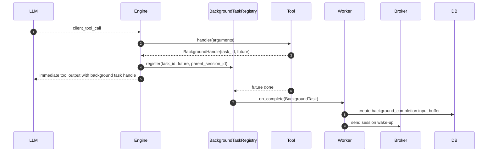
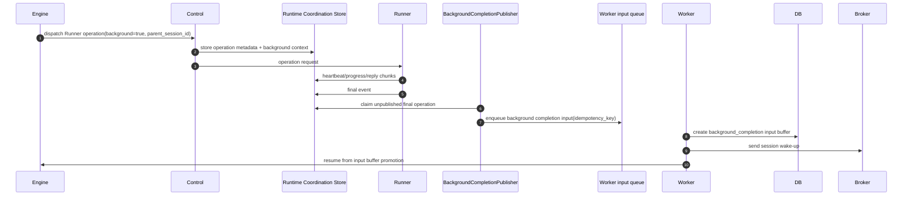

# Background Tool Call

## Overview

Background Tool Call is a flow that separates long-running work from parent AgentSession ReAct loop and injects completion result back into parent session. There are currently two implementation paths.

- Worker-local background task: existing function tool handler runs as `asyncio.Task` inside worker process and injects completion result into broker.
- Runtime background operation: Runner operation leaves background metadata, generation-scoped reply stream event, and final event in Runtime Coordination Store, and Control's background completion publisher puts completion message into Worker input queue.

Unlike normal tool call, both paths do not continue occupying current turn while LLM waits for result.

## Sequence

## Registry Contract

`BackgroundTaskRegistry` is worker process local registry. Each entry has following information.

- `task_id` — unique ID based on uuid7 hex.
- `parent_session_id` — AgentSession that spawned background task.
- `agent_id`, `workspace_id` — parent context for creating completion result input buffer.
- `tool_name` — tool name for status lookup and logs.
- `future` — actually running `asyncio.Task[str | FunctionToolResult]`.
- `started_at` — UTC start time.

When future completes, registry runs `on_complete` callback injected into constructor and removes entry from `_tasks` and `_by_session` regardless of success/failure.

## Cancellation

- `cancel(task_id)` calls `future.cancel()` and returns `True` when task exists in registry. Missing task returns `False`.
- `cancel_all_for_session(session_id)` cancels all running background tasks for parent session. Used for handling session-level events such as user stop and session deletion.
- `cancel_all()` requests cancel for all background tasks on worker shutdown.

## Durability Limits

Worker-local background registry is local to worker process. The task itself and in-flight future are not stored in DB. Durable data is function call/output already stored in parent session, and `background_completion` input buffer stored in parent session after completion. Therefore, background future running during process crash can be lost; work that must be rerun must be reconstructed from parent session history and run resume rules.

Runtime background operation stores Runner final event and operation metadata in Runtime Coordination Store, and background completion publisher claims publication with idempotency key before putting structured completion input into Worker input queue. Worker stores it as `background_completion` input buffer of parent AgentSession and sends session wake-up. Completion publication must be idempotent against Control replica restart/retry.

## Runtime Operation Completion

The message includes agent id, workspace id, runtime id, parent session id, operation id, request id, tool name, status, completion text, created time, and idempotency key.

## Related Specs

- Normal tool execution and event storage order follow [`agent-execution-loop.md`](agent-execution-loop.md).
- Resume semantics follow [`run-resume.md`](run-resume.md).
- Agent Runtime operation routing follows [`agent-runtime-control.md`](agent-runtime-control.md).
