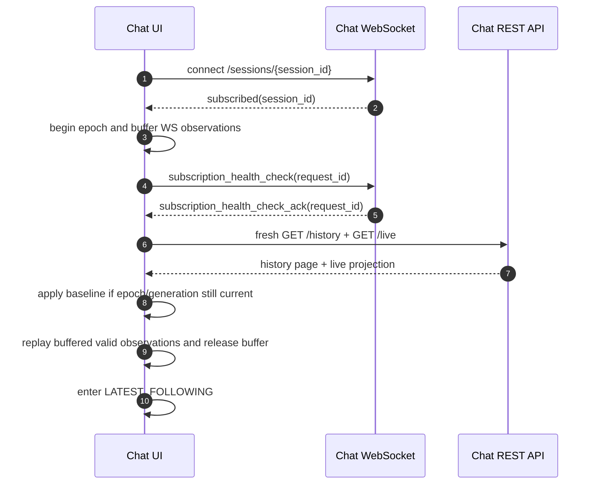

# Chat Session Resync

## 1. Overview

Chat session resync binds WebSocket session subscription and REST history/live baseline into one recovery flow. WebSocket open is not completion of session event delivery registration. Initial entry starts only after `subscribed`, and every baseline query starts after the resync transaction receives its matching `subscription_health_check_ack`.

Chat screen has two timeline states.

- `LATEST_FOLLOWING`: renders latest durable history tail and live state together.
- `DETACHED_HISTORY_BROWSING`: browses middle history window and does not render live state.

## 2. Preconditions

| Item | Requirement |
| --- | --- |
| Auth | WebSocket ticket or REST JWT must be valid. |
| Session access | Requester must be session workspace member. |
| Backend live source | `/live` must be able to read Redis live projections, `input_buffers`, running `agent_runs`, and active `action_executions`. |
| Frontend state | Session component is remounted by session key and does not share cross-session state. |

## 3. Initial Entry Sequence

## 4. WebSocket Contract

| Type | Direction | Fields | Meaning |
| --- | --- | --- | --- |
| `subscribed` | server → client | `session_id` | This connection has been registered as session delivery target. |
| `subscription_health_check` | client → server | `session_id`, `request_id` | Request to check current connection's session delivery registration state. |
| `subscription_health_check_ack` | server → client | `session_id`, `request_id` | health check barrier ack. |
| `history_event_appended` | server → client | `session_id`, `event` | persisted event append. |
| `live_event_upserted` | server → client | `session_id`, `event` | non-durable live event projection upsert. |
| `live_event_removed` | server → client | `session_id`, `event_id` | non-durable live projection removal. |
| `live_run_updated` | server → client | `session_id`, `run` | authoritative current Run projection replacement, including `run.operation` and `run.retry`. |
| `live_run_cleared` | server → client | `session_id`, `run_id` | removes the current run only when the terminal Run ID matches exactly. |
| `input_actions_updated` | server → client | `session_id` | composer action definitions changed; client reloads `/actions`. |
| `runtime_error` | server → client | `message` | user-facing runtime failure control. |
| `authorization_request` | server → client | `toolkit_id`, `toolkit_name` | integration authorization is required. |
| `account_link_nudge` | server → client | `toolkit_id`, `toolkit_name`, `toolkit_type` | integration account connection guidance. |
| `compaction_started` | server → client | `continuing` | transient compaction UI state begins. |
| `compaction_complete` | server → client | `continuing` | transient compaction UI state ends. |
| `todo_state_changed` | server → client | `todo` | session todo Toolkit State snapshot changed. |
| `action_execution_updated` | server → client | `session_id`, `action_execution` | Current live operation TurnAction execution projection changed, including status and progress events. |
| `action_execution_removed` | server → client | `session_id`, `action_execution_id` | The operation left live state after its terminal durable snapshot was committed. |
| `subagent_tree_changed` | server → client | `root_session_agent_id`, `changed_session_agent_id` | Subagent Tree projection invalidation signal; client refetches the dedicated tree API. |

The server sends `subscribed` only after the Redis session subscription is confirmed for the current
send-loop generation. A `subscription_health_check_ack` is emitted only while that same generation
still owns the confirmed subscription, including a second check under the WebSocket send lock. Client
does not query the history/live REST baseline before `subscribed`. If health check ack timeout or
socket close occurs, it switches to the ticket refresh/reconnect path.

Server-to-client delivery uses the canonical action envelopes and explicitly public control frames in
the table above. A durable Event is nested in `history_event_appended`; a raw top-level durable Event
is not public. Internal provider deltas and Run/runtime lifecycle telemetry are projected into
canonical live actions rather than broadcast directly. `history_event_appended` is append-only and
idempotent by event ID. A duplicate delivery preserves the existing timeline item and its position.
Run lifecycle or provenance changes do not republish an existing history event.

## 5. REST History Contract

`GET /chat/v1/sessions/{session_id}/history` returns only persisted events.

Query parameters:

| Parameter | Meaning |
| --- | --- |
| `limit` | 1~100 event page size. |
| `before` | event page older than this event id. |
| `after` | event page newer than this event id. |

If `before` and `after` are sent together, return 400.

Response fields:

| Field | Meaning |
| --- | --- |
| `items` | events sorted oldest to newest. |
| `has_more` | whether older events exist. |
| `has_newer` | whether newer events exist. |
| `next_cursor` | next older raw page cursor. |
| `previous_cursor` | next newer raw page cursor. |

Each response is a raw event page and owns both cursor values. The client stores raw events before
projecting view models, advances the direction cursor through render-hidden/control-only pages, and
stops only when a visible timeline item is added or that direction is exhausted. Selector identity is
stable across pages: assistant output uses native output identity or response/content indices,
reasoning uses native identity or its projection root, client tool call/result pairs use `call_id`, and
each provider tool call uses its own `call_id`. Client call/result pairs may merge across raw page
boundaries; provider calls require no result counterpart.

## 5.1 REST Live Contract

`GET /chat/v1/sessions/{session_id}/live` returns live state snapshot of current session, not durable history. Live state separates partial history and other live state.

Response fields:

| Field | Meaning |
| --- | --- |
| `partial_history.items` | ordered partial history projection list to synthesize after durable history, including current assistant/reasoning partials and provider-tool activity. |
| `input_buffers` | pending user input buffer projection list not yet injected into model turn. |
| `run` | currently running Run projection. `null` if absent. Includes profile provenance, nullable `model_call_started_at`, optional stable `run.operation` for context preparation, and optional `run.retry` with provider/runtime presentation kind, latest user-safe error, attempt count, retry budget, next retry timestamp, and bounded attempt history. |
| `session_run_state` | authoritative run state of session. |
| `todo` | session-scoped TodoToolkit State snapshot. `null` if absent. |
| `action_executions` | current nonterminal operation TurnAction execution projections, each with execution state and live progress events. Terminal completed, failed, and cancelled snapshots are recovered only from durable history events. |

`run.retry` represents only the active model turn's retry cycle. It remains present during backoff and
the in-flight retry model call so a reconnect can recover current progress. Its `error_kind` selects
provider versus runtime presentation without exposing provider identity or diagnostic taxonomy.
Successful model output admission clears the durable retry state in the output transaction, and the
next authoritative REST or WebSocket Run snapshot omits `run.retry`. A later turn or inference-profile
change cannot inherit an earlier completed turn's retry card.

`run.operation` is the reconnect-safe live operation for the active Run. Context preparation uses
`kind = preparing_context`, `status = running`, and one stable `operation_id` across provider retry and
backoff. Successful commit, failure exhaustion, cancellation, and User Stop remove the operation from
the authoritative Run replacement. Transient `compaction_started` and `compaction_complete` controls
may trigger reconciliation, but they are not the source of truth for the preparation indicator.

`snapshot` in REST write response follows same taxonomy. `snapshot.partial_history_events` is partial history projection list synthesized into chat timeline, `snapshot.input_buffer_events` is pending user input buffer projection list, `snapshot.todo` is same session todo snapshot, and `snapshot.action_executions` is the current nonterminal operation TurnAction projection list.

History events and live/pending event projections preserve immutable requested profile intent. They do not embed associated AgentRun summaries or change when run provenance changes. The dedicated live Run projection carries the current run's allowlisted inference summary. Unknown physical resolution is never derived from Composer or Agent defaults.

A valid non-null running `/live.run` projection overrides a contradictory Session idle field. For
frontend replacement, `run: null` is an explicit authoritative absence, while a malformed non-null
Run is an invalid observation that preserves the last valid Run and emits a diagnostic. WebSocket
observations advance a local generation, and each REST request records its start generation and
request epoch. A REST response replaces Run, partial history, input buffers, Todo, and action
executions only when no newer WebSocket observation or newer REST request has superseded it. Exact
`run_id` matching is also required for `RunComplete`, `RunStopped`, and `live_run_cleared`; a delayed
Run A event cannot clear active Run B.

Action execution progress is reconciled through `action_execution_updated` and the
`/live.action_executions` baseline. Clients upsert projections by execution ID. Completion, failure,
or cancellation atomically appends one durable `action_execution_result` snapshot and deletes the
matching live execution row and progress events. The server then publishes the durable history event
before `action_execution_removed`. Durable observation suppresses a matching live projection even if
a delayed live update or removal arrives out of order. Terminal operations have no retry/discard
mutation response.

Raw live partials remain separate from raw durable history until render selection. Assistant,
reasoning, provider-tool, client-tool, and internal-agent rows use semantic projection identity so a
durable history append replaces its live counterpart without duplicate frames or temporary
disappearance. Provider-tool live Events are keyed by stable `call_id`, restore the same deterministic
Event identity through `/live`, and carry provider-neutral status `running`, `completed`, or `failed`.
A missing live status is treated as running; a missing durable status remains the neutral historical
fallback. Durable provider calls preserve canonical status, semantic text/references, and only
`AttachmentOutputPart` files from semantic output; `FileOutputPart` remains model-only. Live
`agent_message` uses the same collapsed, source-labeled internal-agent row as the durable event.
Durable action execution results take precedence over any competing live projection.

## 5.2 REST Subagent Tree Contract

`GET /chat/v1/agents/{agent_id}/sessions/{session_id}/subagents/tree` returns the durable
Subagent Tree projection for the root tree containing the selected root or child session. It is a
separate resync surface from `/live`; `/live` does not embed the full tree. The response includes the
root `SessionAgent` id, root `AgentSession` id, current `SessionAgent` id, and nested tree nodes.

Each node contains the linked `agent_session_id` used for direct child detail routes, canonical path,
projected status, latest task/message preview, unread terminal result flag, latest run metadata,
terminal result source event id, terminal result message preview, and children. The unread terminal
result flag applies only to non-root child nodes because root sessions do not have a parent observer.
It remains true while a terminal result is only projected on the child Run, queued in the direct
parent mailbox, or observed by `wait_agent`; it becomes false only after the validated `agent_result`
is promoted into the direct parent's durable transcript and advances the monotonic observation cursor.
Projected status treats a parent-interrupted subtree as interrupted for all descendants that do not
have a newer terminal run. Siblings with message activity are sorted by their latest explicit
agent-to-agent message sent or received time, or terminal-result message time, newest first. Siblings without message activity follow
status order—running, failed/completed, interrupted, then pending/idle—with name as the stable
fallback. The parent-child hierarchy is never flattened by this ordering.

Refresh/reconnect must reconstruct tree state by refetching this endpoint from durable DB state.
While the Subagents tab is visible, the frontend also polls the endpoint every five seconds; session
detail views refetch on window focus. Full tree navigation lives in the Subagents tab; the chat top bar
does not expose a separate Subagent Tree drawer. Agent-message, run-lifecycle, and promotion-time
observation-cursor changes publish `subagent_tree_changed` to every SessionAgent view in the same tree,
and the frontend immediately invalidates cached tree queries. These events remain invalidation signals
rather than source-of-truth state. Child detail views also use the tree projection to render a compact
back button to the parent SessionAgent and an overflow menu with parent/root navigation options, so
users can move back up the session-agent tree directly from the child detail view. Child detail
composers are read-only for humans and render a disabled direct-input placeholder while preserving
the stop control for running child sessions; new instructions to a subagent must be sent by another agent through
the collaboration tools.

Durable and live `agent_message` events render in the chat timeline as collapsed, left-aligned
internal-agent rows labeled with the source SessionAgent name. Instruction and terminal `agent_result`
payloads use the same timeline item family; terminal status may appear as secondary metadata rather
than creating a separate result-card family. Expanding a row reveals the delivered safe message body;
it does not use the direct human user-message bubble treatment. Subagent navigation, tree, tab, and
internal-message surfaces use a robot icon as their representative symbol.

## 5.3 Composer Profile State

The Composer presents separate desktop Model and effort controls and a combined mobile control. Model choices come only from the Agent's selectable target labels. Effort options come from the selected target's normalized reasoning capabilities, but stored, decoded, and rendered effort values are opaque nullable strings. The frontend does not normalize or reject an unknown read-side string; backend submission and preparation remain authoritative for supported values. Switching to a target that does not support the current explicit effort visibly resets effort to Default.

Draft persistence and last-selected-profile persistence are separate agent/session-scoped entries. The draft stores message, selected action, target label, and nullable effort atomically. A successful normal send clears message/action draft data while retaining the selected target and raw effort as last selected. Restoration precedence is unsent draft profile, last-selected profile, durable/default profile, then Agent default. A deleted or unavailable stored target removes only that stale selection and falls through without deleting draft content. Edit mode initializes from the edited message's requested profile, does not overwrite normal Composer persistence, and restores the ordinary persisted draft when edit is cancelled or completed. Commands may display the current selection but submit a null profile.

## 6. Timeline State Rules

### LATEST_FOLLOWING

- Renders REST history tail and REST live state together.
- WS events are replayed on baseline, then applied in realtime.
- When the active root Session exposes `unread_terminal_run_id`, the client acknowledges that observed boundary only after a fresh latest history/live baseline has committed, the view is `READY`, the timeline is `LATEST_FOLLOWING`, and the document is visible. Route entry, failed/incomplete resync, hidden tabs, and detached history browsing never acknowledge. The acknowledgement invalidates both active Session detail and list projections; a newer terminal boundary remains unread when the request names an older Run.
- Can display pending input buffer, model response pending indicator, compaction indicator, todo preview, and compact action execution progress blocks. Nonterminal operation projections render at the live timeline tail immediately above pending input buffers and the composer, without using the consumed source buffer as a visual anchor. Terminal completed, failed, and cancelled blocks are reconstructed from durable `action_execution_result` history events and render at their transcript positions.
- Operation TurnAction execution is live progress, not model response pending state. It does not by itself replace the composer with a stop control or block new input.
- When `run.retry` is present, renders a failed-run retry card in latest-following state. The card shows the latest safe error, retry budget, client-side countdown to `next_retry_at`, and expandable attempt history; the normal model dots indicator remains below the card when the run phase is `waiting_for_model` or `streaming_model`.
- Terminal failed-run `system_error` history items render as one failed-run recovery card with the safe error message inside the card. The manual retry button is visible only when that failed-run event is the latest visible durable event and the session is idle.
- Human and actionable input rows show their immutable requested target/effort intent. Historical rows do not resolve or embed the associated run's physical model.
- Token/context usage prefers immutable provenance stored on the durable `turn_marker`: target label, raw nullable effort, display name, effective context window, and automatic-compaction threshold. For historical markers without provenance, a matching active live Run may supply the profile temporarily; otherwise provenance is unavailable and is never inferred from the newest message, current Session, Agent default, or Composer selection.
- Follow is active when the non-negative distance from the viewport bottom is at most 48px; negative iOS bounce is clamped to zero and remains inside the same boundary.
- When Follow is active, new timeline items, streaming resize, and visual viewport resize/scroll schedule a programmatic pin to bottom.
- If the viewport leaves the 48px boundary, immediately stop follow; subsequent new timeline items are rendered immediately but do not auto-scroll, and the “new message” control is displayed.
- A short programmatic-scroll guard prevents component-owned scrolling from cancelling follow, but explicit wheel, touch start/move, scrollbar pointer, or non-editable scroll-key intent cancels that guard immediately and wins over a scheduled pin.
- Clicking or keyboard-activating the semantic “new message” button reactivates follow and moves to bottom. Stop condition after that is the same.
- A saved non-follow position is restored by its distance from bottom independently of follow-entry hysteresis. Older raw pages continue loading as needed to reach that distance or until history is exhausted.
- Underfilled latest history automatically loads older raw pages without detaching until the viewport becomes scrollable or older history is exhausted; render-hidden pages do not stop the fill loop.
- Follow stop does not mean transition to `DETACHED_HISTORY_BROWSING` or WS live event buffering.
- When user actually loads older history pagination, transition to `DETACHED_HISTORY_BROWSING`.

### DETACHED_HISTORY_BROWSING

- Does not render live state. Todo preview is also treated as live state and hidden.
- Hides pending input buffers and live-only indicators, including nonterminal action execution progress; durable terminal action execution results remain in their history positions.
- WS durable or live observations do not mutate the visible detached history or detached live state. A durable append records only confirmed newer availability; live upserts/removals and live Run/action updates are ignored for detached rendering.
- A successful periodic/resume baseline may also confirm a newer durable gap by comparing the fresh latest cursor with the cursor saved on detach.
- The “new message” button is displayed only when a durable append or fresh latest cursor confirms an actual latest-direction gap, not by detached state or live-only activity itself.
- Scrolling up fetches older raw history with the page-owned `before` cursor.
- Scrolling down fetches newer raw history with the page-owned `after` cursor.
- When reaching a page with `has_newer=false`, perform a fresh latest reset.
- Clicking or keyboard-activating the “new message” button performs a fresh latest reset.

## 7. Browser Idle Resume and Periodic Reconcile

Chat client does not judge session subscription healthy only by WebSocket `readyState`. After mobile browser app background, other tab, PC sleep, page cache restore, or network recovery, WebSocket object may temporarily appear `OPEN` even when live event delivery is stale.

Client treats the following signals as browser idle return candidates.

| Signal | Meaning |
| --- | --- |
| `visibilitychange` to `visible` | current tab becomes visible again from hidden/background state. |
| `focus` | current window regains user focus. |
| `pageshow` | page instance is shown or restored from page cache. |
| `online` | browser returns to network online state. |
| timer drift | interval between JS timer ticks exceeds drift threshold, possible sleep/suspend. |

Resume candidate signals are merged into one finite resync transaction. Client applies an in-flight
guard and short throttle window to prevent duplicate lifecycle event bursts. Initial entry, periodic
reconcile, browser resume, compaction reload, and detached latest reset use the same transaction
boundary.

A resync transaction runs in this order.

1. Client enables WebSocket observation buffering and allocates a monotonically newer REST request epoch while recording the current applied-observation generation. The first owner starts with an empty buffer; a superseding transaction takes ownership of the existing buffered observations instead of dropping them.
2. Client sends exactly one `subscription_health_check` for the transaction.
3. After the matching `subscription_health_check_ack`, client performs a fresh imperative REST history/live query. Retained query-cache data is not a new baseline.
4. Client applies the response only if both its request epoch and starting observation generation are still current. A newer request or already-applied WebSocket observation supersedes the response.
5. In latest-following state, client replaces the latest baseline. In detached state, a periodic/resume transaction preserves the visible raw window and records only a confirmed newer cursor gap; an explicit latest transaction replaces the tail and returns to latest-following.
6. The transaction replays buffered valid observations in arrival order on top of an accepted baseline and disables buffering.

Health-check timeout, socket close, REST failure, or an inapplicable response cannot leave observations
trapped. The current buffer owner replays and disables buffering on every terminal failure path; a
superseded transaction leaves release to the newer transaction that took ownership. Health-check
failure also refreshes the ticket/reconnects because the subscription is no longer trusted. Malformed,
unknown, or wrong-session WebSocket frames are rejected individually before buffering. A malformed
frame or one reducer failure does not prevent later buffered valid frames from replaying.

Even when the screen stays visible for a long time, the client performs the same health-check-based
finite transaction periodically.

## 8. Error Cases

| Condition | Behavior |
| --- | --- |
| No WebSocket ticket | server closes 4001. |
| WebSocket ticket expired/error | server closes 4003. |
| Session access denied | server closes 4003 or REST 403. |
| Health check ack timeout | Client replays its owned buffer, stops buffering, and refreshes/reconnects because the subscription is not trusted. |
| Browser idle resume signal | Client starts one finite resync, enables observation buffering, then performs the health-check barrier and fresh REST query. |
| REST baseline failure | Client preserves the previous baseline, replays its owned observations, and stops buffering. |
| Superseded REST response | Client does not apply it; the newer transaction owns and eventually releases the shared buffer. |
| Malformed or wrong-session frame | Client rejects only that frame and continues processing later valid observations. |
| Timer drift threshold exceeded | Client treats it as a sleep/suspend return possibility and starts the same finite resync. |
| `before` and `after` both specified | REST 400. |
| Session absent | REST 404. |

## 9. Test Scenarios

**TC-1: Subscribe ack barrier**

- Given: existing session id and valid ticket.
- When: connect to WebSocket.
- Then: server registers Redis subscription and sends `subscribed`.

**TC-2: Initial finite baseline after barriers**

- Given: client received `subscribed` and enabled observation buffering.
- When: the matching health-check ack arrives and the client queries a fresh `/history` and `/live` baseline.
- Then: a valid WS observation arriving during the transaction is reflected without duplication through buffer replay, and buffering ends.

**TC-3: Recent cursor**

- Given: newest cursor in middle history window.
- When: call `/history?after=<cursor>`.
- Then: newer persisted events are returned oldest to newest and `has_newer` indicates latest tail state.

**TC-4: Follow boundary and new-message control**

- Given: timeline state is `LATEST_FOLLOWING` and scroll viewport is within 48px of bottom or in the clamped iOS bounce area.
- When: a new timeline item, streaming resize, or visual viewport change arrives.
- Then: client auto-scrolls to bottom.
- When: explicit wheel, touch, pointer, or scroll-key intent moves the viewport beyond 48px, including during a scheduled programmatic pin.
- Then: client immediately stops follow and renders WS history/live state without auto-scrolling.
- When: a new timeline item arrives while follow is stopped.
- Then: client displays the semantic “new message” button.
- When: user clicks the button or activates it from the keyboard.
- Then: client reactivates follow and moves to bottom.

**TC-5: Detached browsing hides live state**

- Given: live state is displayed at latest tail.
- When: user actually loads older history pagination.
- Then: timeline state transitions to `DETACHED_HISTORY_BROWSING` and pending input/live indicators are hidden.

**TC-6: New-message button latest reset**

- Given: timeline state is `DETACHED_HISTORY_BROWSING`.
- When: user clicks or keyboard-activates the “new message” button.
- Then: client queries a fresh latest history/live baseline and transitions to `LATEST_FOLLOWING`.

**TC-7: Periodic health check reconcile**

- Given: session screen is open while visible.
- When: 30-second reconcile timer runs.
- Then: client requeries REST baseline after `subscription_health_check_ack`.

**TC-8: Browser idle resume resync**

- Given: chat screen becomes active again after mobile browser background, other tab, PC sleep, page cache, or offline state.
- When: `visibilitychange`, `focus`, `pageshow`, `online`, or timer drift resume signal occurs.
- Then: client starts one finite resync transaction, buffers observations before its one health check, queries a fresh REST baseline after the ack, applies it only if epoch/generation remain current, and always releases the owned buffer.

**TC-9: Older history scroll does not imply new message**

- Given: session is stopped and no actual newer event exists.
- When: user scrolls up, loads older history, and transitions to `DETACHED_HISTORY_BROWSING`.
- Then: the “new message” button is not displayed.

**TC-10: Only durable confirmation marks newer while detached**

- Given: timeline state is `DETACHED_HISTORY_BROWSING`.
- When: live-only Run, partial, or action observations arrive.
- Then: visible detached state and newer availability remain unchanged.
- When: a durable history append arrives or a fresh baseline exposes a different latest cursor.
- Then: client records the latest-direction gap and displays the “new message” button.

**TC-11: Raw page advancement and cross-page identity**

- Given: one raw page contains only render-hidden control events and a client tool call/result pair crosses the next page boundary.
- When: client loads in either direction.
- Then: it advances the page-owned cursor through the hidden page and renders one merged tool row after the counterpart arrives.

**TC-12: Live-to-durable output promotion**

- Given: live assistant, reasoning, provider-tool, or internal-agent output is visible.
- When: the matching durable history append arrives before live removal.
- Then: durable projection replaces the semantic live counterpart without duplicate/disappearing rows, and provider-call status, semantic output, and canonical attachments remain visible.

**TC-13: Operation live-to-durable handover**

- Given: a live operation card is visible above pending input buffers.
- When: its completed, failed, or cancelled durable result arrives before or after `action_execution_removed`.
- Then: the live card disappears, exactly one durable card remains at the result event position, and a delayed live update with the same execution ID cannot recreate a duplicate.

**TC-14: Provider-tool activity resync and handover**

- Given: a provider emits observed hosted-tool activity before completing the model response.
- When: the running projection is received, `/live` is queried, the projection becomes completed, and the matching durable provider-tool event is appended.
- Then: one semantic card keeps the same `call_id` and live Event identity through resync and status updates, durable history is observed before live removal, and no provider-tool live projection remains after handover.

## 10. Invariants

- WebSocket open is not subscribe completion; `subscribed` and health-check ack require the current Redis-confirmed send-loop generation.
- Public WebSocket delivery uses canonical action envelopes plus the listed control frames; the server does not emit raw top-level durable Events or internal runtime telemetry.
- Every resync is a finite epoch/generation-guarded transaction with a fresh REST query and eventual release of its owned observation buffer.
- REST baseline is applied as latest source only after session subscription ack and a successful health check for that transaction.
- REST `/live` does not return aggregate event list and returns live state taxonomy snapshot split into `partial_history`, `input_buffers`, `run`, `session_run_state`, `todo`, and `action_executions`.
- `live_run_updated` and REST `/live.run` are the authoritative current Run snapshot sources; clients replace the stored Run rather than merging individual operation, retry, or profile fields.
- `run.operation` restores one stable context-preparation indicator across reconnect and retry; transient compaction controls do not reconstruct that state.
- `run.retry.error_kind` distinguishes provider presentation from runtime presentation without exposing provider identity or taxonomy.
- Requested inference intent is restored from durable/pending data, and unresolved physical provenance is never inferred from current Agent or Composer state.
- Usage provenance requires an exact run-id match.
- `action_execution_updated` and REST `/live.action_executions` are the authoritative nonterminal operation progress sources; clients upsert by execution ID and render live executions above pending input without requiring a transcript or buffer anchor.
- One stable execution ID joins live state to the durable `action_execution_result`; durable history wins deduplication, and `action_execution_removed` is an idempotent live-state removal signal.
- REST write `snapshot` does not return aggregate `live_events` and returns live state taxonomy snapshot split into `partial_history_events`, `input_buffer_events`, `run`, `session_run_state`, `todo`, and `action_executions`.
- Detached state does not synthesize or mutate live state below the history window; live-only observations do not confirm a newer durable gap.
- Entering detached state itself does not mean “new message” exists.
- Follow stop does not mean entering detached state or live event buffering.
- Follow uses one 48px non-negative bottom/bounce boundary; explicit wheel, touch, pointer, or scroll-key intent overrides programmatic pinning.
- Saved non-follow distance restoration and underfilled viewport loading may traverse multiple raw pages without using the 48px follow threshold as a restore target.
- Older history pagination prepend does not display the “new message” button.
- Browser idle return candidate signals are handled by WebSocket health check and fresh REST baseline convergence.
- Raw history pagination always returns events oldest to newest, keeps page-owned cursors even for render-hidden pages, and merges semantic output identity across page boundaries.
- Legacy aggregate `/messages` fallback is not used.
- Terminal worktree action execution results are chat history events of kind `action_execution_result`; clients reconcile in-progress action logs through `/live.action_executions` and `action_execution_updated`.
- Durable semantic projections override matching live assistant, reasoning, provider-tool, client-tool, internal-agent, and action-execution projections without duplicate rows.
- Provider-tool live projection identity is deterministic by `call_id`; canonical status updates do not create a second card, and durable history is published before live removal.
- Provider-call rendering preserves canonical status and semantic text/references, projects only canonical attachment output parts, and never renders model-only file output parts.
- The “new message” control is a semantic keyboard-accessible button.
- Subagent Tree state is restored from the dedicated tree endpoint; `subagent_tree_changed` only invalidates/refetches cached tree queries.
- Full Subagent Tree navigation is exposed through the Subagents tab without a duplicate chat top-bar drawer.
- Child subagent detail views are human read-only for input but retain stop controls for running child sessions.

## 11. Changelog

- **2026-07-19** — v36. Defined terminal `agent_result` timeline reuse, promotion-time unread clearing, and tree invalidation after observation cursor advancement.
- **2026-07-19** — v35. Removed the duplicate chat top-bar Subagent Tree drawer and kept full tree navigation in the Subagents tab.
- **2026-07-19** — v34. Replaced provider call/result merging with live-to-durable provider-call replacement and one-card canonical attachment projection.

- **2026-07-18** — v32. Added reconnect-safe context-preparation operation replacement and provider/runtime retry presentation discrimination.
- **2026-07-16** — v31. Added deterministic provider-tool live identity, canonical lifecycle status
  resync, and durable-before-live-removal handoff without duplicate cards.
- **2026-07-16** — v30. Limited live retry recovery to the active model turn and required successful output admission to remove durable retry state before later resync.
- **2026-07-14** — v29. Added current model-call start time to REST and WebSocket live Run replacement snapshots for elapsed-duration recovery.
- **2026-07-14** — v28. Defined active operation tail placement, explicit removal transport, stable-ID durable handover deduplication, cancelled terminal history, and detached durable-result rendering.
- **2026-07-13** — v27. Promoted confirmed-generation WebSocket barriers, finite fresh-baseline resync, detached observation isolation, raw-page projection identity, durable output promotion, and exact follow/accessibility behavior.
- **2026-07-12** — v26. Added resilient live snapshot ordering, exact terminal correlation, opaque effort handling, Composer last-selected persistence, and durable token provenance.
- **2026-07-12** — v25. Promoted buffer-keyed unanchored action progress, terminal success/failure history recovery, and removal of action retry/discard mutations.
- **2026-07-11** — v24. Kept resolved inference provenance run-owned, removed event-level summaries, and made duplicate history append delivery position-preserving.
- **2026-07-10** — v23. Added Composer profile restoration, requested/resolved provenance rendering, safe unresolved/failure behavior, and exact run-scoped usage attribution.
- **2026-07-10** — v22. Treated both sent and received agent messages as recent tree activity so the most recently contacted sibling appears first.
- **2026-07-10** — v21. Prioritized recent agent message senders within each sibling group and added periodic, focus, and lifecycle-event tree refresh.
- **2026-07-09** — v20. Rendered internal agent messages as collapsed source-labeled rows and standardized subagent surfaces on the robot icon.
- **2026-07-09** — v19. Documented Subagent Tree status propagation/sorting and disabled child detail input with retained stop control.
- **2026-07-09** — v18. Clarified child detail read-only behavior, compact back/menu navigation, and parent-agent task bubble rendering.
- **2026-07-09** — v17. Clarified non-root unread result semantics, child parent/root navigation, and `agent_message` timeline rendering.
- **2026-07-08** — v16. Added Subagent Tree resync contract, `subagent_tree_changed` invalidation semantics, and frontend tree cache convergence behavior.
- **2026-07-06** — v15. Removed session-initialization resync state and documented durable `action_execution_result` recovery.
- **2026-07-06** — v14. Added action-execution retry/discard mutation response reconciliation semantics.
- **2026-07-05** — v13. Added action execution WebSocket projection updates and anchored operation-progress rendering semantics.
- **2026-07-05** — v12. Added action execution projections to REST live/write snapshot resync behavior.
- **2026-07-05** — v11. Added failed-run retry live card, terminal recovery card, and live-run update/clear resync behavior.
- **2026-07-04** — v10. Removed existing-session Git worktree attachment from initialization resync behavior.
- **2026-07-04** — v8. Added initialization live/detail recovery and WebSocket setup projection actions.
- **2026-06-13** — v5. Added session todo state to REST live/write snapshot and WebSocket contract, and reflected UI rule that treats todo preview as live state.
- **2026-06-10** — v4. Removed aggregate live event list from `/live` and REST write snapshot, and reflected live state taxonomy contract separating partial history and input buffer.
- **2026-06-10** — v3. Limited follow to bottom/bottom bounce area and separated follow stop from detached/buffering. Narrowed resume resync buffering timing to immediately before REST baseline reload and made failure path replay buffered events.
- **2026-06-10** — v2. Added browser idle resume signal, timer drift-based resume resync, and “new message” chip display conditions in detached state.
- **2026-06-09** — v1. Documented subscribe ack, health check, bidirectional history cursor, and timeline ADT behavior based on ADR-0053.
