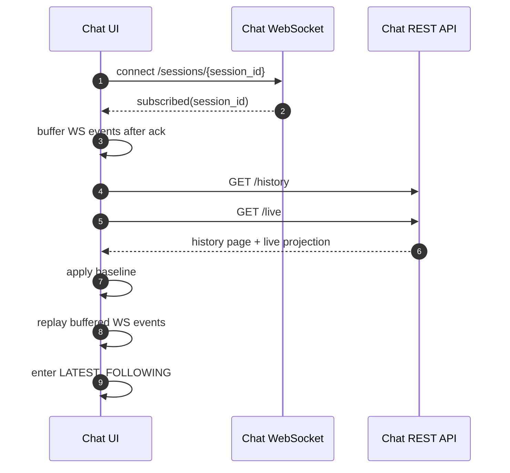

# Chat Session Resync

## 1. Overview

Chat session resync binds WebSocket session subscription and REST history/live baseline into one recovery flow. WebSocket open is not completion of session event delivery registration. Client queries REST baseline after receiving `subscribed` ack or `subscription_health_check_ack`.

Chat screen has two timeline states.

- `LATEST_FOLLOWING`: renders latest durable history tail and live state together.
- `DETACHED_HISTORY_BROWSING`: browses middle history window and does not render live state.

## 2. Preconditions

| Item | Requirement |
| --- | --- |
| Auth | WebSocket ticket or REST JWT must be valid. |
| Session access | Requester must be session workspace member. |
| Backend live source | `/live` must be able to read Redis live projections, `input_buffers`, running `agent_runs`. |
| Frontend state | Session component is remounted by session key and does not share cross-session state. |

## 3. Initial Entry Sequence

## 4. WebSocket Contract

| Type | Direction | Fields | Meaning |
| --- | --- | --- | --- |
| `subscribed` | server → client | `session_id` | This connection has been registered as session delivery target. |
| `subscription_health_check` | client → server | `session_id`, `request_id` | Request to check current connection's session delivery registration state. |
| `subscription_health_check_ack` | server → client | `session_id`, `request_id` | health check barrier ack. |
| `history_event_appended` | server → client | `session_id`, `event` | persisted event append. |
| `live_event_upserted` | server → client | `session_id`, `event` | non-durable live event projection upsert. |
| `live_event_removed` | server → client | `session_id`, `event_id` | non-durable live projection removal. |
| `live_run_updated` | server → client | `session_id`, `run` | authoritative current run projection replacement, including `run.retry`. |
| `live_run_cleared` | server → client | `session_id` | authoritative current run projection removal after terminal cleanup. |
| `input_actions_updated` | server → client | `session_id` | composer action definitions changed; client reloads `/actions`. |
| `todo_state_changed` | server → client | `todo` | session todo Toolkit State snapshot changed. |
| `session_initialization_updated` | server → client | `session_id`, `initialization` | Session initialization status or step projection changed. |
| `session_initialization_event_appended` | server → client | `session_id`, `event` | Durable initialization log event was appended. |
| `action_execution_updated` | server → client | `session_id`, `action_execution` | Current operation TurnAction execution projection changed, including status and durable progress events. |

Client does not query history/live REST baseline before `subscribed` ack. If health check ack timeout or socket close occurs, switch to ticket refresh/reconnect path.

## 5. REST History Contract

`GET /chat/v1/sessions/{session_id}/history` returns only persisted events.

Query parameters:

| Parameter | Meaning |
| --- | --- |
| `limit` | 1~100 event page size. |
| `before` | event page older than this event id. |
| `after` | event page newer than this event id. |

If `before` and `after` are sent together, return 400.

Response fields:

| Field | Meaning |
| --- | --- |
| `items` | events sorted oldest to newest. |
| `has_more` | whether older events exist. |
| `has_newer` | whether newer events exist. |
| `next_cursor` | next older page cursor. |
| `previous_cursor` | next newer page cursor. |

## 5.1 REST Live Contract

`GET /chat/v1/sessions/{session_id}/live` returns live state snapshot of current session, not durable history. Live state separates partial history and other live state.

Response fields:

| Field | Meaning |
| --- | --- |
| `partial_history.items` | ordered partial history projection list to synthesize after durable history. |
| `input_buffers` | pending user input buffer projection list not yet injected into model turn. |
| `run` | currently running run projection. `null` if absent. Includes `run.retry` with failed-run retry status, latest user-safe error, attempt count, retry budget, next retry timestamp, and bounded attempt history when retry is active. |
| `session_run_state` | authoritative run state of session. |
| `todo` | session-scoped TodoToolkit State snapshot. `null` if absent. |
| `initialization` | session initialization projection with status, timestamps, and steps. `null` only when no initialization row exists. |
| `action_executions` | current operation TurnAction execution projections, each with execution state and durable progress events. |

`snapshot` in REST write response follows same taxonomy. `snapshot.partial_history_events` is partial history projection list synthesized into chat timeline, `snapshot.input_buffer_events` is pending user input buffer projection list, `snapshot.todo` is same session todo snapshot, `snapshot.initialization` is the current setup projection, and `snapshot.action_executions` is the current operation TurnAction projection list.

`GET /chat/v1/sessions/{session_id}/initialization` returns the durable initialization projection plus ordered setup events. Clients use it to recover the full setup log after reconnect or when the live card requests details. The endpoint is separate from durable chat history because initialization events are setup telemetry, not transcript events.

## 6. Timeline State Rules

### LATEST_FOLLOWING

- Renders REST history tail and REST live state together.
- WS events are replayed on baseline, then applied in realtime.
- Initialization updates are reconciled by the same baseline/replay ordering: `/live.initialization` provides the latest projection, and initialization event detail can be reloaded from the detail endpoint.
- Can display pending input buffer, model response pending indicator, compaction indicator, todo preview, and compact action execution progress blocks. Action execution blocks render next to their durable action message or pending input buffer anchor; unanchored projections render after live input buffers as a recovery fallback.
- Operation TurnAction execution is live progress, not model response pending state. It does not by itself replace the composer with a stop control or block new input.
- When `run.retry` is present, renders a failed-run retry card in latest-following state. The card shows the latest safe error, retry budget, client-side countdown to `next_retry_at`, and expandable attempt history; the normal model dots indicator remains below the card when the run phase is `waiting_for_model` or `streaming_model`.
- Terminal failed-run `system_error` history items render as one failed-run recovery card with the safe error message inside the card. The manual retry button is visible only when that failed-run event is the latest visible durable event and the session is idle.
- Follow is active only when scroll viewport is at bottom or in iOS bottom bounce area.
- When Follow is active, new timeline item and streaming update automatically scroll to bottom.
- If scroll viewport leaves bottom/bounce area, immediately stop follow; subsequent new timeline items are rendered immediately but do not auto-scroll, and “new message” chip is displayed.
- Clicking “new message” chip reactivates follow and moves to bottom. Stop condition after that is same.
- Follow stop does not mean transition to `DETACHED_HISTORY_BROWSING` or WS live event buffering.
- When user actually loads older history pagination, transition to `DETACHED_HISTORY_BROWSING`.

### DETACHED_HISTORY_BROWSING

- Does not render live state. Todo preview is also treated as live state and hidden.
- Hides pending input buffer and live-only indicators, including action execution progress blocks.
- WS event is not immediately rendered until latest tail reset.
- “new message” chip is displayed only when actual latest-direction gap or buffered live event is confirmed, not by detached state itself.
- Scrolling up fetches older history with `before` cursor.
- Scrolling down fetches newer history with `after` cursor.
- When reaching page with `has_newer=false`, perform latest reset.
- Clicking “new message” chip performs latest reset.

## 7. Browser Idle Resume and Periodic Reconcile

Chat client does not judge session subscription healthy only by WebSocket `readyState`. After mobile browser app background, other tab, PC sleep, page cache restore, or network recovery, WebSocket object may temporarily appear `OPEN` even when live event delivery is stale.

Client treats the following signals as browser idle return candidates.

| Signal | Meaning |
| --- | --- |
| `visibilitychange` to `visible` | current tab becomes visible again from hidden/background state. |
| `focus` | current window regains user focus. |
| `pageshow` | page instance is shown or restored from page cache. |
| `online` | browser returns to network online state. |
| timer drift | interval between JS timer ticks exceeds drift threshold, possible sleep/suspend. |

Resume candidate signals are merged into one resume resync flow. Client applies in-flight guard and short throttle window to prevent duplicate lifecycle event bursts.

Resume resync flow runs in this order.

1. Client sends `subscription_health_check`.
2. When Server sends `subscription_health_check_ack`, client starts REST baseline reload.
3. Immediately before REST baseline reload, client turns on WS live event buffering and clears existing buffer.
4. Client queries REST `/history` and `/live` baseline again.
5. Client applies baseline according to current timeline state.
6. Client replays buffered WS events on top of baseline.
7. If health check ack timeout, failure, reload not started, or REST reload failure occurs, client immediately replays buffered WS events so live/history event is not trapped in buffer.
8. If health check ack timeout or failure occurs, client does not trust subscription and switches to ticket refresh/reconnect path.

Even when screen stays open visible for long time, perform same health check-based reconcile flow periodically.

If `LATEST_FOLLOWING`, apply reconcile result to latest baseline and replay buffered events. If `DETACHED_HISTORY_BROWSING`, do not render live state below history window and only keep chip state for newer event existence.

## 8. Error Cases

| Condition | Behavior |
| --- | --- |
| No WebSocket ticket | server closes 4001. |
| WebSocket ticket expired/error | server closes 4003. |
| Session access denied | server closes 4003 or REST 403. |
| Health check ack timeout | Client does not trust subscription and refreshes/reconnects ticket. |
| Browser idle resume signal | Client starts health check-based resume resync and buffers live WS events immediately before REST baseline reload. |
| Timer drift threshold exceeded | Client treats as sleep/suspend return possibility and resume resyncs. |
| `before` and `after` both specified | REST 400. |
| Session absent | REST 404. |

## 9. Test Scenarios

**TC-1: Subscribe ack barrier**

- Given: existing session id and valid ticket.
- When: connect to WebSocket.
- Then: server registers Redis subscription and sends `subscribed`.

**TC-2: Initial baseline after ack**

- Given: client received `subscribed` ack.
- When: client queries `/history` and `/live`.
- Then: WS event arriving during baseline application is reflected without duplication through buffer replay.

**TC-3: Recent cursor**

- Given: newest cursor in middle history window.
- When: call `/history?after=<cursor>`.
- Then: newer persisted events are returned oldest to newest and `has_newer` indicates latest tail state.

**TC-4: Follow boundary and chip**

- Given: timeline state is `LATEST_FOLLOWING` and scroll viewport is at bottom or bottom bounce area.
- When: new timeline item or streaming update arrives.
- Then: client auto-scrolls to bottom.
- When: user leaves bottom/bounce area.
- Then: client immediately stops follow and renders WS history/live event immediately but does not auto-scroll.
- When: new timeline item arrives while follow is stopped.
- Then: client displays “new message” chip.
- When: user clicks “new message” chip.
- Then: client reactivates follow and moves to bottom.

**TC-5: Detached browsing hides live state**

- Given: live state is displayed at latest tail.
- When: user actually loads older history pagination.
- Then: timeline state transitions to `DETACHED_HISTORY_BROWSING` and pending input/live indicators are hidden.

**TC-6: New message chip latest reset**

- Given: timeline state is `DETACHED_HISTORY_BROWSING`.
- When: user clicks “new message” chip.
- Then: client queries latest history/live baseline again and transitions to `LATEST_FOLLOWING`.

**TC-7: Periodic health check reconcile**

- Given: session screen is open while visible.
- When: 30-second reconcile timer runs.
- Then: client requeries REST baseline after `subscription_health_check_ack`.

**TC-8: Browser idle resume resync**

- Given: chat screen becomes active again after mobile browser background, other tab, PC sleep, page cache, or offline state.
- When: `visibilitychange`, `focus`, `pageshow`, `online`, or timer drift resume signal occurs.
- Then: client turns on WS live event buffering immediately before REST baseline reload after subscription health check, then resynchronizes.

**TC-9: Older history scroll does not imply new message**

- Given: session is stopped and no actual newer event exists.
- When: user scrolls up, loads older history, and transitions to `DETACHED_HISTORY_BROWSING`.
- Then: “new message” chip is not displayed.

**TC-10: Buffered live event marks newer while detached**

- Given: timeline state is `DETACHED_HISTORY_BROWSING`.
- When: WS live event is not immediately rendered and stored in buffer.
- Then: client can consider latest-direction gap exists and display “new message” chip.

## 10. Invariants

- WebSocket open is not subscribe completion.
- REST baseline is applied as latest source only after session subscription ack.
- REST `/live` does not return aggregate event list and returns live state taxonomy snapshot split into `partial_history`, `input_buffers`, `run`, `session_run_state`, `todo`, `initialization`, and `action_executions`.
- `live_run_updated` and REST `/live.run` are the authoritative current run snapshot sources; clients replace the stored run snapshot rather than merging individual retry fields.
- `action_execution_updated` and REST `/live.action_executions` are the authoritative current operation progress sources; clients upsert by execution id and render the progress next to the matching action-message or pending-buffer anchor.
- REST write `snapshot` does not return aggregate `live_events` and returns live state taxonomy snapshot split into `partial_history_events`, `input_buffer_events`, `run`, `session_run_state`, `todo`, `initialization`, and `action_executions`.
- Detached state does not synthesize live state below history window.
- Entering detached state itself does not mean “new message” exists.
- Follow stop does not mean entering detached state or live event buffering.
- Follow is active only at bottom or bottom bounce area, and stops immediately when leaving that area.
- Older history pagination prepend does not display “new message” chip.
- Browser idle return candidate signals are handled by WebSocket health check and REST baseline convergence.
- History pagination always returns page renderable oldest to newest.
- Legacy aggregate `/messages` fallback is not used.
- Initialization setup events are not chat history events; clients reconcile them through `/live`, initialization WebSocket actions, and `/sessions/{session_id}/initialization`.

## 11. Changelog

- **2026-07-05** — v13. Added action execution WebSocket projection updates and anchored operation-progress rendering semantics.
- **2026-07-05** — v12. Added action execution projections to REST live/write snapshot resync behavior.
- **2026-07-05** — v11. Added failed-run retry live card, terminal recovery card, and live-run update/clear resync behavior.
- **2026-07-04** — v10. Removed existing-session Git worktree attachment from initialization resync behavior.
- **2026-07-04** — v8. Added initialization live/detail recovery and WebSocket setup projection actions.
- **2026-06-13** — v5. Added session todo state to REST live/write snapshot and WebSocket contract, and reflected UI rule that treats todo preview as live state.
- **2026-06-10** — v4. Removed aggregate live event list from `/live` and REST write snapshot, and reflected live state taxonomy contract separating partial history and input buffer.
- **2026-06-10** — v3. Limited follow to bottom/bottom bounce area and separated follow stop from detached/buffering. Narrowed resume resync buffering timing to immediately before REST baseline reload and made failure path replay buffered events.
- **2026-06-10** — v2. Added browser idle resume signal, timer drift-based resume resync, and “new message” chip display conditions in detached state.
- **2026-06-09** — v1. Documented subscribe ack, health check, bidirectional history cursor, and timeline ADT behavior based on ADR-0053.
