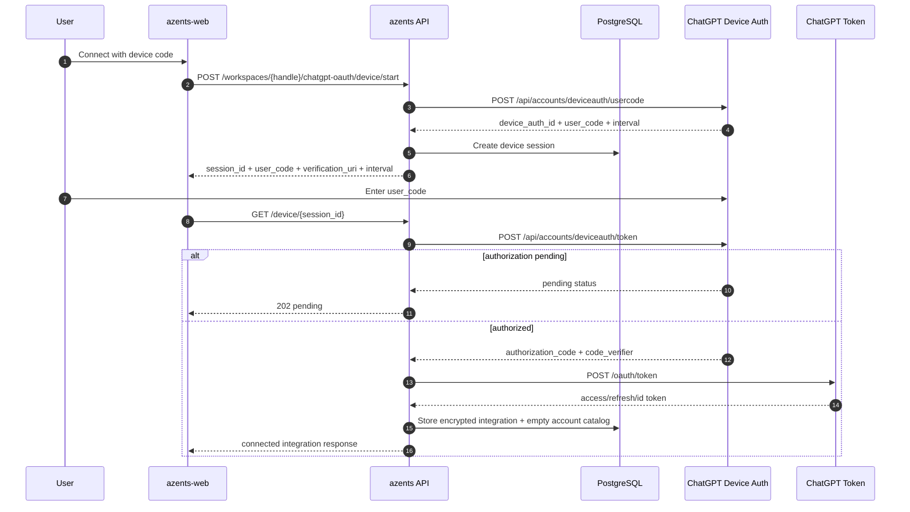
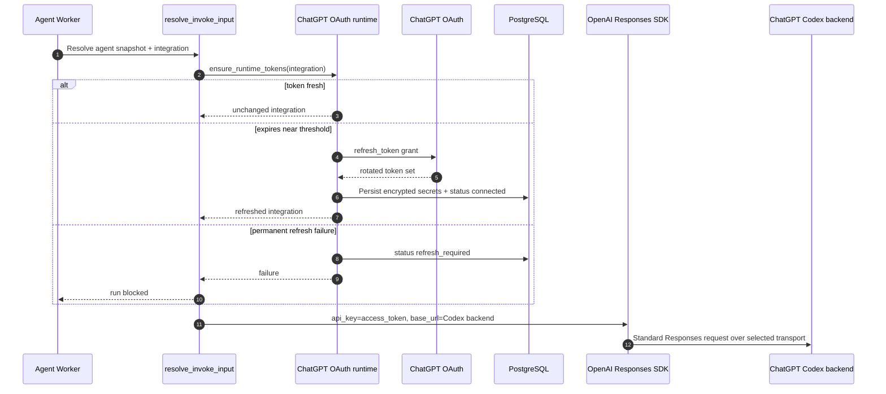

# ChatGPT OAuth Flow

## Overview

ChatGPT OAuth flow is provider connection flow that lets workspace run agent with ChatGPT subscription credential without OpenAI Platform API key. Provider enum is `chatgpt_oauth`, separate from OpenAI API key provider (`openai`).

This flow satisfies three requirements at once.

1. **Provider separation** — ChatGPT subscription token differs from OpenAI Platform API key in billing, base URL, and refresh lifecycle, so it is stored as separate `LLMProvider`.
2. **Single connection method** — Current public API supports only device flow. Browser callback path is not implemented, and reconnect also restarts same device flow.
3. **Runtime token freshness** — Before agent run starts, check access token expiry and perform refresh token grant if needed. Permanent failure surfaces as `refresh_required`.

## Provider Constants

Use provider endpoints grounded in Codex OAuth.

| Value | Current setting |
|---|---|
| issuer | `https://auth.openai.com` |
| client id | `app_EMoamEEZ73f0CkXaXp7hrann` |
| authorize | `https://auth.openai.com/oauth/authorize` |
| token | `https://auth.openai.com/oauth/token` |
| device user-code | `https://auth.openai.com/api/accounts/deviceauth/usercode` |
| device token | `https://auth.openai.com/api/accounts/deviceauth/token` |
| runtime base URL | `https://chatgpt.com/backend-api/codex` |

Callback authorize URL includes `id_token_add_organizations=true`, `codex_cli_simplified_flow=true`, and `originator=codex_cli_rs` in addition to basic PKCE query to match Codex OAuth grounding.

## Data Model

### Session

`ChatGPTOAuthSession` is intermediate state for device connection.

| Field | Meaning |
|---|---|
| `workspace_id`, `user_id` | session owner. Must match current member on exchange/poll |
| `device_auth_id` | device provider poll identifier. Not exposed in public response |
| `user_code` | user input code. May be displayed in device start response |
| `status` | session status family: `pending`, `connected`, `cancelled`, `expired`, `failed` |
| `expires_at` | session expiry |

### Integration secrets/config

After successful exchange, session converges into workspace `LLMProviderIntegration(provider=chatgpt_oauth)`.

```json
{
  "type": "chatgpt_oauth",
  "access_token": "...",
  "refresh_token": "...",
  "id_token": "...",
  "expires_at": "2026-05-02T08:00:00Z"
}
```

```json
{
  "type": "chatgpt_oauth",
  "account_id": "...",
  "email": "user@example.com",
  "plan_type": "plus",
  "connection_method": "device",
  "status": "connected",
  "last_refreshed_at": "2026-05-02T08:00:00Z",
  "last_failed_at": null,
  "last_failure_reason": null
}
```

Secrets are stored only in encrypted credentials. Config contains only non-secret metadata needed for UI display and recovery decisions.

## Device Flow



Rules:

- Device polling interval follows provider response.
- User cancel transitions session to terminal cancelled state with `DELETE /device/{session_id}`.
- When terminal status (`connected`, `cancelled`, `expired`, `failed`) is reached, frontend stops polling.
- `device_auth_id` is stored only in server-side session payload and is not exposed in public response.

## Account-scoped model catalog

The OAuth success transaction creates the integration and its empty account-scoped catalog together. Azents then queues the initial integration catalog sync. Integration updates and explicit picker sync use the same catalog service. The sync path refreshes the OAuth token when necessary, then requests:

```text
GET https://chatgpt.com/backend-api/codex/models?client_version=0.144.0
```

The request includes the connected account id and Azents client identity. Models are selectable only when backend metadata marks them API-supported and picker-visible. The backend model payload supplies reasoning, modality, context-window, and tool metadata. Request-dialect hints are not projected into normalized capabilities. A backend model remains selectable without a matching LiteLLM metadata key.

Picker reads use only the stored integration catalog and do not call ChatGPT. Before the first snapshot exists, the catalog returns an empty status-aware result; ChatGPT OAuth has no system-catalog fallback. Failed sync attempts preserve the last successful snapshot.

Catalog refresh does not mutate Agent or Workspace model selection snapshots. ChatGPT OAuth execution uses the standard Responses contract independently of catalog metadata copied into a saved model selection.

## Runtime Refresh and Execution



Rules:

- Refresh applies only to integrations whose provider is `chatgpt_oauth`.
- Transient provider failure is treated as retryable provider unavailable, and permanent rejection is stored as `refresh_required`.
- Concurrent refresh race rereads latest integration and does not overwrite with failure if token is already refreshed.
- Sampling, context compaction, and automatic Session title calls use the official OpenAI Python SDK.
  LiteLLM is not a ChatGPT OAuth transport fallback.
- Primary sampling prefers the persistent Responses WebSocket when
  `AZ_OPENAI_RESPONSES_WEBSOCKET_ENABLED` is enabled and the resolved base URL exactly matches the
  ChatGPT OAuth backend. One sampling execution opens the socket lazily, serially reuses it across its
  model/tool turns, and closes it on every execution exit. Context compaction and automatic Session
  title generation remain streaming HTTP operations.
- A classified WebSocket transport failure activates HTTP-only state for the resolved ChatGPT OAuth
  integration in the owning `SessionRunner` and fails through the shared failed-Run retry boundary.
  The next attempt sends the complete logical request over HTTP. There is no inline transport replay,
  separate WebSocket retry budget, or SDK automatic reconnect.
- `access_token` used in runtime requests is passed only as the OpenAI SDK `api_key`. The SDK client
  is scoped to one sampling execution, compaction operation, or title operation and closes with its
  active stream on every exit. Credentials, requests, responses, account headers, and provider
  request/response identifiers are not exposed in logs or API responses.
- The WebSocket handshake explicitly carries the connected `ChatGPT-Account-Id` and Azents client
  identity headers because the SDK HTTP client's default headers are not inherited by the Responses
  WebSocket connection.
- ChatGPT Codex backend does not allow Responses API server-side persistence, so runtime calls set
  `store=false`, request encrypted reasoning content for stateless replay, send complete logical
  input over either physical transport, and never use `previous_response_id`.
- Immediately before a `store=false` runtime call, omit top-level Responses input item `id` fields. Azents events and external ids remain preserved in the database, while provider response item ids are not replayed as stored references. Tool `call_id` values and reconstructed `image_generation_call.result` bytes remain in the request for stateless continuity.
- Typed terminal events, SDK exceptions, and transport failures use the common `ModelProviderFailure` contract only when their typed status or identifiers map to a known category. Only the bounded, redacted provider-authored reason may reach retry state, UI, or provider-failure logs. Every classified category receives the complete current Run retry budget; category and retryability remain diagnostic metadata. Unclassified outcomes raise through the ordinary internal-error path and do not create provider retry state or generic provider-error presentation.
- Runtime requests use `originator: azents`, an `azents/<version>` User-Agent, and the connected `ChatGPT-Account-Id` rather than impersonating Codex CLI identity.
- Sampling always uses the standard Responses contract regardless of model name or backend request-dialect hints. Tools remain in the top-level `tools` field and instructions remain in the top-level `instructions` field.
- Compaction and title generation use the same standard Responses dialect. They send ordinary user input plus top-level instructions, no sampling tools, and omit `max_output_tokens` while retaining `store=false`, encrypted reasoning inclusion, and common client identity headers.
- Completed SDK usage maps directly into the existing turn marker. `cost_usd` is a LiteLLM public
  price-map estimate based only on content-free usage metadata and represents API pricing rather than
  ChatGPT subscription billing; missing or invalid pricing leaves the estimate unset.

## API Surface

| Method | Path | Description |
|---|---|---|
| `POST` | `/llm-provider-integration/v1/workspaces/{handle}/chatgpt-oauth/device/start` | create device session |
| `GET` | `/llm-provider-integration/v1/workspaces/{handle}/chatgpt-oauth/device/{session_id}` | device poll |
| `DELETE` | `/llm-provider-integration/v1/workspaces/{handle}/chatgpt-oauth/device/{session_id}` | device cancel |

## Security Rules

- Token, authorization code, code verifier, and device auth id are not exposed in API response, UI, or log.
- OAuth session has workspace/user binding and expiry.
- Device poll/cancel verifies current member has same workspace/user as session owner.
- ChatGPT OAuth integration is not modified through generic API key edit form. Secrets are replaced only through reconnect flow.

## Testenv Coverage

| Scenario | Coverage |
|---|---|
| `TC-INT-CHATGPT-OAUTH-001` | device connect with mock provider |
| `TC-INT-CHATGPT-OAUTH-002` | refresh-before-run |
| `TC-INT-CHATGPT-OAUTH-003` | refresh_required block |
| `TC-INT-CHATGPT-OAUTH-004` | cross-workspace/user rejection |
| `TC-INT-CHATGPT-OAUTH-005` | token/device-auth-id redaction |
| `TC-INT-CHATGPT-OAUTH-006` | real ChatGPT device smoke, opt-in |

## Frontend UX Rules

- ChatGPT OAuth connection start is exposed as provider option in existing `Add integration` modal, not as separate provider panel at top of LLM Settings.
- Connected `chatgpt_oauth` integration row provides enable toggle, alias edit, and delete action same as other providers. Edit modal only changes alias, not OAuth secret re-entry.

## Changelog

| Date | Version | Change | Rationale |
|---|---|---|---|
| 2026-07-18 | 15 | Routed unclassified provider outcomes to internal-error handling without provider retry state | Preserve actionable incident tracebacks instead of generic unknown-provider logs |
| 2026-07-18 | 14 | Unified provider failures under the bounded common contract and full Run retry budget | ADR-0165 coordinated provider-failure cutover |
| 2026-07-17 | 13 | Classified typed terminal failures with bounded diagnostics and immediate finalization for deterministic provider errors | Avoid blind retries while preserving safe transient recovery |
| 2026-07-17 | 12 | Omitted provider item IDs from `store=false` replay while retaining tool call continuity and reconstructed generated-image results | ChatGPT stateless Responses wire contract |
| 2026-07-17 | 11 | Added execution-owned persistent WebSocket sampling with SessionRunner-scoped HTTP fallback while retaining HTTP compaction and title operations | [`adr/0150-openai-responses-websocket-lifecycle.md`](../../adr/0150-openai-responses-websocket-lifecycle.md) |
| 2026-07-16 | 10 | Standardized all ChatGPT OAuth calls on the public Responses request contract and removed catalog-driven Lite dialect selection | [`adr/0162-use-standard-responses-for-chatgpt-oauth.md`](../../adr/0162-use-standard-responses-for-chatgpt-oauth.md) |
| 2026-07-16 | 9 | Routed sampling, compaction, and title Responses HTTP through the official OpenAI SDK with full-context stateless ChatGPT requests | [`design/openai-compatible-responses-http-migration.md`](../../design/openai-compatible-responses-http-migration.md) |
| 2026-07-14 | 8 | Removed the system-catalog fallback and made the account catalog transactional with OAuth integration creation | `python/apps/azents/src/azents/services/chatgpt_oauth/__init__.py` |
| 2026-07-12 | 7 | Added account-scoped model discovery and saved-capability-driven Responses Lite lowering | [`design/chatgpt-responses-lite-catalog.md`](../../design/chatgpt-responses-lite-catalog.md) |
| 2026-06-16 | 5 | Updated runtime refresh sequence from Agent model selection snapshot → Integration resolve | [`adr/0063-agent-model-selection-snapshot.md`](../../adr/0063-agent-model-selection-snapshot.md) |
| 2026-05-17 | 4 | Updated runtime refresh sequence from Agent static provider model resolve to ModelConfig → Integration resolve | [`design/dynamic-llm-model-configs.md`](../../design/dynamic-llm-model-configs.md) |
| 2026-05-09 | 3 | Reflected that current public API implements only device flow and removed callback flow descriptions | `python/apps/azents/src/azents/api/public/chatgpt_oauth/v1/__init__.py` |
| 2026-05-06 | 2 | Reverified that Agent File Exchange Storage change does not alter ChatGPT OAuth provider credential/runtime call rules | [`design/agent-file-exchange-storage.md`](../../design/agent-file-exchange-storage.md) |
| 2026-05-03 | 1 | Added LLM Settings UX rules for ChatGPT OAuth connection start and alias edit | `typescript/apps/azents-web/src/features/llm-settings/components/LlmSettings.tsx` |
| 2026-05-03 | 1 | Remove input item top-level `id` from ChatGPT OAuth `store=false` Responses request | Legacy SDK runtime path, superseded by event adapter |
| 2026-05-03 | 1 | Specify `store=false` condition for runtime Responses call | Legacy SDK runtime path, superseded by event adapter |
| 2026-05-28 | 5 | Updated ChatGPT OAuth runtime integration to event LiteLLM Responses adapter code path | `python/apps/azents/src/azents/engine/events/**` |
| 2026-05-03 | 1 | Include Codex OAuth grounding query in Callback authorize URL | `python/apps/azents/src/azents/services/chatgpt_oauth/__init__.py` |
| 2026-05-02 | 1 | Wrote current spec for ChatGPT OAuth callback/device/runtime refresh | `docs/azents/design/chatgpt-oauth-provider.md` |
