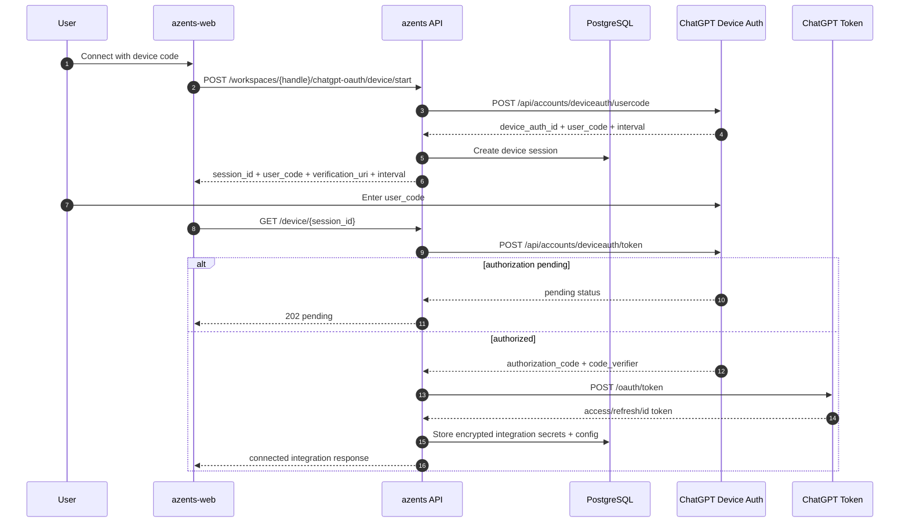
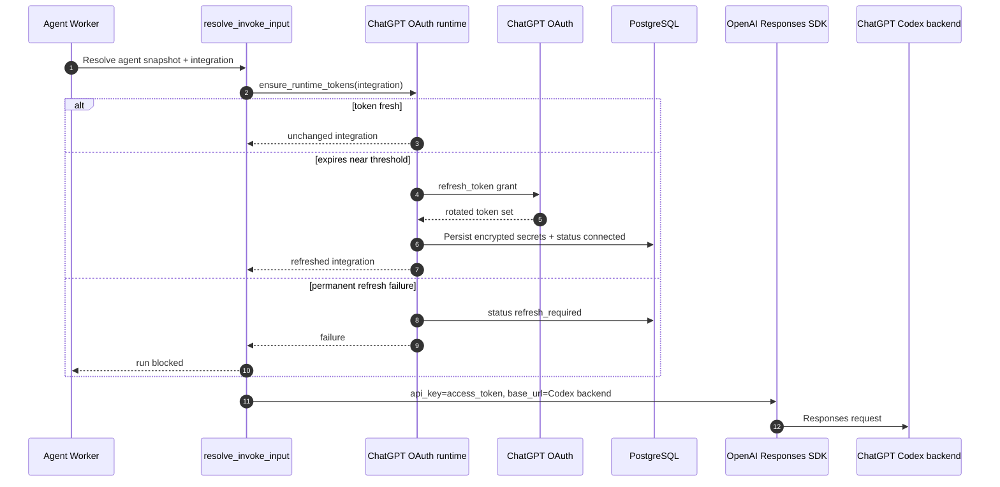

# ChatGPT OAuth Flow

## Overview

ChatGPT OAuth flow is provider connection flow that lets workspace run agent with ChatGPT subscription credential without OpenAI Platform API key. Provider enum is `chatgpt_oauth`, separate from OpenAI API key provider (`openai`).

This flow satisfies three requirements at once.

1. **Provider separation** — ChatGPT subscription token differs from OpenAI Platform API key in billing, base URL, and refresh lifecycle, so it is stored as separate `LLMProvider`.
2. **Single connection method** — Current public API supports only device flow. Browser callback path is not implemented, and reconnect also restarts same device flow.
3. **Runtime token freshness** — Before agent run starts, check access token expiry and perform refresh token grant if needed. Permanent failure surfaces as `refresh_required`.

## Provider Constants

Use provider endpoints grounded in Codex OAuth.

| Value | Current setting |
|---|---|
| issuer | `https://auth.openai.com` |
| client id | `app_EMoamEEZ73f0CkXaXp7hrann` |
| authorize | `https://auth.openai.com/oauth/authorize` |
| token | `https://auth.openai.com/oauth/token` |
| device user-code | `https://auth.openai.com/api/accounts/deviceauth/usercode` |
| device token | `https://auth.openai.com/api/accounts/deviceauth/token` |
| runtime base URL | `https://chatgpt.com/backend-api/codex` |

Callback authorize URL includes `id_token_add_organizations=true`, `codex_cli_simplified_flow=true`, and `originator=codex_cli_rs` in addition to basic PKCE query to match Codex OAuth grounding.

## Data Model

### Session

`ChatGPTOAuthSession` is intermediate state for device connection.

| Field | Meaning |
|---|---|
| `workspace_id`, `user_id` | session owner. Must match current member on exchange/poll |
| `device_auth_id` | device provider poll identifier. Not exposed in public response |
| `user_code` | user input code. May be displayed in device start response |
| `status` | session status family: `pending`, `connected`, `cancelled`, `expired`, `failed` |
| `expires_at` | session expiry |

### Integration secrets/config

After successful exchange, session converges into workspace `LLMProviderIntegration(provider=chatgpt_oauth)`.

```json
{
  "type": "chatgpt_oauth",
  "access_token": "...",
  "refresh_token": "...",
  "id_token": "...",
  "expires_at": "2026-05-02T08:00:00Z"
}
```

```json
{
  "type": "chatgpt_oauth",
  "account_id": "...",
  "email": "user@example.com",
  "plan_type": "plus",
  "connection_method": "device",
  "status": "connected",
  "last_refreshed_at": "2026-05-02T08:00:00Z",
  "last_failed_at": null,
  "last_failure_reason": null
}
```

Secrets are stored only in encrypted credentials. Config contains only non-secret metadata needed for UI display and recovery decisions.

## Device Flow



Rules:

- Device polling interval follows provider response.
- User cancel transitions session to terminal cancelled state with `DELETE /device/{session_id}`.
- When terminal status (`connected`, `cancelled`, `expired`, `failed`) is reached, frontend stops polling.
- `device_auth_id` is stored only in server-side session payload and is not exposed in public response.

## Account-scoped model catalog

After a device connection succeeds, Azents queues an initial integration catalog sync. Integration updates and explicit picker sync use the same catalog service. The sync path refreshes the OAuth token when necessary, then requests:

```text
GET https://chatgpt.com/backend-api/codex/models?client_version=0.144.0
```

The request includes the connected account id and Azents client identity. Models are selectable only when backend metadata marks them API-supported and picker-visible. The backend model payload supplies the normalized `use_responses_lite` capability plus reasoning, modality, context-window, and tool metadata. A backend model remains selectable without a matching LiteLLM metadata key.

Picker reads use the stored integration catalog and do not call ChatGPT. Before the first integration snapshot exists, the existing ChatGPT system catalog is the fallback. Failed sync attempts preserve the last successful snapshot.

Catalog refresh does not mutate Agent or Workspace model selection snapshots. Runtime transport selection uses the compatibility capability copied into the saved model selection when the user selects the model.

## Runtime Refresh and Execution



Rules:

- Refresh applies only to integrations whose provider is `chatgpt_oauth`.
- Transient provider failure is treated as retryable provider unavailable, and permanent rejection is stored as `refresh_required`.
- Concurrent refresh race rereads latest integration and does not overwrite with failure if token is already refreshed.
- `access_token` used in runtime request is passed only as OpenAI SDK `api_key`. It is not exposed in logs/API responses.
- ChatGPT Codex backend does not allow Responses API server-side persistence, so runtime calls set `store=false` and request encrypted reasoning content for stateless replay.
- Immediately before a `store=false` runtime call, mask top-level Responses input item `id` values. Azents events and external ids remain preserved in the database, while provider response item ids are not replayed as stored references.
- Runtime requests use `originator: azents`, an `azents/<version>` User-Agent, and the connected `ChatGPT-Account-Id` rather than impersonating Codex CLI identity.
- A saved model capability with `responses_lite=false` uses the standard Responses contract regardless of model name.
- A saved model capability with `responses_lite=true` moves tools and instructions into developer input items, strips image detail fields, disables parallel tool calls, sets reasoning context to `all_turns`, uses the Azents session id as prompt cache key and affinity id, and sends the fixed Responses Lite compatibility version and header.
- Responses Lite failures follow the normal model-call error path. Runtime does not retry with the standard Responses contract.

## API Surface

| Method | Path | Description |
|---|---|---|
| `POST` | `/llm-provider-integration/v1/workspaces/{handle}/chatgpt-oauth/device/start` | create device session |
| `GET` | `/llm-provider-integration/v1/workspaces/{handle}/chatgpt-oauth/device/{session_id}` | device poll |
| `DELETE` | `/llm-provider-integration/v1/workspaces/{handle}/chatgpt-oauth/device/{session_id}` | device cancel |

## Security Rules

- Token, authorization code, code verifier, and device auth id are not exposed in API response, UI, or log.
- OAuth session has workspace/user binding and expiry.
- Device poll/cancel verifies current member has same workspace/user as session owner.
- ChatGPT OAuth integration is not modified through generic API key edit form. Secrets are replaced only through reconnect flow.

## Testenv Coverage

| Scenario | Coverage |
|---|---|
| `TC-INT-CHATGPT-OAUTH-001` | device connect with mock provider |
| `TC-INT-CHATGPT-OAUTH-002` | refresh-before-run |
| `TC-INT-CHATGPT-OAUTH-003` | refresh_required block |
| `TC-INT-CHATGPT-OAUTH-004` | cross-workspace/user rejection |
| `TC-INT-CHATGPT-OAUTH-005` | token/device-auth-id redaction |
| `TC-INT-CHATGPT-OAUTH-006` | real ChatGPT device smoke, opt-in |

## Frontend UX Rules

- ChatGPT OAuth connection start is exposed as provider option in existing `Add integration` modal, not as separate provider panel at top of LLM Settings.
- Connected `chatgpt_oauth` integration row provides enable toggle, alias edit, and delete action same as other providers. Edit modal only changes alias, not OAuth secret re-entry.

## Changelog

| Date | Version | Change | Rationale |
|---|---|---|---|
| 2026-07-12 | 7 | Added account-scoped model discovery and saved-capability-driven Responses Lite lowering | [`design/chatgpt-responses-lite-catalog.md`](../../design/chatgpt-responses-lite-catalog.md) |
| 2026-06-16 | 5 | Updated runtime refresh sequence from Agent model selection snapshot → Integration resolve | [`adr/0063-agent-model-selection-snapshot.md`](../../adr/0063-agent-model-selection-snapshot.md) |
| 2026-05-17 | 4 | Updated runtime refresh sequence from Agent static provider model resolve to ModelConfig → Integration resolve | [`design/dynamic-llm-model-configs.md`](../../design/dynamic-llm-model-configs.md) |
| 2026-05-09 | 3 | Reflected that current public API implements only device flow and removed callback flow descriptions | `python/apps/azents/src/azents/api/public/chatgpt_oauth/v1/__init__.py` |
| 2026-05-06 | 2 | Reverified that Agent File Exchange Storage change does not alter ChatGPT OAuth provider credential/runtime call rules | [`design/agent-file-exchange-storage.md`](../../design/agent-file-exchange-storage.md) |
| 2026-05-03 | 1 | Added LLM Settings UX rules for ChatGPT OAuth connection start and alias edit | `typescript/apps/azents-web/src/features/llm-settings/components/LlmSettings.tsx` |
| 2026-05-03 | 1 | Remove input item top-level `id` from ChatGPT OAuth `store=false` Responses request | Legacy SDK runtime path, superseded by event adapter |
| 2026-05-03 | 1 | Specify `store=false` condition for runtime Responses call | Legacy SDK runtime path, superseded by event adapter |
| 2026-05-28 | 5 | Updated ChatGPT OAuth runtime integration to event LiteLLM Responses adapter code path | `python/apps/azents/src/azents/engine/events/**` |
| 2026-05-03 | 1 | Include Codex OAuth grounding query in Callback authorize URL | `python/apps/azents/src/azents/services/chatgpt_oauth/__init__.py` |
| 2026-05-02 | 1 | Wrote current spec for ChatGPT OAuth callback/device/runtime refresh | `docs/azents/design/chatgpt-oauth-provider.md` |
